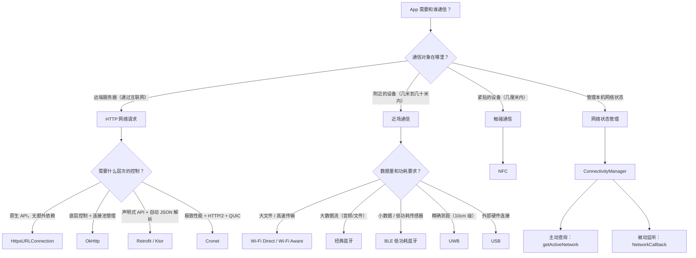
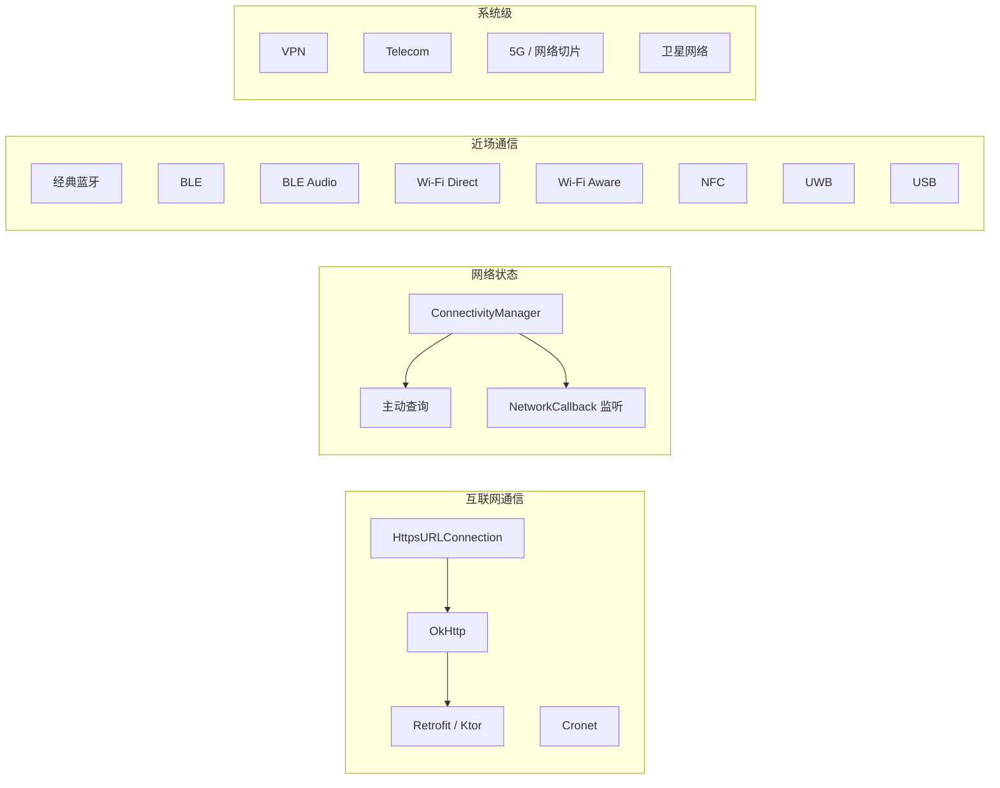

## 13.1.1 连接指南

霜降了。

洛芙从帐篷里探出头的时候，看见草叶上结了一层白粉似的薄霜。呼出的气变成一小团白色，在空气里停了两秒，散了。

营地旁边的枫树一夜之间红了最后一批叶子。有几片掉下来，落在她昨晚放在外面的保温杯盖上，橘红色，边缘微微卷起。

"今天好冷……"她缩着脖子爬出来，发现黛琳已经坐在观景台的折叠桌旁了。

观景台是她们前几天发现的好地方。就在营地上方二十米左右的山坡上，一块突出的平台，可以俯瞰整个山谷——远处的湖面，近处的树林，山脊线上灰蓝色的天空。今天的晨雾只剩一缕，像没系好的围巾搭在山腰上。

黛琳面前摊着折叠白板，手里捏着两支不同颜色的马克笔。

"早。"黛琳没抬头，"可可在壶里。"

洛芙给自己倒了一杯，捧在手心里，热度透过杯壁渗进指尖。她凑过去看黛琳在白板上写的东西——

"Connectivity"。

就这一个词，写在白板正中央，下面还什么都没有。

"这是……"

"今天的主题。"黛琳终于抬头看她，"你的 App 迟早要和外面的世界说话。我们该认识一下 Android 给你准备的所有通信工具了。"

希尔踩着碎叶从帐篷那边跑上来，手里举着电脑，围巾歪歪斜斜地挂在脖子上。

"听到了！Connectivity！今天画地图！"

伊莎跟在后面，走得慢一些，手里端着自己的可可。她在洛芙旁边坐下来，把杯子放在桌上，朝白板看了一眼。

"一个词，"她说，"但后面跟着一整片森林。"

---

洛芙吹了吹杯口的热气。

"我知道连接大概是什么意思——手机上网、蓝牙传文件、NFC 刷公交卡之类的。但 Android 官方文档里把这些全放在同一个 Connectivity 目录下……我不太确定它们之间到底是什么关系。"

"问得好。"希尔放下电脑，从黛琳手里接过红色马克笔，在白板上"Connectivity"下面画了一条横线。

"Android 官方把 Connectivity 分成了这些区域——"

她开始写，一边写一边说：

"**网络操作**。就是你的 App 通过互联网和服务器通信——发 HTTP 请求、下载数据、管理网络状态。这是最常用的。"

笔尖在白板上吱嘎响了一声。

"**Wi-Fi**。不只是'连 Wi-Fi 上网'这一件事——还包括 Wi-Fi Direct 点对点连接、Wi-Fi Aware 近距离发现设备、Wi-Fi RTT 测量距离，以及网络服务发现。"

"测量距离？"洛芙歪了歪头。

"等会儿再说。"希尔继续写。

"**蓝牙**。经典蓝牙传大数据、BLE 低功耗蓝牙传小数据、BLE Audio 低功耗音频。"

"**NFC**。碰一碰就能通信，两厘米以内。"

"**5G**。不只是'更快的网'，还有网络切片、GSMA 开发者最佳实践。"

"**UWB**——超宽带。精确测距，比蓝牙还准。"

"**USB**。对，USB 也算 Connectivity——你的手机可以作为 USB 主机或 USB 附件，跟外部设备通信。"

"**VPN**。App 可以提供 VPN 服务。"

"**Telecom**。管理音频和视频通话。"

"**Ranging**——跨技术测距。"

"**受限卫星网络**。"

"**Cronet**——Google 提供的高性能网络引擎。"

"还有，**省电策略**。怎么在保持连接的同时不把电池吃光。"

希尔放下笔，退后一步看着白板。

洛芙数了数。

"十三个……"

"十三个方向，"黛琳说，"每个方向下面还有好多子课题。但今天我们只画地图，不走进每条路。"

枫叶又落了一片，无声地贴在白板架子的腿上。

---

黛琳把白板翻到干净的一面。

"让我画一张完整的图，"她拧开蓝色笔帽，"你先看全貌，再逐个认识。"

她画了大约三分钟。洛芙抱着杯子安静地等，偶尔抬头看一眼远处山脊上慢慢消散的雾。一只灰喜鹊从枫树上飞过，翅膀扇出的风让几片叶子跟着转了个圈。

"好了。"

```mermaid
graph TD
    ROOT["Android Connectivity 体系"]

    ROOT --> NET["网络操作<br/>Perform network operations"]
    ROOT --> WIFI["Wi-Fi"]
    ROOT --> BT["蓝牙 Bluetooth"]
    ROOT --> NFC_G["NFC 近场通信"]
    ROOT --> FIVEG["5G"]
    ROOT --> UWB_G["UWB 超宽带"]
    ROOT --> USB_G["USB"]
    ROOT --> VPN_G["VPN"]
    ROOT --> TEL["Telecom 通话管理"]
    ROOT --> RANGE["Ranging 测距"]
    ROOT --> SAT["受限卫星网络"]
    ROOT --> CRONET["Cronet 网络引擎"]
    ROOT --> BATTERY["省电策略"]

    NET --> NET1["连接网络"]
    NET --> NET2["管理网络用量"]
    NET --> NET3["读取网络状态"]
    NET --> NET4["优化网络访问"]

    WIFI --> WIFI1["Wi-Fi 扫描"]
    WIFI --> WIFI2["Wi-Fi Direct P2P"]
    WIFI --> WIFI3["Wi-Fi Aware"]
    WIFI --> WIFI4["Wi-Fi RTT 测距"]
    WIFI --> WIFI5["网络服务发现 NSD"]
    WIFI --> WIFI6["Wi-Fi Easy Connect"]
    WIFI --> WIFI7["Wi-Fi 基础设施"]

    BT --> BT1["经典蓝牙"]
    BT --> BT2["BLE 低功耗蓝牙"]
    BT --> BT3["BLE Audio"]

    TEL --> TEL1["通话管理 API"]
    TEL --> TEL2["来电过滤"]
    TEL --> TEL3["eSIM 检测"]
```



*图 1：Android Connectivity 技术全景图——从互联网通信到近场交互，从通话管理到卫星网络，所有"连接"能力的完整索引。*

洛芙看着这张图，嘴巴微微张开。

"这么多……"

"所以才需要一张地图，"伊莎把可可杯转了半圈，"迷路的人不需要更多路，需要的是一张图。"

---

"好，一个一个来，"黛琳坐正身子，"先从最核心的开始。"

**网络操作（Perform network operations）**——App 通过互联网和远端服务器通信，是绝大多数 App 都会用到的能力。

"这一块的核心问题就三个，"黛琳竖起三根手指，但很快又放下来，端起杯子喝了一口，"第一，怎么发请求。第二，怎么知道现在有没有网。第三，怎么省着用网。"

"发请求的部分，"希尔接过来，"Android SDK 自带一个 `HttpsURLConnection`，可以直接用。但实际项目里，大家更常用第三方库——OkHttp、Retrofit 或者 Ktor。"

"它们有什么区别？"

"HttpsURLConnection 是系统原生的，不需要额外依赖，但 API 比较底层，写起来繁琐。OkHttp 封装了连接复用、超时重试、HTTPS 这些底层细节。Retrofit 又在 OkHttp 之上加了一层，用接口和注解来描述 API，自动帮你拼请求、解析 JSON。Ktor 是 JetBrains 出的，跟 Kotlin 协程配合很好。"

洛芙在脑子里排了排："所以是 `HttpsURLConnection → OkHttp → Retrofit`，一层包一层？"

"差不多。"希尔点头，"后面我们会详细讲每个。"

"知道有没有网这件事，"黛琳说，"Android 提供了 **ConnectivityManager**。你可以主动查询当前网络状态，也可以注册一个 **NetworkCallback** 被动监听——网络变了，系统会通知你。"

"省着用网呢？"

"比如让用户选择'只在 Wi-Fi 下同步'，避免后台频繁下载，用缓存减少重复请求。这些策略在后面的章节会专门讲。"

远处的湖面上有一小团雾还没散，太阳慢慢把它烧薄了。

"另外，"希尔补充，"Google 还提供了一个叫 **Cronet** 的网络引擎——基于 Chromium 的网络栈，支持 HTTP/2、QUIC 协议，能有效降低延迟、提高吞吐量。如果你的 App 对网络性能要求很高，可以考虑它。"

"Cronet……"洛芙在平板上记了一笔，"听起来像是给赛车换了个涡轮增压引擎。"

希尔笑起来。

---

伊莎站起身，走到白板旁边，指着 Wi-Fi 那一栏。

"接下来，"她说，"Wi-Fi 的世界比大多数人想象的要大。"

洛芙一直以为 Wi-Fi 就是"连热点上网"，但白板上画了七个子项。

"**Wi-Fi 扫描**，"伊莎说，"你的 App 可以扫描附近的 Wi-Fi 接入点，获取 SSID、信号强度、安全类型这些信息。"

"**Wi-Fi Direct**，也叫 P2P——两台设备不经过路由器，直接用 Wi-Fi 协议建立连接。传文件、局域网游戏、临时热点共享都可以用。"

"**Wi-Fi Aware**，Android 8.0 开始支持——让附近的设备互相发现、互相通信，不需要连同一个 Wi-Fi 网络，也不需要互联网。它比 Wi-Fi Direct 更灵活，更省电，适合'先发现再连接'的场景。"

"跟蓝牙发现有什么区别？"洛芙问。

"Wi-Fi Aware 的传输速度比蓝牙快得多，带宽更大，"黛琳说，"但功耗也更高。选哪个取决于你要传多少数据。"

"还有 **Wi-Fi RTT**，"伊莎继续，"RTT 是 Round-Trip Time 的缩写——通过测量 Wi-Fi 信号往返时间来计算设备和接入点之间的距离。精度可以到一两米。"

洛芙眨了眨眼。

"所以可以用 Wi-Fi 做室内定位？"

"对。GPS 在室内不好使，Wi-Fi RTT 可以弥补这个空白。"

风从山谷方向吹上来，带着湖水微凉的气息。

"剩下的——**网络服务发现（NSD）**，用来在局域网里发现其他设备提供的服务，比如打印机、媒体服务器。**Wi-Fi Easy Connect** 简化了设备配网流程——扫一个二维码就能让新设备加入网络。**Wi-Fi 基础设施**涵盖了 Passpoint、接入点建议这些更底层的功能。"

"Wi-Fi 这一块子课题真多……"洛芙嘟囔着。

"所以后面会有专门的章节逐个拆开讲，"黛琳说，"今天只要记住地图上这些名字在哪个位置就好。"

---

希尔把围巾绕紧了一圈，搓了搓手，凑到白板旁边。

"轮到蓝牙了。"

"Android 的蓝牙支持三种模式，"她在白板上圈出三个词，"**经典蓝牙（Bluetooth Classic）**、**低功耗蓝牙（Bluetooth LE，也叫 BLE）**、还有 **BLE Audio**。"

"经典蓝牙适合传大量数据——音乐文件、大文档。功耗高，但带宽也大。你用无线耳机听音乐，大概率走的是经典蓝牙。"

"BLE 正好相反——传输量小，但功耗极低。健康手环、心率传感器、温度监测器这些东西用的就是 BLE。它会间歇性地发送一小段数据，其余时间处于休眠状态。"

"BLE Audio 是比较新的标准，"黛琳补充，"用更低的功耗达到更高的音质。还支持多流音频——比如一副耳机左右两边分别接收独立音频流。"

"蓝牙要注意的是权限，"希尔的语气严肃了一点，"Android 12 做了一次重大调整。12 以前，蓝牙扫描需要位置权限，因为蓝牙信号可以用来定位。12 开始，新增了 `BLUETOOTH_SCAN`、`BLUETOOTH_CONNECT` 和 `BLUETOOTH_ADVERTISE` 三个独立权限，终于把蓝牙和位置分开了。"

"做蓝牙功能必须做版本适配，"黛琳说，"旧版本声明旧权限，新版本声明新权限——两套都要写在 Manifest 里。"

洛芙把"蓝牙权限 Android 12 分水岭"记在平板上，重重画了一条线。

---

"NFC，"伊莎从座位上探出身子，用手指在空气中轻轻点了一下，像碰了什么东西，"碰一下，就说完了。"

"NFC 是 Near Field Communication，近场通信，"黛琳说，"通信距离非常短，四厘米以内。速度不快，但安全性高——因为你必须把设备贴到很近才能通信。"

"支付、公交卡、门禁卡，"希尔数着，"还有快速配对——比如把手机靠近一个新的蓝牙音箱，NFC 触发配对流程，不用手动搜索。"

"Android 的 NFC 支持包括基础的标签读写、高级的 P2P 数据交换、还有**主机卡模拟（HCE）**——让你的手机本身变成一张 NFC 卡。"

"就是手机变成公交卡那种？"

"对。"

一片枫叶落在洛芙的平板屏幕上。她捡起来，夹进了旁边的笔记本里。

---

"接下来几个比较短，"希尔说，"但都要知道它们存在。"

"**5G**，"她指着白板，"对 App 开发者来说，5G 不只是'网速更快了'。Android 提供了网络切片（Network Slicing）的支持——运营商可以把 5G 网络切成不同的逻辑通道，比如一条给视频通话、一条给物联网。你的 App 可以请求特定的网络切片来获得更好的服务质量。"

"还有 GSMA 发布的 5G 开发者最佳实践文档，"黛琳补充，"里面有很多针对高带宽、低延迟场景的建议。"

"**UWB——超宽带通信**，"希尔换了一支笔，"比蓝牙和 Wi-Fi 都更精确的测距技术，精度可以到 10 厘米级别。"

"10 厘米？"洛芙的眼睛大了一圈。

"对。适合做精确的空间定位——比如找车钥匙、引导用户走到某个精确位置、或者判断两个人是不是面对面站着。"

"**USB**，"希尔继续，"你的 Android 设备可以作为 USB **主机**（Host）连接外部设备——键盘、摄像头、MIDI 乐器；也可以作为 USB **附件**（Accessory）被另一个设备控制。"

太阳又升高了一点，远处湖面上的最后一缕雾终于彻底散了。

"**VPN**，"黛琳说，"Android 提供了 `VpnService` API，允许 App 创建自己的 VPN 连接。企业级 App 经常需要这个功能——员工通过 VPN 连接公司内网。"

"**Telecom**，"希尔摸了摸围巾，"这是 Android 的通话管理框架。如果你要做一个 VoIP 应用——比如微信的语音通话、Zoom 的视频会议——你需要跟系统的 Telecom 框架打交道，管理来电通知、通话状态、音频路由这些事情。"

"还有来电过滤、号码拦截、eSIM 卡检测、通话重定向……"

洛芙的笔越写越快。

"**Ranging**，"伊莎轻声说，"跨技术测距。Android 提供了统一的 API，让你可以通过蓝牙、Wi-Fi RTT、UWB 中的任意一种——或者组合——测量设备之间的距离。"

"所以 Ranging 是一个统一的入口，底下可以调用不同的测距技术？"

"对。开发者不用关心底层用的是哪种信号，API 帮你选最合适的。"

"最后一个，"黛琳看着白板的角落，"**受限卫星网络**。这是比较新的领域——当手机不在蜂窝网络覆盖范围内时，通过卫星链路进行有限的通信。Android 为这种极端场景提供了框架支持。"

洛芙放下笔，看着写满了密密麻麻笔记的平板。

"呼……"她长长地吐了一口气。

---

黛琳看着她，平静地说："别急。这就是一张地图而已。你不需要今天就走遍每条路。"

"但我需要知道每条路通向哪里，"洛芙说，"对吧？"

"对。"黛琳微微笑了一下。

"那……最基本的一件事，"洛芙合上平板看着黛琳，"我的 App 怎么知道现在有没有网？在做所有网络操作之前，这不是第一步吗？"

"是第一步。"黛琳转身在白板上写下一行字：`ConnectivityManager`。

"这是 Android 系统提供的网络状态管理服务。你通过它可以做两件事——主动查询当前网络状态，或者注册回调被动监听网络变化。"

希尔把电脑打开，说："来看最基本的用法。"

```kotlin
// 检查当前网络状态
// 需要权限：<uses-permission android:name="android.permission.ACCESS_NETWORK_STATE" />
// 无需额外依赖，使用 Android SDK 原生 API

import android.content.Context
import android.net.ConnectivityManager
import android.net.NetworkCapabilities

object NetworkChecker {
    // 检查当前是否有可用且已验证的网络连接
    // context: Android 上下文对象，用于获取系统服务
    // 返回 true 表示可以正常访问互联网
    fun isOnline(context: Context): Boolean {
        val cm = context.getSystemService(Context.CONNECTIVITY_SERVICE) as ConnectivityManager
        val network = cm.activeNetwork ?: return false
        val caps = cm.getNetworkCapabilities(network) ?: return false
        return caps.hasCapability(NetworkCapabilities.NET_CAPABILITY_INTERNET)
            && caps.hasCapability(NetworkCapabilities.NET_CAPABILITY_VALIDATED)
    }
}
```

"注意两个 Capability，"黛琳指着屏幕，"`NET_CAPABILITY_INTERNET` 表示这个网络声称自己能联网，`NET_CAPABILITY_VALIDATED` 表示系统已经验证过它确实能联网。两个都检查才可靠——否则你连上了一个需要登录的酒店 Wi-Fi，前者返回 true，但实际上你什么都请求不到。"

洛芙点头。

"这段代码只是主动查一次，"希尔说，"但你的 App 运行过程中网络随时可能变——用户从 Wi-Fi 切到蜂窝、进了电梯断网、又出来恢复了。所以更好的做法是用 **NetworkCallback** 实时监听。"

```kotlin
// 监听网络状态变化（实时通知）
// 需要权限：ACCESS_NETWORK_STATE

import android.net.ConnectivityManager
import android.net.Network
import android.net.NetworkCapabilities
import android.net.NetworkRequest

class NetworkMonitor(context: Context) {
    private val cm =
        context.getSystemService(Context.CONNECTIVITY_SERVICE) as ConnectivityManager

    private val callback = object : ConnectivityManager.NetworkCallback() {
        override fun onAvailable(network: Network) {
            // 有可用网络时触发
        }

        override fun onLost(network: Network) {
            // 网络断开时触发
        }

        override fun onCapabilitiesChanged(network: Network, caps: NetworkCapabilities) {
            val validated = caps.hasCapability(NetworkCapabilities.NET_CAPABILITY_VALIDATED)
            // 网络能力变化（如 Wi-Fi → 蜂窝）时触发
        }
    }

    fun startListening() {
        val request = NetworkRequest.Builder()
            .addCapability(NetworkCapabilities.NET_CAPABILITY_INTERNET)
            .build()
        cm.registerNetworkCallback(request, callback)
    }

    fun stopListening() {
        cm.unregisterNetworkCallback(callback)
    }
}
```

"注册了就要注销，"黛琳说，"在 Activity 销毁或 ViewModel 清理的时候调用 `stopListening()`，否则会内存泄漏。"

洛芙盯着代码看了一会儿，然后抬起头。

"所以发请求之前先检查网络状态，运行过程中持续监听变化——这两件事合在一起，App 就不会在断网的时候傻乎乎地一直请求了。"

"对。"

山谷那边传来几声清脆的鸟叫，像有人在敲很小的铃铛。

---

"来看一个坏例子，"希尔忽然把电脑转了个方向让大家都能看见，"这是洛芙可能写出来的代码。"

"喂！"洛芙抗议。

"没有恶意，"希尔笑着，"但这种错新手确实很容易犯。"

```kotlin
// ❌ 反模式：不检查网络状态就直接发请求
class WeatherActivity : AppCompatActivity() {
    override fun onCreate(savedInstanceState: Bundle?) {
        super.onCreate(savedInstanceState)

        // 没有检查网络，没有切换线程，直接在主线程请求
        val url = URL("https://api.weather.com/today")
        val connection = url.openConnection() as HttpsURLConnection
        val data = connection.inputStream.bufferedReader().readText()  // 阻塞主线程
        textView.text = data
    }
}
```

"这段代码有两个致命问题，"黛琳说，"第一，没有检查网络状态——断网时直接崩溃。第二，在主线程执行网络请求——Android 会抛出 `NetworkOnMainThreadException`，哪怕有网也崩。"

希尔打出了重构版本：

```kotlin
// ✅ 正确：先检查网络，用协程在后台线程执行，ViewModel 管理状态
class WeatherViewModel(application: Application) : AndroidViewModel(application) {
    private val _weather = MutableLiveData<String>()
    val weather: LiveData<String> = _weather

    fun loadWeather() {
        // 先检查网络状态
        if (!NetworkChecker.isOnline(getApplication())) {
            _weather.value = "当前无网络连接"
            return
        }

        viewModelScope.launch {
            val result = withContext(Dispatchers.IO) {
                try {
                    val url = URL("https://api.weather.com/today")
                    val conn = url.openConnection() as HttpsURLConnection
                    conn.inputStream.bufferedReader().readText()
                } catch (e: Exception) {
                    "请求失败：${e.message}"
                }
            }
            _weather.value = result
        }
    }
}
```

"区别，"黛琳逐条说，"第一，加了网络检查。第二，网络操作放在 `Dispatchers.IO` 线程池，不阻塞主线程。第三，用 ViewModel 管理数据，Activity 重建不会重复请求。第四，异常捕获——网络随时可能超时或断开。"

洛芙把两段代码反复看了三遍，用手指在屏幕上比对。

"上面那个是什么都没想就直接干，下面这个是先想清楚再动手……"

黛琳没说话，只是点了点头。

---

太阳把观景台晒暖了。

洛芙解开外套的一个扣子，靠在椅背上，再看了一遍白板上的全景图。

"我有个问题，"她说，"这些技术里——网络请求、Wi-Fi、蓝牙、NFC、UWB——它们怎么选？什么时候用哪个？"

"好问题。"黛琳重新拿起笔。



*图 2：Android Connectivity 技术选型决策树——根据通信对象的位置、数据量、功耗要求选择最合适的技术。*

"没有'最好的'，只有'最合适的'，"伊莎说。

洛芙盯着这张图，手指慢慢地从上往下划。

"远端用 HTTP，近处用 Wi-Fi 或蓝牙，贴着用 NFC，想知道网络状况用 ConnectivityManager……"

"如果需要做 VoIP 通话，用 Telecom API。如果要建 VPN 隧道，用 VpnService。如果要让 App 更省电地使用网络，看省电策略那一章。"

"每种技术解决的问题不一样，"黛琳把笔帽盖上，"选技术之前先回答三个问题——数据要走多远、数据量有多大、对实时性和功耗的要求是什么。这三个问题想清楚了，选型自然就出来了。"

---

洛芙关掉平板，抬头看着远处。

山脊线在深秋的阳光下变成了一道清晰的暗蓝色轮廓。湖面平静得像一面镜子，倒映着天空和两岸的红叶。

她把杯子里最后一口凉掉的可可喝掉。

"以前觉得'连接'就是'连网'，"她说，"现在才发现，网只是其中一条路。"

黛琳把白板上的全景图拍了一张照片，发到她们的群聊里。

"地图画完了，"她说，"后面我们一条路一条路地走。"

希尔已经开始收拾东西了，围巾总算系正了。她回头看了一眼白板。

"不过说真的，"她笑着说，"能把十三个方向装在一张白板上，这白板够大。"

枫叶又落了几片。风把它们送到观景台边缘，有一片掉下去了，旋转着落向山谷。

---

### 技术总结

*Android Connectivity（连接）—— Android 为应用提供的完整通信能力体系，涵盖互联网通信（HTTP 客户端）、网络状态管理（ConnectivityManager）、Wi-Fi 系列技术（Direct / Aware / RTT）、蓝牙（Classic / BLE / BLE Audio）、NFC、5G、UWB、USB、VPN、Telecom、Ranging、卫星网络、Cronet 网络引擎及省电策略，帮助 App 实现与远端服务器或近场设备的安全、高效通信。*

---

#### 今日关键词

**ConnectivityManager**：Android 系统提供的网络状态管理服务，可主动查询当前网络类型和连通性，也可通过 NetworkCallback 被动监听网络变化。

**NetworkCapabilities**：描述网络能力的对象。`NET_CAPABILITY_INTERNET` 表示网络声称可联网，`NET_CAPABILITY_VALIDATED` 表示已验证确实能联网。两者同时检查才可靠。

**HttpsURLConnection**：Android SDK 原生的 HTTP 客户端，不需要额外依赖，但 API 较底层。

**OkHttp**：Square 开发的开源 HTTP 客户端库，封装连接复用、超时重试、HTTPS 等底层细节。

**Retrofit**：基于 OkHttp 的声明式 HTTP 客户端，用接口 + 注解描述 API，自动构建请求和解析响应。

**Cronet**：Google 提供的高性能网络引擎，基于 Chromium 网络栈，支持 HTTP/2、QUIC 协议。

**Bluetooth Classic（经典蓝牙）**：高带宽蓝牙协议，适合音频和大文件传输，功耗较高。

**Bluetooth LE（低功耗蓝牙 / BLE）**：低功耗蓝牙协议，适合传感器等小数据量场景，间歇发送数据。

**BLE Audio**：低功耗蓝牙音频标准，用更低功耗实现高质量音频传输，支持多流音频。

**Wi-Fi Direct（P2P）**：设备间不经路由器直接建立 Wi-Fi 连接的协议，速度快，适合大文件传输。

**Wi-Fi Aware**：Android 8.0+ 支持的近距离设备发现和通信技术，不需要连接同一网络或互联网。

**Wi-Fi RTT（Round-Trip Time）**：通过 Wi-Fi 信号往返时间计算设备与接入点距离，精度 1-2 米，用于室内定位。

**NFC（Near Field Communication）**：通信距离 4cm 以内的近场通信技术，用于支付、门禁、快速配对。

**NSD（Network Service Discovery）**：局域网内服务发现机制，用于查找打印机、媒体服务器等设备。

**UWB（Ultra-Wideband）**：超宽带通信，测距精度可达 10cm 级别，用于精确空间定位。

**5G 网络切片（Network Slicing）**：运营商将 5G 网络分为不同逻辑通道，App 可请求特定切片获得差异化服务质量。

**VpnService**：Android 提供的 VPN 服务 API，允许 App 创建和管理 VPN 连接。

**Telecom 框架**：Android 的通话管理框架，用于管理 VoIP、视频通话的来电通知、通话状态和音频路由。

**Ranging**：Android 提供的统一测距 API，底层可调用蓝牙、Wi-Fi RTT、UWB 等不同测距技术。

**NetworkOnMainThreadException**：在主线程执行网络操作时系统抛出的异常（Android 4.0+），强制开发者将网络操作移至后台线程。

---

#### 结构图



*图说明：Connectivity 技术按通信距离和功能领域分为四大组——互联网通信、网络状态管理、近场通信、系统级服务。其中 HTTP 客户端呈层次递进关系（原生 → OkHttp → Retrofit），近场通信各技术并列但适用场景不同。*

---

#### 复杂度与影响

- **HTTP 客户端选型**：HttpsURLConnection 零依赖但代码冗长；OkHttp 增加约 700KB 包体积但大幅简化网络代码；Retrofit 在 OkHttp 之上再增加约 120KB，换来声明式 API 和自动 JSON 解析。
- **NetworkCallback 线程安全**：NetworkCallback 的回调在非主线程执行，如需更新 UI 必须切换到主线程（`lifecycleScope.launch` 或 `runOnUiThread`）。
- **Wi-Fi RTT 精度**：理论精度 1-2 米，实际受墙壁、人体遮挡影响，室内定位场景建议结合多个接入点三角定位。
- **BLE 扫描功耗**：持续扫描 BLE 设备会快速消耗电量，应使用 `ScanFilter` 缩小范围并及时停止扫描。

---

#### 反模式与陷阱

**陷阱 1：不检查网络状态就发请求**
症状：断网时 App 直接崩溃或无限等待超时。
修复：请求前调用 `ConnectivityManager` 检查网络状态，并用 `NetworkCallback` 持续监听变化，断网时做降级处理。

**陷阱 2：在主线程执行网络操作**
症状：`NetworkOnMainThreadException` 崩溃，或 UI 冻结触发 ANR。
修复：所有网络操作放在 `withContext(Dispatchers.IO)` 协程中，或使用 Retrofit 的 `suspend` 函数。

**陷阱 3：只检查 NET_CAPABILITY_INTERNET 不检查 VALIDATED**
症状：连上需要登录的 Wi-Fi（酒店/机场），检查返回"有网"，但请求全部超时。
修复：同时检查 `NET_CAPABILITY_INTERNET` 和 `NET_CAPABILITY_VALIDATED`。

**陷阱 4：注册 NetworkCallback 后忘记注销**
症状：Activity 销毁后回调仍触发，导致空指针异常和内存泄漏。
修复：在 `onDestroy()` 或 `ViewModel.onCleared()` 中调用 `unregisterNetworkCallback()`。

**陷阱 5：在 Android 12+ 仍使用旧蓝牙权限模型**
症状：蓝牙扫描和连接功能在新设备上静默失败。
修复：Manifest 中同时声明新旧权限，运行时按 `Build.VERSION.SDK_INT` 判断请求哪组。

---

#### 名词小传

**OkHttp / Retrofit**：均由 Square 公司开发，分别于 2013 年发布。OkHttp 是 Android 生态中最广泛使用的 HTTP 客户端，Retrofit 以 OkHttp 为底层实现。

**Wi-Fi Direct**：Wi-Fi Alliance 于 2010 年发布的标准，允许设备不经接入点直接通信，最高传输速度可达 250 Mbps。

**UWB**：Apple 的 U1 芯片和 Samsung Galaxy S21+ 是较早支持 UWB 的消费设备，Android 从 Android 12 开始提供 UWB API。

---

#### 连接的哲学：为不同距离的信任选择合适的通道

Android 的 Connectivity 体系背后有一个清晰的设计理念：**通信方式的选择取决于通信距离、数据量和安全需求三者的平衡**。

实践建议：

1. 选技术前先回答三个问题——数据要走多远？数据量有多大？对实时性和功耗的要求是什么？
2. 互联网通信优先使用成熟的 HTTP 客户端库（Retrofit / OkHttp），不要自己从 Socket 层造轮子。
3. 所有网络操作必须在后台线程执行，在 ViewModel 中管理，不在 Activity 里直接写网络代码。
4. 使用 ConnectivityManager 的 NetworkCallback 实时监听网络状态，做好断网降级处理。
5. 蓝牙、Wi-Fi Direct 等近场技术在 Android 12+ 有重大权限变化，新项目必须做版本适配。
6. 硬件相关功能（NFC、UWB、蓝牙）必须在 Manifest 中声明 `<uses-feature android:required="false" />`，并在运行时检查设备是否支持。

---

### 🏕️ 动手练习

**基础入门（必做）**

---

**Task 1 ★**

目标：验证能够正确检查 Android 设备的网络连接状态。

你需要做的事：
1. 新建 Android 项目，在 `AndroidManifest.xml` 中添加 `ACCESS_NETWORK_STATE` 权限。
2. 创建 `NetworkChecker` 工具类，包含 `isOnline(context: Context): Boolean` 方法。
3. 在 MainActivity 中调用 `NetworkChecker.isOnline()` 并将结果显示在 TextView 上。
4. 分别在有 Wi-Fi、有蜂窝数据、完全断网三种情况下测试。

验收标准：
- [ ] 有网络时显示"在线"，断网时显示"离线"
- [ ] 同时检查了 `NET_CAPABILITY_INTERNET` 和 `NET_CAPABILITY_VALIDATED`
- [ ] 不崩溃，不报权限异常

提示：
```kotlin
val cm = context.getSystemService(Context.CONNECTIVITY_SERVICE) as ConnectivityManager
val caps = cm.getNetworkCapabilities(cm.activeNetwork)
val online = caps?.hasCapability(NetworkCapabilities.NET_CAPABILITY_VALIDATED) == true
```

---

**Task 2 ★★**

目标：用 NetworkCallback 实现实时网络状态监听，断网时 UI 自动变灰。

前置条件：完成 Task 1。

你需要做的事：
1. 创建 `NetworkMonitor` 类，封装 `registerNetworkCallback` 和 `unregisterNetworkCallback`。
2. 通过 `MutableStateFlow<Boolean>` 暴露网络状态。
3. 在 Activity 中 collect Flow，有网时背景为白色，断网时背景变为浅灰色。
4. 确保在 Activity `onDestroy()` 中注销回调。

验收标准：
- [ ] 打开/关闭飞行模式时 UI 实时变化
- [ ] 没有内存泄漏（Callback 在正确时机注销）
- [ ] 使用 Logcat 确认 `onAvailable` 和 `onLost` 被正确触发

提示：
```kotlin
private val _isOnline = MutableStateFlow(false)
// 在 onAvailable 中：_isOnline.value = true
// 在 onLost 中：_isOnline.value = false
```

---

**Task 3 ★★**

目标：用 ConnectivityManager 判断当前网络类型（Wi-Fi / 蜂窝 / 无网络），并显示对应图标。

你需要做的事：
1. 定义枚举 `enum class NetworkType { WIFI, CELLULAR, NONE }`。
2. 创建 `fun getNetworkType(context: Context): NetworkType` 函数。
3. 在 Activity 中根据 NetworkType 显示不同的 ImageView 图标（Wi-Fi 图标 / 信号塔图标 / 无信号图标）。
4. 使用 NetworkCallback 实时更新。

验收标准：
- [ ] Wi-Fi 下显示 Wi-Fi 图标
- [ ] 蜂窝数据下显示信号塔图标
- [ ] 断网显示无信号图标
- [ ] 切换网络时图标自动更新

提示：
```kotlin
fun getNetworkType(context: Context): NetworkType {
    val caps = cm.getNetworkCapabilities(cm.activeNetwork) ?: return NetworkType.NONE
    return when {
        caps.hasTransport(NetworkCapabilities.TRANSPORT_WIFI) -> NetworkType.WIFI
        caps.hasTransport(NetworkCapabilities.TRANSPORT_CELLULAR) -> NetworkType.CELLULAR
        else -> NetworkType.NONE
    }
}
```

---

**Task 4 ★★★**

目标：创建一个列出设备支持的 Connectivity 硬件能力的诊断页面。

你需要做的事：
1. 检查设备是否支持：蓝牙、BLE、NFC、Wi-Fi Direct、UWB。
2. 使用 `PackageManager.hasSystemFeature()` 逐项检查。
3. 将结果以 RecyclerView 列表形式展示（功能名 + 支持/不支持）。
4. 对不支持的功能显示灰色文字。

验收标准：
- [ ] 列表正确显示至少 5 项硬件能力及其支持状态
- [ ] 在 Manifest 中使用 `<uses-feature android:required="false" />` 确保 App 在不支持某些硬件的设备上也能安装
- [ ] UI 清晰易读

提示：
```kotlin
val hasNfc = packageManager.hasSystemFeature(PackageManager.FEATURE_NFC)
val hasBle = packageManager.hasSystemFeature(PackageManager.FEATURE_BLUETOOTH_LE)
val hasUwb = packageManager.hasSystemFeature("android.hardware.uwb")
```

---

**Task 5 ★★★**

目标：实现一个"网络环境快报"功能——展示当前网络的详细信息（类型、是否验证、是否计量、下行/上行带宽估计）。

你需要做的事：
1. 获取 `NetworkCapabilities` 对象。
2. 读取 `getLinkDownstreamBandwidthKbps()` 和 `getLinkUpstreamBandwidthKbps()` 获取带宽估计。
3. 用 `NET_CAPABILITY_NOT_METERED` 判断是否为计量网络（蜂窝数据通常是计量的）。
4. 将所有信息展示在一个卡片式 UI 上。

验收标准：
- [ ] 显示网络类型（Wi-Fi / Cellular / 其他）
- [ ] 显示上下行带宽估计值
- [ ] 显示"计量网络"或"非计量网络"标签
- [ ] 切换网络时信息自动刷新

---

**进阶推荐**

---

**Task 6 ★★★★**

目标：实现"智能同步策略"——Wi-Fi 下自动同步全部数据，蜂窝网络下只同步文本，断网时使用本地缓存。

你需要做的事：
1. 创建 `SyncPolicy` sealed class（FullSync / TextOnly / OfflineCache）。
2. 根据 `NetworkCapabilities` 的 transport 类型和 metered 状态动态返回当前策略。
3. 在 Repository 层根据策略决定请求内容。
4. 网络变化时通过 NetworkCallback 自动切换策略。

验收标准：
- [ ] Wi-Fi 下加载图片和文本
- [ ] 蜂窝下只加载文本，图片显示占位符
- [ ] 断网时从本地缓存读取上次数据

---

**Task 7 ★★★★**

目标：使用 `WifiManager` 扫描附近 Wi-Fi 接入点，列出名称、信号强度和安全类型。

你需要做的事：
1. 添加 `ACCESS_WIFI_STATE` 和 `ACCESS_FINE_LOCATION`（Android 12 以下需要）权限。
2. 调用 `WifiManager.startScan()` 并注册 `SCAN_RESULTS_AVAILABLE_ACTION` 广播接收器。
3. 读取 `scanResults`，按信号强度排序展示。
4. 处理 Android 12+ 的 `NEARBY_WIFI_DEVICES` 权限。

验收标准：
- [ ] 列表展示附近 Wi-Fi 名称和信号强度
- [ ] 信号强度用进度条或图标直观展示
- [ ] 运行时正确请求权限

---

**Task 8 ★★★★★**

目标：用 NSD（Network Service Discovery）在局域网内发现其他设备注册的服务，并展示在列表中。

你需要做的事：
1. 创建一个简单的 `NsdManager.RegistrationListener` 注册一个自定义服务（如 `_myapp._tcp`）。
2. 创建 `NsdManager.DiscoveryListener` 发现局域网内同类型的服务。
3. 解析发现的服务获取 IP 和端口。
4. 在两台设备上分别运行 App，验证能互相发现。

验收标准：
- [ ] 设备 A 注册服务后，设备 B 能在列表中看到
- [ ] 显示服务名称、IP 地址和端口
- [ ] 正确处理服务的注册和注销生命周期

---

**面试热身**

Q1. Android 的 Connectivity 体系包含哪些主要技术方向？请至少列出五个并说明各自的适用场景。

Q2. 为什么 Android 不允许在主线程执行网络请求？`NetworkOnMainThreadException` 的设计意图是什么？

Q3. `NET_CAPABILITY_INTERNET` 和 `NET_CAPABILITY_VALIDATED` 有什么区别？为什么需要同时检查这两个能力？

Q4. 经典蓝牙、BLE 和 Wi-Fi Direct 分别适合什么场景？如果要在两台手机间传一个 500MB 的视频文件，你会选哪个？

Q5. 如果你的 App 需要同时支持在线和离线模式，你会如何利用 ConnectivityManager 设计网络层架构？

---

#### 参考实现要点（5 条）

1. 使用 `ConnectivityManager.registerDefaultNetworkCallback()` 监听默认网络变化，比 `registerNetworkCallback()` 更简洁（API 24+），适合只关心"有没有网"的场景。
2. 硬件相关功能（NFC、UWB、蓝牙）在 Manifest 中声明 `<uses-feature>` 时务必设置 `android:required="false"`，避免在不支持的设备上被 Google Play 过滤。
3. 蓝牙权限适配的标准做法：Manifest 中用 `android:maxSdkVersion="30"` 限制旧权限范围，同时声明新权限（`BLUETOOTH_SCAN` / `BLUETOOTH_CONNECT`），运行时按系统版本分支请求。
4. Wi-Fi RTT 室内定位建议至少使用 3 个已知位置的接入点做三角测量，单点测距误差较大。
5. Cronet 适合对网络性能有极高要求的 App（如视频流、大文件下载），普通 REST API 场景使用 Retrofit + OkHttp 已足够。

---

> 连接不是一件事，而是一整片森林。在走进每条小路之前，先站在山坡上看一遍全貌——知道哪条路通向哪里，后面的路就不会走丢了。

---

### 🍹洛芙的小小日记本

以前觉得"连接"就是"连网"。今天在观景台上画了一张地图，才发现它是十三条路。数据要走多远、走多快、用多少电——黛琳说想清楚这三件事就够了。
