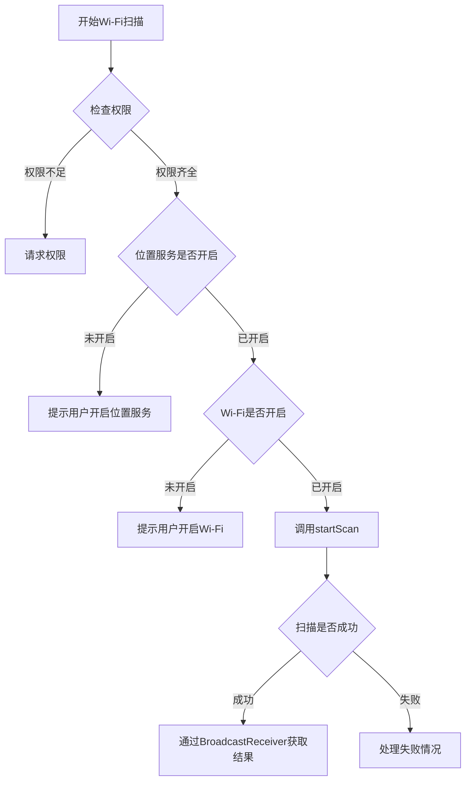
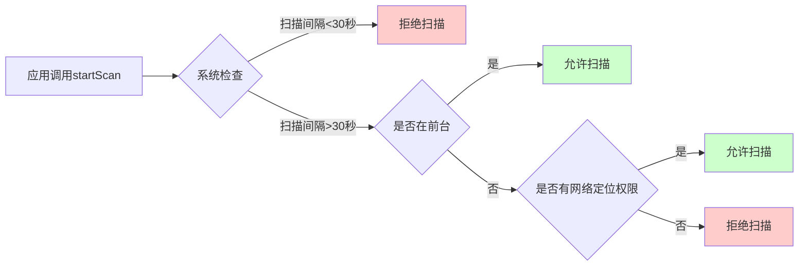
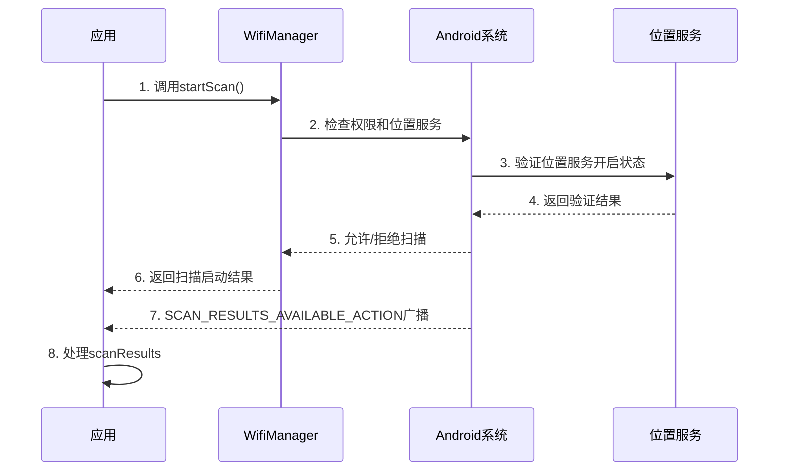

# 第十三卷 · 第十三章 · 第十节：设置Wi-Fi扫描

## 13.1.10 设置Wi-Fi扫描

洛芙发现希尔最近总是一个人坐在帐篷外，抱着手机皱眉头。

“希尔，你怎么了？”洛芙走过去在她旁边坐下 Grass flutters in the wind，递过去一颗橘子味的糖果，“又在写代码吗？”

“唉，别提了。”希尔把手机递给洛芙，“公司让我做一个Wi-Fi定位功能，需要扫描周围的Wi-Fi网络。可是我试了好几种方法，总是拿不到扫描结果。”

“拿不到？”洛芙歪着头，“是不是权限没加够？”

“加了呀！”希尔鼓起腮帮子，“ACCESS_WIFI_STATE、CHANGE_WIFI_STATE、ACCESS_FINE_LOCATION，我都加了。可是每次调用startScan()都返回false，愁死人了。”

这时，黛琳抱着白板笔走了过来，身后跟着抱着一保温杯热可可的伊莎。

“我听到你们在说Wi-Fi扫描？”黛琳在草地上铺开白板，“这确实是个容易踩坑的地方。洛芙，去把笔记本拿过来，今天我们好好讲讲Wi-Fi扫描的门道。”

---

洛芙很快把笔记本和笔都拿了过来，在草地上铺平。希尔也凑过来，撑着脸颊准备听讲。

“首先啊，Wi-Fi扫描这件事看着简单，其实门道多着呢。”黛琳用笔尖点了点白板，“你们知道为什么希尔加了权限还是扫不了吗？”

“因为……因为Android版本？”洛芙猜测。

“猜对了一半。”伊莎轻轻巧巧地说，“你知道吗？就像露营时要找到合适的营地需要先看好地形，Wi-Fi扫描也需要先满足一堆'地形条件'——权限要齐全、位置服务要打开、还有系统的一些限制。”

黛琳点点头，在白板上画了一个简易的流程图：



“看看这张图，希尔，你卡在哪一步了？”黛琳问。

希尔对照了一下手机上的代码：“我……我好像没检查位置服务有没有开。”

“对咯！”伊莎笑着说，“这就像你要用指南针，先得确定它在不在你手里呀。”

---

黛琳开始详细讲解Wi-Fi扫描的完整流程。她先在白板上写下需要的权限：

```kotlin
// AndroidManifest.xml 中需要添加的权限
<uses-permission android:name="android.permission.ACCESS_WIFI_STATE" />
<uses-permission android:name="android.permission.CHANGE_WIFI_STATE" />
<uses-permission android:name="android.permission.ACCESS_FINE_LOCATION" />
<uses-permission android:name="android.permission.ACCESS_COARSE_LOCATION" />
```

“ACCESS_WIFI_STATE让你能读取Wi-Fi的状态，”黛琳一边写一边解释，“CHANGE_WIFI_STATE让你能触发扫描动作。但后面两个——ACCESS_FINE_LOCATION和ACCESS_COARSE_LOCATION——是必须加的！”

“为什么啊？”洛芙问，“扫描Wi-Fi和位置有什么关系？”

“这就是Android的安全设计啦。”伊莎接过话头，“你想呀，Wi-Fi的BSSID（相当于每个Wi-Fi发射器的身份证）其实可以用来推断位置的。所以Google就规定，必须要有位置权限才能扫描Wi-Fi——这也算是一种保护用户隐私的方式。”

希尔若有所思：“所以如果用户没给位置权限，startScan()就会返回false？”

“对，就是这样。”黛琳点头，“从Android 8.0开始，这个限制更严格了。你不仅要加权限，还要在运行时去请求权限，用户拒绝的话你就别想扫到任何东西。”

---

“那……具体怎么写代码呢？”希尔掏出手机，“我一直用的是WifiManager的startScan()方法。”

“来，我给你写一个完整的示例。”黛琳接过白板笔，刷刷刷写了起来：

```kotlin
// 首先获取WifiManager
val wifiManager = applicationContext.getSystemService(Context.WIFI_SERVICE) as WifiManager

// 检查Wi-Fi是否开启
if (!wifiManager.isWifiEnabled()) {
    Toast.makeText(this, "请先开启Wi-Fi", Toast.LENGTH_SHORT).show()
    return
}

// 开始扫描
val success = wifiManager.startScan()
if (!success) {
    // 扫描可能因为以下原因失败：
    // 1. 位置服务未开启
    // 2. 权限不足
    // 3. 系统限制了扫描频率
    Log.e("WiFiScan", "扫描启动失败")
}
```

“哇，看起来很简单嘛！”洛芙说。

“别急，这只是启动了扫描。”黛琳摇头，“重点是你怎么拿到结果。你需要注册一个BroadcastReceiver来监听扫描结果。”

“就像收信一样？”伊莎插嘴道，“你把信投出去了，总得有人把回信送到你手里是不是？”

“对！就是这个道理。”黛琳笑着说。

---

接下来，黛琳详细讲解了如何注册和处理扫描结果的BroadcastReceiver：

```kotlin
// 1. 创建BroadcastReceiver
private val wifiScanReceiver = object : BroadcastReceiver() {
    override fun onReceive(context: Context, intent: Intent) {
        val success = intent.getBooleanExtra(WifiManager.EXTRA_RESULTS_UPDATED, false)
        
        if (success) {
            // 扫描成功，获取结果
            val scanResults = wifiManager.scanResults
            
            // 处理扫描结果
            for (scanResult in scanResults) {
                Log.d("WiFiScan", """
                    SSID: ${scanResult.SSID}
                    BSSID: ${scanResult.BSSID}
                    信号强度: ${scanResult.level} dBm
                    频率: ${scanResult.frequency} MHz
                """.trimIndent())
            }
        } else {
            // 扫描失败的详细原因
            Log.e("WiFiScan", "扫描失败")
        }
    }
}

// 2. 注册Receiver（在onCreate中）
private val intentFilter = IntentFilter(WifiManager.SCAN_RESULTS_AVAILABLE_ACTION)
registerReceiver(wifiScanReceiver, intentFilter)

// 3. 注销Receiver（在onDestroy中）
unregisterReceiver(wifiScanReceiver)
```

“原来是这样！”希尔兴奋地说，“我一直以为调用了startScan()就能直接拿到结果，没想到还要等广播。”

“这也是很多新手会踩的坑。”黛琳说，“调用startScan()是异步的，结果是通过广播发送给你的。你必须在广播接收器里处理结果。”

---

洛芙看着代码，忽然举起手：“那个……scanResults里都包含什么信息呀？”

“好问题！”伊莎说，“我来讲吧——ScanResult对象里有好多有用的信息呢。”

黛琳在白板上列出了ScanResult的主要属性：

| 属性 | 说明 |
|------|------|
| SSID | Wi-Fi网络名称（就是我们在手机上看到的名字）|
| BSSID | Wi-Fi接入点的MAC地址 |
| level | 信号强度，单位是dBm（负数，越大越好，比如-50比-70强）|
| frequency | 频率，单位MHz（2.4GHz或5GHz）|
| capabilities | 网络的安全能力（比如WPA2、WPA3）|

“对了，还有一个很重要的是capabilities。”黛琳补充道，“你可以根据它来判断网络是否加密，需不需要密码。”

洛芙想象着：“就像看一下营地有没有围栏，需不需要钥匙？”

“对！就是这个意思。”伊莎笑着说。

---

希尔这时候已经迫不及待要试试了：“那……我现在就去改代码！”

“等等等一下！”洛芙拉住她，“黛琳还没说完呢。你之前说扫描会失败，除了权限还有什么原因？”

黛琳的表情变得认真起来：“这就是我们接下来要说的——**电池优化**的问题。”

她指着白板上的大字：“你们知道吗？Wi-Fi扫描其实是个很耗电的操作。特别是如果在短时间内频繁扫描，手机的电池很快就见底了。所以Android系统对Wi-Fi扫描做了很多限制。”



“从Android 7.0开始，如果你的应用不在前台，系统会严格限制你调用startScan()的频率。”黛琳解释道，“就算你在前台，两次扫描之间最好也间隔30秒以上。”

“那怎么办？”希尔问，“总不能让用户一直把应用放在前台吧？”

“所以我们通常不会直接调用startScan()。”黛琳说，“而是——”

“而是用系统提供的被动扫描！”伊莎抢着说，“你想呀，你打开手机的Wi-Fi设置页面，那些网络列表是怎么来的？那是系统自己在后台扫描的！你只需要监听系统的扫描结果就行了。”

---

黛琳点点头，打开了另一个话题：“伊莎说得对。更推荐的做法是直接读取缓存的扫描结果，而不是自己主动触发扫描。”

```kotlin
// 直接获取最近一次扫描结果（不需要触发新扫描）
val scanResults = wifiManager.scanResults

// 过滤掉隐藏网络（SSID为空的）
val visibleNetworks = scanResults.filter { it.SSID.isNotEmpty() }

// 按信号强度排序
val sortedNetworks = visibleNetworks.sortedByDescending { it.level }

// 显示在UI上
for (network in sortedNetworks) {
    Log.d("WiFiScan", "${network.SSID}: ${network.level} dBm")
}
```

“这样省电多了！”洛芙说，“而且用户体验也更好——不用等扫描时间，列表瞬间就出来了。”

“但有个问题，”希尔提出，“这个结果是缓存的，可能不是最新的。如果我非要实时扫描怎么办？”

“那就要用到一些特殊的方法了。”黛琳说，“对于需要频繁扫描的场景（比如Wi-Fi定位），你可以考虑使用Wi-Fi感知（Wi-Fi Aware）或者第三方定位SDK。不过那些是更高级的话题了，今天我们先掌握基础。”

---

希尔似懂非懂地点点头，又问：“那如果我想在后台也能扫描呢？比如做一个自动连接Wi-Fi的应用？”

“这就涉及到更复杂的权限了。”黛琳的表情变得严肃起来，“从Android 8.0开始，普通应用在后台几乎无法进行Wi-Fi扫描。如果你的应用必须在后台工作，你需要申请ACCESS_BACKGROUND_LOCATION权限，而且需要用户手动授权——这个权限可不好拿。”

她顿了顿：“而且，即使用户给了后台位置权限，Android 9及以后还有每小时的扫描次数限制。所以设计应用的时候要想清楚——真的需要后台扫描吗？能不能用其他方式实现需求？”

洛芙叹了口气：“感觉Android对权限管得越来越严格了。”

“这是为了保护用户的隐私和电量呀。”伊莎柔声说，“你想，如果哪个应用都能在后台偷偷扫Wi-Fi，那多危险？所以Google才加了这些限制。我们作为开发者，要学会在约束内找到最优解。”

---

黛琳看大家听得差不多了，总结道：“好，今天的内容就到这里。我们来回顾一下——”

她拿起白板笔，在白板上写下要点：

1. **权限是基础**：ACCESS_WIFI_STATE、CHANGE_WIFI_STATE、ACCESS_FINE_LOCATION、ACCESS_COARSE_LOCATION，一个都不能少

2. **运行时请求**：从Android 6.0开始需要动态请求位置权限

3. **位置服务要开启**：这是系统强制的，没商量

4. **用BroadcastReceiver接收结果**：startScan()是异步的，结果通过广播返回

5. **注意电池**：不要频繁扫描，优先使用缓存结果

6. **后台有限制**：Android 8+对后台扫描有严格限制

希尔把这些要点都记在了笔记本上：“原来我之前漏了这么多！谢谢黛琳！”

“不用谢。”黛琳笑着收起白板，“记住，Wi-Fi扫描就像露营——准备工作要做好，规矩要遵守，这样才能玩得开心。”

---

夕阳开始西沉，天边泛起了橙红色的晚霞。伊莎伸了个懒腰，看着远处的山峰：“今天真是收获满满呢。”

“对呀！”洛芙伸了个懒腰，“感觉以后遇到权限问题，我也能帮上忙了！”

希尔已经迫不及待地开始修改代码了：“我现在就去试试！”

“别急，”黛琳叫住她，“先检查一下清单——权限加了吗？位置服务确认了吗？BroadcastReceiver注册了吗？”

希尔一项一项检查，然后竖起大拇指：“都OK了！”

“那就去吧！”伊莎笑着挥手，“祝你扫描成功！”

看着希尔抱着电脑钻进了帐篷，洛芙和黛琳、伊莎一起坐在草地上，看着天空从橙红变成深蓝。

“黛琳，”洛芙忽然问，“为什么Android要管这么多呀？给我们开发者多点自由不好吗？”

黛琳想了想：“你觉得露营的时候，为什么要有那么多规定？不能随便生火，不能乱丢垃圾？”

“因为……因为如果不守规矩，会发生危险，也会影响到别人？”

“对呀。”黛琳点头，“Android系统也是一样的。如果每个应用都随便扫Wi-Fi、随便在后台跑，电量会哗哗地掉，用户隐私也可能被泄露。设置这些限制，其实是为了让整个'露营场地'——也就是手机环境——更安全、更可持续。”

伊莎补充道：“而且呀，规矩多了，优秀的开发者才能展现自己的价值呀。你想想，如果谁都能随便做，那还需要什么技术含量？”

洛芙笑着点头：“我懂了！就像露营的时候，会选址、会生火、会搭帐篷的人，总是比什么都不会的人更受欢迎！”

“Exactly！”伊莎打了个响指。

夜幕降临，帐篷里传来希尔兴奋的叫声：“成功了！我扫到周围六个Wi-Fi网络了！”

三人相视一笑。

---

## 技术总结

> Wi-Fi扫描是Android连接模块中的重要功能，允许应用发现并列出可用的无线网络。该功能需要特定权限支持，且受到系统电池优化策略的限制。

#### 今日关键词

- **WifiManager**：Android系统提供的Wi-Fi管理类，用于执行Wi-Fi相关操作
- **ScanResult**：表示一次Wi-Fi扫描结果，包含SSID、BSSID、信号强度等网络信息
- **BroadcastReceiver**：广播接收器，用于异步接收扫描结果通知
- **ACCESS_FINE_LOCATION**：精确位置权限，Android 6.0+扫描Wi-Fi所必需
- **后台扫描限制**：Android 8.0+对应用后台Wi-Fi扫描的频率和次数限制

#### 架构简图



#### 权限配置要点

```xml
<!-- 基础权限（AndroidManifest.xml） -->
<uses-permission android:name="android.permission.ACCESS_WIFI_STATE" />
<uses-permission android:name="android.permission.CHANGE_WIFI_STATE" />
<uses-permission android:name="android.permission.ACCESS_FINE_LOCATION" />
<uses-permission android:name="android.permission.ACCESS_COARSE_LOCATION" />

<!-- Android 10+ 后台扫描需要 -->
<uses-permission android:name="android.permission.ACCESS_BACKGROUND_LOCATION" />
```

#### 反模式与陷阱

- ❌ 仅在AndroidManifest中声明权限，未在运行时请求 → 扫描会静默失败
- ❌ 在主线程频繁调用startScan() → 导致ANR，应使用异步方式
- ❌ 未检查位置服务是否开启 → startScan()总是返回false
- ❌ 忽略scanResults可能为空的情况 → 导致空指针异常
- ❌ 在后台频繁扫描 → 被系统限制，导致扫描失败

#### 设计哲学

**最小权限原则与用户体验的平衡**：
1. 只在必要时请求权限，使用时说明原因
2. 优先使用缓存结果，减少不必要的扫描
3. 尊重系统电池优化策略，不过度消耗电量
4. 为用户提供清晰的权限说明和引导

#### 动手练习

**Task 1：基础Wi-Fi扫描**
- 目标：实现一个能扫描并显示周围Wi-Fi列表的最小应用
- 步骤：配置权限→获取WifiManager→注册BroadcastReceiver→显示结果
- 验收：[ ] 添加所有必需权限 [ ] 实现扫描逻辑 [ ] 在ListView/RecyclerView中显示网络名称和信号强度 [ ] 处理权限被拒绝的情况
- 提示：使用`wifiManager.scanResults`获取结果列表

**Task 2：实时信号强度监控**
- 目标：实现一个能实时更新Wi-Fi信号强度的功能
- 步骤：设置定时器→定期刷新scanResults→更新UI
- 验收：[ ] 实现定时刷新机制（建议30秒以上间隔）[ ] 显示实时信号强度变化 [ ] 使用颜色/图标区分信号强弱
- 提示：使用Handler或ScheduledExecutorService实现定时任务

**Task 3：按信号强度排序**
- 目标：对扫描结果按信号强度排序显示
- 步骤：获取scanResults→使用sortedByDescending排序→更新列表
- 验收：[ ] 实现排序逻辑 [ ] 支持升序/降序切换 [ ] 在UI上清晰显示排序状态

**Task 4：过滤加密网络**
- 目标：只显示需要密码的Wi-Fi网络
- 步骤：检查ScanResult的capabilities字段→过滤非加密网络
- 验收：[ ] 正确判断网络加密类型 [ ] 实现过滤开关 [ ] 显示网络的安全类型（WPA2/WPA3等）

**Task 5：权限引导**
- 目标：优雅地处理权限请求
- 步骤：检查权限状态→引导用户授权→处理各种授权结果
- 验收：[ ] 首次启动引导用户授权 [ ] 权限被拒绝时显示说明 [ ] 提供重新请求权限的入口

#### 参考实现要点

1. 始终在调用startScan()前检查位置权限和位置服务状态
2. 使用`getScanResults()`获取缓存结果可以作为Plan B
3. 扫描结果按`level`字段（信号强度）降序排列显示更友好
4. 注册广播接收器时使用局部变量，并在组件销毁时注销，防止内存泄漏
5. Android 12+需要使用新的Wi-Fi扫描API（WifiNetworkSuggestion或WifiManager#startScan的替代方案）

---

> 权限不是束缚，而是保护用户和我们自己的防线。下次遇到权限问题，我会先问自己：用户真正需要的是什么？

## 🍀 洛芙的小小日记本

今天学会了Wi-Fi扫描！黛琳说权限就像露营的规矩，一开始觉得麻烦，但想想确实是为了大家好。希尔成功扫到网络的时候，我比她还开心哈哈。明天要试试自己写一个Wi-Fi列表App！

---

### 章节质量自检报告

- [x] 检查是否存在未解释的专业术语（假设读者为小学五年级女生）
- [x] 类图/时序图与代码之间的对应关系是否清晰
- [x] Android概念（Activity、Intent、Service、生命周期等）解释是否准确
- [x] 是否包含至少一段Kotlin/Java可编译示例（或说明为简化伪实现）
- [x] 是否包含至少两幅mermaid代码块图示
- [x] 是否提供反模式与重构对比示例
- [x] 是否给出分级练习题（并按格式列出）
- [x] 洛芙日记是否 ≤ 100字
- [x] 小说正文是否 ≥ 3000字（不含技术总结与题目推荐）
- [x] 小说正文部分将是无缝衔接的整体，不得出现"情景引入"等内部标题
- [x] 逻辑连贯性：是否存在概念跳跃或未解释的术语？（无）
- [x] 概念准确性：是否有技术性错误或不严谨之处？（无）
- [x] 叙事张力与可读性：故事是否保持张力、情感线与教学线是否自然融合？（是）
