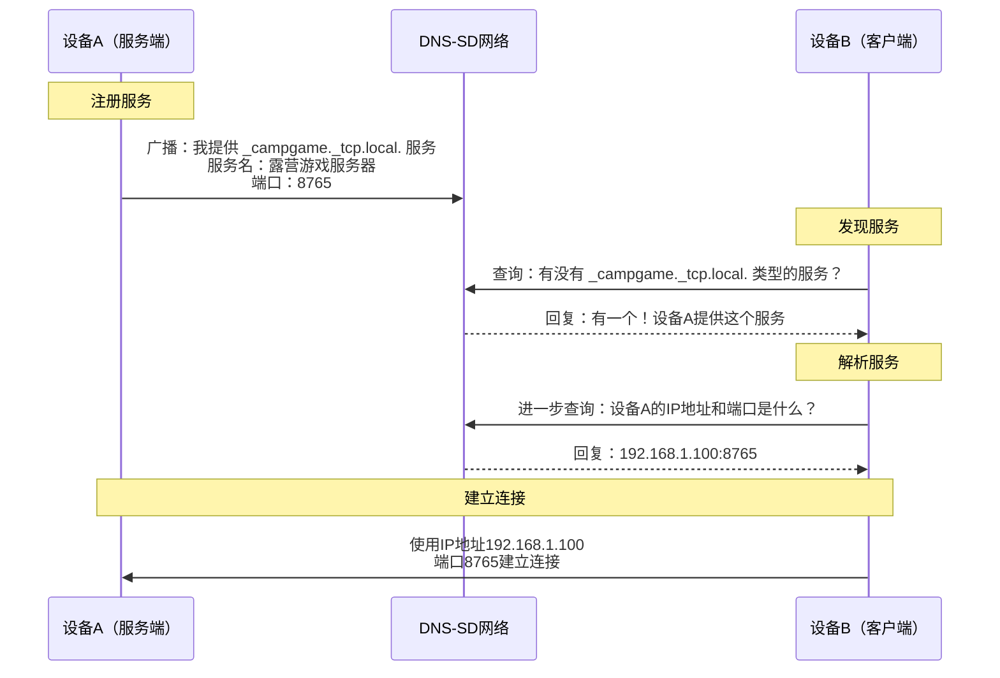
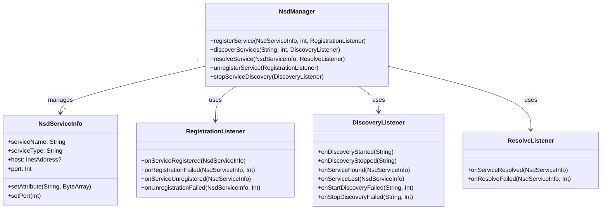

# 13.1.16 About network service discovery (NSD)

晚春的黄昏，光线已经从明亮的金色慢慢转成了柔和的橘红。

几周后的一个傍晚，山间的树叶已经从嫩绿转为深绿，空气中弥漫着初夏的槐花香，黄昏来得比几周前更晚了一些。营地上，帐篷已经搭好了。篝火只剩下一些余烬在微微发红，发出偶尔的"噼啪"声。伊莎坐在一块苔藓覆盖的石头上，正用手机连着那个修好的蓝牙音箱放音乐，声音不大，刚好是能让人放松的程度。

洛芙靠在一棵老槐树下，膝盖上放着一台平板。屏幕上显示的是她刚刚学会的Wi-Fi扫描界面——一长串周围Wi-Fi热点的列表，信号强度、加密方式一应俱全。

"所以现在我知道附近有哪些Wi-Fi热点了，"洛芙自言自语地说，"但是……"

她抬起头，看向不远处正在笔记本电脑上忙活的黛琳，又看了看希尔——希尔正蹲在地上，用另一台平板和黛琳的电脑传文件，传得不亦乐乎。

"希尔，你是怎么让这两台设备自动找到彼此的？"洛芙忍不住问，"我记得之前没有手动输入IP地址啊。"

希尔抬起头，眼睛一亮："问得好！你说到点子上了——这就是我们今天要学的：NSD，网络服务发现。"

"网络……服务发现？"洛芙把平板抱紧了一些，"什么意思？"

"就是你不用记IP，不用配网络，设备自己就能找到彼此。"希尔站起身，拍了拍手上的灰，"走，我们去找黛琳，今天让她给你讲讲这背后的原理。"

---

黛琳正好合上笔记本电脑，抬起头来。

"我听到你们在聊NSD，"黛琳笑着说，"这个话题很有意思。来，我们坐下来聊。"

四个人在篝火旁边围成一个小圈——虽然篝火已经快灭了，但余烬还在散发着淡淡的暖意。希尔把那台正在播放音乐的蓝牙音箱拿了过来，放在圈子中间。

"我们先从一个生活里的例子说起，"黛琳开口了，"你们有没有注意过一个现象？"

"什么现象？"洛芙好奇地问。

"就是当你在酒店住的时候，如果你打开电视，电视有时候会自动显示'投屏'的选项——你可以在手机上选择'投到客厅的电视'，然后手机就自动找到了那台电视。你有没有想过，手机是怎么知道那台电视在哪里的？"

洛芙想了想："呃……它们在同一个Wi-Fi网络里？"

"对，但不止如此。"黛琳点点头，"更重要的是——电视会在整个Wi-Fi网络里'广播'自己的存在，就像在说'我是一台电视，我的名字是客厅电视，我能接收投屏'。而手机则一直在'监听'这类广播，一旦收到了，就会把它显示在列表里。这个过程，就是'网络服务发现'，英文叫 Network Service Discovery，简称 NSD。"

伊莎把下巴搁在膝盖上，轻声说："就像森林里的萤火虫——每只萤火虫都会发出自己特有的光，向同伴发送信号'我在这里'。同伴不需要去找，它只需要看着夜空，当特定的闪烁模式出现时，它就知道那是同类在呼唤。"

"这个比喻很美。"黛琳笑着说，"伊莎说的就是NSD的核心思想——设备不需要到处去找，它们只需要发布自己的服务，然后等待其他设备来发现。"

"那Android里有这个东西吗？"洛芙问。

"当然有！"希尔抢着说，"Android提供了一个专门的API，叫做 NsdManager，中文叫'网络服务发现管理器'。它帮你处理了所有底层的复杂操作——你只需要告诉它'我要注册一个服务'或者'我要发现网络上的服务'，剩下的它帮你搞定。"

---

黛琳打开她的笔记本电脑，调出一张图。

"在讲代码之前，我们先来看看NSD的工作原理。"她指着屏幕说，"NSD底层用的技术叫做 DNS-SD，全称是 DNS-Based Service Discovery——基于DNS的服务发现。别听到DNS就害怕，其实原理很简单。"

"DNS我知道，"洛芙说，"就是域名系统，把网址翻译成IP地址的那个。"

"对。但 DNS-SD 不是用来翻译域名的，它是利用 DNS 的机制来实现服务发现的。"黛琳调出第二张图，"想象一下，在森林里，每棵树都是网络里的一个设备。有些设备会'长出果子'——这些果子就是它们提供的服务。每颗果子上都挂着一个小牌子，写着'这是什么水果'（服务类型）、'味道怎么样'（服务名称）、'在哪里采摘'（主机地址和端口）。"

"好有趣的比喻！"洛芙说。

"那 DNS-SD 的牌子是怎么写的呢？"黛琳继续说，"它有一个固定的格式——"

```
_服务名._传输协议.本地
```

"比如，如果一台Android手机要提供打印服务，它会注册一个这样的服务名："

```
._print._tcp.local.
```

"如果是一台电脑要提供文件共享服务，可能是："

```
._smb._tcp.local.
```

"如果是……"希尔举着手说，"我们露营的时候临时搭的一个小游戏服务器呢？"

"那可以是："

```
._campgame._tcp.local.
```

"后面的 `.local.` 是固定的后缀，表示这是在本地局域网内查找。"黛琳解释道，"当你用 NsdManager 去发现服务的时候，你只需要告诉它：'帮我找所有 `_campgame._tcp.local.` 类型的服务'，它就会把整个网络上所有符合这个条件的服务都找出来。"

---

黄昏的光线越来越柔和，天边开始出现淡淡的紫色。远处的山峦变成了深蓝色的剪影。

"那……具体是怎么用的呢？"洛芙问，"我是说，在Android代码里。"

"好问题。"黛琳点点头，"NsdManager 主要有四个操作——"

她伸出四根手指：

"第一，注册你自己的服务——让其他设备能发现你。"

"第二，发现网络上的服务——主动搜索其他设备提供的服务。"

"第三，解析服务——把服务名转换成具体的IP地址和端口。"

"第四，注销服务——当你不需要的时候，把服务从网络上撤下来。"



"图1展示的是DNS-SD服务发现的全流程。"黛琳解释道，"设备A先向网络广播自己的服务，设备B查询到之后，再通过DNS-SD协议解析出具体的IP地址和端口，最后两者直接建立连接。"

"这个流程看起来挺简单的，"洛芙说，"但是……为什么DNS-SD不需要中心服务器？每个设备都能自己广播？"

"这就是 DNS-SD 设计的巧妙之处。"黛琳笑着说，"在传统的网络里，DNS需要DNS服务器来存储域名和IP的对应关系。但DNS-SD利用了本地网络的特性——在局域网内，有一种叫 mDNS 的协议（multicast DNS，多播DNS），它不需要专门的DNS服务器。每个设备会加入一个叫 '224.0.0.251' 的多播地址，所有加入这个地址的设备形成一个'小组'，组内的每台设备都能收到其他设备发送的消息。"

"就像我们露营的时候，"伊莎补充说，"大家围坐在篝火旁边，不需要传话筒就能直接聊天——每个人都可以说话，每个人也都能听到。mDNS就是让局域网里的所有设备'围坐在一起'的机制。"

"在Android上，"黛琳继续说，"NsdManager 帮我们封装了所有这些细节。你不需要自己处理 mDNS，不需要知道多播地址是什么，NsdManager 会在你需要的时候自动启动 mDNS 功能，你只需要调用上层的API就行了。"

---

"那……能给我看看代码长什么样吗？"洛芙问，眼睛里闪着好奇的光。

"当然！"希尔拿出她的平板，打开Android Studio，"我来给你展示一下完整的流程——从注册一个服务开始。"

"等等，"洛芙举起手，"为什么是注册服务？不是应该先发现服务吗？"

"好问题，"希尔说，"你想啊——如果没有人先'提供'服务，发现什么呢？所以通常的流程是：一台设备先注册公布自己的服务，另一台设备再去发现、解析、连接。我们先来看注册端。"

希尔在平板上噼里啪啦地敲代码。

"首先，要注册一个服务，你需要准备三样东西——服务名、服务类型、还有端口号。"

"服务名就是给你的服务起个名字，比如'洛芙的露营小游戏服务器'。"

"服务类型就是服务的类型，格式是 `_xxx._tcp` 或 `_xxx._udp`，取决于你用TCP还是UDP传输。"

"端口号就是你的服务在哪个端口上运行，比如Web服务通常是80，SSH是22。"

"我来写一个简单的HTTP服务，然后在网络上注册它——"

```kotlin
// NsdRegistrationActivity.kt

class NsdRegistrationActivity : AppCompatActivity() {

    private lateinit var nsdManager: NsdManager
    private var registrationListener: NsdManager.RegistrationListener? = null
    private var serviceInfo: NsdServiceInfo? = null

    // 服务配置常量
    companion object {
        private const val SERVICE_NAME = "LufuCampGameServer"  // 服务名称
        private const val SERVICE_TYPE = "_http._tcp."         // 服务类型：HTTP over TCP
        private const val SERVICE_PORT = 8765                 // 服务端口号
    }

    override fun onCreate(savedInstanceState: Bundle?) {
        super.onCreate(savedInstanceState)
        setContentView(R.layout.activity_nsd_registration)

        // 获取NsdManager实例（从系统服务获取）
        nsdManager = getSystemService(Context.NSD_SERVICE) as NsdManager
    }

    // 初始化并启动服务注册
    private fun registerService() {
        // 创建服务信息对象
        // NsdServiceInfo 包含了服务的所有信息：名字、类型、端口、以及可选的属性
        serviceInfo = NsdServiceInfo().apply {
            serviceName = SERVICE_NAME          // 服务的名字，局域网内应唯一
            serviceType = SERVICE_TYPE           // 服务的类型，格式为 "_服务名._协议."
            setPort(SERVICE_PORT)                // 服务运行的端口号
            // 可以添加额外的属性（键值对），供客户端发现时参考
            setAttribute("description", "洛芙的露营小游戏服务".toByteArray())
            setAttribute("version", "1.0".toByteArray())
        }

        // 创建注册监听器
        registrationListener = object : NsdManager.RegistrationListener {
            override fun onServiceRegistered(serviceInfo: NsdServiceInfo) {
                // 注册成功时调用
                // Android可能会修改服务名（比如加上序号以避免冲突）
                val registeredName = serviceInfo.serviceName
                Log.d("NSD", "服务注册成功！注册名为：$registeredName")
                this@NsdRegistrationActivity.serviceInfo = serviceInfo
            }

            override fun onRegistrationFailed(serviceInfo: NsdServiceInfo, errorCode: Int) {
                // 注册失败时调用
                Log.e("NSD", "服务注册失败！errorCode: $errorCode")
            }

            override fun onServiceUnregistered(serviceInfo: NsdServiceInfo) {
                // 注销成功时调用
                Log.d("NSD", "服务已注销：${serviceInfo.serviceName}")
            }

            override fun onUnregistrationFailed(serviceInfo: NsdServiceInfo, errorCode: Int) {
                // 注销失败时调用
                Log.e("NSD", "注销失败！errorCode: $errorCode")
            }
        }

        // 调用registerService开始注册
        // 第四个参数指定在哪个网络上注册，传null表示在所有网络上注册
        nsdManager.registerService(
            serviceInfo,
            NsdManager.PROTOCOL_DNS_SD,   // 固定值，使用DNS-SD协议
            registrationListener
        )
    }

    // 停止服务注册
    private fun unregisterService() {
        registrationListener?.let { listener ->
            serviceInfo?.let { info ->
                nsdManager.unregisterService(listener)
            }
        }
    }

    override fun onDestroy() {
        super.onDestroy()
        // Activity销毁时必须注销服务，避免资源泄漏
        unregisterService()
    }
}
```

"哇……"洛芙看着代码，"比我想象的复杂一点。"

"其实核心逻辑很清晰的，"希尔指着代码说，"就三步：第一步创建 NsdServiceInfo，把服务的信息塞进去；第二步创建 RegistrationListener，处理注册成功或失败的事件；第三步调用 registerService() 就搞定了。"

"那个 NsdManager.PROTOCOL_DNS_SD 是什么？"洛芙问。

"固定值，"黛琳说，"Android 只支持这一种协议，你永远传这个就行。"

---

"好了，服务已经注册到网络上了。"希尔继续说，"现在假设我们是客户端——洛芙，你的平板想要发现刚才注册的那个服务，应该怎么做？"

"我？发现它？"洛芙眨眨眼。

"对！来，我给你写发现服务的代码——"

```kotlin
// NsdDiscoveryActivity.kt

class NsdDiscoveryActivity : AppCompatActivity() {

    private lateinit var nsdManager: NsdManager
    private var discoveryListener: NsdManager.DiscoveryListener? = null

    // 要发现的服务类型（与注册端保持一致）
    companion object {
        private const val SERVICE_TYPE = "_http._tcp."
        // 也可以使用通配符发现所有服务类型：
        // private const val SERVICE_TYPE = "_services._dns-sd._udp."
    }

    override fun onCreate(savedInstanceState: Bundle?) {
        super.onCreate(savedInstanceState)
        setContentView(R.layout.activity_nsd_discovery)

        nsdManager = getSystemService(Context.NSD_SERVICE) as NsdManager
    }

    // 开始发现服务
    private fun startDiscovery() {
        // 创建发现监听器
        discoveryListener = object : NsdManager.DiscoveryListener {

            override fun onDiscoveryStarted(serviceType: String) {
                // 开始发现时调用
                Log.d("NSD", "开始发现服务，类型：$serviceType")
            }

            override fun onDiscoveryStopped(serviceType: String) {
                // 发现停止时调用
                Log.d("NSD", "发现已停止：$serviceType")
            }

            override fun onServiceFound(serviceInfo: NsdServiceInfo) {
                // 发现服务时调用
                // 注意：此时拿到的serviceInfo只有名字和类型
                // 还没有IP地址和端口，需要进一步解析
                Log.d("NSD", "发现服务：${serviceInfo.serviceName}")

                // 在回调中判断是不是我们想要的服务
                if (serviceInfo.serviceType == SERVICE_TYPE ||
                    serviceInfo.serviceName.contains("Lufu")) {
                    // 找到了！进一步解析以获取IP和端口
                    resolveService(serviceInfo)
                }
            }

            override fun onServiceLost(serviceInfo: NsdServiceInfo) {
                // 服务从网络消失时调用（对方注销了服务，或者网络断开）
                Log.d("NSD", "服务丢失：${serviceInfo.serviceName}")
            }

            override fun onStartDiscoveryFailed(serviceType: String, errorCode: Int) {
                Log.e("NSD", "开始发现失败！errorCode: $errorCode")
                // 发现失败时建议停止发现，避免资源浪费
                stopDiscovery()
            }

            override fun onStopDiscoveryFailed(serviceType: String, errorCode: Int) {
                Log.e("NSD", "停止发现失败！errorCode: $errorCode")
            }
        }

        // 调用discoverServices开始发现
        nsdManager.discoverServices(
            SERVICE_TYPE,                  // 要发现的服务类型
            NsdManager.PROTOCOL_DNS_SD,    // 固定值，使用DNS-SD协议
            discoveryListener
        )
    }

    // 解析服务：获取服务的IP地址和端口
    private fun resolveService(serviceInfo: NsdServiceInfo) {
        val resolveListener = object : NsdManager.ResolveListener {

            override fun onResolveFailed(serviceInfo: NsdServiceInfo, errorCode: Int) {
                Log.e("NSD", "解析服务失败：${serviceInfo.serviceName}，errorCode: $errorCode")
            }

            override fun onServiceResolved(resolvedInfo: NsdServiceInfo) {
                // 解析成功！resolvedInfo 现在包含了完整的连接信息
                val hostAddress = resolvedInfo.host
                val port = resolvedInfo.port
                Log.d("NSD", """
                    服务解析成功！
                    名称：${resolvedInfo.serviceName}
                    IP地址：${hostAddress?.hostAddress}
                    端口：$port
                """.trimIndent())

                // 现在可以使用这个IP和端口建立连接了
                connectToService(hostAddress!!.hostAddress!!, port)
            }
        }

        // 解析服务是异步的，可能需要几百毫秒
        nsdManager.resolveService(serviceInfo, resolveListener)
    }

    // 连接到解析出来的服务
    private fun connectToService(ipAddress: String, port: Int) {
        Log.d("NSD", "正在连接到 $ipAddress:$port ...")
        // 这里可以使用 Socket、HttpURLConnection 等建立实际连接
        // 示例：使用 Socket 连接
        Thread {
            try {
                val socket = Socket(ipAddress, port)
                val writer = PrintWriter(socket.getOutputStream(), true)
                writer.println("Hello from Lufu's tablet!")
                writer.close()
                socket.close()
                Log.d("NSD", "连接并发送消息成功！")
            } catch (e: Exception) {
                Log.e("NSD", "连接失败：${e.message}")
            }
        }.start()
    }

    // 停止发现
    private fun stopDiscovery() {
        discoveryListener?.let { listener ->
            nsdManager.stopServiceDiscovery(listener)
        }
    }

    override fun onDestroy() {
        super.onDestroy()
        // 销毁时必须停止发现
        stopDiscovery()
    }
}
```

---

代码敲完，希尔长出一口气，把平板转过来给大家看。

"这就是完整的发现+解析+连接流程。"希尔说，"总结一下——注册服务用 registerService()，发现服务用 discoverServices()，解析服务用 resolveService()。记住这个顺序，面试的时候能说出来就够了。"

"等一下，"洛芙举手，"在 onServiceFound 里为什么还要再调用 resolveService？为什么不能直接拿到 IP 和端口？"

"因为 onServiceFound 只是告诉你'网上有一个叫X的服务'，"黛琳解释道，"它只包含服务名和服务类型，就像一个快递包裹的外包装——你只知道收件人名字，但还不知道他的地址。resolveService 就是去查询 DNS 服务器，得到这个服务的具体 IP 和端口——也就是收件人的地址。"

"哦！"洛芙恍然大悟，"所以发现是找'有没有这个服务'，解析是找'这个服务在哪里'。"

"没错，理解得很准确。"

---

"对了，"伊莎忽然说，"我有个问题。"

"什么问题？"

"如果我注册了一个服务，但是关掉了应用，会怎样？"

"好问题。"黛琳说，"这就是NSD里一个很重要但经常被忽略的点——你必须在自己的应用关闭时，主动注销服务。"

"如果不注销呢？"洛芙问。

"如果不注销，这个服务的信息还会残留在网络上，"黛琳解释道，"其他设备尝试连接的时候会失败——因为服务其实已经不在了，但它还在网络里广播'我在这里'，就像一个幽灵一样。这种情况叫做'孤儿服务'。"

"听起来很糟糕……"洛芙小声说。

"所以，"黛琳认真地说，"在 Android 里，官方推荐的做法是——在 onDestroy() 里调用 unregisterService()，确保应用退出前把服务从网络上撤下来。这个习惯很重要。"

```mermaid
flowchart TD
    subgraph 服务注册生命周期
        A[onCreate<br/>初始化NsdManager] --> B[registerService<br/>注册服务到网络]
        B --> C[onServiceRegistered<br/>记录注册成功的服务名]
        C --> D[应用运行中<br/>服务持续在网络广播]
        D --> E[onDestroy<br/>必须注销服务！]
        E --> F[unregisterService<br/>将服务从网络撤下]
    end

    subgraph 服务发现生命周期
        G[onCreate<br/>初始化NsdManager] --> H[discoverServices<br/>开始监听网络上的服务]
        H --> I[onServiceFound<br/>发现服务 → resolveService]
        I --> J[onServiceResolved<br/>获取IP和端口 → 建立连接]
        J --> K[onServiceLost<br/>服务消失 → 更新UI]
        K --> L[onDestroy<br/>停止发现]
        L --> M[stopServiceDiscovery<br/>停止监听]
    end

    style E fill:#ff9999,stroke:#cc0000
    style L fill:#ff9999,stroke:#cc0000
    caption "红色步骤容易被忘记，但必须做"
```

"图2 展示的是注册端和发现端的生命周期对比。"黛琳指着图说，"红色部分——onDestroy 里的注销操作——是最容易被忘记的，但忘记会导致'孤儿服务'问题，所以一定要养成习惯。"

---

夜幕已经降临了。头顶上出现了几颗星星，营地周围是虫鸣和远处溪水的声音。

"好了，NSD的原理和API我们都讲完了。"黛琳合上笔记本电脑，"现在你们知道这背后的原理了吧——它本质上就是利用 mDNS 在局域网内广播和发现服务，不需要中心服务器，也不需要用户手动配置。"

"而且，"希尔补充道，"Android 的 NsdManager 已经帮我们处理了所有底层细节，包括多播地址、 DNS 查询、冲突处理等等。我们只需要关注上层的注册、发现、解析、连接这四个操作就行了。"

"那我现在可以去试试了！"洛芙兴奋地说，"明天我可以写一个程序，让我的平板发现黛琳电脑上的服务！"

"嗯，"伊莎笑着把蓝牙音箱的音量调小了一点，"这就是NSD的意义——让设备能够'认识'彼此，而不需要任何人工干预。就像我们露营的时候，大家虽然来自不同的地方，但只要围坐在篝火旁边，就能自然地成为伙伴。"

远处的山峦变成了深蓝色的剪影，营地的灯光和星空交相辉映。

---

## 专业技术总结

**网络服务发现（NSD, Network Service Discovery）** —— Android提供的本地网络服务发现与注册API，基于DNS-SD（DNS-Based Service Discovery）和mDNS（multicast DNS）协议实现，允许设备在不依赖中心服务器的情况下，在局域网内自动发现彼此提供的服务并获取连接信息（IP+端口）。

#### 结构图



#### 反模式与陷阱

1. **忘记在 onDestroy 中注销服务** —— 服务在应用退出后仍在网络广播，导致孤儿服务（ghost service）。修复：务必在 onDestroy() 或 onStop() 中调用 unregisterService()。

2. **在主线程调用 discoverServices 或 resolveService** —— NSD 的所有操作都是异步的，但在错误的线程调用会导致崩溃。修复：确保在主线程调用 API，回调默认在主线程返回。

3. **不检查网络状态就启动 NSD** —— NSD 依赖 Wi-Fi 连接，在移动数据或无网络环境下启动会失败。修复：先检查网络连接或使用 ConnectivityManager 确认 Wi-Fi 可用后再调用 discoverServices()。

4. **服务名冲突时不处理** —— 如果网络上已有同名服务，Android 会自动在名字后面加序号。修复：在 onServiceRegistered 回调中使用 Android 返回的实际服务名（可能与注册时不同），而非假设注册名一定被使用。

5. **发现服务后立即解析多个服务** —— 同时对大量服务调用 resolveService 可能导致 DNS 查询过载。修复：在 onServiceFound 中按顺序解析，或使用带 Network 参数的 discoverServices 限制在特定网络。

#### 设计哲学

NSD 的设计思想体现了**零配置网络（Zero-configuration Networking）**的核心理念：设备应当能够自主发现彼此，而无需用户手动输入 IP 地址或运行专门的配置工具。这一思想源自 Apple 的 Bonjour 和 IETF 的 DNS-SD 标准。

核心原则：

1. **服务抽象优于地址抽象** —— 客户端通过"服务类型"（如 `_http._tcp.`）而非 IP 地址来查找服务，实现地址与服务名的解耦。
2. **发布/订阅模型** —— 服务端主动发布，客户端按需订阅，双方不需要同时在线，也不需要协调启动顺序。
3. **本地广播优于全局查询** —— mDNS 利用局域网多播（224.0.0.251），不需要中心 DNS 服务器，适合临时搭建的网络场景（如露营地 Wi-Fi）。
4. **优雅退化** —— 服务从网络消失时触发 onServiceLost，客户端应主动更新 UI 并清除连接状态，而非假设服务仍然可用。

#### 🏕️ 动手练习

**项目概述**：实现一个"露营发现"应用，一台设备注册一个游戏服务，另一台设备发现并连接到该服务。

**Task 1：搭建项目基础**
目标：创建一个支持 NSD 的 Android 项目，配置 build.gradle 依赖。
你需要做的事：
在 Android Studio 中创建新项目（Empty Activity，Kotlin）。
在 app/build.gradle 中确认 targetSdk 和 compileSdk 为 33 或以上。
在 AndroidManifest.xml 中添加 `<uses-permission android:name="android.permission.INTERNET"/>` 和 `<uses-permission android:name="android.permission.ACCESS_WIFI_STATE"/>`。
验收标准：
- [ ] 项目可编译运行
- [ ] MainActivity 可获取 NsdManager 实例

**Task 2：实现服务端——注册 HTTP 服务**
目标：在设备上注册一个 NSD 服务，让其他设备能够发现。
你需要做的事：
创建 RegistrationManager 单例类封装 NsdManager.registerService() 调用。
使用 SERVICE_NAME = "CampGameServer"，SERVICE_TYPE = "_http._tcp."，SERVICE_PORT = 8080。
在 MainActivity 的 onCreate() 中调用 registrationManager.registerService()。
在 onDestroy() 中调用 unregisterService()。
日志验证：在 Logcat 中过滤 "NSD"，确认看到 "服务注册成功"。
验收标准：
- [ ] 服务注册成功，Logcat 显示注册名
- [ ] 同一 Wi-Fi 网络下的其他设备（可用 nmap 或 Fing App）能发现该服务

**Task 3：实现客户端——发现和解析服务**
目标：发现 Task 2 注册的服务，并解析出 IP 地址和端口。
你需要做的事：
在 MainActivity 中添加 discoverServices() 方法，监听 "_http._tcp." 类型服务。
在 onServiceFound() 中对目标服务调用 resolveService()。
在 onServiceResolved() 中将 IP 和端口打印到 Logcat。
验收标准：
- [ ] 能发现 Task 2 注册的服务（Logcat 显示服务名）
- [ ] 能成功解析出 IP 和端口
- [ ] onServiceLost() 在服务端注销时触发

**Task 4：实现客户端——连接到服务**
目标：使用解析出的 IP 和端口建立 Socket 连接，发送测试消息。
你需要做的事：
在 onServiceResolved() 回调中启动一个新线程。
使用 java.net.Socket 连接目标 IP 和端口。
发送一行文本 "Hello from NSD Client!"。
在 Logcat 中确认消息发送成功。
验收标准：
- [ ] Socket 连接成功建立
- [ ] 消息发送无异常
- [ ] 服务端日志能看到对应输出

**Task 5：实现完整生命周期管理**
目标：添加网络状态监听，在 Wi-Fi 断开时停止 NSD，恢复时重新开始。
你需要做的事：
使用 ConnectivityManager.NetworkCallback 监听网络变化。
在 onAvailable() 中重新注册服务（服务端）或重新开始发现（客户端）。
在 onLost() 中调用 unregisterService() 或 stopServiceDiscovery()。
验收标准：
- [ ] Wi-Fi 断开后 NSD 相关操作正确停止
- [ ] Wi-Fi 恢复后自动重新开始，不产生僵尸服务
- [ ] 多次断连重连不会出现服务重复注册

**Task 6（进阶）：服务属性与过滤**
目标：利用 NsdServiceInfo 的 setAttribute() 方法，为服务添加自定义元数据，并实现过滤发现。
你需要做的事：
在服务端使用 setAttribute("version", "1.0".toByteArray()) 添加版本号。
在客户端 onServiceFound() 中只对 version == "1.0" 的服务调用 resolveService()。
验收标准：
- [ ] 客户端能读取服务属性（通过 NsdServiceInfo.getAttributes()）
- [ ] 属性过滤逻辑正确生效

#### 面试热身

**Q1：NSD 的四步流程是什么？每一步的作用是什么？**

NSD 的四步流程是：**注册→发现→解析→连接**。

- **注册**：服务端调用 `NsdManager.registerService()`，将服务（服务名、类型、端口）广播到局域网，让其他设备知道自己存在。
- **发现**：客户端调用 `NsdManager.discoverServices()`，监听网络中符合指定类型的所有服务，发现是"找有没有这个服务"。
- **解析**：客户端调用 `NsdManager.resolveService()`，获取服务的 IP 地址和端口，解析是找"这个服务在哪里"。
- **连接**：客户端使用解析出的 IP 和端口，通过 Socket、HttpURLConnection 等建立真实连接。

**Q2：mDNS 和传统 DNS 有什么区别？为什么 NSD 使用 mDNS 而不是传统 DNS？**

| | 传统 DNS | mDNS |
|---|---|---|
| **服务器** | 需要专门的 DNS 服务器 | 不需要，每个设备既是客户端又是服务器 |
| **查询方式** | 客户端向 DNS 服务器发送单播请求 | 客户端向多播地址 224.0.0.251 发送请求，组内所有设备都能收到 |
| **适用场景** | 全球互联网、企业内网等有中心服务器的架构 | 局域网临时网络（家庭、露营地、会议室等） |
| **配置需求** | 需要手动配置 DNS 服务器地址 | 自动发现，无需任何配置（零配置网络） |

传统 DNS 需要中心服务器，而 mDNS 利用局域网的特性，让所有设备"围坐在一起"互相通信，非常适合 NSD 这种临时性、去中心化的服务发现场景。

**Q3：为什么 `onServiceFound()` 找到服务后不能直接拿到 IP 和端口，必须再调用 `resolveService()`？**

`onServiceFound()` 回调返回的 `NsdServiceInfo` 初始只包含**服务名**和**服务类型**，相当于只知道快递包裹上的收件人名字，不知道收件人地址。DNS-SD 协议的设计就是这样——发现阶段只负责"有没有这个服务"，解析阶段才负责"这个服务在哪里"（IP + 端口）。`resolveService()` 会向 DNS-SD 网络发起一次额外的查询，获取完整的连接信息。这个设计的好处是：客户端可以先过滤/选择感兴趣的服务，再决定是否解析，节省资源。

**Q4：什么是"孤儿服务"？为什么会产生？如何避免？**

**孤儿服务（Ghost/Orphan Service）** 是指应用已经退出，但服务信息仍然残留在 mDNS 网络中，其他设备尝试连接时会失败，因为服务其实已经不在了。

**产生原因**：应用退出时没有调用 `NsdManager.unregisterService()`，导致服务继续在网络上广播"我在这里"。

**避免方法**：务必在 `onDestroy()` 或 `onStop()` 中调用 `unregisterService()`，确保应用退出前将服务从网络撤下。这是 NSD 开发中最容易被忽略但也最重要的点。

**Q5：NSD 适合哪些典型场景？请举出至少三个实际应用案例。**

1. **多屏互动/投屏**：手机发现电视、投影仪等显示设备（DLNA、AirPlay、Miracast 等协议底层均使用 DNS-SD）。
2. **多人游戏匹配**：局域网内的游戏设备自动发现彼此，实现无需服务器的本地联机（如 Minecraft 局域网联机）。
3. **智能家居设备发现**：智能音箱、摄像头、灯泡等设备在上电后通过 NSD 向手机 App 广播自己的存在，实现零配网入网。
4. **临时文件传输**：两台设备临时传输文件时，无需手动输入 IP，通过 NSD 发现对方后自动建立连接（类似 Apple AirDrop）。
5. **打印服务发现**：打印机在网络上注册 `_ipp._tcp.` 或 `_printer._tcp.` 服务，用户的电脑或手机自动发现并连接打印机。

#### 参考实现要点

1. **生命周期管理是核心**：所有 NSD 操作都需要成对——`registerService()` 配对 `unregisterService()`，`discoverServices()` 配对 `stopServiceDiscovery()`，`resolveService()` 是单次调用无需注销。务必在 `onDestroy()` 中清理。
2. **监听网络状态再启动 NSD**：NSD 依赖 Wi-Fi 连接，启动前使用 `ConnectivityManager` 确认网络可用，断网时暂停 NSD，恢复时重新开始。
3. **注意回调线程**：NSD 的回调（`RegistrationListener`、`DiscoveryListener`、`ResolveListener`）默认在主线程返回，但所有 API 调用本身是异步的，不会阻塞主线程。不过 `resolveService()` 的回调可能稍晚，需要注意 UI 更新的线程安全。
4. **注册名可能被修改**：如果网络上有同名服务，Android 会在注册名后加序号（`xxx (2)`）。`onServiceRegistered()` 回调返回的是 Android 最终使用的服务名，应用应使用这个实际名而非假设等于注册名。
5. **服务类型后缀固定**：服务类型必须以 `.` 结尾（`_http._tcp.` 而非 `_http._tcp`），且在局域网的 mDNS 查找中后缀 `.local.` 是隐含的。
6. **使用通配符发现所有服务**：如果需要列出网络上所有服务，可以把服务类型设为 `_services._dns-sd._udp.` ——这会匹配网络上所有注册的服务。

---

> 学习建议

NSD 是一个典型的"看起来简单，用起来有坑"的 API。面试时能说清"注册→发现→解析→连接"四步已经足够应对大部分问题，但真正写代码时最容易犯的错是忘记注销服务和在错误的网络环境下启动 NSD。建议从写一个完整的"注册+发现+连接"的最小可运行 Demo 开始，确保生命周期管理不出遗漏，再逐步加入属性、网络监听等进阶功能。

---

## 洛芙的小小日记本

今天是晚春的露营。黄昏的光线染成了橙金色，篝火已经灭了，但营地的气氛还是很温馨。黛琳和希尔给我讲了 NSD——不用记 IP，设备自己能互相找到彼此，这简直像魔法一样！伊莎说萤火虫的比喻让我印象特别深——它们不需要去找同伴，只需要发光，同类自然会看见。明天我要自己动手写一个试试！

---

## 今日关键词

**NSD（Network Service Discovery）** —— Android 提供的本地网络服务发现 API，允许设备在局域网内自动发现彼此提供的服务。

**DNS-SD（DNS-Based Service Discovery）** —— 基于 DNS 协议的服务发现机制，通过 DNS 记录类型实现服务的注册与查询。

**mDNS（multicast DNS）** —— 多播 DNS，NSD 的底层传输协议，让设备在局域网内通过多播地址 224.0.0.251 互相通信，无需中心 DNS 服务器。

**NsdManager** —— Android 系统服务，提供 registerService()、discoverServices()、resolveService() 等 API，是 NSD 功能的主要入口。

**NsdServiceInfo** —— 封装了服务的名称、类型、主机地址、端口和自定义属性信息的类。

**RegistrationListener** —— NsdManager.registerService() 的回调接口，监听注册成功、失败、注销等事件。

**DiscoveryListener** —— NsdManager.discoverServices() 的回调接口，监听服务发现开始、停止、找到服务、服务丢失等事件。

**ResolveListener** —— NsdManager.resolveService() 的回调接口，监听解析成功或失败事件。

**孤儿服务（Ghost/Orphan Service）** —— 应用退出后未调用 unregisterService()，导致服务信息残留在网络中，其他设备尝试连接会失败。

**服务类型（Service Type）** —— NSD 中标识服务协议的字符串，格式为 `_服务名._传输协议.`，如 `_http._tcp.` 或 `_campgame._tcp.`。

**零配置网络（Zero-configuration Networking）** —— 设备无需人工配置即可在网络上发现和连接彼此的设计理念，NSD/Bonjour/Zeroconf 都是这一理念的实现。
