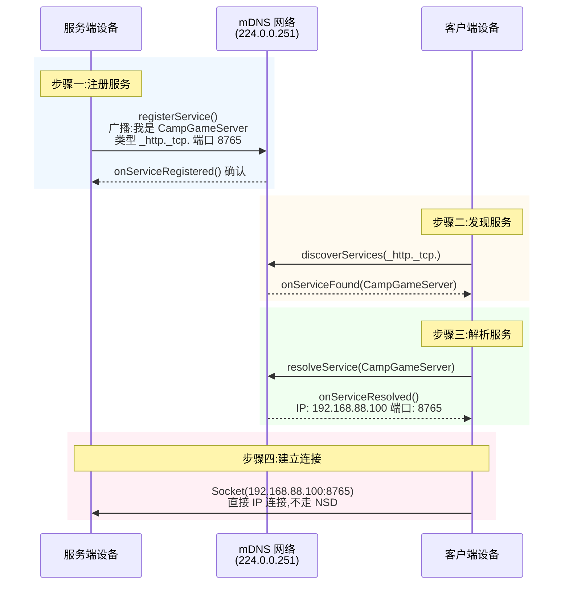

# 13.1.17 Use NSD

篝火已经彻底熄灭了。

只剩下一堆温热的灰烬,偶尔发出一两点暗红色的光。营灯挂在帐篷侧边的挂钩上,把周围一小圈草地照成了暖橙色。夜风从远处的溪谷吹过来,带着清凉的水汽和草木的气息,把白天残留的暑气全都带走了。

头顶上的星星比昨天又多了几颗。

洛芙盘腿坐在一块折叠垫子上,膝盖上搭着一件薄外套,手里捧着那台已经被她用了一整天的平板。屏幕亮着,上面显示的是昨天希尔写的 NSD 代码--注册服务、发现服务、解析服务。

她把这三段代码来回看了好几遍。

"希尔。"她抬起头。

"嗯?"正在调试笔记本电脑的希尔抬起头来。

"我昨天想了很久,"洛芙认真地说,"理论我都听懂了--注册、发现、解析、连接,四步走。但是我总觉得......如果让我自己从头写,我还是不知道从哪儿下手。"

希尔把笔记本往旁边一放,整个人往后一仰,双手枕在脑后:"正常。我当年学 NSD 的时候也是这种感觉--看代码都看得懂,自己写就卡壳。"

"那怎么办?"洛芙有点着急。

"怎么办?"希尔咧嘴一笑,露出一口白牙,"多写啊。写十遍,踩十遍坑,自然就通了。"

伊莎端着一杯刚热好的可可从不远处走过来,递到洛芙手里。热气袅袅升起,在夜色里很快就散开了。

"别急,"伊莎轻声说,"今天晚上我们有的是时间。"

黛琳已经在一块空地上铺开了她的笔记本,旁边还放着一个小型的便携路由器--那是她们从营地管理站借来的,用来模拟一个小型的局域网环境。

"我把这个路由器设置好了,"黛琳拍了拍路由器,"IP 段是 192.168.88.x,网关是 192.168.88.1。希尔,你那台笔记本的 IP 是多少?"

"192.168.88.100。"希尔凑过去看了一眼。

"洛芙,你的平板呢?"

洛芙低头看了看平板右上角的网络状态栏:"192.168.88.102。"

"很好,三台设备都在同一个网段。"黛琳点点头,"今天的任务很简单--希尔先把她昨天写的代码拆解成最小可运行版本,然后我们一人做一半:希尔负责把服务端跑起来,洛芙负责把客户端跑起来。最后看能不能让洛芙的平板发现希尔的笔记本上的服务,并且连接上去。"

洛芙深吸了一口气:"好!我准备好了!"

希尔把笔记本转过来,屏幕对着大家。

"先从服务端开始。"她说,"注册一个 NSD 服务,需要几个东西?"

"三样!"洛芙举起手指,"服务名、服务类型、端口号。"

"没错。那我们先把服务端的代码骨架搭起来。"

希尔的手指在键盘上飞舞,一行行代码出现在屏幕上。

```kotlin
// NsdServerManager.kt
// NSD 服务端管理器:负责注册和注销 NSD 服务
// 依赖:android.net.nsd.NsdManager, android.content.Context

class NsdServerManager(private val context: Context) {

    private val nsdManager: NsdManager =
        context.getSystemService(Context.NSD_SERVICE) as NsdManager

    private var serviceInfo: NsdServiceInfo? = null
    private var registrationListener: NsdManager.RegistrationListener? = null

    // 服务配置常量
    companion object {
        private const val SERVICE_NAME = "CampGameServer"     // 服务名
        private const val SERVICE_TYPE = "_http._tcp."        // 服务类型(HTTP over TCP)
        private const val SERVICE_PORT = 8765                // 服务端口
    }
}
```

"这里申明了两个关键成员变量:`serviceInfo` 存储我们注册的服务信息,`registrationListener` 存储注册回调。"希尔一边敲代码一边解释,"`nsdManager` 是从系统服务里拿的,跟之前学的 Wi-Fi 扫描一样--从 Context.getSystemService 拿。"

"为什么不用 WifiManager?"洛芙突然问。

希尔的手指停在键盘上,转过头来看着洛芙。

"问得好。"她说,"这个问题的答案很重要,面试也经常考。"

她清了清嗓子:

"WifiManager 是用来管理 Wi-Fi 连接本身的--开关 Wi-Fi、扫描热点、获取当前 Wi-Fi 信息、连接某个热点。但是 NSD(网络服务发现)它是独立于 Wi-Fi 连接状态的功能--也就是说,NSD 不需要你连上某个热点,它是在局域网层面工作的。"

"等等,"洛芙皱起眉头,"可是 NSD 必须在同一个局域网里才能发现服务吧?"

"对,必须在同一个局域网。但这个'局域网'的概念是由操作系统和路由器管理的,不是 WifiManager 负责的。"黛琳接过话头,"WifiManager 只能告诉你'你现在有没有连 Wi-Fi'、'信号强不强'这些。但 NSD 的注册和发现走的是 mDNS 协议,它是在 IP 层工作的,由 NsdManager 直接处理,不需要经过 WifiManager。"

"用 WifiManager 的 API 去处理 NSD 是典型的反模式--API 用错了地方。"希尔补充道,"正确的做法是直接用 NsdManager,别走 WifiManager 这条路。"

洛芙在平板上飞快地记下来:"WifiManager 管 Wi-Fi 连接,NsdManager 管服务发现,不能混用。记住了。"

```kotlin
    // 注册服务到网络
    fun registerService() {
        // 第一步:创建 NsdServiceInfo 对象,填入服务信息
        serviceInfo = NsdServiceInfo().apply {
            serviceName = SERVICE_NAME           // 服务名(局域网内应唯一)
            serviceType = SERVICE_TYPE           // 服务类型(固定格式:_xxx._tcp.)
            setPort(SERVICE_PORT)                // 端口号(必须是本机可用的端口)
            // 可选:添加自定义属性,供客户端发现时读取
            setAttribute("description", "露营小游戏服务器 v1.0".toByteArray())
            setAttribute("version", "1.0".toByteArray())
        }

        // 第二步:创建 RegistrationListener,处理注册结果的回调
        registrationListener = object : NsdManager.RegistrationListener {

            override fun onServiceRegistered(serviceInfo: NsdServiceInfo) {
                // 注册成功!Android 可能修改了服务名(比如加序号避免冲突)
                val actualName = serviceInfo.serviceName
                Log.d("NSD-Server", "服务注册成功,实际名:$actualName")
                // 保存 Android 返回的实际服务名(用于后续注销)
                this@NsdServerManager.serviceInfo = serviceInfo
            }

            override fun onRegistrationFailed(serviceInfo: NsdServiceInfo, errorCode: Int) {
                // 注册失败,errorCode 为 Android 定义的错误码
                Log.e("NSD-Server", "注册失败,errorCode: $errorCode")
            }

            override fun onServiceUnregistered(serviceInfo: NsdServiceInfo) {
                // 注销成功,服务从网络撤下
                Log.d("NSD-Server", "服务已注销:${serviceInfo.serviceName}")
            }

            override fun onUnregistrationFailed(serviceInfo: NsdServiceInfo, errorCode: Int) {
                Log.e("NSD-Server", "注销失败,errorCode: $errorCode")
            }
        }

        // 第三步:调用 registerService 开始注册
        nsdManager.registerService(
            serviceInfo,                          // 要注册的服务信息
            NsdManager.PROTOCOL_DNS_SD,          // 固定值:使用 DNS-SD 协议
            registrationListener                  // 回调监听器
        )
        Log.d("NSD-Server", "正在注册服务:$SERVICE_NAME")
    }
```

代码敲完,希尔往椅背上一靠。

"这就是 registerService() 的完整实现。"她说,"三步走:创建 NsdServiceInfo、创建 RegistrationListener、调用 registerService()。记住这个顺序就行。"

"注销呢?"洛芙问。

"注销更简单--"

```kotlin
    // 注销服务(必须在合适的生命周期调用,防止孤儿服务)
    fun unregisterService() {
        registrationListener?.let { listener ->
            nsdManager.unregisterService(listener)
            registrationListener = null
            Log.d("NSD-Server", "已发起注销请求")
        }
    }
```

"注销只需要一行代码--调用 `nsdManager.unregisterService()`,把之前创建的那个 listener 传进去就行了。"希尔说,"但关键问题是--什么时候注销?"

"onDestroy?"洛芙说。

"对,但不完全对。"希尔说,"更准确地说,是在'服务不应该再对外暴露的时候'。最常见的是 Activity 或 Service 的 onDestroy(),但如果你的服务是跟 Activity 生命周期绑定的,在 onStop() 里注销也可以--取决于你的业务需求。"

黛琳在旁边补充道:"这里有一个常见的坑:如果在 onCreate() 里注册服务,在 onDestroy() 里注销--听起来没问题对吧?但如果应用是在后台被系统杀掉的,onDestroy() 可能根本不会被调用,服务就会变成孤儿。"

"所以......"洛芙歪着头。

"所以如果有条件的话,在 onStop() 里也做一次注销检查会更安全。"黛琳说,"不过最根本的解决方案还是--尽可能确保注销一定会被调用,比如用一个专门管理 NSD 生命周期的 Service,把注销放在 onTrimMemory 或者 onTaskRemoved 里。"

"太复杂了!"洛芙摇摇头,"我们先用 onDestroy 吧,一步一步来。"

希尔点点头:"好,那我们继续。服务端注册部分写完了,现在来做客户端的发现部分。"

她新建了一个 Kotlin 文件。

"客户端的核心逻辑是这样的--调用 discoverServices() 开始监听网络,找到服务之后调用 resolveService() 解析出 IP 和端口,然后用这个 IP 和端口去建立连接。"

```kotlin
// NsdClientManager.kt
// NSD 客户端管理器:负责发现和解析网络上的 NSD 服务
// 依赖:android.net.nsd.NsdManager, android.content.Context

class NsdClientManager(private val context: Context) {

    private val nsdManager: NsdManager =
        context.getSystemService(Context.NSD_SERVICE) as NsdManager

    private var discoveryListener: NsdManager.DiscoveryListener? = null

    // 要发现的服务类型(必须与注册端一致)
    companion object {
        private const val SERVICE_TYPE = "_http._tcp."
        // 也可以使用通配符发现所有服务:
        // private const val SERVICE_TYPE = "_services._dns-sd._udp."
    }
}
```

"DiscoveryListener 比 RegistrationListener 多两个回调--onDiscoveryStarted 和 onDiscoveryStopped。"希尔说,"因为发现是一个持续的过程,不像注册那样注册一次就完了。"

```kotlin
    // 开始发现服务
    fun startDiscovery() {
        // 创建发现监听器
        discoveryListener = object : NsdManager.DiscoveryListener {

            override fun onDiscoveryStarted(serviceType: String) {
                // 开始发现时调用
                Log.d("NSD-Client", "开始发现服务,类型:$serviceType")
            }

            override fun onDiscoveryStopped(serviceType: String) {
                // 发现停止时调用(主动停止或失败停止都会触发)
                Log.d("NSD-Client", "发现已停止:$serviceType")
            }

            override fun onServiceFound(serviceInfo: NsdServiceInfo) {
                // 发现服务时调用
                // 注意:此时拿到的 serviceInfo 只有名字和类型,还没有 IP 和端口
                Log.d("NSD-Client", "发现服务:${serviceInfo.serviceName}," +
                        "类型:${serviceInfo.serviceType}")
                // 判断是不是我们想要的服务,然后去解析
                if (serviceInfo.serviceType == SERVICE_TYPE) {
                    resolveService(serviceInfo)
                }
            }

            override fun onServiceLost(serviceInfo: NsdServiceInfo) {
                // 服务从网络消失时调用(对方注销了,或者断网了)
                Log.d("NSD-Client", "服务丢失:${serviceInfo.serviceName}")
            }

            override fun onStartDiscoveryFailed(serviceType: String, errorCode: Int) {
                // 开始发现失败(比如 Wi-Fi 没开)
                Log.e("NSD-Client", "开始发现失败,errorCode: $errorCode")
                // 发现失败后必须主动停止,避免资源泄漏
                stopDiscovery()
            }

            override fun onStopDiscoveryFailed(serviceType: String, errorCode: Int) {
                // 停止发现失败,errorCode 为 Android 定义的错误码
                Log.e("NSD-Client", "停止发现失败,errorCode: $errorCode")
            }
        }

        // 调用 discoverServices 开始发现
        nsdManager.discoverServices(
            SERVICE_TYPE,                         // 要发现的服务类型
            NsdManager.PROTOCOL_DNS_SD,           // 固定值
            discoveryListener                     // 回调监听器
        )
        Log.d("NSD-Client", "已发起发现请求")
    }
```

"等一下,"洛芙举起手,"onStartDiscoveryFailed 里为什么是直接调用 stopDiscovery()?不是开始失败吗?"

"好问题。"希尔说,"当开始发现失败的时候,这个 DiscoveryListener 其实已经被系统注册了一部分,但还没有完全启动起来。调用 stopDiscovery() 是为了做清理--把已经注册的那部分监听器撤掉。如果不调用,系统可能会认为你还在监听,但实际上是无效的,造成资源泄漏。"

"所以 begin 和 fail 都要配对 stop--"

"没错。"希尔满意地点点头,"这个配对意识很好。"

"现在是最关键的部分--resolveService()。"希尔把光标移到下一个方法上。

```kotlin
    // 解析服务:获取服务的 IP 地址和端口
    private fun resolveService(serviceInfo: NsdServiceInfo) {
        val resolveListener = object : NsdManager.ResolveListener {

            override fun onResolveFailed(serviceInfo: NsdServiceInfo, errorCode: Int) {
                // 解析失败
                // 常见 errorCode:
                //   NsdManager.FAILURE_ALREADY_ACTIVE - 已有正在进行的解析
                //   NsdManager.FAILURE_TIMEOUT - 解析超时
                Log.e("NSD-Client", "解析失败:${serviceInfo.serviceName}," +
                        "errorCode: $errorCode")
            }

            override fun onServiceResolved(resolvedInfo: NsdServiceInfo) {
                // 解析成功!resolvedInfo 现在包含了完整的连接信息
                val hostAddress = resolvedInfo.host?.hostAddress
                val port = resolvedInfo.port
                val serviceName = resolvedInfo.serviceName

                Log.d("NSD-Client", """
                    === 服务解析成功 ===
                    服务名:$serviceName
                    IP地址:$hostAddress
                    端口号:$port
                """.trimIndent())

                // 读取服务属性(可选)
                resolvedInfo.attributes?.forEach { (key, value) ->
                    val keyStr = String(key)
                    val valueStr = value?.let { String(it) } ?: "null"
                    Log.d("NSD-Client", "  属性[$keyStr] = $valueStr")
                }

                // 建立连接
                connectToService(hostAddress!!, port)
            }
        }

        // resolveService 是异步的,可能需要 100-500ms
        // 同一个 serviceInfo 对象不能同时发起多个解析请求
        nsdManager.resolveService(serviceInfo, resolveListener)
    }
```

"这就是解析的完整代码。"希尔敲完,抬起头来,"resolveService() 的回调里,我们终于拿到了 IP 地址和端口。然后就可以调用 connectToService() 去建立真实连接了。"

"如果解析失败呢?"洛芙问。

"解析失败的 errorCode 有几种,"黛琳解释道,"FAILURE_ALREADY_ACTIVE 意思是同一个 serviceInfo 正在被解析,你不需要再调用一次。FAILURE_TIMEOUT 是超时,网络不好的时候偶尔会这样。"

"那需要重试吗?"洛芙问。

"可以重试,但最好加一个重试间隔,避免 DNS 查询过载。"黛琳说,"通常等个 1-2 秒再重试就够了。"

"现在来看连接部分--"

```kotlin
    // 使用 Socket 连接到解析出的服务
    private fun connectToService(ipAddress: String, port: Int) {
        Log.d("NSD-Client", "正在连接到 $ipAddress:$port ...")

        // NSD 操作是异步的,但建立 Socket 连接是同步 I/O
        // 必须在后台线程执行,否则会阻塞主线程
        Thread {
            try {
                val socket = Socket(ipAddress, port)
                val writer = PrintWriter(
                    OutputStreamWriter(socket.getOutputStream(), StandardCharsets.UTF_8),
                    true
                )
                val reader = BufferedReader(
                    InputStreamReader(socket.getInputStream(), StandardCharsets.UTF_8)
                )

                // 发送测试消息
                writer.println("Hello from NSD Client! Connection established!")

                // 读取响应(如果有的话)
                val response = reader.readLine()
                if (response != null) {
                    Log.d("NSD-Client", "收到服务端响应:$response")
                }

                writer.close()
                reader.close()
                socket.close()
                Log.d("NSD-Client", "连接关闭")

            } catch (e: Exception) {
                Log.e("NSD-Client", "连接失败:${e.message}")
                e.printStackTrace()
            }
        }.start()
    }
```

"看到没有?"希尔指着最后那行代码,"Socket 连接必须放在 Thread {} 里执行,不能直接在主线程调用。因为 Socket 的 connect()、read()、write() 都是阻塞 I/O 操作--如果放在主线程,界面会直接卡死。"

"Android 甚至会直接抛 NetworkOnMainThreadException!"黛琳补充道。

洛芙在平板上飞快地记:"Socket 操作必须在后台线程。"

夜风吹过营地,带来一阵槐花的清香。头顶的星星比刚才又多了几颗,营灯的光晕在夜色里显得格外温暖。

"好,现在服务端和客户端的代码都有了。"希尔合上笔记本,"我们来整理一下完整的使用流程。"

她拿出笔,在一张纸上手绘了一个流程图:



"图 1 展示了完整四步的时序。"希尔说,"注意最后一步--建立 Socket 连接是直接用 IP 地址,跟 NSD 完全无关了。NSD 的作用就到这里:帮你找到服务的地址。之后的通信是你自己的业务逻辑。"

"就像......"伊莎抬起头,看着头顶的星星,轻声说,"就像我们露营的时候,用萤火虫的闪烁找到彼此的位置--一旦看见了,就不需要再看萤火虫了,直接走过去就行了。"

"很好的比喻!"洛芙说。

"现在,我们来说说真实项目中容易踩的坑。"希尔把笔记本重新打开,调出一段新的代码。

"第一个坑--Wi-Fi 状态。"

她敲了几行代码:

```kotlin
// 网络状态监听器(用于 NSD 启动前的检查)
// 使用 ConnectivityManager.NetworkCallback 监听 Wi-Fi 变化

class NsdNetworkCallback(
    private val onWifiAvailable: () -> Unit,
    private val onWifiLost: () -> Unit
) : ConnectivityManager.NetworkCallback() {

    override fun onAvailable(network: Network) {
        // 网络可用时调用(包括 Wi-Fi 连接成功)
        super.onAvailable(network)
        Log.d("NSD-Network", "网络可用")
        onWifiAvailable()
    }

    override fun onLost(network: Network) {
        // 网络断开时调用
        super.onLost(network)
        Log.d("NSD-Network", "网络丢失")
        onWifiLost()
    }

    override fun onLinkPropertiesChanged(network: Network, linkProperties: LinkProperties) {
        // 链接属性变化时调用(比如 Wi-Fi 切换了)
        super.onLinkPropertiesChanged(network, linkProperties)
        Log.d("NSD-Network", "链接属性变化")
    }
}

// 在 Activity 或 Service 中注册网络回调
class NsdActivity : AppCompatActivity() {

    private lateinit var connectivityManager: ConnectivityManager
    private var networkCallback: NsdNetworkCallback? = null

    private fun observeWifiState() {
        connectivityManager = getSystemService(Context.CONNECTIVITY_SERVICE)
            as ConnectivityManager

        // 注册网络状态回调
        networkCallback = NsdNetworkCallback(
            onWifiAvailable = {
                // Wi-Fi 可用了,可以开始 NSD 发现或注册
                Log.d("NSD", "Wi-Fi 可用,开始 NSD 操作")
                // startDiscovery() 或 registerService()
            },
            onWifiLost = {
                // Wi-Fi 断了,必须停止 NSD
                Log.d("NSD", "Wi-Fi 丢失,停止 NSD 操作")
                // stopDiscovery() 或 unregisterService()
            }
        )

        val networkRequest = NetworkRequest.Builder()
            .addTransportType(NetworkCapabilities.TRANSPORT_WIFI)
            .build()

        connectivityManager.registerNetworkCallback(networkRequest, networkCallback)
    }

    private fun stopObservingWifiState() {
        networkCallback?.let {
            connectivityManager.unregisterNetworkCallback(it)
            networkCallback = null
        }
    }

    override fun onDestroy() {
        super.onDestroy()
        stopObservingWifiState()
    }
}
```

"为什么要监听 Wi-Fi 状态?"希尔问。

"因为 NSD 依赖局域网!"洛芙说,"Wi-Fi 断了的话,mDNS 也没法工作。"

"没错。"希尔点点头,"如果在 Wi-Fi 断开的时候调用 discoverServices(),系统会报错。所以正确的做法是:先注册网络回调,确认 Wi-Fi 可用了,再调用 NSD 的 API。"

"这跟之前学的 Wi-Fi 扫描有点像。"洛芙说。

"对,思路是一样的。"黛琳说,"但 Wi-Fi 扫描是主动轮询,NSD 这里用 ConnectivityManager 的回调更优雅--系统主动通知你网络状态变化,你不需要自己轮询。"

"第二个坑--不要在 onServiceFound 里同时解析多个服务。"希尔继续说。

"为什么?"洛芙问。

"因为 resolveService() 底层是 DNS 查询,如果同一时间发起太多 DNS 请求,路由器可能会扛不住。"黛琳解释道,"更常见的问题是--如果 onServiceFound 返回了 10 个服务,而你立刻对每个都调用 resolveService(),这些 DNS 查询都会在短时间内涌向路由器,可能导致部分查询超时失败。"

"那怎么办?"

"排队解析。"希尔说,"或者设置一个并发上限,比如最多同时解析 3 个,等前几个解析完了再解析后面的。"

她顺手写了一个简单的队列实现:

```kotlin
// 解析请求队列(限制同时解析的数量)
class ResolveQueue(private val maxConcurrent: Int = 2) {

    private val pending = ArrayDeque<NsdServiceInfo>()
    private var running = 0

    // 添加一个服务到解析队列
    fun enqueue(serviceInfo: NsdServiceInfo, resolveFunc: (NsdServiceInfo) -> Unit) {
        synchronized(this) {
            if (running < maxConcurrent) {
                running++
                resolveFunc(serviceInfo)  // 立即解析
            } else {
                pending.add(serviceInfo)  // 等待队列
            }
        }
    }

    // 解析完成后调用此方法,从队列取下一个
    fun finish() {
        synchronized(this) {
            if (pending.isNotEmpty()) {
                val next = pending.removeFirst()
                resolveFunc(next)  // 解析下一个
            } else {
                running--
            }
        }
    }
}
```

"这个队列保证最多同时有 2 个解析在进行,避免 DNS 过载。"希尔说,"真实项目中,如果你的 App 需要发现大量服务,这个优化是很有必要的。"

"第三个坑--服务名的唯一性。"希尔竖起三根手指。

"昨天黛琳讲过,如果服务名重复了,Android 会自动在后面加序号对吧?"洛芙说。

"对。但还有一个坑--"希尔说,"你的服务注册成功之后,在 onServiceRegistered 里拿到的服务名,可能是 Android 改了之后的名字。如果你用这个改了的名字去网络上注销,要传正确的名字。"

"也就是说......unregisterService() 必须用 onServiceRegistered 里返回的那个 serviceInfo?"

"没错。"希尔说,"因为 onServiceRegistered 里的 serviceInfo 包含了 Android 实际使用的完整信息--包括实际的服务名。如果你在注销的时候传了错误的服务名,注销会失败。"

"所以正确的做法是--"黛琳接过话头,"在 onServiceRegistered 里保存 serviceInfo,然后在 unregisterService() 里用这个保存的 serviceInfo 对应的 listener 来注销。"

```kotlin
// 正确的注销流程(使用 onServiceRegistered 里保存的信息)
class NsdServerManagerCorrect : AppCompatActivity() {

    private var actualServiceInfo: NsdServiceInfo? = null  // 保存注册成功后的实际服务信息
    private var listenerToUnregister: NsdManager.RegistrationListener? = null

    private fun registerService() {
        val serviceInfo = NsdServiceInfo().apply {
            serviceName = "CampGameServer"   // 期望的名字
            serviceType = "_http._tcp."
            setPort(8765)
        }

        val listener = object : NsdManager.RegistrationListener {
            override fun onServiceRegistered(info: NsdServiceInfo) {
                // 保存 Android 返回的实际服务信息(名字可能已被修改)
                actualServiceInfo = info
                listenerToUnregister = this
                Log.d("NSD", "注册成功,实际名:${info.serviceName}")
            }

            // ... 其他回调 ...
        }

        nsdManager.registerService(serviceInfo, NsdManager.PROTOCOL_DNS_SD, listener)
    }

    fun unregisterService() {
        // 注销时传入 onServiceRegistered 回调里的 listener
        // 不能使用一个新的 listener 实例,必须是注册时那个
        listenerToUnregister?.let { listener ->
            nsdManager.unregisterService(listener)
            listenerToUnregister = null
            actualServiceInfo = null
        }
    }
}
```

"记住这个模式--onServiceRegistered 里保存的 listener,就是 unregisterService 需要的那个。"希尔强调,"每次注册都要保存对应的 listener 实例,不能乱用。"

夜已经很深了。

营灯的光晕把四个人围成了一小圈暖色的空间。伊莎不知道什么时候已经在旁边支起了一个小茶炉,咕嘟咕嘟地煮着热可可,香气飘了过来。

"好了,今天的主要内容讲完了。"希尔伸了个懒腰,脖子发出"咔咔"的声音,"代码层面最重要的就是这三件事:WifiManager 的反模式不要踩、网络状态要监听、生命周期要配对。"

"还有解析要队列化?"洛芙问。

"那个是进阶优化,不是必须。"希尔说,"但如果你的 App 要发现很多服务,加上这个会更好。"

洛芙把平板抱在胸前,看着屏幕上那几段代码。

"希尔,"她忽然说,"我有个想法。"

"什么想法?"

"如果我们在营地里,两个人各开一个 App,一个注册服务,一个发现服务--这样是不是就能实现一个简单的'营地聊天'了?"

希尔愣了一下,然后眼睛亮了。

"你知道吗,"她说,"这个想法非常有意思。我们明天就来试试--注册一个聊天服务,发现之后建立 Socket 连接,互相发消息。"

"真的可以吗?"洛芙兴奋起来。

"当然可以!"希尔拍了拍手,"这就是 NSD 最真实的用法--不需要服务器,两个人在同一个局域网里,自己就能找到彼此。这比什么聊天室都简单。"

"就像......"伊莎把一杯热可可递过来,"就像露营的时候,大家不需要提前约好在哪里见面,只要朝着篝火的方向走,自然就会遇见。"

黛琳笑着接过可可:"不过前提是--你的 App 要开着,NSD 要跑着。就像萤火虫要一直发光,同伴才能看见。"

"那我要把萤火虫写进代码注释里!"洛芙认真地说。

希尔被她逗笑了:"写吧写吧,反正代码注释是给人看的,不是给机器看的。"

头顶的星星越来越亮了。营地周围是虫鸣和溪水的声音,营灯的光晕和星光交织在一起,把这个小小的空间照得温暖而宁静。

---

## 专业技术总结

**使用 NSD(Use NSD)** -- 在 Android 应用中通过 NsdManager 实现网络服务的注册、发现、解析与连接。NSD 基于 DNS-SD/mDNS 协议,无需中心服务器即可在局域网内实现设备的自动发现与连接。实战中需要注意 WifiManager 反模式、网络状态监听、服务生命周期管理等关键点。

#### 结构图

```mermaid
flowchart TD
    subgraph 服务注册端
        A1[onCreate<br/>获取 NsdManager] --> A2[创建 NsdServiceInfo<br/>设置名字/类型/端口/属性]
        A2 --> A3[创建 RegistrationListener]
        A3 --> A4[registerService<br/>广播到 mDNS 网络]
        A4 --> A5[onServiceRegistered<br/>保存实际服务名和 listener]
        A5 --> A6[服务在网络中广播...]
        A6 --> A7[onDestroy / onStop<br/>调用 unregisterService]
        A7 --> A8[注销服务<br/>防止孤儿服务]
    end

    subgraph 服务发现端
        B1[onCreate<br/>获取 NsdManager] --> B2[确认 Wi-Fi 可用<br/>ConnectivityManager 回调]
        B2 --> B3[创建 DiscoveryListener]
        B3 --> B4[discoverServices<br/>开始监听 mDNS 网络]
        B4 --> B5[onServiceFound<br/>发现服务名]
        B5 --> B6{解析队列<br/>限制并发数}
        B6 --> B7[resolveService<br/>查询 DNS 获取 IP:Port]
        B7 --> B8[onServiceResolved<br/>获得完整连接信息]
        B8 --> B9[Socket 连接<br/>使用 IP:Port 建立连接]
        B9 --> B10[onServiceLost<br/>服务消失时更新状态]
        B4 -.-> B11[onDiscoveryStopped<br/>停止发现]
    end

    style A8 fill:#ff9999,stroke:#cc0000
    style A7 fill:#ff9999,stroke:#cc0000
    caption "红色步骤最容易被遗漏,必须在生命周期中配对处理"
```

#### 反模式与陷阱

1. **用 WifiManager 处理 NSD** -- WifiManager 管理 Wi-Fi 连接状态,不管理 mDNS 服务发现。NSD 操作必须用 NsdManager。这是面试常考的"API 用错地方"反模式。

2. **onDestroy 不一定被调用导致孤儿服务** -- 应用被系统强制杀死时 onDestroy 不会执行。修复:在 onStop() 中也做注销检查,或使用前台 Service + onTaskRemoved 兜底。

3. **发现服务后不排队,同时解析多个** -- 大量 DNS 查询同时发出可能导致路由器过载、部分超时。修复:使用解析队列限制并发数(通常 2-3 个)。

4. **注销时用错误的 listener** -- unregisterService() 必须传入 onServiceRegistered 回调中保存的那个 listener 实例,不能新建一个。修复:在 onServiceRegistered 里保存 listener,并在注销时使用同一个实例。

5. **Wi-Fi 断开时继续调用 NSD API** -- Wi-Fi 断开时 discoverServices/registerService 会失败或产生不可预期的行为。修复:使用 ConnectivityManager.NetworkCallback 监听网络状态,只在 Wi-Fi 可用时才调用 NSD API。

6. **在主线程执行 Socket I/O** -- Socket 的 connect/read/write 是阻塞操作,直接在主线程执行会触发 NetworkOnMainThreadException。修复:全部放在后台线程(Thread {} 或 Kotlin 协程)。

7. **解析失败后不重试** -- DNS 查询可能因网络抖动超时。修复:解析失败后等待 1-2 秒重试一次,最多重试 3 次。

#### 设计哲学

NSD 的设计体现了**服务抽象（Service Abstraction）**原则：客户端不需要知道服务的 IP 地址，只需要知道"我想要什么类型的服务"。IP 是会变的（DHCP 动态分配），但服务类型（`_http._tcp.`）是稳定的。这与 Android 组件化的思想一脉相承——通过抽象层隔离变化。

核心工程原则：

1. **生命周期即资源** —— NSD 的每一次注册都有对应的注销，发现的开始对应停止。忘记注销是 NSD 开发中最常见的内存泄漏和孤儿服务来源。
2. **先检查再行动** —— 在调用 NSD API 前确认 Wi-Fi 可用，可以避免大量不必要的错误处理逻辑。
3. **异步不等于非阻塞** —— NSD API 本身是异步的，但建立 Socket 连接需要自己在后台线程处理。异步 API 只保证不阻塞调用线程，不保证后续 I/O 操作也在后台。
4. **服务名是网络资源** —— 局域网内的服务名必须唯一。Android 会自动处理冲突，但应用层需要使用 onServiceRegistered 返回的实际名字做后续操作。
5. **NSD 只负责发现，连接是另一回事** —— resolveService() 完成后，拿到的 IP 和端口是你自己的，NSD 不参与后续通信。

---

#### 🏕️ 动手练习

**项目概述**:构建一个"营地发现"应用--一台设备作为服务端注册聊天服务,另一台设备作为客户端发现并连接到该服务,实现局域网内的实时文字通信。

**Task 1:创建项目骨架并配置权限**
目标:搭建支持 NSD 的 Android 项目结构,确认 build.gradle 和 Manifest 配置正确。
你需要做的事:
在 Android Studio 创建 Empty Activity 项目(Kotlin,minSdk 26,targetSdk 34)。
在 AndroidManifest.xml 添加 `INTERNET`、`ACCESS_WIFI_STATE`、`CHANGE_WIFI_STATE` 权限。
在 app/build.gradle 确认 Kotlin 版本和 AndroidX 配置无误。
运行一次确保项目可编译(不需要有功能,只要能跑起来就行)。
验收标准:
- [ ] 项目编译成功,APK 可安装
- [ ] Logcat 可过滤 "NSD" 标签

**Task 2:实现服务端--注册 NSD 聊天服务**
目标:在服务端设备上注册一个 HTTP 聊天服务,广播到局域网。
你需要做的事:
创建 NsdServerManager 类,封装 registerService() / unregisterService()。
服务名设为 "CampChatServer",类型 "_http._tcp.",端口 8765。
同时启动一个 ServerSocket 监听端口 8765,接收客户端连接(简单实现:收到消息后打印到 Logcat)。
在 MainActivity 的 onCreate() 中调用 serverManager.registerService()。
在 onDestroy() 中调用 serverManager.unregisterService() 并关闭 ServerSocket。
提示代码:
```kotlin
// 服务端启动 ServerSocket 监听
val serverSocket = ServerSocket(SERVICE_PORT)
Log.d("NSD-Server", "ServerSocket 监听端口 $SERVICE_PORT")
val client = serverSocket.accept()  // 阻塞等待客户端连接
val reader = BufferedReader(InputStreamReader(client.getInputStream()))
val message = reader.readLine()
Log.d("NSD-Server", "收到消息:$message")
```
验收标准:
- [ ] Logcat 显示 "服务注册成功"
- [ ] 使用 Fing App 或 nmap 扫描确认服务被注册(同一 Wi-Fi 下)
- [ ] ServerSocket 正确监听端口

**Task 3:实现客户端--发现服务**
目标:发现 Task 2 注册的 CampChatServer 服务,验证发现流程正常。
你需要做的事:
创建 NsdClientManager 类,封装 startDiscovery() / stopDiscovery()。
在 MainActivity 的 onCreate() 中调用 clientManager.startDiscovery()。
在 onDestroy() 中调用 clientManager.stopDiscovery()。
在 onServiceFound() 中打印服务名到 Logcat,在 onServiceLost() 中也打印。
运行 App,观察是否能发现 Task 2 的服务(Logcat 过滤 "NSD-Client")。
验收标准:
- [ ] Logcat 显示 "开始发现服务"
- [ ] Logcat 显示 "发现服务:CampChatServer"
- [ ] 当 Task 2 端注销服务后,Logcat 显示 "服务丢失"

**Task 4:实现客户端--解析并连接到服务端**
目标:解析发现的服务,获取 IP 和端口,建立 Socket 连接。
你需要做的事:
在 NsdClientManager 的 onServiceFound() 中调用 resolveService()。
在 onServiceResolved() 中取出 hostAddress 和 port,建立 Socket 连接,发送一行文本 "Hello from CampChat Client!"。
服务端 Logcat 应能看到对应的消息输出。
验收标准:
- [ ] Logcat 显示 "服务解析成功" 并包含正确的 IP 和端口
- [ ] 服务端 Logcat 显示 "收到消息:Hello from CampChat Client!"
- [ ] 客户端 Socket 连接正常关闭,无异常

**Task 5:添加 Wi-Fi 状态监听**
目标:确保 NSD 只在 Wi-Fi 可用时运行,避免无效调用。
你需要做的事:
使用 ConnectivityManager.NetworkCallback 监听 Wi-Fi 状态变化。
在 Wi-Fi 可用(onAvailable)时重新注册服务(服务端)或重新开始发现(客户端)。
在 Wi-Fi 丢失(onLost)时停止 NSD 操作并记录状态。
在 Activity onDestroy 中注销网络回调。
提示代码:
```kotlin
val networkRequest = NetworkRequest.Builder()
    .addTransportType(NetworkCapabilities.TRANSPORT_WIFI)
    .build()
connectivityManager.registerNetworkCallback(networkRequest, networkCallback)
```
验收标准:
- [ ] 关闭 Wi-Fi 时 NSD 操作停止(无报错)
- [ ] 重新打开 Wi-Fi 后 NSD 自动恢复(服务重新注册/发现)
- [ ] 多次切换无服务重复注册或内存泄漏

**Task 6(进阶挑战):双向聊天**
目标:在 Task 4 的基础上实现双向消息传递--客户端发消息,服务端回复,客户端显示回复。
你需要做的事:
服务端 ServerSocket 接受连接后,同时获取输入流和输出流。
服务端收到消息后,用输出流回复一行 "Received: [原消息]"。
客户端在发送消息后,从 Socket 的输入流读取服务端的回复。
在 TextView 或 Logcat 中显示来回的消息记录。
验收标准:
- [ ] 客户端发送消息后,能收到服务端的回复
- [ ] 双方均可看到完整的消息对话记录
- [ ] 可以连续发送多条消息(不需要每次重新发现/解析)

**Task 7(进阶挑战):多设备支持**
目标:支持同时发现多个服务(如果同一 Wi-Fi 下有多个服务端),并允许用户选择连接其中一个。
你需要做的事:
在 DiscoveryListener.onServiceFound() 中收集所有发现的服务到一个列表(List<NsdServiceInfo>)。
在 Activity 中用 RecyclerView 显示服务列表(服务名、IP、端口)。
用户点击列表项时,对选中的服务调用 resolveService()。
验收标准:
- [ ] 同时发现多个服务时,所有服务都显示在列表中
- [ ] 点击不同服务项,能正确解析并连接到对应的服务端
- [ ] UI 更新在主线程,无线程安全问题

#### 面试热身

**Q1:NSD 的四步流程是什么?每一步的作用是什么?**

NSD 的四步流程是 **注册 → 发现 → 解析 → 连接**。注册(registerService)将服务端的服务信息广播到 mDNS 网络;发现(discoverServices)让客户端监听网络上符合类型条件的服务;解析(resolveService)查询 DNS 获取服务的 IP 地址和端口;连接(Socket/HttpURLConnection)使用解析出的地址建立真实通信。发现回答"有没有",解析回答"在哪里"。

**Q2:为什么不能用 WifiManager 处理 NSD?这体现了什么设计原则?**

WifiManager 的职责是管理 Wi-Fi 适配器的状态(开关、扫描热点、连接 SSID),而 NSD 的工作是 mDNS 协议的服务发现,两者在概念上不属于同一个抽象层次。用 WifiManager 处理 NSD 是典型的"API 误用"反模式。这体现了"单一职责原则"--每个 Manager 只管自己领域内的事,混用会导致行为不可预期(WifiManager 无法启动 mDNS),代码可读性也会变差。

**Q3:什么是孤儿服务(Ghost Service)?如何从代码层面彻底防止?**

孤儿服务是应用已退出但服务信息仍残留在 mDNS 网络中的现象。根本原因是注册服务后未调用 unregisterService()。彻底防止的方法是:注册和注销必须配对出现在生命周期的关键节点(onCreate↔onDestroy 或 onStart↔onStop),并使用一个专门的 NSD 管理类封装这两个操作,确保每次注册都有对应的注销路径。进阶做法是结合 onTrimMemory 和 onTaskRemoved 做兜底清理。

**Q4:resolveService() 是异步的,但为什么有时会超时失败?如何在代码中优雅处理?**

resolveService() 底层是 DNS 查询,走 mDNS 多播到 224.0.0.251,网络延迟或路由器负载高时可能超时(FAILURE_TIMEOUT)。优雅的处理方式是:解析失败后等待 1-2 秒重试一次(最多 3 次),并在重试时记录错误码。如果 3 次都失败,再通知用户"无法连接该服务",而不是直接抛异常。同时注意 resolveService() 不能在同一个 serviceInfo 上并发调用(会返回 FAILURE_ALREADY_ACTIVE)。

**Q5:真实项目中使用 NSD 的典型场景有哪些?NSD 和 Wi-Fi Direct 有什么区别?**

典型场景:多屏互动(投屏)、局域网多人游戏(MineCraft 联机)、智能家居设备发现(音箱/灯泡零配网入网)、临时文件传输(类似 AirDrop)、打印服务发现。NSD 依赖现有 Wi-Fi 基础设施(需要 AP/路由器),设备通过 mDNS 在同一局域网内互相发现,适合长期存在的服务。Wi-Fi Direct(P2P)则不依赖现有 Wi-Fi,它在设备之间建立独立的点对点连接,适合临时搭建的两人连接场景,但配对过程更复杂。简单说:NSD = 同一 Wi-Fi 下快速发现,Wi-Fi Direct = 无 AP 的 P2P 直连。

#### 参考实现要点

1. **WifiManager 是 Wi-Fi 连接管理器,NsdManager 是服务发现管理器--两者职责不同,绝对不能混用 NSD 相关功能走 WifiManager。**

2. **生命周期配对是 NSD 开发的第一铁律**:`registerService()` 配 `unregisterService()`,`discoverServices()` 配 `stopServiceDiscovery()`,`resolveService()` 是单次无需注销。务必在 `onDestroy()` 中做最终清理,并建议在 `onStop()` 中也做检查以应对强制杀死场景。

3. **NSD 操作前先检查网络状态**:使用 `ConnectivityManager.NetworkCallback` 监听 `TRANSPORT_WIFI` 状态,只在 `onAvailable` 时才调用 NSD API,断网时主动停止 NSD。这能避免大量因网络不可用导致的失败和错误日志。

4. **解析队列化防止 DNS 过载**:当 `onServiceFound` 一次性返回多个服务时,不要立即对每个都调用 `resolveService()`。使用简单的同步队列限制并发数(推荐 2-3 个),前一个解析完成后再处理下一个。

5. **Socket I/O 必须在后台线程**:建立 Socket 连接、读、写都是阻塞 I/O,必须在 `Thread {}` 或协程中执行。`NsdManager` 的回调虽然在主线程返回,但回调里的 Socket 操作仍然是同步的,不能直接放在回调里执行。

6. **服务属性(setAttribute)是有用的元数据机制**:可以通过属性传递版本号、应用标识、自定义描述等信息,让客户端在 `onServiceFound` 阶段就做过滤(不需要每个都 resolve),节省 DNS 查询次数。

---

> 学习建议

动手写 NSD 代码时,建议先从最小可运行版本开始--先让"注册 + 发现 + 解析"跑通,再逐步加入网络状态监听、解析队列、双向通信等进阶功能。最常见的三个新手问题是:忘记注销服务(孤儿服务)、Wi-Fi 断开时仍然调用 NSD(报错)、Socket 放在主线程(崩溃)。只要在写代码时养成"注册必有注销"和"网络状态前置检查"的习惯,这三个坑都能避开。

---

## 洛芙的小小日记本

今天是晚春的夜晚,星星好多好多,营灯的光暖暖的。希尔把 NSD 的代码拆成一小块一小块教我写,我终于知道"注册-发现-解析-连接"四步在代码里长什么样了。最让我印象深刻的是--萤火虫的比喻。原来 NSD 就是让设备发光,同类自然能看见,不需要去找。伊莎说的那句话我很喜欢:萤火虫要一直发光,同伴才能看见。我们的 App 也是这样--要一直开着,服务才能被发现。明天我要把营地聊天实现出来!

---

## 今日关键词

**NsdManager** -- Android 系统服务,提供 registerService()、discoverServices()、resolveService()、unregisterService()、stopServiceDiscovery() 等方法,是 NSD 功能的唯一入口。

**NsdServiceInfo** -- 封装 NSD 服务信息的类,包含 serviceName(服务名)、serviceType(服务类型)、host(IP 地址)、port(端口)、attributes(自定义属性)。

**RegistrationListener** -- registerService() 的回调接口,包含 onServiceRegistered(注册成功)、onRegistrationFailed(注册失败)、onServiceUnregistered(注销成功)、onUnregistrationFailed(注销失败)。

**DiscoveryListener** -- discoverServices() 的回调接口,包含 onDiscoveryStarted(开始发现)、onDiscoveryStopped(停止发现)、onServiceFound(发现服务)、onServiceLost(服务丢失)、onStartDiscoveryFailed、onStopDiscoveryFailed。

**ResolveListener** -- resolveService() 的回调接口,包含 onServiceResolved(解析成功,获得 IP 和端口)、onResolveFailed(解析失败)。

**WifiManager 反模式** -- 使用 WifiManager 的 API 处理 NSD 相关功能。WifiManager 管理 Wi-Fi 连接状态,NSD 是 mDNS 协议的服务发现,两者职责不同,不能混用。

**孤儿服务(Ghost Service)** -- 应用退出时未调用 unregisterService(),导致服务信息残留在 mDNS 网络中。必须配对处理生命周期。

**ConnectivityManager.NetworkCallback** -- 用于监听网络状态变化的回调类。在 NSD 使用前应注册此回调,确认 Wi-Fi 可用后再调用 NSD API。

**ServerSocket** -- 服务端监听端口的套接字。在 NSD 服务端,需要先启动 ServerSocket 监听端口,再用 NSD 广播这个端口供客户端发现和连接。

**Socket** -- 客户端用于建立 TCP 连接的套接字。NSD 解析得到的 IP 和端口就是用来创建 Socket 连接的。注意:Socket I/O 操作必须在后台线程执行,不能放在主线程。

**mDNS 多播地址 224.0.0.251** -- mDNS 协议使用的固定多播地址,所有加入该地址的设备形成一个"小组",组内设备可以互相接收广播消息,无需中心 DNS 服务器。

**服务属性(Service Attributes)** -- 通过 NsdServiceInfo.setAttribute() 设置的自定义键值对,供客户端在发现阶段读取并过滤,无需每个服务都调用 resolveService()。

**DNS 查询过载** -- 同时对大量服务调用 resolveService() 导致大量 DNS 查询涌向路由器,可能造成部分查询超时。解决方案是使用解析队列限制并发数。
