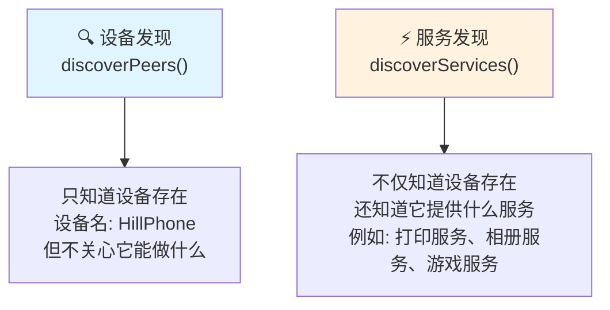
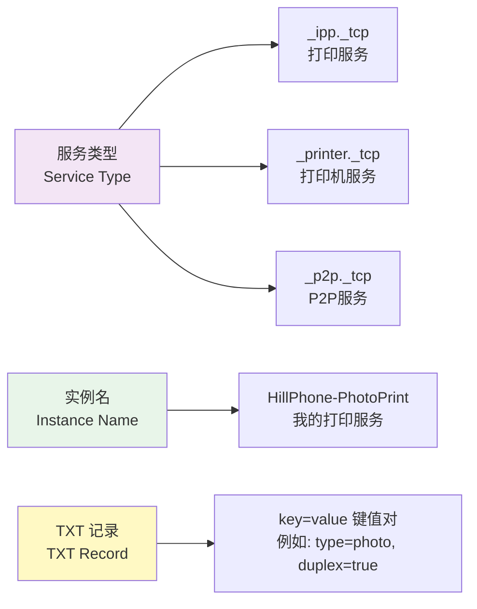
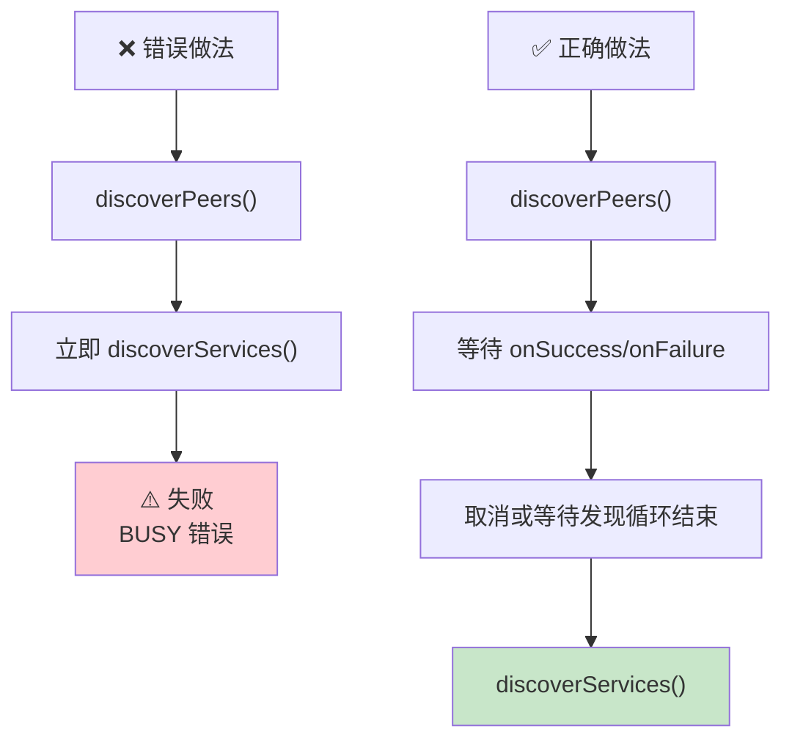
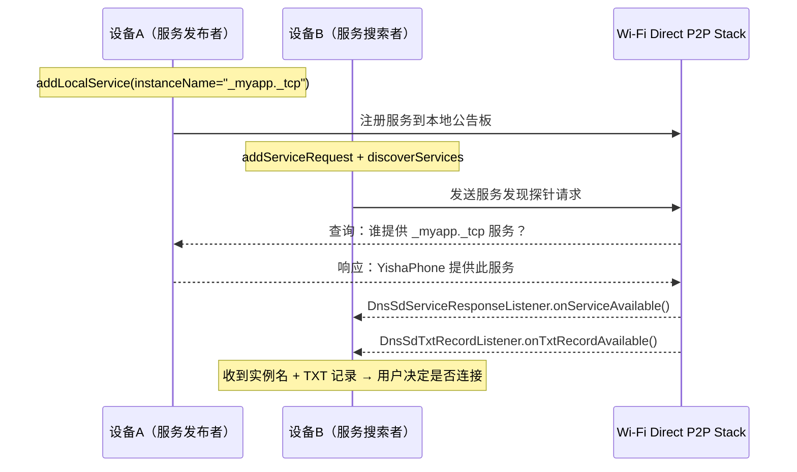

清晨的薄雾像一层轻纱，悄悄笼在草地上。

洛芙睁开眼的时候，帐篷里已经透进了淡淡的日光。她揉了揉眼睛，听到帐篷外传来希尔的声音，还有一阵窸窸窣窣的塑料薄膜声。

她钻出睡袋，撩开帐篷帘子往外看——希尔正蹲在折叠桌旁边，手里拿着两台手机，眉头皱成一团。伊莎坐在折叠凳上，双手捧着一杯还在冒热气的咖啡，目光悠远地望着远处的山棱线。黛琳则已经架好了那块随身带的小白板，手里捏着白板笔，似乎在等什么人。

"洛芙！你醒了！"希尔抬头看见她，立刻招手，"快来快来，我昨晚想到一个问题！"

"什么问题？"洛芙走过去，接过伊莎递来的一杯热可可。杯壁温热，蒸汽带着淡淡的甜味飘散开来。

"昨天我们学了 P2P 设备发现，对吧？"希尔把其中一台手机举起来，"我发现这两台手机可以互相找到对方了——你看，'HillPhone'和'DailinTab'，这就是 Wi-Fi Direct 的设备发现。但是……"

她顿了顿，眉头皱得更紧了。

"但是我不知道这台手机能干什么啊？"

洛芙愣了一下。"能干什么？不是已经连上了吗？"

"问题就在这里！"希尔一拍桌子，"我发现它、连接它，这都没问题——但如果我的手机上是美月开发的一个打印服务应用，而黛琳的平板是想要打印照片的那个，我得先知道'哦，这台设备上有打印服务'，才能决定要不要连它、对吧？如果我连上去才发现它没有打印服务，那不是白费力气了吗？"

"就像你走进一家餐厅，"伊莎轻轻开口，目光依然望着远山，"但菜单在门口——你还没进门，就能看到今天有什么菜。不是进去了才发现'哦这里只卖咖啡'。"

希尔连连点头。"对对对！伊莎说得对！就是那个意思！"

黛琳在旁边微微一笑，举起白板笔，在白板上写下两个字：**服务发现**。

"所以今天的问题就是——"她在两个字下面画了一道横线，"在 Wi-Fi Direct 的 P2P 连接**建立之前**，怎么知道对方设备提供了什么服务？"

## 清晨的露营地·技术讨论

薄雾渐渐散去，阳光大片大片地洒下来，草叶上的露珠开始一颗颗地蒸发。

"让我理一下，"洛芙捧着可可杯，缩在折叠凳上，"昨天我们学了 `discoverPeers()`，对吧？可以找到附近有哪些设备。"

"对，"黛琳点头，在白板上写下 `discoverPeers`，"这是**设备发现**——它只告诉你'这里有一台设备叫 HillPhone'，不告诉你这台设备能干什么。"

她又在旁边写下 `discoverServices`。

"而**服务发现**不一样。它告诉你'这里有一台设备，上面运行着**打印服务**'——不只是找到设备，还知道设备上跑着什么类型的服务。"

"打印服务？"美月从帐篷里钻出来，头发还乱糟糟的，手里拿着一块吃了一半的饼干，"什么打印服务？"

"就是……"希尔想了想，"比如说，你们四个在外面露营，手机里拍了照片，想打印出来。但是没有 Wi-Fi 路由器，也没有打印机——"

"那怎么打印？"美月眨眨眼。

"如果有一个人手机上有打印机驱动，另一个人手机上有照片，我们就可以用 Wi-Fi Direct 把这两台手机直连起来，然后直接把照片'发送'给打印机。"希尔解释道，"但关键问题是——我怎么知道谁的打印机开着、谁的手机有照片？总不能一台一台连上去试吧？"

"这就是服务发现的价值了。"黛琳在白板上画了一个简单的图：



"左边是设备发现，右边是服务发现，"黛琳指着图解释，"`discoverPeers()` 只能看到'这里有台设备'，`discoverServices()` 能看到'这里有台设备，而且它上面跑着一个**打印服务**'。"

"这样就省事多了！"洛芙眼睛一亮，"我一看'哦，有打印服务'，再去连接它！"

"对。这就是服务发现的核心价值——**按服务类型筛选，而不是盲目连接**。"

希尔把两台手机并排放在桌上。"那怎么用？"

## 服务类型·DNS-SD 的露营比喻

黛琳放下白板笔，转身面对大家。

"在讲代码之前，我想先讲一个有意思的东西——它叫 DNS-SD，听起来很复杂，但原理特别简单。"

"DNS-SD 是什么？"洛芙立刻举手。

"DNS-SD 是 **DNS-Service Discovery** 的缩写，"黛琳说，"但我更喜欢用伊莎昨天晚上的那个比喻——它就像露营地门口的**公告板**。"

伊莎微微侧头，嘴角浮现一丝笑意。

"你想啊，"黛琳继续说，"如果我们四个人在一个大型露营地，每个人都搭了帐篷。如果有人想找到'谁那里有热水'，最笨的办法是一个一个帐篷去敲门。但如果有公告板——"

"每个人在公告板上写上自己能提供什么，"洛芙接话，"'我有热水''我有打印机''我可以打印照片'——这样想找热水的人一看公告板就知道了！"

"完全正确。"黛琳点头，"DNS-SD 就是这样一个**公告板**系统。只不过这个公告板不是写在纸上的，而是写在**网络**上的。每台 Wi-Fi Direct 设备都可以在这个'公告板'上发布自己的服务信息——比如'我叫 HillPhone，我提供**打印服务**'。"

她转身在白板上写下几个关键词：



"DNS-SD 定义了三个东西，"黛琳逐一解释，"**服务类型**（`_ipp._tcp` 是打印机服务，`_p2p._tcp` 是 P2P 基础服务）、**实例名**（具体是哪台设备，比如'HillPhone-PhotoPrint'），还有 **TXT 记录**（额外的元数据，比如'支持双面打印''支持照片纸'之类）。"

"这个 `_ipp._tcp` 是什么……"洛芙看着有点懵。

"IPP 是 **Internet Printing Protocol** 的缩写，是打印机的标准网络协议，"黛琳解释道，"不过在 Android 的 Wi-Fi Direct 里，我们一般用自定义服务类型，比如 `_myapp._tcp`——你给自己的应用定义一个独一无二的名字就行。"

"那 TXT 记录呢？"美月问。

"TXT 记录就是附加信息，"希尔插嘴道，"比如说，你发布一个游戏服务，你的 TXT 记录可以是 `players=4``version=1.0`——让对方知道这个游戏支持几个人玩、是什么版本。这种键值对的形式很灵活。"

"所以，"洛芙双手比划着总结，"公告板上写着：服务类型（卖什么）、实例名（谁在卖）、TXT记录（有什么额外信息）——对吧？"

"完全正确。"黛琳微笑。

## 服务发布与发现·代码时间

希尔已经打开了笔记本，屏幕上的 Android Studio 界面闪着淡蓝色的光。

"来，我们写代码！"希尔拍了拍手，"首先，服务发现分成两步——**发布自己的服务**，和**搜索别人的服务**。"

"发布自己的服务？"洛芙问。

"对，你想让别人找到你，你就得先把自己的服务**广播**出去。这用 `addLocalService()` 方法。"

希尔开始敲代码：

```kotlin
// ============================================================
// 发布本地服务（让其他设备能发现你）
// ============================================================

// 第一步：创建服务信息
// WifiP2pManager 的 addLocalService() 需要一个 WifiP2pServiceInfo 对象
// 我们使用 WifiP2pUpnpServiceInfo 或 WifiP2pDnsSdServiceInfo
// 这里演示的是 DNS-SD 格式的自定义服务

// 定义服务类型（必须是 _servicetype._protocol 格式）
// 下划线是 DNS-SD 标准的强制要求
val serviceType = "_myphotoapp._tcp"   // 照片分享应用服务

// 定义实例名（设备在服务发现列表中显示的名字）
// 推荐包含设备名或用户名，方便用户识别
val instanceName = "HillPhone-Photoshare"

// 定义 TXT 记录（可选，用于存放元数据）
// Map 的 key 和 value 都必须是 String
val txtRecord = mapOf(
    "version" to "1.0",
    "owner" to "Hill",
    "features" to "photo,album"
)

// 创建 DNS-SD 服务信息对象
// 参数 1: 服务类型
// 参数 2: 实例名
// 参数 3: TXT 记录（传入空 map 也可以）
val localService = WifiP2pDnsSdServiceInfo.newInstance(
    instanceName,
    serviceType,
    txtRecord
)

// 第二步：注册本地服务监听器
// 在调用 addLocalService 之前，必须先设置服务响应监听器
// 否则系统不知道收到其他设备查询时该如何响应
manager.addServiceRequest(
    channel,
    WifiP2pDnsSdServiceRequest.newInstance(serviceType),
    ActionListener { /* 请求注册成功 */ }
)

// 第三步：调用 addLocalService()
// 这会将你的服务信息写入 P2P 公告板
// 其他设备调用 discoverServices() 时就能发现你
manager.addLocalService(channel, localService, object : ActionListener {
    override fun onSuccess() {
        Log.d(TAG, "✅ 本地服务发布成功！")
        Log.d(TAG, "   服务类型: $serviceType")
        Log.d(TAG, "   实例名: $instanceName")
    }

    override fun onFailure(reason: Int) {
        Log.e(TAG, "❌ 服务发布失败: $reason")
        // 常见的失败原因：
        // WifiP2pManager.ERROR: 内部错误
        // WifiP2pManager.P2P_UNSUPPORTED: 当前设备不支持 Wi-Fi Direct
    }
})
```

"等一下，"洛芙抬手，"这个 `channel` 是什么？"

"好问题！"希尔停下来，"这个 `channel` 就是我们上一章学的 `WifiP2pManager.Channel`——它是 Wi-Fi Direct 操作的句柄，由 `initialize()` 方法创建。每个 Wi-Fi Direct 操作都需要它，就像每个 HTTP 请求都需要一个连接一样。"

"那 `ActionListener` 呢？"

"回调接口，"黛琳解释，"Wi-Fi Direct 的操作都是**异步**的——你调用 `addLocalService()`，系统不会立刻告诉你成功还是失败，而是通过 `ActionListener` 的 `onSuccess()` 或 `onFailure()` 回调来通知你。这和我们之前学的 `discoverPeers()` 是一样的模式。"

"原来如此……"洛芙点头。

"好，接下来是**搜索服务**。"希尔继续敲代码。

```kotlin
// ============================================================
// 搜索远程服务（发现其他设备发布的服务）
// ============================================================

// 第一步：创建服务发现请求
// discoverServices() 需要一个服务请求对象
// 这里创建的是 DNS-SD 格式的服务请求
val serviceRequest = WifiP2pDnsSdServiceRequest.newInstance()

// 将请求加入 P2P 系统的监控列表
manager.addServiceRequest(channel, serviceRequest, object : ActionListener {
    override fun onSuccess() {
        Log.d(TAG, "✅ 服务请求注册成功")
    }

    override fun onFailure(reason: Int) {
        Log.e(TAG, "❌ 服务请求注册失败: $reason")
    }
})

// 第二步：设置服务发现监听器（接收发现到的服务信息）
// 这是 Wi-Fi Direct 服务发现的核心！

// 2a. 设置 DNS-SD 服务响应监听器（当发现一个服务时回调）
// 回调参数：
//   - originAddress: 发布服务的设备 MAC 地址
//   - serviceInfo: 服务信息对象，包含实例名和服务类型
val dnsSdServiceListener = WifiP2pManager.DnsSdServiceResponseListener { 
    originAddress, serviceInfo ->
    
    Log.d(TAG, "📡 发现服务!")
    Log.d(TAG, "   设备地址: ${originAddress.hostAddress}")
    Log.d(TAG, "   实例名: ${serviceInfo.instanceName}")
    Log.d(TAG, "   服务类型: ${serviceInfo.serviceType}")
    
    // 典型场景：判断服务类型，过滤并展示给用户
    if (serviceInfo.serviceType.contains("photo")) {
        Log.d(TAG, "   🌸 这是一个照片分享服务!")
    }
}

// 2b. 设置 DNS-SD TXT 记录监听器（当发现一个 TXT 记录时回调）
// 每次发现服务时，如果该服务有 TXT 记录，这个监听器也会被调用
// TXT 记录包含了服务的元数据（版本、功能描述等）
val dnsSdTxtListener = WifiP2pManager.DnsSdTxtRecordListener { 
    fullDomain, txtRecord ->
    
    Log.d(TAG, "📋 收到 TXT 记录:")
    Log.d(TAG, "   域名: $fullDomain")
    Log.d(TAG, "   TXT 记录内容: $txtRecord")
    
    // TXT 记录是一个 Map<String, String>
    // 可以读取其中的键值对来获取服务的附加信息
    val version = txtRecord["version"]
    val owner = txtRecord["owner"]
    Log.d(TAG, "   服务版本: $version, 所有者: $owner")
}

// 将监听器注册到 WifiP2pManager
// ⚠️ 这两个监听器必须在调用 discoverServices() 之前注册！
// 否则即使发现了服务，也没有人来处理
manager.setDnsSdResponseListeners(channel, dnsSdServiceListener, dnsSdTxtListener)

// 第三步：调用 discoverServices() 开始搜索服务
// discoverServices() 会触发 P2P 系统发送服务发现探针
// 当收到响应时，会回调上面注册的监听器
manager.discoverServices(channel, object : ActionListener {
    override fun onSuccess() {
        Log.d(TAG, "🔍 开始搜索服务...")
    }

    override fun onFailure(reason: Int) {
        Log.e(TAG, "❌ 服务搜索失败: $reason")
        // 常见失败原因：
        // - 先前已调用 discoverPeers()，两种发现操作冲突
        // - WifiP2pManager.BUSY: 系统忙，稍后再试
    }
})
```

"这段代码好多啊……"洛芙缩了缩脖子。

"确实比设备发现复杂，"黛琳承认，"但拆解开来就三层：**注册监听器 → 注册请求 → 调用发现**。就像你要钓鱼，先把鱼漂和鱼饵准备好（监听器），再把鱼钩甩出去（请求），最后等鱼上钩（回调）。"

希尔看着代码，忽然"啊"了一声。

"我想起来了！"她拍了拍桌子，"有一个**超级容易错的坑**——大家注意！"

她正襟危坐，一字一顿地说：

"**`discoverServices()` 和 `discoverPeers()` 不能同时调用！**"

"为什么？"洛芙立刻问。

"因为 Wi-Fi Direct 的 P2P 芯片在同一个时间只能做一件事——要么发现设备，要么发现服务，不能同时进行。"希尔解释道，"如果你先调用了 `discoverPeers()`，然后立刻调用 `discoverServices()`，第二个调用**会失败**，错误码是 `BUSY`。"

"那如果我想先发现设备、再发现服务呢？"洛芙问。

"正确的流程是：**先 `discoverPeers()`，等它结束（或者取消），再调用 `discoverServices()`**。"希尔说，"不能嵌套，不能同时开两个。"

她掏出手机，在上面画了一个流程：



"这里还有另一个容易出错的地方，"黛琳补充道，"`setDnsSdResponseListeners()` 必须**在 `discoverServices()` 之前**调用。如果你在调用发现之后才设置监听器，那些服务响应就会**漏掉**，因为你没有任何代码去接收它们。"

"就像你等快递，"伊莎轻轻说，"但你还没告诉门卫（监听器）看到快递要签收——快递来了也进不来。"

"伊莎的比喻永远这么精准！"希尔竖起大拇指。

## 反模式与重构·两种代码的对比

洛芙看着希尔的代码，眉头微皱。

"希尔姐姐，我看到一个不太对的地方……"她怯怯地举起手，"你把 `addServiceRequest` 和 `addLocalService` 放在一起，但是 `addServiceRequest` 是注册**搜索请求**的吧？发布自己的服务也需要注册请求吗？"

希尔愣了一下，然后露出一个"被逮到了"的表情。

"啊……你说得对。洛芙，你看到问题了。"

她挠了挠头，重新组织了一下代码。

"发布服务和搜索服务的流程是不同的。发布服务只需要 `addLocalService()`，**不需要** `addServiceRequest()`。而搜索服务需要 `addServiceRequest()` 来注册一个服务发现探针。"

"那刚才那段代码……"

"刚才那段代码混在一起了，是一个**反模式**。"希尔坦白承认，在白板上画了一个对比：

**❌ 反模式：发布服务时错误地注册了服务请求**

```kotlin
// 错误！发布本地服务不需要 addServiceRequest
// 这段代码会导致逻辑混乱，而且浪费系统资源
manager.addServiceRequest(
    channel,
    WifiP2pDnsSdServiceRequest.newInstance("_myphotoapp._tcp"),
    object : ActionListener { ... }
)
manager.addLocalService(channel, localService, object : ActionListener { ... })
// addLocalService() 只需要 channel 和 serviceInfo
// 根本不需要提前 addServiceRequest()！
```

**✅ 重构后：发布服务和搜索服务分开处理**

```kotlin
// 【发布服务】—— 只需要这三步，不需要 addServiceRequest
fun publishMyService() {
    val serviceInfo = WifiP2pDnsSdServiceInfo.newInstance(
        "HillPhone-Photoshare",
        "_myphotoapp._tcp",
        mapOf("version" to "1.0")
    )
    // ⚠️ 注意：addLocalService 不需要先 addServiceRequest
    manager.addLocalService(channel, serviceInfo, myListener)
}

// 【搜索服务】—— 才需要先 addServiceRequest
fun discoverRemoteServices() {
    // 搜索服务前，必须先注册服务发现请求
    val request = WifiP2pDnsSdServiceRequest.newInstance()
    manager.addServiceRequest(channel, request, requestListener)
    
    // 然后才能调用 discoverServices()
    manager.discoverServices(channel, discoverListener)
}
```

"这是一个经典的**混淆边界**反模式，"黛琳点评道，"把搜索服务的步骤（`addServiceRequest`）错误地应用到了发布服务的场景里。发布服务和搜索服务是两个**独立**的流程，它们的 API 路径完全不同。"

"我记下来了！"洛芙拿出小本子，"发布服务 = `addLocalService`；搜索服务 = `addServiceRequest` + `discoverServices`——两者不相干！"

## 服务发现实战·四人露营的应用场景

希尔把两台手机放在桌上，开始实际演示。

"来，我们模拟一个真实场景——美月拍了一张露营地的照片，想传给洛芙的平板打印出来。但是没有 Wi-Fi 路由器。"

"哦！我来当打印机！"伊莎举手。

"好，那伊莎的手机就是'打印服务'。首先，伊莎要发布她的打印服务——"

希尔在伊莎的手机上演示 `addLocalService()`，设置服务类型为 `_printer._tcp`，实例名为 `YishaPrinter-Camp`。

"现在，伊莎的手机已经在 P2P 公告板上写着：'我有打印服务，我是 YishaPrinter-Camp'。"

然后希尔在洛芙的平板上调用 `discoverServices()`。

几秒钟后，洛芙的平板屏幕上弹出了一行 Log：

```
📡 发现服务!
   设备地址: /192.168.49.137
   实例名: YishaPrinter-Camp
   服务类型: _printer._tcp
   
📋 收到 TXT 记录:
   域名: YishaPrinter-Camp._printer._tcp.local
   TXT 记录内容: {location=CampSite-A, color=true}
```

"出来了！"洛芙兴奋地叫出来，"我看到伊莎的打印服务了！而且 TXT 记录显示它支持彩色打印(`color=true`)，还在营位A(`location=CampSite-A`)！"

"太棒了！"美月凑过来看，"那我现在可以连接伊莎的手机，然后发送照片了吗？"

"理论上是这样，"黛琳说，"服务发现只是告诉你'谁提供了什么服务'，连接和数据传输还是需要走标准的 Wi-Fi Direct 连接流程。不过有了服务发现，你可以**先筛选再连接**，节省了大量'碰运气'的时间。"

"还有更多应用场景呢！"希尔兴奋地掰着手指数，"多人游戏——你发布一个'露营大冒险游戏服务'，其他人的设备搜索到之后直接加入游戏；照片共享相册——每个人发布自己的照片流服务，其他人按需浏览和获取；文件传输——自定义一个 `_filetransfer._tcp` 服务类型……"

"就像我们露营地晚上的 **UNO 大战**！"美月兴奋地说，"每个人打开手机上的 UNO 服务，其他人一搜'UNO'就能加入！不用任何 Wi-Fi 路由器！"

"对！而且还有 TXT 记录，"希尔补充，"比如 TXT 记录里写着 `players=3/4`，表示现在有3个人，最多4个人——加入之前就能知道房间满没满。"

洛芙托着腮帮子想了一会儿。

"所以……设备发现是找'人'，服务发现是找'人的技能'？"

"哇，洛芙这个总结好棒！"伊莎轻轻鼓掌。

"从技术角度来说，"黛琳补充道，"Wi-Fi Direct 的服务发现底层走的是 **DNS-SD over P2P** 协议。它复用了 Bonjour/Avahi 的服务发现机制，只是把传输层从普通的 Wi-Fi 网络搬到了 P2P 直连链路上。这意味着——"

"意味着你在 Android 上写的 DNS-SD 服务发现代码，和在普通局域网里用 Bonjour 的代码**思路是一样的**？"洛芙问。

"完全正确。区别只是传输层——一个是 AP 基础设施网络，一个是 P2P 直连。"

希尔合上笔记本，深吸一口气。

晨光已经完全亮起来了，薄雾散尽，远处的山棱线清晰可见。草叶上的露珠在阳光下闪闪发光，像撒了一地的碎钻。

"所以，总结一下，"希尔站起身，伸了个懒腰，"Wi-Fi Direct 服务发现，让我们可以在**连接之前**就知道对方设备提供什么服务。流程是：**发布服务**用 `addLocalService`，**搜索服务**用 `discoverServices` + `addServiceRequest`，接收发现结果用 `DnsSdServiceResponseListener` 和 `DnsSdTxtRecordListener`。"

"而且 `discoverPeers()` 和 `discoverServices()` 不能同时运行，`setDnsSdResponseListeners()` 必须在 `discoverServices()` 之前注册。"洛芙补充。

"你学得很快！"希尔朝她竖起大拇指。

美月打了个哈欠。"好饿……谁去烤吐司？"

"我去我去！"洛芙跳起来，"烤好了叫你！"

她跑向营地旁边的便携炉具，留下三人在晨光中微笑着看她远去的背影。

---

## 专业技术总结

> **Wi-Fi Direct 服务发现（P2P Service Discovery）** —— 一种在 Wi-Fi Direct P2P 连接建立**之前**，通过 DNS-SD over P2P 协议发现附近设备所提供服务的机制。设备无需连接即可知道对方能提供什么服务（打印、照片、游戏等），从而实现"先发现再连接"的智能筛选流程。相比纯设备发现（`discoverPeers`），服务发现额外返回服务类型、实例名和 TXT 记录元数据。

#### 结构图



> **DNS-SD over P2P**：将传统的 Bonjour/Android NSD 服务发现协议运行在 Wi-Fi Direct P2P 链路上。服务类型沿用 `_servicetype._protocol` 命名规范（如 `_printer._tcp`、`_ipp._tcp`）；实例名标识具体的服务提供者设备；TXT 记录以键值对形式携带元数据。

#### 复杂度与影响

| 操作 | 时间复杂度 | 说明 |
|---|---|---|
| `addLocalService` | O(1) | 本地注册，即时完成 |
| `discoverServices` | O(n) | 搜索范围受 P2P 发现窗口限制，n 为可见设备数 |
| TXT 记录解析 | O(k) | k 为 TXT 键值对数量，通常 <10 |
| `discoverPeers` vs `discoverServices` | 互斥 | 同一时刻只能运行一种发现流程，混用返回 `BUSY` |

#### 反模式与陷阱

**1. `discoverPeers()` 和 `discoverServices()` 混用**
- 症状：第二次调用返回 `WifiP2pManager.BUSY`
- 修复：先取消或等待第一个发现流程结束，再启动第二个

**2. 在 `discoverServices()` 之后才注册监听器**
- 症状：服务响应全部丢失，无任何回调
- 修复：必须先 `setDnsSdResponseListeners()`，再 `discoverServices()`

**3. 发布服务时错误调用 `addServiceRequest`**
- 症状：逻辑混乱，资源浪费，但不一定报错
- 修复：发布服务（`addLocalService`）不需要 `addServiceRequest`，两者流程独立

**4. TXT 记录包含过多数据**
- 症状：TXT 记录过大（超过 1300 bytes）导致分片，降低发现成功率
- 修复：TXT 记录保持精简，只放必要的元数据

#### 名词小传

**DNS-SD**：DNS-Based Service Discovery，最早由 Bonjour（Apple）和 Avahi（Linux）实现，2006 年随 RFC 6763 标准化。它利用 DNS 的 TXT 记录和 PTR 记录来描述网络服务，无需中心服务器即可实现零配置服务发现。

#### 设计哲学

Wi-Fi Direct 服务发现的设计体现了 **"发现与连接分离"** 的原则：

1. **先声明后连接**：设备在公告板上声明自己能提供的服务，其他设备可以"看榜"再决定是否连接，避免了盲目建立 P2P 连接的开销
2. **元数据前置**：TXT 记录让连接方在建立连接前就了解服务的版本、功能、状态等信息，实现更智能的筛选
3. **复用成熟协议**：DNS-SD 已在 Bonjour/Chromecast/HomeKit 中广泛验证，P2P SD 直接复用其语义，降低了开发者的学习成本
4. **异步非阻塞**：所有操作通过 `ActionListener` 回调，不阻塞主线程

#### 🏕️ 动手练习

**方式 A：项目制 —— 实现一个"露营照片分享 P2P 应用"**

**项目概述**：构建一个 Android 应用，支持用户发布自己的照片分享服务，其他用户可以搜索并发现附近的服务，实现无路由器环境下的照片互传。

---

**Task 1 · 搭建 Wi-Fi Direct 工程骨架（★）**

**目标**：配置 Wi-Fi Direct 权限和工程依赖。

**你需要做的事**：
1. 在 `AndroidManifest.xml` 中添加 Wi-Fi Direct 相关权限：`ACCESS_WIFI_STATE`、`CHANGE_WIFI_STATE`、`ACCESS_FINE_LOCATION`、`NEARBY_WIFI_DEVICES`（Android 13+）
2. 创建 `WifiP2pManager` 成员变量，在 `Activity.onCreate()` 中调用 `manager.initialize(this, mainLooper, channel -> {...})` 初始化 P2P Channel
3. 注册 `WiFiP2pManager.WIFI_P2P_STATE_CHANGED_ACTION` 广播接收器，检查 Wi-Fi Direct 是否启用

**验收标准**：
- [ ] Manifest 中权限齐全
- [ ] `WifiP2pManager` 和 `Channel` 正确初始化
- [ ] 应用启动时能正确检测 Wi-Fi Direct 状态

**提示**：
```kotlin
// AndroidManifest.xml 所需权限
<uses-permission android:name="android.permission.ACCESS_WIFI_STATE" />
<uses-permission android:name="android.permission.CHANGE_WIFI_STATE" />
<uses-permission android:name="android.permission.ACCESS_FINE_LOCATION" />
<uses-permission android:name="android.permission.NEARBY_WIFI_DEVICES" 
    android:usesPermissionFlags="neverForLocation" />
```

---

**Task 2 · 实现本地服务发布功能（★★）**

**目标**：用户点击按钮，将自己的照片分享服务发布到 P2P 公告板上。

**你需要做的事**：
1. 创建 `WifiP2pDnsSdServiceInfo.newInstance(instanceName, serviceType, txtRecord)`
2. 调用 `manager.addLocalService(channel, serviceInfo, listener)`
3. 在 `onSuccess` 中显示 Toast "服务发布成功"，在 `onFailure` 中显示错误原因
4. 服务类型使用 `_photoapp._tcp`，实例名为 `"用户名-Photoshare"`，TXT 记录包含 `version=1.0`

**验收标准**：
- [ ] 成功调用 `addLocalService` 且 `onSuccess` 被触发
- [ ] 同一设备的其他应用能看到你发布的服务（用 `discoverServices` 验证）
- [ ] 应用退出后服务自动取消发布（生命周期绑定）

**提示**：
```kotlin
val txtRecord = mapOf("version" to "1.0", "owner" to "玩家昵称")
val serviceInfo = WifiP2pDnsSdServiceInfo.newInstance(
    "玩家昵称-Photoshare",
    "_photoapp._tcp",
    txtRecord
)
manager.addLocalService(channel, serviceInfo, actionListener)
```

---

**Task 3 · 实现服务发现功能（★★★）**

**目标**：用户点击搜索按钮，发现附近所有发布照片分享服务的设备。

**你需要做的事**：
1. 创建 `WifiP2pDnsSdServiceRequest.newInstance()` 作为服务发现请求
2. 先调用 `manager.addServiceRequest(channel, request, listener)` 注册请求
3. 调用 `manager.setDnsSdResponseListeners(channel, serviceListener, txtListener)`
4. 最后调用 `manager.discoverServices(channel, listener)`
5. 将发现到的服务（实例名、设备地址）显示在 `RecyclerView` 中

**验收标准**：
- [ ] `setDnsSdResponseListeners` 在 `discoverServices` 之前调用
- [ ] 能正确接收 `DnsSdServiceResponseListener` 回调的实例名
- [ ] 能正确接收 `DnsSdTxtRecordListener` 回调的 TXT 记录
- [ ] 同一设备 Task 2 发布的服务能被 Task 3 发现

**提示**：
```kotlin
val serviceListener = WifiP2pManager.DnsSdServiceResponseListener { 
    addr, info ->
    // addr: 发布服务的设备地址
    // info.instanceName: 服务实例名
    // info.serviceType: 服务类型
    addServiceToList(addr, info.instanceName)
}

val txtListener = WifiP2pManager.DnsSdTxtRecordListener { 
    fullDomain, record ->
    // fullDomain: 完整域名，如 "MyPhone._photoapp._tcp.local"
    // record: TXT 键值对 Map
    updateServiceInfo(fullDomain, record)
}

manager.setDnsSdResponseListeners(channel, serviceListener, txtListener)
val request = WifiP2pDnsSdServiceRequest.newInstance()
manager.addServiceRequest(channel, request, requestListener)
manager.discoverServices(channel, discoverListener)
```

---

**Task 4 · 处理发现冲突：discoverPeers 与 discoverServices 互斥（★★★）**

**目标**：验证两种发现方式不能同时运行，实现可靠的发现切换逻辑。

**你需要做的事**：
1. 在一个按钮中先调用 `discoverPeers()`，然后**立即**调用 `discoverServices()`，观察 Logcat 中的错误
2. 重构为先 `discoverPeers()`，在其 `onSuccess` 中**取消发现**（`stopPeerDiscovery()`），再调用 `discoverServices()`
3. 用 `BroadcastReceiver` 监听 `WIFI_P2P_DISCOVERY_CHANGED_ACTION`，在发现状态改变时自动切换逻辑

**验收标准**：
- [ ] 观察到混用时的 `BUSY` 错误日志
- [ ] 正确实现先取消再切换的逻辑
- [ ] 在 UI 上清晰展示当前是"设备发现模式"还是"服务发现模式"

**提示**：
```kotlin
// 取消当前发现，再启动另一种发现
manager.stopPeerDiscovery(channel, object : ActionListener {
    override fun onSuccess() {
        Log.d(TAG, "peer发现已停止，启动服务发现")
        // 现在可以安全地调用 discoverServices()
        launchServiceDiscovery()
    }
    override fun onFailure(reason: Int) {
        Log.e(TAG, "停止发现失败: $reason")
    }
})
```

---

**Task 5 · TXT 记录实战：用元数据筛选服务（★★★★）**

**目标**：利用 TXT 记录中的版本号过滤，只显示支持最新版本 API 的服务。

**你需要做的事**：
1. 发布服务时，TXT 记录包含 `version` 字段
2. 在 `DnsSdTxtRecordListener` 的回调中解析 `version` 字段
3. 只将 `version` 大于等于"1.0"的服务添加到列表中显示
4. 在列表的 `getView()` 中显示版本信息

**验收标准**：
- [ ] 能正确读取 TXT 记录中的 `version` 字段
- [ ] 版本过滤逻辑正确（<1.0 的服务不显示或灰显）
- [ ] UI 上清晰展示每个服务的版本信息

---

**Task 6 · 综合实战：服务发现 + 连接 + 数据传输（★★★★★）**

**目标**：将服务发现与上一章（13.1.18）的 P2P 连接流程结合，实现"发现服务 → 用户选择 → 建立连接 → 传输数据"的完整闭环。

**你需要做的事**：
1. 在 `DnsSdServiceResponseListener` 回调中，记住用户点击的服务的设备地址
2. 用户点击列表项后，调用 `connect()` 建立 P2P 连接
3. 连接成功后，用 `WifiP2pInfo.groupOwnerAddress` 作为服务器地址
4. 通过 Socket 发送模拟数据（如 JSON 格式的照片元数据）
5. 在对方设备上接收并展示接收到的数据

**验收标准**：
- [ ] 点击发现列表中的服务，能正确建立 P2P 连接
- [ ] 连接建立后能完成数据传输（发送端收到 `onSuccess`，接收端收到数据）
- [ ] 有完整的 UI 状态反馈（发现中 → 连接中 → 传输中 → 完成）

**提示**：
```kotlin
// 用户点击发现列表中的服务 → 建立连接
val config = WifiP2pConfig()
config.deviceAddress = selectedDeviceAddress  // 从 DnsSdServiceResponseListener 获得
config.wps.setup = WpsInfo.PBC

manager.connect(channel, config, object : ActionListener {
    override fun onSuccess() {
        Log.d(TAG, "连接请求已发送，等待握手...")
    }
    override fun onFailure(reason: Int) {
        Log.e(TAG, "连接失败: $reason")
    }
})
```

---

**面试热身**

1. **Wi-Fi Direct 服务发现和设备发现的本质区别是什么？什么场景下必须用服务发现而不是设备发现？**
2. **DNS-SD over P2P 的服务类型命名规范是什么？自定义服务类型时有哪些注意事项？**
3. **`discoverPeers()` 和 `discoverServices()` 为什么不能同时运行？底层原因是什么？**
4. **TXT 记录在服务发现中扮演什么角色？如果 TXT 记录过长会有什么问题？**
5. **描述从发布服务到发现服务的完整 API 调用序列（包含所有监听器的注册时机）。**

#### 参考实现要点

1. **监听器先于发现调用**：任何 `discover*()` 操作所需的监听器必须在调用发现 API 之前注册，否则回调丢失
2. **两种服务信息类型**：`WifiP2pDnsSdServiceInfo` 用于自定义 DNS-SD 服务；`WifiP2pUpnpServiceInfo` 用于 UPnP/SSDP 服务；根据实际场景选其一
3. **TXT 记录保持精简**：建议单个 TXT 键值对的 value 长度不超过 100 字节，总 TXT 记录不超过 1300 字节
4. **服务发现的生命周期**：发布的服务在应用退出或调用 `removeLocalService()` 后自动失效；发现操作也应在 Activity/Fragment 生命周期中妥善管理（避免在 `onStop` 后仍进行异步回调）
5. **定位权限是必须的**：Wi-Fi Direct 服务发现需要 `ACCESS_FINE_LOCATION` 权限（Android 10 以下）或 `NEARBY_WIFI_DEVICES` 权限（Android 13+），无权限将直接失败

> 学习建议：Wi-Fi Direct 服务发现是 IoT 和近场社交场景的核心技术。建议从"多人大富翁游戏"或"露营照片快传"这类具体场景出发，先理解"公告板"的比喻，再上手代码。多注意 `discoverPeers` 与 `discoverServices` 的互斥特性，这是实际开发中最常见的踩坑点。

## 🍹洛芙的小小日记本

今天早上好充实！原来发现"谁有什么能力"和发现"谁在那里"是两件不同的事。伊莎的打印机比喻让我一下子记住了——公告板比挨个敲门高效多了。DNS-SD 的服务类型命名好有意思，`_tcp` 前面的下划线原来是 DNS-SD 标准的强制规范，不是随便写的！还有 TXT 记录，感觉就像公告板上额外贴的小标签，能写很多有用信息。代码写起来比听起来简单，只要记住"发布用 addLocalService，搜索用 addServiceRequest + discoverServices"这个口诀就好了。

## 今日关键词

- **Wi-Fi Direct 服务发现（P2P Service Discovery）**：在 Wi-Fi Direct P2P 连接建立之前，通过 DNS-SD 协议发现附近设备所提供服务的能力
- **DNS-SD（DNS-Based Service Discovery）**：基于 DNS 协议的服务发现机制，通过 TXT 和 PTR 记录描述网络服务
- **服务类型（Service Type）**：DNS-SD 中的服务标识，格式为 `_servicetype._protocol`，如 `_printer._tcp`、`_photoapp._tcp`
- **实例名（Instance Name）**：DNS-SD 中具体服务提供者的名称，如 "YishaPhone-Photoshare"
- **TXT 记录（TXT Record）**：DNS-SD 中以键值对形式存储的元数据，用于携带服务的附加信息（版本、状态、功能等）
- **addLocalService()**：WifiP2pManager 的方法，用于将本地服务注册到 P2P 公告板，使其他设备能够发现
- **discoverServices()**：WifiP2pManager 的方法，用于主动搜索附近设备发布的服务
- **addServiceRequest()**：WifiP2pManager 的方法，用于注册服务发现请求，必须在 discoverServices() 之前调用
- **DnsSdServiceResponseListener**：接收到 DNS-SD 服务响应时的回调，返回设备地址和服务信息
- **DnsSdTxtRecordListener**：接收到 DNS-SD TXT 记录响应时的回调，返回完整域名和键值对数据
- **WifiP2pDnsSdServiceInfo**：DNS-SD 格式的 P2P 服务信息对象，由 newInstance() 工厂方法创建
- **discoverPeers() 与 discoverServices() 互斥**：同一时刻 P2P 芯片只能运行一种发现流程，混用会返回 BUSY 错误
- **Bonjour**：Apple 实现的零配置网络服务发现协议，是 DNS-SD 的典型实现，Android NSD 兼容 Bonjour
- **Channel（WifiP2pManager.Channel）**：Wi-Fi Direct 操作的句柄，由 initialize() 创建，是所有 P2P API 调用的必需参数
- **ActionListener**：Wi-Fi Direct 异步操作的回调接口，通过 onSuccess() 和 onFailure() 通知操作结果
