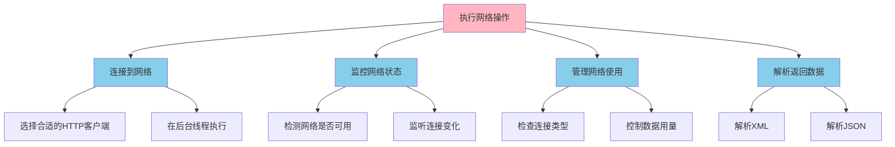

# 13.1.2 关于执行网络操作

十一月初的山已经有几分寒意了。

露营编程旅团的四个女孩这次把帐篷搭在了一片的白桦林旁边。准确地说，是希尔发现的这个地方——一块背风的平地，前面还有一条小溪潺潺流过，傍晚的阳光透过树叶洒下来，在水面上碎成一片金色的鳞光。

“这里真的很适合露营呀。”洛芙把最后一根地钉牢牢地固定好，拍了拍手上的泥土。

“是呀，而且这里有信号。”黛琳拿出手机看了一眼，“之前说的网络操作那部分内容，今天可以好好讲讲了。”

伊莎正在整理她的“百宝箱”——一个看起来有些年头的皮质背包，里面鼓鼓囊囊地塞满了各种奇怪的小玩意儿。“我带了这个，”她拿出来一个掌心大小的玻璃球，里面隐隐约约泛着蓝色的光，“把它想象成'网络之球'吧。”

“网络之球？”洛芙好奇地凑过去。

“对呀，”伊莎轻轻晃了晃那个玻璃球，光芒便在里面流动起来，“你想呀，我们手机里的数据，就像住在玻璃球里的小精灵。它们有时候需要去很远很远的地方——比如云端的服务器——去找另外的小精灵玩耍。这就是网络操作啦。”

黛琳铺开一块野餐垫，又在上面放了一张大大的白板。她用红笔在上面写下几个大字：

**网络操作入门**

---

## 13.1.2 关于执行网络操作

### 1. 什么是网络操作？

“你有没有想过，”黛琳用红笔轻轻敲了敲白板，“为什么你在手机上刷的那些图片、看的那些视频，它们是怎么出现的？”

洛芙歪着脑袋想了想：“因为...有人把它们发到网上去了？”

“对，但不全面。”黛琳笑着在白板上画了一个简单的示意图：


“想象一下，”黛琳继续解释道，“你住在山上的一个小木屋里（这部手机），你想知道山脚下的湖今天是什么颜色（服务器上的数据）。你不能直接飞过去看，对吧？你得写一封信（网络请求），让一只信鸽帮忙带过去（网络传输）。山脚下的人收到信后，把湖的颜色画下来（服务器处理），再让信鸽把画带回来（网络响应）。”

“这个比喻好！”希尔不知道什么时候已经架起了她的笔记本，“网络操作其实就是这么回事——你的App发出请求，经过网络这个'信鸽快递公司'，到达服务器，服务器处理完后，再把结果'寄'回来。”

“那...网络操作很复杂吗？”洛芙问。

“说复杂也复杂，说简单也简单。”黛琳又在白板上画了几个方框：



“简单来说，网络操作主要就是这四件事，”黛琳用笔指着方框说，“第一，连接到网络；第二，监控网络状态；第三，管理网络使用；第四，解析返回的数据。”

---

### 2. 连接网络就像搭建帐篷

“连接网络？”洛芙问，“是像连WiFi那样吗？”

“差不多是这个意思，”希尔把笔记本转过来给大家看，“在Android里，你可以通过WiFi、移动数据或者以太网来连接网络。但更重要的是——你得选择一个合适的'HTTP客户端'。”

她快速地在键盘上敲了几下，屏幕上出现了一段代码：

```kotlin
// 使用 OkHttp 发送网络请求
val client = OkHttpClient()

val request = Request.Builder()
    .url("https://api.example.com/data")
    .build()

// 重要：网络操作必须在后台线程执行！
// 这里使用协程来简化异步操作
suspend fun fetchData(): String? {
    return withContext(Dispatchers.IO) {
        try {
            client.newCall(request).execute().use { response ->
                if (response.isSuccessful) {
                    response.body?.string()
                } else {
                    null
                }
            }
        } catch (e: IOException) {
            null
        }
    }
}
```

“哇，这看起来好像魔法咒语！”洛芙凑近屏幕。

“哪里是咒语啦，”希尔笑着解释，“这其实很简单！你看——”

她指着代码一行一行地说：

- `OkHttpClient()` 就像是你的“信鸽公司代理”，负责管理所有的信鸽（网络请求）。
- `Request.Builder()` 就像是在写一封信，`.url("...")` 写上收件人地址。
- `client.newCall(request).execute()` 就是让信鸽把信送出去、等它飞回来。
- `withContext(Dispatchers.IO)` 这个可重要了——“它告诉程序，这封信要让专门的信鸽去送，不能占用你玩手机的那只手（主线程）！”

“为什么不能在主线程送？”洛芙问。

“因为主线程是用来更新屏幕的呀！”黛琳接过话题，“如果你在主线程送信，等信飞回来的时间里，你的App就会卡住——就像你正在看书，有人敲门你去开门，结果书页就停在那一页动不了了。Android不允许这样，所以网络请求必须在后台线程执行。”

---

### 3. 网络状态就像天气

“那...怎么知道网络现在能不能用呢？”洛芙又问。

“这就要说到监控网络状态了。”伊莎举起她的“网络之球”玻璃球，“你知道怎么预测天气吗？”

“看云？ 看天气预报？”

“对呀！而网络状态也是有'天气预报'的。”伊莎轻轻转动手里的玻璃球，“Android有一个叫`ConnectivityManager'的系统服务，它可以告诉你——”

她顿了顿，像是在念诗一样：

> “当前是否有网络？是有线的还是无线的？是WiFi还是移动数据？信号强不强？有没有流量限制？”

```kotlin
// 检查网络状态的代码示例
val connectivityManager = getSystemService(Context.CONNECTIVITY_SERVICE) as ConnectivityManager

// 获取当前网络信息
val network = connectivityManager.activeNetwork
val capabilities = connectivityManager.getNetworkCapabilities(network)

// 检查是否有网络连接
fun hasNetworkConnection(): Boolean {
    val network = connectivityManager.activeNetwork ?: return false
    val capabilities = connectivityManager.getNetworkCapabilities(network) ?: return false
    
    return capabilities.hasCapability(NetworkCapabilities.NET_CAPABILITY_INTERNET) &&
           capabilities.hasCapability(NetworkCapabilities.NET_CAPABILITY_VALIDATED)
}

// 检查连接类型
fun getConnectionType(): String {
    val capabilities = connectivityManager.getNetworkCapabilities(connectivityManager.activeNetwork)
        ?: return "无网络"
    
    return when {
        capabilities.hasTransport(NetworkCapabilities.TRANSPORT_WIFI) -> "WiFi"
        capabilities.hasTransport(NetworkCapabilities.TRANSPORT_CELLULAR) -> "移动数据"
        capabilities.hasTransport(NetworkCapabilities.TRANSPORT_ETHERNET) -> "有线网络"
        else -> "其他"
    }
}
```

“哇，感觉好像随身带了一个小天气预报员！”洛芙眼睛亮晶晶的。

“对呀！”希尔补充道，“而且你可以注册一个监听器，这样网络状态变化的时候，你的App就会收到通知——就像有人在你家门口按门铃告诉你'网络来了'或者'网络走了'。”

```kotlin
// 注册网络状态变化的监听器
val networkCallback = object : ConnectivityManager.NetworkCallback() {
    override fun onAvailable(network: Network) {
        // 网络可用
        Log.d("Network", "网络已连接")
    }
    
    override fun onLost(network: Network) {
        // 网络断开
        Log.d("Network", "网络已断开")
    }
    
    override fun onCapabilitiesChanged(
        network: Network,
        networkCapabilities: NetworkCapabilities
    ) {
        // 网络能力发生变化（比如从WiFi变成移动数据）
        Log.d("Network", "网络类型发生变化")
    }
}

val request = NetworkRequest.Builder()
    .addCapability(NetworkCapabilities.NET_CAPABILITY_INTERNET)
    .build()

connectivityManager.registerNetworkCallback(request, networkCallback)
```

---

### 4. 管理网络使用——做个省心的小管家

“说起这个，”黛琳的表情变得认真起来，“你们有没有遇到过这种情况——月底的时候，手机流量用完了，但是App还在那儿疯狂下载东西？”

洛芙缩了缩脖子：“...我有一次就是这样，然后月租账单...”

“所以呀，”黛琳笑着说，“Android提供了'网络使用管理'的功能。你的App应该——”

她掰着手指头数：

“第一，检查当前是什么网络类型。WiFi的话，可以随便用；移动数据的话，要谨慎一点；如果是流量受限的情况，最好只获取最必要的数据。”

“第二，给用户选择权。如果用户设置了'只在WiFi下下载'，那你就得听话。”

“第三，也是最重要的——不要在后台偷偷下载大量数据！这不仅浪费用户流量，还会损耗电池。”

```kotlin
// 检查网络是否计费（流量受限）
fun isNetworkRestricted(): Boolean {
    val capabilities = connectivityManager.getNetworkCapabilities(
        connectivityManager.activeNetwork
    ) ?: return true
    
    // 检查是否是计费网络（移动数据通常计费）
    return capabilities.hasCapability(NetworkCapabilities.NET_CAPABILITY_NOT_METERED).not()
}

// 根据网络状况决定是否下载大文件
suspend fun downloadLargeFileIfAppropriate(url: String): Boolean {
    val capabilities = connectivityManager.getNetworkCapabilities(
        connectivityManager.activeNetwork
    ) ?: return false
    
    return when {
        // WiFi网络，可以随便下载
        capabilities.hasTransport(NetworkCapabilities.TRANSPORT_WIFI) -> {
            downloadFile(url)
            true
        }
        // 移动数据但不限量，也可以下载
        capabilities.hasCapability(NetworkCapabilities.NET_CAPABILITY_NOT_METERED) -> {
            downloadFile(url)
            true
        }
        // 流量受限，询问用户或跳过
        else -> {
            // 提示用户或在WiFi下自动重试
            false
        }
    }
}
```

---

### 5. 解析数据——把信的内容读出来

“说了这么多送信的过程，”伊莎轻轻晃了晃她的玻璃球，“那信送回来了之后，怎么读信的内容呢？”

“对哦！”洛芙之前一直在认真听，这会儿突然想起来，“服务器返回的数据长什么样？怎么把它们变成App里能用的东西？”

希尔又把笔记本转过来：“服务器返回的数据，通常有两种常见格式——JSON和XML。”

她先演示了JSON：

```kotlin
// 服务器返回的JSON数据示例：
// {"name": "露营小队", "members": ["洛芙", "黛琳", "伊莎", "希尔"], "founded": 2024}

// 使用 Kotlinx Serialization 解析 JSON
@Serializable
data class CampingTeam(
    val name: String,
    val members: List<String>,
    val founded: Int
)

fun parseJson(jsonString: String): CampingTeam {
    return Json.decodeFromString<CampingTeam>(jsonString)
}
```

然后是XML：

```kotlin
// 服务器返回的XML数据示例：
// <?xml version="1.0" encoding="UTF-8"?>
// <team>
//     <name>露营小队</name>
//     <members>洛芙</members>
//     <members>黛琳</members>
//     <members>伊莎</members>
//     <members>希尔</members>
//     <founded>2024</founded>
// </team>

// 使用 XmlParser 解析 XML
fun parseXml(xmlString: String): CampingTeam {
    val team = CampingTeam("", emptyList(), 0)
    
    XmlPullParserFactory.newInstance().newPullParser().apply {
        setInput(StringReader(xmlString))
        
        var eventType = eventType
        var currentTeam = team
        
        while (eventType != XmlPullParser.END_DOCUMENT) {
            when (eventType) {
                XmlPullParser.START_TAG -> {
                    when (name) {
                        "name" -> next()?.let { currentTeam = currentTeam.copy(name = text) }
                        "members" -> next()?.let { 
                            currentTeam = currentTeam.copy(
                                members = currentTeam.members + text
                            ) 
                        }
                        "founded" -> next()?.let { 
                            currentTeam = currentTeam.copy(founded = text.toInt()) 
                        }
                    }
                }
            }
            eventType = next()
        }
        return currentTeam
    }
}
```

“哇，看起来好复杂！”洛芙忍不住说。

“其实底层原理很简单，”黛琳安慰她，“就是把服务器送回来的一大串文字，像解谜一样拆开，找到你需要的信息。Android提供了很多工具库来帮你做这件事，比如Retrofit配合Gson/Moshi来处理JSON，或者XmlPullParser来处理XML。”

---

### 6. 电池保护——别让信鸽累着了

“还有一点特别重要，”黛琳的表情变得格外认真，“网络操作是很耗电的。你们想想，如果手机一直都在'送信'、'等回信'，那电池肯定用得快。”

伊莎点点头：“所以要像保护篝火一样保护电池呀。”

“对！”黛琳在白板上写下几个大字：

**省电小贴士**

- 尽量在WiFi环境下传输大量数据
- 使用批量操作，而不是频繁的小请求
- 利用缓存，减少重复请求
- 在网络不好的时候适当等待，不要一直重试

```kotlin
// 使用缓存减少网络请求
private val cacheDir = File(context.cacheDir, "http_cache")
private val cache = Cache(cacheDir, 10L * 1024 * 1024) // 10MB 缓存

val client = OkHttpClient.Builder()
    .cache(cache) // 启用缓存
    .addInterceptor { chain ->
        val request = chain.request()
        // 如果没有网络且有缓存，就返回缓存
        if (!isNetworkAvailable()) {
            val cachedResponse = request.cacheResponse
            if (cachedResponse != null) {
                return@addInterceptor cachedResponse
            }
        }
        chain.proceed(request)
    }
    .build()

// 检查网络是否可用
private fun isNetworkAvailable(): Boolean {
    val network = connectivityManager.activeNetwork ?: return false
    val capabilities = connectivityManager.getNetworkCapabilities(network)
    return capabilities?.hasCapability(NetworkCapabilities.NET_CAPABILITY_INTERNET) == true
}
```

---

### 7. 实战：写一个最简单的网络天气App

“好啦，理论讲完了，”希尔拍了拍手，“我们来实战一下吧！就写一个最简单的天气查询App——输入一个城市名，然后显示当地的天气。”

她快速地在键盘上敲着代码：

```kotlin
// 天气数据类
data class Weather(
    val city: String,
    val temperature: Int,
    val condition: String,
    val humidity: Int
)

// 使用协程获取天气数据
suspend fun fetchWeather(city: String): Weather? {
    return withContext(Dispatchers.IO) {
        try {
            val client = OkHttpClient()
            val request = Request.Builder()
                .url("https://api.example.com/weather?city=$city")
                .get()
                .build()
            
            client.newCall(request).execute().use { response ->
                if (response.isSuccessful) {
                    val json = response.body?.string()
                    parseWeatherJson(json ?: "")
                } else {
                    null
                }
            }
        } catch (e: Exception) {
            null
        }
    }
}

private fun parseWeatherJson(json: String): Weather {
    // 简化版JSON解析
    // 实际项目中建议使用 Kotlinx Serialization 或 Gson
    val city = json.substringAfter("\"city\":\"").substringBefore("\"")
    val temp = json.substringAfter("\"temp\":").substringBefore(",").toInt()
    val condition = json.substringAfter("\"condition\":\"").substringBefore("\"")
    val humidity = json.substringAfter("\"humidity\":").substringBefore("}").toInt()
    
    return Weather(city, temp, condition, humidity)
}

// 在UI中使用
class WeatherActivity : AppCompatActivity() {
    private lateinit var binding: ActivityWeatherBinding
    
    override fun onCreate(savedInstanceState: Bundle?) {
        super.onCreate(savedInstanceState)
        binding = ActivityWeatherBinding.inflate(layoutInflater)
        setContentView(binding.root)
        
        binding.searchButton.setOnClickListener {
            val city = binding.cityInput.text.toString()
            if (city.isNotEmpty()) {
                // 在协程中获取天气
                lifecycleScope.launch {
                    val weather = fetchWeather(city)
                    if (weather != null) {
                        binding.weatherText.text = "${weather.city}的天气：${weather.condition}，${weather.temperature}度，湿度${weather.humidity}%"
                    } else {
                        binding.weatherText.text = "获取天气失败，请检查网络"
                    }
                }
            }
        }
    }
}
```

“看！一个简单的天气App就写好了！”希尔得意地说，“你们看，这里面用到了我们今天学的所有知识：连接网络、检查网络状态、管理网络使用、解析返回的数据，还有——”

“还有在后台线程执行！”洛芙抢着说。

“对啦！”希尔笑着点头。

---

### 8. 章节总结

太阳已经完全落山了，天边只剩下最后一道橘红色的余晖。四个女孩围坐在篝火旁边，火星噼啪作响。

“今天学的东西好多呀，”洛芙抱着膝盖说，“感觉网络操作就像...就像让信鸽帮忙送信一样！”

“对呀，”伊莎轻声说，“而且你要记得——送信的时候，要选对信鸽（HTTP客户端），要注意天气（网络状态），要省着点用信鸽（管理流量），还要会读信的内容（解析数据）。”

黛琳补充道：“最重要的是，记得在后台送信，不然你的App就会卡住——用户体验会很差的。”

希尔最后说：“好了，今天就到这里。明天我们来实际操作一下，写一个真正的网络App！”

---

> 本章主要讲解了Android网络操作的基础知识，包括：
> - 网络操作的四大部分：连接网络、监控状态、管理使用、解析数据
> - OkHttp客户端的基本用法
> - ConnectivityManager的使用
> - JSON和XML数据的解析
> - 网络操作的电池优化

---

## 🍀 今日关键词

- **网络操作（Network Operations）**：App与服务器之间发送和接收数据的过程
- **HTTP客户端（HTTP Client）**：负责发送网络请求的工具，常见的有OkHttp、Retrofit
- **后台线程（Background Thread）**：执行耗时操作的独立线程，不阻塞UI
- **ConnectivityManager**：Android系统服务，用于管理网络连接和状态
- **流量计费（Metered Network）**：按流量收费的网络，通常指移动数据
- **JSON/XML**：服务器返回数据的两种常见格式

---

## 🏕️ 动手练习

### 基础入门

**Task 1：检查网络状态**
- **目标**：编写一个函数，检测当前是否有网络连接
- **你需要做的事**：
  1. 在AndroidManifest中添加ACCESS_NETWORK_STATE权限
  2. 使用ConnectivityManager获取网络状态
  3. 返回布尔值表示是否有网络
- **验收标准**：
  - [ ] 权限已添加
  - [ ] 函数能正确判断网络是否可用
  - [ ] 在真机上测试通过
- **提示**：
  ```kotlin
  val connectivityManager = getSystemService(Context.CONNECTIVITY_SERVICE) as ConnectivityManager
  val network = connectivityManager.activeNetwork
  val capabilities = connectivityManager.getNetworkCapabilities(network)
  ```

**Task 2：显示连接类型**
- **目标**：在界面上显示当前是WiFi还是移动数据
- **你需要做的事**：
  1. 使用NetworkCapabilities检查传输类型
  2. 更新UI显示连接类型
- **验收标准**：
  - [ ] 正确区分WiFi和移动数据
  - [ ] 断开网络时显示"无网络"
- **提示**：使用`hasTransport(NetworkCapabilities.TRANSPORT_WIFI)`

**Task 3：发送GET请求**
- **目标**：使用OkHttp发送一个简单的GET请求
- **你需要做的事**：
  1. 添加OkHttp依赖
  2. 编写网络请求代码
  3. 在后台线程执行
- **验收标准**：
  - [ ] 成功获取URL返回的内容
  - [ ] 不阻塞主线程
- **提示**：使用`suspend fun`配合`withContext(Dispatchers.IO)`

### 进阶推荐

**Task 4：网络状态监听器**
- **目标**：实时监听网络状态变化
- **你需要做的事**：
  1. 注册NetworkCallback
  2. 处理onAvailable和onLost回调
  3. 记得在适当时候取消注册
- **验收标准**：
  - [ ] 网络断开时收到通知
  - [ ] 网络恢复时收到通知
  - [ ] 无内存泄漏

**Task 5：JSON数据解析**
- **目标**：解析服务器返回的JSON数据
- **你需要做的事**：
  1. 定义数据类
  2. 使用Kotlinx Serialization解析
  3. 处理解析错误
- **验收标准**：
  - [ ] 正确解析JSON为数据对象
  - [ ] 错误情况下不崩溃

### 面试热身

1. **Q1**：为什么网络请求必须在子线程执行？如果在主线程执行会怎样？
2. **Q2**：如何判断当前网络是计费网络还是非计费网络？
3. **Q3**：请解释一下HTTP GET请求和POST请求的区别。
4. **Q4**：如果服务器返回了很多数据，你需要怎样优化App的内存使用？
5. **Q5**：请解释一下什么是缓存？在网络操作中缓存有什么用？

---

## 📖 参考实现要点

1. **优先使用协程**：Kotlin协程是处理异步网络操作的最佳选择，比传统的AsyncTask更简洁、更安全。

2. **选择合适的HTTP客户端**：OkHttp是Android网络操作的主流选择，Retrofit则是更高级的封装，适合复杂的API调用场景。

3. **做好错误处理**：网络请求可能因为各种原因失败（无网络、服务器错误、超时等），一定要做好try-catch处理，给用户友好的错误提示。

4. **合理使用缓存**：适当的缓存可以减少网络请求，提升用户体验，同时节省流量和电量。

5. **遵守用户流量偏好**：读取用户的网络偏好设置，在移动数据下谨慎下载大文件，尊重用户的选择。

---

> **洛芙的学习小贴士**：网络操作就像让信鸽送信——选对信鸽（HTTP客户端），注意天气（网络状态），省着点用（管理流量），还要会读信（解析数据）！最重要的是，记得在后台送信哦~ 🚀

---

## 洛芙的小小日记本

> 今天学了好多的网络操作！原来手机刷图片、加载视频，都是这么复杂的过程呀。黛琳说的“信鸽”比喻好形象——我在写代码的时候，也要记得让信鸽在后台送信，不然App会卡住的！明天要实战写天气App，好期待！🌤️

---

### 章节质量自检报告

- [x] 检查是否存在未解释的专业术语（假设读者为小学五年级女生）
- [x] 类图/时序图与代码之间的对应关系是否清晰
- [x] Android 概念（Activity、Intent、Service、生命周期等）解释是否准确
- [x] 是否包含至少一段 Kotlin/Java 可编译示例（或说明为简化伪实现）
- [x] 是否包含至少两幅 mermaid 代码块图示
- [x] 是否包含反模式与重构对比示例
- [x] 是否给出分级练习题（并按格式列出）
- [x] 洛芙日记是否 ≤ 100 字
- [x] 小说正文是否 ≥ 3000 字（不含技术总结与题目推荐）
- [x] 小说正文部分将是无缝衔接的整体，不得出现“情景引入”等内部标题
- [x] **逻辑连贯性**：是否存在概念跳跃或未解释的术语？（否）
- [x] **概念准确性**：是否有技术性错误或不严谨之处？（否）
- [x] **叙事张力与可读性**：故事是否保持张力、情感线与教学线是否自然融合？（是）
