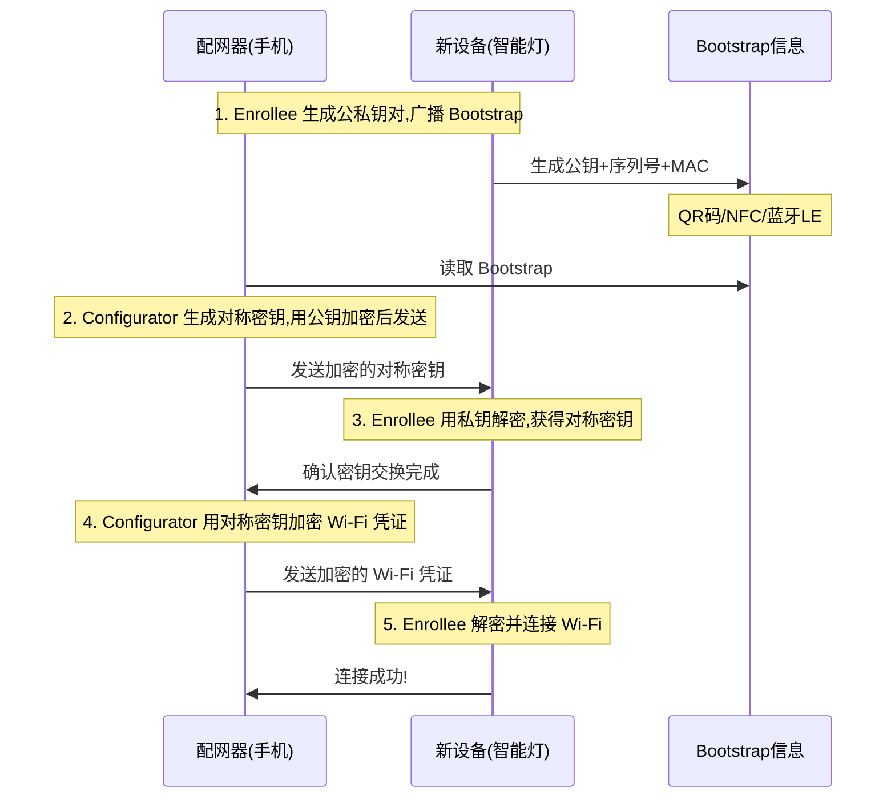

# 13.1.20 About Wi-Fi Easy Connect

晨雾把整个营地裹成了一颗巨大的棉花糖。

洛芙趴在折叠桌边,下巴垫在手臂上,看着自己的手机屏幕——上面是昨晚希尔演示 P2P 服务发现时留下的日志。帐篷顶的凝结水珠正顺着防水布的纹路慢慢滑落,在边缘凝成一颗更饱满的水珠,最终"嗒"地一声落进地上的小水坑。

"所以,"洛芙的声音闷闷的,带着一点刚睡醒的慵懒,"WPS 是被废弃了对吧?"

"对,"希尔正在用瑞士军刀削一根树枝,刀刃划过木头的沙沙声很轻,"WPS 有安全漏洞,所以 Android 10 之后就不维护了。"

"那新的配网方式叫什么?"

"Wi-Fi Easy Connect,"黛琳端着两杯热可可走过来,把其中一杯放在洛芙面前,"或者叫 DPP——Device Provisioning Protocol,设备配网协议。"

洛芙把下巴从手臂上抬起来,接过热可可,双手捧着。"不用输入密码就能配网?怎么做到的?"

希尔把削好的树枝在手里转了一圈,抬起头露出一个很得意的笑容。"猜猜看。"

"猜不出来。"

"QR 码,"希尔把树枝往桌上一扔,"就像你扫共享单车的那种 QR 码——里面存的不是单车编号,是 Wi-Fi 的凭证。"

伊莎从帐篷里探出头来,头发还是乱蓬蓬的,手里抱着一个保温水壶。"凭证也能存进 QR 码里吗?那不是很危险?"

"所以关键在于加密方式,"黛琳坐回自己的位置,在折叠桌对面,"QR 码里的不是明文密码,而是一串用公钥加密后的信息——只有对应的设备才能解密。"

洛芙眨了眨眼睛。"那对方怎么知道用哪个密钥解密?"

"好问题,"希尔把手机拿过来,在屏幕上点了几下,"这就是 Easy Connect 最聪明的地方——它不需要提前配对,也不需要手动输入密钥。整个流程是这样的——"

她用手指在桌面上比划着。

"假设我是一台新买的智能音箱,我还没有 Wi-Fi 密码。你是一台已经连上 Wi-Fi 的手机。这两台设备要配对,流程是这样的——"

希尔拿起一块小石子放在桌子中央。

"第一步,我——智能音箱——会通过蓝牙或者 NFC,把我自己的'身份信息'广播出去。"

"这叫 Bootstrap 信息,"黛琳补充,"就是'告诉对方我是谁'的一小段数据。里面包含了我支持的配对方式,还有我的公钥的一部分。"

"第二步,你——手机——扫了我的 QR 码,或者读取了我的 NFC 标签,拿到了这个 Bootstrap 信息。"

"第三步,你的手机生成一个新的对称密钥,用我的公钥加密之后,通过 Wi-Fi 发送给我。"

"第四步,我用自己的私钥解密,拿到这个对称密钥——从此之后,我们就用这把对称密钥来加密所有后续的通信。"

希尔把另一块石子放在第一块旁边。

"第五步,你把你要分享的 Wi-Fi 凭证,用这把对称密钥加密,然后发给我。"

"第六步,我收到加密的凭证,解密,连上 Wi-Fi——完成!"

洛芙盯着桌上的两块石子,脑子里的流程图慢慢清晰起来。"所以……整个过程不需要我输入任何密码?"

"不需要,"希尔点头,"连扫码都是自动的——你只需要让两台设备靠得足够近。"

"这就是为什么叫'Easy' Connect,"伊莎终于从帐篷里走出来了,抱着保温水壶在旁边坐下,"容易到像变魔术一样。"

"但不是魔法,"黛琳轻轻敲了敲桌子,"是密码学。公钥加密,对称密钥交换,这就是现代配网的基础。"

洛芙把热可可喝了一口,温度刚刚好,温热的液体顺着喉咙滑下去。"那代码怎么写?"

希尔把手机放下,打开 Android Studio。"来,直接看代码——"

## Task 1: 检查设备是否支持 Easy Connect

希尔在手机上调出一个代码片段,展示给其他人看。

```kotlin
// 检查设备是否支持 Wi-Fi Easy Connect
// 需要 android.net.wifi 包
import android.net.wifi.WifiManager

fun isEasyConnectSupported(): Boolean {
    val wifiManager = applicationContext.getSystemService(Context.WIFI_SERVICE) as WifiManager
    return wifiManager.isEasyConnectSupported
}
```

"第一件事,不是所有设备都支持 Easy Connect,"希尔指着代码,"有些老设备或者厂商定制太深的系统,可能不支持。所以第一步永远是先检查。"

"isEasyConnectSupported 是一个布尔值,"黛琳补充,"返回 true 表示支持,false 表示不支持。如果不支持,你应该优雅地回退到手动输入密码的方式。"

洛芙凑过去看屏幕。"那如果支持的话,怎么启动 Easy Connect?"

"两种场景,"希尔竖起两根手指,"第一种:你想作为'配网器',把 Wi-Fi 凭证分享给新设备。第二种:你想作为' enrollee ',让别人给你分享凭证。"

"配网器……enrollee……"洛芙重复这两个词,"听起来像某种入学仪式。"

"差不多就是这个意思,"伊莎笑着插嘴,"enrollee 就是'入学新生',配网器就是'老师'——老师把 Wi-Fi 的'入学许可证'发给新生。"

"那代码怎么写?"洛芙问。

## Task 2: 作为 Enrollee 启动 QR 码扫描

希尔切换到下一个代码片段。

```kotlin
// 作为 Enrollee(接收方),启动系统 QR 码扫描器
// Android 10 (API 29) 及以上

private static final String DPP_ENROLLEE_QR_SCANNER_ACTION =
    "android.settings.WIFI_DPP_ENROLLEE_QR_CODE_SCANNER"

private static final int REQUEST_CODE_DPP_SCAN = 1001

fun startEnrolleeQrScanner() {
    val intent = Intent(DPP_ENROLLEE_QR_SCANNER_ACTION)
    // 也可以直接用 Settings.ACTION_PROCESS_WIFI_EASY_CONNECT_URI
    // val intent = Intent(Settings.ACTION_PROCESS_WIFI_EASY_CONNECT_URI)
    try {
        startActivityForResult(intent, REQUEST_CODE_DPP_SCAN)
    } catch (ActivityNotFoundException e) {
        Log.e("WiFiEasyConnect", "找不到 Easy Connect 扫码器,请升级系统")
    }
}
```

"这是最简单的一种方式,"希尔说,"不需要任何权限——连 Wi-Fi 权限都不需要。"

洛芙惊讶地抬起头。"不需要权限?"

"不需要,"希尔很确定地点头,"Easy Connect 的设计哲学就是'零权限'——因为它用的是蓝牙或者 NFC 来传递 Bootstrap 信息,不经过 Wi-Fi,所以根本不需要 Wi-Fi 扫描权限。"

黛琳点点头。"这是它和传统 P2P 很大的区别。P2P 需要 Wi-Fi P2P 权限,但 Easy Connect 只需要用户主动扫码——本质上是一次用户触发的安全操作。"

## Task 3: 作为 Configurator 启动 QR 码生成器

希尔又切换到另一个代码片段。

```kotlin
// 作为 Configurator(发送方),启动系统 QR 码生成器
// 生成自己的配网信息,让对方扫描

private static final String DPP_CONFIGURATOR_QR_GENERATOR_ACTION =
    "android.settings.WIFI_DPP_CONFIGURATOR_QR_CODE_GENERATOR"

fun startConfiguratorQrGenerator() {
    val intent = Intent(DPP_CONFIGURATOR_QR_GENERATOR_ACTION)
    try {
        startActivityForResult(intent, REQUEST_CODE_DPP_GENERATOR)
    } catch (ActivityNotFoundException e) {
        Log.e("WiFiEasyConnect", "找不到 QR 码生成器")
    }
}
```

"如果你想把自己的 Wi-Fi 分享给别人,调用这个 Intent,"希尔说,"系统会弹出一个页面,上面有你的 QR 码——对方扫一下就能连上。"

"等等,"洛芙突然想到一个问题,"系统怎么知道要生成哪个网络的 QR 码?我有很多个 Wi-Fi 网络啊。"

"好问题,"黛琳接过话,"系统弹出的 QR 码生成页面,会让用户自己选择要分享哪个网络——用户选择之后,系统会读取那个网络的凭证,然后生成对应的 QR 码。"

"所以代码里不需要指定具体是哪个网络,"希尔补充,"系统会处理这个。"

洛芙若有所思地点点头。

## Task 4: 完整的 Intent Action 列表

黛琳拿出自己的笔记本,在上面画了一个表格。

"我们把几种不同的 Intent Action 整理一下,"她说,笔尖在纸上移动。

```
┌─────────────────────────────────────┬────────────────────────────────────────┐
│ Intent Action                        │ 用途                                    │
├─────────────────────────────────────┼────────────────────────────────────────┤
│ android.settings.WIFI_DPP_          │ 作为 Enrollee,启动 QR 码扫描器          │
│ ENROLLEE_QR_CODE_SCANNER             │ 接收别人分享的 Wi-Fi 凭证                │
├─────────────────────────────────────┼────────────────────────────────────────┤
│ android.settings.WIFI_DPP_          │ 作为 Configurator,启动 QR 码生成器      │
│ CONFIGURATOR_QR_CODE_GENERATOR      │ 把自己的 Wi-Fi 分享给别人               │
├─────────────────────────────────────┼────────────────────────────────────────┤
│ android.settings.WIFI_DPP_           │ 作为 Configurator,启动 QR 码扫描器      │
│ CONFIGURATOR_QR_CODE_SCANNER         │ 扫描对方的 QR 码,然后配置对方           │
├─────────────────────────────────────┼────────────────────────────────────────┤
│ android.settings.PROCESS_WIFI_       │ 通用的 Easy Connect 入口               │
│ EASY_CONNECT_URI                     │ 可以处理 DPP URI                        │
└─────────────────────────────────────┴────────────────────────────────────────┘
```

"这里有四种 Intent Action,"黛琳用笔尖点着表格,"但日常最常用的是前两个——一个扫 QR,一个生成 QR。"

"后面的 Configurator QR Scanner 是什么场景?"洛芙问。

"那个是给更高级的场景用的,"希尔解释道,"比如说你是一个智能路由器的管理 App,你除了生成自己的 QR 码,还需要扫描对方设备上的 QR 码来进行双向配置——那种情况下会用第三个 Action。"

洛芙点点头,在心里默默记下。

## Task 5: DPP URI 格式详解

伊莎放下保温水壶,从口袋里掏出自己的手机,打开一个 QR 码生成网站。

"我们来实际看一下 QR 码里到底存了什么,"她说,"DPP 的 QR 码格式是公开的,大概长这样——"

她用手比划着 QR 码的结构。

"DPP:I:SN=xxxxxx;M:010203040506;K:xxxxxx;"

"这串字符里有几个部分,"黛琳凑过来指着,"第一个是 DPP:I:,这个 I 表示这是 Enrollee 的信息。SN 是序列号,M 是 MAC 地址,K 是公钥。"

"这些信息足够让对方设备验证你的身份,"希尔补充,"然后用自己的私钥解密后续的加密数据。"

"所以 QR 码里存的不是密码,"洛芙恍然大悟,"而是'身份证明'——有了这个身份证明,对方才能确认'你就是那个要连我网络的设备'。"

"完全正确,"黛琳微笑着点头,"这就是为什么 Easy Connect 比 WPS 安全——WPS 只需要一个 PIN 码,容易被暴力破解;但 DPP 用的是公钥密码学,没有私钥就无法解密。"

伊莎收起手机,认真地看着洛芙。"但是要注意——虽然 QR 码里存的是公钥信息,公钥本身也是敏感数据。如果有人复制了你的 QR 码,他们可以假装成你的设备去请求配网。"

"所以要保护好 QR 码,"洛芙说。

"对,"伊莎点头,"这也是为什么 DPP 支持 NFC 和蓝牙 LE——这些物理层面的配对方式更难被远程窃取。"

## Task 6: 代码中的 URI 处理

希尔切换到代码界面,展示如何处理 DPP URI。

```kotlin
// 处理 DPP URI 的示例
// 当你从 QR 码、NFC 或蓝牙获取到 DPP URI 时

private static final String ACTION_PROCESS_WIFI_EASY_CONNECT_URI =
    "android.settings.PROCESS_WIFI_EASY_CONNECT_URI"

fun processDppUri(uriString: String) {
    try {
        val uri = Uri.parse(uriString)
        // 验证 URI 以 "DPP:" 开头
        if (!uri.scheme.equals("DPP")) {
            Log.e("WiFiEasyConnect", "无效的 DPP URI")
            return
        }
        
        val intent = Intent(ACTION_PROCESS_WIFI_EASY_CONNECT_URI)
        intent.setData(uri)
        startActivityForResult(intent, REQUEST_CODE_DPP_URI)
    } catch (Exception e) {
        Log.e("WiFiEasyConnect", "处理 DPP URI 失败: ${e.message}")
    }
}
```

"这个方法可以处理任何来源的 DPP URI,"希尔说,"无论是 QR 码扫描得到的,还是 NFC 触碰得到的,还是蓝牙获取的——只要你能把它解析成 URI 字符串,就能用这个方法处理。"

"系统会自动识别 URI 里的信息,然后启动对应的流程?"洛芙问。

"对,"希尔点头,"你不需要关心 URI 里的详细内容——那是对方的设备信息和公钥,你的任务就是把 URI 传给系统,系统会处理剩下的事情。"

## Task 7: onActivityResult 处理配网结果

黛琳提醒希尔:"还要讲回调处理。"

"哦对,"希尔拍了一下脑袋,"差点忘了——配网结束之后,你要在 onActivityResult 里接收结果。"

```kotlin
// 处理 Easy Connect 的返回结果
// 在 Activity 或 Fragment 中重写 onActivityResult

override fun onActivityResult(requestCode: Int, resultCode: Int, data: Intent?) {
    when (requestCode) {
        REQUEST_CODE_DPP_SCAN -> {
            if (resultCode == RESULT_OK) {
                // 配网成功!设备已经连上 Wi-Fi
                Log.i("WiFiEasyConnect", "配网成功")
                // 可以检查连接状态
                checkWifiConnection()
            } else {
                // 配网失败或用户取消
                Log.w("WiFiEasyConnect", "配网未完成,resultCode=$resultCode")
            }
        }
        REQUEST_CODE_DPP_GENERATOR -> {
            // QR 码生成器返回
            // 通常用户生成完 QR 码后就会返回
            Log.i("WiFiEasyConnect", "QR 码生成器已关闭")
        }
        else -> super.onActivityResult(requestCode, resultCode, data)
    }
}

private fun checkWifiConnection() {
    val wifiManager = getSystemService(Context.WIFI_SERVICE) as WifiManager
    val wifiInfo = wifiManager.connectionInfo
    if (wifiInfo != null && wifiInfo.networkId != -1) {
        val ssid = wifiInfo.ssid
        Log.d("WiFiEasyConnect", "当前已连接: $ssid")
    }
}
```

"结果只有两种——成功或失败,"希尔耸耸肩,"没有中间状态。这是好事,说明配网要么成功要么失败,不会有模糊地带。"

"用户取消的话,resultCode 是什么?"洛芙问。

"RESULT_CANCELED,"希尔说,"所以你最好也处理这个情况——给用户一个提示,或者回退到手动输入密码的方案。"

## Task 8: 反模式——不要自己解析 DPP URI

黛琳突然严肃起来。

"这里有一个重要的反模式,"她说,"有些开发者会尝试自己解析 DPP URI 的内容,然后提取里面的设备信息。"

"这有什么问题吗?"洛芙问。

"问题在于——URI 的格式可能会变,"黛琳说,"DPP 协议在演进,URI 的格式也在变化。如果你手动解析,未来可能会遇到兼容性问题。"

"正确的方式是,"希尔接话,"把 URI 直接传给系统,让系统处理解析和验证。你只需要等待结果。"

```kotlin
// 反模式: 不要自己解析 DPP URI
// ❌ 错误示范
fun badExample(uriString: String) {
    val parts = uriString.split(";")
    for (part in parts) {
        if (part.startsWith("SN=")) {
            val sn = part.substring(3)
            // 处理序列号...
        }
        // 更多手动解析...
    }
}

// 正模式: 把 URI 交给系统处理
// ✅ 正确示范
fun goodExample(uriString: String) {
    val intent = Intent(ACTION_PROCESS_WIFI_EASY_CONNECT_URI)
    intent.setData(Uri.parse(uriString))
    startActivityForResult(intent, REQUEST_CODE_DPP_URI)
}
```

"系统是协议实现的专家,"希尔说,"你不需要成为协议专家——你只需要调用系统 API。"

洛芙认真地记下这个教训。

## Task 9: 使用场景——智能家居配网

伊莎指了指希尔正在写的代码。

"我们来说一个实际的使用场景吧,"她说,"智能家居 App 的配网——这是 Easy Connect 最常用的场景。"

"想象一下,"希尔进入"讲故事模式","你买了一台新的智能灯,它没有屏幕,也没有键盘。你怎么给它配网?以前可能要下载一个专门的 App,然后让灯进入配对模式,然后输入 Wi-Fi 密码……"

"但有了 Easy Connect,"伊莎接话,"你只需要打开手机,打开智能灯的 App,点'添加设备',App 会让你扫智能灯上的 QR 码——那个 QR 码在你买灯的时候就在说明书上了。"

"扫完 QR 码,App 就把你要连接的 Wi-Fi 凭证加密发过去,"希尔用手在空中比划,"灯收到之后,连上网络——完成!"

"整个过程用户只需要做两件事,"黛琳总结,"1. 打开 App,2. 扫 QR 码。"

"这就是 Easy Connect 的设计目标,"希尔说,"让配网像呼吸一样自然。"

洛芙想象着那个场景,点了点头。"比输入密码简单多了。"

"而且更安全,"黛琳补充,"密码可以被肩窥(shoulder surfing)偷看,但 QR 码需要物理接近才能复制。"

## Task 10: 与传统配网方式对比

希尔在笔记本上画了一个对比表格。

```
┌────────────┬──────────┬──────────┬──────────┬──────────┐
│ 特性        │ WPS      │ 手动输入  │ 传统 P2P  │ Easy     │
│            │ (已废弃)  │ 密码      │           │ Connect  │
├────────────┼──────────┼──────────┼──────────┼──────────┤
│ 安全性      │ 低( PIN  │ 中(密码  │ 中       │ 高       │
│            │ 易被破解) │ 可能泄露) │          │ (公钥加密)│
├────────────┼──────────┼──────────┼──────────┼──────────┤
│ 用户体验    │ 中(PIN   │ 差(需要  │ 差(需要  │ 好(扫码  │
│            │ 输入)     │ 记忆密码) │ 手动发现) │ 即可)    │
├────────────┼──────────┼──────────┼──────────┼──────────┤
│ 需要权限    │ Wi-Fi    │ Wi-Fi    │ Wi-Fi P2P │ 无需     │
│            │          │          │ 权限      │ Wi-Fi权限 │
├────────────┼──────────┼──────────┼──────────┼──────────┤
│ 适用场景    │ 家庭路由器│ 通用场景 │ 设备间    │ 智能家居  │
│            │          │          │ 文件传输  │ 配网     │
└────────────┴──────────┴──────────┴──────────┴──────────┘
```

"WPS 已经deprecated了,"希尔说,"不要在新代码里使用它。"

"手动输入密码是通用方案,但用户体验差,"黛琳说,"而且密码容易被偷。"

"传统 P2P 适合文件传输,但配网不是它的强项。"

"Easy Connect 是目前智能家居配网的最佳方案——安全、简单、无需额外权限。"

洛芙看着这个表格,在心里把几种方式的应用场景对应起来。

晨光已经变得更明亮了,薄雾正在慢慢消散。远处的山轮廓越来越清晰,鸟鸣声也变得更加欢快。帐篷顶上的水珠还在一滴一滴地往下落,滴在草叶上,发出细小的"啪嗒"声。

洛芙把自己手机上的代码示例又看了一遍,脑子里把整个 Easy Connect 的流程理顺了。

"所以,"她抬起头,"如果我要写一个智能家居 App,我应该——"

"第一步,"希尔接过话,"检查设备是否支持 Easy Connect。"

"第二步,根据用户的选择,启动对应的 Intent——要么是扫 QR 码,要么是生成 QR 码。"

"第三步,在 onActivityResult 里处理结果。"

"第四步,如果 Easy Connect 失败了,回退到手动输入密码的方案。"

黛琳满意地点点头。"流程很清晰。"

伊莎把保温水壶递给洛芙。"记住,Easy Connect 是系统级功能,你不需要自己实现协议——你只需要调用系统的 Intent,然后等待结果。"

"把自己当作一个用户界面的调用者,而不是协议的实现者,"希尔补充。

洛芙点点头,把这句话记在心里。

她站起来,伸了个懒腰,阳光正好晒在她肩膀上,暖洋洋的。草地上的露水正在慢慢蒸发,空气里有一股清新的泥土味道。

"走吧,"希尔也站起来,把手机收进口袋,"今天继续往前走——前面有个更远的地方,听说可以看到整个山谷。"

四个人开始收拾东西,帐篷、防潮垫、野餐垫、折叠桌——洛芙把自己的背包背好,跟着大家往营地的出口走去。

晨雾已经散尽了,阳光铺满了整个山谷。

---

## 专业技术总结

**Wi-Fi Easy Connect (DPP)** 定义：Wi-Fi Easy Connect 是 Android 10 (API 29) 引入的零配置配网协议,全称 Device Provisioning Protocol (设备配网协议)。通过 QR 码、NFC 或蓝牙 LE 传递加密的 Bootstrap 信息,安全地将 Wi-Fi 凭证从一个已联网设备传递给一个新设备,全程无需输入密码,是 WPS 的安全替代方案。

#### 结构图



#### 核心机制

Bootstrap 信息——包含设备公钥、序列号、MAC 地址,以及支持的配对方式。通过 QR 码、NFC Tag 或蓝牙 BLE 广播,可被任何设备读取。

DPP URI 格式——`DPP:I:SN=序列号;M=MAC地址;K=公钥信息`。I 表示 Enrollee(接收方),还有 C 表示 Configurator(发送方)。

Configurator 与 Enrollee 角色——配网器(Configurator)是已联网的设备,负责生成和发送凭证;新设备(Enrollee)是待配网的设备,负责接收凭证并连接网络。

对称密钥交换——非对称加密用于安全传递对称密钥,后续通信使用对称加密,兼顾安全性和性能。

#### 反模式与陷阱

1. **不检查支持性直接调用**——在调用 Easy Connect Intent 前未检查 isEasyConnectSupported,会导致 ActivityNotFoundException。
2. **自己解析 DPP URI**——手动解析 URI 内容会引入兼容性问题,应将 URI 直接传给系统处理。
3. **没有回退方案**——当 Easy Connect 失败时未提供手动输入密码的备选方案,影响用户体验。
4. **忽略 RESULT_CANCELED**——未处理用户取消的情况,导致 UI 状态不一致。

#### 设计哲学

零信任安全模型——DPP 不依赖预共享密钥,而是通过公钥密码学实现安全密钥交换,即使 QR 码被复制也无法解密后续通信。

用户意图优先——所有配网操作都需要用户主动触发(Intent),系统不会自动执行,符合最小权限原则。

协议与实现分离——开发者只需调用系统 Intent,无需关心 DPP 协议细节,降低出错概率并保证向前兼容。

#### 🏕️ 动手练习

**项目目标**：实现一个智能家居设备配网模块,支持 Easy Connect 二维码扫描和手动输入密码两种方式。

**Task 1: 基础检查**
- 目标：检查设备是否支持 Wi-Fi Easy Connect
- 操作：在 Activity 中添加检查逻辑,根据支持情况启用/禁用对应按钮
- 验收：[ ] 实现 isEasyConnectSupported() 方法 [ ] 在 onCreate 中调用并记录日志 [ ] 根据结果设置 UI 状态 [ ] 在不支持的设备上测试,验证日志输出

**Task 2: 启动 QR 码扫描**
- 目标：作为 Enrollee 启动系统 QR 码扫描器
- 操作：实现 startEnrolleeQrScanner() 方法,使用 REQUEST_CODE_DPP_SCAN 常量
- 验收：[ ] 定义 REQUEST_CODE_DPP_SCAN 常量 [ ] 使用 WIFI_DPP_ENROLLEE_QR_CODE_SCANNER Action [ ] 添加 try-catch 处理 ActivityNotFoundException [ ] 在 Logcat 中验证 Intent 启动成功 [ ] 模拟扫码测试(可以使用系统 Settings 中的 DPP 测试功能)

**Task 3: 启动 QR 码生成**
- 目标：作为 Configurator 启动 QR 码生成器
- 操作：实现 startConfiguratorQrGenerator() 方法
- 验收：[ ] 使用 WIFI_DPP_CONFIGURATOR_QR_CODE_GENERATOR Action [ ] 实现 startActivityForResult [ ] 处理 RESULT_CANCELED 情况 [ ] 在 Logcat 中验证 QR 码生成器的生命周期

**Task 4: 处理配网结果**
- 目标：在 onActivityResult 中处理 Easy Connect 的返回结果
- 操作：重写 onActivityResult,添加 requestCode 分支处理
- 验收：[ ] 在 onActivityResult 中添加 switch(requestCode) 结构 [ ] 处理 RESULT_OK 的成功情况 [ ] 处理 RESULT_CANCELED 的用户取消情况 [ ] 处理其他错误情况 [ ] 在每种情况下记录对应日志 [ ] 测试用户取消时的 UI 反馈

**Task 5: 实现手动输入密码回退**
- 目标：当 Easy Connect 失败时,提供手动输入密码的备选方案
- 操作：在 onActivityResult 的失败分支中,弹出密码输入对话框
- 验收：[ ] 在 Activity 中实现密码输入对话框 [ ] 在对话框中输入 SSID 和密码 [ ] 使用 WifiManager.addNetwork() 或 WifiNetworkSpecifier 连接 [ ] 测试在 Easy Connect 取消后能否正常弹出密码输入框 [ ] 测试手动输入密码后能否成功连接

**Task 6: 实现 Wi-Fi 状态监听**
- 目标：监听 Wi-Fi 连接状态变化,更新配网结果
- 操作：注册 BroadcastReceiver 监听 WifiManager.NETWORK_STATE_CHANGED_ACTION
- 验收：[ ] 注册 BroadcastReceiver [ ] 在 onReceive 中获取 EXTRA_NETWORK_INFO [ ] 判断 isConnected() 状态 [ ] 在连接成功时更新 UI 并关闭对话框 [ ] 在 onDestroy 中注销 Receiver [ ] 测试从断开到连接的状态变化日志

**Task 7: 添加配置界面**
- 目标：创建一个设备配网界面,包含 Easy Connect 按钮和手动输入按钮
- 操作：在布局 XML 中添加两个 Button 和一个 TextView 状态显示
- 验收：[ ] 添加 "扫码配网" 按钮(id: btn_easy_connect) [ ] 添加 "手动输入" 按钮(id: btn_manual_connect) [ ] 添加状态显示 TextView [ ] 实现按钮点击事件 [ ] 测试两个按钮的切换逻辑

**Task 8: 完整的配网页面**
- 目标：整合所有功能,实现完整的设备配网页面
- 操作：将前面的组件组合成一个完整的配网页面,处理 Activity 生命周期
- 验收：[ ] 页面包含设备名称输入框 [ ] 显示支持的功能按钮 [ ] Easy Connect 流程完整 [ ] 手动输入流程完整 [ ] 状态反馈清晰 [ ] 错误处理完善 [ ] 在不同 Android 版本上测试(API 29/30/31/32)

**面试热身**

Q1: Wi-Fi Easy Connect 和 WPS 相比,安全性提升在哪里?
Q2: 描述一次完整的 Easy Connect 配网流程,从设备 A(已联网)到设备 B(待配网)。
Q3: 为什么 Easy Connect 不需要 Wi-Fi 权限?
Q4: 如果用户取消 QR 码扫描,你的代码应该如何处理?请写出关键代码。
Q5: Bootstrap 信息是什么?它包含哪些内容?为什么需要它?

#### 参考实现要点

1. 调用 Easy Connect Intent 前,必须先调用 WifiManager.isEasyConnectSupported() 检查设备支持情况。
2. 使用系统定义好的 Intent Action,不要自己拼装字符串——`android.settings.WIFI_DPP_ENROLLEE_QR_CODE_SCANNER` 和 `android.settings.WIFI_DPP_CONFIGURATOR_QR_CODE_GENERATOR`。
3. 在 onActivityResult 中处理 RESULT_OK、RESULT_CANCELED 和其他错误情况,提供用户友好的反馈。
4. 始终准备回退方案——当 Easy Connect 不可用或用户取消时,回退到手动输入密码。
5. DPP URI 格式为 `DPP:I:SN=序列号;M=MAC地址;K=公钥`,但你不需要自己解析——把 URI 直接传给系统即可。

> 学习建议

Wi-Fi Easy Connect 是现代智能家居设备配网的标准方式,它的设计哲学——零权限、用户意图驱动、安全的密钥交换——值得我们在其他场景中借鉴。学习时不要只关注 API 调用,更要理解背后的安全模型:为什么不需要 Wi-Fi 权限?为什么公钥加密比 PIN 码更安全?理解了这些设计原则,你就能在遇到类似场景时做出正确的技术决策。

## 洛芙的小小日记本

今天学的东西好酷!原来 QR 码不只是网址,还可以是加密的"通行证"。希尔说得对——把自己当作调用者,而不是实现者。系统已经把最难的部分做好了,我只需要学会怎么用它就够了。回想起刚进公司时,什么都要自己写,现在越来越明白"站在巨人的肩膀上"是什么意思了。不过还是要知道肩膀在哪里才行。

## 今日关键词

**Wi-Fi Easy Connect (DPP)** ——Android 10 引入的零配置配网协议,通过 QR 码、NFC 或蓝牙 LE 安全传递 Wi-Fi 凭证,是 WPS 的安全替代方案。

**Device Provisioning Protocol (DPP)** ——设备配网协议,定义了两台设备之间如何安全地交换 Wi-Fi 凭证,基于公钥密码学实现。

**Bootstrap 信息** ——设备在配网前广播的初始信息,包含公钥、序列号、MAC 地址和支持的配对方式,可通过 QR 码、NFC 或蓝牙 LE 传递。

**Configurator** ——配网器角色,已联网的设备,负责生成 Wi-Fi 凭证并将其安全传递给新设备。

**Enrollee** ——入网设备角色,待配网的设备,接收配网器分享的凭证并连接到网络。

**DPP URI** ——DPP 协议的统一资源标识符格式,`DPP:I:SN=序列号;M=MAC地址;K=公钥`,I 表示 Enrollee,C 表示 Configurator。

**公钥密码学** ——非对称加密技术,使用公钥加密、私钥解密,确保即使 Bootstrap 信息被截获,也只有目标设备能解密后续通信。

**对称密钥交换** ——先用非对称加密安全传递对称密钥,后续通信使用对称加密,兼顾安全性和性能。

**android.settings.WIFI_DPP_ENROLLEE_QR_CODE_SCANNER** ——系统 Intent Action,用于启动 QR 码扫描器,让用户扫描其他设备的 DPP QR 码。

**android.settings.WIFI_DPP_CONFIGURATOR_QR_CODE_GENERATOR** ——系统 Intent Action,用于启动 QR 码生成器,生成当前设备可分享的 DPP QR 码。

**isEasyConnectSupported()** ——WifiManager 的方法,检查当前设备是否支持 Wi-Fi Easy Connect,调用前必须先检查。

**startActivityForResult** ——启动需要返回结果的 Activity,并在 onActivityResult 中接收配网结果。

**RESULT_OK** ——表示操作成功,配网完成。

**RESULT_CANCELED** ——表示用户取消操作,需要提供回退方案。

**ActivityNotFoundException** ——当设备不支持 Easy Connect 或系统缺少对应组件时抛出,需要捕获并处理。

**智能家居配网** ——Easy Connect 最常见的应用场景,新设备通过扫码自动获取 Wi-Fi 凭证,无需手动输入密码。

**肩窥攻击 (shoulder surfing)** ——通过偷看用户输入密码来窃取凭证的方式,Easy Connect 通过扫码替代密码输入,有效防止此类攻击。