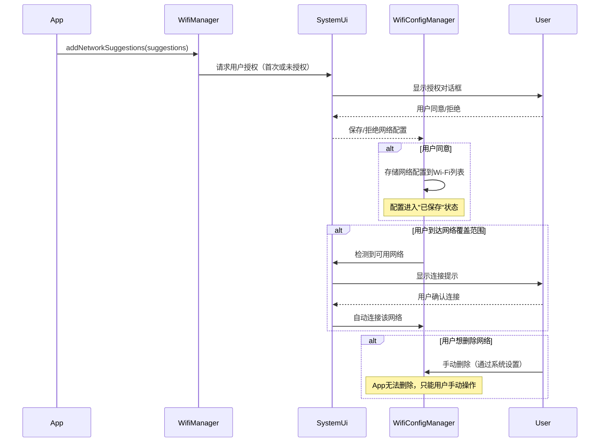
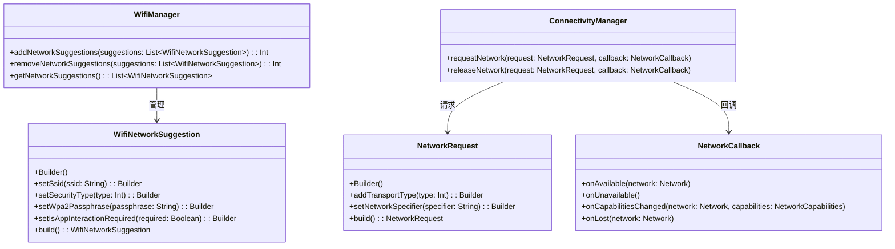

# 13.1.21 About Wi-Fi infrastructure

清晨的营地比昨天安静了许多。

昨晚那场关于P2P连接的讨论一直延续到深夜，洛芙躺在睡袋里翻来覆去，满脑子都是"无密码连接"这件事。她一直觉得连接Wi-Fi输密码是天经地义的事，就像进门要带钥匙一样自然。可希尔昨晚轻描淡写地说出那个叫"Easy Connect"的名字，仿佛在露营地里打开了一扇看不见的门。

薄雾正在散去。

希尔第一个从帐篷里钻出来，揉着眼睛伸了个懒腰，然后蹲到折叠桌旁边摆弄她的手机。黛琳已经在石头上坐了一会儿了，手里捧着一杯热可可，白色的蒸汽在清晨微凉的空气里缓缓升起。伊莎的帐篷里传来窸窸窣窣的声音，显然还在起床的边缘挣扎。

"希尔学姐，"洛芙从帐篷里钻出来，头发乱得像鸟窝，"昨天你说的Easy Connect，是不是跟那个什么……Suggestion API有关系？"

希尔抬起头，眼睛亮了一下。"你想继续聊这个？"

"嗯，"洛芙在她旁边坐下，揉了揉眼睛，"就是觉得好神奇啊。我之前在公司做App，从来没想过能帮用户自动添加Wi-Fi网络——那不是系统设置才干的事吗？"

"那可不一定哦。"

黛琳的声音从旁边传来，温和得像清晨的阳光。她放下手里的可可，从背包里掏出一个小白板——不知道什么时候她的背包里已经塞满了教学工具。

"来，我来给你从头讲讲Wi-Fi基础设施这回事。"

希尔撇撇嘴。"每次都是你先开始。"

"那是因为你每次都直接写代码，不讲故事。"

"好好好，"希尔摆摆手，"你先讲，我来补充。"

伊莎刚好从帐篷里钻出来，头发还是乱糟糟的，但手里已经端着一杯咖啡了。她在黛琳旁边找了个位置盘腿坐下，打了个哈欠。

"又在讲Wi-Fi？"

"嗯，洛芙想了解Suggestion API。"

"哦，那个啊，"伊莎的眼睛亮了起来，"你知道吗，那个API就像……"

"伊莎，"黛琳打断她，"让洛芙先理解技术细节，比喻等会儿再说。"

伊莎吐了吐舌头，做了个"好的好的"的表情。

黛琳把白板架好，拿起笔开始画。

"洛芙，你先想想，之前你用手机连接Wi-Fi的时候，都发生过什么？"

洛芙歪着头想了想。"就是……打开设置，找到Wi-Fi，然后找网络名字，点进去，输入密码？"

"对，"黛琳点点头，在白板上画了一个手机图标，旁边写着"设置App"，"但你有没有想过，为什么有些App连密码都不用输，就能自动连上某个网络？"

"还有这种事？"洛芙瞪大了眼睛。

"有啊，"希尔举起手机晃了晃，"你有没有过这样的经历——走进一家咖啡店，手机自动弹出'是否要连接这里的Wi-Fi？'的提示，然后你一点，就连上了，全程没有输密码？"

"有！"洛芙想起来了，"有一次我去商场就是这样！当时我还以为是商场Wi-Fi有漏洞……"

"不是漏洞，"黛琳在白板上画了一个云形状的图标，写上"App"，"是商场那个App提前把Wi-Fi信息'推送'给了系统。系统收到之后，把它存起来，等你到了地方，就自动提示你连接。"

"这……"洛芙的眼睛越睁越大，"商场还能决定我的手机连什么网？"

"不是'决定'，"希尔插嘴，"是'建议'。系统收到建议之后，还要问你同不同意——你刚才说的那个弹窗，其实就是系统在问'这个App建议你连这个网，你同意吗？'"

"哦——"洛芙慢慢点头，"所以那个弹窗是系统弹的，不是App直接弹的。"

"对，"黛琳在白板上画了一条虚线，从App指向手机图标，旁边标注"Suggestion API"，"这就是今天要讲的Wi-FiSuggestion API。它让App可以向系统提'建议'，说'我这里有一个Wi-Fi网络，用户可能会需要'。系统收到建议之后，会把它存起来，等用户到了信号范围内，再问用户要不要连。"

"原来是这样……"

"但这里有个问题，"伊莎突然开口，表情认真了起来，"如果App随便建议，系统随便存，那岂不是会很乱？万一有个恶意App随便建议一堆网络，用户的Wi-Fi列表岂不是会被塞满？"

黛琳点点头。"问得好。这就是为什么Suggestion API有严格的限制——App不是想建议就能建议，它必须有正当理由，而且用户必须授权。"

"怎么授权？"洛芙问。

"首先，App要在AndroidManifest.xml里声明`android.permission.ACCESS_WIFI_STATE`和一些其他权限——但更重要的是，从Android 10开始，系统对Wi-Fi网络的存储和管理做了很严格的区分。"

希尔掏出她的笔记本，在键盘上噼里啪啦敲了几下，然后把屏幕转过来给众人看。

"我给你们看个代码，"她说，"这是用Suggestion API的基本流程。"

希尔敲的代码：

```kotlin
// 引入必要的类
// 本示例使用 WifiManager 和 WifiNetworkSuggestion
// 注意：WifiNetworkSuggestion API 从 Android 10 (API 29) 开始支持

// 创建一个Wi-Fi配置
val wifiSuggestion = WifiNetworkSuggestion.Builder()
    .setSsid("Campground_Free_WiFi")  // 设置网络名称（SSID）
    .setIsAppInteractionRequired(true)  // 设置是否需要App参与后续连接
    // 设置安全类型：WPA2 或 WPA3 企业版等
    .setSecurityType(WifiNetworkSuggestion.SECURITY_TYPE_WPA2_PSK)
    // 对于需要密码的网络
    .setWpa2Passphrase("camping2024")
    .build()

// 将配置包装成Suggestion
val suggestions = listOf(wifiSuggestion)

// 通过 WifiManager 提交建议
val wifiManager = applicationContext.getSystemService(Context.WIFI_SERVICE) as WifiManager
val status = wifiManager.addNetworkSuggestions(suggestions)

when (status) {
    WifiManager.STATUS_NETWORK_SUGGESTIONS_SUCCESS -> {
        Log.d("WiFiSuggestion", "网络建议添加成功")
    }
    WifiManager.STATUS_NETWORK_SUGGESTIONS_ERROR_ADD_EXISTS -> {
        Log.w("WiFiSuggestion", "该网络已存在")
    }
    WifiManager.STATUS_NETWORK_SUGGESTIONS_ERROR_BLOCKED -> {
        Log.e("WiFiSuggestion", "App被禁止添加网络建议（需要用户授权）")
    }
    else -> {
        Log.e("WiFiSuggestion", "未知错误: $status")
    }
}
```

"这段代码看起来好复杂……"洛芙凑近屏幕看，"但好像能看懂一点？就是……先创建一个网络配置，然后提交给系统？"

"对，"希尔点点头，指着屏幕上的`STATUS_NETWORK_SUGGESTIONS_ERROR_BLOCKED`那一行，"这里要注意——如果App没有获得用户授权，`addNetworkSuggestions`会返回`BLOCKED`状态。"

"那怎么获得授权？"洛芙问。

"第一次调用`addNetworkSuggestions`的时候，如果App还没有授权，系统会弹出一个对话框让用户确认。"

"就像昨天说的那个弹窗？"

"对，就是那个。"

伊莎突然举起手。"我有个问题。"

"说。"

"如果用户点了'同意'，系统把这个网络存下来了——但后来用户又想删掉这个网络怎么办？App能帮用户删吗？"

希尔摇摇头。"App只能添加，不能删除。删除这件事，必须用户自己来。"

"这也是一种保护机制，"黛琳补充道，"系统觉得，既然添加网络需要用户同意，那删除网络也必须用户自己做决定——不能让App替用户做这个决定。"

洛芙若有所思地点点头。"所以Suggestion API其实就是……让App可以告诉系统'这里有个网你可以存着，等用户需要的时候提示他'，但具体连不连、删不删，都是用户自己说了算？"

"完全正确。"

"那……"洛芙又想到一个问题，"如果App建议了一个网络，但后来用户手动把这个网络删掉了，App还能再建议一次吗？"

"可以的，但有频率限制，"希尔说，"系统会防止App频繁地重复建议同一个网络，避免打扰用户。"

"原来如此……"

黛琳看了看天色，薄雾已经完全散开了，阳光从树叶缝隙间洒下来，在地上投下斑驳的光影。她在白板上又画了一个新的图。

"洛芙，我再给你画个完整的流程，帮你理清楚Suggestion API的整个生命周期。"



"这个图……"洛芙盯着看了一会儿，"所以流程就是：App建议，然后系统问用户要不要存，用户说要，系统就存起来。等用户到了有网的地方，系统再问要不要连？"

"对，"黛琳在图上标注了几个关键节点，"而且要注意，用户授权只会请求一次——第一次App尝试添加网络的时候。如果用户同意了，后续App再添加别的网络，就不需要每次都请求授权了。但如果用户拒绝了，App就必须换一种方式。"

"什么方式？"

"Network Request API。"

希尔接过话头，表情变得认真起来。

"Network Request API是另一种连接方式，跟Suggestion API不一样——它不是让App'建议存一个网络'，而是让App'请求连接到一个特定的网络'。"

"区别是什么？"

"区别在于控制权，"希尔在白板旁边画了另一幅图，"Suggestion API是'我帮你存着，你以后自己决定要不要连'。Network Request API是'我现在就要连，你能不能帮我找到并连上？'——后者是即时性的，前者是持久性的。"

"那什么时候用哪个？"

"当你需要连接一个IoT设备的时候，比如搭一个智能露营灯系统，你需要用Network Request API，"希尔说，"因为IoT设备不会广播自己的网络名称，你没办法用Suggestion API去建议一个你根本不知道名字的网络。"

"哦——"洛芙恍然大悟，"所以Network Request API是用来连接那些……没有显示名称的设备的？"

"对，"希尔点点头，"也叫Wi-Fi P2P（Peer-to-Peer）。两个设备直接对话，不需要路由器——就像昨天我们聊的P2P一样。"

伊莎突然拍了拍大腿。"我想起来了！那个Easy Connect，是不是就是Network Request API的一部分？"

"不完全是，"黛琳摇摇头，"Easy Connect是Wi-Fi Alliance推出的一个认证项目，它是一套完整的配网流程——包括怎么发现设备、怎么传输密码、怎么建立连接。Android的Network Request API是实现Easy Connect的一种方式，但它们不是同一个东西。"

"啊……"伊莎有点迷糊，"那Easy Connect到底是什么？"

"Easy Connect是设备配网的'体验标准'，"希尔解释道，"就像你去咖啡店，咖啡店App帮你自动连接Wi-Fi，这个'自动'的体验就是Easy Connect。而Network Request API是Android实现这个体验的技术手段。"

"我懂了，"洛芙点头，"Easy Connect是目标，Network Request API是达成这个目标的工具之一。"

"对，就是这个意思。"

一阵风吹过来，把白板上的纸吹得哗哗响。希尔伸手按住白板免得它被吹跑，然后看了看天。

"太阳升起来了，"她说，"我们吃点东西吧？我带了昨天剩的曲奇。"

"我去泡茶，"伊莎站起来，伸了个懒腰，"洛芙，你要喝什么？"

"热可可，谢谢。"

趁着伊莎去烧水的功夫，希尔又掏出了她的笔记本，在上面敲敲打打。

"我再给你们看个东西，"她说，"Network Request API的代码比Suggestion API复杂一点，因为它涉及到权限和回调。"

```kotlin
// 引入必要的类
// NetworkRequest API 从 Android 10 (API 29) 开始支持

// 创建一个NetworkRequest，指定要连接的网络类型
val networkRequest = NetworkRequest.Builder()
    .addTransportType(NetworkCapabilities.TRANSPORT_WIFI)  // Wi-Fi传输
    .setNetworkSpecifier("my_app_specific_specifier")  // 指定App的连接标识
    .build()

// 创建回调来处理连接结果
val networkCallback = object : ConnectivityManager.NetworkCallback() {
    override fun onAvailable(network: Network) {
        // 连接成功
        Log.d("NetworkRequest", "已连接到网络: ${network.toString()}")
    }

    override fun onUnavailable() {
        // 连接失败
        Log.d("NetworkRequest", "无法连接到指定网络")
    }

    override fun onCapabilitiesChanged(
        network: Network,
        networkCapabilities: NetworkCapabilities
    ) {
        // 网络能力变化
        Log.d("NetworkRequest", "网络能力已更新: ${networkCapabilities.toString()}")
    }

    override fun onLost(network: Network) {
        // 连接断开
        Log.d("NetworkRequest", "网络连接已断开")
    }
}

// 通过 ConnectivityManager 请求网络
val connectivityManager = getSystemService(Context.CONNECTIVITY_SERVICE) as ConnectivityManager
connectivityManager.requestNetwork(networkRequest, networkCallback)
```

"这段代码……"洛芙盯着屏幕看，"`NetworkRequest.Builder()`……`addTransportType(NetworkCapabilities.TRANSPORT_WIFI)`……这个能看懂一点，就是指定要Wi-Fi网络。"

"但`setNetworkSpecifier`是什么？"

"这个是重点，"希尔指着那行代码，"`NetworkSpecifier`是App用来标识自己需要连接哪个网络的字符串。比如你的App想要连接一个智能露营灯设备，你就可以把设备的MAC地址或者UUID编码进这个specifier里，系统会用它来匹配目标网络。"

"所以specifier就是……告诉系统'我要找的是这个设备'的凭证？"

"对。"

"但是，"黛琳突然开口，"这里有个很常见的坑，希尔你应该也遇到过——`requestNetwork`必须在主线程调用吗？"

"不需要，"希尔摇摇头，"`requestNetwork`是异步的，它会立即返回，然后通过回调告诉你结果。真正的问题在于——回调是在后台线程运行的，不是主线程。"

"所以如果你在回调里更新UI，必须用`runOnUiThread`或者`handler.post`？"

"对，或者用协程。"

"协程我知道！"洛芙举手，"公司项目里用过！"

"那就好，"黛琳笑了笑，"这里要注意的是，NetworkRequest API的回调不保证在哪个线程，所以涉及UI操作的时候要小心。"

伊莎端着热可可回来了，一人发了一杯。曲奇也摆在了桌子中央，阳光照在曲奇上，看起来金黄酥脆。

"好了好了，"伊莎拍了拍手，"聊了这么多，我给大家总结一下——我们今天到底学了啥？"

"三个东西，"希尔竖起三根手指，"Wi-Fi Suggestion API、Wi-Fi Network Request API、还有Settings Intent API。"

"Settings Intent API是什么？"洛芙问。

"那个是Android 11开始才有的，"希尔说，"它的作用是——当App想要用户批准添加某个网络配置，但用户没同意的时候，App可以跳转到系统设置，让用户手动去批准。"

"等等，"洛芙眨眨眼，"为什么用户会拒绝？不点同意不就好了吗？"

"因为系统有时候会自作主张，"黛琳说，"比如系统自动把一个Wi-Fi网络保存了——不是App建议的，是系统自己发现的——用户不想要这个网络，就会删除它。但如果App后来又需要这个网络，它就可以用Settings Intent API，把用户带到系统设置里，让用户重新打开那个网络的自动连接开关。"

"哦——"洛芙点头，"所以Settings Intent API是一个……兜底方案？让App在用户拒绝之后，还能把用户带到设置页面？"

"对，但它需要用户主动去系统设置里操作——App不能强制添加或删除网络。"

"这样设计挺合理的，"伊莎说，"至少用户有最终控制权。"

"那如果App就是想要强制添加一个网络呢？"洛芙问，"有没有办法绕过这个限制？"

"没有，"希尔摇头，"Android从设计层面就禁止了这种事。App只能'建议'，不能'强制'。这是权限控制的核心理念——App不能替用户做安全相关的决定。"

"如果App想要偷偷添加一个恶意网络呢？"伊莎问。

"系统有防护机制，"黛琳说，"首先，只有获得了`NETWORK_SETTINGS`权限的App才能使用Suggestion API，而这个权限是系统级别的，普通App根本拿不到。其次，就算App成功添加了网络，用户也可以随时删除它——App没有删除权限。"

"那岂不是超级安全？"

"相对安全，"希尔说，"但也不是绝对。安全是一个持续对抗的过程，总会有新的漏洞被发现。Android能做的就是尽量让攻击成本变高，让普通用户不会被轻易攻击。"

"明白了……"

洛芙低头喝了一口热可可，温热的液体顺着喉咙滑下去，暖暖的。她又看了一眼希尔刚才画的那个Network Request API的代码，若有所思。

"学姐，我还有最后一个问题。"

"说。"

"Network Request API和Network Suggestion API，能不能同时用？"

希尔看了黛琳一眼，黛琳笑着点点头。

"当然可以，"希尔说，"在很多场景下，它们是互补的。比如一个智能家居App——它可能先用Network Suggestion API把家里的Wi-Fi网络存起来，让用户回家的时候自动连上；同时它又用Network Request API来连接家中的智能设备，两者各司其职。"

"哇……"洛芙感叹，"Android的Wi-Fi框架好复杂，但好像每个部分都有它存在的道理。"

"这就是设计的力量，"黛琳说，"一个好的系统，不是把所有功能堆在一起，而是让每个功能各安其位，互相配合。"

"就像我们露营，"伊莎突然说，"有人负责搭帐篷，有人负责生火，有人负责找水源——每个人做自己擅长的事，整个营地才能运转起来。"

"伊莎你这比喻……"希尔无奈地笑了笑。

"很生动不是吗？"

"是挺生动的。"

"不过，"希尔突然收起笑容，表情认真了起来，"洛芙，我要提醒你一件事——Wi-Fi相关API在低版本Android上有很多兼容性问题。"

"兼容性？"

"对，比如Wi-Fi Suggestion API需要Android 10以上，如果你的App要支持更老的系统版本，就得用别的方式。"

"什么方式？"

"老版本的Wi-Fi扫描和连接流程——用`WifiManager`的`startScan()`和`connect()`方法。但那些方法已经 Deprecated 了，Google不推荐继续使用。"

"Deprecated了？那怎么办？"

"用Compatibility库，"希尔说，"Google提供了一些Compatibility库来帮助App在老版本系统上也能使用新API的部分功能——虽然不能完全兼容，但至少能让App不会崩溃。"

"原来如此……"

洛芙低头看着手里的热可可，杯子里的液体在轻轻晃动。她想起在公司做的那些App，有多少次是"能用就行"的敷衍态度——反正用户在最新版本手机上能跑就行，版本兼容性什么的，以后再说。

"我以前做App从来没想过这些……"她轻声说。

"现在想也不晚，"黛琳温和地说，"重要的是意识到问题，然后去解决它。"

"而且，"希尔补充道，"你现在知道了，以后做App的时候就会多考虑一步——这个功能在老版本上能不能用？不能的话怎么降级？这些问题是躲不掉的，越早面对越好。"

"嗯……"

洛芙点点头，把热可可一饮而尽，然后站起来伸了个懒腰。

"那我们现在做什么？"

"你想做什么？"

"嗯……"她歪着头想了想，"能不能让我试试自己写一个Suggestion API的Demo？就……用你们的代码，我自己敲一遍。"

希尔和黛琳对视一眼，都笑了。

"当然可以，"希尔把自己的笔记本推过来，"给你，你来写。我在旁边看着。"

"我也看！"伊莎举手。

"那就来吧，"黛琳也凑过来，"有问题随时问。"

洛芙坐到笔记本前，手指落在键盘上。屏幕上的代码在阳光下反着光，她深吸一口气，开始一个字母一个字母地敲进去。

阳光从树叶缝隙间洒下来，在键盘上投下斑驳的光影。远处传来山雀的叫声，清脆悦耳。营地里重新安静下来，只剩下敲键盘的声音和偶尔的讨论声。

这是属于学习的清晨。

---

## 专业技术总结

> **Wi-Fi基础设施（Wi-Fi Infrastructure）** 是Android系统中管理Wi-Fi连接的核心框架，包含Suggestion API、Network Request API和Settings Intent API三大组件，分别负责网络的"建议存储"、"即时连接请求"和"设置页面跳转"。这套框架从Android 10开始逐步完善，旨在让App在用户授权的前提下参与Wi-Fi网络的管理，同时确保用户对网络配置拥有最终控制权。

#### 结构图



#### 复杂度与影响

| API | 版本要求 | 权限复杂度 | 适用场景 |
|-----|---------|-----------|---------|
| Suggestion API | Android 10+ | 需要用户授权 | App希望持久化保存网络配置，供后续自动连接 |
| Network Request API | Android 10+ | 不需要用户授权（但需要位置权限） | App需要即时连接特定网络或P2P设备 |
| Settings Intent API | Android 11+ | 跳转到系统设置 | App需要用户手动批准或管理网络配置 |

#### 反模式与陷阱

1. **在主线程执行网络请求** → 修复：`requestNetwork`本身是异步的，回调在后台线程执行；涉及UI操作时用`runOnUiThread`或协程切换线程。

2. **不处理`STATUS_NETWORK_SUGGESTIONS_ERROR_BLOCKED`** → 修复：调用`addNetworkSuggestions`后必须检查返回值，如果返回BLOCKED状态，提示用户授权或引导到系统设置。

3. **忘记在`onDestroy`或`onStop`时取消网络请求** → 修复：使用`connectivityManager.releaseNetwork(request, callback)`主动释放回调，防止内存泄漏和无效回调。

4. **混用Suggestion API和Network Request API的权限模型** → 修复：两者权限要求不同——Suggestion需要用户授权对话框，Network Request只需要`ACCESS_WIFI_STATE`和相关权限。

5. **假设所有Android版本都支持新API** → 修复：使用`Build.VERSION.SDK_INT`检查系统版本，或使用Compatibility库降级。

#### 设计哲学

Android的Wi-Fi基础设施框架体现了"用户主权优先"的设计思想——App可以建议，但不能强制；用户可以随时删除或管理网络配置。具体体现在三个层面：

1. **建议权与执行权分离**：Suggestion API只负责"建议存储"，实际连接需要用户确认。
2. **删除权专属于用户**：App无权删除已保存的网络配置，防止恶意App擅自篡改用户网络。
3. **即时请求与持久存储分离**：Network Request API提供即时连接能力，Suggestion API提供持久配置能力，两者互补而非替代。

---

#### 🏕️ 动手练习

**目标**：实现一个支持Wi-Fi网络建议和请求的Demo App，涵盖Suggestion API、Network Request API的基础用法，以及常见的兼容性与权限处理。

**你需要做的事**：

**Task 1 - 基础环境搭建**（★）

1. 创建一个新的Android项目（Empty Activity，Kotlin）。
2. 在`build.gradle`中确认`compileSdk`为34，`minSdk`为26。
3. 添加Wi-Fi相关权限到`AndroidManifest.xml`：

```xml
<uses-permission android:name="android.permission.ACCESS_WIFI_STATE" />
<uses-permission android:name="android.permission.CHANGE_WIFI_STATE" />
<uses-permission android:name="android.permission.ACCESS_FINE_LOCATION" />
<uses-permission android:name="android.permission.ACCESS_COARSE_LOCATION" />
```

4. 在Activity中添加运行时权限申请（针对Android 13+，还需要`NEARBY_WIFI_DEVICES`权限）。
5. 创建一个简单的布局，包含两个Button："添加网络建议"和"请求网络连接"。

**Task 2 - 实现Suggestion API**（★★）

1. 在Activity中添加`WifiManager`实例。
2. 实现`addNetworkSuggestions`方法，使用`WifiNetworkSuggestion.Builder`创建一个网络配置（假设连接到SSID为`"Camp_WiFi"`、密码为`"camp2024"`、安全类型为`SECURITY_TYPE_WPA2_PSK`的网络）。
3. 在Button点击事件中调用该方法，捕获返回值并用Toast显示结果。
4. 处理`STATUS_NETWORK_SUGGESTIONS_ERROR_BLOCKED`情况，提示用户授权。

**Task 3 - 实现Network Request API**（★★★）

1. 创建`NetworkCallback`实例，实现`onAvailable`、`onUnavailable`、`onLost`三个回调方法，每个回调打印Log。
2. 创建`NetworkRequest`，指定`TRANSPORT_WIFI`传输类型，并设置一个简单的`NetworkSpecifier`（可以是App自定义的字符串）。
3. 在Button点击事件中调用`connectivityManager.requestNetwork`。
4. 在`onDestroy`中调用`connectivityManager.releaseNetwork`释放回调。

**Task 4 - 对比两种API的调用流程**（★★★）

1. 将Task 2和Task 3的代码封装成两个独立函数：`submitSuggestion()`和`requestConnection()`。
2. 在布局中添加一个TextView，用来显示调用结果日志。
3. 分别点击两个Button，观察Logcat输出和TextView显示，理解两种API的调用差异。
4. 撰写文档，说明两种API的适用场景对比。

**Task 5 - 实现Settings Intent跳转**（★★★★）

1. 在Activity中实现当`addNetworkSuggestions`返回`STATUS_NETWORK_SUGGESTIONS_ERROR_ADD_NOT_AUTHORIZED`时，引导用户到系统设置页面。
2. 使用`Intent(Settings.ACTION_WIFI_SETTINGS)`或`Settings.ACTION_PROCESS_WIFI_UPDATES`实现跳转。
3. 测试：先拒绝授权，然后点击按钮，观察是否能正确跳转到系统设置。

**Task 6 - 兼容性与版本检查**（★★★★★）

1. 在代码中添加`Build.VERSION.SDK_INT`检查，针对Android 10以下版本实现降级逻辑（提示用户系统版本不支持）。
2. 尝试使用Compatibility库（如`androidx.core.net`）在低版本上实现部分功能。
3. 在Android 10和Android 14设备上分别测试，对比行为差异。

**面试热身**

**Q1**: Wi-Fi Suggestion API和Wi-Fi Network Request API的核心区别是什么？分别适用于什么场景？

**Q2**: 当用户拒绝Suggestion授权后，App可以采取什么补救措施？实现这个流程的关键代码是什么？

**Q3**: 为什么Android设计了一套"建议权与执行权分离"的Wi-Fi框架？这种设计体现了什么安全理念？

**Q4**: 在使用Network Request API时，如果App没有主动释放回调，会有什么问题？如何正确地在生命周期中管理回调？

**Q5**: 如果你的App需要在Android 8.0设备上实现类似Suggestion API的功能，但该API从Android 10才开始支持，你会如何设计降级方案？

---

#### 参考实现要点

1. **Suggestion API的调用必须处理所有错误状态码**：尤其是`STATUS_NETWORK_SUGGESTIONS_ERROR_ADD_EXISTS`和`STATUS_NETWORK_SUGGESTIONS_ERROR_BLOCKED`，前者提示用户网络已存在，后者引导用户授权。

2. **Network Request API的回调必须在合适的生命周期释放**：在`onDestroy`或`onStop`中调用`releaseNetwork`，防止重复回调和内存泄漏。

3. **权限检查先于API调用**：确保`ACCESS_WIFI_STATE`和`ACCESS_FINE_LOCATION`权限已授予，否则API调用会直接失败。

4. **使用`Build.VERSION.SDK_INT`做版本分支**：不同Android版本的Wi-FiAPI行为可能不同，版本检查是兼容性设计的基础。

5. **Settings Intent API是用户授权的兜底方案**：当App无法通过正常流程获得授权时，通过`Intent`引导用户到系统设置页面是一种体面的降级策略。

---

> 学习建议：Wi-Fi基础设施的三大API（Suggestion、Network Request、Settings Intent）构成了Android网络管理的完整闭环——从"建议存储"到"即时连接"再到"设置授权"。学习的关键不是记住每个API的用法，而是理解它们为什么存在、为什么这样设计。每当你遇到一个设计"限制"（比如App不能删除网络配置），试着从用户安全的角度去思考——你会发现，这些限制不是刁难，而是保护。

## 洛芙的小小日记本

今天终于把Wi-Fi的Suggestion API和Network Request API搞清楚了！黛琳说得对——"建议权"和"执行权"分离这个设计，真的不只是技术决策，它背后是对用户控制权的尊重。感觉自己做App的时候，也应该多想一步：用户真的愿意让我做这件事吗？

## 今日关键词

**Wi-Fi Suggestion API**：让App向系统提交Wi-Fi网络建议的API，建议的网络会被系统存储，在用户授权后供后续自动连接。从Android 10开始支持。

**Wi-Fi Network Request API**：让App请求即时连接到特定Wi-Fi网络的API，与Suggestion API不同，它不持久化存储网络配置，而是建立临时连接。从Android 10开始支持。

**Settings Intent API**：Android 11新增的API，允许App通过Intent跳转到系统设置页面，让用户手动管理网络配置。是Suggestion API授权失败后的兜底方案。

**WifiNetworkSuggestion**：Suggestion API中用于构建网络建议的类，包含SSID、安全类型、密码等配置信息。通过`WifiManager.addNetworkSuggestions()`提交给系统。

**NetworkRequest**：Network Request API中用于描述请求目标网络的类，包含传输类型（如`TRANSPORT_WIFI`）和网络标识符（`NetworkSpecifier`）。

**NetworkCallback**：Network Request API的回调接口，用于接收网络连接结果，包含`onAvailable`、`onUnavailable`、`onCapabilitiesChanged`、`onLost`等回调方法。

**TRANSPORT_WIFI**：NetworkCapabilities中定义的网络传输类型常量，表示通过Wi-Fi接口建立的网络连接。

**NetworkSpecifier**：网络标识符字符串，用于在Network Request中标识目标网络或设备。通常包含设备的MAC地址或UUID等信息。

**Easy Connect**：Wi-Fi Alliance推出的设备配网认证项目，定义了一套无需用户手动输入密码即可连接Wi-Fi的标准流程。Android的Network Request API是实现Easy Connect的技术手段之一。

**SECURITY_TYPE_WPA2_PSK**：Wi-Fi网络安全类型常量，表示使用WPA2个人版加密的网络，需要预共享密钥（PSK）认证。

**android.permission.ACCESS_WIFI_STATE**：Android权限，允许App读取当前Wi-Fi状态和网络信息。

**android.permission.CHANGE_WIFI_STATE**：Android权限，允许App修改Wi-Fi连接状态。

**android.permission.ACCESS_FINE_LOCATION**：Android权限，允许App访问精确位置信息。Wi-Fi扫描需要位置权限，因为系统认为位置信息和Wi-Fi热点信息具有相关性。

**Build.VERSION.SDK_INT**：Android系统版本检查常量，用于在代码中判断当前设备运行的Android版本号，以便进行兼容性处理。
