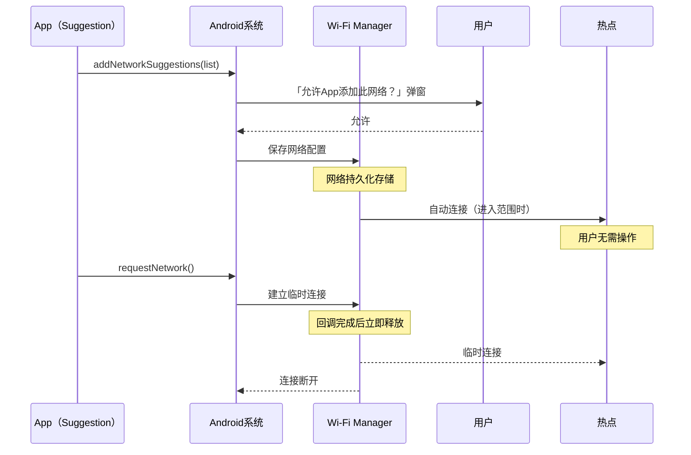
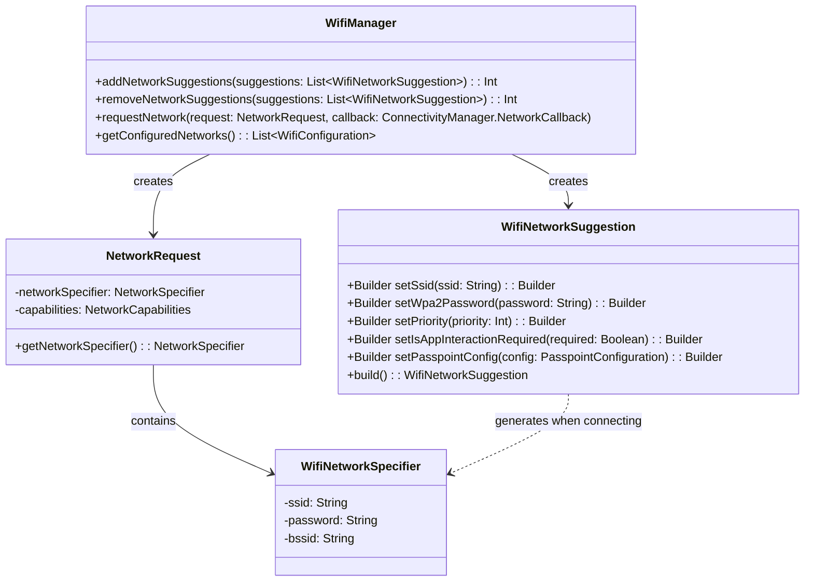

# 13.1.22 Suggest Wi-Fi access points

洛芙把手机从睡袋旁边捡起来，揉了揉眼睛。

屏幕上显示着已经连接的 Wi-Fi 热点名称：「Camp-Life-5G」。这是营地管理处在帐篷区提供的公共网络，洛芙昨天手动输入过一次密码。但现在她注意到一件奇怪的事——

「咦？」她歪着脑袋，「我的平板怎么也连上这个网络了？我没输入过密码啊。」

伊莎从帐篷里探出头来，手里还端着一杯热茶。「因为你昨天连接过一次这个网络，系统记住了呗。」

「可是……」洛芙皱着眉头，「我没告诉平板这个密码啊？它怎么知道的？」

黛琳放下手里的技术文档，朝这边看过来。「这就是我们今天要聊的主题——Wi-Fi Suggestion API。它做的事情，就是让 App 告诉系统：『嘿，我这里有一个网络，值得让用户连接。』」

「系统怎么知道值不值得呢？」洛芙问。

「这就是有趣的地方，」希尔从笔记本后面抬起头来，「系统会弹出通知，问用户要不要连接。用户同意之后，系统会记住这个网络，下次进入范围内就自动连上了——就像你现在遇到的情况。」

希尔把笔记本推到桌子中央，屏幕上是 Android 开发者文档的页面。

「我们先来搞清楚 Suggestion API 到底是什么，」她说，「一句话：**它让 App 可以建议系统添加某个 Wi-Fi 网络配置**。系统会把建议存起来，等用户授权之后，这个网络就成了『已保存的网络』，以后靠近时会自动连接。」

「那它和上一章学的 Network Request API 有什么区别？」洛芙问。

「好问题。」黛琳点点头，「Network Request 是『我要立刻连接到一个网络，用完就释放』。但 Suggestion 是『把这个网络推荐给我，以后我可能会用』。一个是一次性的，一个是持久化的。」

「就像……」伊莎端着茶杯想了想，「Network Request 像是你在露营地里临时跟人借个火，用完就还；Suggestion 呢，更像是你把一个好地方的坐标记下来，以后路过时可以再来。」

希尔调出一张图，简洁地表达了两种 API 的区别：



「图1 展示的是 Suggestion 和 Network Request 的流程差异，」希尔解释道，「左边是 Suggestion——App 建议 → 用户同意 → 系统保存 → 以后自动连。右边是 Network Request——App 请求 → 系统建立临时连接 → 用完释放。」

洛芙盯着图看了一会儿。「那 Suggestion 具体是怎么用的呢？代码怎么写？」

「来，我给你写一个完整的例子。」希尔在平板上打开 Android Studio，开始敲代码。

「第一步，你要有 `WifiNetworkSuggestion` 对象。它描述了你推荐的这个网络——名字、密码、Security Type 什么的。」

```kotlin
// 构建一个 Wi-Fi 网络建议
val suggestion = WifiNetworkSuggestion.Builder()
    .setSsid("Camp-Life-5G")                    // Wi-Fi 名称（SSID）
    .setWpa2Password("camp2024secure")          // 密码
    .setPriority(10)                             // 优先级（数值越大越优先）
    .setIsAppInteractionRequired(false)          // 是否需要App参与才能连接
    .build()
```

「这里有个注意点，」希尔停下来，「`setIsAppInteractionRequired` 默认是 `false`，意思是系统可以在不需要你的 App 参与的情况下自动连接。但如果设为 `true`，每次连接时系统都会回调你的 App，由你决定要不要放行。」

「为什么要这样？」洛芙问。

「你想啊，」黛琳接过话，「如果是一个企业内部网络，可能需要 App 做额外的身份验证——比如检查用户是不是公司员工。这种情况下就设为 `true`，让系统在每次连接时都问问你。」

「第二步，把这个 suggestion 提交给系统。」希尔继续写。

```kotlin
val suggestions = listOf(suggestion)

// 获取 WifiManager
val wifiManager = applicationContext.getSystemService(Context.WIFI_SERVICE) as WifiManager

// 提交建议
val status = wifiManager.addNetworkSuggestions(suggestions)

when (status) {
    WifiManager.STATUS_NETWORK_SUGGESTIONS_SUCCESS -> {
        Log.d("WiFi", "网络建议提交成功！")
    }
    WifiManager.STATUS_NETWORK_SUGGESTIONS_ERROR_ADD_EXISTS -> {
        Log.w("WiFi", "这个网络已经存在了")
        // 提示用户或引导到设置页面删除旧配置
    }
    WifiManager.STATUS_NETWORK_SUGGESTIONS_ERROR_BLOCKED -> {
        Log.e("WiFi", "没有权限，请到设置中授权")
        // 引导用户跳转到系统设置页面
    }
}
```

「你看这里有三种主要的状态，」希尔指着代码解释，「`SUCCESS` 是成功了；`ADD_EXISTS` 是这个网络已经被别的 App 或用户手动添加过了；`BLOCKED` 是你的 App 还没有被授权提交建议——这时你需要引导用户去授权。」

「授权是怎么做的？」洛芙问。

「Android 10 以后，系统会弹出一个通知，让用户点击『允许』。但如果你想主动引导用户，可以用 Settings Intent API。」

```kotlin
val intent = Intent(Settings.ACTION_WIFI_ADD_NETWORKS)
startActivityForResult(intent, REQUEST_CODE_ADD_NETWORKS)
```

「这段代码会打开系统的『添加 Wi-Fi 网络』页面，用户可以在那里批准你的 App 有权限提交建议。」

「不过，」伊莎放下茶杯，「这里有一个很重要的安全设计——**App 不能删除网络配置**。」

「什么？」洛芙有些惊讶，「为什么？」

「你想啊，」黛琳认真地说，「如果一个恶意 App 可以随意添加和删除 Wi-Fi 配置，那它就可以把用户的网络搞得一塌糊涂——删掉家里网络的配置，加上一个假冒的网络。所以 Google 的设计是：**App 只能添加，不能删除**。删除的权限只属于用户。」

「那我想撤回我的建议怎么办？」洛芙问。

「好问题。`removeNetworkSuggestions()` 方法可以删除你自己提交的建议，但只能删你提交的，用户手动添加的或者别的 App 添加的，你删不了。」

```kotlin
// 删除之前提交的建议
val removeStatus = wifiManager.removeNetworkSuggestions(suggestions)
Log.d("WiFi", "删除建议: $removeStatus")
```

「现在我们来说说网络匹配和优先级的问题。」希尔切换到另一个页面。

「当一个位置有多个网络都符合连接条件时，系统会根据优先级来决定连哪个。`setPriority()` 的值越大，优先级越高。但是——」

「但是？」

「但是，如果用户手动连接过某个网络，那个网络的优先级会被提升到最高。所以你不能完全依赖优先级来决定网络选择——用户的历史行为也是影响因素。」

「那我作为 App，能不能控制连接后的行为？」洛芙问。

「这要分情况说。如果你设置了 `isAppInteractionRequired = true`，那么每次连接时系统都会回调你——」

```kotlin
val callbackIntent = Intent(this, MySuggestionCallbackService::class.java)
val pendingIntent = PendingIntent.getService(
    this, 0, callbackIntent,
    PendingIntent.FLAG_UPDATE_CURRENT or PendingIntent.FLAG_MUTABLE
)

val suggestion = WifiNetworkSuggestion.Builder()
    .setSsid("Camp-Life-5G")
    .setWpa2Password("camp2024secure")
    .setPriority(10)
    .setIsAppInteractionRequired(true)           // 每次连接都要回调App
    .setCallbackIntent(pendingIntent)           // 系统回调用的Intent
    .build()
```

「在 Service 的 onResume() 里，你可以做身份验证什么的，然后决定是继续连接还是拒绝。」

「我们再来说说 Passpoint 网络。」黛琳拿出一张新的图。

「普通 Wi-Fi 用 SSID 和密码就够了，但企业网络和热点运营商（比如咖啡厅的收费 Wi-Fi）会用一种叫 Passpoint 的技术。它不需要输入密码，但需要证书和身份验证。」

「那在 Suggestion API 里怎么支持 Passpoint？」洛芙问。

「用 `WifiNetworkSuggestion.Builder()` 的另一个方法——」

```kotlin
// Passpoint 网络的建议
val passpointSuggestion = WifiNetworkSuggestion.Builder()
    .setPasspointConfig(passpointConfig)        // 传入 PasspointConfiguration
    .setPriority(5)
    .build()
```

「`PasspointConfiguration` 里包含证书、域名、身份信息等。」

「但这里有个坑，」希尔补充道，「如果你的 App 要建议一个需要签署条款（Terms and Conditions）的 Passpoint 网络，你必须在 App 里提供相应的条款内容给用户看。这个条款内容会显示在系统的连接确认弹窗里。」

「好了，核心 API 讲完了，我们来整理一下注意事项。」黛琳合上笔记本。

「第一，**Suggestion 和 Network Request 不要混用**。你想做持久化配置就用 Suggestion，想做临时连接就用 Network Request。它们是两条不同的路。」

「第二，**权限要申请对**。`ACCESS_WIFI_STATE` 和 `CHANGE_WIFI_STATE` 是必须的，但如果你的 App 运行的 Android 版本低于 10，你还需要 `ACCESS_FINE_LOCATION`。」

「第三，**错误处理要做全**。三种错误状态（`ADD_EXISTS`、`BLOCKED`、以及其他）都要处理，不能只处理成功的情况。」

「第四，**不要试图删除用户的网络配置**。如果你需要让某个网络消失，引导用户去系统设置里手动删除——这是设计原则，不是限制。」

「第五，」希尔最后补充，「如果你在 Android 10 以下的设备上想做类似 Suggestion 的功能，没有官方 API 可以用，只能靠自己实现网络扫描和配置添加的逻辑——但这不符合官方建议，所以尽量别这样做。」

午后的阳光把帐篷区域照得明亮而温暖。远处的山峦在蓝天下显得格外清晰，草地上有几只蝴蝶在飞舞。

「我懂了，」洛芙点点头，「Suggestion API 就是让 App 可以告诉系统『我推荐这个网络』。用户同意之后，系统会记住它，以后进到范围内就自动连上了。不需要每次都输密码。」

「对，」伊莎说，「而且这个推荐是持久化的——你下次来还会自动连，不像 Network Request 那样用完就释放。」

「而且，」黛琳强调，「App 只能添加，不能删除。用户才是网络配置真正的主人。」

希尔拿起平板，在上面画了一个小图。「我来总结一下 Wi-Fi 基础设施的整体架构——」



「图2 展示的是 Wi-Fi 基础设施 API 的结构关系，」希尔指着图说，「`WifiManager` 是统一的入口，`WifiNetworkSuggestion` 用于持久化推荐，`NetworkRequest` 用于临时请求，两者最后都会生成 `NetworkSpecifier` 来实际建立连接。」

晚风吹过营地，带来一阵青草的香气。帐篷的影子被夕阳拉得长长的。

「好了，今天的内容差不多了。」黛琳合上笔记本，「最后提醒一句——如果你要在 App 里使用 Suggestion API，一定要在清单文件里声明需要的权限，并且在代码里做好运行时权限的检查。」

「而且，」伊莎补充，「如果用户拒绝了你的建议，不要一遍一遍地弹窗请求——这对用户来说是一种骚扰。你可以选择引导用户去系统设置页面，给用户一个清晰的选择。」

洛芙看了看手机上的网络列表。「我终于明白了，为什么每次去咖啡厅，手机会自动连上那个 Wi-Fi——原来是有 App 在默默地提交建议啊。」

「没错，」希尔笑着说，「Android 的 Wi-Fi 生态，就是由这些不同的 API 共同支撑起来的——Suggestion 管推荐，Network Request 管临时连接，Settings Intent 管用户授权。它们各司其职，构成了完整的 Wi-Fi 管理体系。」

---

## 专业技术总结

**Wi-Fi Suggestion API** —— Android 10 (API 29) 引入的 API，允许 App 向系统提交 Wi-Fi 网络建议（`WifiNetworkSuggestion`），供用户在系统弹窗中授权后，将该网络保存为持久化的已连接网络。相比 `Network Request API` 的临时连接，Suggestion API 适用于「推荐用户以后常用的网络」的长期场景。

#### 结构图

见上方图2。

#### 反模式与陷阱

1. **Suggestion 和 Network Request 混用** —— 两者设计目标不同：Suggestion 用于持久化推荐，Network Request 用于临时连接。混用会导致生命周期管理混乱。明确场景后再选 API。
2. **不处理 `ADD_EXISTS` 错误** —— 如果网络已被添加，继续调用 `addNetworkSuggestions` 会返回此错误。必须处理并引导用户确认是否要覆盖。
3. **不处理 `BLOCKED` 错误** —— App 未被授权时直接失败。必须捕获此错误并引导用户跳转到系统授权页面。
4. **对 Android 10 以下设备使用 Suggestion API** —— 该 API 从 Android 10 开始支持。在更低版本上无法使用，需要做版本检查或功能降级。
5. **试图删除用户的网络配置** —— Android 设计上不允许 App 删除任何已保存的网络配置（包括自己添加的）。如需移除，只能引导用户手动删除或通过 `removeNetworkSuggestions()` 删除自己提交的那部分。

#### 设计哲学

**建议权与执行权分离**：Android 将「建议存储」（Suggestion API）和「执行连接」（由系统根据用户偏好和网络条件综合决定）严格分离。App 只有建议权，实际连不连由系统和用户共同决定。这体现了对用户控制权的尊重——用户永远有权拒绝 App 的建议。

**平台安全边界**：禁止 App 删除网络配置是平台级别的安全约束。即便 App 是该网络的提交者，也只能撤销（remove）而不能强制删除（delete），防止恶意 App 篡改用户网络环境。

**身份与条款绑定**：对于需要签署条款的 Passpoint 网络，App 需要在提交建议时一并提供条款内容。连接时系统会显示 App 提供的条款，确保用户知情同意。

#### 🏕️ 动手练习

**项目目标**：实现一个「露营 Wi-Fi 推荐」App，支持提交 Wi-Fi 建议、处理授权回调、处理各类错误状态。

**Task 1 - 基础环境搭建（★）**
目标：创建支持 Wi-Fi Suggestion API 的工程骨架，确认权限和 minSdk 配置正确。
你需要做的事：
1. 创建 Empty Activity 项目（Kotlin，minSdk 29）。
2. 在 `AndroidManifest.xml` 中添加权限：`ACCESS_WIFI_STATE`、`CHANGE_WIFI_STATE`、`ACCESS_FINE_LOCATION`（Android 10 以下需此权限）。
3. 在 `MainActivity` 中获取 `WifiManager` 实例。
4. 验收标准：项目可编译运行，`WifiManager` 实例可正常获取。

**Task 2 - 实现基础 Suggestion 提交流程（★★）**
目标：提交一个 WPA2 加密的 Wi-Fi 网络建议，处理成功和错误状态。
你需要做的事：
1. 使用 `WifiNetworkSuggestion.Builder` 构建一个 SSID 为「Camp-WiFi」、密码为「camp12345」的 WPA2 网络建议。
2. 调用 `wifiManager.addNetworkSuggestions(listOf(suggestion))`。
3. 捕获并处理三种返回状态：`STATUS_NETWORK_SUGGESTIONS_SUCCESS`、`STATUS_NETWORK_SUGGESTIONS_ERROR_ADD_EXISTS`、`STATUS_NETWORK_SUGGESTIONS_ERROR_BLOCKED`。
4. 验收标准：Logcat 中能看到成功或错误状态的明确日志；运行在 Android 10+ 设备上时，系统通知栏出现授权弹窗。

**Task 3 - 实现 App Interaction Required 回调（★★★）**
目标：设置 `isAppInteractionRequired = true`，让每次连接时系统都回调 App，由 App 决定是否放行。
你需要做的事：
1. 创建一个 `Service`（如 `SuggestionCallbackService`），在其中处理 `onResume` 和 `onPause` 回调。
2. 构建 `PendingIntent` 传给 `WifiNetworkSuggestion.Builder().setCallbackIntent(pendingIntent)`。
3. 在 Service 的 `onResume()` 中模拟身份验证（如检查 SharedPreferences 中是否有用户授权标记），如果通过则调用 `notifyBroadcastConnectivitySuccess()`。
4. 验收标准：每次设备尝试连接该网络时，Service 都能收到回调；拒绝授权时连接不会建立。

**Task 4 - 实现网络移除功能（★★★）**
目标：允许用户主动撤回之前提交的建议。
你需要做的事：
1. 在界面上添加「删除建议」按钮。
2. 调用 `wifiManager.removeNetworkSuggestions(listOf(suggestion))`。
3. 验证删除后，重新靠近该网络时系统不会自动连接。
4. 验收标准：删除成功后，原有网络不再出现在自动连接列表中。

**Task 5 - 实现 Passpoint 网络建议（★★★★）**
目标：为一个假设的咖啡厅热点提交 Passpoint 网络建议（使用模拟的 PasspointConfiguration）。
你需要做的事：
1. 创建一个 `PasspointConfiguration` 对象，设置域名（如 `camp-cafe.wifi`）和假的 RADIUS 服务器信息（实际使用时需要真实证书）。
2. 使用 `WifiNetworkSuggestion.Builder().setPasspointConfig(passpointConfig)` 构建建议。
3. 提交并观察系统弹窗是否正确显示「需要签署条款」提示。
4. 验收标准：Passpoint 建议被正确提交，系统显示对应的条款弹窗。

**Task 6 - 实现版本兼容性与权限降级（★★★★★）**
目标：在低于 Android 10 的设备上实现功能降级，并正确处理运行时权限。
你需要做的事：
1. 在 `MainActivity.onCreate()` 中检查 `Build.VERSION.SDK_INT >= Build.VERSION_CODES.Q`。
2. 如果低于 Android 10，显示 Toast 提示「此功能需要 Android 10 及以上版本」，并禁用相关 UI。
3. 如果是 Android 10+，使用 `ActivityCompat.requestPermissions()` 动态请求 `ACCESS_FINE_LOCATION` 权限。
4. 验收标准：在 Android 9 设备上运行时显示版本不兼容提示；在 Android 10+ 设备上首次运行时会弹出权限请求。

---

**面试热身**

**Q1**：Wi-Fi Suggestion API 和 Wi-Fi Network Request API 的核心区别是什么？分别适用于什么场景？

**A1**：`WifiNetworkSuggestion` 用于持久化推荐——App 建议系统添加某个网络，用户同意后系统会长期保存配置，进入范围时自动连接。适用于「推荐用户以后常用的网络」（如企业网络、咖啡厅热点）。`NetworkRequest` 用于临时请求——App 请求系统连接到某个指定网络，连接结束后立即释放资源。适用于「一次性数据传输任务」（如下载大文件）。前者持久化，后者临时性；前者需要用户授权，后者系统直接处理。

**Q2**：如果 App 提交的网络建议与用户手动保存的网络冲突，系统会如何处理？App 应该怎么处理这种情况？

**A2**：当 App 提交的网络已经由用户手动添加过时，`addNetworkSuggestions()` 会返回 `STATUS_NETWORK_SUGGESTIONS_ERROR_ADD_EXISTS`。此时 App 应该提示用户「此网络已存在」，并引导用户前往系统设置页面决定是保留用户手动版本还是让 App 的建议版本生效。注意：App 无法删除用户手动添加的网络，只能建议或引导用户手动删除。

**Q3**：为什么 Android 设计上不允许 App 删除已保存的 Wi-Fi 网络配置？这种设计体现了什么安全理念？

**A3**：这是平台级别的安全约束。如果任意 App 可以删除 Wi-Fi 配置，恶意 App 可以通过「先删后加」的方式劫持用户网络——删除真实的网络配置，替换成假冒的 AP。这种设计体现了「最小权限原则」和「用户控制权优先」的安全理念：App 只能「建议」和「撤销」，真正的删除权限只属于用户。

**Q4**：在实现 `isAppInteractionRequired = true` 的回调机制时，App 需要注意哪些生命周期管理的要点？

**A4**：`PendingIntent` 必须使用 `FLAG_UPDATE_CURRENT` 确保每次回调都指向最新的 Service 实例；Service 的 `onResume()` 中做身份验证，`onPause()` 中做清理（如果超时应释放资源）；Service 需要在清单中注册并声明 `android:exported="false"`；App 必须处理好 Service 的启动优先级（建议使用 `FOREGROUND_SERVICE`）。

**Q5**：如果你的 App 需要在 Android 8.0 设备上实现类似 Suggestion API 的功能，你会如何设计降级方案？

**A5**：Android 8.0 没有官方的 Suggestion API，可以做以下降级：① 在 `WifiManager.getScanResults()` 的基础上，自行维护一个「推荐网络列表」；② 当检测到推荐网络进入范围时，弹出自定义的 Dialog 引导用户点击「连接」；③ 点击后调用 `WifiManager.saveConfiguration()` 或直接用 `connect()` 方法连接。注意：这种实现不符合官方规范，不适用于需要安全认证的企业网络场景，仅适用于自家可控的私人热点场景。

---

#### 参考实现要点

1. **建议提交后必须处理所有错误状态码**：`ADD_EXISTS` → 提示用户已存在；`BLOCKED` → 跳转到 Settings 授权页面；其他错误 → 记录日志并显示用户友好的提示。
2. **`PendingIntent` 的 callback 需要处理 App 被杀的情况**：使用 `FLAG_UPDATE_CURRENT` 确保每次回调都使用最新的 Intent 配置；Service 销毁后系统会缓存 `PendingIntent`，重新启动时会收到回调。
3. **`removeNetworkSuggestions()` 只能删除自己提交的建议**：如果 App 被卸载后重新安装，之前提交的建议仍可能保留在系统中（取决于 OEM 实现），重新安装后可以再次调用删除。
4. **优先级（Priority）不是唯一决定因素**：用户手动连接过的网络优先级会提升；如果多个建议网络同时在范围内，系统会综合考虑信号强度、历史连接记录和优先级来决定连接哪个。
5. **Android 10 以下没有官方 Suggestion API**：如果需要支持更低版本，需要使用不公开的 API（`WifiManager.addNetwork()` + `WifiManager.enableNetwork()`），但这不符合官方建议，且行为因 OEM 而异。

> 学习建议

Wi-Fi Suggestion API 的核心设计思想是「建议权与执行权分离」—— App 负责推荐，网络连不连由系统和用户共同决定。学习这个 API 时，不要只背 API 用法，更要去理解它为什么这样设计：为什么 App 不能删除配置？为什么需要用户授权？为什么有 `ADD_EXISTS` 和 `BLOCKED` 两种错误？理解这些设计决策背后的安全考量，才能真正掌握 Android 的 Wi-Fi 生态。

---

## 洛芙的小小日记本

今天终于搞清楚了为什么每次去咖啡厅手机会自动连上 Wi-Fi——原来是那些 App 在默默地帮我做 Suggestion！黛琳说得对，Android 的设计就是把「建议权」和「执行权」分开——App 可以推荐，但真正的决定权在用户手里。这种设计让我觉得很安心，不会被 App 偷偷改掉我的网络配置。以后我写 App 的时候也要这样想：用户才是真正的主人，我只是提供建议的「小秘书」。

## 今日关键词

**Wi-Fi Suggestion API** —— 让 App 向系统提交 Wi-Fi 网络建议的 API，建议被用户授权后会持久化存储，供后续自动连接。从 Android 10 开始支持。

**WifiNetworkSuggestion** —— 构建 Wi-Fi 网络建议的对象，包含 SSID、密码、Security Type、优先级、是否需要 App 参与等属性。

**addNetworkSuggestions()** —— 将 `WifiNetworkSuggestion` 列表提交给系统的方法，返回状态码表示成功或失败。

**removeNetworkSuggestions()** —— 删除之前提交的网络建议的方法，只能删除自己提交的部分，无法删除用户手动添加的配置。

**STATUS_NETWORK_SUGGESTIONS_SUCCESS** —— `addNetworkSuggestions()` 的成功返回状态码。

**STATUS_NETWORK_SUGGESTIONS_ERROR_ADD_EXISTS** —— 网络已被添加时返回的错误状态码，提示 App 该网络已存在。

**STATUS_NETWORK_SUGGESTIONS_ERROR_BLOCKED** —— App 未被授权时返回的错误状态码，需要引导用户跳转系统授权页面。

**isAppInteractionRequired** —— `WifiNetworkSuggestion.Builder` 的配置项，设为 `true` 时每次连接都会回调 App，由 App 决定是否放行。

**PasspointConfiguration** —— 用于配置企业级或热点运营商 Passpoint 网络的对象，包含域名、证书、RADIUS 服务器信息等。

**Settings.ACTION_WIFI_ADD_NETWORKS** —— 系统提供的 Intent Action，用于跳转到系统「添加 Wi-Fi 网络」授权页面。

**建议权与执行权分离** —— Android Wi-Fi 基础设施的核心设计哲学：App 只负责提交建议（Suggestion）或请求临时连接（Network Request），实际连不连由系统和用户共同决定，体现对用户控制权的尊重。

**平台安全边界** —— Android 对 App 操作 Wi-Fi 配置的权限约束：App 可以添加和撤销建议，但不能删除任何已保存的网络配置（无论是用户手动添加还是其他 App 提交），防止恶意 App 篡改用户网络环境。