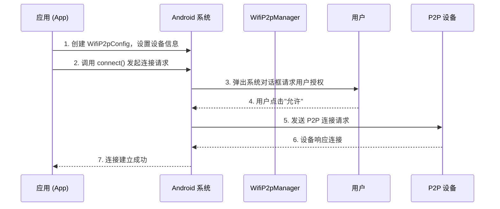
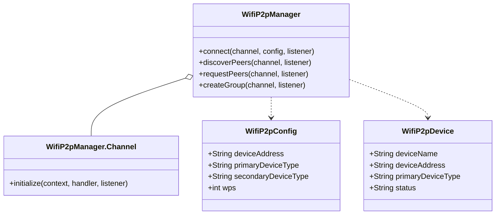
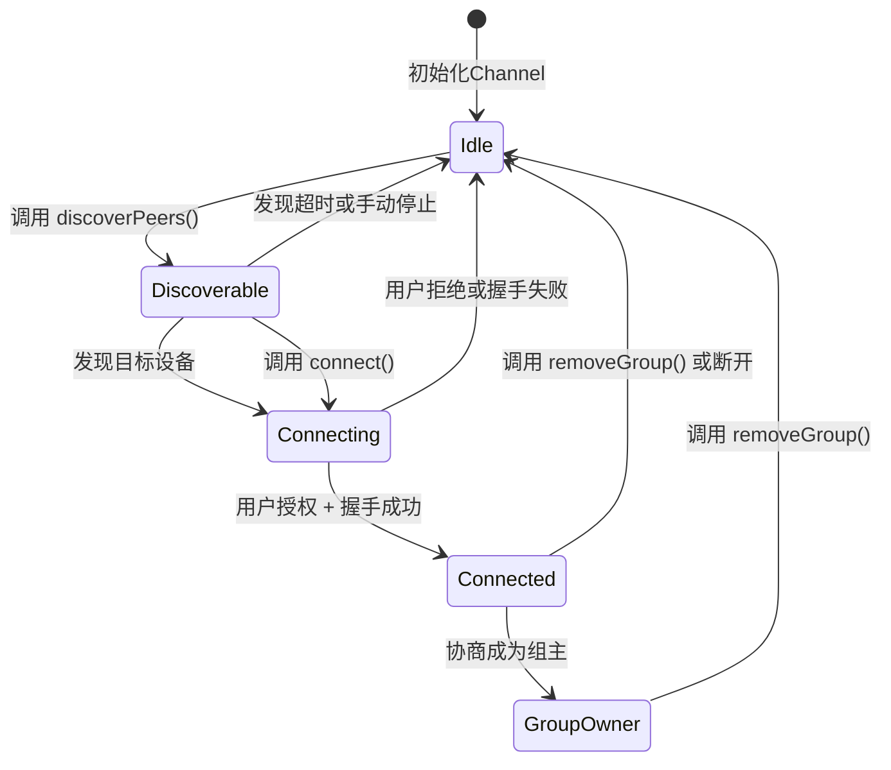
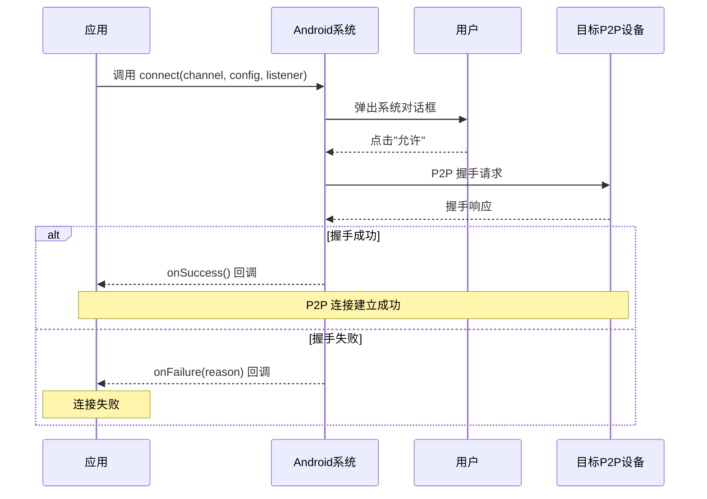
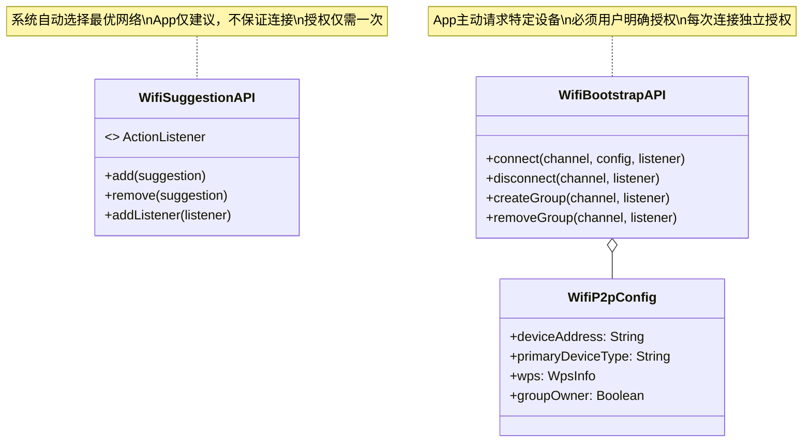

# 13.1.23 Prompt for changing to a Wi-Fi P2P access point

清晨的薄雾已经散尽，空气里是晚春特有的温暖青草气息。

洛芙把最后一口温热的奶茶吞下去，整个人往椅背上靠了靠。帐篷的影子正好落在折叠桌上，把桌面切成明暗两块。希尔坐在她对面，手指在笔记本电脑的触控板上飞快地滑动，屏幕上的代码在晨光中泛着淡淡的蓝光。

"所以，"洛芙盯着希尔的屏幕看了一会儿，终于忍不住开口，"昨天你说的那个Wi-Fi Suggestion……就是App可以建议系统连接某个网络对吧？"

"对。"希尔头也不抬。

"那今天呢？"洛芙眨了眨眼睛，"我看到手机又弹出对话框了，这次好像不太一样……"

她的手机屏幕正好亮了起来。

屏幕上弹出一个对话框，标题写着"附近的设备想加入你的网络"，下方是一行小字："Wi-Fi P2P连接请求来自：Camera-Device-001"。洛芙下意识地点了一下"允许"，然后才想起来要问："这个和昨天的那个……有什么不同？"

希尔终于抬起头，顺着洛芙的视线看向她的手机屏幕。"哦，"她眨了眨眼，嘴角微微翘起，"你问到了一个很好的问题。"

"这个问题问得好。"黛琳不知什么时候已经从帐篷里钻了出来，手里捧着一杯冒着热气的咖啡。她的头发还有些乱蓬蓬的，显然是刚起床没多久。"昨天的Suggestion是App建议系统去连接一个已经存在的Wi-Fi网络，今天的这个——"

"是App请求系统去建立一个P2P的对等连接？"洛芙歪着头。

"差不多是这个意思，"黛琳点点头，走到折叠桌旁边坐下，"不过让我先把咖啡放一下……希尔，把你的设备准备好了吗？"

希尔已经站起身，从背包里掏出一个小型摄像头设备。"准备好了，"她拍了拍那个摄像头，"这就是今天的魔法道具——一台支持Wi-Fi P2P的相机。它可以自己创建一个小型网络，让我们的手机直接连上去，而不需要通过路由器。"

伊莎也从帐篷里探出头来，手里拿着一本翻开的笔记本。"Wi-Fi P2P，"她轻声念叨着这个词，"就像是森林里的两只小鹿，它们不需要中间的大树来传递消息，而是直接面对面地交谈。"

"伊莎你这个比喻不错，"黛琳把咖啡放在桌上，"但让我先来把技术细节说清楚。"

她从包里拿出一支白板笔，在帐篷旁边的一块平坦的石头上开始画图。

"首先，我们需要理解一件事，"她的声音不紧不慢，"Wi-Fi有两种完全不同的连接模式。一种是基础设施模式——就是我们家里路由器那种，所有设备都通过路由器来通信。另一种是P2P模式，设备之间直接对话，不需要中间人。"

"就像是电话和无线电的区别？"洛芙问道。

"有点类似，"黛琳点点头，"电话需要交换台或者基站，但无线电对讲机可以直接通话。Wi-Fi P2P就像是对讲机模式。"

希尔把那个相机放在桌上，按下了电源键。相机的指示灯开始闪烁，发出微弱的蓝光。

"现在这台相机已经进入了P2P模式，"希尔解释道，"它正在等待被设备发现。"

"所以我们的手机要怎么找到它？"洛芙盯着那个闪烁的相机。

"这就是Wi-Fi Bootstrap API要解决的问题，"黛琳在石头上画出了第一个图示，"当一个App想要连接到P2P设备时，它需要向系统发出请求。这个请求包含了它想连接设备的信息——比如SSID，或者设备的MAC地址。"

她的白板笔在石头上勾勒出一个简洁的流程图：



"你看，"黛琳指着图上的步骤，"当App调用connect()方法时，系统会先弹出对话框让用户确认。用户同意之后，系统才会真正去和目标设备建立P2P连接。"

"那如果用户拒绝了呢？"洛芙问道。

"如果用户拒绝，"黛琳放下白板笔，"这次连接就不会建立。下次App再尝试连接时，系统会再次弹出对话框——每次都需要用户授权，除非用户选择了'记住此操作'并批准。"

"这个和昨天学的Suggestion不一样吗？"洛芙皱了皱眉。

"不一样，"希尔插嘴道，"Suggestion是App建议系统去连一个已有的网络，连接动作是系统自动完成的，用户只需要在第一次批准就行。但Bootstrap不一样——它是App主动请求去连接一个P2P设备，必须有用户的明确授权才能开始。"

"而且，"黛琳补充道，"Bootstrap的连接目标是P2P设备，不是传统的AP热点。P2P设备之间是对等关系，没有主从之分。"

"那这个相机……"洛芙看向桌上那个闪烁着蓝光的设备。

"这台相机就是一个P2P设备，"希尔解释道，"它可以创建一个小型网络，让手机直接连接上来传输照片。不需要Wi-Fi路由器，也不需要互联网——纯粹是设备之间的直接通信。"

"就像两个人在同一个房间里说话，不需要通过广播台？"洛芙试着理解。

"对，就是这个意思，"伊莎笑着点头，"而且P2P连接的一个重要特点是——一旦用户批准了连接，之后的连接就会自动进行，不需要每次都弹对话框。"

"等等，"洛芙突然想到了什么，"我刚才点的那个'允许'，是不是就是这个意思？"

"对，"希尔点点头，"系统会记住你的授权。只要你不主动取消连接，下次这台相机开机并处于P2P模式时，你的手机会自动连上去。"

洛芙低头看了看手机屏幕，屏幕上显示已经连接到了"DIRECT-CAMERA-001"这个网络。她点开设置，发现Wi-Fi设置页面里确实有一个新的选项卡，显示"P2P设备"。

"好神奇，"她感叹道，"手机是怎么知道这个网络值得连接的？"

"这就是Bootstrap API的精髓，"黛琳重新拿起白板笔，"当App调用connect()方法时，它实际上是在告诉系统两件事：第一，我想连接到一个特定的P2P设备；第二，这个设备的标识是什么。"

她重新在石头上画出一个新的图示，这次是一个类图结构：



"WifiP2pConfig包含了连接所需的所有信息，"黛琳指着第一个类说，"deviceAddress是目标设备的MAC地址——就像每台设备独一无二的身份证号。primaryDeviceType描述了设备类型，比如是相机、打印机还是其他设备。"

"wps呢？"洛芙问道。

"WPS是Wi-Fi Protected Setup的缩写，"黛琳解释道，"它是一种简化连接流程的安全机制。通过WPS，设备之间可以更快速地建立安全连接，而不需要输入复杂的密码。"

"现在让我们来看代码，"希尔已经把笔记本电脑转过来，让大家都能看到屏幕，"这是Bootstrap API的基本用法。"

她的屏幕上显示着一段Kotlin代码：

```kotlin
// 导入必要的包
import android.net.wifi.p2p.WifiP2pConfig
import android.net.wifi.p2p.WifiP2pManager
import android.os.Bundle
import android.widget.Toast

class MainActivity : AppCompatActivity() {

    // 获取 WifiP2pManager 实例
    private lateinit var manager: WifiP2pManager
    
    // 创建 Channel（用于与系统服务通信）
    private lateinit var channel: WifiP2pManager.Channel

    override fun onCreate(savedInstanceState: Bundle?) {
        super.onCreate(savedInstanceState)
        setContentView(R.layout.activity_main)

        // 初始化 WifiP2pManager
        manager = getSystemService(Context.WIFI_P2P_SERVICE) as WifiP2pManager
        
        // 初始化 Channel
        // 参数1: Context
        // 参数2: Handler（用于接收回调消息，为null则使用主线程的Looper）
        // 参数3: 初始化完成后的回调
        channel = manager.initialize(this, mainLooper) { isSuccess ->
            if (isSuccess) {
                Toast.makeText(this, "P2P通道初始化成功", Toast.LENGTH_SHORT).show()
            } else {
                Toast.makeText(this, "P2P通道初始化失败", Toast.LENGTH_SHORT).show()
            }
        }
    }

    // 开始发现并连接P2P设备
    private fun connectToDevice(deviceAddress: String) {
        // 创建连接配置
        // deviceAddress: 目标设备的MAC地址（从发现的设备列表中获取）
        val config = WifiP2pConfig().apply {
            this.deviceAddress = deviceAddress
            // 设置 WPS 支持（Push Button Configuration = 0）
            // 也可以设置为 WpsInfo.LABEL 或 WpsInfo.DISPLAY
            this.wps.setup = 0  // 0 = WpsInfo.PBC (Push Button)
        }

        // 调用 connect 方法发起连接请求
        // 这会触发系统弹窗让用户确认
        manager.connect(channel, config, object : WifiP2pManager.ActionListener {
            override fun onSuccess() {
                // 连接请求发送成功
                // 注意：这不代表连接已经建立，只是系统同意见面
                Toast.makeText(
                    this@MainActivity,
                    "连接请求已发送，等待用户授权",
                    Toast.LENGTH_SHORT
                ).show()
            }

            override fun onFailure(reason: Int) {
                // 连接请求失败
                // reason 可能的值：ERROR、P2P_UNSUPPORTED、BUG
                Toast.makeText(
                    this@MainActivity,
                    "连接请求失败: ${getErrorMessage(reason)}",
                    Toast.LENGTH_SHORT
                ).show()
            }
        })
    }

    private fun getErrorMessage(reason: Int): String {
        return when (reason) {
            WifiP2pManager.P2P_UNSUPPORTED -> "设备不支持P2P"
            WifiP2pManager.BUSY -> "系统繁忙，稍后再试"
            WifiP2pManager.ERROR -> "操作失败"
            else -> "未知错误"
        }
    }
}
```

"这段代码有几个关键点，"希尔指着屏幕说，"第一，WifiP2pManager需要通过Context获取，但它不是普通的系统服务——它是P2P功能的管理器。第二，Channel是App和P2P服务之间的通信通道，必须先初始化才能使用。第三，connect()方法是异步的，它会立即返回，结果通过ActionListener回调。"

"等等，"洛芙打断道，"你说'系统同意见面'是什么意思？"

"意思是connect()调用成功只代表请求被系统接受了，"希尔耐心解释，"真正的连接建立还需要用户授权。就像你约人家姑娘喝咖啡，人家同意见面，但你们还没坐下来聊呢。"

"那真正的连接什么时候建立？"

"当用户点击'允许'之后，"希尔说，"系统会开始和目标设备进行P2P握手。握手成功，连接才算真正建立。握手失败的话，你会在Listener的onFailure里收到错误。"

"洛芙，你来看看这个，"黛琳指着手机屏幕，"你的相机现在是什么状态？"

洛芙低头一看，屏幕上显示"已连接"到"DIRECT-CAMERA-001"。她试着打开相册，果然出现了一个新的选项——"从Wi-Fi相机导入"。

"哦哦！"洛芙兴奋地叫起来，"所以这个连接建立好了，我就能直接从相机传输照片了？"

"对，这就是P2P连接的实际应用场景，"黛琳点点头，"不需要流量，不需要路由器，设备之间直接交换数据。"

"那这个连接会不会很耗电？"洛芙有些担心。

"会的，"希尔插嘴道，"P2P连接需要设备持续广播和扫描，所以比普通待机状态耗电。但比下载大文件的时候要省电多了。"

"而且，"伊莎合上笔记本，"我们可以在不需要的时候主动断开连接，这样就能省电了。"

"主动断开？"洛芙看向伊莎。

"对，"伊莎点点头，"不能一直连着不用呀，不然小狐狸的电量会很快用完的。"

希尔忍不住笑出声来："伊莎你这个比喻还挺可爱的。"

"好啦好啦，"希尔敲了敲桌子，"让我来说说怎么主动断开连接。"

她把屏幕切换到另一个代码片段：

```kotlin
// 断开当前P2P连接
private fun disconnectFromGroup() {
    manager.removeGroup(channel, object : WifiP2pManager.ActionListener {
        override fun onSuccess() {
            Toast.makeText(
                this@MainActivity,
                "已断开P2P连接",
                Toast.LENGTH_SHORT
            ).show()
        }

        override fun onFailure(reason: Int) {
            Toast.makeText(
                this@MainActivity,
                "断开连接失败: ${getErrorMessage(reason)}",
                Toast.LENGTH_SHORT
            ).show()
        }
    })
}

// 创建P2P组（让本机作为组主）
private fun createP2PGroup() {
    manager.createGroup(channel, object : WifiP2pManager.ActionListener {
        override fun onSuccess() {
            // 组创建成功
            // 本机现在相当于一个Wi-Fi热点，其他设备可以连接
            Toast.makeText(
                this@MainActivity,
                "P2P组已创建，本机作为组主",
                Toast.LENGTH_SHORT
            ).show()
        }

        override fun onFailure(reason: Int) {
            Toast.makeText(
                this@MainActivity,
                "创建组失败: ${getErrorMessage(reason)}",
                Toast.LENGTH_SHORT
            ).show()
        }
    })
}

// 移除P2P组
private fun removeGroup() {
    manager.removeGroup(channel, object : WifiP2pManager.ActionListener {
        override fun onSuccess() {
            Toast.makeText(
                this@MainActivity,
                "P2P组已移除",
                Toast.LENGTH_SHORT
            ).show()
        }

        override fun onFailure(reason: Int) {
            Toast.makeText(
                this@MainActivity,
                "移除组失败: ${getErrorMessage(reason)}",
                Toast.LENGTH_SHORT
            ).show()
        }
    })
}
```

"注意，"希尔强调道，"removeGroup()既可以断开连接，也可以移除创建的组。如果你是组主（GO，Group Owner），removeGroup会把整个组都关掉；如果你是普通设备，removeGroup只会断开和组的连接。"

"组主是什么？"洛芙问道。

"组主是P2P组里的老大，"希尔解释道，"在P2P连接建立时，设备之间会协商谁当组主。组主负责管理整个组，就像是小团体里的班长。"

"有些设备在P2P连接建立后会成为组主，"黛琳补充道，"组主负责协调组内的通信。如果你想让自己的设备当组主，可以在WifiP2pConfig里设置。"

她重新拿起白板笔，在石头上添了几笔：

```kotlin
// 设置组主偏好
val config = WifiP2pConfig().apply {
    deviceAddress = "XX:XX:XX:XX:XX:XX"
    // GO 协商意图：值越大越倾向于成为组主
    // 范围 0-15，默认为 0
    // 如果本设备需要强制成为组主，可以设置为一个较高的值（如 15）
    // 并设置 isGroupOwner = true
    groupOwner = true  // 强制成为组主
}
```

"不过，"希尔插话道，"强制成为组主并不保证一定成功——最终还是要看双方的协商结果。毕竟P2P是对等协议，不是主从协议。"

"那……"洛芙突然想到了什么，"如果我想让两台手机直接互联，不通过任何第三方设备呢？"

"也可以做到，"希尔点点头，"两台手机可以协商创建一个P2P组，其中一台当组主，另一台连接到它。这样两台手机就形成了一个小型局域网，可以直接传输文件。"

"不需要路由器，也不需要热点？"

"对，设备之间直接通信。"

"好神奇……"

"这就是Wi-Fi P2P的魅力所在，"伊莎轻声说，"不需要任何基础设施，设备之间就能建立联系。就像森林里的两只小兔子，不需要任何中间人，直接面对面地聊天。"

"伊莎你这个比喻每次都很到位，"希尔夸赞道。

"不过，"黛琳严肃地说，"P2P连接虽然方便，但有几个注意事项。"

她重新在白板上列出几点：

"第一，**权限是必须的**。想要使用P2P功能，App必须声明`ACCESS_WIFI_STATE`、`CHANGE_WIFI_STATE`、`ACCESS_FINE_LOCATION`这三个权限。其中ACCESS_FINE_LOCATION是运行时权限，需要在运行时请求。"

"第二，**位置服务必须开启**。Android要求开启位置服务才能使用P2P扫描，这是出于安全考虑——防止恶意App在用户不知情的情况下扫描周围设备。"

"第三，**P2P和普通Wi-Fi不能同时使用**。当手机连接到P2P组时，它无法同时连接到普通的Wi-Fi网络。如果需要访问互联网，需要通过其他方式（比如移动数据）。"

"第四，**不是所有设备都支持P2P**。在调用P2P功能前，最好像我们之前学的Suggestion那样，先检查设备是否支持。"

"检查方法呢？"洛芙问道。

希尔把代码展示出来：

```kotlin
// 检查设备是否支持P2P
private fun checkP2PSupport() {
    val pm = packageManager
    // 检查设备是否有 WIFI_P2P 功能
    if (!pm.hasSystemFeature(PackageManager.FEATURE_WIFI_DIRECT)) {
        Toast.makeText(
            this,
            "当前设备不支持 Wi-Fi P2P",
            Toast.LENGTH_LONG
        ).show()
        // 可以禁用相关UI或提示用户
        return
    }
    Toast.makeText(
        this,
        "设备支持 Wi-Fi P2P",
        Toast.LENGTH_SHORT
    ).show()
}
```

"这段代码检查设备是否具备Wi-Fi P2P功能，"希尔解释道，"如果不支持，应该给用户合适的提示，而不是傻傻地尝试连接。"

"好了，"黛琳拍了拍手，"现在让我们来看看整个P2P连接的生命周期。"

她在石头上画出了最后一个图示：



"这个状态图展示了P2P连接的完整生命周期，"黛琳指着图说，"从初始状态开始，首先需要发现周围的设备（Discoverable），然后选择目标设备发起连接请求（Connecting），用户授权并成功握手后进入连接状态（Connected），最后可以主动断开或等超时后自动断开。"

"这个图很有意思，"洛芙认真地看着，"我终于对整个流程有清晰的认识了。"

"来，我们来实际测试一下，"希尔突然兴奋起来，"我们让相机重新进入配对模式，然后让洛芙的手机重新发现并连接。"

"我来做？"洛芙有些惊讶。

"对，你来操作，"希尔把相机递给她，"首先，按住相机的P2P按钮三秒钟，让它重新进入配对模式。"

洛芙照做了。相机的指示灯开始快速闪烁。

"现在打开你的手机设置，找到Wi-Fi P2P选项，然后搜索设备。"

洛芙打开手机设置，果然在Wi-Fi设置里找到了一个"P2P"选项卡。她点进去，屏幕上开始显示"正在搜索设备……"

几秒钟后，列表里出现了一个设备："DIRECT-CAMERA-001"。

"看到了！"洛芙兴奋地说。

"点击它，然后选择'连接'。"

洛芙点击了设备名称。手机屏幕上弹出了一个对话框："是否允许连接到设备 Camera-Device-001？"

"点允许。"希尔说。

洛芙点了"允许"。手机屏幕上的状态开始变化，从"正在连接"变成"已连接"。

"成功了！"洛芙开心地说。

"看到了吗？"希尔笑着问，"从你点击到连接成功，中间经历了：App发送连接请求 → 系统弹出授权对话框 → 你点击允许 → 系统与相机进行P2P握手 → 握手成功，连接建立。这一系列步骤，就是Wi-Fi Bootstrap的完整流程。"

"我懂了，"洛芙点点头，"Bootstrap就是App向系统'引导'用户去建立一个P2P连接的过程。"

"这个理解很准确，"黛琳微笑着说，"Bootstrap的核心就是请求用户授权建立P2P连接。一旦授权被记住，后续的连接就会自动进行，不需要重复授权。"

"和昨天的Suggestion有点像，"洛芙说。

"对，但不同之处在于，"黛琳强调，"Suggestion是系统自动选择最优网络并连接，App只是'建议'；而Bootstrap是App主动'请求'连接到特定设备，必须用户明确授权。"

"好了，"伊莎站起身，伸了个懒腰，"我觉得今天的露营知识已经讲得够多了。"

"是呀，"希尔也站起身，"差不多该收拾东西准备下山了。"

洛芙看了看手机屏幕，相机仍然显示为已连接状态。她试着打开相册，选择"从Wi-Fi相机导入"——果然，相册里开始出现相机存储卡中的照片，一张一张地传过来。

"哇，好方便，"洛芙感叹道，"不需要读卡器，不需要数据线，直接就能传照片。"

"这就是Wi-Fi P2P的应用场景之一，"黛琳说，"无线传输，直接便利。"

"而且，"希尔补充道，"这种连接是设备之间的私密通信，不经过任何服务器或者云端，隐私性很好。"

"私密通信，"伊莎轻声重复，"就像是两个人在森林深处的小屋里说悄悄话，不想让任何人听到。"

"伊莎你这个比喻每次都那么浪漫，"希尔笑着摇头。

大家都笑了起来。

晨风吹过帐篷，带起一阵轻轻的布料摩擦声。远处的山雀又开始鸣叫，清脆的声音在山谷间回荡。

洛芙最后看了一眼手机屏幕上的连接状态，然后主动点击了"断开连接"。

"不留着吗？"黛琳问道。

"不留了，"洛芙摇摇头，"下山的话就不用传照片了，留着反而费电。等下次露营需要的时候再连。"

"说得好，"希尔赞许地点点头，"主动管理连接状态，是省电的好习惯。"

大家开始收拾东西。希尔把笔记本电脑收回背包，黛琳把白板擦干净，伊莎把笔记本合上。

洛芙把相机装进保护盒里，指示灯的蓝光渐渐熄灭。

"Wi-Fi P2P，"她轻声念叨着这个词，"设备之间直接对话，不需要中间人。"

"记住了？"黛琳笑着问。

"记住了，"洛芙点点头，"而且我还学到了：App通过Bootstrap API请求系统建立P2P连接，用户授权后连接建立，授权会被记住下次自动连。"

"总结得不错，"希尔拍拍她的肩膀，"走吧，下山去。"

四个人向着山下走去。阳光已经完全穿透了薄雾，照在身上暖洋洋的。草地被露水打湿，在阳光下闪着点点光芒。

洛芙走在队伍中间，手机已经收进了口袋。她想：下次露营的时候，一定要再试试这个Wi-Fi P2P功能——这次要试试两台手机直接互联。

那会是另一种神奇的感觉吧。

---

## 专业技术总结

> **Wi-Fi Bootstrap / Wi-Fi Network Request API** — Android系统中允许应用主动请求与P2P（点对点）设备建立Wi-Fi连接的API。应用通过`WifiP2pManager.connect()`发起连接请求，系统弹出用户授权对话框，用户批准后系统与目标P2P设备进行握手并建立连接。用户授权会被系统记住，后续连接自动进行无需重复授权（除非用户主动取消或重置）。

#### 结构图

**P2P连接建立流程（时序图）：**



**Bootstrap与Suggestion对比：**



#### 复杂度与影响

| 维度 | 影响 |
|------|------|
| **性能** | P2P连接建立需要设备发现、协商、握手等步骤，延迟通常在1-3秒；连接建立后数据传输延迟低，吞吐量高 |
| **功耗** | 设备发现和广播会持续耗电；建议在需要传输时再建立连接，传输完成后主动断开 |
| **兼容性** | 并非所有Android设备都支持Wi-Fi P2P；需要使用`PackageManager.FEATURE_WIFI_DIRECT`检查 |

#### 反模式与陷阱

1. **未检查设备支持就调用P2P功能**
   - 修复：在使用前检查`hasSystemFeature(PackageManager.FEATURE_WIFI_DIRECT)`，不支持时给出友好提示

2. **在主线程执行P2P操作**
   - 修复：`WifiP2pManager`的所有方法都应在后台线程调用，避免阻塞UI

3. **忽略位置权限**
   - 修复：Android要求`ACCESS_FINE_LOCATION`运行时权限才能使用P2P扫描；权限被拒绝时应禁用相关功能

4. **P2P连接和普通Wi-Fi不能同时使用**
   - 修复：如果需要访问互联网，使用移动数据；或传输完成后切换回普通Wi-Fi

5. **不处理用户拒绝**
   - 修复：在`ActionListener.onFailure`中处理各种错误码（`P2P_UNSUPPORTED`、`BUSY`、`ERROR`等）

#### 名词小传

**Wi-Fi P2P (Peer-to-Peer)** — Wi-Fi联盟推出的Wi-Fi Direct标准，允许Wi-Fi设备直接互联而不需要接入点（AP）。设备之间可以协商角色（组主或普通设备），组主负责协调组内通信。相比蓝牙，Wi-Fi P2P具有传输距离更远、速度更快的优势。

**组主 (Group Owner, GO)** — 在Wi-Fi P2P组中充当协调角色的设备。组主负责管理组内的设备列表、分配通信资源，类似基础设施模式中AP的角色。组主角色由设备间协商产生，也可以通过配置`WifiP2pConfig.groupOwner`偏好来影响协商结果。

**WPS (Wi-Fi Protected Setup)** — 一种简化Wi-Fi设备配对流程的安全机制。用户无需输入复杂密码，只需按下设备上的按钮或输入PIN即可建立连接。在P2P连接中，WPS用于加速设备间的首次配对。

#### 设计哲学

**1. 用户授权优先**
P2P连接的建立必须经过用户明确授权，这是Android安全模型的核心。即使应用调用了`connect()`方法，如果没有用户批准，连接也不会建立。这一设计防止了恶意应用在用户不知情的情况下建立陌生连接。

**2. 对等通信模型**
与传统的客户端-服务器模型不同，P2P通信中设备之间是对等关系，没有天然的主从之分。这种设计使得设备间的临时性连接更加灵活，适合文件分享、打印机连接等场景。

**3. 权限与隐私保护**
使用P2P功能需要声明多个权限（`ACCESS_WIFI_STATE`、`CHANGE_WIFI_STATE`、`ACCESS_FINE_LOCATION`），且需要开启设备位置服务。这些要求确保用户了解应用正在使用无线功能，并防止恶意应用静默扫描周围设备。

**4. 状态可预期性**
连接状态的变化通过`BroadcastReceiver`异步通知应用，状态机转换清晰可追溯。应用应注册监听`WIFI_P2P_CONNECTION_CHANGED_ACTION`、`WIFI_P2P_STATE_CHANGED_ACTION`等广播，及时更新UI。

**5. 主动资源管理**
P2P功能耗电较高，系统和应用都应采取主动管理策略：设备发现应在需要时启动，发现后及时停止；连接使用完毕后应主动断开；长期不使用时应注销Channel以释放资源。

#### 🏕️ 动手练习

**方式B：独立练习制（知识点较分散）**

---

**练习 1：发现附近P2P设备 ★**

**目标：** 学习如何使用WifiP2pManager发现周围的P2P设备

**你需要做的事：**
1. 在AndroidManifest中添加必要权限（`ACCESS_WIFI_STATE`、`CHANGE_WIFI_STATE`、`ACCESS_FINE_LOCATION`、`NEARBY_WIFI_DEVICES` for Android 13+）
2. 创建BroadcastReceiver监听`WIFI_P2P_PEERS_CHANGED_ACTION`
3. 在Activity中初始化WifiP2pManager和Channel
4. 调用`discoverPeers()`开始发现设备
5. 在BroadcastReceiver中调用`requestPeers()`获取设备列表并显示

**验收标准：**
- [ ] 应用能发现周围的P2P设备
- [ ] 设备列表能正确显示设备名称和MAC地址
- [ ] 在发现过程中和结束后正确管理生命周期

**提示代码：**
```kotlin
// 在 BroadcastReceiver 中处理发现结果
override fun onReceive(context: Context, intent: Intent) {
    when (intent.action) {
        WifiP2pManager.WIFI_P2P_PEERS_CHANGED_ACTION -> {
            // 调用 requestPeers 获取设备列表
            manager.requestPeers(channel) { peers ->
                // peers 是 WifiP2pDeviceList
                val deviceList = peers.deviceList.toList()
                // 更新 UI
            }
        }
    }
}
```

---

**练习 2：实现设备连接与断开 ★★**

**目标：** 学习如何连接到特定P2P设备，以及如何断开连接

**你需要做的事：**
1. 基于练习1的代码，在用户点击列表中的设备时触发连接
2. 创建WifiP2pConfig，设置目标设备的MAC地址
3. 调用`connect()`发起连接请求
4. 实现断开功能：调用`removeGroup()`
5. 在BroadcastReceiver中监听连接状态变化

**验收标准：**
- [ ] 点击设备后弹出系统授权对话框
- [ ] 连接成功后显示"已连接"状态
- [ ] 断开后状态正确更新

**提示代码：**
```kotlin
val config = WifiP2pConfig().apply {
    deviceAddress = "XX:XX:XX:XX:XX:XX"  // 从设备列表获取
    wps.setup = WifiP2pConfig.WPS_PBC  // Push Button方式
}
manager.connect(channel, config, object : WifiP2pManager.ActionListener {
    override fun onSuccess() { /* 请求发送成功 */ }
    override fun onFailure(reason: Int) { /* 处理失败 */ }
})
```

---

**练习 3：创建P2P组并作为组主 ★★**

**目标：** 学习如何创建P2P组并成为组主

**你需要做的事：**
1. 调用`createGroup()`创建P2P组
2. 在BroadcastReceiver中监听组状态变化
3. 如果创建成功，调用`requestGroupInfo()`获取组信息
4. 实现"邀请"其他设备加入的功能

**验收标准：**
- [ ] 成功创建P2P组
- [ ] 能获取并显示组主信息
- [ ] 其他设备能发现并加入该组

**提示代码：**
```kotlin
manager.createGroup(channel, object : WifiP2pManager.ActionListener {
    override fun onSuccess() { /* 组创建成功 */ }
    override fun onFailure(reason: Int) { /* 组创建失败 */ }
})
```

---

**练习 4：实现文件传输功能 ★★★**

**目标：** 在两台设备建立P2P连接后，实现简单的文件传输

**你需要做的事：**
1. 创建ServerSocket在指定端口监听（组主）或连接到组主端口（客户端）
2. 实现文件读取和写入逻辑
3. 使用AsyncTask或Kotlin协程处理传输
4. 显示传输进度

**验收标准：**
- [ ] 组主能接收文件
- [ ] 客户端能发送文件
- [ ] 传输过程有进度显示

**提示代码：**
```kotlin
// 使用 Socket 进行文件传输
// 组主端
val serverSocket = ServerSocket(8888)
// 客户端端
val socket = Socket(groupOwnerAddress, 8888)
```

---

**练习 5：处理连接生命周期 ★★**

**目标：** 正确处理P2P连接的完整生命周期，包括错误处理和状态管理

**你需要做的事：**
1. 实现完整的BroadcastReceiver处理各种广播
2. 在onResume中注册Receiver，在onPause中注销
3. 处理各种错误情况（设备不支持、权限不足、用户拒绝等）
4. 实现超时机制防止无限等待

**验收标准：**
- [ ] 正确注册和注销BroadcastReceiver
- [ ] 各种错误情况有友好提示
- [ ] 不会发生内存泄漏

**提示代码：**
```kotlin
// 正确注册/注销
override fun onResume() {
    super.onResume()
    receiver?.let { filter ->
        registerReceiver(receiver, filter)
    }
}

override fun onPause() {
    super.onPause()
    receiver?.let { unregisterReceiver(it) }
}
```

---

**练习 6：权限请求与拒绝处理 ★★★**

**目标：** 模拟用户拒绝授权的场景，让App正确处理onFailure回调

**你需要做的事：**
1. 尝试调用`connect()`触发系统授权对话框
2. 在ActionListener的`onFailure`中识别用户拒绝的场景
3. 实现友好的UI提示，告诉用户为什么需要授权
4. 实现"重试"按钮，允许用户重新发起授权请求
5. 记录用户拒绝次数，超过阈值后给出更强提示

**验收标准：**
- [ ] 能识别`ERROR`错误码代表用户拒绝的情况
- [ ] 用户拒绝后显示友好提示而不是崩溃
- [ ] 重试功能正常工作
- [ ] 拒绝次数超过3次后显示更强提示

**提示代码：**
```kotlin
manager.connect(channel, config, object : WifiP2pManager.ActionListener {
    override fun onSuccess() {
        Toast.makeText(this@MainActivity, "连接请求已发送", Toast.LENGTH_SHORT).show()
    }

    override fun onFailure(reason: Int) {
        when (reason) {
            WifiP2pManager.P2P_UNSUPPORTED -> {
                showDialog("当前设备不支持Wi-Fi P2P功能")
            }
            WifiP2pManager.BUSY -> {
                showDialog("系统繁忙，请稍后再试")
            }
            WifiP2pManager.ERROR -> {
                // ERROR通常代表用户拒绝了授权请求
                showReAuthDialog()
            }
        }
    }
})

private fun showReAuthDialog() {
    AlertDialog.Builder(this)
        .setTitle("需要授权才能连接")
        .setMessage("Wi-Fi P2P连接需要您的授权才能建立。请在弹出的对话框中点击\"允许\"。")
        .setPositiveButton("重新尝试") { _, _ -> retryConnect() }
        .setNegativeButton("取消", null)
        .show()
}
```

---

**练习 7：设备状态变化BroadcastReceiver完整实现 ★★**

**目标：** 实现完整的BroadcastReceiver，监听多种P2P状态变化广播

**你需要做的事：**
1. 创建BroadcastReceiver，处理以下广播：
   - `WIFI_P2P_STATE_CHANGED_ACTION` — P2P开关状态
   - `WIFI_P2P_CONNECTION_CHANGED_ACTION` — 连接状态变化
   - `WIFI_P2P_PEERS_CHANGED_ACTION` — 设备列表变化
   - `WIFI_P2P_THIS_DEVICE_CHANGED_ACTION` — 本设备信息变化
2. 在`WIFI_P2P_STATE_CHANGED_ACTION`中检查P2P是否启用
3. 在`WIFI_P2P_CONNECTION_CHANGED_ACTION`中调用`requestConnectionInfo()`
4. 在`WIFI_P2P_PEERS_CHANGED_ACTION`中调用`requestPeers()`
5. 在Activity的onResume/onPause中正确注册/注销Receiver

**验收标准：**
- [ ] 能正确解析每种广播的Intent数据
- [ ] P2P关闭时显示提示并禁用相关功能
- [ ] 连接状态变化时UI能正确更新
- [ ] Activity销毁时Receiver正确注销，无内存泄漏

**提示代码：**
```kotlin
private val intentFilter = IntentFilter().apply {
    addAction(WifiP2pManager.WIFI_P2P_STATE_CHANGED_ACTION)
    addAction(WifiP2pManager.WIFI_P2P_CONNECTION_CHANGED_ACTION)
    addAction(WifiP2pManager.WIFI_P2P_PEERS_CHANGED_ACTION)
    addAction(WifiP2pManager.WIFI_P2P_THIS_DEVICE_CHANGED_ACTION)
}

private val receiver = object : BroadcastReceiver() {
    override fun onReceive(context: Context, intent: Intent) {
        when (intent.action) {
            WifiP2pManager.WIFI_P2P_STATE_CHANGED_ACTION -> {
                val state = intent.getIntExtra(WifiP2pManager.EXTRA_WIFI_STATE, -1)
                if (state == WifiP2pManager.WIFI_P2P_STATE_ENABLED) {
                    // P2P已启用
                } else {
                    // P2P已关闭，禁用相关功能
                }
            }
            WifiP2pManager.WIFI_P2P_CONNECTION_CHANGED_ACTION -> {
                manager.requestConnectionInfo(channel) { info ->
                    // info 是 WifiP2pInfo，包含是否组主、组主地址等
                    runOnUiThread {
                        updateConnectionUI(info)
                    }
                }
            }
            WifiP2pManager.WIFI_P2P_PEERS_CHANGED_ACTION -> {
                manager.requestPeers(channel) { peers ->
                    // 更新设备列表
                    updatePeersList(peers.deviceList)
                }
            }
        }
    }
}
```

---

**练习 8：P2P与普通Wi-Fi共存场景处理 ★★★**

**目标：** 处理当P2P连接时普通Wi-Fi会断开的场景，实现优雅的网络切换

**你需要做的事：**
1. 在调用`connect()`前检查当前普通Wi-Fi的连接状态
2. 保存普通Wi-Fi配置信息
3. 在P2P连接建立后，提示用户普通Wi-Fi已断开
4. 在P2P断开后，自动恢复普通Wi-Fi连接
5. 实现"传输时使用P2P，传输完成后切回Wi-Fi"的完整流程

**验收标准：**
- [ ] P2P连接前正确保存当前Wi-Fi配置
- [ ] P2P连接建立后能检测到普通Wi-Fi已断开
- [ ] P2P断开后能自动恢复之前的Wi-Fi连接
- [ ] 用户能理解整个切换过程，无歧义

**提示代码：**
```kotlin
// 在连接P2P前保存Wi-Fi配置
private fun saveWifiConfigAndConnectP2P(p2pConfig: WifiP2pConfig) {
    val wifiManager = applicationContext.getSystemService(Context.WIFI_SERVICE) as WifiManager
    val currentWifiInfo = wifiManager.connectionInfo
    
    // 保存当前Wi-Fi配置的SSID（如果正在连接）
    val savedSsid = currentWifiInfo.ssid?.replace("\"", "") ?: ""
    
    // 创建P2P连接（普通Wi-Fi会自动断开）
    manager.connect(channel, p2pConfig, object : WifiP2pManager.ActionListener {
        override fun onSuccess() {
            Toast.makeText(
                this@MainActivity,
                "已切换到P2P模式（普通Wi-Fi: $savedSsid 已断开）",
                Toast.LENGTH_SHORT
            ).show()
        }
        
        override fun onFailure(reason: Int) {
            // P2P连接失败，尝试恢复Wi-Fi
            Toast.makeText(this@MainActivity, "P2P连接失败", Toast.LENGTH_SHORT).show()
        }
    })
}

// 在P2P断开后恢复Wi-Fi
private fun restoreWifiConnection(savedSsid: String) {
    val wifiManager = applicationContext.getSystemService(Context.WIFI_SERVICE) as WifiManager
    val config = wifiManager.configuredNetworks.find { 
        it.SSID?.replace("\"", "") == savedSsid 
    }
    config?.let {
        wifiManager.reconnect()
        Toast.makeText(this@MainActivity, "已恢复Wi-Fi连接", Toast.LENGTH_SHORT).show()
    }
}
```

---

**面试热身（开放式问题）**

1. **请解释Wi-Fi P2P和传统Wi-Fi连接的区别，以及各自的适用场景。**

2. **描述Wi-Fi Bootstrap API的工作流程，包括应用、系统、用户和目标设备之间的交互。**

3. **为什么Android要求开启位置服务才能使用P2P扫描功能？这样设计的考虑是什么？**

4. **如果用户拒绝了一次P2P连接请求，应用应该怎么处理？如何在代码中实现这个逻辑？**

5. **组主（Group Owner）在P2P网络中扮演什么角色？如何影响组主的选择？**

---

#### 参考实现要点

1. **始终检查设备P2P支持**：使用`PackageManager.hasSystemFeature(PackageManager.FEATURE_WIFI_DIRECT)`在调用P2P功能前检查兼容性

2. **正确管理Channel生命周期**：Channel在Activity销毁时应调用`close()`释放资源

3. **用户授权后的自动重连**：授权信息由系统管理，应用无需自行存储；下次连接时无需重复授权

4. **使用BroadcastReceiver监听状态变化**：注册`WIFI_P2P_CONNECTION_CHANGED_ACTION`、`WIFI_P2P_STATE_CHANGED_ACTION`等广播，及时响应连接状态变化

5. **主动断开节省电量**：P2P功能耗电较高，传输完成后应主动调用`removeGroup()`或`disconnect()`

---

> 学习建议

Wi-Fi P2P是一个"用时建立，不用时断开"的特性。理解它的最好方式不是背API，而是想象两个设备在森林里相遇、握手、交谈、然后道别的过程。用户授权就像双方确认眼神，握手就像交换名片，建立连接就像开始对话。这个过程是临时的、按需的——记住这个本质，就能理解为什么P2P的设计如此强调用户授权和主动管理。

## 洛芙的小小日记本

今天学到了Wi-Fi P2P的Bootstrap！原来手机和相机可以直接对话，不需要路由器当中间人。黛琳说得对，用户授权就像是"我同意和你说话"，系统记住之后下次就不用再问了。不过也要记得不用的时候断开，不然小狐狸的电量会哭的。下次试试两台手机直接互联——那会是什么样的感觉呢？

---

## 今日关键词

**WifiP2pManager** — Android提供的Wi-Fi P2P功能管理器，通过它可以发现设备、发起连接、创建组等。类似WifiManager但专注于P2P场景。

**WifiP2pConfig** — 连接P2P设备时的配置类，包含目标设备MAC地址、设备类型、WPS设置等参数。调用connect()时必须传入此配置。

**WifiP2pManager.Channel** — App与P2P系统服务之间的通信通道，需先通过initialize()初始化，不需要时应调用close()释放。

**P2P设备发现 (Device Discovery)** — P2P网络中的设备通过相互广播和扫描来发现彼此，类似于蓝牙扫描但使用Wi-Fi底层技术。

**组主 (Group Owner, GO)** — P2P组中的协调者角色，负责管理组成员和转发消息。可通过WifiP2pConfig.groupOwner偏好影响协商结果。

**WPS (Wi-Fi Protected Setup)** — 简化P2P设备配对的安全机制，支持按钮（PBC）、PIN等方式，无需输入复杂密码。

**WifiP2pDevice** — 表示发现的P2P设备，包含设备名称、MAC地址、设备类型、连接状态等属性。

**removeGroup()** — 断开P2P连接或移除P2P组的方法。若本机是组主，调用此方法会解散整个组。

**createGroup()** — 创建P2P组的方法，使本机成为组主，其他设备可以加入此组。

**ACCESS_FINE_LOCATION** — 运行时权限，Android要求此权限才能使用P2P扫描功能，出于防止恶意应用静默扫描的安全考虑。

**FEATURE_WIFI_DIRECT** — 设备特性标识，用于检查当前设备是否支持Wi-Fi P2P功能。

**WIFI_P2P_PEERS_CHANGED_ACTION** — P2P广播事件，当设备列表发生变化时触发，应调用requestPeers()获取最新列表。

**WIFI_P2P_CONNECTION_CHANGED_ACTION** — P2P广播事件，当连接状态发生变化时触发，应调用requestConnectionInfo()获取连接信息。

**P2P_UNSUPPORTED** — P2P操作失败错误码，表示当前设备不支持P2P功能。

**P2P握手 (P2P Handshake)** — P2P设备之间建立连接时的认证和密钥协商过程，需要用户授权后才能开始。
