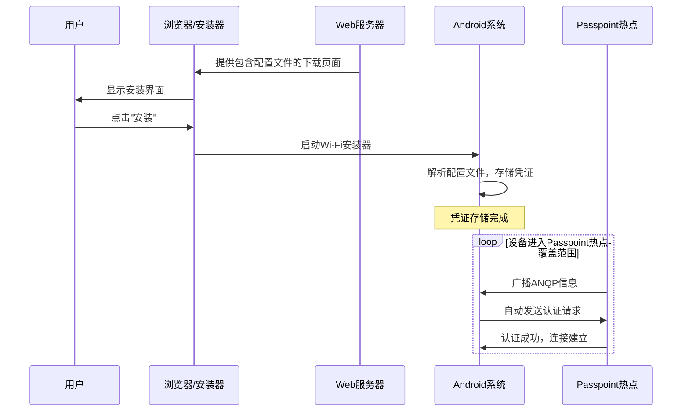
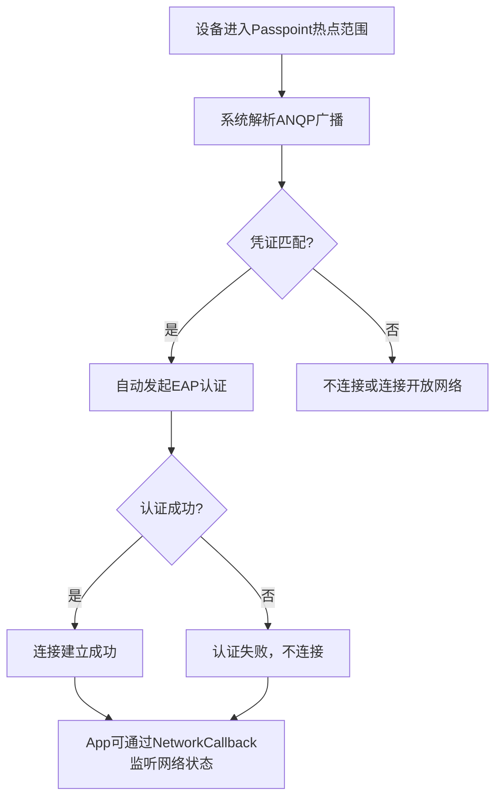
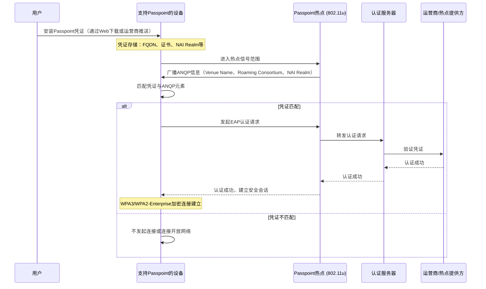
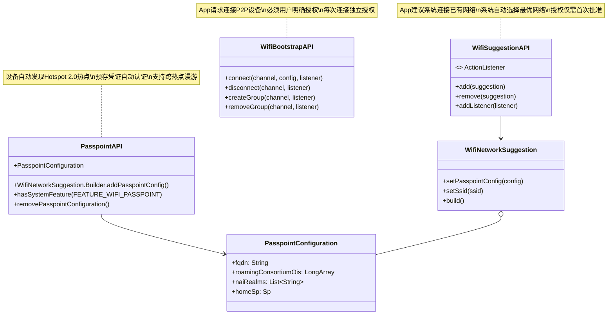

# 13.1.24 About Passpoint

午后的阳光暖洋洋地洒在山间观景台上。

洛芙把背包放在木栈道的栏杆旁，整个人往栏杆上一靠，深深地吸了一口气。从营地爬上这座小山花了大约二十分钟，但眼前的景色让她觉得完全值得——山谷对岸的青山层叠，近处的草地像一块刚刚清洗过的绒毯，露营地的帐篷已经缩成了小小的色块。

"呼——"希尔也爬了上来，手里还拎着伊莎的水壶，"伊莎，你这个路线设计得不错啊。"

"那是，"伊莎笑着接过水壶，"我昨晚看了地图，这座小山包的观景台是看日出和日落的好地方。虽然现在没有日出，但下午的光线也很舒服。"

黛琳最后一个走上来，她的手机屏幕正亮着。

"大家先休息一下，"她扬了扬手机，"我刚收到一封邮件，是营地管理方发来的Wi-Fi使用说明。"

"营地有Wi-Fi？"洛芙一下子来了精神，"我怎么不知道？"

"不是营地官方的网络，"黛琳低头看着手机，"邮件说，从今天开始，营地周边一公里范围内，启用了一个叫'CampNet_Passpoint'的Wi-Fi信号。住客可以自动连接，不需要输入密码。"

"不需要密码？"希尔凑过来，"这么神奇？"

"邮件里说，因为这是基于Passpoint技术的，"黛琳念道，"只要手机支持Passpoint，就能在信号范围内自动连接。"

"Passpoint？"洛芙歪着头，"我好像在之前的文档里见过这个词……"

"是Wi-Fi联盟制定的一套标准，"黛琳解释道，"全名叫Hotspot 2.0。简单来说，就是让设备能够自动发现、自动认证、自动连接特定的Wi-Fi热点，不需要人手动输入密码。"

"那不就是自动连接Wi-Fi吗？"洛芙说，"我家的路由器也有这个功能啊。"

"不太一样，"黛琳摇摇头，"普通的自动连接是基于你已经保存过的网络——你得先去咖啡馆，输入密码连上一次，之后才会自动连。但Passpoint是从一开始就自动发现，根本不需要你之前做过任何操作。"

"这怎么可能？"洛芙瞪大了眼睛，"手机怎么知道要连哪个网络？"

"这就是它的精妙之处，"黛琳微微笑了，"走，我们找个地方坐下，我慢慢跟你说。"

四个人在观景台的木凳上坐下来。希尔从背包里掏出了笔记本电脑，伊莎则掏出了她的笔记本，准备记录。

"在说Passpoint之前，"黛琳从地上捡起一根小树枝，在木凳旁边的泥土上画了起来，"我想先说说我们之前学过的两个东西——Wi-Fi Suggestion和Wi-Fi Bootstrap。"

她在泥土上画出了三个框：

"Wi-Fi Suggestion，是App可以建议系统去连接某个已有的Wi-Fi网络。系统收到建议之后，会自己决定要不要连，而且只需要用户第一次批准就行。"

"Wi-Fi Bootstrap，是App主动请求连接到某个P2P设备，必须用户明确授权。"

"那Passpoint呢？"洛芙问道。

"Passpoint不一样，"黛琳在第三个框里写下了几个字，"它是让设备能够**自动发现**和**自动连接**那些支持Hotspot 2.0标准的Wi-Fi热点。整个过程不需要任何App的介入，也不需要用户每次都点允许。"

"不需要App介入，也不需要用户操作？"希尔扬起了眉毛，"这听起来像是魔法。"

"确实有点像，"黛琳笑着点头，"但它背后的原理其实很清晰。"

她用树枝在泥土上画出了一幅新的图：

"首先，Passpoint热点会向外广播一种特殊的信息帧，叫ANQP——Access Network Query Protocol。这里面包含了热点的基本信息，比如它是谁提供的、安全类型是什么、漫游协议支持哪些。"

"ANQP……"洛芙默默记下这个词。

"然后，支持Passpoint的设备会监听这些广播。当它发现周围有Passpoint热点时，会自动拿出自己之前存储的凭证——就是你和运营商或者热点提供方注册的账号信息——去做认证。"

"等等，"希尔打断道，"你说'之前存储的凭证'——这个凭证是从哪来的？"

"问得好，"黛琳点点头，"凭证有两种方式来。"

她在地上画了一个简单的流程图：



"第一种方式，是通过Web下载配置文件，"黛琳指着图的上半部分说，"热点提供方会把凭证信息打包成一个特殊的文件，放在Web服务器上，然后给你一个链接。你在浏览器里打开这个链接，点击'安装'，系统就会自动把这个凭证存进去。"

"就像安装一个证书一样？"洛芙问道。

"对，很像，"黛琳点点头，"这个文件里包含了热点的标识信息——叫FQDN，全称是Fully Qualified Domain Name，你可以理解为热点的'身份证号'——还有你的用户名、密码或者数字证书。"

"那第二种方式呢？"希尔问道。

"第二种方式，是运营商直接推送，"黛琳说，"比如你的手机卡是某家运营商的，这家运营商在很多地方都布了支持Passpoint的热点。那你的手机卡里本身就存储了你的身份信息，当你进入任何一个该运营商的Passpoint热点范围，手机会自动完成认证。"

"所以Passpoint特别适合机场、咖啡馆、酒店这种有很多连锁热点的地方？"伊莎轻声说道。

"对，就是这个意思，"黛琳看着伊莎笑了，"伊莎你这个联想很到位。想象一下，你是一个经常出差的人，每到一个新城市，都要找酒店Wi-Fi、输入密码，非常麻烦。但如果酒店支持Passpoint，你进了大堂，手机就自动连上了——因为你之前已经注册过，凭证已经在手机里了。"

"漫游的感觉！"希尔兴奋地说，"就像拿着全球通护照到了一个新国家，海关直接盖章放行，不需要每次都签证。"

"你这个比喻很好，"黛琳点头，"Passpoint解决的核心问题，就是'信任链'。普通Wi-Fi需要你手动输入密码，这就像每次过境都要签证；但Passpoint只需要你证明一次'我是这个运营商的用户'，之后在这个运营商覆盖的所有热点之间，你都可以自动通行。"

"那么安全吗？"洛芙有些担心，"不需要输入密码就能连，会不会有安全问题？"

"Passpoint比普通开放Wi-Fi安全得多，"黛琳说，"它使用的是WPA3-Enterprise或者WPA2-Enterprise认证，不是普通的WPA2-Personal。"

她在地上又画了一个框：

"WPA2-Personal用的是预共享密钥，就是大家共用的一个密码。知道密码的人都能连，但也意味着不知道密码的人也可以尝试连接。"

"WPA2-Enterprise呢？"洛芙问道。

"WPA2-Enterprise和WPA3-Enterprise都使用的是双向证书认证，"黛琳解释道，"你的设备有一个证书，热点也有一个证书。两个证书互相验证对方的身份，就像两个人互相出示身份证——你证明你是你，我证明我是我，然后我们才开始通信。"

"比普通密码安全多了，"希尔点点头，"密码可能被猜测、被偷看，但证书伪造起来就难多了。"

"而且，"黛琳补充道，"在认证过程中，设备会和热点协商一个临时的会话密钥。这个密钥每次连接都不一样，就算有人截获了某一次的通信数据，也无法用来解密其他会话。"

洛芙若有所思地点了点头。"我大概理解了，"她说，"那让我来总结一下——Passpoint的核心，就是设备预先存储了来自热点提供方或运营商的凭证，然后当它进入支持Passpoint的热点的信号范围时，会自动用这个凭证完成认证并连接。整个过程不需要App介入，也不需要用户每次都操作。"

"总结得很好，"黛琳赞许地说，"洛芙你现在理解得很准确了。"

"那这个ANQP是什么？"希尔指着电脑上搜索到的资料问道，"我看到文档里提到了802.11u。"

"802.11u是Wi-Fi的一个标准协议，"黛琳说，"你可以理解为，它是一套让Wi-Fi热点能够和外部网络服务提供商打交道的规则。普通的Wi-Fi热点只管把自己的信号发出去，让设备连上来；但支持802.11u的热点还会额外广播一些信息，比如'我是哪个运营商的'、'我提供哪些网络服务'、'我的漫游合作伙伴有哪些'。"

她重新拿起树枝，在泥土上画出了一个表格：

"ANQP元素，就是这些广播信息的具体内容。常见的ANQP元素包括："

" Venue Name——场所名称，比如'星巴克咖啡馆'"
"—— Roaming Consortium——漫游联盟标识，让设备知道这个热点属于哪个联盟"
"—— NAI Realm——网络接入标识，告诉设备这个网络使用什么认证方式"
"—— 3GPP Cellular Network Information——蜂窝网络信息，让设备知道可以和哪些运营商做漫游"

"等等，"希尔打断道，"你说Roaming Consortium和NAI Realm……这些是给设备用来匹配凭证的？"

"对，"黛琳点点头，"设备存储的凭证里也有这些信息。当设备收到热点的ANQP广播时，它会比对自己存储的Roaming Consortium列表和热点广播的是否匹配。如果匹配，就说明这个热点在它的'白名单'里，值得信任，然后才会发起连接。"

"所以Passpoint的安全是建立在'事先审核'的基础上的，"伊莎轻声说，"就像一个高级会所，只有会员才能刷卡进入。不是随便一个人都能进的。"

"伊莎这个比喻很准确，"黛琳笑着说，"Passpoint就是一个'会员制'的Wi-Fi网络。只有事先注册过、拥有有效凭证的设备，才能自动连上。"

"那我们怎么在代码里使用Passpoint呢？"希尔已经打开了笔记本电脑，"让我来看看Android提供了什么API。"

她搜索了一下，然后说："找到了！在Android里，App可以通过WifiNetworkSuggestion API来添加Passpoint配置。"

希尔在键盘上飞快地敲了起来：

```kotlin
import android.net.wifi.passpoint.PasspointConfiguration
import android.net.wifi.WifiNetworkSuggestion

// 创建Passpoint配置
val passpointConfig = PasspointConfiguration().apply {
    // FQDN：热点的完全限定域名，类似于唯一的身份证号
    fqdn = "hotel.example.com"
    // 运营商的Roaming Consortium OI（Organization Identifier）
    roamingConsortiumOis = longArrayOf(0x04, 0x10, 0x20, 0x30)
    // 网络NAI Realm，用于匹配认证方式
    naiRealms = listOf("realm@example.com")
    // 设置认证方式为EAP-TTLS
    setCredentialPriority(1)
    // 设置EAP类型为TTLS
    homeSp = Sp().apply {
        fqdn = "hotel.example.com"
        spPriority = 1
        checked = true
        eapType = Eap.TTLS
        authType = EapPhase2.MSCHAPV2
        userName = "guest"
        password = "guestpassword"
    }
}

// 通过WifiNetworkSuggestion API添加Passpoint配置
val suggestion = WifiNetworkSuggestion.Builder()
    .setPasspointConfig(passpointConfig)
    .setSsid("Hotel_Guest_Network")  // 热点广播的SSID
    .build()

val wifiManager = applicationContext.getSystemService(Context.WIFI_SERVICE) as WifiManager
val status = wifiManager.addNetworkSuggestions(listOf(suggestion))

if (status == WifiManager.STATUS_NETWORK_SUGGESTIONS_SUCCESS) {
    Log.d("Passpoint", "Passpoint配置添加成功")
} else {
    Log.e("Passpoint", "Passpoint配置添加失败: $status")
}
```

"这段代码展示了两种方式添加Passpoint配置？"洛芙问道。

"对，"希尔点点头，"一种是直接创建PasspointConfiguration，设置好FQDN、漫游联盟信息、认证凭证等；另一种是把PasspointConfiguration包装成WifiNetworkSuggestion，通过Suggestion API添加到系统里。"

"这两种方式有什么区别？"洛芙问道。

"实际上，"希尔说，"在Android 11及之后，Passpoint配置就是通过WifiNetworkSuggestion.Builder.addPasspointConfig()来添加的。这样系统会把它当作一个'网络建议'来处理，和普通的Wi-Fi Suggestion共享同一套机制。"

"也就是说，"黛琳补充道，"Passpoint在Android里的实现，是和Suggestion、Bootstrap共享同一套Wi-Fi Network Request API框架的。区别在于：Suggestion是App建议连接某个网络，Bootstrap是App请求连接某个P2P设备，而Passpoint是系统根据预先存储的凭证，自动发现并连接支持Hotspot 2.0标准的热点。"

"三个API，一套框架，"洛芙感叹道，"Android的网络API设计还挺统一的。"

"那设备怎么知道某个网络是Passpoint网络呢？"希尔看着屏幕上的代码问道。

"通过ANQP发现，"黛琳说，"当设备扫描到一个Wi-Fi网络时，如果这个网络支持802.11u，它会在Probe Response里包含ANQP元素。系统会解析这些元素，检查是否有和已存储的Passpoint凭证匹配的信息。如果匹配，就自动发起连接。"

希尔在电脑上又搜了搜资料："我看到了，Android 11对Passpoint的要求是设备制造商必须提供802.11u的固件支持。在Android 11之前，需要在device.mk里启用Passpoint功能标志。"

"这个是不是和我们的手机有关，"洛芙问道，"我们没办法通过App来控制？"

"对，"黛琳点点头，"Passpoint需要底层固件的支持。如果你的设备不支持802.11u，那App层面做再多也没用。不过，从Android 11开始，所有出货的带Wi-Fi功能的设备都必须支持Passpoint，所以大多数新设备都是支持的。"

"那营地那个'CampNet_Passpoint'，"伊莎说，"它是怎么知道我们是住客并允许我们自动连接的呢？"

"有两种可能，"黛琳说，"第一种，是营地方预先给每个住客生成了一套凭证——可能是用户名加密码，或者数字证书——然后通过邮件或者营地App发给你。你把这些凭证安装到手机里，之后手机进入营地热点的信号范围就会自动连上。"

"第二种呢？"

"第二种，是营地方加入了某个Roaming Consortium联盟。你的手机运营商可能和这个联盟有合作，那你手机里的SIM卡或者之前安装的某个证书，就可以直接用来认证。"

"所以有时候我们自己都不知道，手机就自动连上了，"洛芙说，"原来是因为运营商之间有漫游协议。"

"对，"黛琳点点头，"这和手机在不同的基站之间自动切换是类似的原理。只不过Wi-Fi的Passpoint是在热点层面，蜂窝是在基站层面。"

"蜂窝网络也有漫游，"希尔说，"所以运营商可以把自己的Passpoint热点和蜂窝网络打包成一个统一的上网套餐，用户在哪儿都能自动连接最合适的网络。"

"难怪邮件里说营地的PasspointWi-Fi是'无缝漫游'，"洛芙恍然大悟，"原来是这个意思。"

大家沉默了片刻，看着远处的山谷。午后的阳光把草地染成了深深浅浅的金绿色，远处有鸟在叫，声音清脆得像在敲玻璃杯。

"我想起一个比喻，"伊莎轻声说，"Passpoint就像是一张年卡。你提前买好了年卡，去任何一个支持这个年卡的景点，只需要刷卡就能进，不需要每次都排队买票。而且因为你的身份信息已经存在卡里，景点知道你是有权限的，不会拦你。"

"这个比喻很好，"黛琳说，"而且年卡上印着的场馆联盟信息（Roaming Consortium），和景点门口挂牌子上写的联盟信息是对应的——只有两边匹配，年卡才有效。这就是Passpoint的自动发现和认证机制。"

"那普通Wi-Fi的自动连接呢？"洛芙问道，"我回家的时候，手机也会自动连上我家的Wi-Fi。这和Passpoint有什么区别？"

"普通的自动连接，"黛琳说，"是基于你已经手动连接过、存储过密码的网络。系统只是'记住'了你之前输入的密码，然后下次看到同名网络就自动用这个密码连接。"

"但Passpoint不是基于密码，而是基于证书或者凭证，"希尔补充道，"而且Passpoint可以做到跨热点漫游——只要你家的路由器和咖啡馆的路由器属于同一个Passpoint网络，你从一个地方走到另一个地方，手机会自动切换，不需要你做任何操作。"

"这太方便了，"洛芙感叹道，"我现在每次去咖啡馆，都要手动找网络、输入密码……如果咖啡馆支持Passpoint就好了。"

"其实很多大型连锁品牌的咖啡馆、机场、酒店都已经支持Passpoint了，"黛琳说，"只是大多数用户不知道而已。他们的手机会自动连接，但用户可能根本没注意到。"

"那我作为一个开发者，想在自己的App里利用Passpoint，应该怎么做呢？"希尔问道。

"你需要做三件事，"黛琳竖起三根手指，"第一，检查设备是否支持Passpoint；第二，创建PasspointConfiguration，把凭证信息填进去；第三，通过WifiNetworkSuggestion API把配置添加到系统。"

希尔已经在电脑上打开了官方文档：

```kotlin
// 检查设备是否支持Passpoint
private fun checkPasspointSupport(): Boolean {
    val pm = packageManager
    return pm.hasSystemFeature(PackageManager.FEATURE_WIFI_PASSPOINT)
}

// 添加Passpoint配置
private fun addPasspointConfiguration(config: PasspointConfiguration) {
    val wifiManager = applicationContext.getSystemService(Context.WIFI_SERVICE) as WifiManager

    val suggestion = WifiNetworkSuggestion.Builder()
        .setPasspointConfig(config)
        .build()

    val status = wifiManager.addNetworkSuggestions(listOf(suggestion))
    when (status) {
        WifiManager.STATUS_NETWORK_SUGGESTIONS_SUCCESS -> {
            Log.d("Passpoint", "Passpoint配置已添加")
        }
        WifiManager.STATUS_NETWORK_SUGGESTIONS_ERROR_ADD_INVALID -> {
            Log.e("Passpoint", "Passpoint配置无效")
        }
        WifiManager.STATUS_NETWORK_SUGGESTIONS_ERROR_APP_DISALLOWED -> {
            Log.e("Passpoint", "App未被授权添加网络建议")
        }
        else -> {
            Log.e("Passpoint", "添加Passpoint配置失败: $status")
        }
    }
}
```

"这个流程和Wi-Fi Suggestion的添加方式几乎一模一样，"希尔说，"只是在Builder里多调用了一个.setPasspointConfig()。"

"因为它们共享同一套框架嘛，"黛琳说，"Passpoint只是系统自动发现和认证的那一方，需要预先存储凭证而已。从App的角度看，它只需要把配置交给系统，剩下的连接过程就由系统全权处理了。"

"那如果我们想移除一个Passpoint配置呢？"希尔问道。

```kotlin
// 移除Passpoint配置
private fun removePasspointConfiguration(config: PasspointConfiguration) {
    val wifiManager = applicationContext.getSystemService(Context.WIFI_SERVICE) as WifiManager

    val suggestion = WifiNetworkSuggestion.Builder()
        .setPasspointConfig(config)
        .build()

    val status = wifiManager.removeNetworkSuggestions(listOf(suggestion))
    if (status == WifiManager.STATUS_NETWORK_SUGGESTIONS_SUCCESS) {
        Log.d("Passpoint", "Passpoint配置已移除")
    }
}
```

"系统会自动管理凭证的生命周期，"黛琳说，"App不需要操心什么时候该更新凭证、什么时候该删除。只要凭证有效，系统就会在合适的时机自动使用它。"

"这个设计挺好的，"希尔点点头，"App只管'提供'和'撤销'，剩下的全交给系统。"

洛芙看着远处的帐篷，想了想："那营地这个'CampNet_Passpoint'，如果我不小心连上了，会不会跑很多流量？"

"好问题，"黛琳说，"Passpoint连接的网络可以是计费的，也可以是免费的，取决于热点的提供方。App可以通过NetworkCallback监听网络的可用性，并在合适的时机决定是否使用这个网络。"

她又在白板上画了一个简图：



"不过，"黛琳补充道，"Passpoint的自动连接有一个前提——你的设备必须已经安装了对应热点的凭证。系统不会自动从云端下载凭证，必须是你或者你的运营商提前安装好的。"

"那营地是怎么给我们安装凭证的呢？"洛芙问道，"我没记得我安装过什么东西啊。"

"可能有两个原因，"黛琳说，"第一，可能是营地通过邮件给你发了一个配置文件的下载链接，你点击安装之后，系统就把凭证存进去了——你可能没注意到这个过程。"

"第二呢？"

"第二，可能是你手机里的某个App或者SIM卡运营商已经预置了相关凭证。比如你的手机运营商和营地所在的网络提供商有漫游合作，那你手机里的SIM卡或者eSIM里就自动有了对应凭证。"

"原来如此，"洛芙恍然大悟，"我还以为是没有密码的开放网络呢，原来是这么高级的技术。"

"不过，"希尔插嘴道，"虽然凭证是自动存储的，但用户还是可以在设置里查看、管理和删除这些Passpoint配置的。在设置 -> Wi-Fi -> 高级设置里，有一个'安装的凭证'或者'Passpoint'选项卡。"

"Android给了用户透明的控制权，"黛琳说，"这很重要。Passpoint虽然方便，但有些用户可能不想让自己的设备自动连接某些网络——Android把这个选择权交给了用户。"

伊莎合上了笔记本："我有个问题。Passpoint和之前学的Wi-Fi Easy Connect有关系吗？"

"好问题，"黛琳说，"Wi-Fi Easy Connect是另一种配对方式，它是用摄像头扫描二维码来获取Wi-Fi凭证的。Passpoint是设备根据预先存储的凭证自动连接支持Hotspot 2.0的热点。它们解决的是不同的问题。"

她重新在白板上画了一个对比表：

"Wi-Fi Easy Connect是'如何把凭证传递给设备'——你用摄像头扫个码，凭证就进手机了。Passpoint是'设备如何自动发现和连接热点'——凭证已经在手机里了，遇到匹配的热点了就自动连。"

"两者可以结合使用，"希尔补充道，"比如一个酒店先通过Wi-Fi Easy Connect把凭证传给住客的手机，然后住客的手机在酒店范围内自动连接——扫码是安装凭证，自动连接是使用凭证。"

"好方便，"洛芙感叹道，"感觉未来的Wi-Fi会越来越智能，不需要人操心。"

"技术越智能，对开发者来说责任也越大，"黛琳认真地说，"我们要确保凭证的安全存储、确保自动连接不会给用户带来意料之外的费用或者流量消耗。Passpoint虽然底层做了很多工作，但App层依然需要合理地引导用户、管理网络预期。"

希尔伸了个懒腰："差不多了吧？太阳快下山了，我们也该回营地了。"

洛芙站起身，看了看手机屏幕。右上角显示已经连接到了"CampNet_Passpoint"，信号满格。

"真的连上了啊，"她笑着说，"刚才光顾着听讲，都没注意到。"

"这就是Passpoint的意义——让你感受不到连接的过程，"黛琳收拾起白板笔，"不需要弹对话框，不需要输入密码，一切都在后台默默完成。"

"就像一阵风，吹过来，你就身处其中了，"伊莎轻声说。

"伊莎你这个比喻好美，"希尔笑着拍了拍她的肩膀，"走吧，下山去。我有点饿了，想吃晚饭了。"

四个人沿着山路向山下走去。午后的阳光把他们的影子拉得长长的，和远处的山峦重叠在一起。

洛芙走在最后，低头看着手机屏幕上的Wi-Fi图标。那个小小的扇形信号图标旁边，多了一个看起来像"P"的字母。

"Passpoint，"她轻声念叨，"Hotspot 2.0。设备自动发现，凭证自动认证，网络自动连接。"

她把手机收进口袋，加快了脚步，追上了前面的三人。

下山的路比上山轻快多了。

---

## 专业技术总结

> **Passpoint（Hotspot 2.0）** — Wi-Fi联盟（WFA）制定的协议标准，使移动设备能够自动发现并认证支持Hotspot 2.0的Wi-Fi热点，无需用户手动输入密码。设备通过预先安装的凭证（证书/用户名密码）与热点进行企业级认证（EAP-TLS/EAP-TTLS等），支持跨热点漫游，适用于机场、酒店、咖啡馆等连锁场景。

#### 结构图

**Passpoint自动发现与连接流程（时序图）：**



**Passpoint vs Suggestion vs Bootstrap对比：**



#### 复杂度与影响

| 维度 | 影响 |
|------|------|
| **安全性** | 使用WPA3-Enterprise或WPA2-Enterprise，双向证书认证，比WPA2-Personal更安全 |
| **用户体验** | 无感知自动连接，无需输入密码，适合多热点连锁场景 |
| **功耗** | 设备需要监听ANQP广播，相比完全关闭Wi-Fi略耗电，但比持续扫描要省电 |
| **兼容性** | Android 11+强制要求，Android 10及更低需要厂商支持802.11u固件 |

#### 反模式与陷阱

1. **未检查设备支持就使用Passpoint API**
   - 修复：使用`hasSystemFeature(PackageManager.FEATURE_WIFI_PASSPOINT)`检查后再调用相关API

2. **凭证信息硬编码在APK中**
   - 修复：凭证应通过安全通道传输，或使用SIM卡/eSIM内置凭证，避免APK被反编译后泄露

3. **未处理凭证过期**
   - 修复：监听`WIFI_NETWORK_SUGGESTIONS_PARTIAL_CONNECTION`等状态，及时提示用户更新凭证

4. **假设Passpoint连接总是可用的**
   - 修复：使用`ConnectivityManager`检查网络可用性，不要假设Passpoint网络一定可用

5. **混淆Passpoint与普通自动连接**
   - 修复：明确Passpoint需要预先安装凭证，普通开放Wi-Fi的自动连接不需要凭证

#### 名词小传

**Passpoint（Hotspot 2.0）** — Wi-Fi联盟制定的自动漫游协议标准，让设备能够在支持该标准的热点之间自动发现和认证，无需用户手动操作。解决了连锁热点（机场、酒店、咖啡馆）的无缝漫游问题。

**ANQP（Access Network Query Protocol）** — 802.11u标准定义的查询协议，Passpoint热点通过它广播自己的身份、支持的认证方式、漫游合作伙伴等信息，供设备匹配凭证。

**Roaming Consortium OI** — 漫游联盟组织标识符，一串数字代码，代表某个热点联盟。设备的凭证里包含自己所属的OI列表，和热点广播的OI匹配则发起认证。

**NAI Realm（Network Access Identifier Realm）** — 网络接入标识的域名部分，用于指示该网络使用哪种EAP认证方式。比如`realm@example.com`表示使用EAP-TTLS或EAP-TLS。

**EAP（Extensible Authentication Protocol）** — 可扩展认证协议，是Wi-Fi企业级认证的核心框架。Passpoint支持EAP-TLS（证书认证）、EAP-TTLS（隧道TTLS）、EAP-SIM/EAP-AKA/EAP-AKA'（基于SIM卡的认证）等多种方式。

**WPA3-Enterprise / WPA2-Enterprise** — 企业级Wi-Fi安全协议，使用802.1X框架和EAP协议进行双向认证和密钥协商，比个人级（WPA2-Personal）更安全。

#### 设计哲学

**1. 信任链的预先建立**
Passpoint的核心不是"连接"技术，而是"信任"技术。设备和热点之间的信任，在设备出厂或SIM卡激活时就已经建立（通过证书或运营商关系），后续的自动连接只是这个信任链的延伸和执行。

**2. 用户无感与控制权的平衡**
Passpoint追求用户无感（自动连接），但同时通过系统设置让用户能够查看、删除已安装的凭证。这种"默认便利、可选控制"的设计哲学贯穿整个Android网络框架。

**3. 企业级安全下放到消费级场景**
WPA3-Enterprise原本是企业网络用的，但Passpoint把它带到了公共热点场景。通过漫游联盟机制，普通用户也能享受到比开放Wi-Fi安全得多的自动连接体验。

**4. 漫游是核心价值**
Passpoint最重要的价值不是"省一次密码输入"，而是"无缝漫游"。用户从家到公司、从公司到咖啡馆、从咖啡馆到机场，每一个支持Passpoint的热点都能被自动发现和连接，真正实现了"网络随人走"。

---
#### 🏕️ 动手练习

**方式B：独立练习制（知识点较分散）**


**练习 1：检查设备Passpoint支持 ★**

**目标：** 学习如何在代码中检查当前设备是否支持Passpoint

**你需要做的事：**
1. 在AndroidManifest中添加必要的权限（CHANGE_WIFI_STATE、ACCESS_WIFI_STATE、ACCESS_FINE_LOCATION）
2. 使用PackageManager.hasSystemFeature()检查FEATURE_WIFI_PASSPOINT
3. 根据检查结果更新UI，显示设备是否支持Passpoint

**验收标准：**
- [ ] 能够正确检测设备是否支持Passpoint
- [ ] 在支持的设备上显示"Passpoint可用"
- [ ] 在不支持的设备上显示"Passpoint不可用"并给出友好提示

**提示代码：**
```kotlin
private fun checkPasspointSupport(): Boolean {
    val pm = packageManager
    return pm.hasSystemFeature(PackageManager.FEATURE_WIFI_PASSPOINT)
}
```


**练习 2：创建并添加Passpoint配置 ★★**

**目标：** 学习如何创建PasspointConfiguration并通过WifiNetworkSuggestion API添加到系统

**你需要做的事：**
1. 创建一个PasspointConfiguration对象，设置FQDN、RoamingConsortiumOis、NAIRealm
2. 配置EAP认证信息（EAP类型、用户名、密码）
3. 将PasspointConfiguration包装成WifiNetworkSuggestion
4. 调用addNetworkSuggestions()添加到系统
5. 监听添加结果并处理各种错误码

**验收标准：**
- [ ] PasspointConfiguration包含所有必要字段
- [ ] 成功添加到系统后显示成功提示
- [ ] 处理ERROR_ADD_INVALID、ERROR_APP_DISALLOWED等错误情况

**提示代码：**
```kotlin
val config = PasspointConfiguration().apply {
    fqdn = "campus.example.edu"
    roamingConsortiumOis = longArrayOf(0x04, 0x10, 0x20, 0x30)
    naiRealms = listOf("campus.example.edu")
    homeSp = Sp().apply {
        fqdn = "campus.example.edu"
        spPriority = 1
        checked = true
        eapType = Eap.TTLS
        authType = EapPhase2.MSCHAPV2
        userName = "student01"
        password = "securepassword"
    }
}

val suggestion = WifiNetworkSuggestion.Builder()
    .setPasspointConfig(config)
    .setSsid("Campus_Passpoint")
    .build()
```


**练习 3：处理Passpoint网络连接状态 ★★**

**目标：** 学习如何监听Passpoint网络的连接状态变化

**你需要做的事：**
1. 注册NetworkCallback监听网络状态
2. 处理onAvailable、onLost、onLinkPropertiesChanged等回调
3. 在UI上显示当前网络的状态信息（SSID、信号强度、链接速度）
4. 实现断开连接的逻辑

**验收标准：**
- [ ] 成功监听网络可用/断开事件
- [ ] 正确解析和显示网络信息
- [ ] 能够主动断开Passpoint连接

**提示代码：**
```kotlin
private val networkCallback = object : ConnectivityManager.NetworkCallback() {
    override fun onAvailable(network: Network) {
        val wifiInfo = wifiManager.connectionInfo
        Log.d("Passpoint", "已连接到: ${wifiInfo.ssid}")
    }

    override fun onLost(network: Network) {
        Log.d("Passpoint", "Passpoint网络已断开")
    }

    override fun onLinkPropertiesChanged(network: Network, linkProperties: LinkProperties) {
        Log.d("Passpoint", "链接属性变化: ${linkProperties.linkAddresses}")
    }
}
```


**练习 4：移除Passpoint配置 ★★**

**目标：** 学习如何移除已安装的Passpoint配置

**你需要做的事：**
1. 获取之前添加的PasspointConfiguration对象
2. 将其包装成WifiNetworkSuggestion
3. 调用removeNetworkSuggestions()移除配置
4. 处理移除结果

**验收标准：**
- [ ] 能够成功移除Passpoint配置
- [ ] 移除后设备不再自动连接该热点
- [ ] 处理移除失败的错误情况

**提示代码：**
```kotlin
private fun removePasspointConfiguration(config: PasspointConfiguration) {
    val suggestion = WifiNetworkSuggestion.Builder()
        .setPasspointConfig(config)
        .build()

    val status = wifiManager.removeNetworkSuggestions(listOf(suggestion))
    if (status == WifiManager.STATUS_NETWORK_SUGGESTIONS_SUCCESS) {
        Toast.makeText(this, "Passpoint配置已移除", Toast.LENGTH_SHORT).show()
    } else {
        Toast.makeText(this, "移除失败: $status", Toast.LENGTH_SHORT).show()
    }
}
```


**练习 5：模拟Passpoint R1 Web配置下载 ★★★**

**目标：** 理解Passpoint R1配置文件（.dat）的结构，并模拟解析

**你需要做的事：**
1. 创建一个简单的base64编码的Passpoint配置文件
2. 编写代码解析其中的FQB、Credential等部分
3. 提取FQDN、Realm、EAP类型等信息
4. 将解析结果格式化输出

**验收标准：**
- [ ] 理解Passpoint配置文件的MIME格式
- [ ] 能够解析base64编码的配置文件
- [ ] 正确提取关键配置信息

**提示代码：**
```kotlin
// Passpoint配置文件是multipart MIME格式
// 每个部分有Content-Type: application/x-wifi-config
// 内容是base64编码的

private fun parsePasspointConfig(base64String: String): PasspointConfiguration? {
    return try {
        val decoded = Base64.decode(base64String, Base64.DEFAULT)
        val configString = String(decoded, Charsets.UTF_8)
        // 解析各部分...
        // 这里简化处理，实际需要解析WFA的TGPP2格式
        PasspointConfiguration()
    } catch (e: Exception) {
        Log.e("Passpoint", "解析配置文件失败", e)
        null
    }
}
```


**练习 6：Passpoint与普通Wi-Fi共存处理 ★★★**

**目标：** 处理当有多个可用网络时，Passpoint网络和普通Wi-Fi的优先级问题

**你需要做的事：**
1. 同时注册Passpoint网络建议和普通Wi-Fi网络建议
2. 使用ConnectivityManager设置网络偏好
3. 在网络断开时正确切换到备用网络
4. 模拟Passpoint网络断开后的自动重连场景

**验收标准：**
- [ ] 能够同时管理Passpoint和普通Wi-Fi建议
- [ ] 正确设置网络优先级
- [ ] 实现优雅的网络切换逻辑

**提示代码：**
```kotlin
// 设置网络偏好，优先使用计费网络还是免费网络
private fun setNetworkPreference() {
    val connectivityManager = getSystemService(Context.CONNECTIVITY_SERVICE) as ConnectivityManager
    // NETWORK_PREFERENCE_UNSET = 让系统自动选择
    // NETWORK_PREFERENCE_IN定假日_AIRPLANE = 移动数据优先
    connectivityManager.setNetworkPreference(ConnectivityManager.NETWORK_PREFERENCE_UNSET)
}
```


**练习 7：EAP认证类型完整配置 ★★★**

**目标：** 深入理解Passpoint支持的各类EAP认证方式，配置完整的认证参数

**你需要做的事：**
1. 配置EAP-TLS（证书认证）：设置客户端证书和CA证书
2. 配置EAP-TTLS（用户名密码）：设置内部和外部认证方式
3. 配置EAP-SIM/AKA（SIM卡认证）：理解基于SIM卡的身份验证
4. 对比不同EAP类型的适用场景

**验收标准：**
- [ ] 正确配置EAP-TLS所需的各种证书
- [ ] 理解EAP-TTLS的双向认证机制（外部TTLS + 内部PAP/CHAP/MSCHAPV2）
- [ ] 能够根据热点要求选择正确的EAP类型

**提示代码：**
```kotlin
// EAP-TLS配置示例
val eapTlsConfig = PasspointConfiguration().apply {
    fqdn = "enterprise.example.com"
    homeSp = Sp().apply {
        fqdn = "enterprise.example.com"
        checked = true
        eapType = Eap.TLS
        // 需要设置客户端证书和CA证书
        clientCertificateAlias = "my_client_cert"
        trustedCaCertificateAliases = arrayOf("my_ca_cert")
    }
}
```


**练习 8：Passpoint与Wi-Fi Easy Connect结合 ★★★**

**目标：** 设计一个完整流程：先用Easy Connect扫码获取凭证，再用Passpoint自动连接

**你需要做的事：**
1. 实现Wi-Fi Easy Connect的二维码扫描（使用Inten过滤器响应easy_connect URL）
2. 从扫描结果中提取凭证信息
3. 将凭证转换为PasspointConfiguration格式
4. 添加到系统，让设备在对应热点范围内自动连接
5. 实现完整的配对→安装→自动连接流程

**验收标准：**
- [ ] 能够响应Wi-Fi Easy Connect的二维码扫描
- [ ] 正确提取并解析凭证信息
- [ ] 端到端实现"扫码→安装→自动连接"完整流程

**提示代码：**
```kotlin
// Wi-Fi Easy Connect的Intent Filter
// 在Manifest中注册：
// <intent-filter>
//     <action android:name="android.intent.action.PROCESS_TEXT"/>
//     <data android:scheme="wificfg"/>
// </intent-filter>

// 处理接收到的Wi-Fi Easy Connect数据
private fun handleEasyConnectIntent(intent: Intent) {
    val uri = intent.data ?: return
    // uri格式: wificfg://host/path?params...
    // 解析参数获取凭证信息
}
```


**面试热身（开放式问题）**

1. **请解释Passpoint（Hotspot 2.0）和普通Wi-Fi自动连接的本质区别是什么？Passpoint解决了什么问题？**

2. **描述Passpoint的自动发现流程——设备是如何判断一个热点是否值得连接的？ANQP在这里扮演了什么角色？**

3. **Passpoint使用了哪些企业级认证协议？WPA2-Enterprise和WPA2-Personal的安全区别是什么？**

4. **如果一个App想使用Passpoint，需要在Android层面做哪些准备工作？设备层面的支持如何检查？**

5. **Passpoint和Wi-Fi Suggestion、Wi-Fi Bootstrap三者之间的关系是什么？它们分别适用于什么场景？**

---

#### 参考实现要点

1. **始终检查设备Passpoint支持**：使用`hasSystemFeature(PackageManager.FEATURE_WIFI_PASSPOINT)`检查，不支持时给出友好提示

2. **凭证安全存储**：Passpoint凭证应通过安全通道安装，不要将敏感信息硬编码在APK中

3. **使用WifiNetworkSuggestion框架**：Android 11+的Passpoint配置通过Suggestion API添加，与普通Wi-Fi Suggestion共享同一套机制

4. **监听网络状态变化**：使用NetworkCallback监听Passpoint网络的连接/断开，及时更新UI

5. **提供用户控制能力**：在设置中提供查看和删除Passpoint配置的入口，尊重用户对自动连接的掌控权


> 学习建议

理解Passpoint最好的方式，是把它想象成"一张全球通用的会员卡"。你提前在某个机构注册并获得了一张卡，这张卡上印着你的身份信息和授权范围。当你到达任何一个接受这张卡的场所时，门禁自动识别、你直接进入——不需要每次都登记、买票、验证身份。Passpoint就是这样工作的：凭证预先安装，热点预先广播身份，设备到达时自动匹配、自动认证。记住这个本质，你会发现ANQP、Roaming Consortium OI、EAP这些名词都只是这张"会员卡"的不同组成部分而已。

## 洛芙的小小日记本

今天学到了Passpoint！原来手机能自动连Wi-Fi不只是因为"记住密码"，而是有一个叫Hotspot 2.0的标准在背后默默工作。提前安装凭证、自动发现热点、双向证书认证——这一切都在我毫不知情的情况下完成了。伊莎说Passpoint就像年卡，黛琳说信任链要预先建立。感觉自己对Wi-Fi的理解又深了一层。下次去咖啡馆，我要看看手机连上的到底是哪种网络！

## 今日关键词

**Passpoint（Hotspot 2.0）** — Wi-Fi联盟制定的自动漫游协议标准，让设备能够自动发现并认证支持该标准的Wi-Fi热点，无需手动输入密码。

**ANQP（Access Network Query Protocol）** — 802.11u定义的查询协议，Passpoint热点通过它广播身份、认证方式和漫游合作伙伴等信息，供设备匹配凭证。

**Roaming Consortium OI** — 漫游联盟组织标识符，一串十六进制数字，代表某个热点联盟的ID，用于设备凭证与热点广播信息的匹配。

**NAI Realm（Network Access Identifier Realm）** — 网络接入标识的域名部分，指示该网络使用何种EAP认证方式，如`realm@example.com`。

**EAP（Extensible Authentication Protocol）** — 可扩展认证协议，Wi-Fi企业级认证的核心框架，支持EAP-TLS、EAP-TTLS、EAP-SIM等多种认证方式。

**WPA3-Enterprise / WPA2-Enterprise** — 企业级Wi-Fi安全协议，使用双向证书认证，比WPA2-Personal更安全，是Passpoint使用的安全标准。

**FQDN（Fully Qualified Domain Name）** — 完全限定域名，热点的唯一标识符，类似于热点的"身份证号"，用于凭证匹配。

**PasspointConfiguration** — Android中用于配置Passpoint凭证的类，包含FQDN、Roaming Consortium OI、NAI Realm、EAP认证信息等字段。

**WifiNetworkSuggestion.Builder.addPasspointConfig()** — Android 11+添加Passpoint配置的方法，将PasspointConfiguration包装成NetworkSuggestion后添加到系统。

**FEATURE_WIFI_PASSPOINT** — 设备特性标识，用于检查当前设备是否支持Passpoint功能。

**Wi-Fi Easy Connect** — 用摄像头扫码方式获取Wi-Fi凭证的配对协议，与Passpoint解决的问题不同但可结合使用。

**EAP-TLS** — 基于证书的EAP认证方式，设备和服务端互相验证证书，适合企业环境。

**EAP-TTLS** — 隧道TTLS认证，外部认证使用TLS隧道，内部认证可以使用PAP、CHAP、MSCHAPV2等，适合公共热点。

**EAP-SIM / EAP-AKA / EAP-AKA'** — 基于SIM卡或USIM卡的认证方式，利用SIM卡中存储的运营商身份信息进行自动认证，适合蜂窝运营商提供的Passpoint热点。

**802.11u** — Wi-Fi标准修正案，定义了Passpoint所需的ANQP等机制，让Wi-Fi热点能够与外部服务提供商交互。
