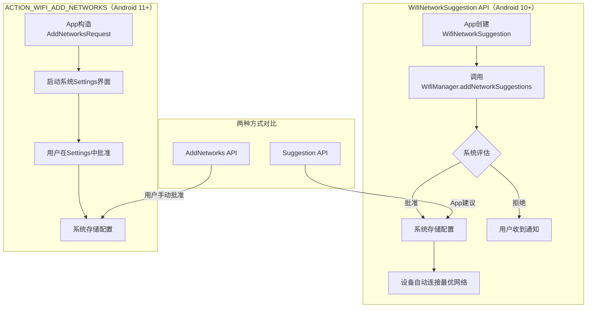
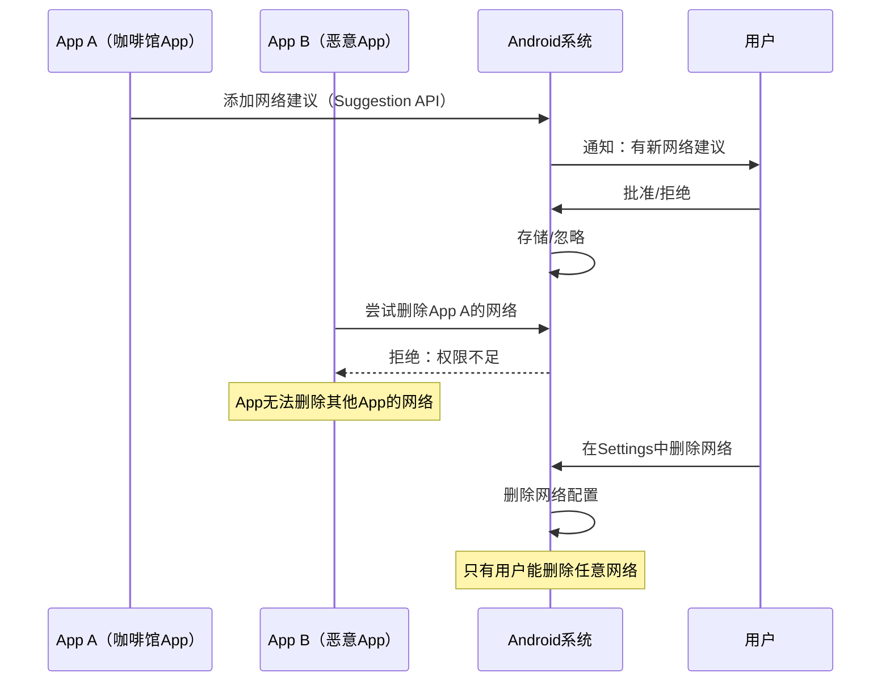
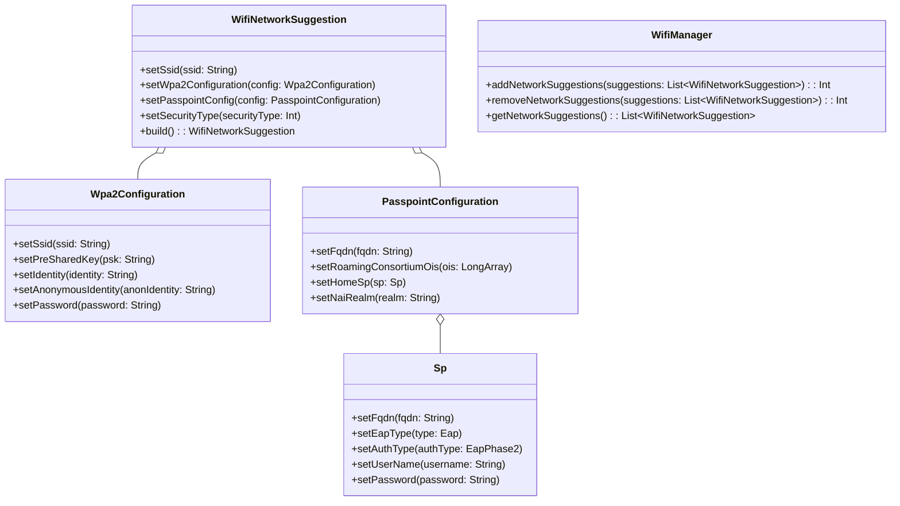
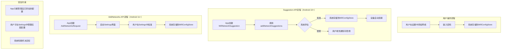
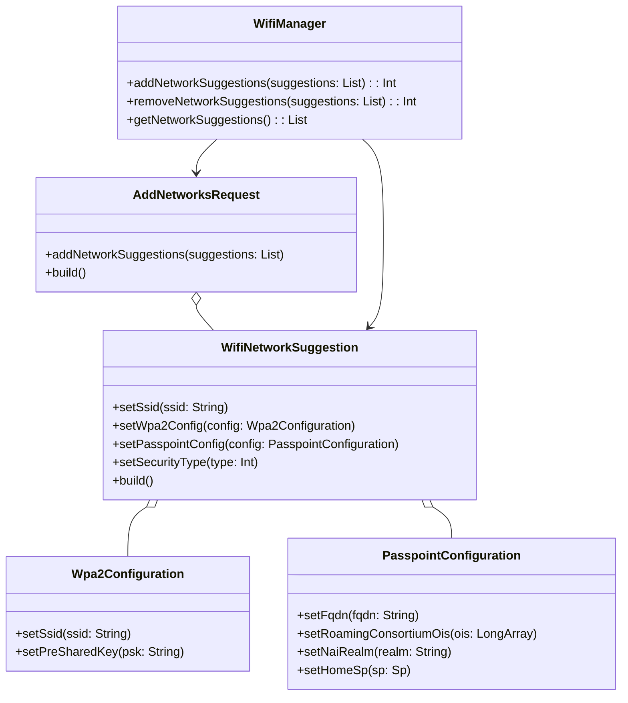

# 13.1.25 Save networks and Passpoint configurations

洛芙把手机从口袋里掏出来，看了一眼屏幕右上角的Wi-Fi图标。那个小小的扇形信号旁边，那个像"P"的字母还亮着，信号满格。

"所以，"她盯着屏幕，若有所思地说，"我现在已经连上了CampNet_Passpoint，对吧？"

"对啊，"希尔从笔记本电脑后面探出头来，"你刚才不是还感叹了一番嘛，说Passpoint让你感受不到连接的过程。"

"是的。但是我在想一件事——"洛芙把手机举到眼前，翻到Wi-Fi设置页面，"这个网络现在存到哪儿去了？"

"存到系统里了呗，"希尔说，"你的密码或者凭证信息存在系统Wi-Fi配置里，下次在信号范围内就自动连。"

"那如果我把这个网络删掉呢？"洛芙手指悬在"忘记网络"的按钮上方，"或者——下次我来这个营地，还能用这个网络吗？"

"好问题，"黛琳从白板旁边走过来，"这其实就是我们今天要讨论的核心问题——Android系统是怎么保存和管理Wi-Fi网络配置的。"

"还有Passpoint配置，"伊莎补充道，"刚才我们说了，Passpoint的凭证是预先安装的。但这个'预先安装'到底是谁做的？存在哪里？下次还能不能用？"

"这些都是好问题，"黛琳点点头，"走，我们找个更舒服的地方坐下来聊。回营地的路上正好可以讨论——希尔，你继续往前走，帮我们找个合适的位置。"

"遵命，"希尔合上笔记本，站起身，"我刚看到前面有一块大石头，旁边正好有几棵树，凉快又避风。"

四个人沿着木栈道往山下走了一段，在希尔说的大石头旁边停下来。这里正好在一棵老槐树的树荫下，阳光透过树叶的缝隙洒下来，在地上投出斑驳的光影。远处有松鼠在树枝间跳来跳去，偶尔发出几声清脆的叫声。

"好了，"黛琳从背包里掏出了白板笔，在一块便携小白板上开始画了起来，"我们来好好说说Android系统保存Wi-Fi配置这件事。"

她在白板上画了一个大框，然后在里面写下了三个关键词：

"**普通Wi-Fi网络**、**Passpoint网络**、**网络建议（Network Suggestion）**。"

"这是三种不同的东西？"洛芙问道。

"对，它们在存储方式、添加方式和删除方式上都有区别，"黛琳说，"我们一个一个来说。"

她先在普通Wi-Fi网络的框下面画了一个小流程：

"普通Wi-Fi网络，就是你想的那种——咖啡馆的开放网络、你家里的路由器、你公司的办公网络。这类网络的配置保存很简单：用户在设置里找到这个网络，输入密码，连接一次，系统就会记住这个网络的SSID和密码。"

"下次在信号范围内，手机会自动连上，"洛芙说，"这个我懂。"

"对。但这里有一个问题——"黛琳在普通Wi-Fi网络旁边画了一个问号，"普通Wi-Fi的自动连接有一个前提：这个网络必须是你之前手动连过、保存过的。如果是一个新的咖啡馆，你从来没去过，它广播的SSID从来没在你的手机里出现过——那手机不会自动连。"

"除非……"希尔接话道。

"除非有人告诉你这个网络，或者你主动去找它，"黛琳点点头，"这就是普通Wi-Fi的局限性——它只能记住'你见过'的网络。"

"那Passpoint呢？"洛芙问道。

"Passpoint不一样，"黛琳在Passpoint网络的框下面画了一个新的图，"Passpoint的凭证不是你手动输入密码得来的，而是通过两种方式安装的："

"第一种，通过Web下载配置文件。你到一个支持Passpoint的酒店或者公共场所，他们会给你一个链接，你点开链接，系统就会把这个配置文件存进去。就像安装一个证书一样。"

"第二种，通过运营商推送。你的SIM卡或者eSIM里可能已经预置了你运营商的漫游凭证，当你进入任何一个该运营商的Passpoint热点范围，手机会自动完成认证。"

"那存到哪儿去了？"洛芙追问道。

"存在系统的Wi-Fi配置存储里，"黛琳说，"具体来说，是存在一个叫WifiConfigStore的地方。这个存储区是系统级别的，只有Android系统和拿到系统权限的App才能访问。普通App是碰不了这个存储区的。"

"等等，"希尔抬起手，"那App怎么添加Passpoint配置呢？总不能每次都让用户自己去网页上下载吧？"

"这就是我们要说的第三种东西——**网络建议（Network Suggestion）**，"黛琳的眼睛亮了起来，"这是Android 10（API 29）开始引入的一套新API，专门用来解决'App想帮用户管理网络配置'这个问题的。"

她在白板上画出了一个更大的框，里面画了一个新的结构：



"WifiNetworkSuggestion API，"黛琳指着图说，"是Android 10引入的。它的工作原理是这样的："

"首先，一个App——比如酒店的App，或者咖啡馆的App——可以创建一个网络建议（WifiNetworkSuggestion），这个建议里包含了网络的SSID、安全类型、密码或者凭证信息。"

"然后，这个App调用WifiManager.addNetworkSuggestions()，把这个建议提交给系统。"

"系统收到建议之后，会自己做一个判断——这个网络好不好？信号强不强？用户之前有没有拒绝过？然后决定要不要连接。"

"等等，"洛芙打断道，"系统'自己判断'？那如果App建议了一个很差的网络，比如有病毒的网络呢？"

"好问题，"黛琳点点头，"这就是Suggestion API的设计哲学——App只能'建议'，系统有最终的决定权。App可以建议连或者不连，但系统会综合考虑各种因素，决定要不要真的连。"

"而且，"她补充道，"用户有最终的控制权。用户可以在设置里看到有哪些App建议了什么网络，可以拒绝某个App的建议，也可以直接删除某个网络。App删除自己建议的网络后，系统会自动断开连接，但如果用户已经手动连接过，那网络会保留。"

"这个设计挺好的，"希尔点点头，"App有权限添加，但系统有最终决定权，用户有最终控制权。三层权力互相制衡。"

"那ACTION_WIFI_ADD_NETWORKS呢？"伊莎问道。

"ACTION_WIFI_ADD_NETWORKS是Android 11（API 30）才引入的，"黛琳说，"它比Suggestion API更进一步——它可以直接打开系统的Settings界面，让用户在界面里批准添加网络。"

她在白板上又画了一个流程：

"App构造一个AddNetworksRequest，里面包含了Wi-Fi配置信息，然后启动一个Intent，指向系统的Settings Activity。用户看到Settings里的界面，点击'批准'，系统就把这个网络存进去了。"

"这和Suggestion API有什么区别？"洛芙问道。

"区别在于授权方式，"黛琳说，"Suggestion API是App直接提交建议，系统自动处理，用户只需要在第一次批准即可。AddNetworks API是App请求打开Settings，让用户自己在Settings里批准——用户有更直接的参与感。"

"而且，"她补充道，"AddNetworks API不仅可以添加普通的Wi-Fi网络，还可以添加Passpoint配置。这是它和Suggestion API的一个关键区别。"

"Passpoint配置？"洛芙眨眨眼，"所以营地那个CampNet_Passpoint，可以通过AddNetworks API添加到我的手机里？"

"理论上可以，"黛琳说，"但实际操作中，Passpoint配置通常是通过Web下载配置文件来安装的，因为配置文件里包含了完整的凭证信息和热点元数据。AddNetworks API更多是用于普通的WPA2或者WPA3-Personal网络。"

希尔已经打开了笔记本电脑，在搜索官方文档："我来看看官方文档怎么说的。"

她找到了一段描述，然后念了出来：

"'This document details how Android apps can save or modify Wi-Fi and Passpoint network configurations using the ACTION_WIFI_ADD_NETWORKS intent on Android 11 and higher.'"

"'The Settings Intent API lets you ask the user to approve adding a saved network or Passpoint configuration.'"

"所以官方文档的重点是ACTION_WIFI_ADD_NETWORKS，"希尔说，"这个API让App可以请求用户在Settings里批准添加保存的网络或Passpoint配置。"

"那Suggestion API呢？"洛芙问道。

"Suggestion API是另一套，"希尔继续念道，"'Apps that suggest Passpoint networks that are gated by terms and conditions. Apps that suggest Passpoint networks that require a decorated identity must...'"

她皱起眉头："这段话有点绕。大概意思是，有些Passpoint网络需要用户同意某些条款和条件，有些需要特殊的身份标识——这些情况下就要用Suggestion API来处理。"

"其实这两套API不是互斥的，"黛琳说，"它们解决的是不同层面的问题："

"**Suggestion API**是给那些"提供服务"的App用的——比如咖啡馆、酒店、机场，他们的App可以建议系统连接他们的网络，系统会自动处理，用户只需要在第一次批准即可。"

"**AddNetworks API**是给那些"想让用户手动控制"的场景用的——App请求在Settings里打开一个界面，让用户自己点批准，用户有更直接的参与感。"

"明白了，"洛芙点点头，"一个偏自动，一个偏手动。"

"对，就是这个意思，"黛琳笑了，"而且要注意的是，无论是哪种方式，**普通App都无法删除其他App添加的网络配置**。这是Android的一个安全限制。"

她在白板上画了一个简短的图示：



"看到了吗？"黛琳指着图说，"App只能管自己添加的网络，不能管别人添加的网络。只有用户自己在Settings里才有权限删除任意网络。"

"为什么这样设计？"希尔问道。

"为了防止恶意App搞破坏，"黛琳说，"如果任意App都可以删除任意网络，那一个恶意App就可以把用户的所有网络配置都删掉，让用户断网。这种权限分离的设计保证了用户对自己网络的完全控制。"

"这很合理，"伊莎轻声说，"就像你家门锁，只有你有钥匙，锁匠帮你换了锁，但你不同意，他人也开不了门。"

"伊莎这个比喻很恰当，"黛琳点头，"Android的权限模型就是这样的——App可以申请权限，但权限的授予最终要经过用户同意；而且权限的行使还要经过系统检查，防止越界。"

洛芙若有所思地看着远处的山谷。午后的阳光已经从正午的直射变成了斜照，把山间的树木染上了一层淡淡的金色。

"那我现在这个CampNet_Passpoint，"她开口道，"它算是哪种？"

"从技术角度说，"黛琳想了想，"CampNet_Passpoint是一个Passpoint R1/R2网络，它的凭证应该是营地管理方通过Web配置文件的方式安装到你手机里的。你点击了那个链接，安装了配置文件，所以现在你的手机里存了这个热点提供商的凭证。"

"那下次我来这个营地，还能自动连上吗？"洛芙问道。

"取决于凭证的有效期，"黛琳说，"如果营地没有换证书、没有换运营商，那凭证应该还是有效的，下次你来自动连上。"

"但如果营地换了一个新的Passpoint热点提供商——比如从CampNet换成MountainNet——那旧的凭证就不匹配了，你需要重新安装新的配置文件。"

"所以这个凭证不是永久的，"洛芙说，"它有可能过期？"

"对，"黛琳点点头，"和证书一样，Passpoint的凭证有有效期。App可以通过WifiNetworkSuggestion API查询凭证的状态，但用户也可以在设置里查看和管理已安装的Passpoint配置。"

"那我想自己添加一个Wi-Fi网络呢？"洛芙问道，"比如我在咖啡馆里，想把那个网络保存下来，下次自动连——这个怎么实现？"

"这有两种方式，"黛琳说，"**第一种**，用户自己手动在设置里添加——打开Wi-Fi设置，找到那个网络，输入密码，连接，系统自动保存。"

"**第二种**，如果有一个咖啡馆的App，它想帮你自动添加这个网络——它可以用Suggestion API或者AddNetworks API来添加。但要注意，无论是哪种方式，都需要用户授予权限。"

"App不能偷偷地把网络加进去，"希尔补充道，"必须用户同意——要么是在App的第一次批准弹窗里点同意，要么是在Settings的审批界面里点批准。"

"那一个App如果想添加很多网络呢？"洛芙问道，"比如我想让我的露营App帮我管理我所有去过的营地的Wi-Fi？"

"这就要说到Secure Wi-Fi Enterprise配置了，"黛琳在白板上翻了一页，"Android对企业级Wi-Fi配置有一个专门的处理方式。"

她在白板上画了一个新的结构图：



"这个图看起来很复杂，"洛芙看着图说，"WifiNetworkSuggestion里包含Wpa2Configuration和PasspointConfiguration两种？"

"对，"黛琳指着图说，"WifiNetworkSuggestion是一个统一的外层包装，它可以根据不同的网络类型，包含不同的内部配置："

"**Wpa2Configuration**——用于WPA2-Personal或者WPA2-Enterprise的网络，设置SSID和密码。"

"**PasspointConfiguration**——用于Passpoint网络，包含FQDN、Roaming Consortium OI、NAI Realm、EAP认证信息等。"

"App创建WifiNetworkSuggestion的时候，根据网络的类型，选择合适的配置类填进去，然后调用WifiManager.addNetworkSuggestions()提交给系统。"

"那Secure Wi-Fi Enterprise配置呢？"希尔问道，"我看到文档里有这个词。"

"Secure Wi-Fi Enterprise配置，"黛琳说，"是指用于TLS-based Wi-Fi Enterprise连接的配置文件。这类连接使用的是EAP-TLS协议，需要双向证书——客户端证书和服务器端证书。"

"Android提供了专门的方式来处理这种证书配置，"她继续说，"App可以使用KeyChain API来存储和检索客户端证书，这个证书可以在多个App之间共享，也可以用于Wi-Fi Enterprise认证。"

"KeyChain API……"洛芙默默记下这个词。

"简单来说，"黛琳总结道，"Android保存和管理Wi-Fi配置的核心机制是这样的："

"**普通Wi-Fi网络**——SSID和密码存在WifiConfigStore，用户手动添加，系统自动连接。"

"**Passpoint网络**——凭证（证书或者用户名密码）存在WifiConfigStore，可以通过Web下载配置文件安装，也可以通过App的Suggestion API添加。"

"**WifiNetworkSuggestion**——Android 10引入的API，让App可以建议系统连接某个网络。系统有最终决定权，用户有最终控制权。App只能添加自己建议的网络，不能删除别人添加的网络。"

"**ACTION_WIFI_ADD_NETWORKS**——Android 11引入的API，让App可以请求用户在Settings里批准添加保存的网络或Passpoint配置。用户直接参与审批过程。"

"**Secure Wi-Fi Enterprise**——用于TLS-based企业级连接，通过KeyChain API管理证书。"

"我大概明白了，"洛芙说，"让我来整理一下——"

"普通Wi-Fi就像我家的钥匙，我输入密码，系统记住，下次自动开锁。"

"Passpoint就像一张会员卡，我提前注册，凭证存在卡里，到任何一个支持这个会员卡的场所刷卡进。"

"WifiNetworkSuggestion就像一个智能管家，管家推荐连接某个网络，但主人（系统）有决定权，住户（用户）有最终控制权。"

"ACTION_WIFI_ADD_NETWORKS就像去前台登记，前台（Settings）让我确认，我确认了，系统才记录。"

"伊莎这个比喻框架搭得很好，"黛琳笑着说，"洛芙你这个总结也很准确。"

"那营地这个CampNet_Passpoint，"洛芙又看了一眼手机，"它是怎么存进去的？我不记得我安装过什么东西啊。"

"可能有两个原因，"黛琳说，"第一，营地可能通过邮件给你发了一个配置文件的下载链接，你点击之后，系统就把凭证存进去了——你可能没注意到这个过程，就像安装一个证书一样，安装完了就忘了。"

"第二，可能是你手机里的某个App或者SIM卡运营商已经预置了相关凭证。比如你的手机运营商和营地所在的网络提供商有漫游合作，那你手机里的SIM卡或者eSIM里就自动有了对应凭证。"

"原来如此，"洛芙点点头，"所以我根本不需要手动做任何事情，一切都在后台完成了。"

"这就是Passpoint的设计目标，"黛琳说，"让你感受不到连接的过程。"

希尔敲了一会儿键盘，然后抬起头："我找到一个很实用的功能——Android可以在添加网络建议之后，在通知栏显示这个建议网络的信息，用户点击通知可以直接跳转到Settings去管理。"

"这个功能很实用，"伊莎轻声说，"就像快递到了驿站，给你发一条短信让你去取一样。"

"对，"希尔点头，"Notification会显示App的名称和它建议的网络，用户可以根据这个来判断是不是要信任这个App的建议。"

"那如果我不想让某个App建议网络呢？"洛芙问道。

"你可以在设置里关掉这个功能，"黛琳说，"在Wi-Fi设置里，有一个'网络建议'或者'建议的网络'选项，你可以看到有哪些App在建议网络，可以关掉某个App的权限。"

"Android给了用户很细粒度的控制，"希尔说，"这个设计挺好的。"

洛芙站起身，伸了个懒腰。午后的阳光已经从树梢间斜射进来，把地面上的光斑拉得长长的。

"我还有一个问题，"她说，"刚才我们说了，App不能删除其他App添加的网络。那如果我想删除营地这个Passpoint网络，应该怎么做？"

"在设置里删除，"黛琳说，"打开Wi-Fi设置，找到已保存的网络列表，找到CampNet_Passpoint，点击它，然后选择'忘记网络'或者'删除'。"

"或者，"她补充道，"你也可以在Passpoint专门的设置页面里删除。这个页面在设置 -> Wi-Fi -> 高级设置 -> Passpoint里面，可以看到所有已安装的Passpoint配置。"

"明白了，"洛芙点点头，"那我试试。"

她打开手机设置，翻到Wi-Fi设置页面，找到了CampNet_Passpoint。她盯着这个网络看了几秒钟。

"还是算了，"她把手机收起来，"万一下次来还用得上呢。"

"这很合理，"伊莎笑着说，"留着总比删了强。"

"而且，"希尔补充道，"就算你删了，只要营地的Passpoint网络还在，下次你进入信号范围，营地App可能会再次建议你添加这个网络。"

"等等，"洛芙歪着头，"营地App还能自动建议？"

"如果营地方开发了一个App，这个App在后台运行，它检测到你进入了营地范围，就可以调用Suggestion API建议系统连接CampNet_Passpoint，"希尔解释道，"这就是Suggestion API的价值——App可以'感知'用户当前的环境，主动提供网络建议。"

"原来如此，"洛芙感叹道，"感觉Android的网络管理比我想象的复杂多了。"

"复杂是好事，"黛琳说，"复杂意味着安全、意味着可控。Android的网络权限模型经过精心设计，App可以添加、建议，但系统有决定权，用户有最终控制权。这种三层架构保证了网络的可用性和安全性。"

"我把这个记下来，"伊莎从背包里掏出笔记本，开始写。

希尔也重新打开笔记本电脑："我来整理一下官方文档里的关键代码示例。"

她在键盘上敲了一会儿，然后说：

"我找到了一些关键代码。首先是添加普通Wi-Fi网络建议："

```kotlin
// 创建普通Wi-Fi网络建议（WPA2-Personal）
// 这是最常见的家庭网络类型
val suggestion = WifiNetworkSuggestion.Builder()
    .setSsid("CampNet_WiFi")          // 设置网络名称
    .setWpa2Config(
        Wpa2Configuration()
            .setSsid("CampNet_WiFi")
            .setPreSharedKey("camppassword123")  // 设置WPA2密码
    )
    .build()

val wifiManager = applicationContext.getSystemService(Context.WIFI_SERVICE) as WifiManager

// 添加网络建议
val addStatus = wifiManager.addNetworkSuggestions(listOf(suggestion))
when (addStatus) {
    WifiManager.STATUS_NETWORK_SUGGESTIONS_SUCCESS -> {
        Log.d("WiFi", "网络建议添加成功，系统将评估是否连接")
    }
    WifiManager.STATUS_NETWORK_SUGGESTIONS_ERROR_ADD_INVALID -> {
        Log.e("WiFi", "网络配置无效，请检查SSID和密码")
    }
    WifiManager.STATUS_NETWORK_SUGGESTIONS_ERROR_APP_DISALLOWED -> {
        Log.e("WiFi", "App未被授权添加网络建议")
    }
    else -> {
        Log.e("WiFi", "添加失败: $addStatus")
    }
}
```

"这段代码展示了用Suggestion API添加一个普通的WPA2-Personal网络，"希尔指着屏幕说，"App创建WifiNetworkSuggestion，设置SSID和密码，然后调用addNetworkSuggestions提交给系统。"

"系统收到之后，会评估这个网络是否值得连接，然后决定要不要自动连。App只能'建议'，不能'强制'。"

"那Passpoint网络呢？"洛芙问道。

"Passpoint网络的添加方式和普通网络类似，只是在Builder里多调用一个方法："

```kotlin
// 创建Passpoint网络建议
// Passpoint网络使用预先安装的凭证，不需要每次输入密码
val passpointSuggestion = WifiNetworkSuggestion.Builder()
    .setPasspointConfig(
        PasspointConfiguration().apply {
            // FQDN：热点的完全限定域名
            fqdn = "campnet.example.com"
            // Roaming Consortium OI：漫游联盟标识符
            roamingConsortiumOis = longArrayOf(0x04, 0x10, 0x20, 0x30, 0x50, 0x60)
            // NAI Realm：网络接入标识
            naiRealms = listOf("campnet.example.com")
            // EAP认证配置
            homeSp = Sp().apply {
                fqdn = "campnet.example.com"
                spPriority = 1
                checked = true
                eapType = Eap.TTLS
                authType = EapPhase2.MSCHAPV2
                userName = "camper01"
                password = "securepass"
            }
        }
    )
    .build()

val status = wifiManager.addNetworkSuggestions(listOf(passpointSuggestion))
Log.d("Passpoint", "Passpoint网络建议添加状态: $status")
```

"这段代码展示了创建Passpoint网络建议，"希尔说，"和普通网络不同的是，Passpoint建议使用PasspointConfiguration，里面包含了FQDN、Roaming Consortium OI、NAI Realm、EAP认证信息等。"

"这些信息从哪里来？"洛芙问道。

"通常从热点提供方那里获得，"黛琳说，"比如你入住酒店的时候，酒店会给你一个包含这些信息的配置文件，或者一个链接让你下载。"

"那如果我想删除一个网络建议呢？"洛芙又问道。

"调用removeNetworkSuggestions："

```kotlin
// 移除网络建议
val removeStatus = wifiManager.removeNetworkSuggestions(listOf(suggestion))
when (removeStatus) {
    WifiManager.STATUS_NETWORK_SUGGESTIONS_SUCCESS -> {
        Log.d("WiFi", "网络建议移除成功")
        // 如果设备当前连接在该网络上，系统会自动断开
    }
    else -> {
        Log.e("WiFi", "移除失败: $removeStatus")
    }
}
```

"移除网络建议后，如果设备当前正连接在这个网络上，系统会自动断开，"希尔说，"但如果用户之前手动连接过这个网络（比如在App建议之前），那网络配置会保留，只是App的建议被移除了。"

"这个区别很重要，"黛琳补充道，"**App只能移除自己添加的建议，不能移除用户手动添加的网络**。"

"那ACTION_WIFI_ADD_NETWORKS呢？"希尔问道，"我来看看官方文档里有没有代码示例。"

她搜索了一下，然后在键盘上敲了一会儿：

"找到了。ACTION_WIFI_ADD_NETWORKS的使用方式和Suggestion API不太一样——它不是直接调用WifiManager，而是启动一个系统Settings的Activity："

```kotlin
// 使用ACTION_WIFI_ADD_NETWORKS请求用户在Settings中批准添加网络
// 需要Android 11（API 30）及以上

// 构造AddNetworksRequest
val addNetworksRequest = AddNetworksRequest.Builder()
    .addNetworkSuggestions(listOf(suggestion))
    .build()

// 使用Settings API启动系统Wi-Fi添加界面
val intent = Intent(Settings.ACTION_WIFI_ADD_NETWORKS).apply {
    putExtra(AddNetworksRequest.EXTRA_ADD_NETWORKS_REQUEST, addNetworksRequest)
}

// 启动Activity，用户将在Settings界面中批准或拒绝
startActivityForResult(intent, REQUEST_CODE_ADD_NETWORKS)

// 在onActivityResult中处理结果
override fun onActivityResult(requestCode: Int, resultCode: Int, data: Intent?) {
    when (requestCode) {
        REQUEST_CODE_ADD_NETWORKS -> {
            when (resultCode) {
                RESULT_OK -> {
                    Log.d("WiFi", "用户在Settings中批准了添加网络")
                }
                RESULT_CANCELED -> {
                    Log.d("WiFi", "用户在Settings中取消了操作")
                }
            }
        }
    }
}
```

"这段代码展示了ACTION_WIFI_ADD_NETWORKS的使用流程，"希尔说，"App创建一个AddNetworksRequest，里面包含要添加的网络建议列表，然后启动Settings的Wi-Fi添加界面，让用户在界面上点批准。"

"用户点击批准之后，系统会把这些网络存进去。和Suggestion API不同的是，用户有更直接的参与感——他是在Settings界面里看到网络信息，然后手动点批准的。"

"那这两种方式，用哪种更好？"洛芙问道。

"看场景，"黛琳说，"如果你的App是一个服务提供方，比如咖啡馆的App，你想让用户无感地连上你的网络——用Suggestion API，用户只需要第一次批准，之后都是自动的。"

"如果你的App需要用户明确知道要添加什么网络、并且希望用户自己决定——用AddNetworks API，用户在Settings里看到网络信息，有更明确的控制感。"

"明白了，"洛芙点点头，"一个偏无感，一个偏可控。"

"对，"黛琳说，"而且要注意的是，AddNetworks API是Android 11才引入的，如果你的App需要支持Android 10，那只能用Suggestion API。"

"那Android 10以下的设备呢？"希尔问道。

"那就只能靠用户手动在设置里添加了，"黛琳说，"或者用一些Hack的方式——但那些方式都不推荐，因为需要特殊权限，而且不稳定。"

"所以还是要看官方的建议，"希尔说，"官方文档里明确说了，使用WifiNetworkSuggestion API和ACTION_WIFI_ADD_NETWORKS是最好的方式。"

"官方推荐的，就是最好的，"黛琳笑着说，"不要自己去造轮子。"

洛芙站起身，看了看远处的山。午后的阳光已经变得更加柔和，把整座山染上了一层淡淡的橙色。

"差不多了吧？"她说，"太阳快下山了，我们也该回营地了。"

"走，"希尔合上笔记本电脑，"我也饿了，想吃晚饭了。"

四个人沿着山路往山下走去。晚春的风从山谷里吹过来，带着青草和野花的香气。

洛芙走在最后，低头看着手机屏幕上的Wi-Fi图标。

"我想起一件事，"她说，"刚才我们说的那些——Suggestion API、AddNetworks API、普通Wi-Fi、Passpoint——这四种方式，Android是怎么决定用哪一种的呢？"

"根据你的网络类型和App的使用场景，"黛琳走在前面，头也不回地说，"普通 WPA2-Personal 用Suggestion API或者AddNetworks API；Passpoint 用PasspointConfiguration；Enterprise 用KeyChain管理证书。"

"这四种方式不是互斥的，"她补充道，"Android的网络框架是模块化的，App可以根据自己的需求选择合适的方式。"

"明白了，"洛芙把手机收起来，"感觉今天的收获很大。"

"明天我们来说Wi-Fi Easy Connect，"希尔说，"那个是用摄像头扫码来配对Wi-Fi的，也很有趣。"

"好期待，"伊莎轻声说。

四个人继续往山下走。夕阳把他们的影子拉得长长的，和山路重叠在一起，像一幅安静的剪影画。

---

## 专业技术总结

> **Save networks and Passpoint configurations** — Android通过WifiNetworkSuggestion API让App可以添加网络建议供系统自动连接；通过ACTION_WIFI_ADD_NETWORKS intent（Android 11+）可以请求用户在系统Settings界面中批准添加保存的网络或Passpoint配置。系统有最终决定权，用户有最终控制权，App只能管理自己添加的网络配置，无法删除其他App添加的配置。

#### 结构图

**Wi-Fi网络配置添加与管理流程（活动图）：**



**三种Wi-Fi网络配置方式对比：**



#### 复杂度与影响

| 维度 | 影响 |
|------|------|
| **用户体验** | Suggestion API让连接无感（首次授权后自动连接），AddNetworks API让用户有更多控制权 |
| **安全性** | App无法删除他人配置，只有用户能管理所有配置；企业级连接使用KeyChain管理证书 |
| **兼容性** | Suggestion API需要Android 10+，AddNetworks API需要Android 11+ |
| **功耗** | 系统自动管理网络选择，比用户手动切换更省电 |

#### 反模式与陷阱

1. **未检查API可用性就调用Suggestion/AddNetworks API**
   - 修复：在调用前检查Android版本，或使用`hasSystemFeature()`检查设备支持情况

2. **App尝试删除其他App添加的网络配置**
   - 修复：记住"App只能管理自己添加的配置"这一安全原则，如需删除让用户在Settings中操作

3. **未处理用户拒绝网络建议的情况**
   - 修复：监听网络建议状态变化，当用户拒绝后给出友好提示，不要重复弹窗

4. **混淆Suggestion API和AddNetworks API的使用场景**
   - 修复：Suggestion API适合"无感自动连接"，AddNetworks API适合"需要用户明确审批"的场景

5. **企业级Wi-Fi配置未使用KeyChain存储证书**
   - 修复：客户端证书应使用KeyChain API存储，避免将证书硬编码在APK中

#### 设计哲学

**1. 分层授权模型**
Android的Wi-Fi配置管理采用了"App建议 → 系统决定 → 用户控制"的三层授权模型。App可以申请添加网络建议，系统评估后决定是否采纳，用户拥有最终的管理权。这种分层设计保证了系统的安全性和可控性。

**2. 透明性与控制权的平衡**
Suggestion API追求"无感"，但Android通过通知和设置页面向用户展示哪些App在建议什么网络，让用户对自动连接保持知情。AddNetworks API追求"可控"，让用户在Settings中明确审批。两种API代表了透明性与便利性的不同权衡。

**3. 模块化的网络配置**
普通Wi-Fi（WPA2-Personal）、Passpoint、企业级Wi-Fi（EAP-TLS）使用了不同的配置对象，但都通过WifiNetworkSuggestion统一包装。这种模块化设计让App可以用同一套API处理不同类型的网络。

**4. 企业级安全下放到消费级场景**
通过KeyChain API管理Wi-Fi Enterprise证书，普通App也可以安全地使用企业级认证协议，而不需要额外的系统权限。

---

#### 🏕️ 动手练习

**方式B：独立练习制（知识点较分散）**

**练习 1：使用Suggestion API添加普通Wi-Fi网络建议 ★**

**目标：** 学习如何使用WifiNetworkSuggestion API添加一个WPA2-Personal网络建议

**你需要做的事：**
1. 在AndroidManifest中添加必要权限（CHANGE_WIFI_STATE、ACCESS_WIFI_STATE、ACCESS_FINE_LOCATION）
2. 创建WifiNetworkSuggestion，设置SSID和WPA2密码
3. 调用WifiManager.addNetworkSuggestions()添加到系统
4. 处理添加结果和各种错误码

**验收标准：**
- [ ] 正确创建WifiNetworkSuggestion
- [ ] 能够成功添加到系统
- [ ] 处理ERROR_ADD_INVALID、ERROR_APP_DISALLOWED等错误

**提示代码：**
```kotlin
val suggestion = WifiNetworkSuggestion.Builder()
    .setSsid("MyWiFi")
    .setWpa2Config(Wpa2Configuration().setSsid("MyWiFi").setPreSharedKey("password"))
    .build()

val status = wifiManager.addNetworkSuggestions(listOf(suggestion))
```

---

**练习 2：使用AddNetworks API请求用户在Settings中批准添加网络 ★★**

**目标：** 学习如何使用ACTION_WIFI_ADD_NETWORKS在Android 11+设备上请求用户在Settings中批准添加网络

**你需要做的事：**
1. 检查设备Android版本（需要API 30+）
2. 创建AddNetworksRequest，添加网络建议
3. 构造Intent启动Settings的Wi-Fi添加界面
4. 在onActivityResult中处理用户的审批结果

**验收标准：**
- [ ] 正确检测Android版本
- [ ] 能够启动Settings添加界面
- [ ] 正确处理RESULT_OK和RESULT_CANCELED

**提示代码：**
```kotlin
val request = AddNetworksRequest.Builder()
    .addNetworkSuggestions(listOf(suggestion))
    .build()

val intent = Intent(Settings.ACTION_WIFI_ADD_NETWORKS).apply {
    putExtra(AddNetworksRequest.EXTRA_ADD_NETWORKS_REQUEST, request)
}
startActivityForResult(intent, REQUEST_CODE)
```

---

**练习 3：创建并添加Passpoint网络建议 ★★**

**目标：** 学习如何创建PasspointConfiguration并通过Suggestion API添加到系统

**你需要做的事：**
1. 创建PasspointConfiguration，设置FQDN、RoamingConsortiumOis、NAIRealm
2. 配置EAP认证信息（EAP类型、用户名、密码）
3. 将PasspointConfiguration包装成WifiNetworkSuggestion
4. 添加到系统并处理结果

**验收标准：**
- [ ] 正确创建PasspointConfiguration
- [ ] Passpoint建议能够成功添加
- [ ] 能够监听连接状态变化

**提示代码：**
```kotlin
val passpointConfig = PasspointConfiguration().apply {
    fqdn = "campnet.example.com"
    roamingConsortiumOis = longArrayOf(0x04, 0x10, 0x20, 0x30)
    naiRealms = listOf("campnet.example.com")
    homeSp = Sp().apply {
        fqdn = "campnet.example.com"
        eapType = Eap.TTLS
        authType = EapPhase2.MSCHAPV2
        userName = "camper"
        password = "pass"
    }
}
```

---

**练习 4：移除网络建议并监听连接状态变化 ★★**

**目标：** 学习如何移除已添加的网络建议，并使用NetworkCallback监听网络状态变化

**你需要做的事：**
1. 保存之前添加的WifiNetworkSuggestion引用
2. 调用removeNetworkSuggestions()移除
3. 注册ConnectivityManager.NetworkCallback监听网络状态
4. 处理onAvailable、onLost等回调

**验收标准：**
- [ ] 能够成功移除网络建议
- [ ] 正确注册NetworkCallback
- [ ] 能够响应网络连接/断开事件

**提示代码：**
```kotlin
val callback = object : ConnectivityManager.NetworkCallback() {
    override fun onAvailable(network: Network) {
        Log.d("Network", "网络可用")
    }
    override fun onLost(network: Network) {
        Log.d("Network", "网络断开")
    }
}
connectivityManager.registerDefaultNetworkCallback(callback)
```

---

**练习 5：处理用户拒绝网络建议的情况 ★★★**

**目标：** 理解当用户拒绝网络建议后，App应该如何响应

**你需要做的事：**
1. 注册NetworkSuggestionErrorCallback监听建议错误
2. 处理STATUS_NETWORK_SUGGESTIONS_ERROR_USER_DISAPPROVED等错误
3. 实现重试逻辑或给用户友好提示
4. 测试用户拒绝后的行为

**验收标准：**
- [ ] 能够正确监听建议错误
- [ ] 给用户适当的反馈
- [ ] 实现合理的重试或降级策略

**提示代码：**
```kotlin
wifiManager.registerNetworkSuggestionErrorCallback(object :
    WifiNetworkSuggestionManager.NetworkSuggestionErrorCallback() {
    override fun onError(status: Int) {
        when (status) {
            WifiManager.STATUS_NETWORK_SUGGESTIONS_ERROR_USER_DISAPPROVED -> {
                // 用户拒绝了这个建议，不要重复弹窗
            }
        }
    }
})
```

---

**练习 6：Secure Wi-Fi Enterprise配置与KeyChain ★★★**

**目标：** 理解企业级Wi-Fi配置的安全存储方式，学会使用KeyChain管理证书

**你需要做的事：**
1. 使用KeyChain API存储和检索客户端证书
2. 配置EAP-TLS类型的企业级Wi-Fi
3. 实现证书认证的完整流程
4. 对比KeyChain存储 vs 普通存储的安全性差异

**验收标准：**
- [ ] 正确使用KeyChain API
- [ ] EAP-TLS配置能够成功连接
- [ ] 理解KeyChain提供的安全保证

**提示代码：**
```kotlin
// 使用KeyChain存储客户端证书
val callback = object : KeyChainCallback() {
    override fun alias(alias: String?) {
        // 使用alias创建WifiEnterpriseConfiguration
    }
}
KeyChain.installKeyChain(applicationContext, listOf(certificateFile), callback)
```

---

**练习 7：实现"感知环境自动建议"的完整流程 ★★★**

**目标：** 设计一个能够根据地理位置自动建议连接特定Wi-Fi的完整方案

**你需要做的事：**
1. 使用FusedLocationProvider检测用户进入特定区域
2. 在地理围栏触发时调用Suggestion API添加网络建议
3. 使用NetworkCallback监听连接状态
4. 实现连接成功后的后续操作（比如打开特定页面）

**验收标准：**
- [ ] 能够正确检测地理围栏进入事件
- [ ] 在合适的时机添加网络建议
- [ ] 连接成功后执行后续操作
- [ ] 考虑电量优化（避免持续定位）

**提示代码：**
```kotlin
// 地理围栏回调中检测到进入营地范围时添加网络建议
geofencingClient.onPermissionsGranted()
    .addOnSuccessListeners {
        val suggestion = WifiNetworkSuggestion.Builder()
            .setPasspointConfig(campConfig)
            .build()
        wifiManager.addNetworkSuggestions(listOf(suggestion))
    }
```

---

**面试热身（开放式问题）**

1. **请解释WifiNetworkSuggestion API和ACTION_WIFI_ADD_NETWORKS intent的区别是什么？它们分别适用于什么场景？**

2. **Android的Wi-Fi配置管理采用了"三层授权模型"——App建议、系统决定、用户控制。请详细描述这个模型，以及为什么这样设计？**

3. **App可以删除其他App添加的Wi-Fi配置吗？为什么？这种限制有什么安全意义？**

4. **Passpoint网络和普通Wi-Fi网络的配置存储方式有什么不同？请解释FQDN、Roaming Consortium OI、NAI Realm在Passpoint中的作用。**

5. **如果一个App想实现"进入某个咖啡馆就自动连接Wi-Fi"的功能，请设计完整的技术方案，包括使用的API、数据存储方式、权限处理等。**

---

#### 参考实现要点

1. **根据场景选择API**：无感自动连接用Suggestion API，需要用户明确审批用AddNetworks API

2. **始终处理错误情况**：Suggestion API返回多种错误码，必须逐一处理并给用户友好提示

3. **尊重用户控制权**：用户拒绝后不要重复弹窗，提供其他手动添加的方式

4. **使用KeyChain存储证书**：企业级Wi-Fi的客户端证书必须使用KeyChain API，避免安全隐患

5. **检查API可用性**：AddNetworks API需要Android 11+，使用前必须检查版本或设备支持情况

---

> 学习建议

理解Wi-Fi网络配置的保存机制，最好的方式是从"谁在管"这个角度出发。系统的WifiConfigStore是最终的存储地，但访问这个存储地的权限被分成了三层：App可以通过Suggestion API或AddNetworks API"建议"添加；系统有"最终决定权"；用户拥有"最终控制权"。记住这个三层模型，你就会明白为什么App不能删除别人的网络、为什么用户拒绝后App不应该重复弹窗、为什么Suggestion API是"无感"而AddNetworks API是"可控"。不同的设计哲学，对应不同的使用场景。

## 洛芙的小小日记本

今天学到了Android保存Wi-Fi配置的机制！原来我手机里连上CampNet_Passpoint这件事，背后有这么多层在起作用。Suggestion API让App提建议，系统来决定，用户来控制——三层分权，互相制衡。黛琳说技术越复杂，安全就越有保障。我现在每次打开Wi-Fi设置，都能感觉到这种"复杂性"带来的安心感。明天要学Wi-Fi Easy Connect，用摄像头扫码配对Wi-Fi，期待！

## 今日关键词

**WifiNetworkSuggestion API** — Android 10（API 29）引入的API，允许App建议系统连接某个Wi-Fi网络，系统有最终决定权，用户有最终控制权。

**ACTION_WIFI_ADD_NETWORKS** — Android 11（API 30）引入的Intent，让App请求在系统Settings界面中批准添加保存的网络或Passpoint配置。

**WifiConfigStore** — Android系统中存储Wi-Fi网络配置的底层存储区，包含SSID、密码、凭证等信息，只有系统级权限才能直接访问。

**AddNetworksRequest** — 用于ACTION_WIFI_ADD_NETWORKS的参数对象，包含要添加的网络建议列表。

**PasspointConfiguration** — Android中用于配置Passpoint网络的类，包含FQDN、Roaming Consortium OI、NAI Realm、EAP认证信息等。

**Wpa2Configuration** — Android中用于配置WPA2-Personal网络的类，包含SSID和预共享密钥（密码）。

**Sp（Service Provider）** — Passpoint配置中的服务提供商信息，包含FQDN、EAP类型、认证类型、用户名密码等。

**KeyChain API** — Android提供的安全证书存储API，用于存储和检索Wi-Fi Enterprise连接所需的客户端证书和私钥。

**EAP-TLS** — 基于证书的EAP认证方式，设备和服务端互相验证证书，用于企业级Wi-Fi连接。

**EAP-TTLS** — 隧道TTLS认证，外部认证使用TLS隧道，内部认证使用PAP/CHAP/MSCHAPV2等。

**Roaming Consortium OI** — 漫游联盟组织标识符，Passpoint网络中用于匹配热点和设备凭证的标识符。

**FQDN（Fully Qualified Domain Name）** — 完全限定域名，Passpoint网络中热点的唯一标识符。

**NAI Realm（Network Access Identifier Realm）** — 网络接入标识的域名部分，指示Passpoint网络使用何种EAP认证方式。

**NetworkCallback** — ConnectivityManager提供的回调接口，用于监听网络的可用性、断开、链路属性变化等事件。

**FEATURE_WIFI_PASSPOINT** — 设备特性标识，用于检查当前设备是否支持Passpoint功能。

**Wi-Fi Easy Connect** — 用摄像头扫码方式获取Wi-Fi凭证的配对协议，与Passpoint解决的问题不同但可结合使用。
