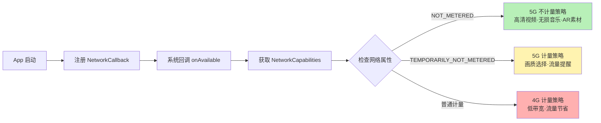
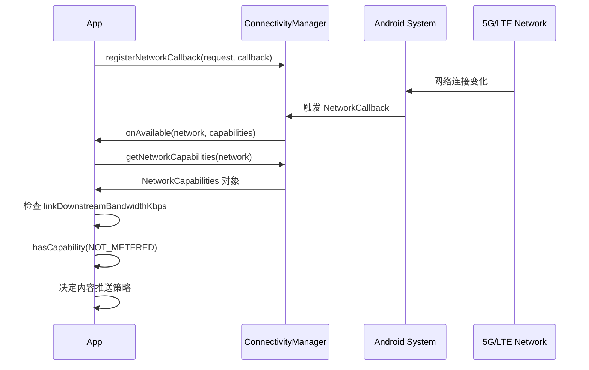

# 13.1.26 Overview

傍晚的风比午后凉了不少。

洛芙从观景台沿山路走回营地的时候，夕阳已经把整片山坡染成了蜜桃色。她低头看了一眼手机屏幕——信号格旁边清清楚楚地写着"5G"两个字，和昨天刚进山时显示的"4G"不一样。

"咦？"

她停下脚步，把手机举到眼前端详了一会儿，又抬头看了看远处连绵的山脊线。这里明明在山里，信号基站也不比山下多，怎么忽然就变成5G了？

"怎么啦？"希尔走在前面，听到动静回过头来。

"我们的网络变成5G了诶。"洛芙把手机屏幕转给希尔看，"昨天刚进山的时候还是4G，现在就变成5G了。5G和4G到底有什么区别呀？对我们写App的人来说，5G意味着什么？"

希尔凑过来看了一眼，挑了挑眉。"哦？5G覆盖过来了？这倒是新鲜。"

"等一下你们两个，走快点——"黛琳的声音从前面传来，"太阳快下山了，再不回去添柴火，今晚的篝火可就熄了。"

四个人加快脚步穿过最后一段山路，营地的轮廓在暮色中渐渐清晰起来。帐篷的顶在夕阳下泛着柔和的金光，希尔昨天傍晚生起的那堆篝火已经只剩下暗红的余烬，零星几点火星在灰烬中明灭。空气中飘着淡淡的松脂燃烧的味道，还有伊莎不知道什么时候架在火堆边烤上的棉花糖的甜香。

"先吃饭！"伊莎拍了拍手，把大家招呼到篝火边，"技术问题饭后再讨论。"

晚饭是简单但热气腾腾的速食咖喱饭，配上伊莎烤得金黄的棉花糖。月亮升起来的时候，篝火被重新添旺，橙红色的火苗在夜风中轻轻摇曳，在四个女孩脸上投下温暖的光影。

"那么，"洛芙捧着热可可，缩在睡袋里，眼睛亮晶晶地看着黛琳，"现在可以讲了吧？5G到底是什么意思呀？"

黛琳正用树枝拨弄着篝火里的炭火，让火焰保持稳定。听到洛芙的问题，她抬起头，微微一笑。

"你问的问题很好。"她说，"5G不只是'更快的4G'——至少对于我们写App的人来说，它是一整套全新的能力。"

"等等，"希尔举起手，"在说能力之前，是不是应该先讲清楚5G是怎么工作的？还有那个——"她顿了顿，"我之前看到文档里写的什么NR、NSA，听得一头雾水。"

"那是5G的两种组网方式。"黛琳点点头，"在搞懂这些之前，我们先要从一个最基本的问题开始——你们知道，手机是怎么知道当前连接的是什么网络的吗？"

洛芙摇了摇头。伊莎歪着头想了想，说："是看信号格旁边显示的文字？比如4G、5G、LTE？"

"那只是给用户看的'表象'。"黛琳说，"对于我们开发者来说，Android系统给我们提供了一个统一的接口，叫做`NetworkCapabilities`——它就像一张网络的'身份证'，上面写明了网络的所有属性：速度、是否计量、是否企业专用、信号强度……"

她拿起一根树枝，在篝火边的泥土上画了一个简单的方框。

"我们通过`ConnectivityManager`向系统申请查询当前网络的'身份证'，系统就会返回一个`NetworkCapabilities`对象。这个对象里有很多属性，其中有几个是5G新增的，也是我们今天要重点掌握的。"

"图1"洛芙凑过来看，黛琳在泥土上画的方框里写着`NetworkCapabilities`几个字，旁边延伸出好几条线。

"第一条线：`NET_CAPABILITY_NOT_METERED`。"

黛琳在方框下面写下这个词。

"这是什么意思呢？"她看向洛芙，"打个比方——你家的WiFi，就是'不计量'的。你用多少流量，运营商都不会多收你的钱，因为你是按月付的套餐费。"

"嗯嗯，这个我懂！"洛芙点头。

"`NET_CAPABILITY_NOT_METERED`表示这个网络是永久不计量——只要用户连着这个WiFi，就永远不用担心流量超限的问题。但在移动网络（蜂窝网络）里，以前几乎不存在这种情况——你的4G/5G流量都是按量计费的。"

"几乎？"希尔敏锐地捕捉到了这个词。

"对，'几乎'。"黛琳勾起嘴角，"因为5G带来了一个新特性：运营商可以在某些5G网络上，临时把流量标记为'不计量'。比如在美国，有些运营商会对你观看特定视频App的内容免流量——这就是`NET_CAPABILITY_TEMPORARILY_NOT_METERED`，临时不计量。"

"临时？"洛芙眨眨眼，"流量还能临时免费？"

"对。而且这里有一个陷阱——"

希尔接过话头，神情变得认真起来。"我来补充这个陷阱。在Android 10及以下，如果一个5G网络的 capability 被标记为 `TEMPORARILY_NOT_METERED`，它可能会在没有任何警告的情况下变回计量网络——也就是说，用户可能一开始以为自己在免流量看视频，结果看着看着忽然开始计费了。"

"啊？那用户的App体验不是很糟糕吗？"洛芙皱起眉头。

"所以这是一个需要我们特别注意的地方。"黛琳点点头，"作为开发者，我们需要理解：`NOT_METERED` 是永久的、不变的；但 `TEMPORARILY_NOT_METERED` 是临时的、可变的。打个比方——"

伊莎接过话头，温柔地说："`NOT_METERED` 就像你放在背包最底层的压缩饼干，只要你带着它，什么时候拿出来吃都行；但 `TEMPORARILY_NOT_METERED` 像是露营第一天买的冰激凌——放进保温袋里能撑几个小时，但几个小时之后，它就会化掉。"

"这个比喻好！"洛芙忍不住感叹，"所以App在设计的时候，不能假设TEMPORARILY_NOT_METERED永远是免费的？"

"对。"黛琳说，"最好的做法是：先默认用户需要控制流量消耗，只有当你确认 `NET_CAPABILITY_NOT_METERED` 是永久状态时，才允许高消耗的内容下载或推送。"

"那怎么检测呢？"洛芙掏出手机，"现在我们这里显示的是5G——我怎么知道它是哪一种计量状态？"

"问得好。"黛琳把树枝放下，"希尔，你来给她演示一下代码？"

"乐意效劳。"希尔从背包里掏出她的笔记本电脑，屏幕在篝火的映照下泛着淡淡的光。她打开Android Studio，噼里啪啦敲了几行代码。

"核心思路是这样的——"希尔说，"首先通过`ConnectivityManager`获取当前活动网络的`NetworkCapabilities`，然后检查它的`hasCapability()`方法。"

她敲出了第一段代码：

```kotlin
import android.content.Context
import android.net.ConnectivityManager
import android.net.NetworkCapabilities

// 检测当前网络的计量状态
// 返回值：true = 不计量，false = 计量
fun isCurrentNetworkUnmetered(context: Context): Boolean {
    val connectivityManager = context.getSystemService(Context.CONNECTIVITY_SERVICE) as ConnectivityManager
    
    val network = connectivityManager.activeNetwork ?: return false
    val capabilities = connectivityManager.getNetworkCapabilities(network) ?: return false
    
    // 检查是否为永久不计量网络
    // NOT_METERED 是永久属性，不会改变
    return capabilities.hasCapability(NetworkCapabilities.NET_CAPABILITY_NOT_METERED)
}
```

"这段代码，"希尔指着屏幕解释，"先拿到当前活动网络（`activeNetwork`），然后获取它的'身份证'（`getNetworkCapabilities`），最后用`hasCapability`检查它是否有`NET_CAPABILITY_NOT_METERED`这个属性。如果返回true，说明是WiFi或者永久不计量5G；如果返回false，说明是普通的计量网络。"

"那`TEMPORARILY_NOT_METERED`呢？"洛芙问，"如果我想知道是不是临时不计量，要怎么检测？"

希尔狡黠地笑了笑。"其实你不需要专门去检测`TEMPORARILY_NOT_METERED`——因为它的存在本身就意味着'状态可能随时改变'。更关键的问题是：你应该根据哪种状态来做产品决策？"

她往下翻代码，敲出了第二段：

```kotlin
// 判断当前是否为5G网络（推荐用于高带宽体验）
// 返回值：true = 5G，false = 非5G
fun isOn5GNetwork(context: Context): Boolean {
    val connectivityManager = context.getSystemService(Context.CONNECTIVITY_SERVICE) as ConnectivityManager
    
    val network = connectivityManager.activeNetwork ?: return false
    val capabilities = connectivityManager.getNetworkCapabilities(network) ?: return false
    
    // 检测信号带宽等级
    // TRANSPORT_WIFI_WIRELESS 表示蜂窝移动网络
    return capabilities.hasTransport(NetworkCapabilities.TRANSPORT_CELLULAR) &&
           capabilities.linkProperties?.信号等级 == 5  // 或者检查bandwidth
}
```

"这段代码有bug哦。"黛琳轻轻指出，"`信号等级`不是`linkProperties`的成员。"

"啊对，我口误了——"希尔挠挠头，快速修正，"应该是检查`networkCapabilities`的`linkDownstreamBandwidthKbps`属性。如果大于某个阈值，就说明是5G。"

"更准确的做法，"黛琳接过键盘，"是结合`NET_CAPABILITY_NOT_METERED`和`NET_CAPABILITY_INTERNET`一起来判断。"

她在希尔代码的基础上改出了一段更完整的实现：

```kotlin
import android.content.Context
import android.net.ConnectivityManager
import android.net.Network
import android.net.NetworkCapabilities
import android.net.NetworkRequest

// 完整的网络状态监听器
class NetworkStateCallback(
    private val on5GConnected: () -> Unit,
    private val onMeteredConnected: () -> Unit,
    private val on5GUnmetered: () -> Unit
) : ConnectivityManager.NetworkCallback() {
    
    override fun onAvailable(network: Network, capabilities: NetworkCapabilities) {
        super.onAvailable(network, capabilities)
        
        // 判断是否为5G蜂窝网络
        val is5G = capabilities.hasTransport(NetworkCapabilities.TRANSPORT_CELLULAR) &&
                   capabilities.linkDownstreamBandwidthKbps >= 100_000  // 100Mbps以上视为5G
        
        // 判断是否为不计量网络
        val isNotMetered = capabilities.hasCapability(NetworkCapabilities.NET_CAPABILITY_NOT_METERED)
        
        if (is5G && isNotMetered) {
            on5GUnmetered()  // 5G且不计量：可以推送高质量内容
        } else if (is5G) {
            on5GConnected()  // 5G但计量：提醒用户可能产生费用
        } else {
            onMeteredConnected()  // 非5G：按计量网络策略处理
        }
    }
}

// 注册网络状态监听
fun registerNetworkCallback(context: Context, callback: NetworkStateCallback) {
    val connectivityManager = context.getSystemService(Context.CONNECTIVITY_SERVICE) as ConnectivityManager
    
    val request = NetworkRequest.Builder()
        .addCapability(NetworkCapabilities.NET_CAPABILITY_INTERNET)
        .build()
    
    connectivityManager.registerNetworkCallback(request, callback)
}
```

"这段代码，"黛琳指着屏幕，"展示了Android提供的网络监听机制。我们创建一个`NetworkCallback`，当网络状态发生变化时（连接、断开、类型切换），系统会自动回调`onAvailable`方法。在这个回调里，我们检查两个关键属性——`linkDownstreamBandwidthKbps`用于判断是否为5G，`hasCapability(NET_CAPABILITY_NOT_METERED)`用于判断是否为不计量网络。"

"当两个条件都满足的时候，"希尔补充，"我们就可以触发`on5GUnmetered`回调——比如允许App自动下载高清视频、推送无损音乐，或者给用户展示一个'当前处于不计量5G网络，可以畅享高清内容'的提示。"

"哇……"洛芙看着屏幕上那一行行代码，忽然有一种豁然开朗的感觉，"所以5G不只是网速快——它还给开发者提供了这么精细的网络状态信息？"

"对，而且这还只是冰山一角。"黛琳合上笔记本，"关于5G，还有一个重要的概念你必须知道——"

她顿了顿，看着篝火说："NSA和SA。"

"Non-Standalone和Standalone。"希尔接话，"也就是非独立组网和独立组网。"

"图2"黛琳又拿起树枝，在篝火边的另一块干净泥土上画起来。

她画了两个图，第一个是NSA：

```
          核心网（EPC）
             ▲
             │
         [基站: gNB/LTE eNB]
             ▲
             │
         [你的手机]

NSA = 5G基站 + 4G核心网
手机看到的"5G"信号，其实是通过4G核心网转发数据的
```

第二个是SA：

```
          核心网（5GC）
             ▲
             │
         [基站: gNB]
             ▲
             │
         [你的手机]

SA = 5G基站 + 5G核心网
真正的端到端5G，网络延迟更低，能力更完整
```

"简单来说，"黛琳解释，"NSA是在4G核心网的基础上叠加了5G基站，就像在一栋老楼的外面新加了几部电梯——电梯是新的，但楼的基础还是老的。而SA是从核心网到基站全部换成5G设备，是真正的5G网络。"

"对我们写App的人来说，"伊莎轻声补充，"这两种网络在实际体验上可能差别不大——都能显示'5G'信号。但从系统层面，Android 11之后提供了`OVERRIDE_NETWORK_TYPE_NR_NSA`这个flag，允许我们强制要求App在检测网络类型时区分NR（New Radio，全新无线接入技术，就是真正的5G）和NSA（非独立组网）。"

"等等等等，"洛芙觉得自己的脑子有点不够用了，"所以我现在手机状态栏上显示的'5G'，可能是NSA也可能是SA？"

"完全正确。"黛琳点头，"从外观上用户分不出来。但通过Android的`NetworkCapabilities`，开发者可以查询更详细的信息——比如信号的具体类型、带宽、延迟特性等等。"

"那这些信息有什么用呢？"洛芙问。

希尔张开手指，开始数起来："用处可多了——"

"第一，视频通话。以前在4G时代，视频通话前要问一圈'大家在WiFi吗？流量够不够？'有了5G和`TEMPORARILY_NOT_METERED`，你就可以直接打高清视频——因为运营商可能对这个通话免流量。"

"第二，批量下载。以前露营前要提前下载离线地图、离线音乐，现在有了5G，不用提前规划了——直接现场下载就行，而且如果运营商不计量，下载一整张地图也花不了多少钱。"

"第三，高清内容消费。照片、短视频、AR体验——以前要考虑用户流量不敢推高清内容，现在有了5G，可以大胆推送4K视频或者AR素材包。"

"第四，实时互动。云游戏、实时协作、AR导航——这些在4G时代要么卡顿要么跑不动，有了5G的低延迟才真正成为可能。"

希尔数完四根手指，露出灿烂的笑容。"说到底，5G是一种'能力契约'——它告诉我们开发者，用户此刻可能处于一种高带宽、低延迟、不计量的网络环境中，我们应该给他们提供与之匹配的体验。"

"但这种'能力契约'不是永久的。"黛琳补充，"尤其是在NSA网络下，或者当`TEMPORARILY_NOT_METERED`变成计量状态时，我们需要有降级方案。所以好的5G感知App会分三级策略：5G不计量 > 5G计量 > 4G计量，每一级有不同的内容推送策略。"

洛芙低头想了一会儿，忽然说："我好像明白了！"

"哦？"三位学姐一齐看向她。

"就是——我们写App的时候，不能假设用户永远在WiFi环境下，也不能假设用户的流量是无限的。5G告诉我们，用户的网络状态是动态的、多层次的。我们要做的，是在不同的网络状态下，给用户提供最合适的内容和服务。"

"而且，"她加了一句，"不管是哪种网络状态，都要让用户感觉是'被尊重'的——他们应该知道当前的网络在计费还是在免费，是5G还是4G，然后自己做选择。"

"说得太好了。"伊莎轻轻鼓掌，"洛芙，这已经是一个成熟的开发者思维了。"

"那我把刚才黛琳和希尔讲的整理成一个完整的流程图吧！"洛芙兴奋地抓起一根树枝，也学着黛琳的样子在泥土上画起来：

```
用户打开App
     │
     ▼
注册NetworkCallback
     │
     ▼
获取NetworkCapabilities
     │
     ├─── 有 NET_CAPABILITY_NOT_METERED？
     │         │
     │         是 → 检查 linkDownstreamBandwidthKbps
     │         │         │
     │         │    ≥100Mbps → 5G不计量策略
     │         │         │  (高清视频、无损音乐、AR素材包)
     │         │         │
     │         │    <100Mbps → 4G不计量策略
     │         │         │  (普通视频、标准音乐)
     │         │
     │         否 → 检查 TEMPORARILY_NOT_METERED
     │                   │
     │                   有 → 5G计量策略
     │                   │    (提醒用户流量可能产生费用)
     │                   │    (提供画质选择开关)
     │                   │
     │                   无 → 普通计量策略
     │                        (低带宽模式、流量节省提示)
     │
     ▼
在界面上显示当前网络状态（可选）
     │
     ▼
根据策略推送/加载对应质量的内容
```

"你画得很好！"黛琳看着洛芙画的流程图，点点头，"而且你还加了一个细节——在界面上显示当前网络状态。这是官方文档里特别推荐的一个做法，叫做'告诉用户他们正处于5G网络'。"

"官方文档说——"希尔翻开她的笔记本，念了一段话出来，"`'Tell your users when they're on 5G'`——也就是当用户处于5G网络时，主动告诉他们。这样用户就能做出知情选择，决定是否要下载大文件或者使用高带宽功能。"

"就像营地门口的布告栏一样。"伊莎微笑着说，"有人进来的时候，告诉他们这里的水是免费的还是计费的，让他们自己决定要怎么用。"

夜风轻轻吹过，篝火中的火星噼啪作响，远处的山峦在月光下显出深蓝色的轮廓。帐篷顶上的露水开始凝结，空气里弥漫着夜晚特有的清冽气息。

"好了，今天的信息量够大了。"黛琳站起来，伸了个懒腰，"明天早上起来，我们再讲讲5G网络切片（Network Slicing）——那是一个更高级的话题，关于怎么为特定应用场景预留专属网络资源。"

"网络切片？"洛芙好奇地重复了一遍，"听起来好厉害。"

"是很厉害。"希尔已经开始收拾她的笔记本电脑，"想象一下——你的App可以申请一条'VIP通道'，哪怕在同一片5G基站下，也能保证你自己的数据有独立的带宽和延迟保障。"

"明天再说吧——"伊莎打了个哈欠，"现在再不睡，明天又要被希尔的大嗓门吵醒了。"

"我哪里大嗓门了！"希尔抗议道。

四个人的笑声在夜风中渐渐散开。洛芙躺进睡袋的时候，手机屏幕上的"5G"字样依然安静地亮着。她想，原来网络也是分层次的，就像露营装备有不同的等级——帐篷、防潮垫、睡袋，不同的装备适合不同的露营场景；而不同的网络状态，也应该匹配不同的App策略。

明天，一定要把今天学的代码再默写一遍。

## 专业技术总结

> **5G 增强（5G Enhance）** — Android 11 引入的一系列 API 和能力，允许应用检测当前是否处于 5G 网络，并据此为用户提供高带宽、低延迟、不计量或临时不计量的内容体验。核心是通过 `ConnectivityManager` 和 `NetworkCapabilities` 获取网络属性，据此制定分级内容推送策略。

#### 结构图





#### 复杂度与影响

| 策略等级 | 网络条件 | 典型带宽 | 延迟 | 适用场景 |
|---------|---------|---------|------|---------|
| 5G 不计量 | 5G + `NET_CAPABILITY_NOT_METERED` | ≥100 Mbps | <10 ms | 高清视频、无损音乐、AR、云游戏 |
| 5G 计量 | 5G + `TEMPORARILY_NOT_METERED` | ≥100 Mbps | <10 ms | 标准视频、高质量图片（提示用户） |
| 4G 计量 | LTE/4G | 10-50 Mbps | 30-50 ms | 普通视频、标清音乐、省流量模式 |

#### 反模式与陷阱

1. **误用 `TEMPORARILY_NOT_METERED` 作为永久不计量**
   - 坏味道：`if (hasCapability(TEMPORARILY_NOT_METERED)) { 直接下载高清内容() }`
   - 修复：必须同时检查 `NOT_METERED`，或监听 `onLost` 回调处理计量状态变更

2. **不注册网络回调，直接轮询网络状态**
   - 坏味道：`while(true) { 检查网络(); Thread.sleep(5000); }`（浪费电、响应慢）
   - 修复：使用 `ConnectivityManager.registerNetworkCallback()` 事件驱动

3. **假设 5G = 不计量**
   - 坏味道：`if (is5G) { 提供高质量内容() }`
   - 修复：5G 与计量状态是两个独立维度，必须分别检查

#### 名词小传

- **NSA（Non-Standalone，非独立组网）** — 5G 基站叠加在 4G 核心网（EPC）之上的混合架构。手机显示"5G"但信令仍经 4G 核心网转发。部署快、覆盖广，是全球多数运营商的 5G 初期方案。
- **SA（Standalone，独立组网）** — 端到端 5G 系统，基站和核心网均为 5G 设备。真正的低延迟+网络切片能力，是 5G 的最终形态。
- **NR（New Radio）** — 5G 的全新无线接入技术标准，区别于 4G LTE 的无线接口。
- **mmWave（毫米波）** — 极高频段 5G（24-100 GHz），带宽极大但覆盖范围极小，主要用于密集城区室内外热点。

#### 设计哲学

**能力感知（Capability-Aware）设计** — 好的网络感知 App 不假设任何单一网络状态，而是：

1. **分层策略**：为不同网络等级准备不同质量的内容资产
2. **知情选择**：将网络状态信息透明展示给用户，让用户做决定
3. **优雅降级**：无论网络如何变化，App 始终可用（只是体验质量不同）
4. **事件驱动**：通过 `NetworkCallback` 响应网络变化，而非轮询
5. **信任但验证**：对 `TEMPORARILY_NOT_METERED` 保持警惕，设置降级兜底方案

#### 🏕️ 动手练习

**方式 A：项目制 — 构建"5G 网络感知内容推荐器"**

**项目目标**：构建一个 Android 小 App，根据当前网络状态自动推荐不同质量的内容列表。

---

**Task 1 — 搭建项目骨架**

**目标**：创建具有网络权限的基础 Android 项目，验证 `ConnectivityManager` 能正常读取网络状态。

**你需要做的事**：
1. 创建新 Android 项目（Kotlin，Min SDK 30）
2. 在 `AndroidManifest.xml` 中添加 `ACCESS_NETWORK_STATE` 权限
3. 在 MainActivity 中获取 `ConnectivityManager` 实例
4. 在 Logcat 中输出当前网络的 `linkDownstreamBandwidthKbps` 值

**验收标准**：
- [ ] App 能正常编译运行
- [ ] 在 Logcat 中能看到类似 `Bandwidth: 150000 Kbps` 的输出
- [ ] 切换飞行模式和恢复时，Logcat 有对应的变化输出

**提示**：
```kotlin
val connectivityManager = getSystemService(Context.CONNECTIVITY_SERVICE) as ConnectivityManager
val network = connectivityManager.activeNetwork
val capabilities = connectivityManager.getNetworkCapabilities(network)
val bandwidth = capabilities?.linkDownstreamBandwidthKbps
Log.d("NetworkDemo", "Current bandwidth: $bandwidth Kbps")
```

---

**Task 2 — 实现网络状态回调监听**

**目标**：使用 `NetworkCallback` 实现对网络变化的实时监听，替代轮询方案。

**你需要做的事**：
1. 创建一个继承 `ConnectivityManager.NetworkCallback` 的类
2. 重写 `onAvailable()` 和 `onLost()` 方法，分别输出 Logcat 日志
3. 使用 `registerNetworkCallback()` 注册监听
4. 在 Activity 销毁时调用 `unregisterNetworkCallback()` 取消注册（防止内存泄漏）

**验收标准**：
- [ ] 开启飞行模式时，`onLost` 被调用并输出日志
- [ ] 关闭飞行模式恢复网络时，`onAvailable` 被调用并输出日志
- [ ] 旋转屏幕或切换 App 时不会崩溃（正确注销回调）

**提示**：
```kotlin
class MyNetworkCallback : ConnectivityManager.NetworkCallback() {
    override fun onAvailable(network: Network, capabilities: NetworkCapabilities) {
        super.onAvailable(network, capabilities)
        Log.d("NetworkDemo", "Network available")
    }
    
    override fun onLost(network: Network) {
        super.onLost(network)
        Log.d("NetworkDemo", "Network lost")
    }
}
```

---

**Task 3 — 实现计量状态检测**

**目标**：在 `onAvailable` 回调中检测 `NET_CAPABILITY_NOT_METERED` 和 `NET_CAPABILITY_TEMPORARILY_NOT_METERED`，并通过 Toast 显示当前计量策略等级。

**你需要做的事**：
1. 在 `onAvailable` 中检查 `capabilities.hasCapability(NET_CAPABILITY_NOT_METERED)`
2. 额外检查 `NET_CAPABILITY_TEMPORARILY_NOT_METERED`（通过 `hasCapability`）
3. 根据检测结果，用 `when` 表达式确定策略等级：`UNMETERED` / `TEMP_UNMETERED` / `METERED`
4. 用 `Toast.makeText()` 显示对应文字

**验收标准**：
- [ ] 连接 WiFi 时 Toast 显示"不计量网络"
- [ ] 连接手机数据（4G/5G）时 Toast 显示"计量网络"
- [ ] 切换网络时重新弹出正确的 Toast

**提示**：
```kotlin
val isUnmetered = capabilities.hasCapability(NetworkCapabilities.NET_CAPABILITY_NOT_METERED)
val isTempUnmetered = capabilities.hasCapability(NetworkCapabilities.NET_CAPABILITY_TEMPORARILY_NOT_METERED)
val strategy = when {
    isUnmetered -> "不计量网络 — 最高画质"
    isTempUnmetered -> "临时不计量 — 标准画质（注意可能恢复计费）"
    else -> "计量网络 — 省流量模式"
}
Toast.makeText(context, strategy, Toast.LENGTH_SHORT).show()
```

---

**Task 4 — 实现分级内容推荐 UI**

**目标**：根据 Task 3 的策略等级，在 UI 上展示不同质量的内容列表（如图片分辨率、推荐理由）。

**你需要做的事**：
1. 创建三个列表数据（`data class ContentItem(val title, val quality, val reason)`）
2. 根据策略等级选择使用哪个列表
3. 用 `RecyclerView` + `Adapter` 展示内容
4. 在 UI 顶部显示当前网络状态和推荐策略

**验收标准**：
- [ ] UI 能正常显示内容列表
- [ ] 切换网络（飞行模式）后，列表内容随策略变化
- [ ] 界面顶部 Banner 正确显示网络状态文字

**提示**：
```kotlin
val contentItems = when (strategy) {
    "不计量网络 — 最高画质" -> highQualityList  // 4K图片、HDR视频标识
    "计量网络 — 省流量模式" -> lowQualityList   // 720p、流量节省提示
    else -> standardQualityList
}
```

---

**Task 5 — 实现配置化阈值**

**目标**：将"5G带宽阈值"（如 100 Mbps）和"推荐策略"提取为配置文件常量，支持快速调整业务策略。

**你需要做的事**：
1. 创建 `object NetworkConfig` 单例对象
2. 将带宽阈值、网络类型判断逻辑提取到 `NetworkConfig` 中
3. 在 `MainActivity` 中调用 `NetworkConfig.getStrategy(context)` 获取策略
4. 确保修改 `NetworkConfig` 中的阈值常量后，整个 App 行为随之改变

**验收标准**：
- [ ] `NetworkConfig` 中至少包含 3 个可配置常量（带宽阈值、是否显示 Banner、推荐画质）
- [ ] 修改常量后重新编译，App 行为正确变化
- [ ] 代码中没有硬编码的 Magic Number（如直接写 `100_000`）

**提示**：
```kotlin
object NetworkConfig {
    const val HIGH_SPEED_THRESHOLD_KBPS = 100_000  // 100Mbps，5G判定阈值
    const val SHOW_NETWORK_BANNER = true
    const val DEFAULT_VIDEO_QUALITY = "720p"
    const val HIGH_QUALITY_VIDEO_QUALITY = "4K"
    
    fun getStrategy(context: Context): NetworkStrategy { ... }
}
```

---

**Task 6 — 添加单元测试**

**目标**：为 `NetworkConfig.getStrategy()` 函数编写单元测试，验证不同带宽值对应正确的策略等级。

**你需要做的事**：
1. 在 `app/src/test/java/` 下创建测试类
2. 模拟不同 `NetworkCapabilities` 场景（高带宽不计量、高带宽计量、低带宽计量）
3. 使用 JUnit 4 的 `@Test` 注解编写断言

**验收标准**：
- [ ] `linkBandwidth = 150000 Kbps + NOT_METERED` → 策略 = HIGH_SPEED_UNMETERED
- [ ] `linkBandwidth = 150000 Kbps + 计量` → 策略 = HIGH_SPEED_METERED
- [ ] `linkBandwidth = 10000 Kbps + 计量` → 策略 = LOW_SPEED

**提示**：
```kotlin
@Test
fun testHighSpeedUnmeteredReturnsHighQuality() {
    val mockCapabilities = mock(NetworkCapabilities::class.java)
    whenever(mockCapabilities.linkDownstreamBandwidthKbps).thenReturn(150_000)
    whenever(mockCapabilities.hasCapability(NetworkCapabilities.NET_CAPABILITY_NOT_METERED)).thenReturn(true)
    
    val result = NetworkConfig.getStrategy(mockCapabilities)
    assertEquals(NetworkStrategy.HIGH_SPEED_UNMETERED, result)
}
```

---

**Task 7（面试热身）**：用自己的话回答

1. `NET_CAPABILITY_NOT_METERED` 和 `NET_CAPABILITY_TEMPORARILY_NOT_METERED` 的根本区别是什么？为什么这个区别对 App 设计很重要？
2. 请描述 `ConnectivityManager.registerNetworkCallback()` 的工作原理。为什么它比轮询更优？
3. NSA 和 SA 组网方式对普通用户来说意味着什么？请用非技术的比喻解释。
4. 如果你负责一个视频播放 App，你会如何利用 5G 能力提升用户体验？请从产品和技术两个角度说明。
5. 有人认为"5G 只是更快而已，App 不需要特别适配"。你同意吗？请说明理由。

#### 参考实现要点

1. **永远优先使用 `NetworkCallback` 而非轮询**：`registerNetworkCallback()` 是 Android 推荐的网络状态监听方式，事件驱动、低功耗、响应及时。
2. **5G 检测以带宽为主、以信号标识为辅**：不应依赖状态栏文字（用户可隐藏），而应检查 `linkDownstreamBandwidthKbps >= 100_000 Kbps`。
3. **`NOT_METERED` 是唯一可信的不计量标志**：`TEMPORARILY_NOT_METERED` 状态可能随时消失，做高消耗决策前必须同时检查 `NOT_METERED`。
4. **为每一级策略准备降级方案**：当 `TEMPORARILY_NOT_METERED` 消失时，App 应自动切换到计量模式，而不是报错或中断。
5. **用户知情权优先**：当检测到用户处于 5G 计量网络时，建议通过 UI Banner 告知用户当前网络可能产生费用，让他们选择是否继续高质量体验。

> 学习建议：5G 增强的核心不在于"检测 5G"本身，而在于**建立网络状态分级的意识**。建议从今天开始，在自己的 App 里加入一个全局的"当前网络状态"Banner，哪怕只是一个简单的文字显示——这能帮助你培养对网络状态的敏感度，也为未来的网络切片学习打下基础。

## 洛芙的小小日记本

今天才知道，原来"5G"不只是速度变快了——它还给开发者打开了这么多精细的网络状态信息。黛琳说得对，最好的策略不是"假设一切免费"，而是让用户知道当前的情况，然后让他们自己选择。我们写代码的人，其实是用户和网络之间的"翻译官"呀。

## 今日关键词

- **NetworkCapabilities** — Android 系统的网络"身份证"，包含带宽、计量状态、传输类型等属性的对象，通过 `ConnectivityManager.getNetworkCapabilities(network)` 获取。
- **NET_CAPABILITY_NOT_METERED** — 永久不计量网络属性，一旦标记永不变，适合作为高消耗内容策略的判断依据。
- **NET_CAPABILITY_TEMPORARILY_NOT_METERED** — 临时不计量网络属性，可能随时消失，需要设置降级兜底方案，不可作为永久不计量对待。
- **ConnectivityManager.NetworkCallback** — Android 提供的事件驱动的网络状态监听器，当网络连接、断开、类型变化时自动回调，替代低效的轮询方案。
- **linkDownstreamBandwidthKbps** — NetworkCapabilities 中的带宽属性，单位为 Kbps，100 Mbps（约 100,000 Kbps）是判断 5G 的常用阈值。
- **TRANSPORT_CELLULAR** — NetworkCapabilities 的传输类型常量，表示蜂窝移动网络（与 WiFi 的 TRANSPORT_WIFI 相对）。
- **NSA（Non-Standalone，非独立组网）** — 5G 基站 + 4G 核心网的混合架构，是当前全球多数 5G 网络的部署方式。
- **SA（Standalone，独立组网）** — 端到端 5G 系统（基站和核心网均为 5G），提供真正的低延迟和网络切片能力。
- **NR（New Radio）** — 5G 的无线接入技术标准，是区别于 4G LTE 的全新无线接口。
- **mmWave（毫米波）** — 极高频段 5G（24-100 GHz），带宽极大但覆盖极小，主要用于热点区域。
- **分层策略（Tiered Strategy）** — 根据网络等级（5G 不计量 / 5G 计量 / 4G 计量）推送不同质量内容的设计思想。
- **优雅降级（Graceful Degradation）** — 当网络状态变差时，App 自动切换到低质量模式而非报错中断，保证基础可用性。
