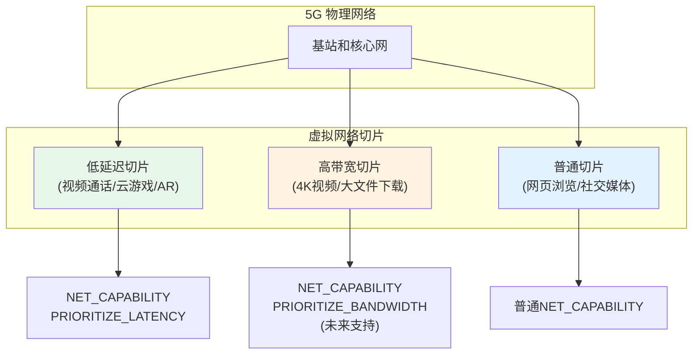
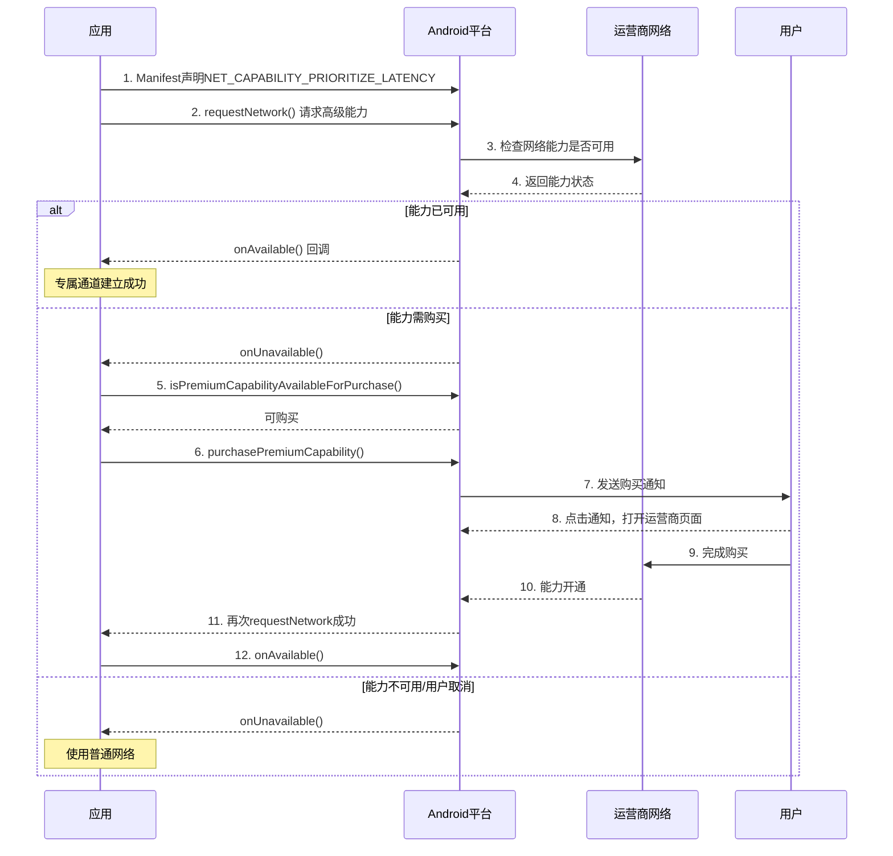

# 13.1.27 Use network slicing

夕阳把营地染成了橙红色的海洋。

洛芙坐在炊事帐旁边的小凳子上，手机靠在叠好的衣服堆上，屏幕里正在播放一部纪录片。画面里是一群企鹅在南极的冰原上蹒跚走动，旁白用低沉的嗓音讲述着它们的故事。

"奇怪……"洛芙皱了皱眉，"刚才那一段怎么有点卡？信号应该是满格啊。"

希尔从炊事帐里探出头来，围裙上还沾着一点面粉。"什么卡了？"

"视频，"洛芙把手机举起来晃了晃，"信号显示是满的，但播放到一半就卡一下。"

"让我看看，"希尔擦了擦手走过来，"嗯……你现在用的是5G网络？"

"对啊，5G信号满格。"

"问题可能就出在这里，"希尔在她旁边坐下，"你以为5G信号满格就代表网速飞快，但其实不是。5G网络上同时跑着很多应用——你的视频、别人的游戏、还有一些后台同步——大家都在抢同一条通道，所以你的视频会卡。"

"还有这种事？"洛芙有些惊讶，"那怎么办？"

"有办法，"希尔神秘地笑了笑，"可以让你的视频'插队'，走专属通道。"

"专属通道？"洛芙眨了眨眼睛。

"嗯，运营商可以专门为某类应用预留一部分网络资源，这就是5G的核心能力之一——网络切片，Network Slicing。"

"网络切片？"洛芙把视频暂停了，"我好像听说过这个词，但没有具体了解过。"

"我来给你讲讲，"希尔把手机接过来，打开了一个空白文档，准备画图，"首先，你要理解5G网络和4G网络的一个本质区别。"

她用手指在屏幕上画了起来：

"4G时代，所有应用都跑在同一个网络上。你发微信、刷视频、玩游戏，都是同一条'公路'上的不同车辆。这条公路是共享的，所以高峰期大家都会堵。"

"就像节假日的高速公路，"洛芙说。

"对，就是这个意思。但5G不一样，"希尔在图上画了几条不同的车道，"5G可以把你需要的服务'切'成一条专属车道。比如你的视频需要低延迟，运营商就给你预留一条专门处理视频的车道；比如云游戏需要高带宽，就给游戏留一条宽车道；普通浏览网页的就走普通车道。"

"这样就不会堵车了，"洛芙恍然大悟，"大家各走各的路。"

"对，这就是网络切片的核心思想，"希尔点头，"运营商通过网络切片技术，在同一张物理网络上，为不同的服务创建多个虚拟网络。每个虚拟网络都是独立的，有自己的带宽、延迟和可靠性保障。"

"那开发者怎么使用这个功能呢？"洛芙问道。

"这就是有意思的地方了，"希尔说，"Android 14开始，提供了标准的API让应用可以请求使用网络切片。"

她打开了一个代码示例：

```kotlin
// 首先，在AndroidManifest.xml中声明应用需要使用网络切片能力
// 需要在AndroidManifest中添加属性声明：
// <property
//     android:name="android.net.PROPERTY_SELF_CERTIFIED_NETWORK_CAPABILITIES"
//     android:resource="@xml/network_capabilities" />
```

"等等，"洛芙打断道，"你说要在Manifest里声明？这是什么意思？"

"意思是，你的应用需要提前告诉系统：'我可能需要网络切片服务'，"希尔解释道，"这就像你要进入一个高级场所，需要提前预约一样。如果你没有预约，直接冲进去，人家是不让你进的。"

"所以要提前声明，"洛芙点点头，"那这个声明要写在哪里？"

"在Manifest里加一个property标签，引用一个XML资源文件。"

希尔切换到了XML文件的代码：

```xml
<!-- res/xml/network_capabilities.xml -->
<network-capabilities-declaration xmlns:android="http://schemas.android.com/apk/res/android">
    <!-- 目前Android 14支持的唯一高级能力是 NET_CAPABILITY_PRIORITIZE_LATENCY -->
    <!-- 即低延迟优先 -->
    <uses-network-capability android:name="NET_CAPABILITY_PRIORITIZE_LATENCY"/>
</network-capabilities-declaration>
```

"目前只有一个能力？"洛芙问道。

"对，NET_CAPABILITY_PRIORITIZE_LATENCY，低延迟优先，"希尔说，"意思是你的应用需要网络延迟尽可能低。运营商会为这个需求预留专属资源，比如视频通话、实时游戏这类场景最需要这个。"

"那未来还会有更多能力吗？"

"肯定会有的，"希尔点头，"比如高带宽能力（NET_CAPABILITY_PRIORITIZE_BANDWIDTH）、低功耗能力等等。但目前Android 14只支持这一个。"

"明白了，"洛芙说，"那声明完之后呢？"

"接下来，你需要检查你的设备是否支持这个能力，以及是否可以使用它。"

希尔继续在代码里写：

```kotlin
import android.net.ConnectivityManager
import android.net.Network
import android.net.NetworkCapabilities
import android.net.NetworkCallback

class NetworkSlicingActivity : AppCompatActivity() {

    private lateinit var connectivityManager: ConnectivityManager
    private var premiumNetwork: Network? = null

    // 步骤1：请求高级网络能力
    private fun requestPremiumCapability() {
        connectivityManager = getSystemService(Context.CONNECTIVITY_SERVICE) as ConnectivityManager

        // 创建网络请求，添加高级能力
        val networkRequest = NetworkRequest.Builder()
            .addCapability(NetworkCapabilities.NET_CAPABILITY_PRIORITIZE_LATENCY)
            .build()

        // 请求网络
        connectivityManager.requestNetwork(
            networkRequest,
            object : NetworkCallback() {
                override fun onAvailable(network: Network) {
                    Log.d("NetworkSlicing", "高级能力网络已可用")
                    premiumNetwork = network
                    // 现在可以使用专属网络通道了
                }

                override fun onLost(network: Network) {
                    Log.d("NetworkSlicing", "高级能力网络已断开")
                    premiumNetwork = null
                    // 回退到普通网络
                }

                override fun onUnavailable() {
                    Log.d("NetworkSlicing", "高级能力网络不可用")
                }
            }
        )
    }
}
```

"这段代码是什么意思？"洛芙问道。

"首先，我们创建了一个NetworkRequest，这个请求里添加了NET_CAPABILITY_PRIORITIZE_LATENCY能力，"希尔指着屏幕说，"然后我们调用requestNetwork，系统会去找一个支持这个能力的网络。如果找到了，就回调onAvailable；如果没找到，就回调onUnavailable。"

"那如果我的设备根本不支持5G呢？"洛芙问道。

"好问题，"希尔说，"如果设备不支持5G，或者所在区域没有5G覆盖，那系统会直接回调onUnavailable。但如果5G网络存在，只是这个特定的能力需要付费呢？"

"需要付费？"洛芙瞪大了眼睛。

"对，这就是有意思的地方了，"希尔说，"有些网络切片能力，运营商是需要额外收费的。比如你想要低延迟专属通道，运营商可能会收一笔订阅费。如果你的设备还没有开通这个服务，系统会告诉你'这个能力可以购买'。"

"那怎么知道能不能购买呢？"

```kotlin
import android.telephony.TelephonyManager
import android.telephony.PremiumCapability

// 步骤2：检查高级能力是否可以购买
private fun checkPremiumCapabilityForPurchase() {
    val telephonyManager = getSystemService(Context.TELEPHONY_SERVICE) as TelephonyManager

    // 检查某个高级能力是否可购买
    val capability = PremiumCapability.PREMIUM_CAPABILITY_PRIORITIZE_LATENCY
    val isAvailableForPurchase = telephonyManager.isPremiumCapabilityAvailableForPurchase(capability)

    if (isAvailableForPurchase) {
        Log.d("NetworkSlicing", "该能力可购买，将引导用户购买")
    } else {
        Log.d("NetworkSlicing", "该能力不可购买")
    }
}
```

"这段代码调用了isPremiumCapabilityAvailableForPurchase，"希尔解释道，"它会返回一个布尔值，告诉你这个能力是否可以通过付费获得。"

"那如果可以购买，流程是什么样的？"洛芙问道。

```kotlin
// 步骤3：如果可购买，发起购买流程
private fun purchasePremiumCapability() {
    val telephonyManager = getSystemService(Context.TELEPHONY_SERVICE) as TelephonyManager

    telephonyManager.purchasePremiumCapability(
        PremiumCapability.PREMIUM_CAPABILITY_PRIORITIZE_LATENCY,
        Runnable {
            // 这里是回调
        },
        Consumer { result ->
            // 处理购买结果
            when (result) {
                TelephonyManager.PURCHASE_PREMIUM_CAPABILITY_RESULT_SUCCESS -> {
                    Log.d("NetworkSlicing", "购买成功，可以使用高级网络能力")
                }
                TelephonyManager.PURCHASE_PREMIUM_CAPABILITY_RESULT_ALREADY_PURCHASED -> {
                    Log.d("NetworkSlicing", "已购买该能力，直接使用即可")
                }
                TelephonyManager.PURCHASE_PREMIUM_CAPABILITY_RESULT_USER_CANCELED -> {
                    Log.d("NetworkSlicing", "用户取消了购买")
                }
                TelephonyManager.PURCHASE_PREMIUM_CAPABILITY_RESULT_CARRIER_DISABLED -> {
                    Log.d("NetworkSlicing", "运营商未启用该服务")
                }
                else -> {
                    Log.d("NetworkSlicing", "购买失败: $result")
                }
            }
        }
    )
}
```

"调用purchasePremiumCapability后，系统会弹出一个通知，"希尔说，"告诉用户'有性能提升选项可用，来自您的运营商'。用户点击通知后，系统会打开运营商的网页，让用户完成购买流程。"

"好智能，"洛芙感叹道，"直接在系统层面引导用户，而不是让用户自己去运营商那里找。"

"这就是Android 14引入的'upsell flow'，"希尔说，"翻译过来就是'追加销售流程'。App不需要自己对接运营商的支付系统，只需要调用系统API，剩下的事情都由Android平台来处理。"

"那购买成功后呢？"

"购买成功后，你的App再次调用requestNetwork请求NET_CAPABILITY_PRIORITIZE_LATENCY，系统就会把这条专属通道分配给你，你的应用就能享受低延迟的网络服务了。"

黛琳不知什么时候走了过来，手里端着一杯热气腾腾的茶。她看了看希尔和洛芙的手机屏幕，好奇地问道："你们在研究什么？"

"5G网络切片，"希尔说，"洛芙想知道怎么让视频播放不卡。"

"哦，这个我知道，"黛琳把茶杯放在旁边的小桌上，"其实在我们露营的场景里，网络切片也有用的。"

"怎么说？"洛芙问道。

"想象一下，如果我们在野外做实时直播，"黛琳说，"视频需要非常低的延迟，否则观众看到的画面就会和实际差很多。但如果同时还有人在下载地图数据，那视频就会被挤占带宽，导致延迟增加。"

"所以需要给直播分配一个专属切片，"洛芙说。

"对，"黛琳点点头，"或者另一种场景——我们在用AR眼镜做实时的动植物识别。AR需要把摄像头捕捉的画面上传到云端，然后云端返回识别结果，这个过程也需要非常低的延迟。如果延迟高了，AR画面就会飘，体验很差。"

"AR识别，"希尔说，"这确实是一个很需要低延迟的场景。还有云游戏——在5G手机上玩云游戏，需要把操作指令上传到服务器，服务器处理后再把画面传回来，这个往返延迟必须很低，否则游戏就会卡顿。"

"所以网络切片最适合这三类应用，"黛琳说，"视频通话或直播、实时云游戏、AR或VR应用。"

希尔在白板上画出了一个表格：

"不同的应用需要不同类型的网络切片能力："

"低延迟优先——NET_CAPABILITY_PRIORITIZE_LATENCY，适合实时视频通话、直播、云游戏、AR/VR"
"高带宽优先——未来可能支持，适合4K/8K视频、云游戏大文件更新"
"低功耗优先——未来可能支持，适合IoT设备、传感器数据传输"

"那我现在应该怎么用呢？"洛芙问道。

"对于你现在的视频播放场景，"希尔说，"可以考虑请求低延迟能力。运营商会优先保障你的视频数据包的传输，减少卡顿。"

"但问题是……"希尔又想了想，"其实普通的视频播放App，不一定需要用网络切片。因为视频播放本身就是有缓冲的，就算网络偶尔抖动，播放器也可以用缓冲区来弥补。"

"那什么情况下才需要切片呢？"洛芙问道。

"实时性要求非常高的场景，"希尔说，"比如视频通话，延迟超过几百毫秒就会感觉对方反应很慢；比如云游戏，任何卡顿都会直接影响游戏操作；比如直播带货，主播和观众的互动如果延迟很高，体验就很差。"

"明白了，"洛芙点点头，"不是所有应用都需要，但特定场景很需要。"

"对，"黛琳说，"而且从开发者的角度来说，使用网络切片API本身也有一些注意事项。"

她在白板上补充了几点：

"第一，你的App必须有READ_BASIC_PHONE_STATE权限才能调用purchasePremiumCapability。"

"第二，购买流程是可选的——如果用户拒绝购买，App应该能优雅地回退到普通网络，而不是直接崩溃。"

"第三，网络切片不是保证，只是优先——就算你申请了低延迟切片，也不代表网络永远不会卡，只是运营商会尽量保障。"

"第四，切片能力需要在有5G覆盖的环境下才能工作，4G/LTE网络不支持。"

"这些注意事项很重要，"希尔说，"开发时要考虑周全。"

洛芙重新拿起手机，打开了视频软件。"那我现在的视频卡顿，可能不是网络切片的问题，而是服务器端的问题，或者是视频本身的问题。"

"也有可能是网络拥塞，"黛琳说，"但5G网络切片确实是一个解决方案。如果运营商提供了这个服务，而且你的应用真的需要低延迟，那就可以集成这个API。"

"那我以后做直播App的时候，一定要记得这个技术，"洛芙认真地说。

"是呀，"希尔站起身，"好了，晚饭快好了吧？先去吃饭吧。"

洛芙把手机收进口袋，跟着希尔和黛琳向炊事帐走去。夕阳已经完全落下了山，天空变成了深蓝色，最亮的星星开始出现。远处传来伊莎的声音："开饭啦！"

营地里的灯亮了起来，橙黄色的光芒从炊事帐里透出来，像是黑暗中一个小小的温暖岛屿。

洛芙低头看了看手机，5G信号依然是满格。她想：原来信号满格不代表一切，底层的网络资源分配方式，才真正决定了我的使用体验。下次遇到视频卡顿，她会想起今天学的网络切片——那些橙红色夕阳下的代码和图示，还有希尔那句"可以给你的视频开专属通道"。

---

## 专业技术总结

> **5G Network Slicing（网络切片）** — 5G网络的核心能力之一，允许运营商在同一张物理网络上创建多个虚拟网络（切片），每个切片为特定场景提供专属的网络资源保障。开发者通过Android 14+提供的标准API（requestNetwork + purchasePremiumCapability）可以请求使用低延迟优先（NET_CAPABILITY_PRIORITIZE_LATENCY）等高级网络能力。

#### 结构图

**网络切片工作原理（示意图）：**



**网络切片请求流程（时序图）：**



**TelephonyManager 与 NetworkCapabilities 映射：**

| TelephonyManager 常量 | NetworkCapabilities 常量 | 用途 |
|---|---|---|
| PREMIUM_CAPABILITY_PRIORITIZE_LATENCY | NET_CAPABILITY_PRIORITIZE_LATENCY | 低延迟优先 |

#### 复杂度与影响

| 维度 | 影响 |
|------|------|
| **使用场景** | 视频通话、直播、云游戏、AR/VR等实时性要求高的应用 |
| **兼容性** | Android 14+、5G网络环境、运营商支持 |
| **用户授权** | 高级能力可能需要用户通过运营商付费订阅 |
| **开发复杂度** | 需要处理能力不可用和购买失败的降级场景 |

#### 反模式与陷阱

1. **未在Manifest中声明能力就调用requestNetwork**
   - 修复：必须在AndroidManifest.xml中添加PROPERTY_SELF_CERTIFIED_NETWORK_CAPABILITIES属性声明

2. **不处理能力不可用的情况**
   - 修复：实现onUnavailable回调，确保App能在普通网络上继续工作

3. **购买失败后App直接崩溃**
   - 修复：处理各种PURCHASE_PREMIUM_CAPABILITY_RESULT_*错误码，提供优雅降级

4. **假设所有5G网络都支持切片**
   - 修复：网络切片需要运营商单独配置，不是所有5G网络都支持；使用前必须检查能力可用性

5. **在4G/LTE网络环境下请求切片**
   - 修复：切片是5G特性，4G网络下永远返回不可用；应检测网络类型再决定是否请求

#### 名词小传

**Network Slicing（网络切片）** — 5G核心能力，在同一物理网络上创建多个虚拟网络，为不同应用提供差异化网络服务。是5G区别于4G的关键技术之一。

**NET_CAPABILITY_PRIORITIZE_LATENCY** — Android 14中支持的唯一高级网络能力，代表低延迟优先。申请后运营商会优先保障该应用的网络延迟。

**NetworkRequest** — Android网络框架API，用于向系统请求特定能力的网络。搭配NetworkCallback获取网络状态变化。

**purchasePremiumCapability()** — Android 14引入的API，用于发起高级网络能力的购买流程。内部会触发系统通知，引导用户到运营商页面完成订阅。

**isPremiumCapabilityAvailableForPurchase()** — 检查某个高级网络能力是否可以通过付费获得。不是所有运营商都支持此功能。

**PROPERTY_SELF_CERTIFIED_NETWORK_CAPABILITIES** — Manifest属性，声明应用可能需要使用的网络切片能力。必须声明后才能调用相关API。

**Upsell Flow（追加销售流程）** — Android 14引入的系统级购买引导流程，App调用API后系统自动展示通知，用户点击后打开运营商页面完成付费，无需App自己对接支付系统。

#### 设计哲学

**1. 用户授权优先**
网络切片可能涉及额外费用，Android要求通过系统级的upsell flow让用户明确授权。这确保用户了解自己在为什么付费，而不是App在后台偷偷扣费。

**2. 优雅降级原则**
切片能力是"锦上添花"而非"必须"。App应在切片不可用时能优雅降级到普通网络，而不是直接崩溃或功能不可用。实时性要求不高的场景，4G已经足够。

**3. 运营商中立的分层架构**
Android定义了一套统一的API（requestNetwork、purchasePremiumCapability），但具体的切片策略、定价、可用性都由运营商决定。这种架构让App开发一次就能对接所有运营商，而运营商可以独立运营自己的服务。

**4. 安全与隐私**
购买流程通过系统通知和运营商WebView完成，App无法获取用户的支付信息。平台扮演中间人角色，保护用户隐私的同时简化了开发流程。

#### 🏕️ 动手练习

**方式B：独立练习制**


**练习 1：在Manifest中声明网络切片能力 ★**

**目标：** 学习如何在AndroidManifest中正确声明应用需要使用网络切片能力

**你需要做的事：**
1. 创建res/xml目录（如果不存在）
2. 创建network_capabilities.xml资源文件，声明NET_CAPABILITY_PRIORITIZE_LATENCY
3. 在AndroidManifest的根标签或application标签中添加property声明
4. 验证声明是否正确

**验收标准：**
- [ ] network_capabilities.xml文件包含uses-network-capability标签
- [ ] AndroidManifest.xml包含android.net.PROPERTY_SELF_CERTIFIED_NETWORK_CAPABILITIES的property声明
- [ ] property正确引用了network_capabilities.xml资源

**提示代码：**
```xml
<!-- res/xml/network_capabilities.xml -->
<network-capabilities-declaration xmlns:android="http://schemas.android.com/apk/res/android">
    <uses-network-capability android:name="NET_CAPABILITY_PRIORITIZE_LATENCY"/>
</network-capabilities-declaration>
```


**练习 2：实现网络请求并监听切片可用状态 ★★**

**目标：** 学习如何使用ConnectivityManager和NetworkCallback请求和监听网络切片

**你需要做的事：**
1. 获取ConnectivityManager实例
2. 创建NetworkRequest，添加NET_CAPABILITY_PRIORITIZE_LATENCY能力
3. 实现NetworkCallback处理onAvailable、onUnavailable、onLost
4. 调用requestNetwork发起请求
5. 在Activity销毁时调用unregisterNetworkCallback释放资源

**验收标准：**
- [ ] 能正确创建包含高级能力的NetworkRequest
- [ ] onAvailable时能正确接收Network对象
- [ ] onUnavailable时能正确降级到普通网络
- [ ] 正确管理NetworkCallback的生命周期

**提示代码：**
```kotlin
private val networkCallback = object : NetworkCallback() {
    override fun onAvailable(network: Network) {
        Log.d("NetworkSlicing", "高级能力网络可用")
        premiumNetwork = network
    }

    override fun onUnavailable() {
        Log.d("NetworkSlicing", "高级能力不可用，使用普通网络")
    }

    override fun onLost(network: Network) {
        Log.d("NetworkSlicing", "网络已断开")
        premiumNetwork = null
    }
}

connectivityManager.requestNetwork(networkRequest, networkCallback)
```


**练习 3：实现高级能力购买检查 ★★★**

**目标：** 学习如何使用TelephonyManager检查和购买高级网络能力

**你需要做的事：**
1. 获取TelephonyManager实例
2. 调用isPremiumCapabilityAvailableForPurchase()检查能力是否可购买
3. 实现purchasePremiumCapability()的完整回调处理
4. 处理各种PURCHASE_PREMIUM_CAPABILITY_RESULT_*结果码
5. 在购买失败时实现优雅降级

**验收标准：**
- [ ] 正确检查能力是否可购买
- [ ] 购买成功后能收到SUCCESS或ALREADY_PURCHASED回调
- [ ] 用户取消时能正确处理
- [ ] 购买失败时能优雅降级到普通网络

**提示代码：**
```kotlin
// 检查是否可购买
val tm = getSystemService(Context.TELEPHONY_SERVICE) as TelephonyManager
val available = tm.isPremiumCapabilityAvailableForPurchase(
    PremiumCapability.PREMIUM_CAPABILITY_PRIORITIZE_LATENCY
)

// 发起购买
tm.purchasePremiumCapability(
    PremiumCapability.PREMIUM_CAPABILITY_PRIORITIZE_LATENCY,
    Runnable { /* 前置检查通过 */ },
    Consumer { result ->
        when (result) {
            TelephonyManager.PURCHASE_PREMIUM_CAPABILITY_RESULT_SUCCESS,
            TelephonyManager.PURCHASE_PREMIUM_CAPABILITY_RESULT_ALREADY_PURCHASED -> {
                // 可以继续使用高级能力
            }
            else -> {
                // 降级到普通网络
            }
        }
    }
)
```


**练习 4：区分5G切片与4G网络 ★★**

**目标：** 学习如何检测当前网络类型，避免在非5G环境下无效请求

**你需要做的事：**
1. 使用ConnectivityManager获取当前活动的Network
2. 使用NetworkCapabilities检测网络类型
3. 在非5G环境下给出友好提示
4. 只在5G环境下才发起切片请求

**验收标准：**
- [ ] 能正确检测当前网络类型（5G/4G/3G/Wi-Fi）
- [ ] 在4G环境下不会发起无效的切片请求
- [ ] 在Wi-Fi环境下提示用户当前不需要切片

**提示代码：**
```kotlin
private fun is5GNetwork(): Boolean {
    val network = connectivityManager.activeNetwork ?: return false
    val capabilities = connectivityManager.getNetworkCapabilities(network) ?: return false
    return capabilities.hasTransport(NetworkCapabilities.TRANSPORT_CELLULAR) &&
           capabilities.linkDownstreamBandwidthKbps > 100000  // 简单判断是否为5G级别带宽
}
```


**练习 5：实现完整的切片App Demo ★★★**

**目标：** 综合练习创建一个完整的网络切片演示App

**你需要做的事：**
1. 设计一个界面，显示当前网络状态和切片能力状态
2. 实现Manifest声明
3. 实现requestNetwork流程
4. 实现购买检查和购买流程
5. 实现Ping测试，对比普通网络和切片网络的延迟差异
6. 完整处理所有错误场景

**验收标准：**
- [ ] UI能实时显示网络类型和延迟
- [ ] 能正确发起切片请求并显示结果
- [ ] 能引导用户完成购买流程
- [ ] 错误场景有友好提示
- [ ] Demo可正常运行

**提示代码：**
```kotlin
// 延迟测试示例
private fun measureLatency(network: Network): Long {
    val startTime = System.currentTimeMillis()
    try {
        val connection = network.openConnection(URL("https://www.google.com").toURI().toURL())
        connection.connectTimeout = 5000
        connection.getInputStream().use { it.readBytes() }
        return System.currentTimeMillis() - startTime
    } catch (e: Exception) {
        return -1
    }
}
```


**面试热身（开放式问题）**

1. **请解释什么是5G网络切片，以及它和4G网络的本质区别是什么？**

2. **在Android 14上，应用如何使用网络切片API？请描述完整的工作流程。**

3. **为什么要先在AndroidManifest中声明网络切片能力？声明和不声明有什么区别？**

4. **网络切片的购买流程（upsell flow）是如何工作的？App如何处理用户拒绝购买的情况？**

5. **哪些应用场景最适合使用网络切片？普通视频播放App是否需要使用网络切片？**


#### 参考实现要点

1. **必须先声明才能使用**：PROPERTY_SELF_CERTIFIED_NETWORK_CAPABILITIES声明是调用切片API的前置条件

2. **处理不可用是常态**：切片能力取决于运营商配置，大多数情况下可能是不可用的，App必须能优雅降级

3. **购买流程是可选的**：只有当isPremiumCapabilityAvailableForPurchase返回true时，才需要引导用户购买

4. **生命周期管理**：requestNetwork返回的NetworkCallback必须在不需要时通过unregisterNetworkCallback注销

5. **检查网络类型再请求**：切片只对5G网络有效，4G/LTE环境下请求注定失败

---

> 学习建议

把网络切片想象成一个"演唱会VIP通道"。普通观众只能走普通入口，人多拥挤；而VIP观众有专属通道，人少速度快，可以更快到达座位——但VIP通道需要额外付费才能开通。运营商就是那个决定是否开放VIP通道的管理方，而Android的API就是那个帮你预约和开通VIP通道的工具。记住：不是所有演出都有VIP通道（取决于运营商是否支持），而且VIP通道也收费（用户授权原则）。普通观众没有VIP通道也能看完演唱会，只是体验稍差——这就是为什么"优雅降级"是网络切片设计的核心哲学。

## 洛芙的小小日记本

今天学到了5G网络切片！原来5G不只是速度更快，还可以给特定应用开"专属通道"。黛琳说的那个比喻很形象——就像演唱会VIP通道，有专属通道的人可以更快到达座位。需要提前预约（Manifest声明），有些还需要额外付费（运营商订阅）。看来技术越强大，背后的资源分配就越复杂。下次做直播App的时候，一定要记得这个知识点！

## 今日关键词

**Network Slicing（网络切片）** — 5G核心技术，在同一物理网络上创建多个虚拟网络，为不同场景提供差异化网络服务，如低延迟或高带宽专属通道。

**NET_CAPABILITY_PRIORITIZE_LATENCY** — Android 14支持的唯一高级网络切片能力，代表低延迟优先，运营商会为申请此能力的应用优先保障网络延迟。

**NetworkRequest** — Android网络框架API，通过addCapability()添加网络能力请求，配合ConnectivityManager.requestNetwork()使用。

**NetworkCallback** — 网络状态变化回调接口，onAvailable/onUnavailable/onLost分别处理网络可用、不可用、断开等情况。

**purchasePremiumCapability()** — Android 14引入的高级能力购买API，通过系统upsell flow引导用户完成运营商付费订阅。

**isPremiumCapabilityAvailableForPurchase()** — 检查高级网络能力是否可以通过付费获得，返回true表示运营商支持该能力的付费开通。

**PROPERTY_SELF_CERTIFIED_NETNET_CAPABILITIES** — Manifest属性标签名，用于声明应用可能需要的网络切片能力，必须先声明才能调用相关API。

**PremiumCapability** — 枚举类，定义Android支持的高级能力常量，如PREMIUM_CAPABILITY_PRIORITIZE_LATENCY。

**Upsell Flow（追加销售流程）** — Android 14引入的系统级购买引导，通过通知+运营商WebView完成付费，无需App自己对接支付。

**PURCHASE_PREMIUM_CAPABILITY_RESULT_** — 购买结果的错误码前缀，包括SUCCESS、ALREADY_PURCHASED、USER_CANCELED、CARRIER_DISABLED等多种情况。

**5G网络特性** — 相比4G，5G不仅带宽更高，还支持网络切片、边缘计算等新能力，是差异化服务的物理基础。

**优雅降级** — 当高级能力（如网络切片）不可用时，App应能继续使用普通网络功能，而不是直接失败，这是负责任的开发原则。

**TRANSPORT_CELLULAR** — NetworkCapabilities中的传输类型常量，代表蜂窝（移动数据）网络，5G/4G/3G都属于此类型。
