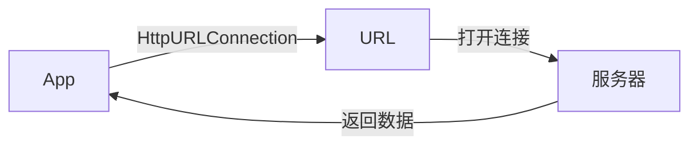
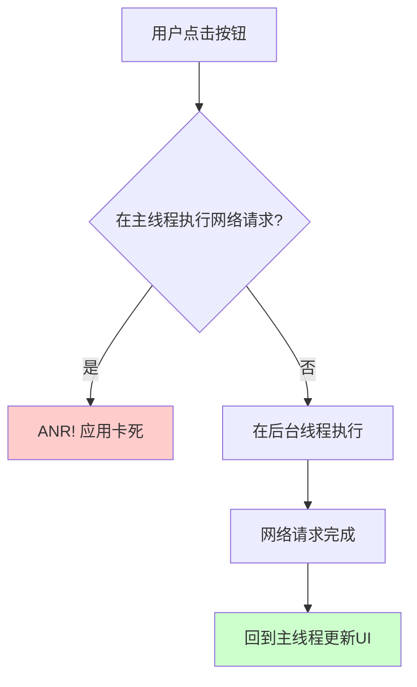
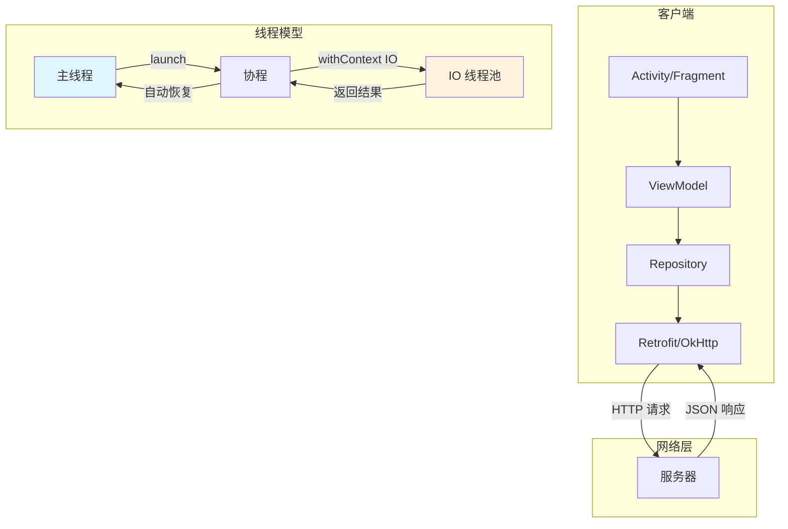

# 13.1.3 连接到网络

十一月初的山里，已经有了初冬的寒意。

洛芙把围巾往上拉了拉，呼出的气息在清晨的空气中变成一团白色的雾。她蜷缩在折叠椅上，身前摊着一台笔记本电脑，屏幕上是一片代码的海洋。

“黛琳姐姐……”洛芙托着腮帮子，眼神有些涣散，“我想做一个功能，让应用去服务器上获取露营地的信息。可是我不知道怎么做网络请求诶。”

黛琳正在整理她的白板笔，听到这话抬起头来。阳光从帐篷帘子的缝隙里漏进来，在她的侧脸上投下一道柔和的光痕。

“网络请求啊，”黛琳把白板笔放好，“这是个很基础但也很重要的话题。伊莎，你怎么看？”

伊莎正靠在一旁的树干上，手里把玩着一片枯黄的叶子。听到黛琳的话，她抬起眼，嘴角浮起一丝轻快的笑意。

“你想象一下，”伊莎的声音像她的名字一样温柔，“就像我们在山里要给远方的朋友寄一张明信片——你需要知道朋友的地址（URL），选择一种交通方式（HTTP 客户端），而且不能在朋友正在吃饭的时候突然闯进去（要在后台线程执行）。就是这样简单。”

“哇……”洛芙眨眨眼，“好像没有那么难诶！”

希尔从帐篷里探出头来，头发睡得乱糟糟的，手里还拿着一袋饼干。“在说网络请求吗？我也要参与！”她几步跳到大家身边，饼干袋子沙沙作响，“洛芙，我跟你说，这个我最熟了。走，我们去那边树下，我现场给你写代码看！”

---

## 1. 选择你的 HTTP 客户端

希尔带着大家在一棵老松下坐下。她从背包里掏出笔记本电脑，啪的一声打开。

“首先呢，”希尔敲了敲键盘，“我们需要一个发送 HTTP 请求的工具。在 Android 里，有两种主要选择——”

她抬起头，像老师一样竖起一根手指。

“第一种是 **HttpURLConnection**，这是 Java 标准库自带的，不需要额外添加依赖，就像背包里自带的水壶，随时能用。”

黛琳在白板上画了一个简单的示意图。



“第二种是 **OkHttp**，”希尔继续说，“这是.square 公司开发的第三方库，功能更强大，支持连接池、自动重试、拦截器等等，就像一个专业的快递公司，不仅帮你送信，还能跟踪物流、处理异常。”

伊莎捡起一根小树枝，在地上画了一个更大的圆圈。

“你想象一下，HttpURLConnection 就像是你自己骑着自行车去送信，而 OkHttp 就像是雇了一个专业的快递员。自行车随时可用，但如果你要寄很多信、处理各种复杂情况，快递员会更省心。”

洛芙点点头：“那……我们应该用哪一个呢？”

黛琳接过话来：“对于简单的请求，两者都可以。但 OkHttp 的 API 更现代，使用起来更方便，而且和 Retrofit（一个更高级的网络库）配合得很好。我们推荐在实际项目中使用 OkHttp。”

希尔打开一个代码文件：“来，我给你看一个用 OkHttp 发送 GET 请求的例子——”

```kotlin
// 导入 OkHttp 依赖
// implementation("com.squareup.okhttp3:okhttp:4.12.0")

// 创建 OkHttpClient 实例
val client = OkHttpClient()

// 创建请求对象
val request = Request.Builder()
    .url("https://api.example.com/campgrounds")
    .build()

// 发送请求并获取响应
val response = client.newCall(request).execute()

// 检查响应是否成功
if (response.isSuccessful) {
    val body = response.body?.string()
    println("收到的数据: $body")
} else {
    println("请求失败: ${response.code}")
}
```

洛芙凑近屏幕：“哇，看起来好简单！就这几行代码就能拿到数据？”

“对，”希尔 grins，“不过我要特别提醒你——”

她的表情变得认真起来。

**“这段代码绝对不能在主线程上运行！”**

---

## 2. 为什么要在后台线程执行网络操作

洛芙歪着头：“为什么呀？”

黛琳指了指天：“你想象一下，如果我们在一辆正在行驶的汽车里打电话，汽车就会变慢，对不对？”

“Android 也是一样，”伊莎补充道，“主线程就像汽车司机，要负责处理用户的点击、滑动、界面更新等所有操作。如果你在主线程上做一个网络请求，就像让司机同时打电话——汽车就会停下来，用户会觉得应用卡住了，甚至可能出现 ANR（Application Not Responding）。”

洛芙脸色变了变：“哇，那么严重！”

“所以，”黛琳的声音变得温和但坚定，“所有的网络操作都必须在后台线程执行。Android 提供了很多方法来实现这一点——”

她翻开白板的另一页。



“传统的方式有 **Thread**、**AsyncTask**、**Handler** 和 **ExecutorService**，”黛琳如数家珍，“但现在，最推荐的方式是 **Kotlin 协程**。”

---

## 3. Kotlin 协程：让异步编程变得优雅

“协程？”洛芙歪着头，“又是协程……感觉最近到处都在说这个诶！”

希尔笑着拍了拍她的肩膀：“因为它真的很好用！你想象一下——”

她想了想：“如果说 Thread 像是换一辆车（需要切换上下文，有开销），那协程就像是换一首歌（同一个车里，只是切换了播放的内容，无开销）。”

伊莎的作用吟诗般的声音：“协程就像风的流动——你不需要大喊'让开我要跑过去'，风自然会绕过障碍，滑向它想去的地方。”

洛芙噗嗤笑了出来：“伊莎姐姐的比喻还是这么美……”

“好啦好啦，”希尔把键盘转过来，“我直接给你看代码。用协程来发送网络请求，是这样的——”

```kotlin
// 需要在 build.gradle 添加依赖
// implementation("org.jetbrains.kotlinx:kotlinx-coroutines-android:1.7.3")

import kotlinx.coroutines.Dispatchers
import kotlinx.coroutines.launch
import kotlinx.coroutines.withContext

class CampgroundRepository {
    
    private val client = OkHttpClient()
    
    // 在 ViewModel 或 Activity 中调用这个函数
    fun fetchCampgrounds(onResult: (List<Campground>) -> Unit) {
        // 用 launch 创建一个协程
        viewModelScope.launch {
            try {
                // withContext(Dispatchers.IO) 切换到 IO 线程池
                // 这里执行网络请求
                val campgrounds = withContext(Dispatchers.IO) {
                    fetchFromNetwork()
                }
                // 网络请求完成后，自动回到主线程
                onResult(campgrounds)
            } catch (e: Exception) {
                println("获取数据失败: ${e.message}")
            }
        }
    }
    
    // 实际的网络请求逻辑（运行在 IO 线程）
    private fun fetchFromNetwork(): List<Campground> {
        val request = Request.Builder()
            .url("https://api.example.com/campgrounds")
            .build()
        
        return client.newCall(request).execute().use { response ->
            if (response.isSuccessful) {
                // 解析 JSON 响应（这里用简单的模拟数据）
                parseCampgrounds(response.body?.string() ?: "[]")
            } else {
                emptyList()
            }
        }
    }
    
    // 模拟解析函数
    private fun parseCampgrounds(json: String): List<Campground> {
        // 实际项目中这里会用 Gson/Moshi 解析 JSON
        return listOf(
            Campground("富士山露营地", "日本山梨县"),
            Campground("优胜美地", "美国加利福尼亚"),
            Campground("班夫国家公园", "加拿大阿尔伯塔")
        )
    }
}

// 数据类
data class Campground(val name: String, val location: String)
```

洛芙盯着屏幕看了半天：“这个……看起来比刚才的复杂了一点诶？”

“没关系，”黛琳温柔地说，“我们慢慢拆解。关键就是三点——”

她竖起三根手指。

“第一，用 `viewModelScope.launch` 启动一个协程；第二，用 `withContext(Dispatchers.IO)` 把耗时的网络操作放到 IO 线程；第三，操作完成后，协程会自动回到主线程，你可以在 `onResult` 回调里更新 UI。”

---

## 4. 使用 Retrofit：更高级的网络请求方式

伊莎忽然开口：“如果说 OkHttp 是专业的快递员，那 **Retrofit** 就是——”

她想了想：“一个帮你写好了所有寄信格式的秘书。你只需要告诉她'我要寄信'，她会帮你填好信封、贴好邮票、选好快递公司。”

黛琳点点头：“没错。Retrofit 是基于 OkHttp 的更高级封装，它可以把 HTTP 接口直接定义成 Kotlin 函数，用起来更直观。”

希尔眼睛亮了：“这个我会！”她噼里啪啦敲出一段代码：

```kotlin
// 添加依赖
// implementation("com.squareup.retrofit2:retrofit:2.9.0")
// implementation("com.squareup.retrofit2:converter-gson:2.9.0")

import retrofit2.http.GET

// 定义 API 接口
interface CampgroundApi {
    
    @GET("campgrounds")
    suspend fun getCampgrounds(): List<CampgroundDto>
    
    @GET("campgrounds/{id}")
    suspend fun getCampgroundDetail(@retrofit2.http.Path("id") id: String): CampgroundDto
}

// 数据类（对应服务器返回的 JSON）
data class CampgroundDto(
    val id: String,
    val name: String,
    val location: String,
    val facilities: List<String>
)

// 创建 Retrofit 实例
object RetrofitClient {
    
    private val retrofit = Retrofit.Builder()
        .baseUrl("https://api.example.com/")  // 注意：URL 必须以 / 结尾
        .addConverterFactory(GsonConverterFactory.create())
        .build()
    
    val api: CampgroundApi = retrofit.create(CampgroundApi::class.java)
}

// 在 ViewModel 中使用
class CampgroundViewModel : ViewModel() {
    
    private val _campgrounds = MutableLiveData<List<Campground>>()
    val campgrounds: LiveData<List<Campground>> = _campgrounds
    
    fun loadCampgrounds() {
        viewModelScope.launch {
            try {
                val result = RetrofitClient.api.getCampgrounds()
                _campgrounds.value = result.map { it.toCampground() }
            } catch (e: Exception) {
                println("加载失败: ${e.message}")
            }
        }
    }
    
    private fun CampgroundDto.toCampground() = Campground(name, location)
}
```

洛芙看得眼睛都直了：“这……这也太方便了吧！只要定义一个接口，就能直接调用？”

“对，”黛琳说，“Retrofit 会自动处理请求和响应的序列化，你只需要定义数据模型和请求参数就可以了。”

“但是，”希尔补充道，“别忘了在 AndroidManifest.xml 里添加网络权限哦——”

```xml
<!-- AndroidManifest.xml -->
<manifest xmlns:android="http://schemas.android.com/apk/res/android">
    
    <!-- 添加网络权限 -->
    <uses-permission android:name="android.permission.INTERNET" />
    <uses-permission android:name="android.permission.ACCESS_NETWORK_STATE" />
    
    <application
        ... >
        ...
    </application>
</manifest>
```

---

## 5. 错误处理与最佳实践

伊莎忽然收起了笑容，声音变得轻柔但认真：“网络请求可不像寄明信片那么简单。有时候信会寄丢（请求失败），有时候地址错了（404），有时候信太慢了（超时）……”

“所以我们要有完善的错误处理，”黛琳接过话来，“来看看一个更好的例子——”

```kotlin
sealed class NetworkResult<out T> {
    data class Success<T>(val data: T) : NetworkResult<T>()
    data class Error(val message: String, val code: Int? = null) : NetworkResult<Nothing>()
    object Loading : NetworkResult<Nothing>()
}

class CampgroundRepositoryV2 {
    
    private val client = OkHttpClient.Builder()
        .connectTimeout(30, TimeUnit.SECONDS)   // 连接超时
        .readTimeout(30, TimeUnit.SECONDS)      // 读取超时
        .writeTimeout(30, TimeUnit.SECONDS)     // 写入超时
        .retryOnConnectionFailure(true)          // 自动重试
        .build()
    
    suspend fun getCampgrounds(): NetworkResult<List<Campground>> {
        return withContext(Dispatchers.IO) {
            try {
                val request = Request.Builder()
                    .url("https://api.example.com/campgrounds")
                    .build()
                
                val response = client.newCall(request).execute()
                
                if (response.isSuccessful) {
                    val body = response.body?.string()
                    if (body != null) {
                        NetworkResult.Success(parseCampgrounds(body))
                    } else {
                        NetworkResult.Error("响应体为空", response.code)
                    }
                } else {
                    NetworkResult.Error("请求失败: ${response.message}", response.code)
                }
            } catch (e: SocketTimeoutException) {
                NetworkResult.Error("网络超时，请检查网络连接")
            } catch (e: UnknownHostException) {
                NetworkResult.Error("无法连接到服务器")
            } catch (e: Exception) {
                NetworkResult.Error("未知错误: ${e.message}")
            }
        }
    }
}
```

“这段代码看起来好复杂……”洛芙缩了缩脖子。

“但它很重要，”黛琳认真地说，“你要考虑各种可能的错误情况，给用户友好的提示，而不是让应用直接崩溃。”

希尔补充道：“还有几个最佳实践要记住——”

```kotlin
// 1. 永远不要在主线程做网络请求
// ❌ 错误示例（不要这样做！）
fun badExample() {
    val response = client.newCall(request).execute() // 会阻塞主线程！
}

// 2. 使用的生命周期感知的方式取消请求
// ✓ 正确示例
class MyViewModel : ViewModel() {
    
    private val scope = CoroutineScope(Dispatchers.Main + SupervisorJob())
    
    fun loadData() {
        scope.launch {
            val result = withContext(Dispatchers.IO) {
                api.getData()
            }
            // 更新 UI
        }
    }
    
    // ViewModel 销毁时取消所有协程
    override fun onCleared() {
        super.onCleared()
        scope.cancel()
    }
}

// 3. 使用 viewModelScope 自动绑定生命周期
class BetterViewModel : ViewModel() {
    
    fun loadData() {
        viewModelScope.launch {
            val result = RetrofitClient.api.getCampgrounds()
            _data.value = result
        }
        // ViewModel 销毁时，viewModelScope 会自动取消
    }
}
```

---

## 6. 完整的示例：露营地信息获取

最后，希尔把所有的内容整合在一起，展示了一个完整的示例。

“来，洛芙，看一个从头到尾的完整流程——”

```kotlin
// === 完整的露营地查询功能 ===

// 1. 定义 API 接口
interface CampgroundApi {
    @GET("campgrounds")
    suspend fun getCampgrounds(): List<CampgroundDto>
    
    @GET("campgrounds/{id}")
    suspend fun getCampgroundDetail(@Path("id") id: String): CampgroundDto
}

// 2. 配置 Retrofit
object ApiClient {
    private val loggingInterceptor = HttpLoggingInterceptor().apply {
        level = HttpLoggingInterceptor.Level.BODY
    }
    
    val retrofit = Retrofit.Builder()
        .baseUrl("https://api.campground.example.com/")
        .client(OkHttpClient.Builder()
            .addInterceptor(loggingInterceptor)  // 日志拦截器
            .connectTimeout(30, TimeUnit.SECONDS)
            .build())
        .addConverterFactory(GsonConverterFactory.create())
        .build()
    
    val api: CampgroundApi = retrofit.create(CampgroundApi::class.java)
}

// 3. Repository 层
class CampgroundRepository {
    
    suspend fun getCampgrounds(): Result<List<Campground>> {
        return try {
            val response = ApiClient.api.getCampgrounds()
            Result.success(response.map { it.toDomain() })
        } catch (e: Exception) {
            Result.failure(e)
        }
    }
    
    private fun CampgroundDto.toDomain() = Campground(
        id = id,
        name = name,
        location = location,
        facilities = facilities
    )
}

// 4. ViewModel 层
class CampgroundViewModel(
    private val repository: CampgroundRepository = CampgroundRepository()
) : ViewModel() {
    
    private val _uiState = MutableStateFlow<CampgroundUiState>(CampgroundUiState.Loading)
    val uiState: StateFlow<CampgroundUiState> = _uiState
    
    init {
        loadCampgrounds()
    }
    
    fun loadCampgrounds() {
        viewModelScope.launch {
            _uiState.value = CampgroundUiState.Loading
            
            repository.getCampgrounds()
                .onSuccess { campgrounds ->
                    _uiState.value = CampgroundUiState.Success(campgrounds)
                }
                .onFailure { error ->
                    _uiState.value = CampgroundUiState.Error(
                        error.message ?: "加载失败"
                    )
                }
        }
    }
}

// 5. UI 状态密封类
sealed class CampgroundUiState {
    object Loading : CampgroundUiState()
    data class Success(val campgrounds: List<Campground>) : CampgroundUiState()
    data class Error(val message: String) : CampgroundUiState()
}

// 6. Activity/Fragment 使用
class CampgroundActivity : AppCompatActivity() {
    
    private val viewModel: CampgroundViewModel by viewModels()
    
    override fun onCreate(savedInstanceState: Bundle?) {
        super.onCreate(savedInstanceState)
        
        // 观察 UI 状态变化
        lifecycleScope.launch {
            repeatOnLifecycle(Lifecycle.State.STARTED) {
                viewModel.uiState.collect { state ->
                    when (state) {
                        is CampgroundUiState.Loading -> showLoading()
                        is CampgroundUiState.Success -> showCampgrounds(state.campgrounds)
                        is CampgroundUiState.Error -> showError(state.message)
                    }
                }
            }
        }
    }
    
    private fun showLoading() {
        // 显示加载中 UI
    }
    
    private fun showCampgrounds(campgrounds: List<Campground>) {
        // 显示露营地列表
    }
    
    private fun showError(message: String) {
        // 显示错误信息
    }
}
```

洛芙看完这段代码，长长地呼出一口气。

“感觉……好完整啊！从 API 定义到 UI 更新，一条龙服务！”

“这就是一个标准的数据加载流程，”黛琳说，“Repository 负责数据获取，ViewModel 负责状态管理，Activity/Fragment 负责 UI 展示。每一层各司其职，代码才会清晰易懂。”

伊莎轻轻拍了拍洛芙的肩膀：“就像露营一样——有人搭帐篷，有人生火，有人准备食材。分工明确，才能享受一个美好的夜晚。”

洛芙笑了。她抬起头，阳光透过松枝的缝隙洒下来，在地上投下斑驳的光影。

“我好像……有点明白了！”她开心地说，“网络请求就是给远方的朋友寄信，要选好工具（OkHttp/Retrofit），要在合适的时间（后台线程），还要处理各种意外情况（错误处理）。对吧？”

黛琳、伊莎和希尔对视一眼，都笑了。

“对极了，洛芙。”黛琳说。

---

## 技术总结

> 网络请求是 Android 应用与外部世界通信的基础方式。本章介绍了在 Android 平台上进行网络通信的核心知识，包括 HTTP 客户端的选择、后台线程执行、以及 Kotlin 协程的现代异步编程方式。

### 今日关键词

* **HttpURLConnection**：Java 标准库提供的 HTTP 客户端，适合简单场景
* **OkHttp**：Square 公司开发的 HTTP 客户端，功能强大，支持连接池、自动重试、拦截器
* **Retrofit**：基于 OkHttp 的高级封装，可将 HTTP 接口定义为 Kotlin 函数
* **协程 (Coroutine)**：Kotlin 的轻量级线程解决方案，简化异步编程
* **Dispatchers.IO**：协程专用线程池，适合执行 IO 密集型任务（网络请求、文件读写）
* **ViewModelScope**：ViewModel 自带的协程作用域，自动绑定生命周期

### 架构图



### 复杂度与影响

* **HttpURLConnection**：简单直接，无额外依赖，但 API 较为底层
* **OkHttp**：功能丰富，性能优秀，是 Retrofit 的底层依赖
* **Retrofit**：开发效率高，代码简洁，是最推荐的网络请求方案
* **协程 vs Thread**：协程开销极低（kb 级别 vs MB 级别），且代码可读性更好

### 反模式与陷阱

1. **在主线程执行网络请求**：导致 ANR，应用卡死 → 使用协程或 Executor 切换到后台线程
2. **不处理网络错误**：应用崩溃或用户不知所措 → 使用 Result 封装，分类处理成功/失败
3. **没有设置超时**：网络慢时应用卡住 → 务必配置 connectTimeout、readTimeout
4. **Activity 销毁后继续更新 UI**：内存泄漏或崩溃 → 使用 viewModelScope 或 lifecycleScope
5. **忽略 SSL 证书问题**：在开发环境可能遇到证书验证失败 → OkHttp 可配置信任所有证书（仅开发用）

### 设计哲学

**分层解耦与关注点分离**

网络请求功能应该清晰地分为三层：
* **数据层 (Repository)**：负责数据获取和错误处理
* **业务层 (ViewModel)**：负责状态管理和业务逻辑
* **表现层 (Activity/Fragment)**：负责 UI 渲染和用户交互

这种分层使得代码易于测试、维护和扩展。

### 动手练习

#### 基础入门

**Task 1：你好，网络请求**
*目标：创建你的第一个网络请求应用，理解基本流程*
* 步骤：
  1. 创建新项目，添加 `implementation("com.squareup.okhttp3:okhttp:4.12.0")` 依赖
  2. 在 `AndroidManifest.xml` 添加 `<uses-permission android:name="android.permission.INTERNET" />`
  3. 使用协程在后台线程发送 GET 请求到 `https://jsonplaceholder.typicode.com/posts/1`
  4. 在 TextView 中显示响应内容
* 验收标准：
  * [ ] 应用能够发送网络请求
  * [ ] 响应内容正确显示在 UI 上
  * [ ] 不在主线程执行网络请求
* 提示代码：
```kotlin
val client = OkHttpClient()
val request = Request.Builder().url("https://jsonplaceholder.typicode.com/posts/1").build()
```

**Task 2：露营地列表**
*目标：使用 Retrofit 获取并显示露营地列表*
* 步骤：
  1. 添加 Retrofit 和 Gson 依赖
  2. 定义 `CampgroundApi` 接口，使用 `@GET` 注解
  3. 创建数据类 `Campground`
  4. 在 ViewModel 中调用 API 并更新 StateFlow
  5. 在 Activity 中观察 StateFlow 并更新 UI
* 验收标准：
  * [ ] 正确配置 Retrofit
  * [ ] 能够解析 JSON 响应
  * [ ] 使用 StateFlow 管理 UI 状态
* 提示代码：
```kotlin
interface CampgroundApi {
    @GET("campgrounds")
    suspend fun getCampgrounds(): List<Campground>
}
```

**Task 3：错误处理**
*目标：优雅地处理网络错误*
* 步骤：
  1. 使用 `Result<T>` 封装网络请求结果
  2. 分别处理成功和失败情况
  3. 显示友好的错误提示
* 验收标准：
  * [ ] 网络错误时显示错误信息
  * [ ] 加载时显示加载状态
  * [ ] 数据为空时显示空状态
* 提示代码：
```kotlin
suspend fun getData(): Result<String> = withContext(Dispatchers.IO) {
    try {
        Result.success(api.getData())
    } catch (e: Exception) {
        Result.failure(e)
    }
}
```

**Task 4：超时配置**
*目标：配置网络请求超时，提升用户体验*
* 步骤：
  1. 配置 OkHttpClient 的连接超时、读取超时、写入超时
  2. 测试超时情况下的行为
* 验收标准：
  * [ ] 正确配置三种超时时间
  * [ ] 超时时能够捕获异常并提示用户

**Task 5：刷新功能**
*目标：实现下拉刷新功能*
* 步骤：
  1. 使用 SwipeRefreshLayout
  2. 在 ViewModel 中提供刷新方法
  3. 处理刷新状态和结果
* 验收标准：
  * [ ] 下拉能够触发数据刷新
  * [ ] 刷新时显示加载指示器

#### 进阶推荐

**Task 6：图片加载**
*目标：加载并显示露营地图片*
* 步骤：
  1. 集成 Coil 或 Glide 库
  2. 在列表项中加载图片
  3. 添加占位图和错误图
* 验收标准：
  * [ ] 图片正确加载
  * [ ] 有加载占位图
  * [ ] 加载失败显示错误图

**Task 7：离线缓存**
*目标：实现网络数据的本地缓存*
* 步骤：
  1. 使用 OkHttp 的缓存 interceptor
  2. 配置缓存目录和大小
  3. 验证离线访问功能
* 验收标准：
  * [ ] 首次请求缓存到本地
  * [ ] 离线时能够读取缓存

**Task 8：拦截器使用**
*目标：使用拦截器添加请求头和日志*
* 步骤：
  1. 创建自定义拦截器添加认证 token
  2. 使用日志拦截器打印请求详情
  3. 验证拦截器工作正常
* 验收标准：
  * [ ] 自定义拦截器成功添加请求头
  * [ ] 日志拦截器打印完整请求响应

#### 面试热身

*用自己的话回答以下问题：*

1. 为什么网络请求不能在主线程执行？
2. Retrofit 和 OkHttp 有什么区别？它们是什么关系？
3. Kotlin 协程相比 Thread/Handler 的优势是什么？
4. 如何处理网络请求的错误和异常？
5. 说说你对 MVC/MVP/MVVM 架构的理解

---

> 网络请求就像向远方的朋友寄信——选择合适的工具（HTTP 客户端），在合适的时间（后台线程）送信，并且做好收不到回信的准备（错误处理）。当你掌握了这些，就会发现，连接世界原来可以这么优雅。

---

## 🍹洛芙的小小日记本

今天学会了网络请求！原来给服务器发消息就像寄明信片一样——要有地址（URL）、选好工具（OkHttp/Retrofit），还要在后台线程送信不然会阻塞主线程。协程真的好神奇，轻轻巧巧就切换了线程。最后谢谢黛琳、伊莎和希尔姐姐们耐心的讲解呀～明天继续加油！(95字)