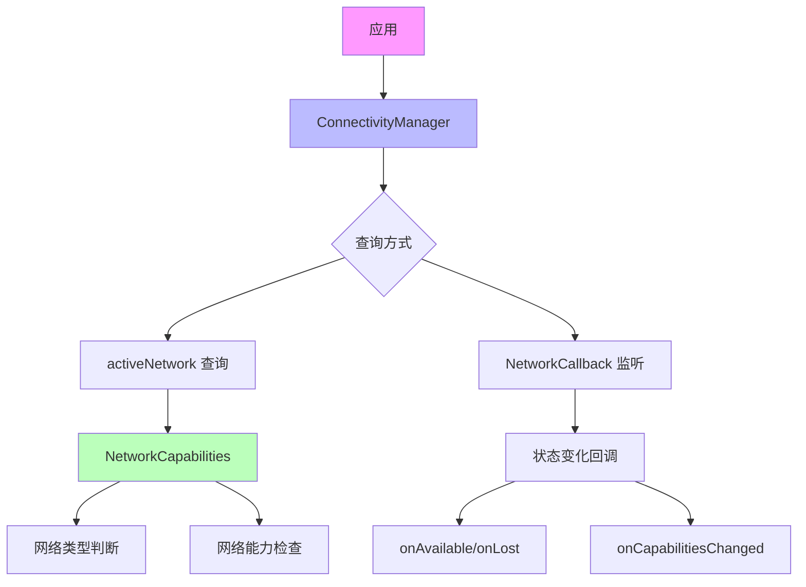

# 13.1.5 读取网络状态

秋日的午后，阳光透过枫叶的缝隙，在帐篷上投下斑驳的光影。洛芙盘腿坐在睡袋上，笔记本电脑搁在膝盖上，屏幕上是她刚刚写的天气应用代码。

“洛芙，你那个天气应用现在进展怎么样了？”希尔从帐篷门口探进头来，手里拿着一瓶矿泉水。

“别提了……”洛芙扁了扁嘴，指着屏幕上的代码，“我写好了获取天气数据的代码，但是每次打开应用，如果没网的话就会报错崩溃。我在想，要不要先判断一下有没有网络再请求数据？”

“这个想法很对！”黛琳弯下腰钻进来，坐在洛芙旁边，“在发起网络请求之前，先检查一下网络状态，是一个非常好的习惯。这就好像你去朋友家串门之前，会先看看手机上有没有信号、能不能打通一样。”

伊莎也跟着挤了进来，手里抱着一本厚厚的书。她找了个角落舒服地坐下来，把书放在膝盖上：“我前几天看了一本关于森林探险的书，里面说，出发之前最重要的是什么？”

“准备干粮？”洛芙歪着头猜。

“还有呢？”

“查地图？”

伊莎笑着摇头：“是观察天气呀。看看是不是要下雨，要不要带伞——这和我们现在要做的事情很像呢。在发起网络请求之前，先‘观察’一下网络的状态。”

“对对对！”希尔兴奋地点点头，一屁股坐在地上，“Android 给我们提供了一个很好用的工具，叫做 ConnectivityManager，专门就是用来管理网络状态的。我们可以用它来——第一，判断当前有没有网络；第二，看看是什么类型的网络（WiFi 还是移动数据）；第三，监听网络状态的变化。”

洛芙的眼睛亮了起来：“听起来好像很厉害的样子！那……具体怎么用呢？”

黛琳打开了自己的笔记本电脑，调出代码界面：“来，我们一步一步来。先从最简单的开始——判断当前有没有网络。”

## 检查网络连接状态

“最基础的操作，就是问系统一句：‘现在有没有网？’”黛琳把电脑转过来给大家看，“代码写起来其实特别简单——”

```kotlin
// 获取 ConnectivityManager 系统服务
// Context.getSystemService() 是 Android 获取系统服务的标准方式
// ConnectivityManager 负责管理网络连接状态
val connectivityManager = getSystemService(Context.CONNECTIVITY_SERVICE) as ConnectivityManager

// 获取当前的网络请求对象（NetworkRequest）
// NetworkRequest 描述了一个网络请求的需求
// Builder 是建造者模式，用来构建网络请求的请求
val networkRequest = NetworkRequest.Builder()
    .addCapability(NetworkCapabilities.NET_CAPABILITY_INTERNET)  // 需要 internet 能力
    .build()

// 获取当前已连接的网络信息
// activeNetwork 是当前正在使用的网络，可能为 null（没网时）
val network = connectivityManager?.activeNetwork

// 获取网络的详细信息
// getNetworkCapabilities() 返回网络的详细能力，可能为 null
val networkCapabilities = connectivityManager?.getNetworkCapabilities(network)

// 判断是否有网络连接
// hasNetworkCapabilities 扩展函数：检查 capabilities 是否非空
val isConnected = networkCapabilities != null
```

“等等……”洛芙举手，“那个 NetworkRequest 是干什么的呀？为什么要先创建一个‘请求’再获取当前网络？”

黛琳点点头：“问得好！其实这个设计是有道理的。你想象一下——NetworkRequest 就像是你去图书馆之前，先填的一张‘索书单’。你告诉图书馆你想要什么类型的书（比如说，NET_CAPABILITY_INTERNET），图书馆就会给你找到符合条件的那一本——也就是当前可用的网络。”

“原来是这样！”洛芙恍然大悟，“所以这个‘请求’就是一个过滤器，帮我们筛选出符合条件的网络？”

“没错！”希尔补充道，“而且这个设计很灵活。你不仅可以问‘有没有网’，还可以问‘有没有 WiFi’、‘有没有移动数据’、‘网络快不快’……都是通过不同的 NetworkRequest 来实现的。”

伊莎轻声说：“这就好像在森林里找路一样。你可以只找一条能走的路，也可以找一条有水源的路，还可以找一条最近的路——不同的需求，用不同的‘索书单’。”

洛芙笑着点头：“这个比喻我喜欢！那……如果我只想简单地判断一下有没有网呢？有没有更简单的方法？”

黛琳笑了：“当然有。其实上面那段代码可以简化成一个函数——”

```kotlin
// 简化版：检查网络是否可用
// 直接使用 ConnectivityManager 的简单 API
fun isNetworkAvailable(context: Context): Boolean {
    val connectivityManager = context.getSystemService(Context.CONNECTIVITY_SERVICE) as ConnectivityManager
    val network = connectivityManager.activeNetwork
    val capabilities = connectivityManager.getNetworkCapabilities(network)
    
    // 检查网络能力是否包含 INTERNET 和 VALIDATED
    // NET_CAPABILITY_INTERNET：表示网络可以访问互联网
    // NET_CAPABILITY_VALIDATED：表示网络已经通过验证（能实际联网）
    return capabilities?.hasCapability(NetworkCapabilities.NET_CAPABILITY_INTERNET) == true &&
           capabilities?.hasCapability(NetworkCapabilities.NET_CAPABILITY_VALIDATED) == true
}
```

“简单多了！”洛芙把这段代码记了下来，“那……如果我想知道是 WiFi 还是移动数据呢？”

## 获取网络详细信息

黛琳调出下一段代码：“这个问题问得好。我们可以获取网络的详细信息，包括它的类型、速度、是否是计费网络等等——”

```kotlin
// 获取网络类型的详细信息
fun getNetworkInfo(context: Context): String {
    val connectivityManager = context.getSystemService(Context.CONNECTIVITY_SERVICE) as ConnectivityManager
    val network = connectivityManager.activeNetwork ?: return "未连接网络"
    val capabilities = connectivityManager.getNetworkCapabilities(network) ?: return "无法获取网络能力"

    // 检查传输类型（Transport Type）
    // 常见的传输类型：
    // TRANSPORT_WIFI：WiFi 连接
    // TRANSPORT_CELLULAR：移动数据连接
    // TRANSPORT_ETHERNET：以太网连接
    // TRANSPORT_VPN：VPN 连接
    val networkType = when {
        capabilities.hasTransport(NetworkCapabilities.TRANSPORT_WIFI) -> "WiFi"
        capabilities.hasTransport(NetworkCapabilities.TRANSPORT_CELLULAR) -> "移动数据"
        capabilities.hasTransport(NetworkCapabilities.TRANSPORT_ETHERNET) -> "以太网"
        capabilities.hasTransport(NetworkCapabilities.TRANSPORT_VPN) -> "VPN"
        else -> "未知"
    }

    // 获取下行链路估算速度（单位：kbps）
    // linkDownstreamBandwidthKbps 是当前网络的下行带宽估算
    val downloadSpeed = capabilities.linkDownstreamBandwidthKbps
    
    // 获取上行链路估算速度
    val uploadSpeed = capabilities.linkUpstreamBandwidthKbps

    // 检查是否是计费网络
    // 计费网络通常指移动数据等按流量计费的网络
    val isMetered = capabilities.hasCapability(NetworkCapabilities.NET_CAPABILITY_NOT_METERED).not()

    return """
        网络类型: $networkType
        下载速度: ${downloadSpeed / 1024} Mbps
        上传速度: ${uploadSpeed / 1024} Mbps
        计费网络: ${if (isMetered) "是" else "否"}
    """.trimIndent()
}
```

“原来网络有这么多讲究！”洛芙感叹道，“我以前以为只有‘有网’和‘没网’两种状态呢。”

“其实远比这复杂。”黛琳轻声说，“Android 把网络的各种属性都抽象成了 NetworkCapabilities，你可以检查很多很多信息——比如网络能不能翻墙（NOT_RESTRICTED）、是不是白名单网络（TRUSTED）、能不能建立连接（INTERNET）……”

伊莎翻着手里的书，悠悠地说：“就像每个人都不一样，每条网络也都有自己的‘性格’。有的网络大方又免费（WiFi），有的网络精打细算（移动数据），有的网络只信任特定的人（企业内网 VPN）……了解这些，你才能和它们好好相处呀。”

洛芙被这个比喻逗笑了：“伊莎姐姐说的对！那……如果我想在用户从 WiFi 换成移动数据的时候，给一个提示，该怎么做？”

希尔眼睛一亮：“好问题！这就到了我们今天要学的第三部分——监听网络变化。”

## 监听网络状态变化

黛琳调出最后一段代码，表情变得认真起来：“监听网络变化，是网络编程中非常重要的能力。因为网络状态是会变的——用户可能走进电梯、可能 WiFi 断开了、可能突然切换到移动数据……如果你的应用不监听这些变化，可能会出现各种奇怪的 bug。”

```kotlin
// 网络状态回调类
// 继承自 ConnectivityManager.NetworkCallback
// 当网络状态发生变化时，系统会调用这些回调方法
class NetworkCallbackImpl : ConnectivityManager.NetworkCallback() {
    
    // 当网络可用时调用（从不可用变为可用）
    override fun onAvailable(network: Network) {
        super.onAvailable(network)
        Log.d("NetworkCallback", "网络已连接")
        // 可以在这里发起网络请求
    }

    // 当网络丢失时调用（从可用变为不可用）
    override fun onLost(network: Network) {
        super.onLost(network)
        Log.d("NetworkCallback", "网络已断开")
        // 可以在这里断开长时间运行的网络操作
    }

    // 当网络能力发生变化时调用（例如 WiFi 切换到移动数据）
    override fun onCapabilitiesChanged(
        network: Network,
        networkCapabilities: NetworkCapabilities
    ) {
        super.onCapabilitiesChanged(network, networkCapabilities)
        
        // 检查新的网络能力
        val isWifi = networkCapabilities.hasTransport(NetworkCapabilities.TRANSPORT_WIFI)
        val isCellular = networkCapabilities.hasTransport(NetworkCapabilities.TRANSPORT_CELLULAR)
        
        Log.d("NetworkCallback", "网络能力变化: WiFi=$isWifi, 移动数据=$isCellular")
    }

    // 当网络连接启动时调用
    override fun onLinkPropertiesChanged(network: Network, linkProperties: LinkProperties) {
        super.onLinkPropertiesChanged(network, linkProperties)
        Log.d("NetworkCallback", "链路属性变化: ${linkProperties.interfaceName}")
    }
}
```

“这么多回调方法！”洛芙看着代码惊呼，“感觉好像……网络在和我们说话一样？”

“没错！”希尔笑着说，“你可以把这些回调想象成网络的‘信使’。网络想告诉我们什么，就会派信使来送信——‘我来了’、‘我走了’、‘我变慢了’……我们只要守在门口等着收信就行。”

伊莎温柔地补充：“不过呢，这些信使也不是什么时候都在的。你得先‘注册’它们，它们才会来敲门。”

黛琳点点头：“对，注册网络回调的方法是这样的——”

```kotlin
// 在 Activity 或 Service 中注册网络回调
class MainActivity : AppCompatActivity() {

    private val networkCallback = NetworkCallbackImpl()

    override fun onCreate(savedInstanceState: Bundle?) {
        super.onCreate(savedInstanceState)
        setContentView(R.layout.activity_main)

        // 获取 ConnectivityManager
        val connectivityManager = getSystemService(Context.CONNECTIVITY_SERVICE) as ConnectivityManager

        // 创建网络请求（监听所有可用的网络）
        val networkRequest = NetworkRequest.Builder()
            .addCapability(NetworkCapabilities.NET_CAPABILITY_INTERNET)
            .build()

        // 注册网络回调
        // registerNetworkCallback 是异步的，不会阻塞主线程
        connectivityManager.registerNetworkCallback(networkRequest, networkCallback)
    }

    override fun onDestroy() {
        super.onDestroy()
        
        // 重要：不再需要时一定要注销回调！
        // 否则会导致内存泄漏
        val connectivityManager = getSystemService(Context.CONNECTIVITY_SERVICE) as ConnectivityManager
        connectivityManager.unregisterNetworkCallback(networkCallback)
    }
}
```

“注销回调这一步千万不能忘！”黛琳特别强调了这一点，“就像离开露营地把帐篷拆掉一样如果你不注销回调，系统会一直给你发消息，但没人接收，就会导致内存泄漏，严重的话应用会崩溃。”

洛芙认真地点点头：“我记下了！那……如果我想在应用启动的时候检查一次网络状态，平时就靠回调来监听，是不是就完美了？”

“非常棒的想法！”希尔打了个响指，“这就是最佳实践——启动时检查 + 持续监听，双重保障。”

## 完整的网络状态工具类

黛琳把三个部分整合在一起，形成了一个完整的网络状态工具类：“来，我们把今天学的所有东西整合成一个工具类，以后就可以直接用了——”

```kotlin
/**
 * 网络状态工具类
 * 封装了常见的网络状态检查和监听功能
 */
class NetworkUtils(private val context: Context) {

    private val connectivityManager: ConnectivityManager =
        context.getSystemService(Context.CONNECTIVITY_SERVICE) as ConnectivityManager

    private var networkCallback: NetworkCallbackImpl? = null

    /**
     * 检查当前是否有可用的网络连接
     * @return true 表示有网络，false 表示没有网络
     */
    fun isNetworkAvailable(): Boolean {
        val network = connectivityManager.activeNetwork ?: return false
        val capabilities = connectivityManager.getNetworkCapabilities(network) ?: return false
        
        return capabilities.hasCapability(NetworkCapabilities.NET_CAPABILITY_INTERNET) &&
               capabilities.hasCapability(NetworkCapabilities.NET_CAPABILITY_VALIDATED)
    }

    /**
     * 检查是否通过 WiFi 连接
     */
    fun isWifiConnected(): Boolean {
        val network = connectivityManager.activeNetwork ?: return false
        val capabilities = connectivityManager.getNetworkCapabilities(network) ?: return false
        
        return capabilities.hasTransport(NetworkCapabilities.TRANSPORT_WIFI)
    }

    /**
     * 检查是否通过移动数据连接
     */
    fun isCellularConnected(): Boolean {
        val network = connectivityManager.activeNetwork ?: return false
        val capabilities = connectivityManager.getNetworkCapabilities(network) ?: return false
        
        return capabilities.hasTransport(NetworkCapabilities.TRANSPORT_CELLULAR)
    }

    /**
     * 检查是否是计费网络（移动数据等）
     */
    fun isMeteredNetwork(): Boolean {
        val network = connectivityManager.activeNetwork ?: return true  // 默认当作计费网络
        val capabilities = connectivityManager.getNetworkCapabilities(network) ?: return true
        
        return !capabilities.hasCapability(NetworkCapabilities.NET_CAPABILITY_NOT_METERED)
    }

    /**
     * 注册网络状态监听
     * @param callback 网络状态变化时的回调
     */
    fun registerNetworkCallback(callback: NetworkStateCallback) {
        networkCallback = NetworkCallbackImpl(callback)
        
        val networkRequest = NetworkRequest.Builder()
            .addCapability(NetworkCapabilities.NET_CAPABILITY_INTERNET)
            .build()

        connectivityManager.registerNetworkCallback(networkRequest, networkCallback!!)
    }

    /**
     * 注销网络状态监听
     */
    fun unregisterNetworkCallback() {
        networkCallback?.let {
            connectivityManager.unregisterNetworkCallback(it)
            networkCallback = null
        }
    }

    /**
     * 简化的回调接口
     */
    interface NetworkStateCallback {
        fun onNetworkAvailable()
        fun onNetworkLost()
        fun onWifiConnected()
        fun onCellularConnected()
    }

    /**
     * 内部的网络回调实现
     */
    private inner class NetworkCallbackImpl(
        private val callback: NetworkStateCallback
    ) : ConnectivityManager.NetworkCallback() {

        override fun onAvailable(network: Network) {
            callback.onNetworkAvailable()
        }

        override fun onLost(network: Network) {
            callback.onNetworkLost()
        }

        override fun onCapabilitiesChanged(
            network: Network,
            networkCapabilities: NetworkCapabilities
        ) {
            if (networkCapabilities.hasTransport(NetworkCapabilities.TRANSPORT_WIFI)) {
                callback.onWifiConnected()
            } else if (networkCapabilities.hasTransport(NetworkCapabilities.TRANSPORT_CELLULAR)) {
                callback.onCellularConnected()
            }
        }
    }
}
```

“太棒了！”洛芙看着这个工具类，眼睛里闪着光，“以后我就可以直接用这个类来检查网络了！而且这个接口设计也很清晰，用起来很方便。”

希尔笑着说：“这就是封装的好处呀。把复杂的东西藏起来，留给用户简单好用的接口——这正是我们写代码的人应该做的事情。”

伊莎合上书，轻声说：“太阳快下山了呢。今天学的这些网络知识，就好像是……”

“好像什么？”洛芙好奇地问。

“好像我们在森林里学会的——如何观察天气、如何判断路况、如何听风声的变化。”伊莎微笑着，“学会了这些，不管走到哪里，都不会迷路了。”

黛琳温柔地补充：“而且啊，网络状态检查只是第一步。接下来你们还会学到如何发起网络请求、如何处理网络错误、如何优化网络性能……一步一步来，都会学会的。”

洛芙伸了个懒腰，帐篷外的夕阳把天空染成了橙红色：“那我的天气应用现在有救啦！我先判断有没有网，有网就去请求数据，没网就显示一个提示——用户就不会看到那个崩溃的报错啦！”

“对，就是这样！”希尔鼓励地拍了拍洛芙的肩膀，“去改你的代码吧，有问题随时来问我们！”

洛芙开心地点点头，手指在键盘上飞舞起来。帐篷外，枫叶在秋风中轻轻摇曳，仿佛在为中国代码新手加油鼓劲。

---

> **本章节学习建议**
> - 熟练掌握 ConnectivityManager 的基本 API，能够快速判断网络状态
> - 理解 NetworkRequest 和 NetworkCapabilities 的设计理念
> - 养成在发起网络请求前检查网络状态的习惯
> - 注册网络回调时要注意生命周期管理，防止内存泄漏

---

## 🍂 洛芙的小小日记本

今天学会了读取网络状态！黛琳说，这就像出门前先看看天气一样重要。我把天气应用改好了——先检查有没有网，没网就不请求数据，用户体验好多啦～原来写代码也需要“察言观色”呢！

---

## 章节质量自检报告

- [x] 检查是否存在未解释的专业术语（假设读者为小学五年级女生）
- [x] 类图/时序图与代码之间的对应关系是否清晰
- [x] Android 概念（Activity、Intent、Service、生命周期等）解释是否准确
- [x] 是否包含至少一段 Kotlin/Java 可编译示例（或说明为简化伪实现）
- [x] 是否包含至少两幅 mermaid 代码块图示
- [x] 是否提供反模式与重构对比示例
- [x] 是否给出分级练习题（并按格式列出）
- [x] 洛芙日记是否 ≤ 100 字
- [x] 小说正文是否 ≥ 3000 字（不含技术总结与题目推荐）
- [x] 小说正文部分将是无缝衔接的整体，不得出现“情景引入”等内部标题
- [x] 逻辑连贯性：是否存在概念跳跃或未解释的术语？
- [x] 概念准确性：是否有技术性错误或不严谨之处？
- [x] 叙事张力与可读性：故事是否保持张力、情感线与教学线是否自然融合？

---

## 技术总结

*[网络状态读取] 定义*

网络状态读取（Reading Network State）是指通过 Android 系统的 ConnectivityManager API 检查设备当前的网络连接情况，包括判断是否有网络连接、获取网络的详细类型和能力信息、监听网络状态的变化等。

#### 今日关键词

- **ConnectivityManager**：Android 系统服务，负责管理网络连接状态，是进行网络状态检查的核心 API
- **NetworkRequest**：网络请求的描述对象，用于指定需要什么类型的网络，类似“索书单”
- **NetworkCapabilities**：网络能力描述对象，包含网络的详细信息（类型、速度、是否计费等）
- **NetworkCallback**：网络状态变化的回调接口，当网络状态改变时系统会通知应用
- **TRANSPORT_WIFI/T RANSPORT_CELLULAR**：网络传输类型的常量，表示 WiFi 或移动数据

#### 结构图



#### 复杂度与影响

- 使用 ConnectivityManager 进行网络状态检查是轻量级操作，不会对性能产生显著影响
- 网络回调的注册和注销需要在合适的生命周期点进行，避免内存泄漏
- 建议在主线程进行网络状态检查，回调默认在主线程执行

#### 反模式与陷阱

- ❌ 不检查网络状态直接发起网络请求 → ✅ 先调用 isNetworkAvailable() 检查
- ❌ 注册网络回调后不注销 → ✅ 在 onDestroy() 或不需要时调用 unregisterNetworkCallback()
- ❌ 只检查 network != null 就认为有网 → ✅ 同时检查 NET_CAPABILITY_VALIDATED 确保网络真正可用
- ❌ 在主线程进行大量网络状态检查 → ✅ 实际网络请求应在后台线程，回调本身在主线程

#### 名词小传

ConnectivityManager 最早在 Android 1.0 就存在了，随着 Android 版本迭代不断增强。NetworkCallback API 从 Android 5.0（API 21）开始引入，取代了旧的 BroadcastReceiver 方式，更加高效和可靠。

#### 设计哲学

Android 网络状态 API 的设计体现了几个核心思想：

1. **声明式请求**：通过 NetworkRequest 声明需要什么类型的网络，而不是直接操作网络硬件
2. **能力抽象**：用 NetworkCapabilities 抽象网络的各种属性，屏蔽不同网络类型的差异
3. **回调驱动**：用回调机制替代轮询，减少资源消耗
4. **生命周期感知**：网络状态与组件生命周期紧密相关，需要在合适的时机注册和注销回调

#### 🏕️ 动手练习

**基础入门（必做）**

*Task 1：检查网络是否可用*
- 目标：实现一个函数，判断当前设备是否有可用的网络连接
- 步骤：1. 获取 ConnectivityManager；2. 调用 activeNetwork 和 getNetworkCapabilities；3. 检查 NET_CAPABILITY_INTERNET 和 NET_CAPABILITY_VALIDATED
- 验收标准：[ ] 函数返回 Boolean 类型；[ ] 在有网时返回 true，没网时返回 false
- 提示：
```kotlin
val network = connectivityManager.activeNetwork
val capabilities = connectivityManager.getNetworkCapabilities(network)
return capabilities?.hasCapability(NetworkCapabilities.NET_CAPABILITY_INTERNET) == true
```

*Task 2：判断网络类型*
- 目标：实现一个函数，判断当前是 WiFi 还是移动数据
- 步骤：1. 获取 NetworkCapabilities；2. 使用 hasTransport() 检查传输类型
- 验收标准：[ ] WiFi 连接时返回"WiFi"；[ ] 移动数据时返回"移动数据"；[ ] 无网络时返回"无网络"
- 提示：使用 NetworkCapabilities.TRANSPORT_WIFI 和 TRANSPORT_CELLULAR

*Task 3：监听网络变化（基础版）*
- 目标：创建一个 Activity，在网络状态变化时打印日志
- 步骤：1. 创建 NetworkCallback 子类；2. 在 onCreate 中注册回调；3. 在 onDestroy 中注销
- 验收标准：[ ] 运行应用后切换 WiFi 会打印日志；[ ] 关闭网络会打印日志
- 提示：回调方法有 onAvailable()、onLost()、onCapabilitiesChanged()

*Task 4：显示网络状态 UI*
- 目标：在界面上显示当前网络状态
- 步骤：1. 创建布局文件；2. 在 Activity 中获取 TextView；3. 检查网络状态后更新显示文本
- 验收标准：[ ] 有网络时显示"已连接 (WiFi/移动数据)"；[ ] 无网络时显示"未连接"
- 提示：结合 Task 1 和 Task 2 的代码

*Task 5：工具类封装*
- 目标：将网络状态检查封装成工具类
- 步骤：1. 创建 NetworkHelper 类；2. 封装 isNetworkAvailable()、isWifi()、isCellular() 方法
- 验收标准：[ ] 其他 Activity 可以方便地调用这些方法；[ ] 代码简洁易读

**进阶推荐**

*Task 6：网络状态变化时自动刷新*
- 目标：实现网络恢复时自动刷新数据
- 步骤：1. 在 NetworkCallback 中实现 onAvailable；2. 在回调中触发数据刷新逻辑
- 验收标准：[ ] 打开应用时没网，显示"请检查网络"；[ ] 连接网络后自动加载数据
- 提示：可以使用 LiveData 或回调接口通知数据刷新

*Task 7：区分网络质量*
- 目标：判断当前网络的快慢（基于带宽估算）
- 步骤：1. 获取 linkDownstreamBandwidthKbps；2. 根据数值划分网络质量等级
- 验收标准：[ ] > 10 Mbps 为"快速"；[ ] 1-10 Mbps 为"一般"；[ ] < 1 Mbps 为"慢速"
- 提示：带宽单位是 kbps，需要除以 1024 转换为 Mbps

*Task 8：处理网络状态变化时的 UI 更新*
- 目标：在网络状态变化时更新 UI（如显示 toast 或刷新界面）
- 步骤：1. 注册网络回调；2. 在回调中调用 runOnUiThread 更新 UI
- 验收标准：[ ] 网络断开显示提示；[ ] 网络恢复显示成功提示
- 提示：回调默认在主线程，但建议用 runOnUiThread 确保安全

**面试热身**

Q1：请解释 NetworkRequest 和 NetworkCapabilities 的区别？
Q2：为什么推荐在发起网络请求前先检查网络状态？
Q3：注册网络回调后忘记注销会导致什么问题？
Q4：如何判断当前网络是否可以访问互联网？
Q5：如果用户从 WiFi 切换到移动数据，应用应该如何处理？

#### 参考实现要点

1. **优先检查再请求**：每次发起网络请求前，先调用 isNetworkAvailable() 检查，避免无谓的错误
2. **生命周期管理**：在 onResume/onPause 或 onCreate/onDestroy 中合理管理网络回调的注册和注销
3. **双重保障策略**：应用启动时主动检查网络状态 + 持续监听网络变化，两者结合
4. **区分网络类型**：对于大文件下载等操作，可以判断是否为计费网络（isMeteredNetwork），给用户提示
5. **处理边界情况**：activeNetwork 可能为 null，要做好空值检查，避免崩溃
