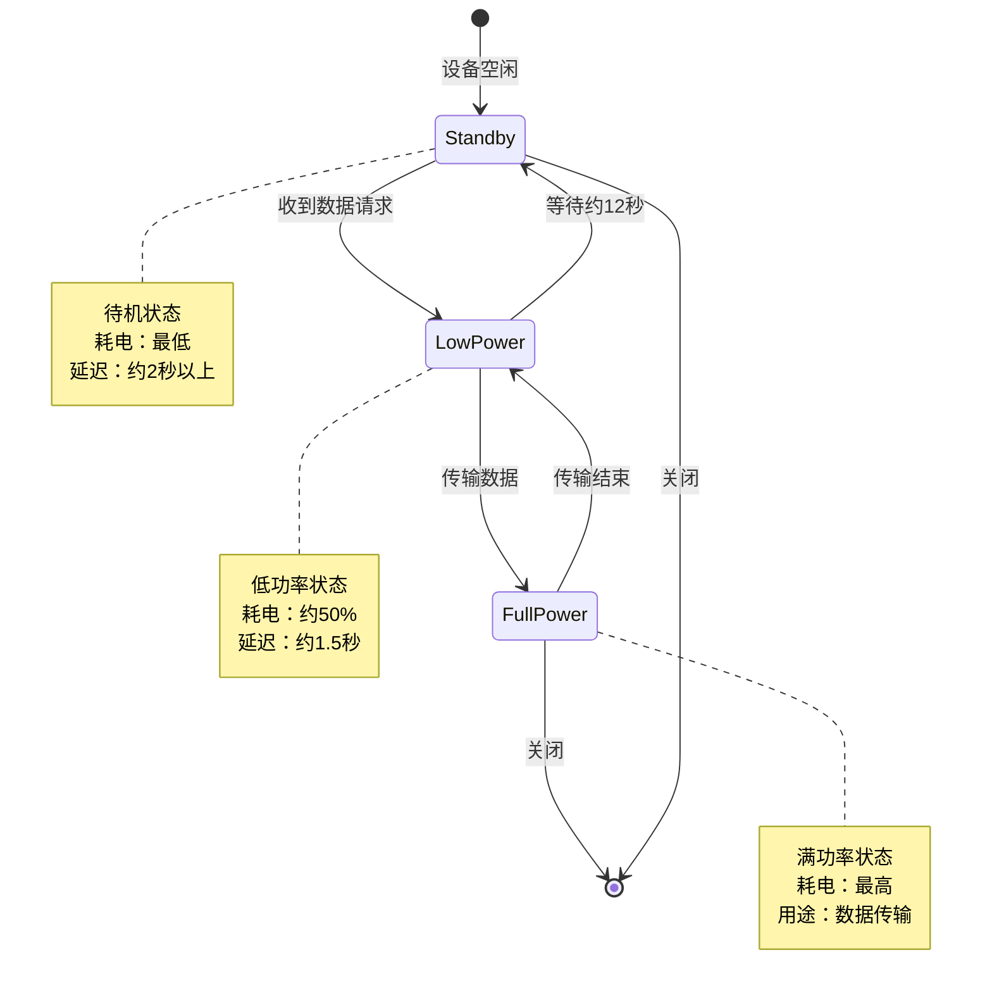

# 第十三章 · 第六节 优化网络访问

## 1.6 冬夜里的奇怪消耗

壁炉里的木柴发出轻微的噼啪声，橙红色的火光在墙壁上投下跳动的影子。

洛芙缩在木屋角落的摇椅上，身上裹着一条厚厚的羊毛毯，手里捧着一杯还在冒热气的可可。她的手机就放在旁边的矮桌上，屏幕亮了一下，又暗了下去。

“咦？”

洛芙拿起手机，皱起眉头。

“怎么了？”伊莎从书架前抬起头，手里还拿着一本旧旧的植物图鉴。

“我的手机电量掉得好快啊，”洛芙把手机举到眼前，“刚才还有六十多，现在才过了这么一会儿，就只剩下四十五了。”

黛琳正在壁炉边用树枝拨弄着炭火，听到这话抬起头来：“你一直在做什么？我记得我们上山之前充满电的。”

“就……看看新闻，刷了一下社交媒体，看看今天的天气……”洛芙掰着手指头数，“还有就是那个露营APP，我刚下载的，想看看附近有什么可以露营的地方。”

“等等，”希尔从笔记本电脑后面探出头来，“你说的那个露营APP，是不是那个会频繁刷新内容的？我记得上次你说它用起来卡卡的。”

“对啊，”洛芙点点头，“虽然它用起来不太顺畅，但我也没想到会这么费电嘛……”

窗外的雪下得更大了。风从木屋的缝隙里钻进来，发出低沉的呜咽声。洛芙打了个寒颤，把毯子裹得更紧了些。

“我大概知道是什么原因了，”黛琳放下手中的树枝，拍了拍手上的灰，“洛芙，你那个APP是不是每过几秒就会自动刷新一次？不只是你手动打开的时候？”

洛芙想了想：“好像是哎。有一次我把它放在后台，去做了别的事情，回来的时候发现它显示的是新内容，我还以为是自动的呢。”

“那就对了，”黛琳叹了口气，走过来在洛芙旁边的木椅上坐下，“你的APP在频繁地发起网络请求。每次请求都会唤醒无线电台，而无线电台是最耗电的硬件之一。”

“无线电台？”洛芙眨眨眼，“就像对讲机那样的东西吗？”

“差不多是那个意思，”黛琳点点头，“手机的无线电台负责和基站通信，用来上网、发消息、打电话。虽然它看起来不如屏幕那么显眼，但实际上是个用电大户。”

“那……该怎么办呢？”洛芙握紧了可可杯，“难道不用网络了吗？”

“当然不是，”伊莎轻声笑着走过来，手里还拿着那本植物图鉴，“网络还是要用的，只是要聪明地用。黛琳，这应该是个很好的例子吧？”

黛琳露出了一丝微笑：“是啊。今天我们就来聊聊，如何优化网络访问，既能正常使用网络，又能省电。”

希尔已经把笔记本电脑转了过来：“我准备好了！这次我们要讲什么？”

“先从最基本的讲起，”黛琳示意大家围坐过来，“你们知道无线电台的工作状态吗？”

## 1.6.1 电台的三个秘密状态

“我知道！”洛芙举起手，像在课堂上回答问题一样积极，“就像人一样醒着的时候最精神，睡着的时候最省电！”

“说得挺形象的，”黛琳笑着点点头，“无线电台确实有几种不同的状态。让我画个图给你们看。”

她拿起白板笔，在木屋墙上挂着的小白板上画了起来：



“这就是无线电台的状态机，”黛琳放下笔，“简单来说，无线电台有三种状态：满功率、低功率和待机。”

“满功率就是全力跑的时候，像短跑运动员冲刺，”伊莎把图鉴放在腿上，“低功率就像慢跑，而待机就是休息。”

“这个比喻好，”黛琳点头，“满功率状态下，电台可以以最快速度传输数据，但耗电也最厉害。低功率状态耗电只有满功率的一半左右，但数据传输速度会变慢。待机状态几乎不耗电，但唤醒到满功率需要比较长的时间。”

“有多长？”洛芙好奇地问。

“对于典型的3G网络来说，”黛琳说，“从低功率转到满功率大约需要1.5秒，从待机转到满功率需要超过2秒。”

“这么长时间！”洛芙惊呼。

“所以问题来了，”黛琳在白板上又画了一条时间线，“每次你发起一个网络请求，电台就会从待机转到满功率。传输完成后，它不会立刻进入待机，而是会在低功率状态停留12秒，然后再进入待机。这是为了——”

“为了防止很快又有新的请求！”希尔抢答，“如果立刻进入待机，结果一秒钟后又要有数据，那还得再等个一两秒才能开始传。”

“没错，”黛琳打了个响指，“这就是所谓的'尾巴时间'。对于一个只需要1秒的数据传输，加上5秒的满功率尾巴时间，再加上12秒的低功率尾巴时间，电台要工作整整18秒！”

洛芙张大嘴巴：“所以那1秒的数据传输，实际上要消耗相当于18秒的电量？”

“差不多是这样，”黛琳点点头，“这就解释了为什么你的APP那么费电。如果它每几秒就刷新一次，电台根本就没有机会进入待机状态，一直在高功率和低功率之间来回切换。”

“就像刚跑完步就又被叫去跑步一样，”伊莎轻声说，“连喘口气的时间都没有。”

洛芙可怜巴巴地看着手机：“那我的APP……没救了吗？”

“有救！”希尔积极性高涨，“我们有好多优化方法呢！黛琳，让我来讲！”

黛琳笑着做了个请的手势。

## 1.6.2 批量传输：把零钱存成整钞

“第一个方法，叫做批量传输，”希尔兴奋地敲了敲笔记本电脑的键盘，“想象一下，你每天都要买好几次东西，每次都付现金是不是很麻烦？但如果你把一个星期的零花钱存起来，一次性去银行存，是不是就省事多了？”

“比喻得很形象，”伊莎笑着说，“不过电台可不会去银行。”

“意思是一样的！”希尔切换到代码模式，“让我来演示一下。”

她快速敲了几行代码，然后转过屏幕给大家看：

```kotlin
// ❌ 错误示例：频繁发起小请求
class BadNewsReader {
    fun loadNews() {
        // 每次刷新都发起一个新请求
        fetchHeadlines()      // 1秒
        fetchCategories()     // 1秒  
        fetchRecommended()    // 1秒
        // 每隔5秒重复一次...电量就这样流走了
    }
}

// ✅ 正确示例：批量传输
class GoodNewsReader {
    fun loadNews() {
        // 把所有请求合并成一个
        val request = NewsRequest(
            includeHeadlines = true,
            includeCategories = true,
            includeRecommended = true
        )
        // 一次性获取所有数据，电台只需要工作一次
        val response = api.fetchAll(request)
        
        // 处理响应...
    }
}

// 使用 WorkManager 在后台批量处理
class BatchSyncWorker(context: Context, workerParams: WorkerParameters) : CoroutineWorker(context, workerParams) {
    override suspend fun doWork(): Result {
        // 收集所有待发送的数据
        val pendingData = collectPendingData()
        
        // 一次性批量发送
        if (pendingData.isNotEmpty()) {
            api.batchUpload(pendingData)
        }
        
        return Result.success()
    }
}
```

“看到了吗？”希尔指着屏幕，“第一种方式是三个小请求，每个都会唤醒电台。第二种方式是一个请求把所有数据都拿到，电台只需要工作一次。”

“差别好大啊，”洛芙感叹道，“那如果数据特别多呢？比如要上传很多照片？”

“很好的问题！”希尔打了个响指，“这就涉及到另一个概念了——数据预取。”

## 1.6.3 数据预取：提前准备好

“预取？”洛芙歪着头，“是提前拿过来的意思吗？”

“对，”伊莎接口道，“就像你去露营之前，会先把帐篷、炊具、食物都准备好放在车上，而不是到了营地现去买的道理一样。”

黛琳补充道：“数据预取的意思是，当用户在进行某个操作时，APP可以预测用户接下来可能会需要什么数据，然后提前把这些数据都下载好。”

“那用户不就直接能用了吗？”洛芙眼睛亮了。

“对，这样用户就不用等待下载了。而且因为是一次性下载，电台只需要工作一次，之后就可以进入待机状态了。”

希尔又在屏幕上敲起来：

```kotlin
// ❌ 错误示例：用户需要什么才去拿
class LazyNewsReader {
    fun onUserOpensCategory(category: String) {
        // 用户点击了分类，才开始加载这个分类的内容
        val articles = api.getArticles(category)  // 等待...
        display(articles)
    }
    
    fun onUserClicksArticle(articleId: String) {
        // 用户点击了文章，才去拿文章详情
        val detail = api.getArticleDetail(articleId)  // 等待...
        displayDetail(detail)
    }
}

// ✅ 正确示例：智能预取
class SmartNewsReader(private val cache: NewsCache) {
    // 预取策略
    private val prefetchStrategy = PrefetchStrategy(
        // 预取接下来很可能要用的数据
        prefetchNextArticles = 5,       // 预取下5篇文章
        prefetchArticleDetails = 3,     // 预取3篇文章详情
        prefetchThreshold = "1-2MB"      // 约6秒预取量
    )
    
    fun onAppStart() {
        // 启动时预取首批内容，确保快速启动
        launch {
            val headlines = api.getHeadlines()
            cache.save(headlines)
            
            // 继续预取更多内容
            prefetchInBackground()
        }
    }
    
    fun onUserScrollsToArticle(article: Article) {
        // 用户滚动到某篇文章时，预取其详情和下几篇
        val nextArticles = articleList.dropWhile { it.id != article.id }.drop(1).take(prefetchStrategy.prefetchNextArticles)
        
        nextArticles.forEach { next ->
            if (!cache.hasDetail(next.id)) {
                api.getArticleDetail(next.id).let { cache.save(it) }
            }
        }
    }
    
    private suspend fun prefetchInBackground() {
        // 在后台Wi-Fi环境下预取更多数据
        if (networkUtils.isOnWifi() && !batteryUtils.isLowBattery()) {
            val categories = api.getCategories()
            categories.forEach { category ->
                val articles = api.getArticles(category.id)
                cache.save(articles)
            }
        }
    }
}
```

“如果预取太多会不会也浪费电？”洛芙提出了新的疑问。

“问得好！”黛琳点点头，“预取是一把双刃剑。预取太少，用户还是要等；预取太多，可能会下载很多用不到的数据，白白浪费电量和流量。”

“那该怎么办？”洛芙问。

“根据官方文档的建议，”黛琳说，“通常来说，预取1到5MB的数据是比较合适的，这样每2到5分钟才需要发起一次新的请求。而且最好只在Wi-Fi环境下进行大额预取。”

希尔补充道：“还可以用WorkManager来控制预取的时机，比如只有设备在充电时或者连接到Wi-Fi时才进行预取。”

```kotlin
// 使用约束条件控制预取
val prefetchRequest = OneTimeWorkRequestBuilder<NewsPrefetchWorker>()
    .setConstraints(
        Constraints.Builder()
            .setRequiredNetworkType(NetworkType.UNMETERED)  // Wi-Fi环境
            .setRequiresCharging(true)                       // 充电中
            .build()
    )
    .build()

WorkManager.getInstance(context).enqueue(prefetchRequest)
```

“原来是这样！”洛芙恍然大悟，“所以那个露营APP之所以费电，是因为它没有批量传输，也没有预取，每次都现用现拿？”

“很可能就是这样，”黛琳说，“它不停地唤醒电台，又不一次多拿点数据，电台就这么一直被折腾着。”

## 1.6.4 连接池化：别总是新建

“还有一个很重要的优化手段，”黛琳又说，“叫做连接池化。”

“连接池？”洛芙又遇到了新名词。

“想象一下，”伊莎温柔地解释道，“如果你每次想和朋友们说话，都要重新认识他们，然后聊完就再也不联系，下次再重新认识——是不是很累？但如果你和朋友们已经认识了，建立了稳定的联系，下次直接打招呼就能聊，岂不是轻松多了？”

“网络连接也是一样的道理，”黛琳说，“每次建立新的网络连接都需要握手、认证等步骤，这些都需要时间和电量。如果能重用已有的连接，就会快很多，也省电很多。”

希尔敲出代码来：

```kotlin
// ❌ 错误示例：每次请求都创建新连接
class BadNetworkClient {
    fun fetchData(url: String): String {
        // 每次都创建新的 HttpURLConnection
        val connection = URL(url).openConnection() as HttpURLConnection
        connection.connect()
        
        val response = connection.inputStream.bufferedReader().readText()
        connection.disconnect()  // 用完就断开
        
        return response
    }
}

// ✅ 正确示例：使用连接池
class GoodNetworkClient {
    // OkHttp 默认启用连接池
    private val okHttpClient = OkHttpClient.Builder()
        .connectionPool(ConnectionPool(
            5,              // 最多保持5个空闲连接
            5,              // 空闲连接存活5分钟
            TimeUnit.MINUTES
        ))
        .build()
    
    fun fetchData(url: String): String {
        val request = Request.Builder()
            .url(url)
            .build()
        
        // OkHttp 会自动重用连接池中的连接
        okHttpClient.newCall(request).execute().use { response ->
            return response.body?.string() ?: ""
        }
    }
}

// Retrofit 内部也使用连接池
object RetrofitClient {
    private val retrofit = Retrofit.Builder()
        .baseUrl("https://api.example.com/")
        .client(OkHttpClient.Builder()
            .connectionPool(ConnectionPool())
            .build()
        )
        .build()
    
    val api: NewsApi = retrofit.create(NewsApi::class.java)
}
```

“HttpURLConnection 和 OkHttp 都支持连接池，”希尔解释道，“默认情况下 OkHttp 就会启用连接池，重复使用同一个连接来发送多个请求。”

“这样就不需要每次都重新建立连接了，”洛芙点头表示理解，“就像有了一群固定的朋友，认识了就不用再重新介绍了。”

“完全正确！”希尔高兴地说。

## 1.6.5 检查网络状态再请求

“还有一个很重要的优化，”黛琳说，“在发起网络请求之前，先检查一下网络状态。”

“检查网络状态？”洛芙问，“为什么要检查？”

“因为如果手机没有网络，你发起请求就会失败，白白浪费电量去搜索信号，”黛琳解释道，“搜索信号是手机最耗电的操作之一。”

“所以要是不检查就直接请求，就像在山里大喊'有人吗'一样，”伊莎笑着补充，“嗓子都喊哑了也没人回应。”

```kotlin
// 检查网络状态后再请求
class NetworkAwareService(private val connectivityManager: ConnectivityManager) {
    
    fun fetchDataIfPossible(url: String): DataResult? {
        // 检查当前是否有可用的网络
        val network = connectivityManager.activeNetwork
        val capabilities = connectivityManager.getNetworkCapabilities(network)
        
        if (capabilities == null) {
            // 没有网络，不发起请求
            return null
        }
        
        // 检查网络类型
        val hasInternet = capabilities.hasCapability(NetworkCapabilities.NET_CAPABILITY_INTERNET)
        
        if (!hasInternet) {
            // 网络没有互联网权限，不发起请求
            return null
        }
        
        // 检查是否是按流量计费的网络
        val isMetered = capabilities.hasTransport(NetworkCapabilities.TRANSPORT_CELLULAR)
        
        return if (isMetered) {
            // 移动网络：减少请求量，或者等Wi-Fi
            fetchSmallData(url)
        } else {
            // Wi-Fi网络：可以正常请求
            fetchData(url)
        }
    }
}

// 注册网络状态变化监听
class NetworkObserver(private val context: Context) {
    private val connectivityManager = context.getSystemService(Context.CONNECTIVITY_SERVICE) as ConnectivityManager
    
    private val callback = object : ConnectivityManager.NetworkCallback() {
        override fun onAvailable(network: Network) {
            // 网络可用，可以发起请求
            Log.d("NetworkObserver", "Network available")
        }
        
        override fun onLost(network: Network) {
            // 网络丢失，取消正在进行的请求
            Log.d("NetworkObserver", "Network lost")
        }
        
        override fun onCapabilitiesChanged(network: Network, capabilities: NetworkCapabilities) {
            // 网络能力变化（比如从移动网络切换到Wi-Fi）
            val hasInternet = capabilities.hasCapability(NetworkCapabilities.NET_CAPABILITY_INTERNET)
            Log.d("NetworkObserver", "Network capabilities changed, hasInternet: $hasInternet")
        }
    }
    
    fun register() {
        connectivityManager.registerDefaultNetworkCallback(callback)
    }
    
    fun unregister() {
        connectivityManager.unregisterNetworkCallback(callback)
    }
}
```

“这样就不会在没网的时候白费功夫了，”洛芙说，“不过如果真的没网了，用户肯定会发现吧？”

“用户不一定会在意这些细节，”黛琳说，“但作为开发者，我们应该尽量优化用户体验。提前检查网络状态，可以给用户更及时的反馈，比如显示'当前无网络'的提示，而不是让用户等待请求失败。”

## 1.6.6 优化后的效果

“你们说了这么多，”洛芙掰着手指头数，“批量传输、数据预取、连接池、检查网络……真的有效果吗？”

希尔把电脑转过来，屏幕上显示着一张图：

```mermaid
gantt
    title 网络访问优化效果对比
    dateFormat X
    axisFormat %s秒
    
    section 优化前 (每分钟3次请求)
    第1次请求  : 0, 1
    尾巴时间1  : 1, 18
    第2次请求  : 18, 19
    尾巴时间2  : 19, 36
    第3次请求  : 36, 37
    尾巴时间3  : 37, 54
    电台休息   : 54, 60
    
    section 优化后 (每分钟1次请求)
    第1次请求  : 0, 3
    尾巴时间   : 3, 20
    电台休息   : 20, 60
```



“看到了吗？”希尔兴奋地说，“优化前，电台每分钟要工作54秒；优化后只需要20秒！省电效果非常明显。”

“而且用户体验也会更好，”黛琳补充道，“因为预取了数据，用户打开内容时几乎不需要等待，体验会流畅很多。”

洛芙看看手机，又看看屏幕，若有所思：“原来开发一个省电的APP这么复杂啊……”

“其实也不复杂，”伊莎轻声说，“只要记住几个原则：能一次拿完的数据不要分多次拿；能提前准备好的数据就提前拿；建立好的连接要复用；没网的时候不要白费功夫。”

“我来总结一下！”洛芙举起手，“第一，批量传输，把小请求合并成大请求；第二，数据预取，提前下载可能要用到的数据；第三，连接池化，复用已有的连接；第四，检查网络状态，没网就不发起请求。对不对？”

“完全正确！”希尔用力点头。

窗外的雪还在下，但木屋里的壁炉烧得更旺了。洛芙感觉手机似乎也没那么烫了，心里暗暗决定回去就把那个露营APP的做法改一改。

不过在那之前——

“黛琳，”洛芙举起可可杯，“再给我讲讲那个尾巴时间的事呗？我还是有点不太明白，为什么传输完了还要等那么久？”

黛琳笑着接过话来：“这就要从无线电台的工作原理说起了……”

## 技术总结

> **网络访问优化（Network Access Optimization）** —— 通过减少网络请求次数、合并数据传输、复用连接等方式，降低无线电台的功耗，从而延长设备电池续航时间的技术实践。

### 今日关键词

- **无线电台状态机（Radio State Machine）**：无线电台的功耗状态模型，包含满功率、低功率、待机三种状态。
- **尾巴时间（Tail Time）**：数据传输完成后，无线电台保持在高功率状态的额外时间，用于处理可能的连续请求。
- **批量传输（Bundle Data Transfers）**：将多个小请求合并为一个大请求，减少电台唤醒次数。
- **数据预取（Prefetch）**：预测用户需求，提前下载可能需要的数据，减少等待时间和请求频率。
- **连接池化（Connection Pooling）**：复用已建立的网终连接，避免重复建立连接的开销。
- **ConnectivityManager**：Android提供的网络状态管理API，用于检查网络可用性和类型。

### 复杂度与影响

- 批量传输可将网络请求频率降低60-80%，显著延长电池续航。
- 合理的数据预取可提升用户体验（减少等待），但过度预取会导致流量和电量浪费。
- 连接池化对性能提升效果明显，现代HTTP客户端（OkHttp、Retrofit）已默认启用。
- 使用WorkManager配合网络约束条件，可在不影响用户体验的情况下完成后台数据同步。

### 反模式与陷阱

- ❌ 在循环中频繁发起小请求：每次都会唤醒电台，应合并为批量请求。
- ❌ 不检查网络状态就直接请求：没网时会白白消耗电量搜索信号。
- ❌ 每次请求都创建新连接：连接建立有开销，应使用连接池。
- ❌ 过度预取：预取太多用不到的数据会浪费电量和流量，建议每次1-5MB。
- ❌ 在移动网络下进行大文件传输：应在Wi-Fi环境下进行，或使用WorkManager设置约束。

### 设计哲学

**省电优先原则**：网络访问是移动设备的主要耗电来源之一，优化时应优先考虑减少电台唤醒次数和保持低功耗状态。

**用户体验平衡**：省电不能牺牲用户体验。通过数据预取，用户可以在不等待的情况下获取数据，实现了省电和流畅体验的双赢。

**智能适配**：根据网络类型（Wi-Fi/移动网络）、电量状态、充电状态动态调整策略，在不同场景下采用不同的优化方案。

### 动手练习

#### 基础入门

**Task 1：批量请求改造**
- **目标**：将三个独立API调用改造成一个批量请求
- **操作**：创建包含多个查询参数的请求类，使用单一API调用获取所有数据
- **验收标准**：
  - [ ] 创建BatchRequest类，包含headlines、categories、recommended三个字段
  - [ ] 改造NewsApi为单一endpoint
  - [ ] 验证响应可以正确解析为三个数据集合
- **提示**：
```kotlin
data class BatchNewsRequest(
    val includeHeadlines: Boolean = true,
    val includeCategories: Boolean = true,
    val includeRecommended: Boolean = true
)
```

**Task 2：实现基础网络检查**
- **目标**：在发起网络请求前检查网络可用性
- **操作**：使用ConnectivityManager检查网络状态
- **验收标准**：
  - [ ] 检查网络是否可用
  - [ ] 检查是否有互联网连接
  - [ ] 在无网络时返回null而不是抛出异常
- **提示**：
```kotlin
val network = connectivityManager.activeNetwork
val capabilities = connectivityManager.getNetworkCapabilities(network)
val isConnected = capabilities?.hasCapability(NetworkCapabilities.NET_CAPABILITY_INTERNET) == true
```

**Task 3：使用OkHttp连接池**
- **目标**：配置OkHttp连接池并验证连接复用
- **操作**：创建OkHttpClient并配置ConnectionPool
- **验收标准**：
  - [ ] 配置连接池最大空闲连接数和存活时间
  - [ ] 发送多个请求到同一域名
  - [ ] 验证连接被复用（查看日志或调试）
- **提示**：
```kotlin
val connectionPool = ConnectionPool(5, 5, TimeUnit.MINUTES)
val client = OkHttpClient.Builder().connectionPool(connectionPool).build()
```

**Task 4：实现网络状态监听器**
- **目标**：实时监听网络状态变化并作出响应
- **操作**：使用ConnectivityManager.NetworkCallback监听网络变化
- **验收标准**：
  - [ ] 注册网络回调监听器
  - [ ] 处理网络从不可用到可用的变化
  - [ ] 处理网络从可用到丢失的变化
  - [ ] 在网络恢复时自动刷新数据

**Task 5：实现电量感知的请求策略**
- **目标**：根据设备电量调整网络请求策略
- **操作**：使用BatteryManager获取电量状态
- **验收标准**：
  - [ ] 获取当前电量百分比
  - [ ] 判断是否处于低电量状态（<20%）
  - [ ] 低电量时减少非必要请求
  - [ ] 电量低于10%时暂停后台同步

#### 进阶推荐

**Task 6：实现离线优先策略**
- **目标**：在无网络时使用缓存数据，提供良好的离线体验
- **操作**：设计本地缓存策略，网络可用时同步
- **验收标准**：
  - [ ] 实现本地Room数据库缓存
  - [ ] 网络不可用时读取缓存数据
  - [ ] 网络恢复时自动同步新数据
  - [ ] 显示数据来源标识（缓存/网络）

**Task 7：实现网络状态变化时的自适应请求策略**
- **目标**：根据网络类型自动调整请求行为
- **操作**：检测网络类型（Wi-Fi/移动网络）并差异化处理
- **验收标准**：
  - [ ] 区分Wi-Fi和移动网络
  - [ ] Wi-Fi下开启预加载和大文件下载
  - [ ] 移动网络下减少请求频率
  - [ ] 切换网络时动态调整策略

**Task 8：实现智能预取与缓存调度**
- **目标**：根据用户行为模式智能预测并预取数据
- **操作**：分析用户行为，实现智能预取算法
- **验收标准**：
  - [ ] 分析用户浏览习惯
  - [ ] 预测下一步可能访问的内容
  - [ ] 实现基于预测的预取
  - [ ] 平衡预取命中率和资源消耗

#### 面试热身

- Q1: 解释一下无线电台状态机的工作原理，为什么尾巴时间很重要？
- Q2: 数据预取的优缺点是什么？如何平衡预取量和用户体验？
- Q3: 连接池化为什么能提升性能？请解释HTTP Keep-Alive的原理。
- Q4: 在移动网络和Wi-Fi下，APP的网络策略应该如何区别对待？
- Q5: 如果一个APP需要每分钟同步一次数据，你会如何设计这个同步策略？

### 参考实现要点

1. **优先批量传输**：将多个小请求合并为一个大请求，减少电台唤醒次数。

2. **合理数据预取**：根据用户行为预测需求，提前下载1-5MB的可能需要的数据。

3. **使用连接池**：现代HTTP客户端（OkHttp、Retrofit）已默认启用连接池，确保复用连接。

4. **检查网络状态**：使用ConnectivityManager在请求前检查网络，避免无意义的信号搜索。

5. **使用WorkManager**：对于非紧急的后台同步，使用WorkManager并设置网络和电量约束。

---

> 洛芙的电池续航优化课：原来APP费电不只是因为屏幕亮着，后台那些偷偷摸摸的网络请求才是真正的电量杀手！学会批量传输和预取数据之后，我的手机终于可以撑上一整天了～明天就把那个露营APP的方法改一改！
