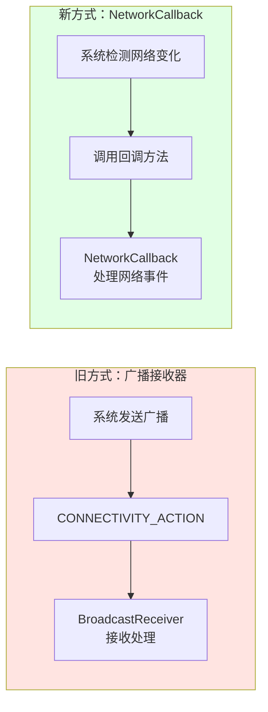
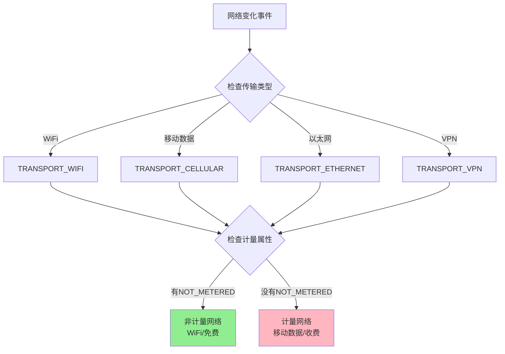
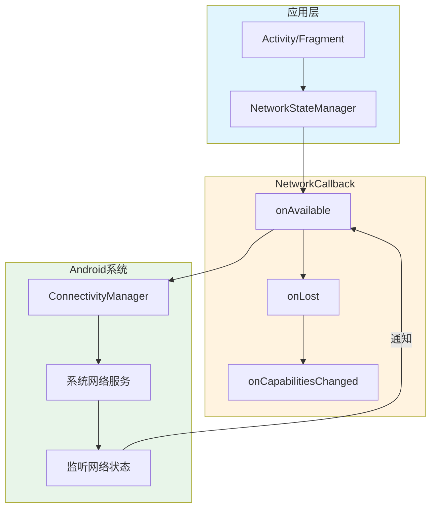

# 13.1.8 监控连接状态和计费连接

## 1.1 篝火旁的网络守卫者

夕阳的余晖渐渐收敛，山林间的光线变得柔和起来。露营编程旅团的四位少女围坐在篝火旁，温暖的火光照亮了她们的脸庞。洛芙抱着一杯热可可，满足地叹了口气。

“今天的露营真棒啊！”洛芙仰头看着渐渐亮起来的星空，“白天在树林里找路，晚上又能看到这么美的星空……”

希尔正在摆弄她的手机，屏幕上显示着各种代码和日志。她突然抬起头：“洛芙，你之前那个天气应用现在怎么样了？上次你说学会检查网络状态了，现在能实时更新天气吗？”

洛芙不好意思地挠挠头：“那个……代码是写好了，可是有个问题。用户打开应用的时候能看到天气，但是如果他一边看天气一边走进了一个没信号的地方……应用就不会自动更新了，也不会告诉他网络断了。”

“对哦！”希尔拍了拍手，“这确实是个问题。你总不能要求用户每次都手动刷新吧？就像我刚才在山里走的时候，手机网络从4G变成3G，又变成没信号——如果天气应用能自动检测到这种变化，然后告诉我‘网络不太好，先不更新了’，那用户体验会好很多。”

黛琳拨弄了一下篝火，让火烧得更旺一些：“这就说到了我们今天要学的内容了——监控网络状态的变化。你们想象一下，如果你的应用是一个‘网络守卫者’，它需要时刻留意网络的情况：有没有网？是WiFi还是移动数据？网络状态变化了没有？”

伊莎轻声说：“这让我想起小时候玩的‘传话游戏’。一个人把话传给下一个人，一直接传下去……网络监听也是类似的，系统会‘告诉’你的应用网络发生了什么变化。”

“传话游戏？”洛芙眼睛一亮，“那谁来传话呢？”

“Android系统呀！”黛琳笑着解释，“系统会通过各种方式通知你的应用：网络连上了、网络断开了、从WiFi切换到移动数据了……我们要做的，就是设置一个‘监听器’，等着接收这些消息。”

---

## 1.2 古老的广播与新生的回调

希尔调整了一下坐姿，把手机放在膝盖上：“在开始之前，我先跟你们说说两种监听网络的方式。一种是老的，一种是比较新的。”

“老的方式？”洛芙好奇地问。

“没错！”希尔点点头，“最早的时候，Android是用一种叫做‘广播接收器’的东西来通知应用网络变化的。最重要的广播叫做`CONNECTIVITY_ACTION`。应用可以注册一个接收器，当网络状态变化的时候，系统就会发一条广播过来。”

“那……广播又是什么呢？”洛芙继续问。

黛琳接过话来：“你可以把广播想象成——比如村子里的大喇叭。当村里有什么重要的事情要通知大家的时候，村委会就会打开大喇叭广播。Android系统的广播也是类似的道理，当网络状态变化时，系统就会‘广播’这个消息。”

伊莎补充道：“不过呢，这种用大喇叭的方式，虽然能通知到所有人，但是有个问题——如果你不在家（应用没有被启动），你就听不到广播了。而且大喇叭会吵到很多人，所以Android后来就不推荐用这种方式了。”

“原来如此！”洛芙恍然大悟，“那新的方式是什么呢？”

希尔 grins（露出灿烂的笑容）：“新的方式叫做`NetworkCallback`——网络回调！这是一种更优雅的方式。你可以告诉系统：‘帮我留意着网络状况，变化的时候就打电话给我。’系统就会在网络状态变化的时候调用你的回调函数。”

黛琳在小本子上画了一个简单的对比图：“来，我们看一下这两种方式的区别——”



“这个图很清楚！”洛芙指着新方式的部分，“所以我们以后都用`NetworkCallback`就对了吧？”

“对！”希尔打了个响指，“官方文档也推荐使用`NetworkCallback`，因为它更可靠、更灵活。不过为了完整性，我还是会在代码里简单提一下旧的广播方式……”

---

## 1.3 第一次尝试：设置网络回调

夜晚的山林很安静，只有篝火发出噼啪的声音和远处偶尔的鸟鸣。希尔打开了笔记本电脑，屏幕的光映在她的脸上。

“来，我们先看看怎么用`NetworkCallback`！”希尔兴奋地说，“这个API呢，是`ConnectivityManager`提供的。首先，你需要创建一个回调对象，然后告诉系统你要监听什么。”

洛芙凑过去看屏幕：“具体要怎么做呢？”

“看好了！”希尔开始敲代码，“首先，我们创建一个类，继承`ConnectivityManager.NetworkCallback`，然后重写我们需要的方法——”

```kotlin
import android.net.ConnectivityManager
import android.net.Network
import android.net.NetworkCapabilities
import android.util.Log

// 定义一个网络回调类
// 继承 ConnectivityManager.NetworkCallback
// 重写我们关心的网络事件方法
class NetworkCallbackImpl : ConnectivityManager.NetworkCallback() {
    
    companion object {
        private const val TAG = "NetworkCallback"
    }
    
    // 当网络可用时调用
    // network: 触发此回调的网络对象
    // networkCapabilities: 网络的能力信息
    override fun onAvailable(network: Network, networkCapabilities: NetworkCapabilities) {
        super.onAvailable(network, networkCapabilities)
        Log.d(TAG, "网络已连接！")
        // 在这里可以开始网络请求
    }
    
    // 当网络丢失时调用（比如从有网变成没网）
    override fun onLost(network: Network) {
        super.onLost(network)
        Log.d(TAG, "网络已断开！")
        // 在这里可以提示用户网络不可用
    }
    
    // 当网络能力发生变化时调用（比如从WiFi变成移动数据）
    override fun onCapabilitiesChanged(
        network: Network,
        networkCapabilities: NetworkCapabilities
    ) {
        super.onCapabilitiesChanged(network, networkCapabilities)
        Log.d(TAG, "网络能力发生变化！")
        
        // 检查是否还有网络连接
        val hasInternet = networkCapabilities.hasCapability(
            NetworkCapabilities.NET_CAPABILITY_INTERNET
        )
        val hasValidated = networkCapabilities.hasCapability(
            NetworkCapabilities.NET_CAPABILITY_VALIDATED
        )
        
        Log.d(TAG, "有互联网能力: $hasInternet, 已验证: $hasValidated")
    }
    
    // 当网络正在被阻止时调用（比如在后台被系统限制）
    override fun onBlockedStatusChanged(network: Network, blocked: Boolean) {
        super.onBlockedStatusChanged(network, blocked)
        Log.d(TAG, "网络阻止状态变化: $blocked")
    }
}
```

洛芙认真地看着代码：“这些方法看起来都很好理解……`onAvailable`是网络可用的时候，`onLost`是网络丢失的时候……可是光有回调类还不够吧？我们怎么把这个‘监听器’注册到系统去呢？”

“问得好！”希尔笑了笑，“接下来就是最关键的一步——把这个回调注册到`ConnectivityManager`去。我们需要一个`NetworkRequest`来告诉系统我们要监听什么样的网络变化。”

```kotlin
import android.content.Context
import android.net.ConnectivityManager
import android.net.NetworkRequest

class NetworkMonitor(context: Context) {
    
    private val connectivityManager: ConnectivityManager =
        context.getSystemService(Context.CONNECTIVITY_SERVICE) as ConnectivityManager
    
    private val networkCallback = NetworkCallbackImpl()
    
    // 注册网络回调
    fun registerCallback() {
        // 创建一个网络请求
        // 这里我们请求所有有网络能力的变化
        val networkRequest = NetworkRequest.Builder()
            .addCapability(NetworkCapabilities.NET_CAPABILITY_INTERNET)
            .build()
        
        // 将回调注册到系统
        // 系统会在网络状态变化时调用我们回调中的方法
        connectivityManager.registerNetworkCallback(
            networkRequest,
            networkCallback
        )
    }
    
    // 注销网络回调
    // 当不再需要监听时（比如Activity destroy时）要记得注销
    fun unregisterCallback() {
        try {
            connectivityManager.unregisterNetworkCallback(networkCallback)
        } catch (e: Exception) {
            // 处理未注册的情况
        }
    }
}
```

洛芙若有所思地点点头：“我明白了！注册回调就像安装了一个‘监听器’，系统会随时告诉我们网络的变化……那注销就是要把它拆掉，防止内存泄漏！”

“Exactly！”希尔打了个响指，“你记得在`onDestroy`或者`onDestroyView`里调用`unregisterCallback`哦！要不然你的应用可能会出问题。”

---

## 1.4 区分WiFi和移动数据

夜晚的山风带来了一丝凉意，伊莎往篝火里加了一根柴火。火焰跳动着，映红了每个人的脸。

“洛芙，我再问你一个问题，”黛琳微笑着说，“如果你监听到了网络变化，你怎么知道当前是WiFi还是移动数据？”

洛芙歪着头想了想：“这个……应该能从`NetworkCapabilities`里看出来吧？”

“对！”黛琳点点头，“`NetworkCapabilities`里有很多信息，我们可以从中判断网络的类型。让我来给你展示一下——”

```kotlin
import android.net.NetworkCapabilities

// 根据 NetworkCapabilities 判断网络类型
fun getNetworkTypeName(networkCapabilities: NetworkCapabilities): String {
    return when {
        // 检查是否是WiFi
        networkCapabilities.hasTransport(NetworkCapabilities.TRANSPORT_WIFI) -> {
            "WiFi"
        }
        // 检查是否是移动数据（蜂窝网络）
        networkCapabilities.hasTransport(NetworkCapabilities.TRANSPORT_CELLULAR) -> {
            "移动数据"
        }
        // 检查是否是有线网络（比如以太网）
        networkCapabilities.hasTransport(NetworkCapabilities.TRANSPORT_ETHERNET) -> {
            "以太网"
        }
        // 检查是否是VPN
        networkCapabilities.hasTransport(NetworkCapabilities.TRANSPORT_VPN) -> {
            "VPN"
        }
        // 其他未知类型
        else -> "未知网络类型"
    }
}

// 判断是否是计量网络（计费网络）
fun isMetered(networkCapabilities: NetworkCapabilities): Boolean {
    // NET_CAPABILITY_NOT_METERED 表示非计量网络
    // 如果没有这个能力，说明是计量网络
    return !networkCapabilities.hasCapability(NetworkCapabilities.NET_CAPABILITY_NOT_METERED)
}
```

伊莎把这些信息整合了一下，画了一个更直观的图：“这样就清楚多了！网络就像一条路——WiFi是宽阔的高速公路，移动数据就像是有收费站的普通道路。有的路是免费的（WiFi），有的路是要收费的（移动数据）。”



---

## 1.5 计费网络的那些事儿

夜晚的星空格外明亮，洛芙抬头看了一会儿星星，又低头看向代码。

“对了，刚才提到了‘计量网络’，”洛芙问道，“这个‘计量’到底是什么意思呀？”

黛琳耐心地解释：“计量网络呢，通俗来说就是‘要花钱的网络’。比如你用手机流量，那就是计量网络——每用一兆都是钱。而你家用的WiFi，通常就是非计量网络——用多少都不花钱。”

“原来是这样！”洛芙恍然大悟，“那我们在写应用的时候，需要特别处理计量网络吗？”

“需要的！”希尔接过话来，“你想啊，如果用户在用手机流量，你的企业应用或者视频应用疯狂跑流量，那用户的钱包可就要哭了！所以Google官方建议：当用户处于计量网络时，我们应该减少非必要的网络请求。”

伊莎轻声说：“这就好像在餐厅吃饭一样。如果你是用自助餐券（WiFi），你可能会多吃一点；但如果你是按需付费的（移动数据），你就会精打细算。”

洛芙被这个比喻逗笑了：“哈哈，这个比喻太形象了！那具体怎么做呢？”

希尔打开Android开发者文档，找到了相关说明：“Android提供了API来检测当前网络是否是计量网络。最常用的就是`ConnectivityManager.isActiveNetworkMetered()`这个方法。”

```kotlin
import android.content.Context
import android.net.ConnectivityManager

class MeteredNetworkHelper(private val context: Context) {
    
    private val connectivityManager: ConnectivityManager =
        context.getSystemService(Context.CONNECTIVITY_SERVICE) as ConnectivityManager
    
    // 检测当前网络是否是计量网络
    // 返回 true 表示是计量网络（如移动数据）
    // 返回 false 表示非计量网络（如WiFi）
    fun isCurrentNetworkMetered(): Boolean {
        return connectivityManager.isActiveNetworkMetered()
    }
    
    // 根据网络类型采取不同策略
    fun handleNetworkAppropriately() {
        val isMetered = isCurrentNetworkMetered()
        
        if (isMetered) {
            // 计量网络：减少非必要请求
            // 只同步最关键的数据
            // 延迟非紧急的更新
            // 降低图片质量
            performMinimalSync()
        } else {
            // 非计量网络（WiFi）：可以正常进行所有操作
            performFullSync()
        }
    }
    
    private fun performMinimalSync() {
        // 只同步最紧急、最必要的数据
        println("计量网络模式：只同步关键数据")
    }
    
    private fun performFullSync() {
        // 正常同步所有数据
        println("WiFi模式：正常同步所有数据")
    }
}
```

黛琳补充道：“除了检测计量网络，还有一个`Data Saver`的概念你们还记得吗？之前章节学过——有些用户会主动开启‘流量节省模式’，这时候我们也应该更加谨慎地使用网络。”

---

## 1.6 完整的网络监听实战

夜深了，篝火也烧得差不多了，只剩下一些红红的炭火。露营编程旅团的少女们决定把学到的知识整合一下，写一个完整的示例。

希尔打了个哈欠，但还是坚持要把代码写完：“来，我们把今天学的东西整合成一个完整的`NetworkManager`类！这样洛芙以后就可以直接用了——”

```kotlin
import android.content.Context
import android.net.ConnectivityManager
import android.net.Network
import android.net.NetworkCapabilities
import android.net.NetworkRequest
import android.util.Log

/**
 * 网络监听管理器
 * 负责监听网络状态变化并提供网络信息查询
 */
class NetworkStateManager(context: Context) {
    
    companion object {
        private const val TAG = "NetworkStateManager"
    }
    
    private val connectivityManager: ConnectivityManager =
        context.getSystemService(Context.CONNECTIVITY_SERVICE) as ConnectivityManager
    
    private var networkCallback: ConnectivityManager.NetworkCallback? = null
    
    // 回调接口，用于通知外部网络变化
    interface NetworkStateListener {
        fun onNetworkAvailable(networkType: NetworkType)
        fun onNetworkLost()
        fun onNetworkChanged(networkType: NetworkType)
    }
    
    // 网络类型枚举
    enum class NetworkType {
        WIFI,           // WiFi网络
        CELLULAR,       // 移动数据
        ETHERNET,      // 以太网
        VPN,            // 虚拟专用网络
        NONE            // 无网络
    }
    
    private var listener: NetworkStateListener? = null
    
    // 设置监听器
    fun setNetworkStateListener(listener: NetworkStateListener) {
        this.listener = listener
    }
    
    // 注册网络回调
    fun registerCallback() {
        if (networkCallback != null) {
            Log.w(TAG, "Callback already registered")
            return
        }
        
        networkCallback = object : ConnectivityManager.NetworkCallback() {
            override fun onAvailable(network: Network) {
                super.onAvailable(network, networkCapabilities)
                Log.d(TAG, "网络已连接")
                val networkType = getCurrentNetworkType()
                listener?.onNetworkAvailable(networkType)
            }
            
            override fun onLost(network: Network) {
                super.onLost(network)
                Log.d(TAG, "网络已断开")
                listener?.onNetworkLost()
            }
            
            override fun onCapabilitiesChanged(
                network: Network,
                networkCapabilities: NetworkCapabilities
            ) {
                super.onCapabilitiesChanged(network, networkCapabilities)
                Log.d(TAG, "网络能力变化: ${getNetworkTypeName(networkCapabilities)}")
                val networkType = getNetworkType()
                listener?.onNetworkChanged(networkType)
            }
        }
        
        val request = NetworkRequest.Builder()
            .addCapability(NetworkCapabilities.NET_CAPABILITY_INTERNET)
            .build()
        
        connectivityManager.registerNetworkCallback(request, networkCallback!!)
    }
    
    // 注销回调
    fun unregisterCallback() {
        networkCallback?.let {
            try {
                connectivityManager.unregisterNetworkCallback(it)
            } catch (e: Exception) {
                Log.e(TAG, "注销回调失败: ${e.message}")
            }
            networkCallback = null
        }
    }
    
    // 获取当前网络类型
    fun getCurrentNetworkType(): NetworkType {
        val activeNetwork = connectivityManager.activeNetwork
        val capabilities = connectivityManager.getNetworkCapabilities(activeNetwork)
        
        return capabilities?.let { getNetworkTypeFromCapabilities(it) } ?: NetworkType.NONE
    }
    
    // 判断当前是否已连接
    fun isConnected(): Boolean {
        val activeNetwork = connectivityManager.activeNetwork
        val capabilities = connectivityManager.getNetworkCapabilities(activeNetwork)
        
        return capabilities?.hasCapability(NetworkCapabilities.NET_CAPABILITY_INTERNET) == true
    }
    
    // 判断当前是否是计量网络
    fun isMetered(): Boolean {
        return connectivityManager.isActiveNetworkMetered()
    }
    
    // 获取网络能力信息
    fun getNetworkCapabilities(): NetworkCapabilities? {
        val activeNetwork = connectivityManager.activeNetwork
        return connectivityManager.getNetworkCapabilities(activeNetwork)
    }
    
    // 从NetworkCapabilities获取网络类型
    private fun getNetworkTypeFromCapabilities(capabilities: NetworkCapabilities): NetworkType {
        return when {
            capabilities.hasTransport(NetworkCapabilities.TRANSPORT_WIFI) -> NetworkType.WIFI
            capabilities.hasTransport(NetworkCapabilities.TRANSPORT_CELLULAR) -> NetworkType.CELLULAR
            capabilities.hasTransport(NetworkCapabilities.TRANSPORT_ETHERNET) -> NetworkType.ETHERNET
            capabilities.hasTransport(NetworkCapabilities.TRANSPORT_VPN) -> NetworkType.VPN
            else -> NetworkType.NONE
        }
    }
    
    // 获取网络类型的字符串表示
    private fun getNetworkTypeName(capabilities: NetworkCapabilities): String {
        return when {
            capabilities.hasTransport(NetworkCapabilities.TRANSPORT_WIFI) -> "WiFi"
            capabilities.hasTransport(NetworkCapabilities.TRANSPORT_CELLULAR) -> "移动数据"
            capabilities.hasTransport(NetworkCapabilities.TRANSPORT_ETHERNET) -> "以太网"
            capabilities.hasTransport(NetworkCapabilities.TRANSPORT_VPN) -> "VPN"
            else -> "未知"
        }
    }
    
    private val networkCapabilities: NetworkCapabilities?
        get() = connectivityManager.getNetworkCapabilities(connectivityManager.activeNetwork)
}
```

洛芙看着这完整的代码，眼睛里闪着光：“这个类太棒了！以后我只需要调用`registerCallback()`和`setNetworkStateListener()`，就能监听网络变化了！”

---

## 1.7 在实际应用中使用

黛琳看着代码，突然想到了一个问题：“洛芙，如果你要在Activity或者Fragment里用这个`NetworkStateManager`，记得要注意生命周期哦！”

洛芙点点头：“是不是要在`onResume`里注册，`onPause`里注销？”

“对！”黛琳笑着说，“网络监听是一件持续的事情，但Activity的生命周期是有限的。如果你不在对的时候注册和注销，可能会导致内存泄漏或者应用崩溃。”

希尔补充了一个在Activity中使用的例子：

```kotlin
import android.os.Bundle
import androidx.appcompat.app.AppCompatActivity

class MainActivity : AppCompatActivity() {
    
    private lateinit var networkManager: NetworkStateManager
    
    override fun onCreate(savedInstanceState: Bundle?) {
        super.onCreate(savedInstanceState)
        setContentView(R.layout.activity_main)
        
        // 初始化网络管理器
        networkManager = NetworkStateManager(this)
        
        // 设置监听器
        networkManager.setNetworkStateListener(object : NetworkStateManager.NetworkStateListener {
            override fun onNetworkAvailable(networkType: NetworkStateManager.NetworkType) {
                // 网络可用
                when (networkType) {
                    NetworkStateManager.NetworkType.WIFI -> {
                        // WiFi网络，可以进行完整同步
                        performFullSync()
                    }
                    NetworkStateManager.NetworkType.CELLULAR -> {
                        // 移动数据，检查是否为计量网络
                        if (networkManager.isMetered()) {
                            // 计量网络，只进行必要同步
                            performMinimalSync()
                        } else {
                            performFullSync()
                        }
                    }
                    else -> { }
                }
            }
            
            override fun onNetworkLost() {
                // 网络断开，显示提示
                showNetworkLostMessage()
            }
            
            override fun onNetworkChanged(networkType: NetworkStateManager.NetworkType) {
                // 网络类型变化（比如从WiFi变成移动数据）
                handleNetworkTypeChange(networkType)
            }
        })
    }
    
    override fun onResume() {
        super.onResume()
        // 在Activity可见时注册网络回调
        networkManager.registerCallback()
    }
    
    override fun onPause() {
        super.onPause()
        // 在Activity不可见时注销网络回调
        // 防止内存泄漏
        networkManager.unregisterCallback()
    }
    
    private fun performFullSync() {
        println("执行完整同步")
    }
    
    private fun performMinimalSync() {
        println("执行最小化同步")
    }
    
    private fun showNetworkLostMessage() {
        println("网络已断开")
    }
    
    private fun handleNetworkTypeChange(networkType: NetworkStateManager.NetworkType) {
        println("网络切换到: $networkType")
    }
}
```

---

## 1.8 最佳实践与注意事项

夜空中划过一颗流星，伊莎赶紧闭上眼睛许愿。睁开眼后，她看向正在整理代码的希尔。

“希尔，你觉得在实际项目中，还有什么需要注意的吗？”伊莎问道。

希尔想了想：“我觉得有几点很重要——第一，记得在不需要的时候注销回调；第二，要处理好边界情况（比如刚启动应用时网络状态的判断）；第三，最好配合其他API一起使用，比如Data Saver检测。”

黛琳补充道：“还有一点很重要——不要过度依赖网络状态。有些应用一旦检测到没网就直接崩溃，这是不对的。正确的做法是：即使没网，也要给用户一个友好的提示，而不是报错。”

洛芙把这些要点都记录了下来：“我总结一下今天学到的——”

1. **使用NetworkCallback而不是广播**：新的API更可靠、更灵活
2. **记得注销回调**：防止内存泄漏
3. **区分网络类型**：WiFi、移动数据、以太网等
4. **处理计量网络**：根据是否为计量网络调整行为
5. **提供友好的用户体验**：没网时给提示而不是崩溃
6. **结合Data Saver**：用户的流量节省设置也要考虑

---

## 1.9 老方式：广播接收器

虽然新的`NetworkCallback`是推荐的方式，但为了完整性，希尔还是简单地提了一下旧的广播方式。

“其实在有些场景下，你可能还是需要了解广播的方式，”希尔说，“比如你需要在应用进程之外监听网络变化（这时候NetworkCallback可能不适用），或者你需要兼容很老旧的Android版本。”

```kotlin
import android.content.BroadcastReceiver
import android.content.Context
import android.content.Intent
import android.net.ConnectivityManager

// 创建一个广播接收器
class NetworkChangeReceiver : BroadcastReceiver() {
    
    override fun onReceive(context: Context, intent: Intent) {
        // 检查是否是 CONNECTIVITY_ACTION 广播
        if (intent.action == ConnectivityManager.CONNECTIVITY_ACTION) {
            val connectivityManager = context.getSystemService(Context.CONNECTIVITY_SERVICE) as ConnectivityManager
            
            // 获取网络信息
            val networkInfo = connectivityManager.activeNetworkInfo
            val isConnected = networkInfo?.isConnected == true
            
            if (isConnected) {
                // 网络已连接
                val networkType = networkInfo.type
                when (networkType) {
                    ConnectivityManager.TYPE_WIFI -> println("WiFi已连接")
                    ConnectivityManager.TYPE_MOBILE -> println("移动数据已连接")
                }
            } else {
                // 网络已断开
                println("网络已断开")
            }
        }
    }
}
```

洛芙看完后摇摇头：“这个广播的方式确实看起来比较复杂，而且……刚才黛琳说的问题也存在：如果应用没启动，就收不到广播。”

“对！”希尔说，“所以这种老方式现在已经不推荐使用了。我给你们展示只是为了完整性，以后写代码记得用`NetworkCallback`就行啦！”

---

夜深了，山林里变得更加安静。露营编程旅团的少女们收拾好东西，准备回帐篷休息。

“今天学的内容真多啊！”洛芙伸了个懒腰，“从NetworkCallback到计量网络，还有老的广播方式……感觉网络监听是个挺复杂的事情呢。”

黛琳笑着说：“网络监听确实需要考虑很多细节，但只要掌握了核心思路，就不会觉得难了。记住——先检查当前状态，再监听变化，最后根据状态调整行为。”

伊莎轻声说：“网络就像一条河，有时汹涌，有时平缓。我们的应用要学会‘随波逐流’——网络好的时候就多做点事，网络不好的时候就少做点。这样才能既服务好用户，又不浪费资源。”

希尔打了个哈欠：“好了好了，大家早点睡吧！明天还有新的挑战呢！”

洛芙看着手机里刚刚写好的代码，心里充满了成就感。她想，也许明天就可以把天气应用改成能自动检测网络变化了。这一夜，她带着笑容进入了梦乡。

---

## 技术总结

> **NetworkCallback** —— Android系统中用于监听网络状态变化的API，通过回调函数的方式在网络状态变化时通知应用，比传统的广播方式更可靠、更灵活。

#### 今日关键词

- **ConnectivityManager**：Android系统服务，负责管理网络连接，是API
- **进行网络操作的核心NetworkCallback**：网络回调接口，通过继承并重写方法来实现网络状态变化的监听
- **NetworkRequest**：网络请求对象，用于向系统注册需要监听的网络类型
- **NetworkCapabilities**：网络能力对象，包含网络的详细信息（类型、速度、是否计量等）
- **计量网络（Metered Network）**：需要付费的网络，通常指移动数据，与WiFi相对
- **CONNECTIVITY_ACTION**：旧版广播action，用于通过广播接收器监听网络变化（已deprecated）

#### 结构图



#### 反模式与陷阱

1. **未注销回调**：在Activity/Fragment销毁时没有调用`unregisterCallback()`，导致内存泄漏
   - 修复：在`onDestroy`或`onDestroyView`中调用`unregisterCallback()`

2. **过度依赖初始状态**：应用启动时直接使用`activeNetwork`判断是否有网，但网络可能正在连接中
   - 修复：依赖回调函数`onAvailable()`来判断网络是否真正可用

3. **在主线程执行网络操作**：监听到网络变化后立即在回调中进行网络请求
   - 修复：使用协程或Executor将网络请求切换到后台线程

4. **忽略计量网络**：不检查是否为计量网络，导致用户在移动数据下消耗过多流量
   - 修复：调用`isActiveNetworkMetered()`或检查`NET_CAPABILITY_NOT_METERED`

5. **不处理边界情况**：假设网络状态永远不变，导致应用在网络变化时行为异常
   - 修复：始终通过回调监听变化，不要只依赖初始状态

#### 设计哲学

**响应式网络设计**——好的网络处理应该是响应式的，而不是一次性的检查。核心思想包括：

1. **监听而非轮询**：使用回调监听网络变化，而不是反复检查当前状态
2. **优雅降级**：网络不好时减少请求，网络好时恢复正常
3. **尊重用户选择**：检测Data Saver和计量网络设置，调整应用行为
4. **资源意识**：及时注册和注销监听器，避免资源浪费
5. **用户体验优先**：提供清晰的提示，而不是崩溃或静默失败

#### 🏕️ 动手练习

**基础入门**

- **Task 1 - 网络状态显示**
  - 目标：创建一个简单的界面，显示当前是否有网络连接
  - 步骤：使用`ConnectivityManager`检查`activeNetwork`，在UI中显示"已连接"或"未连接"
  - 验收标准：`[ ] 能正确显示有网/无网状态 [ ] 应用启动时能立即显示状态`
  - 提示：`connectivityManager.activeNetwork != null`表示有网

- **Task 2 - NetworkCallback基础**
  - 目标：实现`NetworkCallback`，监听网络可用和丢失事件
  - 步骤：继承`ConnectivityManager.NetworkCallback`，重写`onAvailable`和`onLost`，注册到系统
  - 验收标准：`[ ] 能接收到网络连接事件 [ ] 能接收到网络断开事件 [ ] Log中能看到回调日志`
  - 提示：记得在Activity销毁时调用`unregisterCallback()`

- **Task 3 - 网络类型判断**
  - 目标：显示当前是WiFi还是移动数据
  - 步骤：使用`NetworkCapabilities`的`hasTransport()`方法判断网络类型
  - 验收标准：`[ ] 能正确显示WiFi [ ] 能正确显示移动数据 [ ] 能显示无网络`
  - 提示：`TRANSPORT_WIFI`表示WiFi，`TRANSPORT_CELLULAR`表示移动数据

- **Task 4 - 计量网络检测**
  - 目标：检测当前是否为计量网络，并显示提示
  - 步骤：调用`ConnectivityManager.isActiveNetworkMetered()`方法
  - 验收标准：`[ ] WiFi下显示非计量 [ ] 移动数据下显示计量 [ ] 显示清晰的提示文字`
  - 提示：移动数据通常都是计量网络

- **Task 5 - 回调生命周期管理**
  - 目标：在Activity中正确管理NetworkCallback的生命周期
  - 步骤：在`onResume`中注册，在`onPause`中注销
  - 验收标准：`[ ] 应用可见时能监听网络变化 [ ] 应用不可见时不会崩溃 [ ] 旋转屏幕不会重复注册`
  - 提示：使用`onResume/onPause`而不是`onCreate/onDestroy`

**进阶推荐**

- **Task 6 - 网络切换时的行为调整**
  - 目标：根据网络类型变化调整应用行为（WiFi时同步完整数据，移动数据时只同步关键数据）
  - 步骤：监听`onCapabilitiesChanged`，在回调中判断新网络类型并调整同步策略
  - 验收标准：`[ ] WiFi转移动数据时行为变化 [ ] 移动数据转WiFi时行为变化 [ ] 有友好的状态提示`
  - 提示：可以在回调中显示Toast或更新UI

- **Task 7 - 结合Data Saver**
  - 目标：同时检测计量网络和Data Saver模式，做出更智能的决策
  - 步骤：调用`ConnectivityManager.isActiveNetworkMetered()`和`ConnectivityManager.getRestrictBackground()`
  - 验收标准：`[ ] 能检测到用户开启了Data Saver [ ] 在Data Saver下减少非必要请求 [ ] 有清晰的状态显示`
  - 提示：Data Saver是用户主动设置，应该优先于网络类型考虑

- **Task 8 - 完整的网络状态管理器**
  - 目标：创建一个可复用的`NetworkStateManager`类，提供完整的网络状态查询和监听功能
  - 步骤：封装所有学到的功能到一个管理类中，包括状态查询、回调监听、类型判断等
  - 验收标准：`[ ] 提供isConnected()方法 [ ] 提供getNetworkType()方法 [ ] 提供isMetered()方法 [ ] 提供注册/注销回调方法 [ ] 能正确处理生命周期`
  - 提示：参考正文中的完整示例代码

**面试热身**

- Q1: 请解释`NetworkCallback`和`BroadcastReceiver`监听网络变化的区别？
- Q2: 为什么要使用`NetworkCallback`而不是在`onCreate`里检查一次网络状态就够了？
- Q3: 如何判断当前是WiFi还是移动数据？请写出代码思路
- Q4: 什么是计量网络？应用应该如何处理计量网络？
- Q5: 如果用户在移动数据下使用你的应用，你应该考虑哪些优化？

#### 参考实现要点

1. **优先使用`NetworkCallback`**：官方推荐的现代API，比广播更可靠
2. **注意生命周期**：在合适的时机注册和注销回调，防止内存泄漏
3. **检查多个条件**：网络可用需要同时检查`NET_CAPABILITY_INTERNET`和`NET_CAPABILITY_VALIDATED`
4. **考虑用户体验**：网络变化时给用户适当的提示，而不是静默失败
5. **尊重用户流量**：检测计量网络和Data Saver，在必要时降低网络请求频率和大小

> 本章学习建议：网络状态监听是应用稳定性的重要保障。建议先从简单的状态检查开始，逐步过渡到完整的回调监听。在实际项目中，记得处理好生命周期，避免内存泄漏。同时，关注用户的流量使用，在计量网络下做出适当的行为调整。

---

## 🍀洛芙的小小日记本

今天学了好多种监听网络的方法！最有意思的是把网络想象成一条河——我们要学会随波逐流。WiFi是宽阔的河，流量是收费的河，我们要根据河流的情况调整自己的行为。明天要把天气应用改成能自动检测网络变化，这样用户就不会因为网络断了而看到错误提示了！黛琳说得对，网络好就多做点事，网络不好就少做点，这才是真正为用户着想呀。
