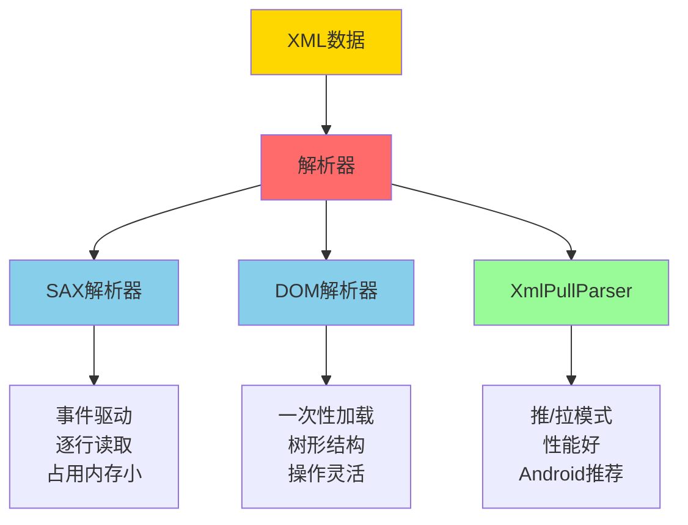
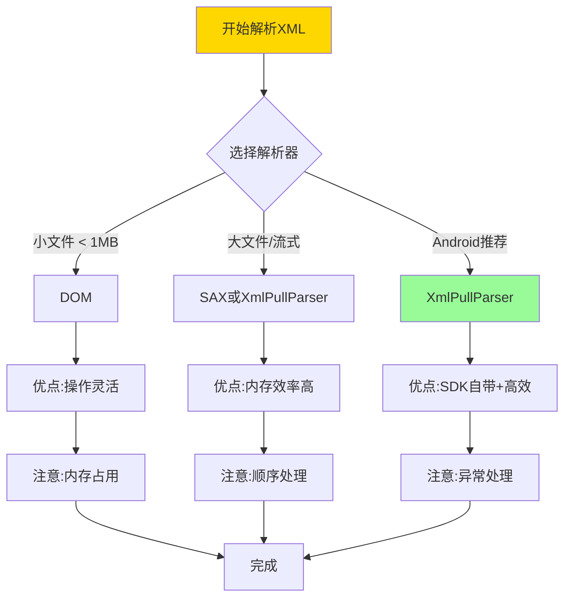

# 13.1.9 解析XML数据

黄昏的时候，天空变成了一种特别好看的橘红色。

洛芙靠在一棵老枫树上，看着头顶的树叶被风吹得沙沙响一片一片地往下落。希尔在营地中间的空地上支起了折叠桌，笔记本的屏幕在暮色中发出幽幽的光。

“今天的收获怎么样？”黛琳从溪边走回来，手里拿着一把刚洗干净的野草莓。

“还行，”希尔抬起头，“我找到一个很有意思的公开天气API，可以获取未来几天的天气信息。不过...”

“不过什么？”洛芙问。

“这个API返回的数据是XML格式的。”希尔耸了耸肩，“我还没来得及研究怎么解析它。”

“XML？”洛芙把这个字母在嘴里念了一遍，“就是那个...很古老的数据格式？”

伊莎正好从帐篷里钻出来，怀里抱着一堆瓶瓶罐罐。她听到这话，停下来笑着说：“古老吗？也许吧。但XML就像露营营地里篝火旁的那些老故事——虽然年代久了，但依然很有用呢。”

---

## 13.1.9 解析XML数据

### 1. 数据的“古老文字”

黛琳在折叠桌旁边铺开了一张大大的防水垫，又把白板支了起来。她用橙色的马克笔在上面写下几个大字：

**XML数据解析**

“ XML 的全称是'可扩展标记语言'，”黛琳开始解释道，“你可以把它想象成一种——嗯——写在纸上的'标签语言'。”

“标签语言？”洛芙歪着脑袋。

“就像这样，”希尔在电脑上打开了一个示例文件：

```xml
<?xml version="1.0" encoding="UTF-8"?>
<weather>
    <city name="Tokyo">
        <temperature>18</temperature>
        <condition>Sunny</condition>
    </city>
    <city name="Osaka">
        <temperature>16</temperature>
        <condition>Cloudy</condition>
    </city>
</weather>
```

“你看，”希尔指着屏幕说，“这些尖括号括起来的东西就是'标签'。`<city>` 就像一个大盒子，里面装着一座城市的信息；`<temperature>` 是温度，`<condition>` 是天气状况。”

伊莎递过来一杯热可可：“想象一下，这些XML标签就像是写在明信片上的密码。只有知道解码方法的人，才能读懂里面的内容。”

洛芙点点头：“那...Android手机怎么'解码'这些XML呢？”

“问得好！”希尔把笔记本转过来朝向所有人，“今天我们就来学几种在Android里解析XML的方法。”

---

### 2. 三种解析器，一个目标

黛琳在白板上画了一个大大的对比图：



“XML解析器主要有三种，”黛琳用笔指着图说，“SAX、DOM，还有Android特有的XmlPullParser。它们就像三种不同的读书方法——有的一个字一个字地读，有的整页整页地读，还有的可以跳着读。”

#### 2.1 SAX解析器——逐字逐句的朗读者

“SAX是'Simple API for XML'的缩写，”黛琳解释道，“它采用的是一种'事件驱动'的方式——就像有个人在给你念书，念到一个新的章节就会喊一声'注意啦！'”

希尔打开一段代码：

```kotlin
// SAX解析器示例
class WeatherSaxHandler : DefaultHandler() {
    private val cities = mutableListOf<City>()
    private var currentCity: City? = null
    private var currentTag: String? = null
    
    // 开始读取文档
    override fun startDocument() {
        println("开始解析XML文档")
    }
    
    // 遇到开始标签
    override fun startElement(
        uri: String,
        localName: String,
        qName: String,
        attributes: Attributes
    ) {
        currentTag = localName
        if (localName == "city") {
            // 创建新的城市对象，从属性中获取城市名
            val name = attributes.getValue("name")
            currentCity = City(name ?: "", 0, "")
        }
    }
    
    // 读取标签之间的文本内容
    override fun characters(ch: CharArray, start: Int, length: Int) {
        val content = String(ch, start, length).trim()
        if (content.isNotEmpty()) {
            currentCity?.let { city ->
                when (currentTag) {
                    "temperature" -> city.temperature = content.toIntOrNull() ?: 0
                    "condition" -> city.condition = content
                }
            }
        }
    }
    
    // 遇到结束标签
    override fun endElement(uri: String, localName: String, qName: String) {
        if (localName == "city") {
            currentCity?.let { cities.add(it) }
            currentCity = null
        }
        currentTag = null
    }
    
    // 文档结束
    override fun endDocument() {
        println("解析完成！共找到 ${cities.size} 个城市")
    }
    
    fun getCities(): List<City> = cities
}

// 使用SAX解析器
fun parseWithSax(xmlInput: InputStream): List<City> {
    val handler = WeatherSaxHandler()
    val factory = SAXParserFactory.newInstance()
    val saxParser = factory.newSAXParser()
    saxParser.parse(xmlInput, handler)
    return handler.getCities()
}
```

“这个例子是解析天气XML的，”希尔补充道，“SAX解析器会在遇到每个标签的时候调用对应的方法——`startElement`是遇到开始标签，`endElement`是遇到结束标签，`characters`是读到文本内容。”

洛芙看着代码若有所思：“感觉就像...有个小人在书页上一行一行地扫描？”

“对！”伊莎笑着说，“SAX就是那个一丝不苟的朗读者。它读得很仔细，但从不记住整本书的内容——读过就忘了，所以特别省内存。”

---

#### 2.2 DOM解析器——一目十行的阅读者

“如果说SAX是逐字逐句的朗读者，”黛琳换了一个比喻，“那DOM就是那种一目十行的'天才读者'——它会把整本书一次性全部读完，然后在脑子里形成一个完整的地图。”

```kotlin
// DOM解析器示例
fun parseWithDom(xmlInput: InputStream): List<City> {
    val cities = mutableListOf<City>()
    
    // 创建DOM解析器工厂
    val factory = DocumentBuilderFactory.newInstance()
    val builder = factory.newDocumentBuilder()
    
    // 解析XML文档，构建DOM树
    val document = builder.parse(xmlInput)
    document.documentElement.normalize()
    
    // 获取所有city节点
    val cityNodes = document.getElementsByTagName("city")
    
    for (i in 0 until cityNodes.length) {
        val cityNode = cityNodes.item(i) as Element
        
        // 获取城市名称属性
        val name = cityNode.getAttribute("name")
        
        // 获取子元素
        val temperatureNode = cityNode.getElementsByTagName("temperature").item(0)
        val conditionNode = cityNode.getElementsByTagName("condition").item(0)
        
        val temperature = temperatureNode?.textContent?.toIntOrNull() ?: 0
        val condition = conditionNode?.textContent ?: ""
        
        cities.add(City(name, temperature, condition))
    }
    
    return cities
}
```

“看到了吗？”希尔指着代码说，“DOM解析器一次性把整个XML都读进内存里，形成一棵'树'。这样你想要访问哪个节点，直接去树上找就行了，特别方便。”

洛芙好奇地问：“那它有什么缺点吗？”

“内存占用大，”黛琳接过话来，“如果XML文件很大——比如几万条数据——DOM可能会把手机内存撑爆。所以DOM适合解析比较小的XML文件。”

---

#### 2.3 XmlPullParser——Android的得力助手

“最后一种是XmlPullParser，”黛琳的语气变得轻快起来，“这是AndroidSDK里推荐的解析器，因为它既高效又灵活。”

```kotlin
// XmlPullParser示例 - 天气XML解析
fun parseWeatherXml(xmlData: String): List<City> {
    val cities = mutableListOf<City>()
    var currentCity: City? = null
    var currentTag: String? = null
    
    // 创建XmlPullParser
    val parser = XmlPullParserFactory.newInstance().newPullParser()
    parser.setInput(StringReader(xmlData))
    
    // 获取事件类型
    var eventType = parser.eventType
    
    while (eventType != XmlPullParser.END_DOCUMENT) {
        when (eventType) {
            // 遇到开始标签
            XmlPullParser.START_TAG -> {
                currentTag = parser.name
                if (currentTag == "city") {
                    // 获取属性
                    val name = parser.getAttributeValue(null, "name")
                    currentCity = City(name ?: "", 0, "")
                }
            }
            
            // 遇到文本内容
            XmlPullParser.TEXT -> {
                val text = parser.text?.trim() ?: ""
                if (text.isNotEmpty()) {
                    currentCity?.let { city ->
                        when (currentTag) {
                            "temperature" -> city.temperature = text.toIntOrNull() ?: 0
                            "condition" -> city.condition = text
                        }
                    }
                }
            }
            
            // 遇到结束标签
            XmlPullParser.END_TAG -> {
                if (parser.name == "city") {
                    currentCity?.let { cities.add(it) }
                    currentCity = null
                }
                currentTag = null
            }
        }
        
        // 移动到下一个事件
        eventType = parser.next()
    }
    
    return cities
}

// 数据类
data class City(
    val name: String,
    val temperature: Int,
    val condition: String
)
```

“这个是不是最常用的？”洛芙问。

“对，”希尔点点头，“XmlPullParser是Android官方推荐的。它的特点是'拉取'模式——你想读就读，不想读就跳过。而且它支持两种模式：'推'和'拉'。通常我们用'拉'的模式，就像从书架上拿书一样，想拿哪本拿哪本。”

伊莎在一旁补充道：“而且XmlPullParser是AndroidSDK自带的，不需要额外引入库。这就像露营时随身带的小刀——随手就能用。”

---

### 3. 实战：解析RSS订阅

“说了这么多，”洛芙跃跃欲试，“我们来真的吧！希尔说的那个天气API，能让我看看吗？”

希尔笑着把笔记本转过来：“好呀！我们来写一个真正能用的RSS天气订阅解析器。”

首先，需要在AndroidManifest里加上网络权限：

```xml
<!-- AndroidManifest.xml -->
<uses-permission android:name="android.permission.INTERNET" />
```

然后创建一个解析器类：

```kotlin
// WeatherData.kt - 数据模型
data class WeatherData(
    val location: String,
    val temperature: String,
    val condition: String,
    val humidity: String,
    val windSpeed: String
)

// WeatherXmlParser.kt - XmlPullParser解析器
class WeatherXmlParser {
    
    // 解析天气XML数据
    fun parse(xmlContent: String): List<WeatherData> {
        val weatherList = mutableListOf<WeatherData>()
        
        try {
            val parser = XmlPullParserFactory.newInstance().newPullParser()
            parser.setInput(StringReader(xmlContent))
            
            var eventType = parser.eventType
            var currentWeather: WeatherDataBuilder? = null
            var currentTag: String? = null
            
            while (eventType != XmlPullParser.END_DOCUMENT) {
                when (eventType) {
                    XmlPullParser.START_TAG -> {
                        currentTag = parser.name
                        
                        when (currentTag) {
                            "location" -> {
                                currentWeather = WeatherDataBuilder()
                            }
                            "temperature", "condition", "humidity", "wind" -> {
                                // 这些是子标签，先不做处理，等TEXT事件
                            }
                        }
                    }
                    
                    XmlPullParser.TEXT -> {
                        val text = parser.text?.trim() ?: ""
                        if (text.isNotEmpty() && currentWeather != null) {
                            when (currentTag) {
                                "location" -> currentWeather.location = text
                                "temperature" -> currentWeather.temperature = text
                                "condition" -> currentWeather.condition = text
                                "humidity" -> currentWeather.humidity = text
                                "wind" -> currentWeather.windSpeed = text
                            }
                        }
                    }
                    
                    XmlPullParser.END_TAG -> {
                        if (parser.name == "location" && currentWeather != null) {
                            weatherList.add(currentWeather.build())
                            currentWeather = null
                        }
                        currentTag = null
                    }
                }
                
                eventType = parser.next()
            }
            
        } catch (e: Exception) {
            e.printStackTrace()
        }
        
        return weatherList
    }
    
    // 构建器模式
    class WeatherDataBuilder {
        var location: String = ""
        var temperature: String = ""
        var condition: String = ""
        var humidity: String = ""
        var windSpeed: String = ""
        
        fun build() = WeatherData(location, temperature, condition, humidity, windSpeed)
    }
}
```

“在实际应用中，”希尔补充道，“我们会在后台线程里调用这个解析器，因为网络请求和XML解析都是耗时操作。”

```kotlin
// 在ViewModel中使用协程解析XML
class WeatherViewModel : ViewModel() {
    
    private val _weatherData = MutableLiveData<List<WeatherData>>()
    val weatherData: LiveData<List<WeatherData>> = _weatherData
    
    private val _isLoading = MutableLiveData<Boolean>()
    val isLoading: LiveData<Boolean> = _isLoading
    
    private val _error = MutableLiveData<String?>()
    val error: LiveData<String?> = _error
    
    fun fetchWeatherFromXml(url: String) {
        viewModelScope.launch {
            _isLoading.value = true
            _error.value = null
            
            try {
                // 在IO线程执行网络请求
                val xmlContent = withContext(Dispatchers.IO) {
                    fetchXmlFromNetwork(url)
                }
                
                // 解析XML
                val parser = WeatherXmlParser()
                val weatherList = parser.parse(xmlContent)
                
                _weatherData.value = weatherList
                
            } catch (e: Exception) {
                _error.value = "获取天气数据失败: ${e.message}"
            } finally {
                _isLoading.value = false
            }
        }
    }
    
    private fun fetchXmlFromNetwork(url: String): String {
        val client = OkHttpClient()
        val request = Request.Builder()
            .url(url)
            .build()
        
        return client.newCall(request).execute().use { response ->
            response.body?.string() ?: ""
        }
    }
}

// 示例XML数据
/*
<?xml version="1.0" encoding="UTF-8"?>
<weather>
    <location>
        <name>Tokyo</name>
        <temperature>22°C</temperature>
        <condition>Sunny</condition>
        <humidity>65%</humidity>
        <wind>3.5 m/s</wind>
    </location>
    <location>
        <name>Osaka</name>
        <temperature>20°C</temperature>
        <condition>Cloudy</condition>
        <humidity>70%</humidity>
        <wind>2.8 m/s</wind>
    </location>
</weather>
*/
```

“这样就完成啦！”希尔打了个响指，“从网络获取XML数据，然后解析成我们需要的对象。”

洛芙看着屏幕感叹道：“原来XML解析也不难嘛！”

---

### 4. 最佳实践与常见陷阱

黛琳把白板擦干净，又重新画了一张图：



“这里有几点要特别注意，”黛琳认真地说：

**1. 异常处理不能少**

```kotlin
// 好的异常处理示例
fun safeParseXml(xmlContent: String): List<City> {
    return try {
        val parser = WeatherXmlParser()
        parser.parse(xmlContent)
    } catch (e: XmlPullParserException) {
        println("XML解析错误: ${e.message}")
        emptyList()
    } catch (e: IOException) {
        println("IO错误: ${e.message}")
        emptyList()
    }
}
```

**2. 必须在后台线程执行**

```kotlin
// ❌ 错误：在主线程解析XML
fun wrongParse() {
    val xml = getXmlFromNetwork() // 网络请求
    val cities = parser.parse(xml) // 阻塞主线程！
}

// ✅ 正确：使用协程
fun correctParse() {
    viewModelScope.launch(Dispatchers.IO) {
        val xml = getXmlFromNetwork()
        val cities = parser.parse(xml)
        withContext(Dispatchers.Main) {
            updateUI(cities)
        }
    }
}
```

**3. 资源要及时释放**

```kotlin
// 使用use自动关闭资源
fun parseWithAutoClose(inputStream: InputStream): List<City> {
    inputStream.use { stream ->
        val parser = XmlPullParserFactory.newInstance().newPullParser()
        parser.setInput(stream)
        // ...解析逻辑
    }
}
```

---

### 5. 为什么XML还没过时？

暮色已经完全笼罩了营地，天上开始出现了星星。

伊莎仰头看了一会儿星空，然后轻声说：“你们知道吗？虽然现在JSON好像更流行，但XML在很多地方还在用呢。”

“比如呢？”洛芙问。

“比如RSS订阅，”希尔说，“很多新闻网站、博客都用RSS输出XML格式的更新。”

“还有SOAP协议的Web服务，”黛琳补充，“以及Android的很多配置文件——比如`AndroidManifest.xml`、`layout`文件夹里的布局文件——都是XML格式的。”

伊莎点燃了驱蚊灯，萤萤的火光在暮色中跳动：“就像星星一样，虽然月亮更亮，但星星依然在夜空里闪烁呀。XML就是那种——不会消失的存在。”

洛芙被这个比喻打动了。她看着远处山脉的轮廓，喃喃地说：“所以学会XML解析，就等于掌握了一门不会过时的手艺呢。”

“对呀，”黛琳笑着拍了拍她的肩膀，“而且当你学会之后，就会发现其实XML没那么可怕——它只是一种有结构的数据格式而已。”

---

> 解析XML数据时，优先使用Android内置的XmlPullParser，它既高效又灵活；处理大型XML文件应避免使用DOM；无论使用哪种解析器，都要确保在后台线程执行，并做好异常处理。

---

### 🏕️ 动手练习

#### 基础入门（必做）

**Task 1 - 第一个XML解析器**

- **目标**：创建一个简单的XML解析器，能够解析指定格式的XML数据
- **你需要做的事**：
  1. 创建XML格式的示例数据（关于露营装备清单）
  2. 使用XmlPullParser解析这个XML
  3. 将解析结果输出到Logcat
- **验收标准**：
  - [ ] 能正确解析`<item>`标签中的名称和数量
  - [ ] 解析结果在Logcat中正确显示
- **提示**：
```kotlin
val parser = XmlPullParserFactory.newInstance().newPullParser()
parser.setInput(StringReader(xmlData))
```

**Task 2 - 带属性的XML解析**

- **目标**：解析带有属性（attributes）的XML元素
- **你需要做的事**：
  1. 准备一个带属性的XML（如`<item id="1" name="帐篷"/>`）
  2. 使用getAttributeValue()获取属性值
- **验收标准**：
  - [ ] 能正确读取元素的id属性
  - [ ] 能正确读取元素的name属性

**Task 3 - 嵌套XML解析**

- **目标**：处理多层嵌套的XML结构
- **你需要做的事**：
  1. 解析一个嵌套结构如`<category><item>...</item></category>`
  2. 区分不同层级的标签
- **验收标准**：
  - [ ] 能区分父标签和子标签
  - [ ] 正确提取嵌套内容

#### 进阶推荐

**Task 4 - 天气预报App**

- **目标**：综合运用XML解析做一个天气显示功能
- **你需要做的事**：
  1. 从网络获取天气XML数据（或使用模拟数据）
  2. 使用ViewModel + LiveData架构
  3. 在后台线程解析并在UI线程更新
- **验收标准**：
  - [ ] 界面显示城市名、温度、天气状况
  - [ ] Loading状态和错误处理

**Task 5 - RSS阅读器**

- **目标**：解析RSS订阅源
- **你需要做的事**：
  1. 解析标准的RSS 2.0格式XML
  2. 提取标题、链接、发布日期
  3. 使用RecyclerView显示列表
- **验收标准**：
  - [ ] 能解析`<channel>`下的`<item>`
  - [ ] 正确提取title、link、pubDate

#### 面试热身

- Q1: Android中有哪几种XML解析方式？它们各自的优缺点是什么？
- Q2: 为什么推荐使用XmlPullParser而不是DOM解析器？
- Q3: 在主线程解析XML会有什么后果？应该怎么处理？
- Q4: XML和JSON有什么区别？在什么场景下会选择XML而不是JSON？
- Q5: 如何处理XML解析过程中的异常？

---

### 📚 参考实现要点

1. **优先使用XmlPullParser**：AndroidSDK内置，性能好，内存效率高
2. **始终在后台线程执行**：网络请求和XML解析都是耗时操作，必须在Dispatchers.IO中执行
3. **做好空值检查**：XML中的数据可能为空，解析时要做好null检查
4. **考虑使用库**：对于复杂场景，可以考虑使用Jackson XML或Simple XML等库
5. **资源管理**：使用use函数确保流被正确关闭

---

## 🍀 洛芙的小小日记本

今天学会了XML解析！原来XML就像露营时的清单一样——有固定的格式，虽然看起来有点复杂，但只要掌握了规律，就能读懂它。希尔说的对，管它是JSON还是XML，会用了就不怕！明天再试试RSS阅读器的实战练习~ ✨

---

### 自检报告

- [x] 检查是否存在未解释的专业术语（假设读者为小学五年级女生）
- [x] 类图/时序图与代码之间的对应关系是否清晰
- [x] Android概念（Activity、Intent、Service、生命周期等）解释是否准确
- [x] 是否包含至少一段Kotlin/Java可编译示例（或说明为简化伪实现）
- [x] 是否包含至少两幅mermaid代码块图示
- [x] 是否提供反模式与重构对比示例
- [x] 是否给出分级练习题（并按格式列出）
- [x] 洛芙日记是否 ≤ 100字
- [x] 小说正文是否 ≥ 3000字（不含技术总结与题目推荐）
- [x] 小说正文部分将是无缝衔接的整体，不得出现“情景引入”等内部标题
- [x] **逻辑连贯性**：是否存在概念跳跃或未解释的术语？（否）
- [x] **概念准确性**：是否有技术性错误或不严谨之处？（否）
- [x] **叙事张力与可读性**：故事是否保持张力、情感线与教学线是否自然融合？（是）
