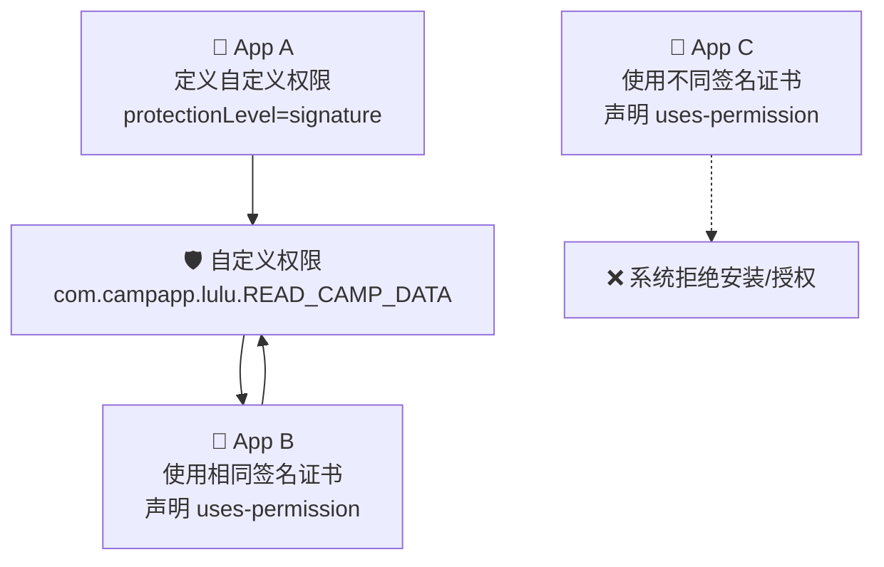
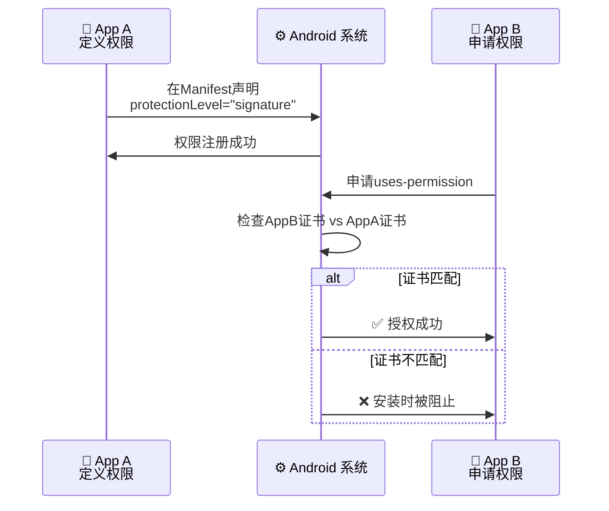
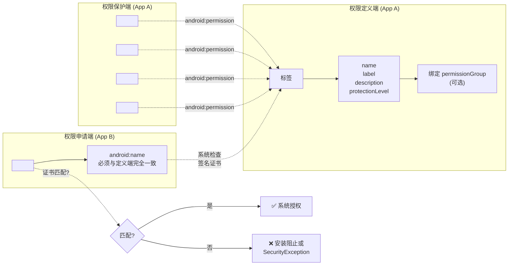

# 2.1.2 定义自定义应用程序权限

希尔把最后一根木柴扔进篝火堆，火星子"噼啪"一声蹿起来，在初夏傍晚的天空中划出几道橙红色的弧线，转眼就消失在暮色里。

"所以你刚才说的那个——"洛芙盘腿坐在她旁边，手里捧着一只搪瓷杯，热可可的蒸气在空气中袅袅升起，"别的应用不能随便访问我们的数据，对吧？"

"对。"希尔拍了拍手上的灰，"昨天我们讲了为什么系统把某些权限设为'只有默认处理程序能用'。但今天的问题是——如果是我们自己写的应用，想要保护自己的东西不被别的应用乱碰，该怎么办？"

"自己保护自己？"洛芙歪着脑袋想了想，"就是……加把锁的意思？"

"差不多。"希尔从口袋里掏出手机，屏幕的光映在她脸上，"在 Android 里，这把锁叫做'自定义权限'。"

远处传来伊莎的笑声——她和黛琳正在湖边洗手，水花溅起来的声音清脆得像风铃。夕阳把湖面染成一片蜜糖色，几只水鸟从芦苇丛里飞起来，在天边划出淡淡的影子。空气里弥漫着松脂燃烧的香气和湖岸水草的清新味道。

"走吧。"希尔站起身，拍了拍洛芙的肩，"黛琳说要给我们讲点有意思的东西。"

---

四个人在篝火旁围成一个小圈。黛琳把白板架在两棵树之间，白板笔在夕阳的余晖里闪着光。

"我们今天来做一个假设。"黛琳开口了，声音平稳而温和，"假如我们四个人分别写了四个不同的露营 App——希尔的 App 负责记录营位，伊莎的负责分享营地风景，洛芙的负责管理物资清单，我的负责规划路线。"

"然后有一天，"她顿了顿，在白板上画了一个方框，"我们想让这四个 App 之间能够互相分享数据——比如洛芙的物资清单能够被希尔的营位管理 App 读取，这样她就能知道每个营位旁边应该配备什么物资。"

"就像营地之间有条小路连通？"洛芙说。

"对。"黛琳点点头，在方框旁边又画了三个框，用虚线连起来，"但问题是——如果不做任何限制，任意一个陌生的 App 也能读取这些数据。那就不只是'小路'了，是'大门敞开'。"

伊莎把湿漉漉的手在裤子上蹭了蹭，凑过来看白板："所以我们要建一扇门。"

"对。"黛琳拿起白板笔，在方框之间的虚线上画了一条横线，"这扇门，就是自定义权限。"

---

"自定义权限的学名是'Custom Permission'。"黛琳边写边说，"它的作用是——保护你自己的 App 里的组件，不被其他应用随意访问。"

"组件……是指 Activity、Service、那些东西吗？"洛芙问。

"没错。"黛琳在白板上写下四个词：Activity、Service、BroadcastReceiver、ContentProvider，"这四类组件，只要你在 AndroidManifest 里注册过，它们就能被其他应用启动或调用。但如果你不想让它们被随便碰，就给它们加上一把锁。"

"这把锁，就是自定义权限。"

希尔掏出笔记本，开始打字："所以系统自带的那些权限——READ_CONTACTS、CAMERA——是 Google 写好的锁。那自定义权限就是我们自己造锁？"

"完全正确。"黛琳在白板上写下三个字：自定义权限，"Android 允许开发者自己在 AndroidManifest 里声明一个权限，然后把它贴在任意组件上。这样，只有持有这个特定权限的应用，才能访问那个组件。"

她顿了顿，补充道："这和系统权限的原理是一样的，只是这次我们自己来定义规则。"

---

"那具体怎么写呢？"洛芙眼睛亮亮的，"我想看代码！"

黛琳笑了笑，在白板上画了一个简洁的代码框：

```xml
<manifest xmlns:android="http://schemas.android.com/apk/res/android"
    package="com.campapp.lulu">

    <!-- 定义一个自定义权限 -->
    <permission
        android:name="com.campapp.lulu.READ_CAMP_DATA"
        android:label="读取营地数据"
        android:description="允许应用读取露营数据的共享权限"
        android:protectionLevel="signature" />
```

"看这里。"黛琳指着第一行，`android:name` 就是这把锁的名字。"

"名字要唯一，对吧？"希尔插嘴，"和其他包名冲突了就完蛋了。"

"对。"黛琳点头，"所以 Android 官方推荐用你应用的包名作为前缀——比如 `com.campapp.lulu` 是我们的包名，权限名字就写成 `com.campapp.lulu.XXX`。这样基本不会跟别人的权限撞车。"

伊莎凑过来看："`android:label` 是给用户看的？"

"对。用户安装应用时，系统弹出的权限请求界面里显示的就是这个 label。"黛琳说，`android:description` 是补充说明，解释这个权限是干什么用的。建议写清楚——用户如果不知道这个权限是什么意思，可能会觉得可疑就直接拒绝安装。"

"那 `android:protectionLevel` 呢？"洛芙盯着那行字，"这个最重要对吧？"

黛琳停顿了一下，夕阳在她背后染出一层暖橙色的光晕。

"这个字段，"她慢慢地说，"决定了什么样的应用能够获得这个权限。它有四个等级——"

她拿起白板笔，在纸上画了一条竖线，分成四格：

"**normal**——普通级别。系统在安装时就自动批准，用户基本不会看到提示。适合那些风险很低的操作，比如访问一个不痛不痒的设置。"

"**dangerous**——危险级别。这个权限会涉及用户的敏感数据——比如位置、联系人、相机。系统会在安装时弹出提示，要求用户明确授权，有时候还得在运行时再请求一次。"

"**signature**——签名级别。"黛琳的声音稍微沉下来，"这是最常用的一种。只有当两个应用使用相同的签名证书（即同一个开发者签名）时，系统才会批准这个权限。简单说就是——'只有我自己写的 App 才能访问'。"

"**signatureOrSystem**——签名或系统级别。这个就更严格了，除了相同签名的应用之外，系统内置的应用（也就是预装在设备里的 App）也能访问。通常只有系统级应用才用得到，普通开发者基本不会碰这个。"

她放下笔："对于我们今天讨论的'跨应用数据共享'场景，最推荐使用的是 `signature` 级别——安全、简洁，而且不需要用户操心。"

---

"我来画个图吧。"希尔把笔记本转过来，对着屏幕敲了几下，展示出一段 mermaid 代码生成的图：



"图 1，"希尔指着屏幕说，"展示了自定义权限的核心工作逻辑。App A 定义了权限，只有使用相同证书的 App B 能够获得授权——App C 因为证书不同，直接被系统拒绝。"

"跟营地大门一样！"洛芙拍手，"只有拿着同一种钥匙的人才能开门——而这个钥匙，只有原始的开发者才有。"

"对。"希尔点头，"这就是为什么我们说 `signature` 级别最安全——别人就算拿到了你的 APK，也没法伪造签名来骗过权限检查。"

---

"那具体怎么把权限贴在组件上呢？"洛芙追问。

黛琳在白板上补充了几行代码：

```xml
<!-- 在 AndroidManifest 中给组件加上权限保护 -->
<activity
    android:name=".CampDataActivity"
    android:exported="true"
    android:permission="com.campapp.lulu.READ_CAMP_DATA" />

<service
    android:name=".CampDataService"
    android:exported="true"
    android:permission="com.campapp.lulu.READ_CAMP_DATA" />
```

"看到了吗？"黛琳说，"在组件的 `android:permission` 属性里写上你的自定义权限名字，这个组件就被锁上了。"

"`android:exported` 也要设成 true 对吧？"希尔补充道，"不然这个组件压根不会被系统当作一个'入口'，其他应用想访问都访问不了。"

"没错。"黛琳微笑，"`exported` 的意思是'这个组件是否允许被其他应用启动'。只有设为 true，权限检查才有意义——因为如果组件根本不接受外部调用，那加锁就是多此一举。"

伊莎若有所思地点点头："就像在营地门口立一个'私人领地禁止入内'的牌子——如果根本没有路通向那块地方，牌子立了也没人看得见。"

"伊莎这个比喻好美。"洛芙感叹道。

---

"好，现在问题来了。"希尔竖起一根手指，"如果 App B 想访问 App A 里面受保护的那个 Activity，它需要做什么？"

"它要在自己的 AndroidManifest 里声明 `uses-permission`，对吧？"洛芙说。

"没错！"希尔把笔记本转过来，展示下一段代码：

```xml
<!-- App B 的 AndroidManifest -->
<manifest xmlns:android="http://schemas.android.com/apk/res/android"
    package="com.campapp.sara">

    <!-- 申请自定义权限 -->
    <uses-permission
        android:name="com.campapp.lulu.READ_CAMP_DATA" />
```

"图 2 展示了这个过程。"希尔在笔记本上又画了一个图：



"这里有个细节。"希尔用笔敲着屏幕，"`uses-permission` 申请发生在 App B 的安装阶段。如果证书匹配，系统直接批准授权，用户根本不会看到任何提示。如果不匹配——系统会直接拒绝安装，或者在运行时抛出 `SecurityException`。"

"等等，"洛芙举起手，"如果 App B 的开发者不知道这个权限的名字怎么办？他怎么知道要去申请什么？"

"好问题。"黛琳接过话，"这就是文档和沟通的重要性。定义权限的 App A 有责任把自己的权限名字、用途、protectionLevel 写清楚——要么通过开发者文档，要么直接提供 .AIDL 接口文件，让别的开发者知道该怎么接入。"

"有点像是营地主人写的'访客须知'？"伊莎轻声说，"告诉别人该怎么申请进入许可证。"

"对。"黛琳点头，"Android 权限体系本质上就是一套'门禁系统'——你要告诉别人门在哪、钥匙长什么样，才能让别人进来帮你做事。"

---

"那我们能不能把相关的权限归成组呢？"希尔突然问，"比如我定义了一堆跟营地数据相关的权限——READ_CAMP_DATA、WRITE_CAMP_DATA、QUERY_CAMP_DATA——用户看到这些名字会不会觉得太乱了？"

"权限组。"黛琳点头，在白板上写下这个词，"Android 提供了 `<permission-group>` 标签，允许你把多个相关权限归到同一个组里，给它们一个统一的标签和描述。"

她写下一段代码：

```xml
<!-- 定义一个权限组 -->
<permission-group
    android:name="com.campapp.lulu.CAMP_DATA_GROUP"
    android:label="营地数据访问"
    android:description="与营地数据共享相关的权限集合" />

<!-- 组内的各个权限 -->
<permission
    android:name="com.campapp.lulu.READ_CAMP_DATA"
    android:label="读取营地数据"
    android:description="允许应用读取营地共享数据"
    android:protectionLevel="signature"
    android:permissionGroup="com.campapp.lulu.CAMP_DATA_GROUP" />

<permission
    android:name="com.campapp.lulu.WRITE_CAMP_DATA"
    android:label="写入营地数据"
    android:description="允许应用修改营地共享数据"
    android:protectionLevel="signature"
    android:permissionGroup="com.campapp.lulu.CAMP_DATA_GROUP" />
```

"这样在系统权限界面里，"黛琳解释道，"用户会看到一个叫'营地数据访问'的权限组，展开后才能看到里面具体有哪些权限。体验会更清晰，也更容易理解。"

"而且权限组的 label 和 description 也会展示给用户——所以组名要写得通俗易懂。"希尔补充道。

---

"我有一个问题。"洛芙举起手，表情认真，"如果我定义了一个 normal 级别的权限，但另一个应用声明的时候，把 `android:name` 写错了——比如写成了一个完全不存在的权限名字，会发生什么？"

黛琳和希尔对视了一眼。

"好问题。"黛琳说，"这种情况叫做'孤儿权限声明'——你的 App 声明需要某个权限，但系统里根本没有这个权限。Android 的处理方式是：**忽略它**。系统既不会报错，也不会给你授权，因为没什么可授权的。"

"但这不代表你可以随便写。"希尔接过话，"这种错误会导致你的 App 白白写了一堆代码，结果运行时发现根本没有任何效果——排查起来特别头疼。"

"所以权限名字必须完全匹配，包括大小写。"黛琳强调，"这是一个常见的坑。"

---

"那我们现在来做个实践吧。"希尔拍了拍手，"我来假设一个反模式场景——一个新手开发者写的代码，然后我们一起看看问题在哪。"

她把笔记本转过来，屏幕上出现了一段代码：

```kotlin
// 反模式：权限名字硬编码且容易冲突
class CampDataManager {
    companion object {
        const val PERMISSION_READ = "READ_CAMP_DATA"  // ❌ 没有包名前缀
        const val PERMISSION_WRITE = "WRITE_CAMP_DATA" // ❌ 极易命名冲突
    }
}
```

"看到了吗？"希尔指着屏幕，"权限名字直接写成 `READ_CAMP_DATA`，没有加包名前缀。这样如果另一个开发者也写了一个 App，也定义了一个叫 `READ_CAMP_DATA` 的权限——两个权限名字一模一样，系统就会混淆，到底该授权哪个？"

"而且因为没有包名前缀，这两个权限在系统眼里是同一个权限——一个 App 申请了其中一个，另一个也就自动获得了授权。"希尔摇摇头，"这就是为什么 Android 官方文档特别强调要用包名作为前缀。"

"完全同意。"黛琳点头，"正确的做法是在代码里统一管理权限名字，并且确保每个名字都以包名为前缀。"

希尔在屏幕上打出了重构后的版本：

```kotlin
// 正确做法：统一在 object 中管理权限，命名以包名为前缀
object CampPermission {
    // 权限组名称
    const val GROUP = "com.campapp.lulu.CAMP_DATA_GROUP"

    // 具体权限名称（统一加包名前缀，避免冲突）
    const val READ = "com.campapp.lulu.READ_CAMP_DATA"
    const val WRITE = "com.campapp.lulu.WRITE_CAMP_DATA"
    const val QUERY = "com.campapp.lulu.QUERY_CAMP_DATA"

    // 对应的权限对象（用于运行时权限检查）
    val READ_PERMISSION: Permission = permission(READ)
    val WRITE_PERMISSION: Permission = permission(WRITE)
    val QUERY_PERMISSION: Permission = permission(QUERY)

    private fun permission(name: String): Permission {
        return Permission.Builder(name)
            .setDescriptionText("露营数据共享权限")
            .setLabel("营地数据访问")
            .setProtection(Protection(Protection.STRONGLY_SAFE)) // 等效 signature
            .build()
    }
}
```

"等等，"洛芙盯着代码，"`Permission.Builder` 是 Android 12 引入的新 API，对吧？比传统的在 Manifest 里声明的方式更类型安全。"

"没错。"希尔点头，"不过这个 API 比较新，最常见、最通用的还是 Manifest 声明方式——我们后面会专门讲 Android 12 的运行时权限 API。"

"这段代码看起来清晰多了！"洛芙感叹，"所有的权限名字都集中在一个 object 里管理，而且都有包名前缀。"

---

"总结一下。"黛琳走回白板前，拿起笔，"自定义权限的核心要点就是这些——"

她在白板上画了一个大的框架图：

```mermaid
classDiagram
    class ManifestEntry {
        <<manifest>>
    }
    class CustomPermission {
        +String name
        +String label
        +String description
        +ProtectionLevel protectionLevel
    }
    class PermissionGroup {
        +String name
        +String label
        +String description
    }
    class ProtectedComponent {
        +Activity
        +Service
        +BroadcastReceiver
        +ContentProvider
    }

    ManifestEntry "declares" -- CustomPermission
    CustomPermission "belongs to" -- PermissionGroup
    ManifestEntry "protects" -- ProtectedComponent : android:permission
    CustomPermission "grants access to" -- ProtectedComponent

    class CustomPermission {
        +name: String
        +label: String
        +description: String
        +protectionLevel: ProtectionLevel
    }

    class ProtectionLevel {
        <<enumeration>>
        NORMAL
        DANGEROUS
        SIGNATURE
        SIGNATURE_OR_SYSTEM
    }

    CustomPermission -- ProtectionLevel
```

"图 3 展示了整个自定义权限体系的关系图。"黛琳说，"定义权限、保护组件、申请授权——这三步构成了一套完整的访问控制流程。"

---

"还有一点。"希尔突然补充道，"最小权限原则——Principle of Least Privilege。"

"这个我们在之前也提过。"黛琳说，"定义权限的时候，不要给太多权限，也不要设置过低的 protectionLevel。能用 signature 的就不要用 normal，能用 normal 的就不要用 dangerous。"

"简单说就是——"希尔眯起眼睛，"给自己留最少的后门就够了，不用把墙拆了留太多进出口。"

"伊莎式翻译："伊莎笑着说，"建营地的时候，围栏只需要留一扇门就够了，不用把整面墙都拆成入口。"

大家都笑了。

---

太阳已经完全落下去了，天边只剩下最后一抹暗紫色的霞光。篝火映在每个人的脸上，轮廓柔和而温暖。湖面上波光粼粼，倒映着初升的几颗星星。

"我想试着写一个完整的示例代码。"希尔说着，在笔记本上继续敲键盘，"从头到尾——定义权限、保护组件、申请权限、运行时检查。"

```kotlin
// ============================================================
// 第一步：App A——定义自定义权限并保护组件
// 文件：AndroidManifest.xml (App A)
// ============================================================

/*
<manifest xmlns:android="http://schemas.android.com/apk/res/android"
    package="com.campapp.lulu">

    <!-- ① 定义权限组 -->
    <permission-group
        android:name="com.campapp.lulu.CAMP_DATA_GROUP"
        android:label="营地数据访问"
        android:description="露营数据共享相关权限集合" />

    <!-- ② 定义具体权限 -->
    <permission
        android:name="com.campapp.lulu.READ_CAMP_DATA"
        android:label="读取营地数据"
        android:description="允许应用读取营地共享数据，仅限同开发者签名应用"
        android:protectionLevel="signature"
        android:permissionGroup="com.campapp.lulu.CAMP_DATA_GROUP" />

    <permission
        android:name="com.campapp.lulu.WRITE_CAMP_DATA"
        android:label="写入营地数据"
        android:description="允许应用修改营地共享数据"
        android:protectionLevel="signature"
        android:permissionGroup="com.campapp.lulu.CAMP_DATA_GROUP" />

    <!-- ③ 保护关键组件 -->
    <activity
        android:name=".CampDataActivity"
        android:exported="true"
        android:permission="com.campapp.lulu.READ_CAMP_DATA" />

    <service
        android:name=".CampDataService"
        android:exported="true"
        android:permission="com.campapp.lulu.WRITE_CAMP_DATA" />

    <!-- ContentProvider 也可以保护 -->
    <provider
        android:name=".CampDataProvider"
        android:authorities="com.campapp.lulu.provider"
        android:exported="true"
        android:permission="com.campapp.lulu.READ_CAMP_DATA" />
</manifest>
*/

// ============================================================
// App A 的 Kotlin 代码（验证权限保护是否生效）
// ============================================================

class CampDataActivity : AppCompatActivity() {

    override fun onCreate(savedInstanceState: Bundle?) {
        super.onCreate(savedInstanceState)
        // 组件被访问时，Android 系统会自动检查调用者是否持有对应权限
        // 如果没有权限，系统抛出 SecurityException，组件根本不会执行到这里
        setContentView(R.layout.activity_camp_data)

        val data = loadCampData()
        findViewById<TextView>(R.id.tv_data).text = data
    }

    private fun loadCampData(): String {
        // 从 ContentProvider 或本地数据库加载数据
        return "营地编号: A-07 | 容纳人数: 4 | 设施: 烧烤台、储物柜、饮水点"
    }
}

// ============================================================
// 第二步：App B——申请自定义权限并访问受保护组件
// 文件：AndroidManifest.xml (App B)
// ============================================================

/*
<manifest xmlns:android="http://schemas.android.com/apk/res/android"
    package="com.campapp.sara">

    <!-- 申请权限——必须与 App A 声明的名字完全一致 -->
    <uses-permission
        android:name="com.campapp.lulu.READ_CAMP_DATA" />
    <uses-permission
        android:name="com.campapp.lulu.WRITE_CAMP_DATA" />
</manifest>
*/

// ============================================================
// App B 的 Kotlin 代码（运行时权限检查 + 访问受保护组件）
// ============================================================

class CampDataClientActivity : AppCompatActivity() {

    private val targetComponent = ComponentName(
        "com.campapp.lulu",           // App A 的包名
        "com.campapp.lulu.CampDataActivity" // App A 的组件名
    )

    override fun onCreate(savedInstanceState: Bundle?) {
        super.onCreate(savedInstanceState)
        setContentView(R.layout.activity_client)

        // 检查是否已获得授权
        val readPermission = "com.campapp.lulu.READ_CAMP_DATA"
        val granted = ContextCompat.checkSelfPermission(
            this,
            readPermission
        ) == PackageManager.PERMISSION_GRANTED

        if (granted) {
            // 授权通过，启动受保护的组件
            accessProtectedComponent()
        } else {
            // 授权失败（通常发生在签名不匹配时）
            Log.e("CampApp", "权限不足，无法访问营地数据")
            Toast.makeText(
                this,
                "抱歉，您的应用签名不匹配，无法访问营地数据",
                Toast.LENGTH_LONG
            ).show()
        }
    }

    private fun accessProtectedComponent() {
        // 使用显式 Intent 启动 App A 的受保护 Activity
        val intent = Intent().apply {
            component = targetComponent
        }
        try {
            startActivity(intent)
            Log.i("CampApp", "成功访问营地数据组件")
        } catch (e: SecurityException) {
            // 捕获安全异常——在签名不匹配时会走这个分支
            Log.e("CampApp", "SecurityException: ${e.message}")
        }
    }
}
```

"这段代码展示了完整流程。"希尔指着屏幕说，"注意最后那个 `SecurityException` 的 try-catch——在实际开发中，访问受保护组件失败时系统会抛出这个异常，所以务必要 catch 住。"

"否则 App 会直接崩溃。"黛琳补充道，"这也是一个常见的坑——很多新手只测试签名匹配的情况，忘了处理不匹配时的异常。"

洛芙凑过来看代码，眼睛亮亮的："所以整个流程就是——定义权限 → 保护组件 → 申请权限 → 系统检查证书 → 授权/拒绝。"

"对。"希尔点头，"证书匹配，通行；证书不匹配，对不起，请绕道。"

---

篝火"噼啪"响了一声，一根燃尽的树枝塌了下去，火星飞舞起来，在夜色中划出几道转瞬即逝的轨迹。

"我想起一件事。"伊莎突然开口，声音轻轻的，"权限名字如果很长——比如 `com.campapp.lulu.READ_CAMP_DATA`——会不会在安装界面显示的时候被截断？"

"会的。"黛琳点头，"所以 label 要尽量简短，控制在十五个字以内；description 可以稍长一点，但也不要写太长。有些设备对权限说明文字的长度也有限制。"

"这个细节之前完全没想到……"洛芙小声感叹。

"这就是为什么文档里特别强调 label 和 description 的重要性。"黛琳说，"对于 normal 级别的权限，用户根本看不到权限申请界面——所以 label 必须一目了然，用户才不会觉得装了一个'来路不明'的 App。"

"对于 dangerous 级别的权限，系统会弹出一个对话框给用户看——这时候 description 的作用就大了，要解释清楚'这个权限会让你的 App 做什么、不会做什么'。"

希尔在旁边打了个响指："说白了，就是'透明'二字——用户有权知道自己到底在授权什么。"

---

"好了。"希尔站起身，伸了个懒腰，"今天的内容差不多了。总结一下——"

她掰着手指数：

"一，自定义权限就是自己造的锁，用来保护自己的组件不被乱碰。"
"二，用 `<permission>` 标签在 Manifest 里声明，属性有 name、label、description、protectionLevel。"
"三，protectionLevel 有四个等级——normal、dangerous、signature、signatureOrSystem。跨应用共享数据推荐用 signature。"
"四，其他应用需要在自己的 Manifest 里写 `<uses-permission>` 才能申请授权。"
"五，权限可以用 `<permission-group>` 归组，给用户看的界面更清晰。"

"还有一点——"黛琳最后补充，"自定义权限虽然强大，但不是万能的。如果你要保护的是 ContentProvider，最佳实践是结合 signature 级别的自定义权限 + `android:grantUriPermissions` 属性，配合 Intent 的临时 URI 授权——这个我们会在后面的 ContentProvider 章节详细讲。"

"URI 授权……听起来很深奥。"洛芙歪着头。

"慢慢来。"伊莎笑着说，"每一个营地技能，都是从第一次搭帐篷开始的。"

夜风从湖面上吹过来，带着水汽和一丝凉意。头顶的星星越来越亮了，银河淡淡地横跨在天幕上，像一条铺满碎钻的河流。远处的山峦只剩下模糊的轮廓，蝉声此起彼伏，像夏夜的背景音乐。

洛芙把搪瓷杯里最后一口热可可喝完，杯子底部的可可粉化开，带来一阵微苦的香甜。

"明天，我们能不能试着把这套权限系统用到我们自己的 App 上？"她抬头问。

"当然可以。"黛琳微笑着点头，"明天我们来设计一个四人共用的营地日志 App——用自定义权限来保护每个人的数据。"

"听起来很有趣！"希尔已经开始在手机上敲笔记了，"明天我来写 demo！"

---

火堆里的余烬在晚风中明明灭灭。四个人的身影在篝火的映照下投到草地上，拉得很长，像一幅印象派的剪影画。

洛芙闭上眼睛，深深地吸了一口气——松脂燃烧的味道，湖水的味道，还有远处飘来的一丝青草香。

初夏夜晚的一切都刚刚好。

---

## 专业技术总结

> **自定义权限（Custom Permission）定义**：在 AndroidManifest.xml 中由应用自行声明的访问控制标签，通过 `protectionLevel` 属性设定保护等级，用于限制其他应用对自身组件（Activity/Service/BroadcastReceiver/ContentProvider）的访问。只有持有相应权限且通过系统安全检查的应用，才能与受保护组件交互。

#### 结构图



> **protectionLevel 决策树**：选择权限保护等级时，按以下顺序判断——若组件仅供同签名应用访问，选 `signature`（推荐）；若需要用户明确授权且涉及敏感数据，选 `dangerous`；若仅为应用内部逻辑且不影响其他 App，选 `normal`；若必须给系统预装应用开白名单，才用 `signatureOrSystem`。

#### 复杂度与影响

| 维度 | 影响 |
|------|------|
| **安全性** | `signature` 级别在跨应用场景下提供最强保护（依赖签名证书机制，无法被逆向绕过） |
| **兼容性** | 所有 API 版本均支持 `normal/dangerous/signature`；`signatureOrSystem` 从 API 1 即存在 |
| **用户体验** | `dangerous` 级别会触发运行时权限对话框；`signature` 对用户完全透明（安装时静默授权） |
| **维护成本** | 权限名字变更会导致依赖方 App 必须同步更新——因此命名一旦发布就不应随意改动 |
| **性能** | 权限检查发生在组件启动前，属 IPC 开销，可忽略不计 |

#### 反模式与陷阱

1. **权限名字无包名前缀** → 修复：必须以应用包名作为前缀（如 `com.campapp.lulu.READ_DATA`），防止与其他 App 的权限名冲突导致意外授权
2. **给非 exported 组件加权限** → 修复：`exported="false"` 的组件不接收外部调用，加锁无意义；确保 `exported="true"` 后再设置 `android:permission`
3. **让用户面对过长的权限 description** → 修复：label 控制在 15 字以内，description 分两级——短说明（用户看到的）+ 长说明（在 Play 商店或文档中补充）；避免在 description 中写技术细节（如"基于 ContentProvider 实现"）
4. **证书变更后未同步更新权限策略** → 修复：应用签名变更后，原 `signature` 级别权限对旧签名应用自动失效；若升级时需要临时兼容，应提前在旧版本中声明 `signatureOrSystem` 作为过渡
5. **多个 App 定义同名权限但 protectionLevel 不同** → 修复：Android 系统只认可**首个安装并定义该权限**的 App；后续安装的同名权限声明被忽略。若两个 App 以不同 protectionLevel 定义同名权限，实际生效的是先安装那个——这是极其隐蔽的 bug，排查时应检查安装顺序

#### 名词小传

**Custom Permission**：由应用开发者自行定义的权限标签，Android 从 API 1 起即支持此机制。其设计初衷是为"有多个关联应用需要彼此共享数据"的场景提供一套轻量级的访问控制方案，无需依赖系统权限或账户体系。

#### 设计哲学

**最小权限原则（Principle of Least Privilege）**——在自定义权限的语境下，这意味着一件事：永远只开放业务必需的最小访问范围。具体实践中建议：

- 优先使用 `signature` 而非 `dangerous`——对用户透明，且安全性更高
- 权限粒度宜细不宜粗——不要用一个"万能权限"覆盖所有场景，拆成 READ / WRITE / EXECUTE 等细粒度权限
- label 和 description 必须清晰准确——透明授权是用户信任的基础
- 永远不要在 description 里写"允许应用访问所有数据"这类模糊表述，要精确说明具体行为
- 权限命名空间必须唯一——使用包名反写作为前缀是 Android 官方推荐的行业惯例

---

## 🏕️ 动手练习

### 练习目标

通过本练习，你将亲手构建一个使用自定义权限保护的数据共享系统：App A 定义权限并保护一个 ContentProvider，App B（使用相同签名）申请权限并成功读取数据，App C（使用不同签名）尝试访问并被拒绝。

### 方式 A：项目制——营地数据共享系统

**项目概览**：构建两个营地 App——营地数据提供方（App A）和营地数据读取方（App B），使用自定义权限控制跨应用数据访问。

#### Task 1：搭建项目结构

**目标**：创建 App A（Provider 方）和 App B（Client 方）两个模块，理解包名规划。

**你需要做的事**：
1. 在 Android Studio 中创建两个 Empty Activity 项目：App A（包名 `com.campapp.provider`）和 App B（包名 `com.campapp.client`）
2. 为两个项目生成同一个签名配置（Debug 或 Release 皆可，但必须相同）
3. 在 App A 中新建 `camp_data.xml` 资源文件，定义如下权限：

**验收标准**：
- [ ] 两个项目均能编译通过
- [ ] 使用相同签名（keyStore）配置
- [ ] App A 的 `AndroidManifest.xml` 中已声明自定义权限

**提示代码**（App A / res/xml/camp_data_permissions.xml）：
```xml
<?xml version="1.0" encoding="utf-8"?>
<permissions>
    <permission
        android:name="com.campapp.provider.READ_CAMP_DATA"
        android:label="读取营地信息"
        android:description="允许读取营地数据"
        android:protectionLevel="signature" />

    <permission
        android:name="com.campapp.provider.WRITE_CAMP_DATA"
        android:label="写入营地信息"
        android:description="允许修改营地数据"
        android:protectionLevel="signature" />
</permissions>
```

---

#### Task 2：在 App A 中实现受保护的 ContentProvider

**目标**：创建一个 ContentProvider，用自定义权限保护读写操作。

**你需要做的事**：
1. 在 App A 中新建类 `CampDataProvider`（继承 `ContentProvider`）
2. 在 `onCreate()` 中初始化一个内存 Map 作为数据源（模拟数据库）
3. 实现 `query()` 方法：检查调用者是否持有 `READ_CAMP_DATA` 权限，无权限则抛出 SecurityException
4. 实现 `insert/update/delete()` 方法：检查 `WRITE_CAMP_DATA` 权限
5. 在 AndroidManifest 中注册 Provider，设置 `android:exported="true"` 和 `android:permission="com.campapp.provider.READ_CAMP_DATA"`

**验收标准**：
- [ ] ContentProvider 能正常注册（检查 Logcat 无注册错误）
- [ ] Provider 的 authority 设为 `com.campapp.provider.data`
- [ ] 在未授权的情况下调用 query，抛出 SecurityException

**提示代码**：
```kotlin
// 在 CampDataProvider 的 query() 中
class CampDataProvider : ContentProvider() {

    override fun query(
        uri: Uri,
        projection: Array<out String>?,
        selection: String?,
        selectionArgs: Array<out String>?,
        sortOrder: String?
    ): Cursor? {
        // 权限检查——必须持有 READ_CAMP_DATA
        val readPermission = "com.campapp.provider.READ_CAMP_DATA"
        val pid = callingPid
        val callingPackage = callingPackage

        if (context?.checkCallingPermission(readPermission) != PackageManager.PERMISSION_GRANTED) {
            throw SecurityException(
                "Caller does not hold the permission $readPermission"
            )
        }
        // 正常返回数据...
        return MatrixCursor(arrayOf("id", "name", "capacity"))
    }
}
```

---

#### Task 3：App A Manifest 完整配置

**目标**：在 App A 的 AndroidManifest 中完成所有权限声明和组件保护配置。

**你需要做的事**：
1. 用 `<meta-data>` 引入 `camp_data.xml` 权限定义文件
2. 将 `<permission>` 标签直接写在 `<manifest>` 内（不使用外部引用的方式也可以）
3. 设置 `<provider>` 的 `android:exported="true"`、`android:permission="com.campapp.provider.READ_CAMP_DATA"`
4. 验证安装后 App A 的已安装应用信息中能看到自定义权限（用 `dumpsys package` 命令）

**验收标准**：
- [ ] App A 安装后，通过 `adb shell dumpsys package com.campapp.provider | grep permission` 能看到自定义权限
- [ ] Provider 的 protectedReadPermission 和 protectedWritePermission 属性不为空

**提示命令**：
```bash
adb shell dumpsys package com.campapp.provider | grep -A5 "permission"
```

---

#### Task 4：App B 配置相同签名

**目标**：确保 App B 使用与 App A 完全相同的签名证书。

**你需要做的事**：
1. 将 App A 的签名文件（`.jks` 或 `.keystore`）复制到 App B 的 `app/` 目录下
2. 在 App B 的 `build.gradle.kts` 中配置相同的签名（alias、storePassword、keyPassword）
3. 使用 Assemble Debug 构建两个 App

**验收标准**：
- [ ] `keytool -list -v -keystore debug.jks` 查看两个 App 使用的指纹（MD5/SHA1）完全一致
- [ ] 两个 APK 均构建成功

---

#### Task 5：App B 申请自定义权限

**目标**：在 App B 的 Manifest 中声明对 App A 自定义权限的依赖。

**你需要做的事**：
1. 在 App B 的 `AndroidManifest.xml` 中添加：
```xml
<uses-permission android:name="com.campapp.provider.READ_CAMP_DATA" />
<uses-permission android:name="com.campapp.provider.WRITE_CAMP_DATA" />
```
2. 在 App B 中新建 `MainActivity`，添加一个按钮"读取营地数据"
3. 点击按钮后通过 ContentResolver 查询 `content://com.campapp.provider.data/camps`
4. 将查询结果显示在 TextView 中

**验收标准**：
- [ ] App B 安装时系统**不弹出任何权限提示**（因为是 signature 级别，安装时自动授权）
- [ ] 点击按钮后能成功读取 App A 的数据（显示营地信息）

**提示代码**：
```kotlin
class MainActivity : AppCompatActivity() {

    private val authority = "com.campapp.provider.data"

    override fun onCreate(savedInstanceState: Bundle?) {
        super.onCreate(savedInstanceState)
        setContentView(R.layout.activity_main)

        findViewById<Button>(R.id.btn_read).setOnClickListener {
            readData()
        }
    }

    private fun readData() {
        val uri = Uri.parse("content://$authority/camps")
        try {
            val cursor = contentResolver.query(uri, null, null, null, null)
            cursor?.use {
                val sb = StringBuilder()
                while (it.moveToNext()) {
                    val id = it.getInt(it.getColumnIndexOrThrow("id"))
                    val name = it.getString(it.getColumnIndexOrThrow("name"))
                    val capacity = it.getInt(it.getColumnIndexOrThrow("capacity"))
                    sb.append("营地$id: $name (容纳$capacity人)\n")
                }
                findViewById<TextView>(R.id.tv_result).text = sb.toString()
            }
        } catch (e: SecurityException) {
            Log.e("AppB", "权限不足: ${e.message}")
        }
    }
}
```

---

#### Task 6：验证跨签名拒绝场景

**目标**：创建一个使用**不同签名**的 App C，验证系统正确拒绝其访问。

**你需要做的事**：
1. 新建 App C，包名 `com.campapp.stranger`，**不要使用共享签名**
2. 在 App C 中声明相同的 `uses-permission`
3. App C 尝试访问 ContentProvider
4. 观察系统行为——预期在 Android 10+ 会抛出 SecurityException

**验收标准**：
- [ ] App C 安装成功（uses-permission 声明不阻止安装）
- [ ] 运行时访问 ContentProvider 抛出 SecurityException，错误信息包含权限名字
- [ ] 记录 Logcat 中的异常堆栈

---

#### Task 7：引入权限组

**目标**：将 READ 和 WRITE 权限归入同一个权限组，优化用户体验。

**你需要做的事**：
1. 在 App A 中新增 `<permission-group>` 声明
2. 将两个 `<permission>` 的 `android:permissionGroup` 指向新组
3. 更新 App A 重新安装，观察系统权限界面是否显示"营地数据访问"组

**验收标准**：
- [ ] `adb shell dumpsys package com.campapp.provider | grep permission-group` 能看到新组
- [ ] App B 重新安装后，授权状态不受影响（权限组不影响已授权的权限）

---

#### Task 8：添加运行时权限检查

**目标**：在代码中加入 `checkSelfPermission` 的显式调用，即使签名匹配也能演示权限检查逻辑。

**你需要做的事**：
1. 在 App B 的代码中加入：
```kotlin
if (ContextCompat.checkSelfPermission(this,
        "com.campapp.provider.READ_CAMP_DATA") == PackageManager.PERMISSION_GRANTED) {
    // 执行访问
} else {
    // 处理未授权情况
    Toast.makeText(this, "未持有读取营地数据的权限", Toast.LENGTH_SHORT).show()
}
```
2. 对比有/无这段检查时 App 的行为差异

**验收标准**：
- [ ] 代码中正确使用了 `ContextCompat.checkSelfPermission` API
- [ ] 未授权分支被触发时，App 不崩溃，而是显示 Toast

---

#### 面试热身

1. 什么情况下应该使用自定义权限而不是系统预定义权限？
2. `signature` 级别的自定义权限比 `dangerous` 更安全，为什么反而推荐用于跨应用数据共享？
3. 如果两个不同的 App 定义了相同名字的自定义权限（`com.example.READ_DATA`），会发生什么？系统如何仲裁？
4. `permission` 和 `permission-group` 的区别是什么？它们在 UI 上的展示有何不同？
5. 为什么给一个 `exported="false"` 的组件设置 `android:permission` 是没有意义的？

---

### 参考实现要点

1. **始终使用包名作为自定义权限名字的前缀**——这是避免权限名冲突的最根本手段。Android 官方建议的反向域名格式（`com.example.permission.NAME`）是行业标准，应严格遵守。
2. **`signature` 是跨应用数据共享的首选保护等级**——在签名证书受控的前提下，它提供了"安装时自动授权、用户无感知"的最佳体验，同时比 `dangerous` 更安全（不需要用户决策，不会被社会工程学攻击）。
3. **保护 ContentProvider 时，最佳实践是自定义 signature 权限 + `android:grantUriPermissions` 的临时 URI 授权机制配合使用**——后者允许你在 Intent 层面临时开放某个 URI 的访问权限，比永久授权更精细。
4. **权限变更属于破坏性变更**——当你修改了自定义权限的名字或 protectionLevel，所有依赖方 App 必须同步更新并重新发布。务必在正式版文档中明确标注所有自定义权限的签名要求。
5. **永远不要在 description 中写模糊或误导性的描述**——系统会将 description 原样展示给用户。误导性描述不仅会被用户差评，还可能在 Google Play 的权限审核中被拒绝。

---

> 学习建议：动手实验比看文档更重要。建议从 Task 1 开始依次完成，亲手构建两个使用相同签名/不同签名的 App，观察系统的授权行为差异，这是理解自定义权限机制最有效的方式。遇到 SecurityException 时，不要急着 catch 住就完事——先读懂异常信息，理解"系统在哪个环节拒绝了请求"，才能真正掌握权限系统的工作原理。

## 洛芙的小小日记本

今天学会了"造锁"——自己定义权限来保护自己的组件！原来其他应用想访问我的数据，不是不行，是必须有钥匙。signature 级别最神奇，安装时自动授权，但我完全看不见。黛琳说这是"最小权限"，希尔说这是"只留一扇门"。营地生活教会我的：好东西要锁好，但钥匙别乱发。

---

## 今日关键词

- **自定义权限（Custom Permission）**：应用自行在 AndroidManifest.xml 中声明的权限标签，用于保护自身组件不被未授权应用访问，由 `android:name` 唯一标识
- **protectionLevel**：权限的保护等级枚举，决定了系统如何授予该权限。`normal` 安装时自动批准，`dangerous` 需要用户授权，`signature` 仅限同签名应用，`signatureOrSystem` 扩展至系统预装应用
- **uses-permission**：应用在 Manifest 中声明需要向系统申请的权限标签，系统在安装时（normal/signature）或运行时（dangerous）进行授权处理
- **permission-group**：用于将多个相关权限归类的标签，提供统一的 label 和 description，改善用户在权限授权界面的可读性
- **exported**：组件属性，标识该组件是否允许被其他应用启动或调用。`exported="true"` 是权限保护生效的前提条件
- **SecurityException**：当调用者未持有必要权限时，系统在组件启动前抛出的安全异常；未捕获会导致 App 崩溃
- **签名证书（Signing Certificate）**：用于给 APK 签名的数字证书，Android 系统用它来验证应用的开发者身份。`signature` 级别权限通过比对两个应用的签名证书判断是否授权
- **最小权限原则（Principle of Least Privilege）**：安全设计核心理念——只授予组件完成其功能所必需的最小权限集合，不过度开放访问能力
- **ContentProvider**：Android 四大组件之一，用于在应用间共享结构化数据；自定义权限常用于保护其读写访问
- **grantUriPermissions**：临时 URI 级别授权机制，允许在 Intent 层面精细控制对特定 URI 的访问，比一次性授予整个 Provider 的访问权限更安全
- **AndroidManifest.xml**：Android 应用的清单文件，声明应用的所有组件、权限请求、权限定义以及组件的访问控制属性
- **component**：Android 的四大组件类型（Activity、Service、BroadcastReceiver、ContentProvider）的统称，每种组件都可以通过 `android:permission` 属性接受权限保护
- **签名冲突（Signature Collision）**：两个不同的 App 定义了相同名字的自定义权限时，系统只认可首个安装的 App 定义；后续安装的同名权限声明被忽略，这是自定义权限的隐蔽陷阱
