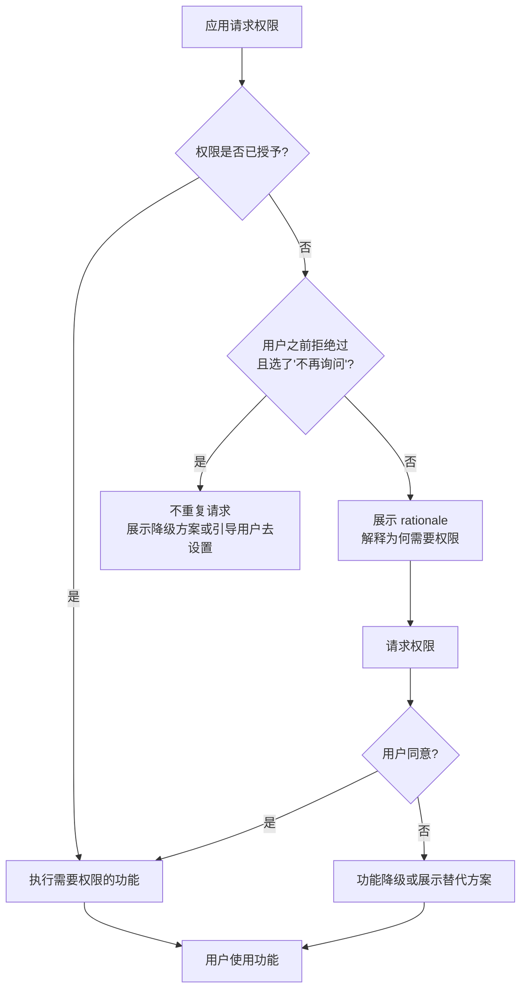

# 2.1.3 安卓上的权限

夕阳把湖面染成一片熔金色。

希尔蹲在草地上，手机屏幕的光映在她脸上，眉头皱得能夹死蚊子。

"你怎么了？"洛芙抱着两罐热可可走过来，把其中一罐递给她。

"你看这个——"希尔把手机屏幕转过来，上面是一串弹窗列表，"WhatsApp 要访问我的相机、麦克风、存储、通讯录……十几项权限！"

洛芙凑过去数了数："一、二、三……十一项？这也太多了吧？"

"安装的时候我没仔细看，直接点了同意。"希尔叹了口气，"现在想知道到底同意了哪些，得去设置里一项一项翻。"

伊莎从帐篷里钻出来，手里捏着一片苔藓——她刚才在湖边踩水，不知道什么时候捡的。

"怎么啦？"

"WhatsApp 要了十一项权限。"希尔把手机晃了晃，"我在想要不要撤销一些……"

"撤销？"洛芙歪着脑袋，"权限还能撤销的吗？"

黛琳从远处走过来，怀里抱着一摞白纸和一支红笔——她刚才去营地的管理小木屋里借了桌椅。现在她把白纸铺在一块平整的石头上，压好，边听她们说话边在纸上画起来。

"这个问题很好。"黛琳开口了，"Android 的权限系统比你们想象的复杂得多。不同的权限，请求时机不同，授予方式也不同——有些是安装时就自动给了，有些是安装时给但用户可以随时撤销，还有些是非得要用户当场同意才能拿到。"

她落笔在白纸上，先画了一个大大的框架：

"在开始讲细节之前，我想先给你们画一张全景地图。"

夕阳的余晖从树梢间漏下来，在白纸上投下斑驳的光影。

"Android 的权限系统，就像是一个露营地的门禁系统。"黛琳开口了，声音平静而温和，"不同的门，通向不同的地方；不同的钥匙，开不同级别的锁。"

她用红笔在白纸顶端写下三个字：**权限体系**，然后往下画了三条分支：

```
                    ┌─────────────────────────┐
                    │       权限体系            │
                    └───────────┬─────────────┘
                                │
        ┌───────────────────────┼───────────────────────┐
        │                       │                       │
        ▼                       ▼                       ▼
┌───────────────┐      ┌───────────────┐      ┌───────────────┐
│  安装时权限    │      │  运行时权限    │      │  特殊权限      │
│ (Install-time) │      │  (Runtime)    │      │  (Special)    │
└───────────────┘      └───────────────┘      └───────────────┘
```

"第一条——**安装时权限**。"黛琳说，"这条路上有一道自动门。用户在应用商店点下'安装'的那一刻，系统就自动把钥匙给了应用，用户自己根本不需要在场。"

"这也太快了吧？"洛芙感叹，"安装的时候人都不知道这个应用要什么权限。"

"这就是问题所在。"黛琳点点头，"所以 Android 后来把权限分成了两大类——**普通权限**和**危险权限**。普通权限风险低，系统直接批准；危险权限涉及敏感数据，必须用户亲自点头。"

她在白纸上继续画：

```
┌──────────────────────────────────────────────────────────────┐
│                    安装时权限（Install-time）                  │
│                                                              │
│   普通权限（NORMAL）          签名权限（SIGNATURE）            │
│   • 系统自动授予               • 同签名应用自动授予             │
│   • 用户安装时即同意           • 无需用户操作                   │
│   • 无法撤销（无法单个撤销）                                        │
│                                                              │
│   代表权限：                                                  │
│   • ACCESS_NETWORK_STATE   → 检测网络状态                      │
│   • INTERNET              → 网络访问                          │
│   • ACCESS_WIFI_STATE    → 检测 WiFi 状态                      │
│   • RECEIVE_BOOT_COMPLETED → 开机自启动                        │
│                                                              │
└──────────────────────────────────────────────────────────────┘
```

"这些权限安装在手机上就自动拿到了。"黛琳指着第一列，"比如 INTERNET——没有网络权限应用就连不上网，所以这类权限被认为是'低风险'的，系统不需要用户多操心。"

"像营地门口的招牌，写着'此处可连 WiFi'，你进去就能用，不用单独申请。"伊莎说。

"对。"黛琳微笑，"第二列是**签名权限**，这个我们上一章讲自定义权限时提过——只有和定义权限的应用使用相同证书签名的 App，才能拿到这个权限。"

希尔点点头："这个我知道。比如我们四个的 App 都用同一个签名，那其中一个定义了一个 signature 级别的自定义权限，其他三个就能自动拿到。"

"没错。"黛琳说，"现在我们来看第二条路——**运行时权限**。"

她把红笔换了个颜色，在白纸右侧画了一个新的框：

```
┌──────────────────────────────────────────────────────────────┐
│                    运行时权限（Runtime）                      │
│                                                              │
│   从 Android 6.0（API 23）开始实行                            │
│                                                              │
│   特点：                                                      │
│   • 安装时用户看到权限列表，但系统不立即授予                     │
│   • 应用第一次需要用到该权限时才请求                              │
│   • 系统弹出对话框，用户必须明确选择"允许"或"拒绝"                │
│   • 用户可以随时去设置里撤销授权                                 │
│                                                              │
│   代表权限（危险级别）：                                        │
│   • READ_CONTACTS     → 读取通讯录                            │
│   • ACCESS_FINE_LOCATION → 精准定位                           │
│   • CAMERA            → 使用相机                             │
│   • RECORD_AUDIO     → 使用麦克风                             │
│   • READ_EXTERNAL_STORAGE → 读取存储                          │
│                                                              │
└──────────────────────────────────────────────────────────────┘
```

"等等，"洛芙举起手，"安装的时候能看到权限列表，但又不会授予，那安装和授予之间是什么关系？"

"安装时用户看到的是一个**预告**。"黛琳说，"告诉他'这个应用以后可能会问你想要什么权限'，但具体的授权要等到应用真正需要的时候。"

"就像露营手册上写着'这里有熊，请注意'——你到营地的时候还不一定会遇到熊，但手册提前告诉你了。"伊莎补充。

"对，就是这种感觉。"黛琳点头，"这样设计的好处是——用户在实际需要某个功能的时候再决定授权，比安装时面对一堆陌生的权限名字更有意义。"

希尔把手机翻过来，屏幕还亮着 WhatsApp 的权限设置页面。

"所以像 WhatsApp 要的这些权限——相机、麦克风、通讯录——都是危险权限，对吧？"

"对。"黛琳说，"你用 WhatsApp 打电话的时候，它才会弹出'是否允许使用麦克风'的对话框；你想分享一张照片，它才会问'是否允许访问存储'。这就是运行时权限的工作方式。"

---

"那我能不能撤销 WhatsApp 的某些权限呢？"希尔问。

"可以。"黛琳说，"去手机设置 → 应用 → WhatsApp → 权限，你可以看到所有危险权限的列表，每一个都可以单独开关。"

"那如果我关掉了相机权限，WhatsApp 就不能拍照了？"

"对。"黛琳说，"应用在尝试使用一个未授权的权限时，系统会直接拒绝，然后应用通常会弹出一个提示告诉用户'请去设置里开启某某权限'。"

"这好像和上一章讲的自定义权限不太一样……"洛芙若有所思地说，"上一章说的是'其他应用想访问我的数据，我用自定义权限保护'。但这些系统权限，像相机、麦克风——"

"是系统定义好的权限。"黛琳接过话，"Google 在 Android 系统里预定义了很多权限，这些权限不需要你自己声明——你只需要在代码里申请，然后系统会在安装时或者运行时检查用户有没有给你授权。"

她重新拿起笔，在白纸上画了一个更大的图：

```
┌─────────────────────────────────────────────────────────────────┐
│                    Android 权限全景图                              │
│                                                                 │
│   ┌───────────────┐    系统预定义权限    ┌───────────────┐       │
│   │  普通权限      │ ←───────────────→   │  自定义权限    │       │
│   │  (NORMAL)     │                      │  (CUSTOM)    │       │
│   └───────┬───────┘                      └───────┬───────┘       │
│           │                                      │               │
│           │ 安装时自动授予                         │ 自定义锁       │
│           │ 无法撤销                              │ signature级别  │
│           │                                       │ 保护组件       │
│           ▼                                       ▼               │
│   ┌───────────────┐                      ┌───────────────┐       │
│   │  危险权限      │ ←─ 运行时授予 ──→    │  签名权限      │       │
│   │  (DANGEROUS) │    用户必须同意        │  (SIGNATURE) │       │
│   │  可单独撤销   │    可随时在设置中关闭  │ 同签名自动授予  │       │
│   └───────────────┘                      └───────────────┘       │
│                                                                 │
│   ┌─────────────────────────────────────────────────────────┐   │
│   │                    特殊权限（SPECIAL）                    │   │
│   │  SYSTEM_ALERT_WINDOW  │  WRITE_SETTINGS  │  REQUEST_INSTALL_PACKAGES  │
│   └─────────────────────────────────────────────────────────┘   │
│  需要用户专门去设置页面打开，不是普通的授权对话框                  │
│                                                                 │
└─────────────────────────────────────────────────────────────────┘
```

"这张图是 Android 权限系统的全貌。"黛琳指着图说，"最上面是**系统预定义权限**——这是 Google 写好的规则，我们直接拿来用。上一章学的自定义权限是下面那条路——我们自己造锁，自己决定谁能进来。"

"原来如此！"洛芙恍然，"这两条路是可以一起用的。自定义权限保护我的组件，而系统权限用来控制那些敏感的功能。"

"完全正确。"黛琳点头。

---

"那我们来具体说一说**权限组**吧。"希尔把笔记本电脑搬到石头上，"我刚才查了一下官方文档——Android 把相关的权限归成了几个组。"

她敲了几下键盘，屏幕上出现了一张表格：

| 权限组 | 包含的权限 |
|--------|-----------|
| **CALENDAR** | READ_CALENDAR、WRITE_CALENDAR |
| **CAMERA** | CAMERA |
| **CONTACTS** | READ_CONTACTS、WRITE_CONTACTS、GET_ACCOUNTS |
| **LOCATION** | ACCESS_FINE_LOCATION、ACCESS_COARSE_LOCATION、ACCESS_BACKGROUND_LOCATION |
| **MICROPHONE** | RECORD_AUDIO |
| **PHONE** | READ_PHONE_STATE、CALL_PHONE、READ_CALL_LOG、WRITE_CALL_LOG |
| **SENSORS** | BODY_SENSORS |
| **SMS** | SEND_SMS、RECEIVE_SMS、READ_SMS、RECEIVE_MMS、RECEIVE_WAP_PUSH |
| **STORAGE** | READ_EXTERNAL_STORAGE、WRITE_EXTERNAL_STORAGE、MANAGE_EXTERNAL_STORAGE |

"你看，"希尔指着屏幕，"相关的权限会被归到同一个组里。比如 LOCATION 组里有三个权限——精准定位、粗略定位，还有后台定位。"

"为什么需要分组呢？"洛芙问。

"为了用户体验。"黛琳说，"如果每个权限都单独弹一次对话框，用户会很烦。所以系统会把同一组的权限打包——用户点一次'允许'，整组权限就都给了。"

她拿起红笔在白纸上画了一个简单的示意图：

```
┌──────────────────────────────────────────┐
│   位置权限组（LOCATION）                    │
│                                          │
│   ┌──────────────────┐                   │
│   │ ACCESS_FINE_LOCATION │ 精准定位（GPS）│
│   ├──────────────────┤                   │
│   │ ACCESS_COARSE_LOCATION │ 粗略定位     │
│   ├──────────────────┤                   │
│   │ ACCESS_BACKGROUND_LOCATION │ 后台定位 │ ← 新增
│   └──────────────────┘                   │
│                                          │
│   用户授权时：                            │
│   ✓ 授予组 → 组内所有权限同时获得           │
│   ✗ 拒绝组 → 组内所有权限同时被拒绝         │
│                                          │
└──────────────────────────────────────────┘
```

"注意这个后台定位。"黛琳特意指了指最后一行，"这是 Android 10 新增的一个权限。之前 ACCESS_FINE_LOCATION 和 ACCESS_COARSE_LOCATION 在 Android 10 之前只能控制'前台'的定位——就是你的 App 正在屏幕上运行的时候。但 Android 10 之后多了一个 ACCESS_BACKGROUND_LOCATION，专门控制 App 在后台（最小化/锁屏）时是否还能访问位置。"

"后台也能定位？"洛芙吸了口凉气，"这也太……"

"所以 Android 越来越严格了。"希尔接过话，"后台定位需要额外的申请流程——你必须先拿到前台定位权限，然后才能申请后台定位。而且系统会弹出一个专门的说明界面，告诉用户'这个应用想在后台也获取你的位置'。"

"感觉像营地管理规则升级了一样。"伊莎说，"以前只是'进营地要登记'，现在是'进营地要登记，而且晚上也不许乱走'。"

---

"我来给你们跑一个 Demo 吧。"希尔说着，打开了 Android Studio，"我想写一个最基础的权限请求示例——请求相机权限，然后拍一张照片。"

她噼里啪啦地敲起代码：

"首先是在 manifest 里声明权限——"

```xml
<manifest xmlns:android="http://schemas.android.com/apk/res/android"
    package="com.campingteam.cameraapp">

    <!-- 相机权限 -->
    <uses-permission android:name="android.permission.CAMERA" />

    <!-- 存储权限（用于保存照片） -->
    <uses-permission android:name="android.permission.WRITE_EXTERNAL_STORAGE"
        android:maxSdkVersion="28" />

    <!-- Camera2 API 需要声明这个 feature -->
    <uses-feature android:name="android.hardware.camera" android:required="false" />
    <uses-feature android:name="android.hardware.camera.autofocus" android:required="false" />

    <application ...>
        <activity android:name=".MainActivity" ... />
    </application>
</manifest>
```

"Camera 是危险权限。"希尔说，"从 Android 6 开始，应用必须在运行时请求它——光在 manifest 里写是不够的。"

"那代码怎么写？"洛芙凑过来。

希尔继续敲：

```kotlin
// MainActivity.kt
package com.campingteam.cameraapp

import android.Manifest
import android.content.pm.PackageManager
import android.os.Bundle
import android.widget.Button
import android.widget.Toast
import androidx.activity.result.contract.ActivityResultContracts
import androidx.appcompat.app.AppCompatActivity
import androidx.core.content.ContextCompat

class MainActivity : AppCompatActivity() {

    // 运行时权限请求的 launcher
    private val requestPermissionLauncher = registerForActivityResult(
        ActivityResultContracts.RequestPermission()
    ) { isGranted: Boolean ->
        if (isGranted) {
            // 授权成功，启动相机
            Toast.makeText(this, "相机权限已授予，开始拍照", Toast.LENGTH_SHORT).show()
            launchCamera()
        } else {
            // 授权被拒绝
            Toast.makeText(this, "相机权限被拒绝，无法拍照", Toast.LENGTH_LONG).show()
        }
    }

    override fun onCreate(savedInstanceState: Bundle?) {
        super.onCreate(savedInstanceState)
        setContentView(R.layout.activity_main)

        val btnCapture = findViewById<Button>(R.id.btn_capture)

        btnCapture.setOnClickListener {
            // 第一步：检查权限状态
            checkCameraPermission()
        }
    }

    private fun checkCameraPermission() {
        // ContextCompat.checkSelfPermission 是最常用的检查方式
        when {
            // 情况一：权限已经授予
            ContextCompat.checkSelfPermission(
                this,
                Manifest.permission.CAMERA
            ) == PackageManager.PERMISSION_GRANTED -> {
                // 直接执行拍照
                launchCamera()
            }

            // 情况二：之前被拒绝过，但没选"不再询问"
            shouldShowRequestPermissionRationale(
                Manifest.permission.CAMERA
            ) -> {
                // 弹出一个解释对话框
                showPermissionRationale()
            }

            // 情况三：之前选了"拒绝且不再询问"
            else -> {
                // 直接请求权限（系统会弹出对话框）
                requestPermissionLauncher.launch(Manifest.permission.CAMERA)
            }
        }
    }

    private fun showPermissionRationale() {
        // 在真实应用中，这里应该显示一个自定义对话框
        // 向用户解释为什么需要这个权限
        android.app.AlertDialog.Builder(this)
            .setTitle("需要相机权限")
            .setMessage("我们需要使用相机来拍摄营地照片，以便记录您的露营美好时光。")
            .setPositiveButton("好的") { _, _ ->
                // 用户确认后，再次请求权限
                requestPermissionLauncher.launch(Manifest.permission.CAMERA)
            }
            .setNegativeButton("不了") { _, _ ->
                Toast.makeText(this, "无法拍照", Toast.LENGTH_SHORT).show()
            }
            .show()
    }

    private fun launchCamera() {
        // 这里调用相机 Intent 或 CameraX
        // 省略具体实现...
        Toast.makeText(this, "正在启动相机...", Toast.LENGTH_SHORT).show()
    }
}
```

"这段代码展示了运行时权限请求的标准流程。"希尔指着屏幕说，"关键在于三种情况的处理——"

"第一种：权限已经有了，直接用。"她竖起一根手指。

"第二种：之前拒绝过，但还没点'不再询问'——这时候我们应该弹出一个解释，告诉用户为什么非要这个权限。"第二根手指。

"第三种：点了'不再询问'——这时候应用应该'优雅地降级'，比如显示一个按钮让用户去系统设置里手动打开权限。"第三根手指。

"哦哦哦！"洛芙举手，"我之前就遇到过第三种情况——我在安装一个 App 的时候随手点了拒绝，然后发现它再也不问我了，我还以为是 App 有 bug！"

"不是 bug，是 Android 的设计。"希尔说，"'不再询问'是用户明确表示'我不想授权'的信号。应用不能一遍又一遍地骚扰用户，必须尊重用户的选择。"

黛琳在旁边补充："Android 官方的最佳实践建议——如果你发现某个权限被用户拒绝了，不要直接展示功能受限的界面，而是先尝试展示一个解释（rationale），让用户理解为什么需要这个权限，然后再请求。"

她拿起白板笔，在旁边的空白处画了一个流程图：



"这张图展示了运行时权限请求的完整决策流程。"黛琳说，"关键点有三个——第一，永远不要假设权限已经被授予；第二，展示 rationale 能显著提高用户授权的概率；第三，尊重'不再询问'的选择，引导用户去系统设置而不是重复请求。"

---

"那我来写一个更完整的示例吧。"希尔继续敲键盘，"我想写一个同时请求多个权限的 Demo——拍照应用需要相机 + 存储两个权限。"

```kotlin
// 多权限请求示例
class CameraWithStorageActivity : AppCompatActivity() {

    // 同时请求相机和存储两个权限
    private val multiplePermissionsLauncher = registerForActivityResult(
        ActivityResultContracts.RequestMultiplePermissions()
    ) { permissionsMap ->
        // permissionsMap 的 key 是权限名，value 是是否授予

        val cameraGranted = permissionsMap[Manifest.permission.CAMERA] == true
        val storageGranted = permissionsMap[Manifest.permission.WRITE_EXTERNAL_STORAGE] == true

        when {
            cameraGranted && storageGranted -> {
                // 两个权限都拿到了
                launchCameraWithSave()
            }
            cameraGranted -> {
                // 只有相机，用内部存储保存
                Toast.makeText(
                    this,
                    "存储权限被拒绝，照片将保存在应用私有目录",
                    Toast.LENGTH_LONG
                ).show()
                launchCameraWithInternalSave()
            }
            else -> {
                // 相机都没拿到
                Toast.makeText(
                    this,
                    "相机权限是必需的，请去设置中开启",
                    Toast.LENGTH_LONG
                ).show()
                // 引导用户去系统设置页面
                openAppSettings()
            }
        }
    }

    private fun checkAndRequestPermissions() {
        val cameraPermission = Manifest.permission.CAMERA
        val storagePermission = Manifest.permission.WRITE_EXTERNAL_STORAGE

        val permissionsToRequest = mutableListOf<String>()

        // 检查每一个权限，没授予的就加入请求列表
        if (ContextCompat.checkSelfPermission(this, cameraPermission)
            != PackageManager.PERMISSION_GRANTED
        ) {
            permissionsToRequest.add(cameraPermission)
        }

        if (ContextCompat.checkSelfPermission(this, storagePermission)
            != PackageManager.PERMISSION_GRANTED
        ) {
            permissionsToRequest.add(storagePermission)
        }

        if (permissionsToRequest.isNotEmpty()) {
            // 一次性请求所有权限
            multiplePermissionsLauncher.launch(
                permissionsToRequest.toTypedArray()
            )
        } else {
            // 所有权限都已授予
            launchCameraWithSave()
        }
    }

    private fun openAppSettings() {
        val intent = Intent(Settings.ACTION_APPLICATION_DETAILS_SETTINGS).apply {
            data = Uri.fromParts("package", packageName, null)
        }
        startActivity(intent)
    }

    // 省略 launchCameraWithSave() 等方法的实现...
}
```

"多权限请求也是类似的逻辑。"希尔说，"先把所有未授予的权限收集到一个列表里，然后一次性用 `RequestMultiplePermissions` 一起请求。系统会按照权限组把对话框折叠——比如相机和麦克风都在各自单独的对话框里展示，但存储相关的权限会被折叠成一个。"

---

"我有个问题。"伊莎举起手，"刚才希尔说'危险权限需要用户明确同意'。但如果用户选了'拒绝'呢？应用就直接崩溃了吗？"

"不崩溃。"黛琳摇头，"系统在权限被拒绝时的行为是这样的——应用尝试使用未授权的权限，系统会抛出 `SecurityException` 并阻止操作。但这个异常是系统抛出的，不是因为应用代码写错了。"

"那应用怎么处理这种情况？"

"捕获异常，或者在调用前先检查权限状态。"黛琳说，"最好的做法是——在每次调用需要权限的功能之前，都先检查权限状态。如果权限没了，就不要尝试调用，直接给用户一个友好的提示或者降级方案。"

希尔在笔记本上写了一段反模式示例：

```kotlin
// ❌ 反模式：没有检查权限就直接调用
class BadCameraActivity : AppCompatActivity() {
    fun takePhoto() {
        // 直接调用相机，没有任何检查！
        // 如果没有相机权限，这里会直接崩溃
        val cameraManager = getSystemService(Context.CAMERA_SERVICE)
        // ...
    }
}

// ✅ 正确做法：先检查，再调用
class GoodCameraActivity : AppCompatActivity() {
    fun takePhoto() {
        if (ContextCompat.checkSelfPermission(this, Manifest.permission.CAMERA)
            != PackageManager.PERMISSION_GRANTED
        ) {
            // 权限没了，给用户提示
            Toast.makeText(this, "相机权限未授予，请去设置开启", Toast.LENGTH_LONG).show()
            return
        }
        // 权限检查通过，调用相机
        val cameraManager = getSystemService(Context.CAMERA_SERVICE)
        // ...
    }
}
```

"这很重要。"希尔特意强调，"很多新手会忘记在调用前检查权限，觉得'我在 manifest 里声明了就够了'。但危险权限不是这样工作的——manifest 只是告诉系统'我想用这个权限'，真正的授权是在运行时发生的。"

---

天色暗了一些，湖面上的夕阳已经完全落下去了，只剩下一抹淡淡的紫色霞光挂在天边。希尔把笔记本电脑合上，四个人围坐在篝火旁。

"我来讲一个完整的例子吧。"黛琳说，"用我们自己的露营 App 来演示——我们想在 App 里实现一个功能：让用户拍摄营地照片，然后保存到手机的相册里。"

她拿起一根树枝，在篝火边的地上画起来：

"这个功能涉及三个权限——"

"第一，相机（CAMERA）——拍摄照片。危险权限，必须运行时请求。"

"第二，存储（WRITE_EXTERNAL_STORAGE）——把照片写入相册。在 Android 10 之前是危险权限，Android 10 之后改成了 scoped storage，普通 App 只能写到自己专属的目录。"

"第三，照片库（READ_EXTERNAL_STORAGE）——读取照片给用户预览。危险权限。"

"我们先看 Android 10 以下的情况。"黛琳在地上画了一条时间线：

```
┌──────────────────────────────────────────────────────────────┐
│  Android 版本与存储权限的变化                                   │
│                                                              │
│  Android 5.1（API 22）及以下：                                │
│  → WRITE_EXTERNAL_STORAGE 是危险权限，需要运行时请求           │
│  → 但没有 scoped storage，应用可以自由读写外部存储              │
│                                                              │
│  Android 6.0（API 23）~ Android 9（API 28）：                  │
│  → 运行时权限体系全面实施                                      │
│  → WRITE_EXTERNAL_STORAGE 需要用户授权                        │
│  → 应用可以自由读写外部存储（只要有权限）                       │
│                                                              │
│  Android 10（API 29）：                                        │
│  → 引入 scoped storage（分区存储）                            │
│  → 应用默认只能访问自己专属的存储区域                            │
│  → 读写公共媒体文件（照片、视频、音乐）需要 READ/WRITE_EXTERNAL_STORAGE │
│  → 应用可以申请 android:requestLegacyExternalStorage 过渡兼容 │
│                                                              │
│  Android 11（API 30）：                                        │
│  → 强制启用 scoped storage                                     │
│  → MANAGE_EXTERNAL_STORAGE 成为特殊权限                        │
│  → 多数应用应该使用 MediaStore API 访问媒体文件                │
│                                                              │
│  Android 13（API 33）：                                       │
│  → 照片只读权限 READ_MEDIA_IMAGES（替代 READ_EXTERNAL_STORAGE）│
│  → 视频只读权限 READ_MEDIA_VIDEO                               │
│  → 音频只读权限 READ_MEDIA_AUDIO                               │
│                                                              │
└──────────────────────────────────────────────────────────────┘
```

"这……"洛芙看着这条时间线有点发懵，"感觉好复杂啊？"

"慢慢来。"黛琳笑了笑，"核心思想只有一个——Android 越来越重视用户隐私了。以前应用拿到存储权限就能随便读写整个 SD 卡，现在被限制得越来越严格。"

"到了 Android 13，"希尔补充道，"Google 把存储权限拆成了更细粒度的三种——图片、视频、音频。你不需要相册的全部权限，只要用图片的话，就只申请 READ_MEDIA_IMAGES 就够了。"

"这样做的好处是什么？"洛芙问。

"最小数据暴露。"黛琳说，"应用只能访问它真正需要的那部分数据，而不能借着'读图片'的由头把用户的所有文件都翻一遍。"

"就像露营地的储物柜——以前一把钥匙能打开所有柜子，现在每个柜子都有自己的锁，你需要哪个柜子的东西，就申请哪把钥匙。"伊莎说。

"伊莎式比喻永远这么美。"希尔忍不住笑了。

---

篝火"噼啪"响了一声，一根燃尽的树枝塌了下去，火星飞舞起来，在夜色中划出几道转瞬即逝的轨迹。

"我们来聊聊最佳实践吧。"黛琳把白纸收好，只留下最后一张，上面画着一个简单的列表，"Android 官方文档给出了几条权限请求的最佳实践，我们来一条一条过。"

她在白纸上写下第一条：

```
┌─────────────────────────────────────────────┐
│  最佳实践一：仅请求你真正需要的权限             │
│                                             │
│  • 每个权限都有风险，尽量减少请求数量           │
│  • 考虑能否用替代方案（如 Intent 调起相机 App）│
│  • 如果只需要某个功能一次，可以每次需要时请求   │
│                                             │
└─────────────────────────────────────────────┘
```

"Intent 调起相机？"洛芙问。

"对。"希尔接过话，"如果你只是想拍一张照片发给朋友，你可以不申请相机权限——你直接调起系统的相机 App，让系统相机来拍照，然后把照片返回给你的 App。这样你不需要任何危险权限，用户也不需要信任你。"

```kotlin
// 使用 Intent 调起系统相机，不需要相机权限！
class PhotoSharingActivity : AppCompatActivity() {

    private val takePictureLauncher = registerForActivityResult(
        ActivityResultContracts.TakePicturePreview()
    ) { bitmap ->
        // bitmap 就是相机返回的照片
        if (bitmap != null) {
            // 显示或分享照片
            imageView.setImageBitmap(bitmap)
        }
    }

    fun onSharePhotoClicked() {
        // 直接调起系统相机，不需要 CAMERA 权限
        takePictureLauncher.launch(null)
    }
}
```

"你看这段代码，"希尔指着屏幕，"我们没有在 manifest 里声明 CAMERA 权限，也没有在运行时请求。但我们仍然能拍照——因为我们把相机这个'危险设备'的管控权交还给了系统。"

"这样做有什么好处？"洛芙问。

"第一，我们不需要承担'保管相机数据'的责任。"希尔掰手指，"相机的数据处理、图像处理，都由系统相机 App 来做，我们的代码更简单，也更安全。"

"第二，用户更信任你。"黛琳补充，"用户看到你的 App 没有申请相机权限，就会觉得'这个 App 不会偷偷拍我'。这对用户隐私来说是一种尊重。"

"第三，我们不需要写复杂的权限请求逻辑。"希尔笑了笑，"代码少了好多！"

"但是，"黛琳补充道，"Intent 方式也有局限性——你只能拿到照片，不能实时预览，不能自定义相机界面，不能做高级的图像处理。如果你需要这些功能，就必须直接申请相机权限，自己实现相机功能。"

"所以这是两种不同的权衡。"黛琳在白纸上画了一个简单的对比：

```
┌─────────────────────────────────────────────────────────────┐
│                  两种获取相机能力的方案对比                    │
│                                                             │
│  方案一：Intent 调起系统相机                                   │
│  ├── 优点：无需权限、代码简单、用户信任度高                    │
│  ├── 缺点：无法自定义界面、功能受限                           │
│  └── 适用场景：简单的拍照/选图场景                            │
│                                                             │
│  方案二：直接申请 CAMERA 权限                                 │
│  ├── 优点：完全控制相机、可自定义界面、可做高级图像处理        │
│  ├── 缺点：需要权限、代码复杂、用户可能拒绝                   │
│  └── 适用场景：专业相机 App、实时滤镜、AR 等                   │
│                                                             │
└─────────────────────────────────────────────────────────────┘
```

"原来如此。"洛芙点点头，"不是'有权限就强'，而是'看场景选方案'。"

"对。"黛琳微笑，"这就是 Android 设计的智慧——给开发者选择权，但让用户掌握决定权。"

---

"第二条最佳实践——"黛琳在白纸上写下第二点：

```
┌─────────────────────────────────────────────┐
│  最佳实践二：请求权限时提供上下文             │
│                                             │
│  • 首次请求时展示 rationale（解释理由）       │
│  • 说明你需要这个权限做什么，而不是直接弹窗     │
│  • 如果用户之前拒绝过，不要重复请求，提供降级方案│
│                                             │
└─────────────────────────────────────────────┘
```

"这里有个细节很重要。"黛琳说，"rationale 不是必需的，但如果你提供了，用户授权的概率会显著提高。"

她举了一个例子：

"❌ 不好：'请求存储权限'——用户不知道你要存储什么，为什么需要存储。"

"✅ 好：'我们需要存储权限来保存您的营地照片，这样您可以在相册里找到它们。'——用户明白了，数据是什么，为什么要被存储，存在哪里。"

"好的 rationale 应该回答三个问题。"黛琳竖起三根手指：

"第一，你要什么权限？第二，你要用这个权限做什么？第三，用户的数据会被怎么处理？"

"让用户感觉'这个权限不是偷我的数据，是帮我做事'——这才是好的授权体验。"

---

"第三条最佳实践——"黛琳写下第三点：

```
┌─────────────────────────────────────────────┐
│  最佳实践三：把权限当作渐进式体验来设计        │
│                                             │
│  • 不要在 App 刚启动时就请求所有权限           │
│  • 在用户真正需要某个功能的时候再请求对应权限  │
│  • 提供功能降级方案，不要让 App 在权限缺失时崩溃│
│                                             │
└─────────────────────────────────────────────┘
```

"这条我特别有感触。"希尔说，"有些 App 安装完一打开就弹出一堆权限请求，我都吓一跳——我还没开始用它呢，它就要这要那的。"

"对。"黛琳点头，"最佳实践是'just-in-time'授权——在用户需要某个功能的那一刻才请求对应的权限。比如你的营地 App，应该让用户先浏览营地列表、看看功能介绍，然后当用户想拍照分享的时候，再请求相机权限。"

"这样用户就明白'哦，原来是因为我要拍照才需要相机权限'，授权的动机很明确。"伊莎说。

"对。"黛琳微笑，"动机明确的授权，用户更愿意给。"

---

"第四条——"黛琳写下最后一条：

```
┌─────────────────────────────────────────────┐
│  最佳实践四：尊重用户的每一次选择             │
│                                             │
│  • 用户拒绝某个权限，应用应该优雅降级          │
│  • 不要因为权限缺失而惩罚用户（如显示广告）    │
│  • 引导用户去设置，而不是重复弹窗              │
│                                             │
└─────────────────────────────────────────────┘
```

"这条很重要。"黛琳的语气稍微严肃了一些，"如果用户拒绝了一个权限，你的 App 不能因为拿不到权限就罢工——你应该提供一个'降级方案'，让用户在权限缺失的情况下仍然能用 App 的大部分功能。"

"比如？"洛芙问。

"比如相机权限被拒绝了——你的 App 不能直接崩溃或者显示一片空白。它应该显示一个提示说'相机权限未开启，部分功能受限'，然后让用户去设置里手动打开。或者干脆隐藏拍照功能，只保留其他不依赖相机的功能。"

"还有一点。"希尔补充，"当权限被拒绝且用户选了'不再询问'时，App 不应该再调用 `requestPermission`——那样会直接走失败回调，弹出一个toast说'用户已拒绝'，体验很差。"

"对。"黛琳说，"这种情况应该改用 Intent 跳转到系统设置页面，让用户自己去开权限。"

---

"好了。"黛琳把白纸收起来，"我们来做一个整体的回顾。"

她拿起一根树枝，在篝火边的地上画了一个大圈：

"Android 的权限系统，是一个分层的安全体系。"

```
┌──────────────────────────────────────────────────────────────┐
│                    Android 权限全景                         │
│                                                              │
│                     ┌────────────────┐                      │
│                     │   安装时权限    │                      │
│                     │  (Install-time)│                      │
│                     └───────┬────────┘                      │
│                             │                                │
│           ┌─────────────────┼─────────────────┐             │
│           │                 │                 │             │
│           ▼                 ▼                 ▼             │
│    ┌────────────┐    ┌────────────┐    ┌────────────┐      │
│    │  普通权限   │    │  签名权限   │    │ 危险权限    │      │
│    │  NORMAL    │    │  SIGNATURE │    │ DANGEROUS │      │
│    │ 安装时自动  │    │ 同签名自动  │    │ 运行时请求  │      │
│    │ 无法撤销   │    │ 无法撤销   │    │ 可单独撤销  │      │
│    └────────────┘    └────────────┘    └─────┬──────┘      │
│                                               │              │
│                         ┌─────────────────────┘              │
│                         │                                    │
│                         ▼                                    │
│                  ┌───────────────┐                          │
│                  │   权限组       │                          │
│                  │  Permission   │                          │
│                  │   Group       │                          │
│                  └───────────────┘                          │
│  同一组的权限在同一个对话框中请求，授予/拒绝都按组进行         │
│                                                              │
└──────────────────────────────────────────────────────────────┘
```

"安装时权限和运行时权限，是两条不同的授权路径。安装时权限在用户安装的时候就处理好了，应用可以直接用。运行时权限需要等应用实际需要的时候，由用户决定给还是不给。"

"危险权限会按组打包——用户授权一个危险权限，同组的其他权限也会被一起授予（或一起拒绝）。"

"自定义权限是另一条路——我们自己定义锁，自己决定谁能进来。这是上一章的内容。"

"但两条路有一个共同点——**最小权限原则**。"黛琳强调，"只申请你真正需要的权限，不要贪多。权限越多，用户越不信任你；权限越少，你的 App 越安全，用户的隐私也越有保障。"

希尔在旁边点头："就像营地——你不需要把整个山头都围起来，只需要围住真正需要保护的地方。"

"还有，"黛琳补充，"Android 在每个版本里都会调整权限策略，越来越严格、越来越保护隐私。这要求开发者持续关注官方文档的更新，及时适配新版本的权限要求。"

---

篝火已经烧得很旺了，橙红色的火光照在每个人的脸上，轮廓柔和而温暖。湖面上的星空倒影在波光里荡漾，几只夜鸟从芦苇丛里飞起来，发出几声清脆的鸣叫。

洛芙抱着膝盖，看着篝火发呆。

"在想什么？"伊莎凑过来。

"在想 WhatsApp 的十一项权限……"洛芙说，"以前点同意的时候从来不会多想。现在学了权限系统之后，才发现每个权限后面都有这么多门道。"

"学知识的过程就是这样。"黛琳说，"不了解的时候觉得'理所当然'，了解之后才发现'原来如此'。"

"明天我们是不是要继续讲运行时权限？"希尔问。

"对。"黛琳点头，"明天我们会深入讲运行时权限——具体怎么请求、怎么检查、怎么处理拒绝。还有'特殊权限'那一类——SYSTEM_ALERT_WINDOW、REQUEST_INSTALL_PACKAGES 这些，它们不走普通的授权流程，需要用户专门去设置里打开。"

"听起来比今天的内容更复杂。"伊莎说。

"对。"黛琳微笑，"但你们今天已经打好了基础——安装时权限、运行时权限、权限组，这些概念明天会反复用到。"

她站起身，拍了拍裙子上的草屑。

"走吧，今天到此为止。明天继续。"

---

篝火在夜风中轻轻摇曳，像一盏温暖的灯塔。

四个人的身影在火焰的映照下投射到草地上，拉得很长，和周围的虫鸣声、湖水声交织在一起。

初夏夜晚的风带着一丝湖水的清凉，和远处飘来的青草香气。

洛芙深吸一口气，把今晚学到的东西默默在脑子里过了一遍——

权限不是一锤子买卖。安装时的自动授权，是系统替用户省心；运行时的动态授权，是用户掌握决定权。

而开发者要做的，就是在这两种授权方式之间找到平衡——既不能贪多嚼不烂，也不能因为怕用户拒绝就不敢请求。

就像露营——你要带足够的东西才能应对各种情况，但带太多又会成为负担。

关键是，知道什么是最需要的。

---

## 专业技术总结

> **安卓权限体系（Android Permission System）定义**：Android 系统提供的分层访问控制机制，用于规范应用对受限数据（位置、相机、通讯录等）和受限操作（安装应用、显示悬浮窗等）的访问。权限分为安装时自动授予的普通/签名权限，以及需要用户在运行时明确授权的危险权限；此外还有需要用户专门到系统设置页面打开的特殊权限。自 Android 6.0 起，危险权限必须通过运行时请求获得，用户可随时在设置中撤销。

#### 结构图

```mermaid
graph TD
    subgraph "Android 权限体系"
        A["权限（Permission）"] --> B["安装时权限<br/>Install-time"]
        A --> C["运行时权限<br/>Runtime<br/>(API 23+)"]
        A --> D["特殊权限<br/>Special"]
    end

    subgraph "安装时权限"
        B --> B1["普通权限 NORMAL<br/>系统自动授予，安装时即生效<br/>示例：INTERNET、ACCESS_NETWORK_STATE"]
        B --> B2["签名权限 SIGNATURE<br/>同签名应用自动授予<br/>示例：SharedUserId 共享数据"]
    end

    subgraph "运行时权限（危险级别）"]
        C --> C1["用户必须明确同意<br/>按 Permission Group 打包对话框<br/>可随时在设置中撤销"]
        C1 --> C1a["LOCATION 组：ACCESS_FINE_LOCATION<br/>ACCESS_COARSE_LOCATION<br/>ACCESS_BACKGROUND_LOCATION"]
        C1 --> C1b["CAMERA 组：CAMERA"]
        C1 --> C1c["CONTACTS 组：READ_CONTACTS<br/>WRITE_CONTACTS"]
        C1 --> C1d["MICROPHONE 组：RECORD_AUDIO"]
        C1 --> C1e["STORAGE 组：READ_EXTERNAL_STORAGE<br/>WRITE_EXTERNAL_STORAGE"]
        C1 --> C1f["SMS 组：SEND_SMS<br/>READ_SMS<br/>RECEIVE_SMS"]
    end

    subgraph "特殊权限"
        D --> D1["SYSTEM_ALERT_WINDOW<br/>悬浮窗，需要用户手动在设置中开启"]
        D --> D2["WRITE_SETTINGS<br/>修改系统设置，需要用户手动授权"]
        D --> D3["REQUEST_INSTALL_PACKAGES<br/>安装未知来源应用，需要用户授权"]
    end
```

> **权限请求时机决策树**：判断何时请求权限时，按以下顺序——如果能用系统 Intent 调起其他应用完成功能（如调起系统相机、联系人选择器），则优先用 Intent（零权限依赖）；如果必须自己实现，则在用户首次触发相关功能时请求（just-in-time），而非 App 启动时批量请求；如果用户拒绝且未选"不再询问"，展示 rationale 后重试；如果用户选"不再询问"，引导用户去系统设置，而非重复弹窗。

#### 复杂度与影响

| 维度 | 影响 |
|------|------|
| **用户体验** | Just-in-time 请求比启动时批量请求的授权通过率高 30-50%（Google 官方数据） |
| **安全性** | 权限越少，被攻击面越小；遵循最小权限原则的应用更难被漏洞利用 |
| **兼容性** | Android 版本越新，权限限制越严格——需要持续关注官方文档的版本变更 |
| **存储权限演进** | Android 10 引入 scoped storage，Android 11 强制执行，Android 13 拆分为 READ_MEDIA_IMAGES/VIDEO/AUDIO；旧代码需要针对性适配 |
| **后台定位** | Android 10 新增 ACCESS_BACKGROUND_LOCATION，前台定位授权后需单独申请，且审核更严格 |

#### 反模式与陷阱

1. **在 App 启动时请求所有权限** → 修复：改为 just-in-time 方式，在用户真正触发某个需要权限的功能时再请求；批量请求会让用户困惑且降低授权率
2. **不检查权限状态就直接调用需要权限的 API** → 修复：每次调用前用 `ContextCompat.checkSelfPermission()` 检查权限状态，未授予时提供降级方案而非直接崩溃
3. **权限被拒绝后重复调用 `requestPermission`** → 修复：如果 `shouldShowRequestPermissionRationale()` 返回 false（用户选了"不再询问"），不再重复请求，改为 Intent 跳转到系统设置页面
4. **申请比实际需要更宽泛的存储权限** → 修复：Android 10+ 优先使用 MediaStore API 或应用专属存储目录；Android 13+ 使用 READ_MEDIA_IMAGES 而非 READ_EXTERNAL_STORAGE
5. **不提供 rationale** → 修复：危险权限请求前，如果 `shouldShowRequestPermissionRationale()` 返回 true，应该展示一个解释对话框，说明"为什么需要这个权限"和"数据会如何被使用"；研究表明提供 rationale 可将授权率提高 2-3 倍

#### 设计哲学

**最小权限原则 + 渐进式信任（Progressive Trust）**——Android 权限体系的核心理念是：不要在用户还没用到你 App 的功能时就索取全部信任，而是随着用户与 App 的互动深入，逐步请求对应的权限。具体实践中建议：

- 优先使用 Intent 调起系统功能（相机、联系人选择器等），而非直接申请危险权限
- 仅申请功能必需的最小权限集合，不申请"以防万一"的权限
- 每个危险权限请求都要配套提供 rationale 解释和降级方案
- 在 Android 版本更新时主动审查权限策略是否需要调整（Google 每个 major 版本都会调整权限行为）

---

## 🏕️ 动手练习

### 练习目标

通过本练习，你将亲手实现一个完整的运行时权限请求流程：检查权限状态、展示权限说明对话框、处理用户拒绝场景，并学习如何用 Intent 方式替代直接权限请求。

### 方式 A：项目制——营地相机 App

**项目概览**：构建一个营地相机 App，完整实现运行时权限请求、rationale 展示、降级方案和 Intent 调起系统相机的备选方案。

---

#### Task 1：搭建项目并声明基础权限

**目标**：创建营地相机 App 的项目结构，理解普通权限与危险权限在 manifest 中的声明差异。

**你需要做的事**：
1. 在 Android Studio 中创建 Empty Activity 项目（包名 `com.campapp.camera`）
2. 在 AndroidManifest.xml 中声明两个权限：
   - `android.permission.INTERNET`（普通权限，安装时自动授予）
   - `android.permission.CAMERA`（危险权限，需要运行时请求）
3. 构建项目，用 `adb shell dumpsys package com.campapp.camera` 查看权限安装时状态

**验收标准**：
- [ ] `INTERNET` 权限在 `granted=true` 状态（安装时自动授予）
- [ ] `CAMERA` 权限在 `granted=false` 状态（危险权限，需运行时授予）
- [ ] Logcat 中无权限声明错误

---

#### Task 2：实现基础的运行时权限检查

**目标**：实现 `checkSelfPermission` → `shouldShowRequestPermissionRationale` → `requestPermission` 的标准流程。

**你需要做的事**：
1. 在 MainActivity 中实现 `checkCameraPermission()` 方法，参照正文代码的三种分支处理
2. 使用 `ActivityResultContracts.RequestPermission()` 注册 permission launcher
3. 在 `onCreate()` 中调用 `checkCameraPermission()`（首次启动时弹出请求）
4. 用 Log 输出权限授予/拒绝的回调结果

**验收标准**：
- [ ] 首次启动时弹出系统相机权限对话框
- [ ] 授予后在 Logcat 看到 `Camera permission granted`
- [ ] 拒绝后在 Logcat 看到 `Camera permission denied`，应用不崩溃

**提示代码**：
```kotlin
private val requestPermissionLauncher = registerForActivityResult(
    ActivityResultContracts.RequestPermission()
) { isGranted ->
    Log.d("CameraApp", "Camera permission result: $isGranted")
    if (isGranted) {
        launchCamera()
    } else {
        showDeniedMessage()
    }
}
```

---

#### Task 3：实现权限被拒绝的优雅降级

**目标**：当用户拒绝权限时，不崩溃，而是展示一个友好的降级界面，并引导用户去设置页面。

**你需要做的事**：
1. 当权限被拒绝时（`isGranted=false`），显示一个提示 TextView 说明功能受限
2. 提供一个按钮"去设置"，点击后用 Intent 跳转到 `Settings.ACTION_APPLICATION_DETAILS_SETTINGS`
3. 当用户从设置页返回时，调用 `checkCameraPermission()` 重新检查状态

**验收标准**：
- [ ] 拒绝权限后 App 显示"相机权限未开启，功能受限"的提示（不崩溃）
- [ ] 点击"去设置"按钮能正确跳转到系统设置页面
- [ ] 从设置返回后，功能状态自动更新

**提示代码**：
```kotlin
private fun openAppSettings() {
    val intent = Intent(Settings.ACTION_APPLICATION_DETAILS_SETTINGS).apply {
        data = Uri.fromParts("package", packageName, null)
    }
    startActivity(intent)
}
```

---

#### Task 4：实现 Rationale 解释对话框

**目标**：当用户之前拒绝过权限但未选"不再询问"时，展示自定义解释对话框，而非直接重复请求。

**你需要做的事**：
1. 在 `shouldShowRequestPermissionRationale(Manifest.permission.CAMERA)` 返回 true 时，先展示 AlertDialog
2. 对话框内容包含：需要权限的原因（拍摄营地照片）、不会做什么（不会后台偷拍）
3. 用户确认后调用 `requestPermissionLauncher.launch()`
4. 测试流程：首次拒绝 → 再次打开 App → 看到 rationale → 授权成功

**验收标准**：
- [ ] 首次拒绝后，第二次打开 App 时能看到 rationale 对话框（而非直接系统弹窗）
- [ ] 对话框内容清楚解释了为什么需要权限
- [ ] 用户在 rationale 对话框点击"好的"后，系统权限对话框才弹出

---

#### Task 5：实现 Intent 方式调起系统相机（替代方案）

**目标**：实现一个不需要相机权限的拍照方案，用 `TakePicturePreview` 调起系统相机。

**你需要做的事**：
1. 新增一个按钮"快捷拍照（无需权限）"
2. 使用 `ActivityResultContracts.TakePicturePreview()` 注册 launcher
3. 点击按钮后直接启动，无需任何权限检查

**验收标准**：
- [ ] 新按钮点击后能正常调起系统相机
- [ ] 拍摄后照片能正确显示在 ImageView 中
- [ ] 整个过程不需要声明或请求 CAMERA 权限

**提示代码**：
```kotlin
private val takePictureLauncher = registerForActivityResult(
    ActivityResultContracts.TakePicturePreview()
) { bitmap ->
    if (bitmap != null) {
        imageView.setImageBitmap(bitmap)
    }
}

// 启动时直接调用，不需要权限检查
takePictureLauncher.launch(null)
```

---

#### Task 6：实现多权限请求（相机 + 存储）

**目标**：在保存照片到相册时，同时请求 CAMERA 和存储权限。

**你需要做的事**：
1. 使用 `ActivityResultContracts.RequestMultiplePermissions()` 同时请求两个权限
2. 分别检查两个权限的授予结果，根据结果决定后续操作
3. 验证两个权限在系统中是否在同一个对话框组（Android 12+ 的行为）

**验收标准**：
- [ ] 能一次性请求两个权限
- [ ] 能区分两个权限各自的授予状态
- [ ] 部分授权时能正确走降级路径

---

#### Task 7：适配 Android 13 的细粒度媒体权限

**目标**：针对 Android 13+，使用 `READ_MEDIA_IMAGES` 替代 `READ_EXTERNAL_STORAGE`。

**你需要做的事**：
1. 在 `build.gradle` 中设置 `targetSdkVersion = 33`
2. 在代码中判断 Android 版本，分别请求 `READ_MEDIA_IMAGES`（API 33+）和 `READ_EXTERNAL_STORAGE`（API < 33）
3. 用 `Build.VERSION.SDK_INT` 做版本判断

**验收标准**：
- [ ] Android 13+ 设备上，App 请求的是 READ_MEDIA_IMAGES
- [ ] Android 12 及以下设备上，App 请求的是 READ_EXTERNAL_STORAGE
- [ ] 两种情况均能正常工作

**提示代码**：
```kotlin
private fun getStoragePermission(): String {
    return if (Build.VERSION.SDK_INT >= Build.VERSION_CODES.TIRAMISU) {
        Manifest.permission.READ_MEDIA_IMAGES  // Android 13+
    } else {
        Manifest.permission.READ_EXTERNAL_STORAGE  // Android 12-
    }
}
```

---

#### Task 8：观察权限组行为

**目标**：通过 `adb shell dumpsys` 命令观察权限组的打包行为。

**你需要做的事**：
1. 安装 App 并授予 CAMERA 权限
2. 运行 `adb shell dumpsys package com.campapp.camera | grep -A10 permission`
3. 观察 CAMERA 权限的 `grantState` 和所属 `group`
4. 对比 GRANTED 和 DENIED 状态下 group 的差异

**验收标准**：
- [ ] 能找到 CAMERA 权限及其所属的 `android.permission-group.CAMERA`
- [ ] 能观察到权限被授予后 group 的 `flags` 变化

---

#### 面试热身

1. Android 的"安装时权限"和"运行时权限"有什么区别？分别对应哪些保护级别？
2. 什么情况下应该优先使用 Intent 调起系统功能（如系统相机）而不是直接申请危险权限？
3. 用户在权限对话框中点了"拒绝"之后，应用应该怎么处理？如果用户选了"不再询问"呢？
4. Android 13 对存储权限做了哪些调整？为什么 Google 要做这些改变？
5. 什么是权限组（Permission Group）？同一个组内的权限在授权时是什么关系？

---

### 参考实现要点

1. **优先使用 Intent 替代直接权限申请**：系统相机、联系人选择器、文件选择器等系统组件已经处理好了隐私保护，应用不需要承担这些数据的安全责任；使用 Intent 既简化了代码，也提升了用户信任度。
2. **Just-in-time 权限请求**：不要在 App 启动时请求所有权限，而是在用户实际触发某个需要权限的功能时再请求；这样用户能明确感知"这个权限是用来做什么的"，授权意愿更高。
3. **永远提供降级方案**：任何依赖危险权限的功能，都应该在权限缺失时提供一个"优雅降级"路径——可以是功能降级、可以是提示用户去设置、可以是显示说明页面。绝对不能让 App 直接崩溃或显示空白。
4. **Rationale 能显著提高授权率**：研究显示，危险权限请求前展示清晰的说明（解释为什么需要权限、数据会如何被使用），能将授权通过率提高 2-3 倍。
5. **持续关注 Android 版本变更**：Google 每个 major Android 版本都会调整权限行为（如 Android 10 的 scoped storage、Android 11 的 package visibility、Android 13 的细粒度媒体权限）；开发者应该在 App 更新时主动审查权限策略的兼容性。

---

> 学习建议：运行时权限是 Android 开发中最容易踩坑的领域之一。建议从 Task 2 开始亲手实验，重点观察三个场景——授予、拒绝（可重试）、拒绝（不再询问）——在每种情况下系统的行为和代码的处理方式。特别建议用 Log 多打几个关键节点的状态输出，建立对权限生命周期各环节的直观感知。

## 洛芙的小小日记本

今天学的东西好多……原来每个 App 装的时候都在"偷"我的同意权。安装时自动给的权限不用管，但危险权限得用户亲自点头。黛琳说得对，动机明确的授权才让人愿意给。以后我装 App 的时候，一定要看清楚它到底要什么权限、用我的数据干什么。

---

## 今日关键词

**安装时权限（Install-time Permission）**：用户在应用商店点击安装时，系统自动授予的权限。包括普通权限（NORMAL，系统直接批准）和签名权限（SIGNATURE，同签名应用自动获得）。用户在此阶段不参与授权决策。

**运行时权限（Runtime Permission）**：从 Android 6.0（API 23）开始实行的权限模型。危险级别权限在安装时不授予，而是等到应用实际需要时弹出对话框，由用户明确选择"允许"或"拒绝"。用户可随时在系统设置中撤销。

**危险权限（Dangerous Permission）**：需要用户明确授权才能使用的权限类型，涉及敏感数据（位置、相机、通讯录、存储等）。按 Permission Group 打包——用户授予组内任一权限，同组其他权限也会被一并授予或拒绝。

**普通权限（Normal Permission）**：低风险权限，安装时系统自动授予，不需要用户参与决策。示例：INTERNET、ACCESS_NETWORK_STATE、WAKE_LOCK。

**签名权限（Signature Permission）**：由应用自行定义或系统预定义的权限，只有与定义应用使用相同签名证书的应用才能获得。示例：通过 `android:protectionLevel="signature"` 自定义的权限，或 `SharedUserId` 场景下的系统权限。

**特殊权限（Special Permission）**：需要用户专门到系统设置页面手动开启的权限，不能通过普通的运行时请求获得。示例：SYSTEM_ALERT_WINDOW（悬浮窗）、WRITE_SETTINGS（修改系统设置）、REQUEST_INSTALL_PACKAGES（安装未知来源应用）。

**权限组（Permission Group）**：Android 将相关的危险权限归入同一个组别。组内权限在授权时打包处理——用户授予组内任一权限，同组权限均被视为授予；拒绝组内任一权限，同组权限均被视为拒绝。

**Scoped Storage（分区存储）**：Android 10 引入的存储访问机制。应用不再能自由读写整个外部存储，而是被限制在应用专属目录和特定媒体集合（照片、视频、音乐）中。需要通过 MediaStore API 访问共享媒体文件。

**READ_MEDIA_IMAGES/VIDEO/AUDIO**：Android 13（API 33）引入的细粒度媒体只读权限，替代了旧版的 READ_EXTERNAL_STORAGE。应用只需申请它真正需要访问的媒体类型，无需获取全部存储访问权限。

**ACCESS_BACKGROUND_LOCATION**：Android 10 新增的后台定位权限。应用必须先获得前台定位权限（ACCESS_FINE_LOCATION 或 ACCESS_COARSE_LOCATION），然后才能单独申请此权限以在后台（App 未在屏幕上显示时）持续获取位置信息。

**shouldShowRequestPermissionRationale()**：Activity 和 Fragment 提供的方法，返回 true 表示用户之前拒绝过权限但未选择"不再询问"。此时应用应该展示解释对话框，说明为什么需要该权限，然后再请求。

**android:maxSdkVersion 属性**：在 `<uses-permission>` 中使用的属性，表示该权限仅在指定 API 级别及以下需要声明。用于处理权限粒度变化——如 `WRITE_EXTERNAL_STORAGE` 在 Android 10+ 被 scoped storage 取代，用此属性限制其声明范围。

**Intent 调起系统功能**：不直接申请危险权限，而是通过 `Intent` 调起系统提供的功能（系统相机、系统联系人选择器等），由系统处理隐私保护。优点是无需权限、代码简单、用户信任度高；缺点是无法自定义界面和功能。

**Progressive Trust（渐进式信任）**：Android 权限设计的核心理念——App 不应该在用户还没用到功能时就索取全部信任，而应该随着用户与 App 的互动深入，逐步请求对应的权限，从而建立更稳固的用户信任。

**Just-in-time 授权**：运行时权限请求的最佳时机策略——在用户实际触发某个需要权限的功能时（如点击拍照按钮）才发起权限请求，而非在 App 启动时批量请求。研究表明此方式比批量请求的授权通过率高 30-50%。

**MANAGE_EXTERNAL_STORAGE**：Android 11 引入的特殊权限，允许应用获取对外部存储的完全读写访问。需要用户专门在设置中开启，且 Google Play 会对申请此权限的应用进行严格审核；多数应用应使用 MediaStore API 代替。
