# 2.1.4 请求运行时权限

帐篷的拉链在夜色里发出细小的"沙沙"声。

希尔把手机屏幕亮度调到最低，但那个弹窗的蓝光还是在草地上投下一片淡淡的影子——是相机的权限请求框，刚点开营地App准备拍篝火照片，就弹出来了。

"又是权限请求。"希尔叹了口气，"和昨天WhatsApp一样的套路。"

"昨天不是讲过了吗？"洛芙裹着一件明显太大的外套，从帐篷里探出脑袋，"危险权限，运行时请求，用户同意才能用。"

"讲过'要不要授权'，没讲过'怎么优雅地处理用户拒绝'。"黛琳的声音从篝火那边传来。她正往火堆里添两根干树枝，火星"噼啪"一声蹿了起来，"还有'永久拒绝'之后怎么办——这个才是真正考验功力的地方。"

希尔把手机翻过来，屏幕朝上搁在膝盖旁边，火光把她的表情映得忽明忽暗。

"我昨天写的那段Demo代码，"希尔说，"只处理了'授权成功'和'授权失败'两种情况。但实际用户拒绝的方式有三种——"

她伸出三根手指：

"第一，用户看了对话框，点了'允许'。皆大欢喜。"

"第二，用户看了对话框，点了'拒绝'。应用不崩溃，但功能用不了，下次用户再触发同一操作，弹窗再出来一次。"

"第三，用户看了对话框，点了'拒绝'——然后还勾了'不再询问'。从那以后，应用再调用请求权限的API，系统会直接走失败回调，根本不弹对话框。"

"第三种最麻烦。"黛琳坐到她旁边，顺手把一根草茎绕在指尖，"因为应用失去了'再次尝试'的机会。"

洛芙也凑过来，蹲在石头上抱着膝盖："所以……点了'不再询问'之后，App就彻底没救了吗？"

"不是没救。"黛琳说，"是不能再用对话框求情了。要换一个方式——引导用户自己去系统设置里打开权限。这才是最后的兜底方案。"

希尔把笔记本电脑从背包里掏出来，屏幕的冷光和篝火的暖光交织在一起。

"官方文档把这个流程画得很清楚。"她敲了几下键盘，把文档页面投到旁边一块平整的石头上——黛琳下午用白板笔在那块石头上画的权限地图还没擦掉，现在正好当投影幕布用。

"我来给你们一步一步拆解。"希尔说，"从头到尾，运行时权限请求的完整生命周期。"

---

## 一、permissionLauncher 的注册

"第一步，先注册一个permission launcher。"

希尔的手指在键盘上飞快地敲击：

```kotlin
// MainActivity.kt
package com.campapp

import android.Manifest
import android.content.pm.PackageManager
import android.os.Bundle
import android.util.Log
import android.widget.Button
import android.widget.TextView
import androidx.activity.result.contract.ActivityResultContracts
import androidx.appcompat.app.AppCompatActivity
import androidx.core.content.ContextCompat

class MainActivity : AppCompatActivity() {

    // 声明一个 permission launcher
    // ActivityResultContracts.RequestPermission 是官方推荐的 API
    private val cameraPermissionLauncher = registerForActivityResult(
        ActivityResultContracts.RequestPermission()
    ) { isGranted: Boolean ->
        // 授权结果的回调
        // isGranted == true  → 用户点了"允许"
        // isGranted == false → 用户点了"拒绝"（可能带"不再询问"）
        when (isGranted) {
            true -> {
                Log.d("Permission", "相机权限授予")
                takePhoto()
            }
            false -> {
                Log.d("Permission", "相机权限被拒绝")
                handlePermissionDenied()
            }
        }
    }

    override fun onCreate(savedInstanceState: Bundle?) {
        super.onCreate(savedInstanceState)
        setContentView(R.layout.activity_main)

        val btnTakePhoto = findViewById<Button>(R.id.btn_take_photo)
        btnTakePhoto.setOnClickListener {
            checkAndRequestCameraPermission()
        }
    }

    private fun checkAndRequestCameraPermission() {
        when {
            ContextCompat.checkSelfPermission(
                this,
                Manifest.permission.CAMERA
            ) == PackageManager.PERMISSION_GRANTED -> {
                // 权限已授予，直接拍照
                takePhoto()
            }
            shouldShowRequestPermissionRationale(Manifest.permission.CAMERA) -> {
                // 之前拒绝过，但没选"不再询问"——展示 rationale
                showPermissionRationale()
            }
            else -> {
                // 首次请求，或之前选了"不再询问"
                // 两种情况都由系统处理：首次时直接弹窗，
                // 永久拒绝时直接回调 false（不弹窗）
                cameraPermissionLauncher.launch(Manifest.permission.CAMERA)
            }
        }
    }

    private fun showPermissionRationale() {
        android.app.AlertDialog.Builder(this)
            .setTitle("相机权限申请说明")
            .setMessage(
                "我们需要使用相机来拍摄您的营地照片。" +
                "请放心：我们不会在后台偷偷拍照，照片只会保存在您本地设备中。"
            )
            .setPositiveButton("我知道了") { _, _ ->
                cameraPermissionLauncher.launch(Manifest.permission.CAMERA)
            }
            .setNegativeButton("算了") { _, _ ->
                handlePermissionDenied()
            }
            .show()
    }

    private fun handlePermissionDenied() {
        // 判断是否永久拒绝
        // shouldShowRequestPermissionRationale 返回 false
        // 且权限状态仍然是 DENIED → 永久拒绝
        if (!shouldShowRequestPermissionRationale(Manifest.permission.CAMERA)
            && ContextCompat.checkSelfPermission(
                    this,
                    Manifest.permission.CAMERA
                ) != PackageManager.PERMISSION_GRANTED
        ) {
            // 永久拒绝：引导用户去系统设置
            showSettings引导()
        } else {
            // 普通拒绝：下次再触发时仍会弹窗
            showPermissionDeniedMessage()
        }
    }

    private fun showSettings引导() {
        android.app.AlertDialog.Builder(this)
            .setTitle("需要在设置中开启权限")
            .setMessage(
                "相机权限已被您拒绝，且选择了不再询问。" +
                "请前往系统设置 → 应用 → 营地App → 权限，手动打开相机权限。"
            )
            .setPositiveButton("去设置") { _, _ ->
                // 跳转到本应用的设置页面
                val intent = android.content.Intent(
                    android.provider.Settings.ACTION_APPLICATION_DETAILS_SETTINGS
                ).apply {
                    data = android.net.Uri.fromParts(
                        "package",
                        packageName,
                        null
                    )
                }
                startActivity(intent)
            }
            .setNegativeButton("暂不开启") { _, _ ->
                showPermissionDeniedMessage()
            }
            .show()
    }

    private fun takePhoto() {
        // 实际调用相机功能
        Log.d("Camera", "正在启动相机...")
    }

    private fun showPermissionDeniedMessage() {
        findViewById<TextView>(R.id.tv_status).text =
            "相机权限未开启，部分功能受限"
    }
}
```

"这段代码覆盖了权限请求的完整生命周期。"希尔指着屏幕说，"三种情况——首次请求、拒绝后可重试、永久拒绝——分别走不同的分支。"

黛琳在石头幕布旁边拿起一支红笔，开始画流程图：

```mermaid
flowchart TD
    A["用户触发需要权限的操作<br/>例：点击「拍照」按钮"] --> B{"权限是否已授予?"}

    B -->|已授予| Z["直接执行需要权限的操作<br/>例：启动相机"]

    B -->|未授予| C{"之前是否拒绝过?<br/>shouldShowRequestPermissionRationale()"}

    C -->|第一次请求<br/>返回 false| E["直接调用<br/>launcher.launch&#40;permission&#41;"]
    E --> F{"系统判断"}
    F -->|用户选择"允许"| Z
    F -->|用户选择"拒绝"<br/>未勾选不再询问| G["回调返回 false<br/>下次触发仍可重试"]
    F -->|用户选择"拒绝"<br/>且勾选"不再询问"| H["回调返回 false<br/>永久拒绝状态"]

    C -->|拒绝过但未永久<br/>返回 true| D["展示自定义 Rationale 对话框"]
    D --> E

    G --> I["handlePermissionDenied<br/>显示降级提示"]
    H --> J["showSettings引导<br/>AlertDialog 说明需要用户手动去设置开启"]
    J --> K["startActivity<br/>跳转系统设置页面"]

    Z --> L["用户使用功能<br/>任务完成"]
    I --> M["功能降级<br/>保留其他可用功能"]
    M --> L
```

"这张图是官方文档里那个决策树的完整版本。"黛琳指着图说，"关键是理解 `shouldShowRequestPermissionRationale()` 的三种返回值——"

她用红笔在石头上写下三种情况：

```
┌─────────────────────────────────────────────────────────────────┐
│  shouldShowRequestPermissionRationale(permission) 的三种返回值     │
│                                                                 │
│  返回 true：                                                     │
│  → 用户之前拒绝过这个权限                                         │
│  → 但还没有勾选"不再询问"                                         │
│  → 此时可以再次请求，但建议先展示 rationale                       │
│                                                                 │
│  返回 false：                                                     │
│  → 有两种可能：                                                   │
│    情况 A：用户从未拒绝过（首次请求）                              │
│    情况 B：用户之前拒绝过，且勾选了"不再询问"                       │
│  → 需要结合 checkSelfPermission 来区分这两种情况                   │
│                                                                 │
│  注意：在 Android 12（API 31）之前， rationale 标志位会被重置    │
│  用户卸载后重装，或在设置中撤销权限再重新授予，都会清零             │
│                                                                 │
└─────────────────────────────────────────────────────────────────┘
```

"等等，"洛芙举起手，"所以 `shouldShowRequestPermissionRationale` 返回 false 的时候，我们其实不知道用户是真的'首次请求'还是'永久拒绝'？"

"对。"黛琳点头，"所以代码里要结合 `checkSelfPermission` 来判断——如果 `shouldShowRequestPermissionRationale` 返回 false，且 `checkSelfPermission` 仍然返回 DENIED，那就是永久拒绝无疑了。"

---

## 二、三种拒绝场景的代码处理

"我来跑一遍这三种场景。"希尔把代码改成了可以重复触发的版本，这样在模拟器上就能挨个体验：

```kotlin
// 完整的三分支权限处理逻辑
class PermissionHandler(private val activity: AppCompatActivity) {

    private val permission = Manifest.permission.CAMERA

    private val launcher = activity.registerForActivityResult(
        ActivityResultContracts.RequestPermission()
    ) { isGranted ->
        when {
            isGranted -> onPermissionGranted()
            // 判断是否为永久拒绝
            !activity.shouldShowRequestPermissionRationale(permission)
                && activity.checkCallingOrSelfPermission(permission)
                != PackageManager.PERMISSION_GRANTED -> {
                // 永久拒绝：用户勾选了"不再询问"
                onPermissionPermanentlyDenied()
            }
            else -> {
                // 普通拒绝：下次还可以再请求
                onPermissionDenied()
            }
        }
    }

    fun request() {
        when {
            // 分支一：已授权
            activity.checkSelfPermission(permission)
                == PackageManager.PERMISSION_GRANTED -> {
                onPermissionGranted()
            }
            // 分支二：拒绝过但未永久拒绝
            activity.shouldShowRequestPermissionRationale(permission) -> {
                showRationaleAndRequest()
            }
            // 分支三：首次请求 或 永久拒绝（两者在 shouldShow 都返回 false）
            else -> {
                // 发起请求
                // 若是永久拒绝，系统不弹窗，直接回调 false
                launcher.launch(permission)
            }
        }
    }

    private fun showRationaleAndRequest() {
        AlertDialog.Builder(activity)
            .setTitle("需要相机权限")
            .setMessage(
                "我们要用相机拍摄营地照片，以便您分享给朋友或保存到相册。" +
                "相机只在您使用时才会启动，我们不会在后台偷拍。"
            )
            .setPositiveButton("好的，请允许") { _, _ ->
                launcher.launch(permission)
            }
            .setNegativeButton("暂时不要") { _, _ ->
                onPermissionDenied()
            }
            .show()
    }

    private fun onPermissionGranted() {
        // 授予：执行拍照
        Log.d("PermissionFlow", "权限已授予，执行拍照")
    }

    private fun onPermissionDenied() {
        // 普通拒绝：给用户提示
        Log.d("PermissionFlow", "权限被拒绝，但可以下次重试")
    }

    private fun onPermissionPermanentlyDenied() {
        // 永久拒绝：引导去设置
        Log.d("PermissionFlow", "权限永久拒绝，引导去系统设置")
        showSettings引导()
    }

    private fun showSettings引导() {
        AlertDialog.Builder(activity)
            .setTitle("请手动开启权限")
            .setMessage(
                "您之前拒绝了相机权限，且选择了不再询问。" +
                "如需使用拍照功能，请在系统设置中手动开启。"
            )
            .setPositiveButton("去设置") { _, _ ->
                val intent = Intent(Settings.ACTION_APPLICATION_DETAILS_SETTINGS).apply {
                    data = Uri.fromParts("package", activity.packageName, null)
                }
                activity.startActivity(intent)
            }
            .setNegativeButton("暂不开启") { _, _ ->
                // 用户选择不去设置，保留降级功能
            }
            .show()
    }
}
```

"这段代码把三种分支拆得很清楚。"希尔说，"每个 `when` 分支只处理一种情况，不重复，不遗漏。"

伊莎凑过来看了一眼屏幕，眉头微微皱起。

"那个 `!activity.shouldShowRequestPermissionRationale(permission)` 外面包的那个判断——"她指着代码，"如果用户在设置里把权限从'拒绝'改成了'允许'，再从'允许'改回'拒绝'，rationale 标志会不会也被重置？"

"会。"黛琳接过话，"Android 12（API 31）之前，rationale 标志和用户在设置里的操作是绑定的。只要用户在设置里撤销过权限，`shouldShowRequestPermissionRationale` 就会返回 true——即使那次撤销没有勾选'不再询问'。"

"Android 12 改了吗？"洛芙问。

"改了。"黛琳说，"Android 12 把 rationale 标志和用户在设置里的操作解耦了。只有用户真正勾选了'不再询问'，rationale 标志才会变成 false。所以 Android 12+ 的行为更可预测一些。"

她在白板旁边又补了一条注释：

```
┌─────────────────────────────────────────────────────────────────┐
│  Android 版本差异（容易踩坑！）                                   │
│                                                                 │
│  Android 12（API 31）之前：                                      │
│  → 用户在设置中撤销权限 → shouldShowRationale 返回 true          │
│  → 即使撤销时没有勾选"不再询问"                                    │
│  → rationale 标志的清除和设置里的权限状态耦合                      │
│                                                                 │
│  Android 12（API 31）起：                                        │
│  → rationale 标志与用户在设置里的操作解耦                           │
│  → "不再询问"才让 rationale 返回 false                            │
│  → 行为更简单、可预测                                             │
│                                                                 │
│  开发者建议：                                                    │
│  → 判断永久拒绝时，同时检查 rationale 和 checkSelfPermission       │
│  → 两个条件都满足才判定为永久拒绝，不要只看 rationale              │
│                                                                 │
└─────────────────────────────────────────────────────────────────┘
```

---

## 三、从系统设置返回后的状态同步

"引导用户去设置页面之后，"希尔说，"还有一个问题——用户手动打开权限回来，应用怎么知道权限状态变了？"

洛芙愣了一下："……不会吗？"

"有可能不会。"黛琳说，"Android 系统在用户从设置页面返回时，不会主动通知应用。所以如果用户在设置里开了权限，回来之后应用的状态可能还是旧的。"

"那怎么办？"

"最可靠的做法是在 `onResume` 里重新检查权限状态。"黛琳说，"每次应用从后台回到前台，都重新走一遍检查流程。这样不管用户在设置里做了什么操作，回来之后状态一定是正确的。"

希尔在代码里补充了一个 `onResume` 重检机制：

```kotlin
class CameraActivity : AppCompatActivity() {

    private val cameraPermissionLauncher = registerForActivityResult(
        ActivityResultContracts.RequestPermission()
    ) { isGranted ->
        updateUI(isGranted)
    }

    override fun onCreate(savedInstanceState: Bundle?) {
        super.onCreate(savedInstanceState)
        setContentView(R.layout.activity_camera)

        findViewById<Button>(R.id.btn_take_photo).setOnClickListener {
            requestCameraPermission()
        }
    }

    // 每次从后台回到前台时，重新检查权限状态
    // 这样用户在设置里改了权限后，返回 App 会自动同步
    override fun onResume() {
        super.onResume()
        syncCameraState()
    }

    private fun syncCameraState() {
        // 同步相机按钮的状态
        // 如果权限已授予 → 按钮可用，显示"拍照"
        // 如果权限未授予 → 按钮可能禁用或显示说明
        val hasPermission = ContextCompat.checkSelfPermission(
            this,
            Manifest.permission.CAMERA
        ) == PackageManager.PERMISSION_GRANTED

        val btnTakePhoto = findViewById<Button>(R.id.btn_take_photo)
        btnTakePhoto.isEnabled = hasPermission
        btnTakePhoto.text = if (hasPermission) "拍照" else "相机权限未开启"
    }

    private fun requestCameraPermission() {
        when {
            ContextCompat.checkSelfPermission(
                this,
                Manifest.permission.CAMERA
            ) == PackageManager.PERMISSION_GRANTED -> {
                takePhoto()
            }
            shouldShowRequestPermissionRationale(Manifest.permission.CAMERA) -> {
                showRationale()
            }
            else -> {
                cameraPermissionLauncher.launch(Manifest.permission.CAMERA)
            }
        }
    }

    // ... 其余方法省略
}
```

"`onResume` 里做检查是最稳妥的。"希尔特意强调，"`onStart` 也可以，但 `onResume` 更接近用户真正看到界面的时候，状态最准确。"

"如果在 `onCreate` 里检查呢？"洛芙问。

"不行。"希尔摇头，"用户从设置页面返回，`onCreate` 不会重新调用——Activity 已经存在了。只有 `onResume` 会每次都跑。"

---

## 四、反模式：没有处理永久拒绝

"我来说一个我以前踩过的坑。"希尔换了个坐姿，把笔记本翻到新的一页，"一开始写权限请求的时候，我只处理了'授予'和'拒绝'两种情况，根本没考虑'永久拒绝'。"

她在空白页上写出那段有问题的代码：

```kotlin
// ❌ 反模式：没有处理"永久拒绝"场景
class BadCameraActivity : AppCompatActivity() {

    private val launcher = registerForActivityResult(
        ActivityResultContracts.RequestPermission()
    ) { isGranted ->
        if (isGranted) {
            takePhoto()
        } else {
            // 所有失败都走到这里——包括永久拒绝！
            Toast.makeText(this, "权限被拒绝", Toast.LENGTH_SHORT).show()
            // 之后就再也没有然后了
            // 如果是永久拒绝，用户下次点击按钮，
            // 同样的代码路径再次执行，再次弹出相同的提示
            // 体验极差
        }
    }

    fun onTakePhotoClicked() {
        // 每次点击都会走这个逻辑
        // 如果权限永久拒绝：每次点击 → 请求 → 失败 → Toast
        // 用户会感觉很烦躁，因为"说了不要还一直问"
        launcher.launch(Manifest.permission.CAMERA)
    }
}
```

"这段代码的问题是——"希尔说，"当用户选了'不再询问'之后，`launcher.launch()` 不会再弹出系统对话框，而是直接回调 `false`。然后代码走到 else 分支，弹一个 Toast。用户下次点按钮，同样的事情再重复一遍。"

"这个我在某些App里遇到过！"洛芙举手，"每次点那个按钮就弹一个'权限被拒绝'的提示，关掉之后下次点还是弹，完全不知道该怎么办。"

"那种App就是没处理永久拒绝。"希尔叹气，"用户体验很差，而且违反了 Android 的设计原则——'不再询问'是用户明确拒绝的信号，App 不应该反复请求。"

黛琳在旁边补充："Google 的官方文档明确说了：如果 `shouldShowRequestPermissionRationale` 返回 false，且权限状态仍然是 DENIED，应用应该'优雅地降级'，而不是继续弹窗。"

"正确做法是什么？"洛芙问。

"分两种情况。"黛琳说，"如果权限是'有它功能才完整'，那就引导用户去设置里手动开启，同时展示降级的替代功能；如果权限是'可选的增强功能'，那就直接隐藏或禁用那个功能，不要再提权限的事。"

```kotlin
// ✅ 正确做法：处理永久拒绝的兜底逻辑
class GoodCameraActivity : AppCompatActivity() {

    private val launcher = registerForActivityResult(
        ActivityResultContracts.RequestPermission()
    ) { isGranted ->
        if (isGranted) {
            takePhoto()
        } else {
            // 判断是否为永久拒绝
            handlePermissionFailure()
        }
    }

    private fun handlePermissionFailure() {
        val isPermanentlyDenied = !shouldShowRequestPermissionRationale(
            Manifest.permission.CAMERA
        ) && ContextCompat.checkSelfPermission(
            this,
            Manifest.permission.CAMERA
        ) != PackageManager.PERMISSION_GRANTED

        if (isPermanentlyDenied) {
            // 永久拒绝：展示说明 + 引导去设置
            showPermissionSettings引导()
        } else {
            // 普通拒绝：给一个轻提示
            Toast.makeText(
                this,
                "拍照需要相机权限，请允许授权",
                Toast.LENGTH_LONG
            ).show()
        }
    }

    private fun showPermissionSettings引导() {
        AlertDialog.Builder(this)
            .setTitle("需要相机权限")
            .setMessage(
                "您之前拒绝了相机权限，且选择了不再询问。\n\n" +
                "如需使用拍照功能，请前往：\n" +
                "设置 → 应用 → 营地App → 权限 → 相机 → 允许"
            )
            .setPositiveButton("去设置") { _, _ ->
                val intent = Intent(
                    Settings.ACTION_APPLICATION_DETAILS_SETTINGS
                ).apply {
                    data = Uri.fromParts("package", packageName, null)
                }
                startActivity(intent)
            }
            .setNegativeButton("算了") { _, _ ->
                // 用户放弃，展示降级功能
                showFallbackUI()
            }
            .show()
    }

    private fun showFallbackUI() {
        // 降级方案：展示一个提示，告诉用户哪些功能受限
        Toast.makeText(
            this,
            "相机权限未开启，无法拍照",
            Toast.LENGTH_SHORT
        ).show()
        // 或者直接隐藏拍照按钮，或显示静态图占位
    }

    fun onTakePhotoClicked() {
        // 重新检查权限状态
        when {
            ContextCompat.checkSelfPermission(
                this,
                Manifest.permission.CAMERA
            ) == PackageManager.PERMISSION_GRANTED -> {
                takePhoto()
            }
            shouldShowRequestPermissionRationale(
                Manifest.permission.CAMERA
            ) -> {
                showRationale()
            }
            else -> {
                // 发起请求
                // 永久拒绝时这里不会弹窗，直接走 launcher 的 false 回调
                launcher.launch(Manifest.permission.CAMERA)
            }
        }
    }
}
```

"从两个版本对比能看出关键差异。"希尔指着屏幕说，"第一个版本的 else 分支只有 Toast，没有任何区分；第二个版本在 `handlePermissionFailure` 里面加了判断，把'永久拒绝'单独拎出来处理。"

"而且，"黛琳补充，"第二个版本在 `onTakePhotoClicked` 里也加了 `shouldShowRequestPermissionRationale` 的判断。这样即使用户在永久拒绝之后再次点击按钮，也不会重复弹 Toast——而是直接弹出那个引导去设置的对话框。"

---

## 五、多个权限的请求策略

"刚才我们只请求了一个权限——相机。"希尔说，"但真实的应用经常需要同时请求多个权限。比如拍照功能需要相机 + 存储，录音功能需要麦克风 + 存储。"

"多权限请求怎么做？"洛芙问。

"用 `RequestMultiplePermissions`。"希尔换到新的一页，开始敲代码：

```kotlin
// 多权限请求示例：营地App需要相机 + 存储来拍照并保存
class PhotoSharingActivity : AppCompatActivity() {

    // 多权限 launcher
    // permissionsMap 的 key 是权限名，value 是是否授予
    private val multiplePermissionLauncher = registerForActivityResult(
        ActivityResultContracts.RequestMultiplePermissions()
    ) { permissionsMap ->
        val cameraGranted = permissionsMap[Manifest.permission.CAMERA] == true
        val storageGranted = permissionsMap[Manifest.permission.WRITE_EXTERNAL_STORAGE] == true
        val readStorageGranted = if (Build.VERSION.SDK_INT
            >= Build.VERSION_CODES.TIRAMISU) {
            // Android 13+，用 READ_MEDIA_IMAGES
            permissionsMap[Manifest.permission.READ_MEDIA_IMAGES] == true
        } else {
            // Android 12 及以下，用 READ_EXTERNAL_STORAGE
            permissionsMap[Manifest.permission.READ_EXTERNAL_STORAGE] == true
        }

        when {
            cameraGranted && (storageGranted || readStorageGranted) -> {
                // 所有需要的权限都拿到了
                takePhotoAndSaveToGallery()
            }
            cameraGranted -> {
                // 只有相机，没有存储 → 保存到应用私有目录
                Toast.makeText(
                    this,
                    "存储权限被拒，照片将保存到应用私有目录",
                    Toast.LENGTH_LONG
                ).show()
                takePhotoAndSaveToPrivate()
            }
            else -> {
                // 相机都没拿到 → 引导去设置或展示降级
                handleAnyPermissionDenied(permissionsMap)
            }
        }
    }

    private fun requestPhotoPermissions() {
        val permissionsToRequest = mutableListOf<String>()

        // 检查每个权限，未授予的加入请求列表
        if (ContextCompat.checkSelfPermission(
                this, Manifest.permission.CAMERA
            ) != PackageManager.PERMISSION_GRANTED
        ) {
            permissionsToRequest.add(Manifest.permission.CAMERA)
        }

        // Android 13+ 用 READ_MEDIA_IMAGES
        // Android 12- 用 READ_EXTERNAL_STORAGE
        val readStoragePermission = if (Build.VERSION.SDK_INT
            >= Build.VERSION_CODES.TIRAMISU) {
            Manifest.permission.READ_MEDIA_IMAGES
        } else {
            Manifest.permission.READ_EXTERNAL_STORAGE
        }

        if (ContextCompat.checkSelfPermission(
                this, readStoragePermission
            ) != PackageManager.PERMISSION_GRANTED
        ) {
            permissionsToRequest.add(readStoragePermission)
        }

        // 如果所有权限都已有，直接执行
        if (permissionsToRequest.isEmpty()) {
            takePhotoAndSaveToGallery()
            return
        }

        // 一次性发起多权限请求
        // 系统会根据权限组把请求折叠成最少数量的对话框
        multiplePermissionLauncher.launch(
            permissionsToRequest.toTypedArray()
        )
    }

    private fun handleAnyPermissionDenied(permissionsMap: Map<String, Boolean>) {
        // 检查是否有任何权限被永久拒绝
        val permanentlyDenied = permissionsMap.any { (permission, isGranted) ->
            !isGranted
                && !shouldShowRequestPermissionRationale(permission)
                && ContextCompat.checkSelfPermission(this, permission)
                != PackageManager.PERMISSION_GRANTED
        }

        if (permanentlyDenied) {
            showSettings引导()
        } else {
            showPermissionDeniedHint()
        }
    }

    // ... 其余实现省略
}
```

"多权限请求的关键在于理解权限组是怎么折叠对话框的。"希尔说，"比如 `READ_EXTERNAL_STORAGE` 和 `WRITE_EXTERNAL_STORAGE` 都在 STORAGE 组里，系统会把它们折叠成一个对话框，用户点一次'允许'，组内所有权限同时授予。"

"但 `CAMERA` 和 `RECORD_AUDIO` 分别是独立的组，所以会有两个对话框。"黛琳补充，"Android 系统会根据组把请求分组，每个组弹一个对话框。如果一个组里有任何一个权限被请求，组内所有权限都会被授予或拒绝。"

---

## 六、特殊权限：Settings 页面里的那些锁

"还有一类权限，"黛琳从白板旁边翻出昨晚那张图，"不走 `requestPermission` 这条路，用户必须亲自去系统设置页面才能打开。"

她用树枝指着白板上的那一条：

```
┌─────────────────────────────────────────────────────────────────┐
│  特殊权限（Special Permission）——不走普通运行时请求                  │
│                                                                 │
│  SYSTEM_ALERT_WINDOW                                             │
│  → 让应用在所有应用上方绘制内容（悬浮窗）                            │
│  → 开启方式：用户必须在设置页面手动勾选"在其他应用的上层显示"          │
│  → 无法通过 requestPermission 请求！                              │
│  → 代码判断：Settings.canDrawOverlays(this)                      │
│                                                                 │
│  WRITE_SETTINGS                                                  │
│  → 修改系统级设置（屏幕亮度、锁屏时间等）                           │
│  → 开启方式：用户必须在设置页面手动开启                             │
│  → 代码判断：Settings.System.canWrite(this)                       │
│  → 请求方式：Intent&#40;Settings.ACTION_MANAGE_WRITE_SETTINGS&#41;            │
│                                                                 │
│  REQUEST_INSTALL_PACKAGES                                        │
│  → 允许应用安装未知来源的应用                                       │
│  → Android 8+ 需要此权限才能安装 APK                              │
│  → 通常由系统商店或企业 MDM 场景使用                                │
│                                                                 │
└─────────────────────────────────────────────────────────────────┘
```

"最常见的是 `SYSTEM_ALERT_WINDOW`。"希尔说，"很多 App 有悬浮窗功能——比如微信的浮窗、一些录屏 App 的小窗口。这个权限不能用普通的对话框请求，用户必须自己去设置里勾选。"

她敲了一段代码：

```kotlin
// 检查是否有悬浮窗权限
fun hasOverlayPermission(): Boolean {
    return Settings.canDrawOverlays(this)
}

// 跳转到悬浮窗权限设置页面
fun requestOverlayPermission() {
    if (!Settings.canDrawOverlays(this)) {
        // 注意：这里用的是 Intent，而不是 permission launcher
        // 系统会跳转到设置页面让用户手动开启
        val intent = Intent(
            Settings.ACTION_MANAGE_OVERLAY_PERMISSION,
            Uri.parse("package:$packageName")
        )
        startActivity(intent)
    }
}
```

"'悬浮窗'是一个很好的例子。"伊莎说，"这类权限如果用对话框请求，用户不小心点错了，整个屏幕就会被各种悬浮窗淹没——所以 Android 设计成必须用户主动去设置里开启，就是为了让用户有明确的心理预期。"

"这就叫'双重确认'。"黛琳微笑，"第一次是用户主动进入设置页面，第二次是用户在设置页面里手动打开开关。两次主动操作叠加，确保用户真的想要这个功能。"

"相比之下，普通危险权限的'运行时请求'是'一次确认'——只弹一次对话框，用户选允许或拒绝。"

"而安装时权限是'零次确认'——系统直接给。"

"这三级台阶，权限的风险越高，确认次数越多。"黛琳在白板旁边画了一个简单的金字塔：

```
┌─────────────────────────────────────────┐
│          特殊权限（两次确认）              │
│   用户必须主动进入设置页面手动开启          │
│                                         │
│      ┌─────────────────────────────┐     │
│      │    危险权限（一次确认）       │     │
│      │  运行时请求对话框            │     │
│      │                            │     │
│      │  ┌───────────────────────┐  │     │
│      │  │  普通权限（零次确认）   │  │     │
│      │  │  安装时系统自动授予     │  │     │
│      │  └───────────────────────┘  │  │     │
│      └─────────────────────────────┘     │
└─────────────────────────────────────────┘
```

"越往上，门槛越高——但越往上，用户也越安全。"黛琳说，"开发者要做的，就是尊重这个设计，不要试图'作弊'绕过它。"

---

篝火又低了一些。希尔往火堆里添了几根干草，火苗"噗"地一下又蹿高了几寸，橙红色的光在四个人脸上跳动着。

洛芙打了个哈欠，揉了揉眼睛，但眼睛里的光还是亮亮的。

"我想我大概理解整个流程了。"她说，"从检查权限，到三种拒绝场景的处理，再到引导用户去设置……每一个分支都有对应的方案，不会让 App 突然崩溃或者让用户不知所措。"

"对。"黛琳点头，"最重要的设计原则是——永远不要假设权限已经被授予，永远为每一种可能的拒绝情况准备降级方案。"

"而且要记住，"希尔补充，"'不再询问'不是 App 的失败，是用户的选择。App 应该尊重这个选择，用引导代替纠缠。"

伊莎往火堆里扔了一颗栗子，栗子在火里"啪"地裂开了，香味飘散开来。

"就像露营的时候，"她慢慢地说，"有些营地设施需要管理员授权才能用——你第一次问，管理员说不可以，你就明白了为什么不可以。如果你想再试试，你得自己去和管理员好好说，而不是每天都去敲门问。"

"但如果管理员说'我不想再讨论这件事了'，"伊莎抬起头，眼睛里映着篝火，"你就知道不要再问了。下次想用那个设施，自己想办法。"

"……伊莎的比喻永远这么诗情画意。"希尔噗嗤笑出声。

夜风从湖面上吹过来，带着一点点潮湿的凉意。远处的山脊上，几颗星星特别亮。

"最后一个问题。"洛芙忽然说，"如果用户在设置里把权限从'允许'改成了'拒绝'，然后又改回'允许'——`shouldShowRequestPermissionRationale` 的状态会重置吗？"

"会的。"黛琳说，"用户在设置里的每一次权限变更，都会重置 rationale 标志。所以当你从设置返回应用，`shouldShowRequestPermissionRationale` 可能会从 false 变回 true——即使用户刚刚在设置里开启了权限。"

"这也是为什么 `onResume` 里的状态同步那么重要。"希尔说，"每次回到前台都重新检查一遍，才能保证 UI 永远反映真实的权限状态。"

"而如果你在 `onResume` 里用 `checkSelfPermission` 先判断，而不是直接相信之前的回调结果——"

"就能永远拿到正确答案。"黛琳接话，"这才是真正健壮的权限管理。"

---

篝火在夜风中轻轻摇曳，像一盏温暖而坚定的灯。

洛芙靠在石头上，看着篝火上方的火星飞舞上升，和头顶的星星混在一起，分不清哪些是火光，哪些是星光。

"明天……我们学什么？"她迷迷糊糊地问。

"通知权限。"黛琳说，"用户可以在设置里关闭应用的通知——但通知是一个比较特殊的功能，不像相机那样非有不可。我们会讲什么时候该发通知，什么时候不该发，以及怎么优雅地处理用户拒收通知的情况。"

"听起来和权限也有关系？"

"严格来说，通知权限不属于'危险权限'。"黛琳说，"但它有自己的一套逻辑——用户在安装时可以关闭通知，App 在运行时可以请求'发通知的权限'，但用户随时可以在设置里撤回。"

"这又是一个'渐进式信任'的设计。"希尔打了个哈欠，"App 不能一开始就狂发通知，要等用户真正愿意收听了再说。"

"好了。"黛琳站起身，拍了拍裙子上的草屑，"今天到此为止。明天见。"

---

四个人的身影在篝火的映照下投射到草地上，拉得很长，和虫鸣声、湖水声交织在一起。

洛芙钻回帐篷之前，回头看了一眼湖面——星空倒影在水里，和头顶的星空连成一片，分不清哪个是真实的世界，哪个是倒影中的幻梦。

权限是用户和 App 之间的那道门。

那道门，可以打开，也可以关上。

而作为一个开发者，能做的最好的事情，就是让那道门在被打开的时候，价值足够大；在被关上的时候，体验足够优雅。

仅此而已。

---

## 专业技术总结

> **运行时权限请求（Runtime Permission Request）定义**：从 Android 6.0（API 23）起，危险权限必须在运行时请求——应用在尝试使用受限功能前通过 `ActivityResultContracts.RequestPermission` 发起请求，系统弹出对话框由用户明确选择授予或拒绝。用户拒绝后，应用应区分"普通拒绝"（可重试）和"永久拒绝"（需引导至系统设置），并在 `onResume` 中同步权限状态以确保 UI 始终反映真实授权情况。

#### 结构图

```mermaid
flowchart TD
    subgraph "运行时权限请求完整生命周期"
        A["用户触发需要权限的操作<br/>例：点击拍照按钮"] --> B{"checkSelfPermission
        == GRANTED?"}
        B -->|已授权| Z["执行需要权限的功能<br/>takePhoto()"]
        B -->|未授权| C{"shouldShowRequestPermissionRationale()"}

        C -->|返回 true<br/>之前拒绝过但未永久拒绝| D["展示自定义 Rationale 对话框"]
        D --> E["用户确认后：launch&#40;permission&#41;"]
        E --> F{"系统弹窗，用户选择"}
        F -->|"允许"| Z
        F -->|"拒绝"| G["回调 false<br/>handlePermissionDenied<br/>普通拒绝"]
        F -->|"拒绝 + 不再询问"| H["回调 false<br/>permanentlyDenied = true<br/>handlePermanentlyDenied"]

        C -->|返回 false<br/>两种可能：首次请求<br/>或永久拒绝| I{"结合 checkSelfPermission
        判断"}
        I -->|首次请求| E
        I -->|permanently denied| J["launch&#40;permission&#41;<br/>系统不弹窗<br/>直接回调 false"]

        G --> K["Toast 提示<br/>下次触发可重试"]
        H --> L["AlertDialog 引导<br/>跳转到系统设置页面<br/>ACTION_APPLICATION_DETAILS_SETTINGS"]
        J --> H

        L --> M["用户在设置中手动开启/关闭"]
        M --> N["onResume 中<br/>重新检查权限状态<br/>checkSelfPermission"]
        N --> B
    end
```



> **多权限请求决策**：使用 `ActivityResultContracts.RequestMultiplePermissions` 一次性请求多个权限，结果通过 `permissionsMap: Map<String, Boolean>` 返回。`true` 表示该权限被授予，`false` 表示拒绝（可能为普通拒绝或永久拒绝）。应用应分别检查每个权限的永久拒绝状态，对任何被永久拒绝的权限都应引导用户去设置页面，而非仅给出一个通用提示。

#### 复杂度与影响

| 维度 | 影响 |
|------|------|
| **用户体验** | 永久拒绝后不引导去设置 → 用户"功能坏掉了但不知道怎么修" → 卸载率显著提高 |
| **生命周期同步** | `onResume` 中不重检权限状态 → 用户在设置里开启权限后返回 App → UI 仍显示权限缺失 → 用户困惑 |
| **Android 版本差异** | Android 12 前 rationale 标志与用户在设置中的操作耦合；Android 12+ 解耦 → 行为更可预测 |
| **多权限请求** | `RequestMultiplePermissions` 按权限组折叠对话框，但回调结果按单个权限返回 → 需要逐个判断 |
| **特殊权限** | `SYSTEM_ALERT_WINDOW`、`WRITE_SETTINGS` 等不走 `requestPermission` 路径 → 需要 `Settings.canDrawOverlays()` 判断 + Intent 跳转 |

#### 反模式与陷阱

1. **永久拒绝后继续调用 `launch()`** → 修复：判断 `!shouldShowRequestPermissionRationale() && checkSelfPermission == DENIED` 时，不再发起 `launch()`，改为直接展示设置引导对话框；在 `onTakePhotoClicked` 入口也加上此判断
2. **`onCreate` 中检查权限状态后不重检** → 修复：用户从设置页返回时 `onCreate` 不会重新调用；将权限检查逻辑放在 `onResume` 中，每次从后台恢复时同步状态
3. **多权限请求后不区分各自的永久拒绝状态** → 修复：遍历 `permissionsMap`，对每个 `isGranted == false` 的权限单独判断其 `shouldShowRequestPermissionRationale`；只要有任何权限被永久拒绝，就引导去设置页面
4. **所有权限失败都弹相同的 Toast** → 修复：区分普通拒绝（给提示，下可重试）和永久拒绝（引导去设置）；只有普通拒绝才弹轻量提示，永久拒绝要给用户清晰的"下一步操作"
5. **在 `shouldShowRequestPermissionRationale` 返回 false 时认为一定是永久拒绝** → 修复：Android 12 前，首次请求也返回 false；必须同时结合 `checkSelfPermission == DENIED` 才能确定是永久拒绝，不要只看 rationale 一个条件

#### 设计哲学

**尊重用户的每一次选择 + 双重确认门槛**——Android 对权限的分级设计背后有两层哲学：危险权限用"运行时请求"给用户一次明确的决策机会；特殊权限用"设置页面手动开启"给用户两次主动操作的机会，确保用户充分知情。开发者在实现时应遵循以下原则：

- 永远为"拒绝"准备降级方案；永远不要假设用户会点"允许"
- "不再询问"是用户明确拒绝的信号，应用不应通过重复弹窗"纠缠"用户，而应展示清晰的设置引导
- 权限检查应放在 `onResume` 中而非 `onCreate` 中，确保每次从后台恢复都能同步最新状态
- 优先使用 Intent 调起系统组件（相机App、联系人选择器）而非直接申请危险权限

---

## 🏕️ 动手练习

### 练习目标

通过本练习，你将亲手实现一个完整的运行时权限请求流程：注册 permissionLauncher、三分支判断逻辑（已授权 / 普通拒绝 / 永久拒绝）、Rationale 展示、设置页面引导，以及 `onResume` 状态同步。

---

#### Task 1：注册 permissionLauncher 并实现三种分支处理

**目标**：在 Activity 中正确注册 `ActivityResultContracts.RequestPermission`，实现三种分支的完整处理。

**你需要做的事**：
1. 创建 Empty Activity 项目（包名 `com.campapp.permission`）
2. 在 manifest 中声明 `android.permission.CAMERA`
3. 在 Activity 中注册 `registerForActivityResult(RequestPermission())` 的 launcher
4. 在 `onCreate` 中对"拍照"按钮实现三种分支：
   - 已授权：直接 `takePhoto()`
   - `shouldShowRequestPermissionRationale` 返回 true：展示 `AlertDialog` rationale 后再 `launch()`
   - 其他情况（首次请求或永久拒绝）：直接 `launch()`
5. 在 launcher 回调中判断 `isGranted` → 授予则拍照；拒绝则调用 `handlePermissionDenied()`

**验收标准**：
- [ ] 首次点击按钮 → 系统弹窗出现
- [ ] 选择"允许" → `takePhoto()` 被调用（Log 或 Toast 确认）
- [ ] 选择"拒绝"（不勾不再询问）→ `handlePermissionDenied()` 被调用，应用不崩溃
- [ ] 再次点击按钮 → `shouldShowRationale` 返回 true → 先弹出 rationale 对话框

**提示代码**：
```kotlin
private val cameraLauncher = registerForActivityResult(
    ActivityResultContracts.RequestPermission()
) { isGranted ->
    if (isGranted) {
        takePhoto()
    } else {
        // 进一步判断是否为永久拒绝
        handlePermissionDenied()
    }
}
```

---

#### Task 2：区分普通拒绝与永久拒绝，并引导去设置

**目标**：在 `handlePermissionDenied` 中实现永久拒绝的识别，并展示设置引导对话框。

**你需要做的事**：
1. 在 `handlePermissionDenied` 中，判断 `!shouldShowRequestPermissionRationale(permission) && checkSelfPermission(permission) == DENIED`
2. 如果为永久拒绝：展示 `AlertDialog`，包含"去设置"按钮
3. "去设置"按钮点击后，使用 `Intent(Settings.ACTION_APPLICATION_DETAILS_SETTINGS, Uri.parse("package:$packageName"))` 跳转
4. "暂不开启"按钮点击后，展示降级 UI（功能受限提示）

**验收标准**：
- [ ] 普通拒绝（非永久）→ Toast 显示"权限被拒，下次可重试"，再次触发仍弹系统框
- [ ] 永久拒绝（勾选了不再询问）→ 不再弹系统框，而是弹出自定义引导对话框
- [ ] 点击"去设置"能正确跳转到本应用的系统设置页面
- [ ] 在设置中开启权限后返回 App，拍照功能恢复正常

**提示代码**：
```kotlin
private fun isPermanentlyDenied(permission: String): Boolean {
    return !shouldShowRequestPermissionRationale(permission)
        && checkSelfPermission(permission) != PackageManager.PERMISSION_GRANTED
}
```

---

#### Task 3：在 onResume 中实现权限状态同步

**目标**：确保用户从设置页面返回后，应用 UI 自动反映最新的权限状态。

**你需要做的事**：
1. 在 Activity 中覆写 `onResume()`
2. 在 `onResume()` 中调用 `checkSelfPermission(CAMERA)` 检查当前状态
3. 根据权限状态更新按钮文字和可用性
4. 验证：永久拒绝状态下按钮显示"去设置"→ 用户去设置开启权限 → 返回 App → 按钮自动变成"拍照"

**验收标准**：
- [ ] 在永久拒绝状态下打开 App → 按钮文字为"相机权限未开启"（非"拍照"）
- [ ] 用户去设置开启权限 → 返回 App → 按钮自动变成"拍照"
- [ ] `onCreate` 中不包含权限检查（仅在 `onResume` 中检查）

---

#### Task 4：实现多权限请求（相机 + 存储）

**目标**：使用 `RequestMultiplePermissions` 同时请求两个权限，并正确处理每种部分授权的组合。

**你需要做的事**：
1. 新建 `PhotoShareActivity`
2. 使用 `registerForActivityResult(RequestMultiplePermissions())` 注册多权限 launcher
3. 构建权限列表（CAMERA + READ_EXTERNAL_STORAGE 或 READ_MEDIA_IMAGES）
4. 逐个检查权限结果，实现分支：
   - 两者都授予 → 保存到相册
   - 只有相机 → 保存到私有目录
   - 相机未授予 → 引导去设置
5. 针对每个权限判断永久拒绝状态，任何一个永久拒绝都弹出设置引导

**验收标准**：
- [ ] 两个权限都未授予 → 弹出一个系统对话框（折叠了两个权限）
- [ ] 只授予相机 → Toast 提示"存储权限被拒"
- [ ] 相机被永久拒绝 → 弹出引导去设置的对话框

---

#### Task 5：实现 SYSTEM_ALERT_WINDOW 悬浮窗权限

**目标**：了解特殊权限与普通危险权限的区别，掌握 `canDrawOverlays` 的判断和 Intent 跳转方式。

**你需要做的事**：
1. 在 Activity 中用 `Settings.canDrawOverlays(this)` 检查悬浮窗权限
2. 未授予时，展示"需要悬浮窗权限"的说明 Dialog
3. Dialog 确认后，使用 `Intent(Settings.ACTION_MANAGE_OVERLAY_PERMISSION, Uri.parse("package:$packageName"))` 跳转到设置页
4. 在 `onResume` 中同步悬浮窗权限状态
5. 授予后，在屏幕上绘制一个简单的悬浮按钮（View 放在 WindowManager 中）

**验收标准**：
- [ ] 未授予时，点击"开启悬浮窗"按钮跳转到正确的设置页面
- [ ] 授予后，悬浮按钮正确显示在屏幕上（覆盖在其他应用之上）
- [ ] 在 `onResume` 中检查状态，无权限时按钮不可用

---

#### Task 6：用 Intent 方式替代直接权限请求（快捷拍照）

**目标**：对比 Intent 调起系统相机（零权限）与直接申请相机权限两种方案的代码量和用户体验差异。

**你需要做的事**：
1. 在原 Activity 中新增一个按钮"快捷拍照（无需权限）"
2. 使用 `ActivityResultContracts.TakePicturePreview()` 注册 launcher
3. 点击后直接 `launch(null)`，无需任何权限检查
4. 对比两套方案的代码行数和权限声明

**验收标准**：
- [ ] 快捷拍照按钮无需声明 CAMERA 权限
- [ ] 快捷拍照能正常返回照片并显示在 ImageView 中
- [ ] 能说明两种方案各自的适用场景

---

#### Task 7：编写单元测试验证权限状态转换

**目标**：编写测试用例，覆盖权限状态的多种转换场景，验证 `isPermanentlyDenied` 的判断逻辑。

**你需要做的事**：
1. 在 `androidTest` 目录下创建 `PermissionStateTest`
2. 使用 `PermissionRunner` 申请和撤销权限
3. 验证以下状态转换：
   - 首次请求 → shouldShow = false, check = DENIED → isPermanentlyDenied = false
   - 拒绝（未勾不再询问）→ shouldShow = true, check = DENIED → isPermanentlyDenied = false
   - 拒绝（勾选不再询问）→ shouldShow = false, check = DENIED → isPermanentlyDenied = true
   - 授予后撤销（在设置中）→ shouldShow = true, check = DENIED → isPermanentlyDenied = false

**验收标准**：
- [ ] 四个状态转换的测试全部通过
- [ ] 能用 Log 输出每一步的 `shouldShow` 和 `checkSelfPermission` 的返回值

---

#### Task 8：观察权限回调的调用时序

**目标**：通过 Log 确认 permission launcher 回调、系统对话框、Activity 生命周期的调用顺序。

**你需要做的事**：
1. 在 `launch()` 调用前、`launch()` 返回后、`onResume()` 中分别添加 `Log.d()` 输出
2. 在 launcher 回调的入口也加 Log
3. 完整运行一次"拒绝"流程，观察 Logcat 中的调用顺序
4. 整理出：用户点拒绝 → 系统回调 → onResume 的完整时序

**验收标准**：
- [ ] 能画出完整的调用时序图（launch → dialog → user action → callback → onResume）
- [ ] 能说明 launcher 回调和 Activity 生命周期回调的相对顺序

---

#### 面试热身

1. 运行时权限请求的完整生命周期是什么？请从用户触发操作开始，描述每一步的判断和分支。
2. `shouldShowRequestPermissionRationale()` 在哪三种情况下分别返回什么值？Android 12 前后的行为有什么差异？
3. 用户勾选了"不再询问"之后，应用应该怎么处理？如果应用继续调用 `launch()` 会发生什么？
4. 为什么要在 `onResume` 中检查权限状态，而不是只在 `onCreate` 或按钮点击事件中检查？
5. 什么是"特殊权限"？它和普通危险权限在请求方式上有什么本质区别？请举例说明。

---

### 参考实现要点

1. **先判断 `checkSelfPermission` 再判断 `shouldShowRationale`**：权限检查的顺序必须是先看当前状态（GRANTED/DENIED），再看 rationale 标志。如果已经是 GRANTED，直接执行功能，不需要任何对话框。
2. **`shouldShowRequestPermissionRationale` 返回 false 不等于永久拒绝**：首次请求时也返回 false，必须同时满足 `!shouldShowRationale && checkSelfPermission == DENIED` 两个条件才能判定为永久拒绝。
3. **多权限请求后逐个检查永久拒绝状态**：`RequestMultiplePermissions` 返回的是 `Map<String, Boolean>`，要对每一个 `isGranted == false` 的权限单独判断其 `shouldShowRationale`，而非对整体给出一个通用结论。
4. **特殊权限用 `Settings.canDrawOverlays()` 和 Intent 判断**：悬浮窗、写入设置等特殊权限不走 `requestPermission` 路径，必须用 `Settings` 类判断状态，用 Intent 跳转到设置页面让用户手动开启。
5. **`onResume` 中同步状态是健壮实现的关键**：用户可能在 App 运行时去系统设置里改变权限，也可能从设置页返回应用，在 `onResume` 中重新检查并更新 UI 是确保体验一致性的唯一可靠方式。

---

> 学习建议：运行时权限请求看起来是一个简单的 API 调用，背后其实涉及了状态管理、用户行为识别、Android 版本差异处理等多个维度。建议从 Task 1 到 Task 3 逐步实现，重点体会"三种分支"和"永久拒绝识别"这两个核心逻辑。Task 8（观察调用时序）虽然不是功能代码，但对于建立对 permission launcher 生命周期的直观理解很有帮助，值得一试。

## 洛芙的小小日记本

今天希尔给我看了"永久拒绝"之后怎么办——原来不能一直弹Toast，要引导用户去设置里自己开。黛琳说的"尊重用户的选择"，我好像开始懂了：不是"我要什么你就得给什么"，而是"我告诉你我能做什么，然后你来决定要不要信任我"。代码里的每一个分支，其实都是对用户选择权的敬畏。

---

## 今日关键词

**ActivityResultContracts.RequestPermission**：AndroidX Activity Result API 的一部分，用于注册一个权限请求的 launcher。接收一个权限字符串，返回一个布尔值表示用户是否授予权限。相比旧的 `requestPermissions()` API，更简洁，且自动处理 Activity 重建（rotation）时的回调恢复。

**ActivityResultContracts.RequestMultiplePermissions**：用于同时请求多个权限的 launcher。回调接收 `Map<String, Boolean>`，key 是权限名，value 是是否授予。需要注意的是，系统会按权限组折叠对话框，但回调结果按单个权限返回。

**shouldShowRequestPermissionRationale()**：Activity 和 Fragment 提供的方法。当用户之前拒绝过某个权限但未勾选"不再询问"时，返回 `true`；当用户首次请求（从未拒绝）或已勾选"不再询问"（永久拒绝）时，返回 `false`。Android 12 前，用户在设置中撤销权限也会让此方法返回 `true`；Android 12+ 解耦了此行为。

**PERMISSION_GRANTED / PERMISSION_DENIED**：`PackageManager` 中定义的两个常量，用于 `checkSelfPermission` 的返回值判断。`PERMISSION_GRANTED == 0` 表示已授权，`PERMISSION_DENIED == -1` 表示未授权。

**Settings.ACTION_APPLICATION_DETAILS_SETTINGS**：用于跳转到本应用在系统设置中的详情页面。用户从该页面可以管理本应用的所有权限。这是引导用户手动开启被永久拒绝权限的标准方式。

**Settings.canDrawOverlays()**：Android 6.0 引入的方法，用于检查当前应用是否拥有 `SYSTEM_ALERT_WINDOW`（悬浮窗）权限。必须配合 Intent 跳转到 `ACTION_MANAGE_OVERLAY_PERMISSION` 页面让用户手动开启，无法通过 `requestPermission` 获取。

**onResume 中的权限状态同步**：当用户从系统设置页面返回应用时，`onCreate` 不会重新调用，但 `onResume` 会。每次从后台恢复时在 `onResume` 中重新检查权限状态并更新 UI，是确保应用始终反映真实权限状态的标准做法。

**普通拒绝 vs 永久拒绝**：普通拒绝（`shouldShowRationale == true`，且 `checkSelfPermission == DENIED`）意味着用户在拒绝时未勾选"不再询问"，应用可以再次发起请求；永久拒绝（`shouldShowRationale == false`，且 `checkSelfPermission == DENIED`）意味着用户勾选了"不再询问"，应用不应再次弹窗，而应引导用户去系统设置页面。

**双重确认门槛（Special Permission）**：`SYSTEM_ALERT_WINDOW`、`WRITE_SETTINGS`、`REQUEST_INSTALL_PACKAGES` 等特殊权限不走普通的运行时请求路径。用户必须主动进入设置页面、找到对应开关、手动开启——这种"两次主动操作"的设计确保用户充分知情，防止用户被误导授权。

**TakePicturePreview**：`ActivityResultContracts` 提供的合约之一，用于调起系统相机拍照并返回缩略图（Bitmap）。不需要声明 `CAMERA` 权限，因为拍照过程由系统相机应用处理。适合不需要自定义相机界面的简单拍照场景。

**Rationale 对话框**：在发起权限请求前，向用户解释为什么需要该权限的自定义对话框。研究表明，提供清晰的 rationale 可将授权通过率提高 2-3 倍。展示时机是 `shouldShowRequestPermissionRationale()` 返回 `true` 时。

**Intent 调起系统组件**：不直接申请危险权限，而是通过 `Intent` 调起系统提供的功能（系统相机、系统联系人选择器等），由系统处理隐私保护。优点是无需权限、代码简单、用户信任度高；缺点是无法自定义界面和功能。

**权限组折叠（Permission Group Collapse）**：`RequestMultiplePermissions` 在发起多权限请求时，系统会将同一权限组的权限折叠成一个对话框展示。用户授予组内任一权限，组内所有权限均被视为授予；拒绝组内任一权限，组内所有权限均被视为拒绝。但回调 `Map` 仍按单个权限返回结果。

**Android 12（API 31）rationale 标志解耦**：Android 12 之前，`shouldShowRequestPermissionRationale` 的返回值会受到用户在设置中撤销权限的影响；Android 12 起，该标志仅反映用户在对话框中的"不再询问"选择，与设置页操作解耦，行为更可预测。
