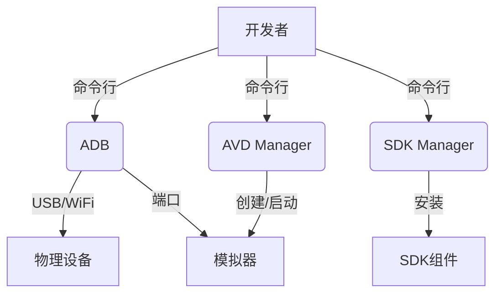

# 20.1.1 命令行工具

烈日当空。

知了的鸣叫一阵阵地从树梢传来，此起彼伏，像海浪一样涌过整个营地。洛芙靠在一棵大橡树的树干上，手里扇着一片大叶子，试图给自己带来一点凉意。

"好热啊......"她嘟囔着，汗水从额头滑落。

黛琳、伊莎和希尔坐在不远处的树荫下。黛琳面前摊着一本厚重的技术书，伊莎在编织一个草编手链，希尔则在一台笔记本电脑上敲敲打打。

"洛芙，过来一下。"黛琳抬起头，朝她招了招手。

洛芙走过去，在她们旁边坐下。"怎么了？"

"我 发现一个问题，"黛琳说，"你之前说你想安装新的SDK组件，但不知道怎么操作？"

"对啊，"洛芙点点头，"我想安装 Android 13 的 SDK 平台，但 Android Studio 的界面我不太会用。"

"其实不用每次都靠图形界面，"希尔抬起头，grins（露出灿烂的笑容），"命令行工具才是真正的瑞士军刀！"

"命令行？"洛芙眨眨眼，"就是那个黑乎乎的窗口？"

"对！"希尔兴奋地点点头，"等你学会了就知道有多好用——不仅能安装SDK，还能管理模拟器、安装APK、调试应用、查看日志，简直是神器！"

"听起来好像很厉害......"洛芙眼睛亮了一下，又有些犹豫，"但是我只会用图形界面哎，命令行看起来好复杂......"

"不复杂的，"黛琳温柔地笑着说，"我先给你讲讲原理，然后让希尔演示一遍，你很快就学会了。"

伊莎停下手中的草编，轻声说："我觉得命令行就像露营时的多功能刀——看起来简单，但能做好多事情呢。"

"比喻得真好！"黛琳笑着说，"那我们就从最简单的开始——adb，Android Debug Bridge。"

她在地上捡起一根小树枝，在地面上画了个简易的示意图。

"你可以把adb想象成连接电脑和手机（或模拟器）的桥梁，"黛琳解释道，"它让电脑可以给手机发送指令，比如安装应用、复制文件、查看日志等等。"

"那怎么用呢？"洛芙好奇地问。

希尔把笔记本电脑转过来，让大家都能看到屏幕。"首先，你需要确保adb已经添加到你的系统PATH中。在Mac或Linux上，你可以在~/.bash_profile或~/.zshrc中添加这样的配置："

```bash
# 环境变量配置
export ANDROID_HOME=/Users/你的用户名/Library/Android/sdk
export PATH=$PATH:$ANDROID_HOME/platform-tools:$ANDROID_HOME/cmdline-tools/latest/bin
```

"这样配置好后，你在终端输入adb version就能看到版本信息了。"希尔说。

黛琳点点头，接过话题："在Windows上稍有不同，但原理一样。配置好环境变量后，命令行就可以找到这些工具。"

"原来是这样！"洛芙恍然大悟，"那adb具体能做些什么呢？"

希尔扳着手指如数家珍："安装APK、卸载应用、推送文件、查看设备列表、截图、录屏、查看日志......太多了！"

"这么强大！"洛芙惊叹道。

"而且这些只是最常用的功能，"黛琳补充道，"对于专业的Android开发者来说，熟练使用命令行是基本功。"

伊莎轻轻地说："就像我们露营时学会用多功能刀一样——刚开始觉得麻烦，但真正遇到问题时，有工具在手里就不慌了。"

"说得对！"希尔点点头，"来，我给你演示一个实际的例子。"

她打开终端，连接上旁边的Android模拟器。

"看，这是启动模拟器的命令："希尔输入命令，"emulator -avd Pixel_4_API_33"

"这是用avdmanager创建的虚拟设备，"黛琳解释道，"AVD Manager是另一个重要的命令行工具，专门用来管理Android Virtual Device，也就是模拟器。"

洛芙目不转睛地看着屏幕。模拟器启动了，屏幕上显示出Android系统的界面。

"接下来，我们用adb安装一个应用试试。"希尔说。

她在终端输入："adb install demo.apk"

"看，这就安装好了！"希尔兴奋地说，"如果想卸载，只需要 adb uninstall com.example.demo"

洛芙眼睛越来越亮："好像比图形界面还方便！"

"还不只这些呢，"黛琳笑着说，"再试试查看日志——这对调试应用特别有用。"

希尔输入："adb logcat | grep MyApp"

终端上开始滚动显示各种日志信息。

"这是实时日志，"希尔解释道，"如果你想看过去的日志，可以加上时间参数。比如 adb logcat -d 会把之前的日志全部dump出来。"

"天哪......"洛芙惊叹道，"感觉像打开了一扇新世界的大门！"

"还有很多其他工具呢，"黛琳说，"比如 sdkmanager——专门用来管理SDK组件的工具。"

"就像它的名字一样，是SDK的管理员？"洛芙问。

"对！"黛琳点头，"你想安装新的SDK平台或者构建工具，都可以 用它。比如要安装 Android 13 的SDK平台，只需要："

```bash
sdkmanager "platforms;android-33" "build-tools;33.0.0"
```

"哇，真的好方便！"洛芙说，"那这些命令行工具都放在哪里呢？"

希尔打开文件管理器，指给洛芙看："通常在这里——"

```bash
# Android SDK 位置
$ANDROID_HOME/cmdline-tools/latest/bin/
# 或者旧的路径
$ANDROID_HOME/tools/bin/
```

"每个工具都有自己的目录，"希尔补充道，"把它们加入PATH后就能在任何地方使用了。"

黛琳在地上用树枝画了一幅图，展示这些工具之间的关系：



"这幅图展示了命令行工具的工作方式，"黛琳解释道，"开发者通过命令行发送指令，ADB负责与设备或模拟器通信，SDK Manager管理SDK组件，AVD Manager管理虚拟设备。"

"原来它们是这样协作的！"洛芙点点头，"那还有其他常用的工具吗？"

"当然！"希尔说，"比如 apksigner——用来给APK签名的，zipalign——用来优化APK的，还有 aapt2——用来编译资源文件的。"

"签名？"洛芙疑惑地问，"APK还需要签名吗？"

"需要的，"黛琳解释道，"Android系统要求所有APK都必须有开发者签名，这样才能保证应用的身份和完整性。没有签名的APK是无法安装的。"

"而zipalign是一种优化手段，"希尔补充道，"它调整APK文件的结构，让应用启动更快、占用内存更少。所有发布到Google Play的APK都需要先做zipalign。"

洛芙似懂非懂地点点头。

"慢慢来，不用急，"伊莎温柔地说，"今天学的这些，你以后会经常用到，慢慢就熟练了。"

"对了，"黛琳突然想起什么，"还有一个很重要的工具叫 d8 和 dx——它们负责把Java字节码转换成Android能运行的dex格式。不过这个平时不太需要直接调用，编译系统会自动处理。"

"听起来好复杂......"洛芙吐吐舌头。

"一开始都会觉得复杂，"黛琳笑着说，"但等你熟悉了常用的命令，就会发现命令行其实比图形界面更高效。特别是当你需要批量处理或者写自动化脚本的时候。"

希尔 grins（露出灿烂的笑容）："而且学会命令行后，你会发现很多问题都能自己解决，不用总是求助别人啦！"

洛芙重重地点点头："我一定会好好练习的！"

午后的阳光透过树叶的缝隙，在地上投下斑驳的光影。知了的叫声还在继续，但听起来似乎没有那么刺耳了。

"好了，今天就到这里吧，"黛琳合上书，"命令行的学习需要多练多用，光听不练是不行的。"

"我知道了！"洛芙说，"那我每天晚上都抽时间练习一下命令行。"

"这就对了！"希尔说，"等你熟练了就知道它的好了——很多事情在终端里几秒钟就完成了，在图形界面里要 点好几下。"

伊莎笑着说："就像露营时有了趁手的工具，做什么都方便。"

大家都会心地笑了。

远处的天空开始渐渐变红，夕阳已经开始西沉。洛芙抬头看了看天色，又看了看笔记本电脑上还在运行的模拟器，心里充满了成就感。

今天，她学会了使用命令行工具。虽然只是入门，但已经让她看到了一个更大的世界——原来除了图形界面，还有这样一个高效、强大的世界在等着她去探索。

"走吧，"黛琳站起来，"我们该准备晚饭了。"

"嗯！"洛芙也跟着站起来，"今天辛苦大家啦！"

"不客气～"希尔笑着收拾电脑，"明天我们继续讲更深入的内容！"

夕阳把四个女孩的影子拉得很长。她们一边聊着一边走向营地，脚步声在草地上发出沙沙的响声。

这一天，洛芙不仅学会了命令行工具的基本使用方法，更重要的是，她明白了——在Android开发的道路上，命令行工具是一个强大而可靠的伙伴。就像露营时的多功能刀，虽然看起来不起眼，但关键时刻总能派上用场。

---

## 技术总结

Android命令行工具是开发者在终端环境中与Android系统交互的核心工具集合。通过命令行，开发者可以完成SDK管理、模拟器控制、应用安装调试、日志查看等几乎所有开发相关的工作，无需依赖图形界面。

常用的Android SDK命令行工具包括：

| 工具名称 | 英文全称 | 主要用途 |
|----------|----------|----------|
| adb | Android Debug Bridge | 调试桥，连接电脑与设备，安装APK，查看日志等 |
| sdkmanager | SDK Manager | 管理SDK组件，安装/更新平台和构建工具 |
| avdmanager | AVD Manager | 创建和管理Android虚拟设备（模拟器） |
| apksigner | APK Signer | 为APK文件签名 |
| zipalign | ZIPalign | 优化APK文件结构 |
| aapt2 | Android Asset Packaging Tool 2 | 编译资源文件 |

这些工具通常位于Android SDK的cmdline-tools/latest/bin/目录下，需要将路径添加到系统PATH环境变量中才能在任意位置使用。配置环境变量的方法是在系统的配置文件（如~/.bash_profile、~/.zshrc或系统环境变量）中添加：

```bash
export ANDROID_HOME=/path/to/android/sdk
export PATH=$PATH:$ANDROID_HOME/cmdline-tools/latest/bin:$ANDROID_HOME/platform-tools
```

命令行工具既可以单独使用，也可以通过脚本组合实现自动化构建和批量处理，是Android开发者必须掌握的基本技能。

---

> **学习建议**：建议从adb命令开始学习，先掌握最常用的几个命令（如adb devices、adb install、adb logcat），然后逐步学习其他工具。熟能生巧，命令行用多了就会越来越熟练。

---

## 洛芙的小小日记本

> 今天跟黛琳她们学习了命令行工具！一开始看到黑黑的终端界面好害怕，但希尔一步步演示后就明白了——原来命令行就像瑞士军刀，能做好多事情！adb可以安装应用、查看日志，sdkmanager可以管理SDK组件，真的好强大呀～要继续练习！☀️

---

## 今日关键词

- **命令行工具 (Command-line tools)**：在终端环境中使用的工具，用于与Android系统交互。
- **ADB (Android Debug Bridge)**：Android调试桥，是连接电脑与Android设备的核心工具。
- **SDK Manager**：SDK管理工具，用于安装、更新和查看Android SDK组件。
- **AVD Manager**：虚拟设备管理工具，用于创建和管理Android模拟器。
- **APK Signer**：APK签名工具，用于为Android应用包签名。
- **ZIPalign**：APK优化工具，用于优化APK文件结构以提升性能。
- **AAPT2**：Android资源打包工具，用于编译资源文件。
- **环境变量 (Environment Variable)**：操作系统中的变量，用于配置工具路径等。
- **PATH**：系统环境变量，用于指定可执行文件的搜索目录。
- **虚拟设备 (Virtual Device)**：在电脑上运行的Android模拟器。