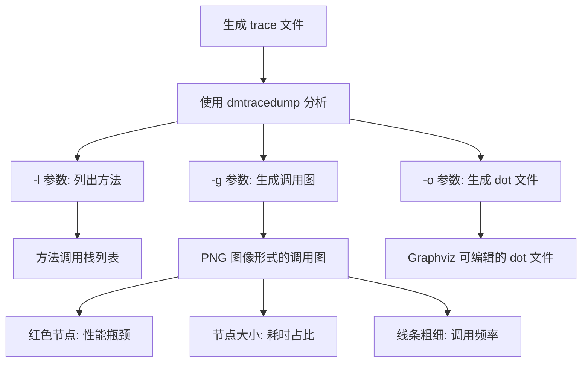

# 20.1.10 dmtracedump

太阳已经沉到山那边去了，只剩下一抹橘红色的余晖还挂在天际。

洛芙靠在折叠椅上，用草茎编着手指头玩。她已经盯着屏幕看了整整一个下午，代码看了又看，逻辑查了又查，可那个新写的列表滑动起来就是卡顿得像在泥潭里跋涉。

"又在跟那个列表较劲呢？"希尔端着一盘切好的西瓜走过来，上面还插着几根竹签。

"嗯。"洛芙有气无力地应了一声，"你说同样是展示一百条数据，怎么别人的App滑动起来跟抹了油似的，我这儿的就......"

"你这种属于典型的性能问题。"黛琳不知道什么时候也走了过来，手里拿着一瓶矿泉水，"光看代码可看不出性能瓶颈在哪儿。"

"那怎么看？"洛芙抬起头，眼睛里终于有了点光。

"得 tracing。"黛琳在她旁边坐下，"今天教你用 dmtracedump——这是 Android SDK 里专门用来分析性能追踪数据的工具。"

"追踪？"洛芙眨了眨眼，"是像猎人跟踪猎物那样吗？"

"差不多。"黛琳忍不住笑了，"不过我们跟踪的是代码的执行路径——哪个方法调用了哪个方法，哪个操作最耗时，一目了然。"

伊莎不知道什么时候也凑了过来，她轻轻巧巧地把一颗西瓜子吐进垃圾桶："听起来像是给代码装了个监控摄像头。"

"没错，就是这个意思。"黛琳拧开矿泉水瓶喝了一口，"在 Android 里，你可以用 Debug 类或者 systrace 来生成 .trace 文件，然后交给 dmtracedump 来分析。"

洛芙来了精神："那我们现在就试试？"

"首先你得有一份 trace 文件。"希尔把电脑转过来，"来，我给你演示一下怎么生成。我们可以用 Debug 类，在代码里埋几个采样点。"

```kotlin
import android.os.Debug

// 在需要追踪的代码开始处
Debug.startMethodTracing("my_trace")

// ... 这里是你想要追踪的代码逻辑
// 比如加载列表数据
val data = loadListData()
recyclerView.adapter = DataAdapter(data)

// 在代码结束处
Debug.stopMethodTracing()
```

"运行之后，就会在手机的 `/data/local/tmp/` 目录下生成一个 `my_trace.trace` 文件。"希尔解释道，"不过这个目录需要 root 权限才能访问。"

"那普通人怎么办？"洛芙问。

"可以用 systrace。"黛琳接过话头，"systrace 是用 shell 命令行的方式跑的，不需要 root 权限。它会生成一份 html 报告，但如果你想看更详细的调用链分析，dmtracedump 就派上用场了。"

洛芙似懂非懂地点点头："所以 trace 文件就像是一本日记，记录了代码执行的每一个步骤？"

"比日记还详细。"黛琳笑着说，"它是按时间顺序记录的方法调用栈。我们来看看 dmtracedump 怎么分析这个 trace 文件。"

希尔已经把电脑连上了手机，她在命令行里敲了几下："先看看 trace 文件里都有什么方法。"

```bash
# 查看 trace 文件中的方法列表
dmtracedump -l my_trace.trace
```

"这个 `-l` 参数会列出所有的方法调用。"黛琳指着屏幕说，"你看到的最上面那一串就是调用栈——就像一摞叠在一起的盘子，最上面的是正在执行的方法，下面的是调用它的方法。"

"哇......"洛芙凑近屏幕，看到输出里密密麻麻的方法名，"这也太多了吧？"

"所以我们需要图形化的方式来看。"希尔又在敲命令，"看这个，用 `-g` 参数可以生成调用图。"

```bash
# 生成调用图（PNG 格式）
dmtracedump -g trace_graph.png my_trace.trace

# 也可以生成 dot 格式，用 Graphviz 转换成图片
dmtracedump -o trace_graph.dot my_trace.trace
```

黛琳把手机立起来当白板用："洛芙你看，这个调用图就像一棵倒着长的树。树根是最底层的方法，比如 `onDraw` 或者 `loadDataInBackground`，树枝往上是调用它们的上层方法。"

"那树枝越往上的方法，就是最终被我们看到的那个？"

"对。"黛琳点头，"而且图中每个节点旁边都会标注耗时。如果是红色的节点，那就是性能瓶颈所在——这个方法太慢了，拖累了整体体验。"

洛芙眼睛亮了："所以我只要找到那个红色的节点，就能知道卡顿的原因了？"

"差不多。"希尔说，"不过有时候问题不在最慢的方法本身，而在它被调用的方式。比如一个方法本身很快，但被调用了1000次，加起来就慢了。"

"这种情况 dmtracedump 也能看出来吗？"

"能的。"黛琳指着屏幕上的调用次数说，"你注意看 `inc` 这个数字——它表示方法被调用的次数。如果一个方法被调用了太多次，系统会给出警告。"

伊莎在一旁剥着橘子皮，突然开口："这让我想起上次在山里走路，有人走的是平坦的大路，有人偏要走荆棘丛生的小路——最后当然是走大路的人先到目的地。代码也是同样的道理，同样的功能，实现方式不同，速度能差出十万八千里。"

"伊莎这个比喻好！"洛芙拍了一下手，"那我那个列表卡顿，是因为选了一条'荆棘小路'咯？"

"有可能。"黛琳说，"好了，现在我们来找找你那个列表的问题。你先把 trace 文件拉到电脑上，我们来分析一下。"

希尔把手机里的 trace 文件拖到电脑上，然后敲下命令：

```bash
# 查看 trace 文件中的方法列表和调用统计
dmtracedump -l my_trace.trace | head -50
```

屏幕上刷出了长长的方法列表。黛琳指着其中一行说："看这里，`RecyclerView.onBindViewHolder` 被调用了多少次？"

洛芙凑过去看："哦！它被调用了 100 次——正好是我的列表项数量！"

"每次绑定一个列表项都要调用一次，这个很正常。"黛琳说，"问题可能在下面这几个方法上。"

她继续往下翻，找到了几个红色的条目：`loadListData()`、`parseJsonData()`、`ImageLoader.loadImage()`。

"哦！"洛芙叫了起来，"有个 `ImageLoader.loadImage()` ！我每次加载列表图片都用的这个方法！"

"看到了吧？"黛琳说，"这里每次加载图片都需要 50 毫秒，而你的列表有一百个图片，加起来就是 5 秒——这还是理想情况。如果是网络图片，可能要好几秒甚至更久。"

"那怎么办？"洛芙问，"总不能不放图片吧？"

"谁说不放？"希尔笑了，"用图片缓存啊。你每次都从网络下载新的图片，多浪费。你看，应该这样改："

```kotlin
// 之前的写法（每次都下载）
class ImageLoader {
    fun loadImage(url: String, imageView: ImageView) {
        // 每次都创建新请求，网络请求耗时长
        Glide.with(context).load(url).into(imageView)
    }
}

// 优化后的写法（使用缓存）
class ImageLoader(private val context: Context) {
    private val imageCache = LruCache<String, Bitmap>(100) // 内存缓存
    
    fun loadImage(url: String, imageView: ImageView) {
        // 先从内存缓存找
        val cached = imageCache.get(url)
        if (cached != null) {
            imageView.setImageBitmap(cached)
            return
        }
        
        // 缓存没有，再从磁盘或网络加载
        Glide.with(context)
            .load(url)
            .diskCacheStrategy(DiskCacheStrategy.ALL) // 磁盘缓存
            .into(object : CustomTarget<Drawable>() {
                override fun onResourceReady(resource: Drawable, transition: Transition<in Drawable>?) {
                    // 存入内存缓存
                    val bitmap = (resource as BitmapDrawable).bitmap
                    imageCache.put(url, bitmap)
                    imageView.setImageDrawable(resource)
                }
                
                override fun onLoadCleared(placeholder: Drawable?) {
                    // 清理资源
                }
            })
    }
}
```

"这样第一次加载还是慢，但之后就会快很多。"希尔说，"因为图片会被缓存起来，下次再显示同样 URL 的图片时，直接从内存里拿，一毫秒都用不了。"

洛芙连连点头："原来是这样！那我还有一个问题——为什么我的列表滚动的时候也会卡？"

"这是另一个常见问题。"黛琳说，"你滚动的时候，是不是每滚动一下就会触发一次数据重新加载？"

"对啊！我每次滚动都调用了 `notifyDataSetChanged()`！"

"这就是问题了。"黛琳摇头，"`notifyDataSetChanged()` 会让整个列表重新绑定，一次性刷新所有可见项。你应该用 `notifyItemInserted()` 或者 `notifyItemChanged()` 这种精细化的刷新方式，只更新变化的部分。"

"还有这样的区别！"洛芙惊叹道，"那我来改一下代码。"

她把笔记本电脑搬到膝盖上，开始敲代码：

```kotlin
// 之前的低效写法
fun onDataReceived(newData: List<Item>) {
    dataList.clear()
    dataList.addAll(newData)
    adapter.notifyDataSetChanged() // 刷新整个列表
}

// 优化后的写法
fun onDataReceived(newData: List<Item>) {
    val oldSize = dataList.size
    dataList.addAll(newData)
    // 只通知新增的部分
    adapter.notifyItemRangeInserted(oldSize, newData.size)
}

// 如果是替换某个位置的项
fun updateItem(position: Int, newItem: Item) {
    dataList[position] = newItem
    adapter.notifyItemChanged(position) // 只刷新这一项
}
```

"这样滚动起来就顺滑多了。"希尔凑过来看了一眼代码，满意地点点头，"而且用户体验也更好——你刷新整个列表的话，用户正在看的内容会突然闪一下，精细更新就不会有这个问题的。"

洛芙开心地把代码保存好："太好了！那这个 dmtracedump 太管用了，我以后一定要多用用它来找性能问题！"

"性能优化是无止境的。"黛琳站了起来，把矿泉水瓶的盖子拧紧，"你现在这只是最基础的两个问题——图片缓存和列表刷新。等你做到几万条数据的时候，还会遇到更多问题。"

"比如呢？"洛芙好奇地问。

"比如内存泄漏啊，布局过度绘制啊，主线程阻塞啊之类的。"黛琳说，"不过别担心，我们后面会一个个讲的。今天这个'性能调优'的入门，你已经学会了。"

夜空已经铺满了星星。风把帐篷上的旗帜吹得轻轻飘动，偶尔有一两只夜鸟从林间飞过，发出清脆的叫声。

伊莎仰头看着天："今天的星星真好看啊。"

"就像代码里的调用图一样。"希尔冷不丁来了一句，"一个节点连着一个节点，密密麻麻的，但只要找到了根，就能看清整棵树。"

洛芙被这个奇怪的比喻逗笑了："希尔姐，你这个比喻太硬核了！"

"哈哈，走走走，吃夜宵去。"希尔拍了拍洛芙的肩膀，"今天辛苦了，本大厨给你们露一手，烤一点上次买的棉花糖！"

三个女孩收拾好电脑和零食，围到烤炉旁边。火光映红了她们的脸，噼啪作响的木炭声中，洛芙的心比篝火还要温暖。

"黛琳，"她突然开口，"你说性能优化那么难，我万一学不会怎么办？"

"谁说的性能优化难了？"黛琳把一串棉花糖架到火上，"那只是因为你没有用对方法。trace 文件就是你的眼睛，dmtracedump 就是你的放大镜——有了它们，再复杂的问题都能看得清清楚楚。"

"嗯！"洛芙用力点头，"我以后每次遇到卡顿，就先跑一遍 trace！"

"这就对了。"黛琳微笑着把烤好的棉花糖递给她，"记住，解决问题之前，先要看到问题。"

夜风吹过营地把火苗吹得摇摇晃晃的，也把女孩们的笑声带向远方。

---

## 技术总结

> dmtracedump 是 Android SDK 中的一个命令行工具，用于分析性能追踪数据（.trace 文件）。它可以生成调用图（call graph），以可视化的方式展示方法调用关系，帮助开发者定位性能瓶颈。

#### 结构图



#### 复杂度与影响

| 操作 | 时间复杂度 | 内存影响 |
|------|-----------|---------|
| 生成 trace 文件 | O(n) | 取决于采样频率 |
| dmtracedump -l | O(m) | 低，仅读取文件 |
| dmtracedump -g | O(m * k) | 中等，需要构建图 |

其中 n = 采样点数量，m = 方法数量，k = 平均调用深度。

#### 反模式与陷阱

1. **频繁调用 `notifyDataSetChanged()`**  
   原因：每次都刷新整个列表，导致性能下降。  
   修复：使用 `notifyItemInserted()`、`notifyItemChanged()` 等精细化更新。

2. **图片未缓存**  
   原因：每次显示图片都从网络加载，耗时且浪费流量。  
   修复：使用 Glide 或 Picasso 的磁盘缓存和内存缓存。

3. **在主线程执行耗时操作**  
   原因：网络请求、数据库查询等操作阻塞 UI 线程。  
   修复：使用协程、Executor 或 WorkManager 将操作移到后台线程。

#### 设计哲学

1. **可观测性优先**  
   性能优化第一步是发现问题，而 trace 分析是发现问题最直接的手段。

2. **量化决策**  
   不要凭感觉优化，用数据说话——哪个方法耗时最长，哪个调用次数最多，一目了然。

3. **缓存为王**  
   能缓存的数据绝不重复计算，能复用的资源绝不重复请求。

4. **精细化更新**  
   只更新变化的部分，而非刷新整个界面。

5. **按需加载**  
   对于大量数据，使用分页加载或懒加载，避免一次性加载造成的卡顿。

---

## 🏕️ 动手练习

#### 方式 A：项目制 - 性能追踪分析实战

**项目目标**：创建一个带列表的 Demo App，生成 trace 文件并用 dmtracedump 分析性能问题。

**Task 1: 创建带性能问题的列表 Demo**
- 目标：创建一个展示图片列表的 Android App，故意引入性能问题
- 步骤：
  1. 新建 Android 项目
  2. 添加 RecyclerView 依赖
  3. 创建一个展示 100+ 张网络图片的列表
  4. 不使用图片缓存，每次都重新加载
- 验收标准：`[ ] 列表能正常显示图片但滚动卡顿`

**Task 2: 生成 trace 文件**
- 目标：使用 Debug 类生成追踪文件
- 步骤：
  1. 在 `onCreate` 中调用 `Debug.startMethodTracing("list_perf")`
  2. 在列表加载完成后调用 `Debug.stopMethodTracing()`
  3. 运行 App 并触发列表加载
  4. 使用 adb pull 将 trace 文件拉到电脑
- 验收标准：`[ ] 成功生成 my_trace.trace 文件`

**Task 3: 使用 dmtracedump 分析**
- 目标：分析 trace 文件找出性能瓶颈
- 步骤：
  1. 运行 `dmtracedump -l my_trace.trace | head -100`
  2. 找出耗时最长的方法
  3. 运行 `dmtracedump -g output.png my_trace.trace` 生成调用图
  4. 分析调用图中的红色节点
- 验收标准：`[ ] 找出至少 3 个性能瓶颈方法`

**Task 4: 优化图片加载**
- 目标：使用图片缓存解决性能问题
- 步骤：
  1. 添加 Glide 依赖
  2. 配置磁盘缓存和内存缓存
  3. 重新生成 trace 文件
  4. 对比优化前后的耗时
- 验收标准：`[ ] 优化后图片加载时间减少 50% 以上`

**Task 5: 优化列表刷新**
- 目标：使用精细化更新替代全量刷新
- 步骤：
  1. 将 `notifyDataSetChanged()` 改为 `notifyItemInserted()`
  2. 重新测试滚动流畅度
  3. 生成新的 trace 文件对比
- 验收标准：`[ ] 滚动帧率从 <30fps 提升到 >=55fps`

---

## 面试热身

1. 请用自己的话解释 dmtracedump 的作用，以及它和 systrace 的区别是什么？
2. 如果你发现某个方法的 `inc`（调用次数）非常高，你应该考虑做什么优化？
3. 解释一下为什么 `notifyDataSetChanged()` 会导致性能问题？
4. 图片缓存的原理是什么？内存缓存和磁盘缓存有什么区别？
5. 如何判断一个性能问题是"代码层面的问题"还是"系统层面的问题"？

---

## 参考实现要点

1. **优先使用 Glide/Picasso 等成熟库**，它们已经实现了完善的缓存机制和性能优化。
2. **使用 RecyclerView 的 DiffUtil** 进行高效的数据对比和局部更新。
3. **图片加载使用合适的尺寸**，不要加载原图然后在 ImageView 中缩放。
4. **对于大量数据，启用分页加载**（Paging 3 库）。
5. **定期使用 dmtracedump 检查代码**，养成性能优化的习惯。

---

> 性能优化就像整理房间——平时看不见问题，一旦需要找东西就手忙脚乱。保持代码的整洁和高效，才不会在关键时刻掉链子。

## 今日关键词

- **dmtracedump**：Android SDK 命令行工具，用于分析 .trace 性能追踪文件，生成方法调用图
- **trace 文件**：由 Debug.startMethodTracing() 或 systrace 生成的性能数据文件，记录方法调用栈和耗时信息
- **systrace**：Android 系统级性能追踪工具，生成 HTML 报告展示系统各组件的性能数据
- **Debug 类**：Android 提供的性能追踪 API，通过 startMethodTracing/stopMethodTracing 生成 trace 文件
- **调用图（Call Graph）**：dmtracedump 生成的图形化展示，节点代表方法，边代表调用关系，节点颜色表示耗时
- **inc**：dmtracedump 输出中的调用次数统计，表示某个方法被调用的总次数
- **notifyDataSetChanged**：RecyclerView.Adapter 的方法，刷新整个列表，效率较低
- **notifyItemInserted/notifyItemChanged**：RecyclerView.Adapter 的精细化更新方法，只刷新变化的部分
- **内存缓存（LruCache）**：最近最少使用缓存，用于存储频繁访问的数据如图片
- **磁盘缓存（DiskCache）**：将数据持久化存储在磁盘上，如网络下载的图片
- **Glide**：Android 主流图片加载库，支持内存缓存、磁盘缓存、图片变换等
- **主线程（UI Thread）**：Android UI 操作的线程，在此线程执行耗时操作会导致卡顿
- **后台线程（Background Thread）**：用于执行耗时操作的线程，如网络请求、数据库查询
- **过度绘制（Overdraw）**：同一像素被绘制多次，浪费 GPU 资源，影响渲染性能
- **布局优化（Layout Optimization）**：使用 ConstraintLayout、ViewStub 等技术减少视图层级
