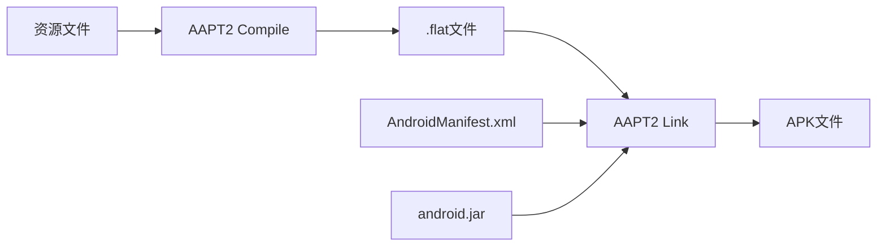
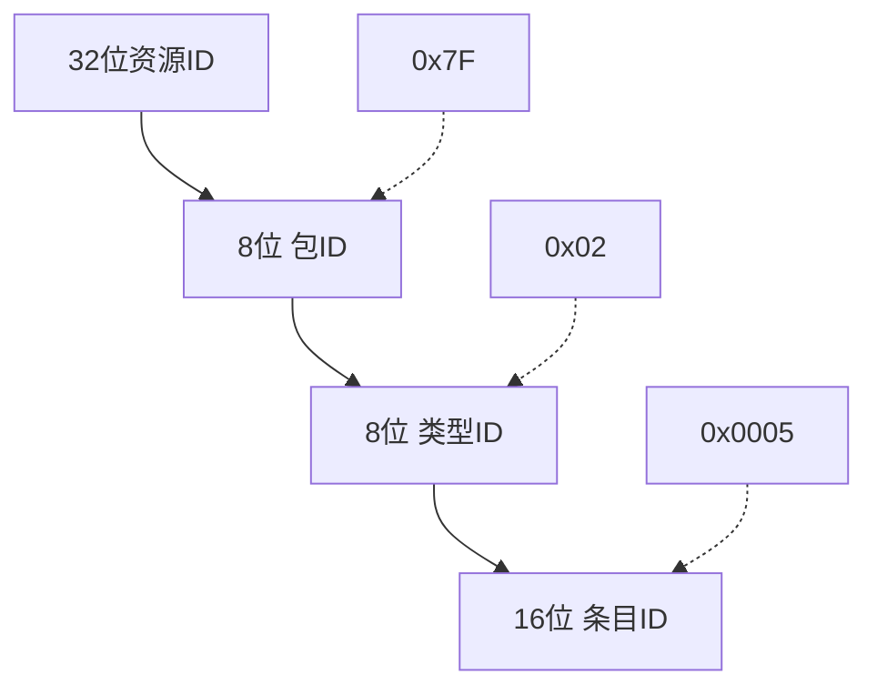
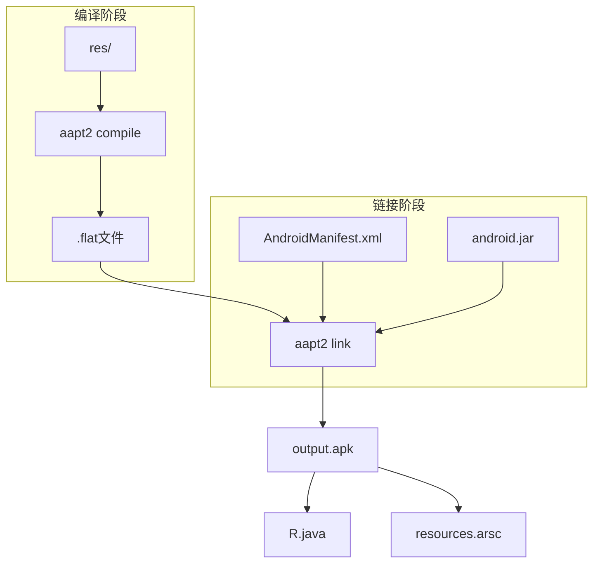

# 20.1.2 AAPT2

## 资源编译的秘密

太阳已经爬到了头顶。

洛芙用手背擦了一下额头上的汗珠，转头看向黛琳。刚才她们讨论了命令行工具的整体图景，现在她满脑子都是那些有趣的命令名字。

"所以，"洛芙盘腿坐在草地上，膝盖上放着她的笔记本，"那些工具具体是做什么的呀？比如刚才提到的AAPT2？"

黛琳从背包里掏出一个文件夹，里面是几张打印出来的图表。她铺开最上面那张，上面画满了方框和箭头。

"AAPT2是Android资源打包工具的第二代，"她用铅笔尖指着图上标记为"Compile"的方框，"你们可以把它想象成……嗯，建筑工地的材料加工车间。"

"材料加工？"希尔凑过来看图，"是不是就像把木材切割成合适尺寸的机器？"

"差不多。"黛琳点点头，"在Android开发中，我们的app里有各种资源文件——布局XML、图片、字符串、颜色值等等。这些文件人类看得懂，但Android系统看不懂。AAPT2的作用就是把这些人类写的资源文件，翻译成系统能识别的二进制格式。"

伊莎正把采来的野花编成花环，她抬起头："可是，为什么需要两种格式呢？"

"这是一个很好的问题。"黛琳把铅笔竖起来，像老师讲课那样，"想想看，如果你直接让系统每次都去解析那些文本格式的XML，会发生什么？"

"会慢？"洛芙猜测。

"不只是慢。"黛琳摇头，"你想，那些XML里可能有各种路径引用、样式继承、资源引用。如果每次运行app都要重新解析这些复杂的关系，系统会非常吃力。二进制格式就像把这些信息提前'烹饪'好，系统直接端上桌就能吃，不需要每次现做。"

## 编译的魔法

希尔已经打开了她的笔记本电脑："我来演示一下实际操作吧。首先，我们看看AAPT2的compile命令。"

她在终端里敲了一行命令：

```bash
aapt2 compile /path/to/res/values/strings.xml -o compiled/
```

"看，这个命令做了什么事呢？"希尔指着屏幕，"简单说就是把strings.xml编译成.flat文件。flat是AAPT2使用的编译后格式。"

"编译出来的文件是什么样的？"洛芙问。

希尔切换到输出目录，执行了ls命令：

```bash
$ ls -la compiled/
-rw-r--r-- 1 staff  staff  1234 Apr 15 10:30 strings.flat
```

"看，原始的XML文件被编译成了.flat后缀的文件。这个文件是二进制的，人眼直接看会是一团乱码，但系统能快速读取。"

黛琳补充道："而且AAPT2的compile命令可以一次处理整个目录。试试看："

```bash
aapt2 compile path/to/res/ -o output/
```

"这会递归编译res目录下所有的资源文件，非常方便。"黛琳说，"而且——这很关键——AAPT2支持增量编译。"

"增量编译？"洛芙眨眨眼，"是指只编译改过的部分吗？"

"对。"黛琳微笑，"如果你只修改了某一个XML文件，不需要重新编译整个资源目录。AAPT2会记住哪些文件已经编译过，只处理那些变化的。这在大型项目中可以节省很多构建时间。"

## 伪本地化的把戏

伊莎把编好的花环戴在头上，歪着头问："我注意到刚才的命令里有--pseudo-localize，这个是做什么的？"

"啊，你观察得很仔细。"黛琳拿起笔在图上标注，"伪本地化是AAPT2的一个很有用的功能。"

她解释道："当开发app需要支持多语言时，你需要准备各种语言的字符串资源。但在开发早期，你可能还没有翻译好的文本，怎么测试多语言界面呢？"

"随便找些文本填进去？"洛芙问。

"那样太不专业了。"黛琳笑着摇头，"伪本地化会自动把英文文本转换成一种特殊的'假翻译'版本。比如，你的原始字符串'Hello'会变成'[Ĥêļļô]'。"

"哇，好神奇！"洛芙睁大眼睛，"这样就能看出界面布局有没有问题？"

"对。"黛琳点头，"使用伪本地化后，所有字符串都会被替换成带特殊标记的版本。这样做有两个好处：第一，你可以一眼看出哪些界面元素还没有提取到字符串资源里（它们还会显示原始英文）；第二，那些被转换后的字符串会比原始英文更长，这样可以测试界面在翻译成较长的语言（比如德语）时是否会溢出。"

希尔演示了一下：

```bash
$ aapt2 compile --pseudo-localize path/to/res/ -o pseudo_output/

# 查看编译后的字符串
$ cat pseudo_output/values_strings.flat | strings | head -5
[Ĥêļļô]
[Wôŕļð]
[Ţĥîŝ îš â ţêšţ]
```

"看，"希尔说，"所有的英文字符串都被转换了。这样开发者可以在不需要真正翻译的情况下测试界面。"

## 链接的仪式

"好了，编译完成了。"黛琳把图纸翻到下一页，"接下来是更重要的环节——链接。"

她画了一个简单的流程图：



"如果说compile是加工原材料，"黛琳解释，"link就是把这些原材料组装成最终产品。"

"它怎么组装？"洛芙问。

"看这个命令。"希尔敲出：

```bash
aapt2 link -o output.apk \
    -I android.jar \
    compiled/*.flat \
    AndroidManifest.xml
```

"这里有几个关键参数："希尔一个个解释：

"-o output.apk 指定输出的APK文件名。"
"-I android.jar 引入Android框架的jar包，这样系统才知道有哪些可用的资源类型。"
"compiled/*.flat 是我们之前编译好的所有.flat文件。"
"AndroidManifest.xml 是app的清单文件。"

"链接过程会做什么呢？"伊莎问。

"很多重要的事情。"黛琳扳着手指数，"首先，它会把所有编译好的资源整合到一起，建立资源ID和资源名称的映射关系。其次，它会验证AndroidManifest.xml里声明的组件是否都存在。第三，它会检查资源之间的引用是否正确。第四，它会生成R.java文件——这个文件包含了所有资源的ID常量，代码里可以引用它们。"

洛芙赶紧记笔记："所以link就是把所有东西打包成APK？"

"对，但不止是打包。"黛琳说，"链接时还会做很多优化。比如，它会合并重复的资源，去除未使用的资源。这样可以让最终的APK更小。"

## 资源ID的奥秘

"我有个问题，"希尔突然说，"资源ID是什么？每个资源都有一个唯一的ID吗？"

"问得好。"黛琳重新画了一张图，"在Android中，每个资源都有一个32位的整数ID。这个ID被分成三部分："



"看，"黛琳解释，"第一个字节是包ID，通常是0x7F，表示这是app自己的资源。第二个字节是类型ID，比如0x02代表string，0x03代表layout。最后两个字节是具体资源的索引。"

"所以R.java里就是这些数字？"洛芙问。

"对。"黛琳说，"当你写R.string.app_name时，编译器会把它翻译成类似0x7F020005这样的整数。系统通过这个ID快速找到对应的资源。"

希尔补充道："这就是为什么我们不直接用字符串引用资源——用ID更快。系统在运行时不需要做字符串匹配，直接整數比较就找到了。"

## 符号表的魔法

"对了，"伊莎好奇地问，"编译后的文件里，我们还能看到原来的资源名称吗？"

"可以的。"黛琳说，"AAPT2在编译时会生成一个符号表，保留所有资源名称的映射。这个符号表在调试时非常有用。"

"怎么查看？"希尔问。

"使用aapt2 dump命令。"她操作起来：

```bash
$ aapt2 dump --values resources output.apk | head -20

Resource Table:
Package id 127:
  Type 0x02 (string):
    Resource 0x7f020000: "app_name"
    Resource 0x7f020001: "hello_world"
    Resource 0x7f020002: "goodbye"
```

"看，"黛琳指着输出，"这里可以看到所有的字符串资源及其ID和名称。即使编译成了二进制格式，我们依然可以追溯到原始名称。"

"这对调试很有用吧？"洛芙说。

"非常有用。"黛琳点头，"当你看到一个崩溃日志里显示的资源ID时，你可以通过这个dump命令反向查出是哪个资源出了 问题。这也是为什么AAPT2在debug和release build中都很有价值。"

## 构建系统里的AAPT2

"说了这么多，"希尔活动了一下手指，"我们实际在Android Studio里build的时候，这些命令是自动执行的吗？"

"对。"黛琳说，"Gradle插件会自动调用AAPT2，你通常不需要手动敲这些命令。但了解底层原理很重要，因为："

她竖起手指："第一，当构建出问题时，你知道发生了什么。第二，你可以手动调用AAPT2来做一些特殊操作，比如单独编译某个资源来debug。第三，在CI/CD环境里，你可能需要直接使用这些工具。"

"而且，"希尔补充，"现在AGP 3.0+默认启用AAPT2，它比老版本的AAPT更快，因为支持并行编译和更好的缓存。"

洛芙若有所思："所以我们今天学的这些，在实际工作中不一定直接用到，但能帮助我们理解Android构建过程？"

"完全正确。"黛琳微笑，"这就像了解汽车的发动机原理一样——你不一定要自己修发动机，但知道它怎么工作，能帮你更好地开车。"

## 炎炎夏日里的收获

太阳已经偏西，阳光不再那么毒辣。远处的树干上传来此起彼伏的蝉鸣声，这是夏天独有的背景音乐。

洛芙合上笔记本，伸了个懒腰："今天学到了好多啊！原来那些看似简单的资源文件，背后有这么多工序。"

"而且每个环节都有优化的空间。"希尔总结道，"编译时的增量构建、链接时的资源合并……"

伊莎把花环调整了一下位置："我觉得最神奇的是伪本地化功能——用技术手段模拟还没到来的翻译需求。"

"这确实是很有前瞻性的设计。"黛琳点头，"在真正的多语言app开发中，这个功能可以节省很多时间。"

她看向远处的山丘："好了，今天的内容就到这里。明天我们会讲另一个重要的命令行工具——ADB。到时候可以看看怎么和设备直接对话。"

"期待！"洛芙说，"那今天先休息一下吧，我去买点冰激凌来。"

"我也要！""我也要！"希尔和伊莎响应道。

四个女孩收拾好东西，朝营地的服务站走去。夕阳把她们的影子拉得很长，蝉鸣声一路相随。

---

## 技术总结

> AAPT2（Android Asset Packaging Tool 2）是Android构建系统的核心组件，负责将开发者编写的人类可读的资源文件（XML、图片等）编译成Android系统可快速解析的二进制格式，并在链接阶段将所有资源与AndroidManifest.xml整合成最终的APK包。

#### 结构图



#### 复杂度与影响

- **编译阶段**：O(n) 复杂度，其中n为资源文件数量。增量编译仅处理变化文件。
- **链接阶段**：O(m) 复杂度，m为编译后的.flat文件总数。需要进行资源ID分配和符号解析。
- **性能影响**：AAPT2相比AAPT1有显著提升，支持并行编译和更好的增量构建。

#### 反模式与陷阱

1. **手动编译后忘记链接**：单独使用compile只是生成了中间产物，必须通过link生成APK才能安装测试。
2. **忽略增量编译优势**：每次都clean build会导致构建时间大幅增加。
3. **混淆debug和release的资源处理**：release build会进一步压缩和优化资源。
4. **资源ID冲突**：手动分配资源ID可能与系统ID冲突，导致运行时崩溃。

#### 名词小传

- **flat格式**：AAPT2使用的编译后资源文件格式，是一种二进制结构。
- **资源ID**：32位整数标识符，唯一对应一个资源，由包ID、类型ID、条目ID组成。
- **伪本地化**：将字符串转换为带有特殊标记的"假翻译"版本，用于测试多语言界面布局。

#### 设计哲学

Android构建系统的核心设计思想是**分层处理与渐进优化**：

1. **编译与链接分离**：将资源处理分为两个独立阶段，支持增量构建。
2. **二进制优先**：资源在编译阶段转换为二进制格式，优化运行时性能。
3. **工具链可组合**：AAPT2既可独立使用，也可通过Gradle自动调用。
4. **可调试性**：即使编译后的APK也保留资源符号信息，便于问题排查。

#### 🏕️ 动手练习

**目标**：掌握AAPT2的基本命令行操作和资源编译流程。

**Task 1：编译单个资源文件**

1. 目标：使用aapt2 compile命令编译一个XML资源文件。
2. 你需要做的：
   - 创建一个测试目录，包含一个简单的strings.xml文件
   - 执行aapt2 compile命令将XML编译为.flat文件
   - 使用file命令验证输出是二进制格式
3. 验收标准：
   - [ ] 编译命令成功执行，无报错
   - [ ] 输出文件扩展名为.flat
   - [ ] file命令显示为"data"类型（二进制）
4. 提示：
   ```bash
   # strings.xml 示例内容
   <?xml version="1.0" encoding="utf-8"?>
   <resources>
       <string name="test">Hello World</string>
   </resources>
   
   # 编译命令
   aapt2 compile strings.xml -o output/
   ```

**Task 2：批量编译目录资源**

1. 目标：使用aapt2 compile命令递归编译整个res目录。
2. 你需要做的：
   - 在res目录下创建values、layout等子目录，放入多个XML文件
   - 执行aapt2 compile命令编译整个目录
   - 检查输出目录中的.flat文件数量
3. 验收标准：
   - [ ] 所有XML文件都被编译
   - [ ] 输出目录结构正确保留
   - [ ] 每个XML对应一个.flat文件
4. 提示：
   ```bash
   aapt2 compile path/to/res/ -o compiled/
   ```

**Task 3：使用伪本地化编译**

1. 目标：使用--pseudo-localize选项编译资源。
2. 你需要做的：
   - 准备包含英文字符串的strings.xml
   - 添加一些较短的英文文本（如"OK"、"Cancel"）
   - 使用--pseudo-localize选项编译
   - 验证输出的字符串被伪本地化处理
3. 验收标准：
   - [ ] 编译成功，无警告
   - [ ] 原始字符串被转换为伪本地化格式
   - [ ] 字符串长度增加（被标记字符填充）
4. 提示：
   ```bash
   aapt2 compile --pseudo-localize strings.xml -o pseudo_output/
   # 使用strings命令查看二进制文件内容
   strings pseudo_output/*.flat | head -10
   ```

**Task 4：链接生成APK**

1. 目标：使用aapt2 link命令将编译后的资源链接成APK。
2. 你需要做的：
   - 准备AndroidManifest.xml和已编译的.flat文件
   - 准备一个android.jar（或从SDK获取）
   - 执行aapt2 link命令生成APK
   - 使用unzip查看APK内容
3. 验收标准：
   - [ ] APK文件成功生成
   - [ ] APK中包含resources.arsc
   - [ ] APK中包含AndroidManifest.xml
   - [ ] APK中包含编译后的资源文件
4. 提示：
   ```bash
   aapt2 link -o test.apk \
       -I /path/to/android.jar \
       compiled/*.flat \
       AndroidManifest.xml
   
   # 查看APK内容
   unzip -l test.apk
   ```

**Task 5：dump资源信息**

1. 目标：使用aapt2 dump命令查看APK中的资源信息。
2. 你需要做的：
   - 使用前面生成的test.apk
   - 执行aapt2 dump resources命令
   - 查找特定资源的信息
3. 验收标准：
   - [ ] 能够列出所有资源ID和名称
   - [ ] 能够查看特定类型的资源
   - [ ] 理解输出的格式含义
4. 提示：
   ```bash
   aapt2 dump resources test.apk
   # 或查看特定资源类型
   aapt2 dump --values resources test.apk | grep string
   ```

**Task 6：理解资源ID结构**

1. 目标：通过dump输出，分析资源ID的组成结构。
2. 你需要做的：
   - 对dump输出的资源ID进行分组分析
   - 识别包ID、类型ID、条目ID的位置
3. 验收标准：
   - [ ] 能从0x7F02XXXX格式识别包ID和类型ID
   - [ ] 理解同类型资源的ID递增规律
4. 提示：资源ID格式为0xPPTTEEEE，其中PP=包ID，TT=类型ID，EEEE=条目ID

**Task 7：增量编译实验**

1. 目标：验证AAPT2的增量编译行为。
2. 你需要做的：
   - 编译一组资源文件
   - 修改其中一个XML文件
   - 再次执行编译，观察哪些文件被重新处理
3. 验收标准：
   - [ ] 仅修改的文件被重新编译
   - [ ] 未修改的文件保持不变
4. 提示：使用time命令或日志观察编译过程

**Task 8：构建问题排查**

1. 目标：模拟一个资源引用错误，观察AAPT2报错。
2. 你需要做的：
   - 在layout中引用一个不存在的字符串资源
   - 执行链接命令，观察错误信息
   - 修复错误后重新链接
3. 验收标准：
   - [ ] 能够捕获资源未找到的错误
   - [ ] 理解错误信息中的资源名称
   - [ ] 能够定位问题所在的layout文件

#### 面试热身

Q1: 请用自己的话解释AAPT2在Android构建过程中的作用。

Q2: compile和link两个阶段的区别是什么？它们分别输出什么？

Q3: 资源ID是如何组成的？请解释包ID、类型ID、条目ID的含义。

Q4: 伪本地化（pseudo-localize）有什么用途？它如何帮助开发？

Q5: 在实际项目开发中，什么情况下你会直接使用aapt2命令行而不是通过Gradle？

#### 参考实现要点

1. **理解工具链位置**：AAPT2位于Android构建流程的中间层，上承资源文件，下启APK包。

2. **增量构建优先**：在调试时，尽量利用AAPT2的增量编译能力，避免每次都clean build。

3. **资源ID不可预期**：不要在代码中硬编码资源ID，应该通过R类引用。

4. **符号表调试**：使用aapt2 dump命令可以快速定位APK中的资源相关问题。

5. **版本兼容性**：AGP 3.0+默认使用AAPT2，较早版本可能使用AAPT，注意差异。

---

> 黛琳说的对——了解工具的底层原理，才能更好地使用它。今天学到的资源编译知识，看起来是构建过程中的一个小环节，但却是理解整个Android打包机制的重要基础。

---

## 今日关键词

- **AAPT2**：Android Asset Packaging Tool 2，第二代资源打包工具，负责编译和链接Android资源文件。
- **compile**：AAPT2的编译命令，将XML资源文件转换为二进制.flat格式。
- **link**：AAPT2的链接命令，将编译后的资源与清单文件整合生成APK。
- **flat格式**：AAPT2使用的编译后资源文件格式，二进制结构。
- **资源ID**：32位整数标识符，唯一标识一个资源，由包ID、类型ID、条目ID组成。
- **伪本地化**（pseudo-localize）：将字符串转换为带标记的假翻译版本，用于测试多语言布局。
- **增量编译**：仅编译变化的文件，不重新编译未修改的资源，提升构建速度。
- **符号表**：编译时生成的资源名称与ID的映射表，用于调试和反向追踪。
- **R.java**：链接时生成的文件，包含所有资源的ID常量。
- **android.jar**：Android框架JAR包，提供系统资源类型的定义。