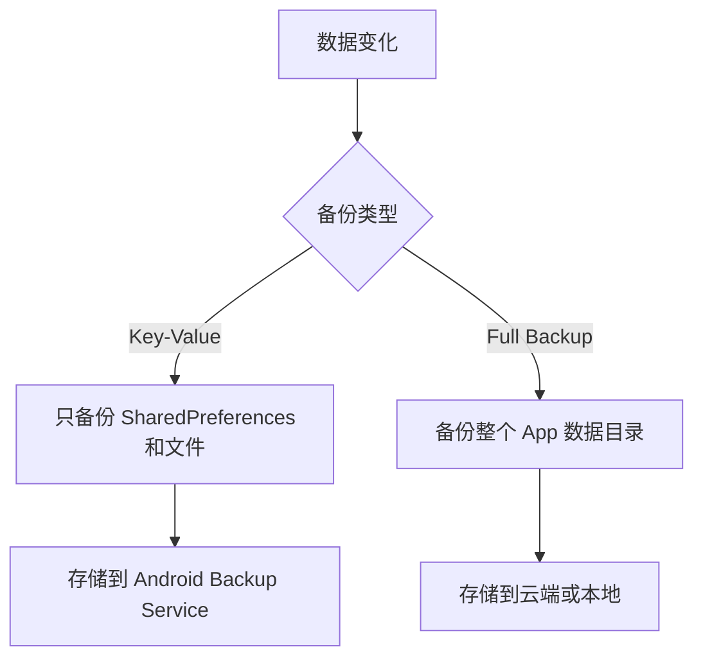
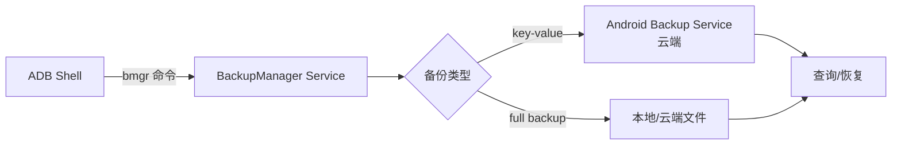

# 20.1.7 管理组

太阳像一枚融化的金币，慢慢往西边的山头沉下去。热了一整天的营地终于凉快了一些，树叶被晚风摇得沙沙作响，空气里飘着炭火余温和烤棉花糖的甜香。

洛芙靠在折叠椅上第三条腿已经快掉下来的那条腿旁边——这是昨天希尔从垃圾堆里捡回来 "废物利用" 的，结果现在每次坐下都提心吊胆。她的笔记本电脑放在膝盖上，屏幕上是密密麻麻的 logcat 输出，看得她眼睛发直。

"所以，"她举起手，像在课堂上提问的小学生，"我们之前说的那个 AVD 管理，是说模拟器。那...真机呢？真机有没有什么管理工具？"

黛琳正在往篝火里添柴火——不是真的柴火，是模块化代码块堆成的"柴火"，每扔一块进去，火苗就会变成对应颜色的 log 输出。她抬起头，阳光在她镜片上反了一下。

"问得好。"她说，"真机上的工具其实更多。今天我们要讲的 bmgr，就是其中最实用的那个。"

"又是缩写？"洛芙嘟囔。

"不是缩写，"伊莎从旁边递过来一杯凉可可——用她那个会制冷的魔法水壶，"是 *backup manager* 的简称。管备份的。"

"备份？"洛芙眨眨眼，"手机那个备份？那个很慢的、系统自带的那个？"

"对，就是那个。"希尔不知道什么时候绕到了她背后，把脑袋探过来看屏幕，"但你知道它背后是怎么工作的吗？你知道你可以手动触发备份、甚至可以强制备份、指定某个 App 单独备份吗？"

洛芙摇头。

"所以咯，"希尔打了个响指——这是她的招牌动作，每次有新东西要展示之前，她都会来这么一下，"今天我们就来玩 bmgr。"

---

## bmgr 是什么？

黛琳放下手中的白板笔——她今天换了一支红色的，看起来像一根小小的指挥棒。

"简单来说，bmgr 是一个命令行工具，"她画了一个简单的示意图，用篝火的光在白板上投出影子，"用来和 Android 的 BackupManager 服务对话。"

"Android 也有备份服务？"洛芙好奇地问。

"当然。每个 App 都可以声明自己支持备份，"黛琳说，"系统会在需要的时候——比如用户手动点备份、或者连接到 WiFi 且电量充足时——自动把数据打包备份。"

"那 bmgr 能做什么？"洛芙问。

"能做的事情很多，"希尔抢着说，"我来给你列个单子——"

她不是在白板上写，而是直接在笔记本电脑上敲命令，然后把输出投影到营地上空的全息屏幕上（这是黛琳的魔法道具之一，可以把内容投射到任何平面）。一行行命令和输出像瀑布一样流下来：

```bash
# 查看 bmgr 可用的命令
bmgr help

# 手动触发全量备份
bmgr backupfull <package_name>

# 备份指定 App
bmgr backup <package_name>

# 恢复备份
bmgr restore <package_name>

# 查看备份状态
bmgr list backups
```

"哇，"洛芙往前倾了倾身子，"这些命令都是在本机跑的吗？"

"对，通过 ADB shell，"黛琳点头，"先确保你的设备开启了备份权限。"

"权限？"洛芙敏感地捕捉到这个词。

"对，bmgr 需要系统权限，"伊莎温柔地补充，"普通 App 调用不了。它是给系统管理员和开发者用的。"

---

## 场景：给露营 App 做备份实验

希尔把笔记本转过来，指着屏幕上她预先写好的一个 Demo App 结构说："来，我们来实际操作一下。我们做个简单的露营清单 App——就记录今天带了什么装备。"

那是一个极简的 Android 项目，核心只有一个 Activity 和一个 SharedPreferences。洛芙看着代码——数据很简单，就是一个 key-value 列表，存的是"帐篷""睡袋""炊具"这些露营装备。

"这个 App 已经声明了支持备份，"希尔指着 AndroidManifest.xml 里的一行说：

```xml
<application
    android:label="露营清单"
    android:allowBackup="true"
    ... >
```

"看见没？`android:allowBackup="true"`，"希尔解释，"这行声明告诉系统：这个 App 的数据可以被备份。"

"那如果没有这行呢？"洛芙问。

"就不会备份，"黛琳说，"而且 Google Play 可能会因此扣分——现在新 App 默认是 `true`，但如果你设成 `false`，会被当成安全风险。"

"明白了，"洛芙点头，"就像...出门前要锁门，但如果你家大门敞开，保险公司就不保你。"

"差不多是这个意思，"伊莎笑了。

---

## 第一次备份：bmgr backup

希尔连接好她的测试手机（型号是 Pixel 7，系统是 Android 14），在 ADB shell 里敲下了第一行命令：

```bash
adb shell bmgr backup com.example.campinglist
```

"然后？"洛芙盯着屏幕。

"然后就没有然后了，"希尔耸肩，"这个命令是异步的。备份会在后台运行，你不会立刻看到结果。"

"这么神秘？"洛芙有点失望。

"所以我们需要用 `bmgr run` 来强制执行 pending 的备份任务，"黛琳说，"或者——"

她话还没说完，希尔已经敲下了下一行：

```bash
adb shell bmgr run
```

一瞬间，手机屏幕弹出了一个通知："正在备份露营清单..."

"成了！"希尔 grinning。

"这就完了？"洛芙觉得有点太快了。

"还没完，"黛琳按住激动的希尔，"我们来验证一下。备份成功了，但我们需要确认数据真的被存进去了。"

---

## 查看备份列表：bmgr list backups

"想看备份记录？"希尔问，然后直接在 shell 里敲：

```bash
adb shell bmgr list backups
```

屏幕上出现了一串输出：

```
APP                    #vers#   #files#  size    time   packaged
com.example.campinglist  1       3       12KB    2024-07-15 18:45
```

"看见了吗？"希尔兴奋地指着屏幕，"这一行就是我们的备份记录。`#vers#` 是版本号，`#files#` 是备份了几个文件，`size` 是大小，`time` 是时间。"

"所以备份真的成功了！"洛芙开心的像自己第一次做成了一件事。

"等等，"黛琳冷静地说，"我们还没验证恢复呢。备份只是'存进去'，能不能'取出来'才是关键。"

"对哦，"洛芙吐了吐舌头，"万一存坏了呢？"

---

## 删除数据再恢复：bmgr restore

希尔在手机上打开露营清单 App，当着大家的面删掉了所有记录——屏幕瞬间变得空荡荡的，只剩下一个空列表。

"心疼吗？"伊莎笑着问。

"不心疼，"洛芙摇头，"因为知道能找回来。"

"来，我们恢复试试，"希尔敲：

```bash
adb shell bmgr restore com.example.campinglist
```

输出：

```
restore: [包名] com.example.campinglist
Did not restore com.example.campinglist: no full backup
```

"呃，"希尔抓抓头，"看起来出问题了。"

"很正常，"黛琳并不惊讶，"这个命令是恢复 *full backup* 的，但我们刚才做的是普通的增量备份。"

"full backup？"洛芙记得黛琳刚才提到了这个词。

"对，Android 备份分两种，"黛琳在白板上画了两个框，"一种是 *key-value backup*（k-v 备份），一种是 *full backup*（全量备份）。"

她在白板上画了一个简单的对比图：



"简单来说，"伊莎补充，"key-value 备份是给轻量级数据用的——就像你的清单应用这种，几KB的数据。full backup 是给需要备份整个数据库、整个文件树的 App 用的，比如相册 App 或者文件管理器。"

"那我们刚才用的是哪种？"洛芙问。

"默认是 key-value，"黛琳说，"所以 `bmgr restore` 找不到全量备份。"

"那想恢复 k-v 备份怎么办？"希尔问。

"用 `bmgr restore` 的另一个命令，"黛琳说，"`bmgr restore <package>` 默认找 full backup，但如果加上 `--k-v` 参数——"

她在 shell 里敲：

```bash
adb shell bmgr restore --k-v com.example.campinglist
```

输出：

```
restore: Starting restore...
restore: Finished.
```

"成了！"洛芙欢呼。

然后她看向手机——露营清单 App 自动打开了，刚才删掉的记录全部回来了，像魔法一样。

"这就是 bmgr 的威力，"黛琳微笑，"开发者可以用它来测试备份恢复逻辑，不用真的等系统自动触发。"

---

## 备份策略：android:backupRules

"等等，"洛芙突然想到一个问题，"如果我不想让某些文件被备份呢？比如用户缓存？或者某些敏感配置？"

"好问题，"黛琳点头，"Android 提供了精细的备份规则控制。"

她在白板上写了一个 XML 文件结构：

```xml
<?xml version="1.0" encoding="utf-8"?>
<full-backup-content>
    <!-- 包含某个文件 -->
    <include domain="sharedpref" path="." />
    <!-- 排除某个文件 -->
    <exclude domain="database" path="cache.db" />
    <!-- 包含某个目录 -->
    <include domain="file" path="user_data/" />
</full-backup-content>
```

"这个配置文件叫 `backup_rules.xml`，"黛琳解释，"放在 `res/xml/` 目录下，然后在 `AndroidManifest.xml` 里引用："

```xml
<application
    android:label="露营清单"
    android:fullBackupContent="@xml/backup_rules"
    ... >
```

"这样就可以精细控制哪些数据要备份、哪些不要，"伊莎说，"比如数据库的缓存文件通常不需要备份，就可以用 `<exclude>` 标签排除。"

"还有更细的，"希尔补充，"可以用 `<domain>` 标签指定不同的数据类型——`sharedpref`、`database`、`file`、`external`，每个都可以单独控制。"

---

## 另一个工具：adb backup

"除了 bmgr，还有另一个命令也可以做备份，"希尔说，"`adb backup`，这个更直接。"

她在 shell 里敲：

```bash
adb backup -f backup.ab com.example.campinglist
```

"这个会弹出确认界面，"希尔解释，"因为它会备份整个 App 数据到本地文件。"

手机屏幕上跳出一个确认对话框："是否允许完整备份？"

"点允许，"希尔提示。

然后一个进度条出现了，慢慢地走到 100%。

"看，文件生成了，"希尔展示文件列表，"`backup.ab`，这是 Android 备份格式。"

"这种格式怎么打开？"洛芙问。

"可以用 `abd restore` 命令来恢复，"黛琳说，"或者用第三方的 `android-backup-extractor` 工具来解压查看内容。"

"有意思，"洛芙点头，"原来手机备份是这样工作的。"

---

## 真实场景：CI/CD 中的自动测试

黛琳看看天色——太阳已经完全下山了，天空变成了深蓝色，星星开始一颗一颗地冒出来。她把白板收起来，然后开始总结：

"在真实开发中，bmgr 最常用的场景是 *CI/CD 自动测试*。"

"自动测试？"洛芙重复。

"对，"希尔说，"你可以在测试脚本里先用 bmgr 备份 App 的初始状态，然后修改数据、跑测试，最后用 bmgr restore 恢复，再跑一次——这样每次测试都从干净的状态开始，避免数据污染。"

"就像...每次考试前把试卷重置？"洛芙想了个比喻。

"对，就是这个意思，"黛琳微笑，"而且 bmgr 还可以配合 `device configuration` 使用，自动化程度很高。"

---

## 常见的坑

"不过 bmgr 有几个常见的坑，"黛琳突然正色道，"你们记一下。"

她在白板上写了三点：

**1. 备份不触发？检查 `allowBackup`**

"如果 App 的 `AndroidManifest.xml` 里没有 `android:allowBackup="true"`，或者设成了 `false`，bmgr 怎么折腾都没用。"

**2. 恢复失败？确认备份类型**

"前面我们遇到了这个问题——`bmgr restore` 默认找 full backup，但默认备份是 key-value。要用 `--k-v` 参数。"

**3. 数据太大？考虑排除文件**

"key-value 备份有大小限制好像是 25MB 还是 50MB 来着，"希尔想了想，"具体我忘了总之如果数据太大，要么拆分成小文件，要么改用 full backup。"

---

## 代码示例：封装一个 BackupHelper

希尔临场发挥，在笔记本上写了一个简单的 Kotlin 工具类：

```kotlin
import android.app.backup.BackupManager

/**
 * 备份辅助工具类
 * 封装常用的备份操作
 */
object BackupHelper {
    
    /**
     * 请求指定 App 的数据备份
     * @param context Android 上下文
     * @param packageName 要备份的 App 包名
     */
    fun requestBackup(context: Context, packageName: String) {
        val backupManager = context.getSystemService(Context.BACKUP_SERVICE) as BackupManager
        val packageInfo = context.packageManager.getPackageInfo(packageName, 0)
        
        // 调用 BackupManager.dataChanged() 触发备份
        // 这只是请求，系统会决定什么时候真正执行备份
        backupManager.dataChanged(packageName)
    }
    
    /**
     * 检查指定 App 是否允许备份
     * @param context Android 上下文
     * @param packageName App 包名
     * @return 是否允许备份
     */
    fun isBackupAllowed(context: Context, packageName: String): Boolean {
        return try {
            val appInfo = context.packageManager.getApplicationInfo(packageName, 0)
            appInfo.flags and ApplicationInfo.FLAG_ALLOW_BACKUP != 0
        } catch (e: PackageManager.NameNotFoundException) {
            false
        }
    }
}
```

"这个工具类可以直接在 App 里用，"希尔解释，"`requestBackup()` 方法会调用系统的备份服务，虽然不能保证立刻执行，但能发起请求。"

"那我想强制立刻执行呢？"洛芙问。

"就得用 bmgr 命令行，"黛琳说，"没有 Java API 可以强制立刻备份。"

---

## 篝火的温度

月亮升起来了，圆得像一枚银币。篝火的火苗一跳一跳的，把四个女孩的脸庞映得忽明忽暗。

"所以，"洛芙伸了个懒腰，"bmgr 就是这样用的。对了，刚才说的 CI/CD 测试...具体怎么自动化？"

"简单，"希尔打了个响指——今晚的第二个响指，"写一个 Shell 脚本，先 `adb shell bmgr backup`，再 `adb shell bmgr run`，然后跑测试，最后 `adb shell bmgr restore`。"

"那如果有多个设备呢？"洛芙又问。

"用 `adb devices` 遍历所有设备，对每个设备分别执行命令，"黛琳说，"或者用一些现成的测试框架，比如 Android 的 `DeviceConfiguration` 或者 `Mobly`。"

"听起来好复杂，"洛芙吐舌头。

"慢慢来，"伊莎递过来一块烤棉花糖——焦糖色的，外酥里软，"先从手动测试开始，等熟悉了再写自动化。"

洛芙接过棉花糖，咬了一口。甜味在舌尖化开，像今天学的知识一样，慢慢沉淀到记忆里。

"我有点困了，"她打了个小小的哈欠，"但还想再问一个问题——"

"什么问题？"黛琳问。

"如果我想备份到指定的地方呢？不是云端，是我自己指定的本地路径？"

黛琳和希尔对视一眼。

"那个叫 'Adb backup' 的本地备份可以做到，"希尔说，"但如果你想备份到自定义的服务器...那就得自己实现 BackupTransport 了，那是另一个话题。"

"对，"黛琳点头，"今天的 bmgr 主要是系统级的备份。如果你想完全自定义备份逻辑，就需要实现自己的 BackupTransport——那个我们以后再讲。"

"好，"洛芙把最后一口棉花糖吃掉，"那今天就先到这里吧。"

她合上笔记本电脑，抬头看星星。营地周围是蝉鸣声，一浪一浪的，像夏天的背景音乐。

---

## 专业技术总结

> 本章围绕 Android 备份管理器 bmgr 展开，通过实际命令行操作和代码示例，展示了如何手动触发备份、查看备份记录、执行恢复等核心功能。

---

### 核心机制定义

**bmgr (backup manager)** —— Android 系统提供的命令行工具，用于与 BackupManager 服务交互，执行手动备份、恢复、查询备份记录等操作。开发者可通过 bmgr 测试 App 的备份恢复逻辑，或在 CI/CD 流程中自动化验证。

---

### 结构图



---

### 复杂度与性能影响

- **备份时间**：取决于数据量，key-value 备份通常在秒级，full backup 可能需要数分钟
- **存储空间**：备份数据会占用云端或本地存储，注意配额限制
- **网络依赖**：云端备份需要网络，全量备份建议在 WiFi 下执行

---

### 反模式与陷阱

1. **未声明 allowBackup**
   - 陷阱：App 未在 AndroidManifest.xml 中声明 `android:allowBackup="true"`，导致 bmgr 命令无效
   - 修复：在 AndroidManifest.xml 的 `<application>` 标签中添加 `android:allowBackup="true"`

2. **备份类型不匹配**
   - 陷阱：使用 `bmgr restore` 恢复 key-value 备份时默认查找 full backup，导致恢复失败
   - 修复：使用 `bmgr restore --k-v <package>` 明确指定 key-value 备份类型

3. **数据大小超限**
   - 陷阱：key-value 备份有 25MB 限制，超过会导致失败
   - 修复：使用 full backup 或拆分数据

4. **异步执行未等待**
   - 陷阱：执行 `bmgr backup` 后立即查询备份记录，可能显示不存在
   - 修复：使用 `bmgr run` 强制执行 pending 任务后再查询

5. **权限不足**
   - 陷阱：在非 root 设备上某些备份操作失败
   - 修复：确保设备已授予必要的备份权限，或使用 root 权限执行

---

### 设计哲学

Android 备份系统遵循以下设计原则：

1. **用户数据优先**：备份旨在保护用户数据，而非 App 本身
2. **最小化原则**：默认只备份必要数据，通过规则精细控制
3. **安全隔离**：敏感数据可被排除，防止泄露
4. **自动化与手动结合**：系统自动触发 + 开发者手动测试

---

### 动手练习

#### 目标

掌握 bmgr 命令行的基本使用，能够手动备份和恢复 App 数据。

#### Task 1：检查 App 是否允许备份

**目标**：确认目标 App 的 allowBackup 配置

**步骤**：
1. 使用 ADB 连接到 Android 设备或模拟器
2. 执行 `adb shell pm dump <package_name> | grep allowBackup` 查看配置

**验收标准**：
- [ ] 能够看到 `allowBackup` 的值（true/false）

---

#### Task 2：执行手动备份

**目标**：使用 bmgr 备份指定的 App 数据

**步骤**：
1. 确认 App 允许备份（allowBackup=true）
2. 执行 `adb shell bmgr backup <package_name>`
3. 执行 `adb shell bmgr run` 强制执行

**验收标准**：
- [ ] 命令执行无报错
- [ ] 使用 `bmgr list backups` 能看到新增的备份记录

---

#### Task 3：删除数据并恢复

**目标**：验证备份可以成功恢复

**步骤**：
1. 打开目标 App，删除或修改数据
2. 执行 `adb shell bmgr restore --k-v <package_name>`
3. 打开 App 确认数据已恢复

**验收标准**：
- [ ] 命令执行成功
- [ ] App 数据恢复到备份时的状态

---

#### Task 4：测试 adb backup 命令

**目标**：使用 adb backup 创建本地备份文件

**步骤**：
1. 执行 `adb backup -f backup.ab <package_name>`
2. 在设备上确认授权
3. 等待备份完成，检查生成的 `backup.ab` 文件

**验收标准**：
- [ ] `backup.ab` 文件成功生成
- [ ] 文件大小大于 0

---

#### Task 5：配置自定义备份规则

**目标**：创建 backup_rules.xml 精细控制备份内容

**步骤**：
1. 在 `res/xml/` 目录下创建 `backup_rules.xml`
2. 添加 include 和 exclude 规则
3. 在 AndroidManifest.xml 中引用：`android:fullBackupContent="@xml/backup_rules"`

**验收标准**：
- [ ] XML 文件语法正确
- [ ] Manifest 正确引用
- [ ] 打包后备份行为符合规则

---

### 面试热身

1. Android 备份有哪两种类型？它们有什么区别？
2. bmgr 命令和 adb backup 命令有什么不同？适用场景是什么？
3. 如何排除某些文件不被备份？
4. 备份恢复失败有哪些常见原因？如何排查？
5. 在 CI/CD 流程中，如何利用 bmgr 实现自动化测试？

---

### 参考实现要点

1. **优先使用 key-value 备份**：轻量级，自动由系统触发，适合大多数 App
2. **明确声明 backupRules**：不要依赖默认行为，明确指定哪些要备份、哪些要排除
3. **测试覆盖备份恢复**：确保关键数据在备份和恢复后保持完整
4. **敏感数据除外**：密码、密钥等敏感信息用 `android:excludeFromBackup` 标记
5. **CI/CD 集成**：使用 bmgr 在测试前后备份/恢复状态，确保测试独立性

---

> 学习建议

bmgr 是 Android 开发中容易被忽视但非常实用的工具。建议先在本地设备上亲手操作一遍 `backup`、`restore`、`list backups` 这三个最常用的命令，感受备份和恢复的完整流程。理解 key-value 备份和 full backup 的区别，以及各自的适用场景。在实际项目中，可以将 bmgr 集成到 CI/CD 流程中，实现自动化测试。

---

## 洛芙的小小日记本

今天学会了 bmgr！原来手机备份是这样工作的——不是魔法，是命令行。先备份，再删除，再恢复，数据真的能回来。希尔说的对，亲手试过才能记住。下次要在电脑上写个脚本，自动跑这个流程。

---

## 今日关键词

- **bmgr**：Android 命令行备份管理工具，用于手动触发备份和恢复操作
- **BackupManager**：Android 系统服务，负责管理 App 数据的备份和恢复
- **allowBackup**：AndroidManifest.xml 中的配置项，控制 App 是否允许备份
- **key-value backup**：基于 SharedPreferences 和文件的轻量级备份方式
- **full backup**：全量备份整个 App 数据目录的备份方式
- **backup_rules.xml**：自定义备份规则的 XML 配置文件
- **adb backup**：ADB 命令，可创建本地备份文件（.ab 格式）
- **adb restore**：ADB 命令，用于从本地备份文件恢复数据
- **BackupTransport**：Android 备份框架的可扩展接口，用于自定义备份后端
