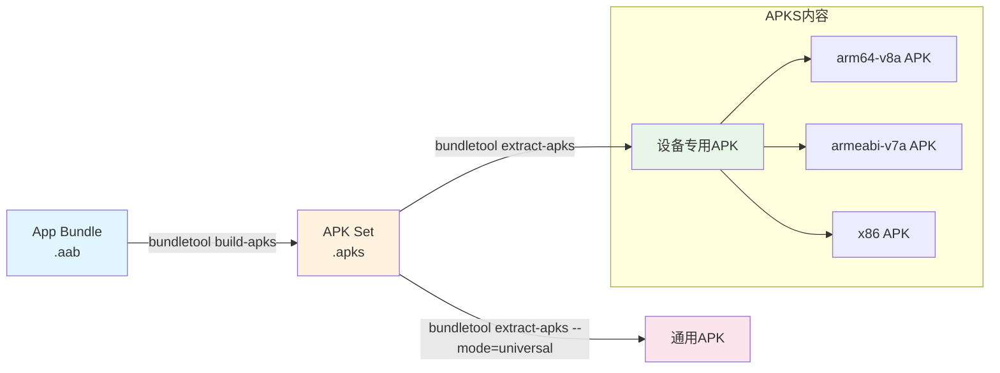
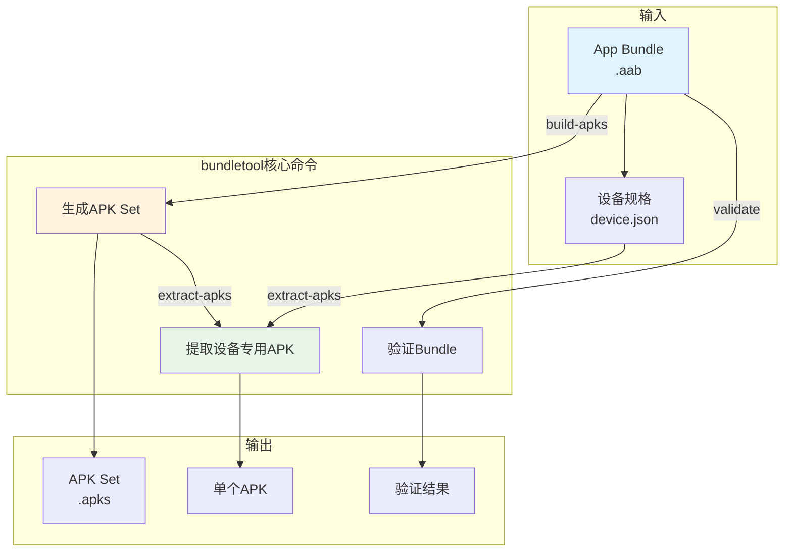

# 捆绑工具

蝉鸣声从营地边的老槐树上传来，一浪一浪的，像是在合唱一首夏天的歌。

洛芙把草帽往下拉了拉，遮住刺眼的阳光。刚才在树荫下听了半天黛琳讲AVD管理，现在她满脑子都是虚拟设备、模拟器、系统镜像这些词，感觉脑容量快要溢出了一样。

“好热啊……”洛芙用手扇着风，看了一眼手机上的温度显示——34度。

伊莎递过来一瓶冰镇矿泉水，“先喝点水，黛琳说要给你看个好玩的东西。”

“什么好东西？”洛芙立刻来了精神。

黛琳从背包里掏出一个U盘大小的东西，金属外壳在阳光下闪闪发光。

“这是什么？”洛芙好奇地凑过去。

“bundletool，”黛琳把它放在手心，“专门用来处理Android App Bundle的工具。”

“App Bundle？”洛芙歪着头，“就是上次你说的那个要上传到Google Play的东西？”

“对，”黛琳点点头，“Google Play不用我们上传完整的APK，只需要上传App Bundle，然后Play商店会根据用户的设备，自动生成最合适的APK——只包含他们需要的代码和资源。”

“这么智能？”洛芙瞪大了眼睛，“那 bundletool 就是用来处理这个 Bundle 的？”

“没错，”黛琳把玩着手中的小工具，“Bundle是Android应用的新发布格式，但有些场景下我们需要手动处理它——比如本地测试、分发APK给测试人员、或者验证Bundle是否正确。”

希尔不知道什么时候凑了过来，手里还拿着一台笔记本电脑，“说到这个，上次我们打包的那个App Bundle，我本地想验证一下能不能正确安装到不同设备上，能用bundletool实现吗？”

“当然可以，”黛琳笑了笑，“bundletool最常用的功能就是把Bundle转换成APK，这样就能在不依赖Play商店的情况下测试。”

“我来演示一下，”黛琳把电脑拉到面前，敲了几个键，“首先我们要有一个 .aab 文件——就是App Bundle的缩写。”

```bash
# bundletool 命令基本格式
#bundletool <command> [options]

# 查看所有可用命令
bundletool --help
```

“原来是个命令行工具啊，”洛芙恍然大悟，“感觉跟adb有点像？”

“定位不太一样，”黛琳解释道，“adb是用来调试设备的，这个是专门处理Bundle和APK的。它们的用途不同，但都是Android开发者的必备工具。”

黛琳继续演示：“我们先用build-apks命令，把Bundle转换成可安装的APKS文件。”

```bash
# 从App Bundle生成APKS文件
bundletool build-apks \
    --bundle=/path/to/app.aab \
    --output=/path/to/app.apks \
    --ks=/path/to/keystore.jks \
    --ks-pass=pass:your_keystore_password \
    --ks-key-alias=your_key_alias \
    --key-pass=pass:your_key_password
```

“apks？这又是什么？”洛芙問道。

“APKS是APK Set的缩写，”伊莎解释道，“你可以理解为一个压缩包，里面包含了针对不同设备配置的多套APK——不同的ABI、不同的屏幕密度、不同的语言资源等等。”

黛琳点点头：“对，比如针对arm64-v8a的手机和针对x86的模拟器，会生成不同的APK。bundletool会根据--device-spec参数来筛选合适的APK。”

“device-spec？”洛芙敏锐地捕捉到这个词。

“设备规格，”黛琳调出另一个命令，“我们可以用get-device-spec来获取当前连接设备的规格，然后用来筛选APK。”

```bash
# 获取当前连接设备的规格
bundletool get-device-spec --output=device.json

# 查看生成的设备规格文件
cat device.json
```

黛琳把生成的JSON文件展示给大家看：

```json
{
  "supportedAbis": ["arm64-v8a"],
  "screenDensity": 420,
  "sdkVersion": 34
}
```

“看，这就像设备的身份证，”黛琳指着屏幕，“告诉bundletool我们要找什么样的APK。”

“原来如此！”洛芙明白了，“那接下来呢？”

“接下来用extract-apks命令，从APKS文件中提取符合设备规格的APK，”黛琳敲着代码，“这样测试人员就可以直接拿到适合他们设备的APK，不用大海捞针。”

```bash
# 从APKS中提取符合设备规格的APK
bundletool extract-apks \
    --apks=/path/to/app.apks \
    --output-dir=/path/to/output/ \
    --device-spec=/path/to/device.json
```

希尔看完后若有所思：“这个功能很实用啊……那如果我想同时生成所有ABI的APK，而不是根据特定设备筛选呢？”

“有两种方式，”黛琳伸出一根手指，“第一种，使用--mode参数指定universal，这样会生成一个包含所有ABI的通用APK。”

```bash
# 生成通用APK（包含所有ABI）
bundletool build-apks \
    --bundle=/path/to/app.aab \
    --output=/path/to/app-universal.apks \
    --mode=universal
```

“第二种呢？”希尔追问。

“第二种更精细，”黛琳伸出第二根手指，“使用generate-device-spec生成不同的设备规格，然后分别提取——比如分别针对手机、平板、TV生成不同的APK。”

洛芙举手提问：“那个……我有个问题。为什么不能直接安装Bundle，非要转换成APK？”

“问得好，”黛琳赞许地看了洛芙一眼，“因为Android系统不直接支持安装.aab文件。APK才是Android系统的安装包格式。Bundle更像是源代码的打包版本，需要经过处理才能变成可安装的APK。”

“而且啊，”伊莎补充道，“Bundle里包含了很多资源变体——不同语言、不同屏幕密度、不同ABI——这些在用户下载时才会被动态组合。但如果我们想要本地测试，就必须先生成完整的APK。”

黛琳点点头，翻开笔记本电脑上的另一页：“bundletool还有几个有用的命令，我们来看看。”

```bash
# 验证Bundle的完整性
bundletool validate \
    --bundle=/path/to/app.aab

# 查看Bundle内容
bundletool dump \
    --bundle=/path/to/app.aab \
    --xpath /manifest/@package

# 查看APKS文件内容
bundletool dump --apks=/path/to/app.apks
```

“这个validate命令很实用，”希尔说，“可以检查Bundle是否有效，避免上传到Play商店才发现问题。”

“对，”黛琳表示同意，“特别是大型项目，Bundle可能有几百MB，提前验证可以省掉很多麻烦。”

洛芙突然想到一个问题：“黛琳，那我怎么知道一个APK是从哪个Bundle生成的？还是说APKS里包含了这些信息？”

“好问题，”黛琳笑了笑，“bundletool还有个inspect命令，可以查看APKS内部的结构。”

```bash
# 查看APKS文件内容摘要
bundletool inspect-apks \
    --apks=/path/to/app.apks
```

黛琳运行了这个命令，屏幕上出现了APKS的内部结构：

```
com.example.app    arm64_v8a    xxhdpi    2024-01-15
com.example.app    armeabi_v7a  xhdpi     2024-01-15
com.example.app    x86          xhdpi     2024-01-15
```

“看，这里列出了APKS里包含的所有的APK变体，”黛琳解释道，“每个变体对应不同的ABI和屏幕密度组合。”

“好复杂……”洛芙感叹道，“原来一个App Bundle能生成这么多变体。”

“所以Google Play的动态分发才那么强大，”伊莎轻声说，“用户只需要下载他们设备需要的那个APK，而不是下载一个巨大的包含所有资源的APK。”

黛琳见洛芙似懂非懂的样子，便画了个简单的图来说明Bundle和APK的关系：



“这个图很清楚！”洛芙高兴地说，“Bundle就像原材料，bundletool负责把它们加工成不同型号的产品。”

“对，就是这个意思，”黛琳笑着说，“而且bundletool还有个很实用的功能——模拟Play商店的设备过滤。”

“什么意思？”希尔也感兴趣了。

黛琳解释道：“我们可以把Play商店的设备配置信息保存下来，然后用bundletool测试某个APK是否能在这些设备上安装。这样在上架前就能发现兼容性问题。”

```bash
# 生成设备规格
bundletool generate-device-spec \
    --min-sdk-version 21 \
    --max-sdk-version 34 \
    --supported-abis arm64-v8a armeabi-v7a \
    --supported-locales en es zh \
    --screen-densities 320 480 560 \
    --output=device-spec.json
```

希尔立刻动手试了一下：“这个功能太有用了！以前我们都要靠运气，觉得应该没问题就直接上传。”

“现在可以用这个命令先模拟一遍，”黛琳说，“特别是那些适配了很多老设备的App，这个检查必不可少。”

洛芙看着她们演示，忽然想到一个问题：“那……如果我想把现有的APK反向工程成Bundle，能做到吗？”

黛琳和希尔对视一眼，然后摇了摇头。

“很遗憾，bundletool不支持这个功能，”黛琳说，“APK是编译后的产物，很多信息已经丢失了，无法完全还原成Bundle。Bundle需要从源代码重新构建。”

“这样啊，”洛芙有点失望，“看来还是得从一开始就习惯用App Bundle的流程。”

“对，从项目搭建时就考虑Bundle是更好的选择，”黛琳点点头，“Google Play已经强制要求新App使用App Bundle格式了，这也是未来的趋势。”

伊莎抬头看了看天空，太阳已经开始西斜：“那今天的露营要结束了吗？”

“不急，”黛琳收起电脑，“还有个重要的功能没讲——bundletool的性能优化。”

“性能优化？”希尔立刻来了精神。

“对，特别是处理大型Bundle时，”黛琳重新打开电脑，“bundletool支持多线程处理，可以显著加快构建速度。”

```bash
# 使用多线程构建APK
bundletool build-apks \
    --bundle=/path/to/app.aab \
    --output=/path/to/app.apks \
    --threads=4
```

“threads参数可以指定使用的线程数，”黛琳解释，“一般设置为CPU核心数就行。”

“如果你的机器有8核，用4或6都可以，”希尔补充道，“但不要设太高，不然反而会因为线程切换开销变慢。”

洛芙把这些知识点都记在了心里：“感觉bundletool虽然只是个小工具，但功能还挺全面的。”

“每个工具都有它的价值，”黛琳把东西收进背包，“关键是知道什么时候用什么工具。bundletool就是处理App Bundle的瑞士军刀。”

太阳渐渐偏西，阳光变得柔和起来。远处的山峦被染成了金色，蝉鸣声似乎也低了一些。

“今天学到了很多，”洛芙伸了个懒腰，“bundletool可以构建APK、提取APK、验证Bundle、查看设备规格……真是个全能选手。”

“而且它还能帮助优化分发策略，”伊莎轻声说，“让用户只下载他们需要的东西，这也是一种环保嘛。”

“环保？”洛芙愣了一下，然后笑了，“对！少下载不需要的资源，确实是数字世界的环保。”

希尔已经开始收拾东西了：“走吧，今晚回去我也要试试这些命令。上次那个Bundle调试了好半天，有bundletool应该会方便很多。”

四个女孩收拾好营地，踏上了回程的小路。夕阳把她们的影子拉得很长，蝉鸣声伴随着她们的欢声笑语，渐渐远去。

---

## bundletool 核心机制定义

**bundletool** 是 Android SDK 中的命令行工具，用于处理 Android App Bundle（.aab 格式）。它可以生成 APK Set（.apks）、提取设备专用 APK、验证 Bundle 完整性，并支持模拟 Google Play 的设备过滤逻辑。主要用于本地测试、APK 分发和 CI/CD 流程中。

#### 结构图



#### 反模式与陷阱

1. **未指定签名信息直接build-apks**  
   陷阱：不带签名信息生成的APK无法安装到设备上  
   修复：必须使用 --ks, --ks-pass, --ks-key-alias, --key-pass 参数提供签名信息

2. **忽略validate步骤直接上传Bundle**  
   陷阱：Bundle格式错误会导致Google Play拒绝上传  
   修复：build-apks前先用 `bundletool validate --bundle=app.aab` 验证

3. **使用错误的device-spec导致无APK可提取**  
   陷阱：device-spec配置过于严格，APKS中没有任何匹配的APK  
   修复：先运行 `bundletool inspect-apks --apks=app.apks` 查看APKS内容，再生成匹配的device-spec

#### 设计哲学

bundletool的设计体现了Android应用分发的核心理念：**按需分发**。通过将应用资源和代码打包成App Bundle，让每个用户只下载其设备需要的部分，而不是一个巨大的通用APK。

**核心原则：**
- Bundle包含所有可能的资源变体，由Play商店或bundletool按需组合
- 本地测试时需要手动转换为APK格式
- 支持多维度设备筛选（ABI、屏幕密度、语言、SDK版本等）
- 命令行设计适合CI/CD集成

**实践建议：**
- 本地验证时始终使用validate命令检查Bundle
- 使用generate-device-spec模拟目标设备，避免上线后兼容性问题
- CI流程中集成bundletool，实现自动化APK提取和分发
- 大型项目使用多线程（--threads）加速构建

#### 动手练习

**项目目标**：使用bundletool实现完整的App Bundle处理流程

**Task 1：准备测试环境**
- 目标：创建一个简单的App Bundle用于测试
- 步骤：在Android Studio中创建新项目，配置为Bundle输出（Build → Generate Signed Bundle → Android Bundle）
- 验收：生成 .aab 文件

**Task 2：验证Bundle完整性**
- 目标：使用bundletool验证生成的.aab文件
- 步骤：运行 `bundletool validate --bundle=app.aab`
- 验收：命令执行成功，无错误输出

**Task 3：生成通用APK**
- 目标：从Bundle生成包含所有ABI的通用APK
- 步骤：运行 `bundletool build-apks --bundle=app.aab --output=app.apks --mode=universal --ks=...`
- 验收：生成app.apks文件，大小明显大于单独的ABI APK

**Task 4：生成设备专用APK**
- 目标：根据特定设备规格生成对应的APK
- 步骤：
  1. 连接真机或模拟器
  2. 运行 `bundletool get-device-spec --output=device.json`
  3. 运行 `bundletool build-apks --bundle=app.aab --output=device-apks.apks --device-spec=device.json`
- 验收：生成的APK大小小于通用APK

**Task 5：提取并安装APK**
- 目标：从APKS中提取APK并安装到设备
- 步骤：
  1. 运行 `bundletool extract-apks --apks=device-apks.apks --output-dir=./extracted/ --device-spec=device.json`
  2. 使用adb安装：`adb install extracted/*.apk`
- 验收：APK成功安装到设备

**Task 6：检查APK内容**
- 目标：查看APKS文件的内部结构
- 步骤：运行 `bundletool inspect-apks --apks=app.apks`
- 验收：输出包含所有APK变体的信息

**Task 7：性能优化**
- 目标：使用多线程加速APK生成
- 步骤：运行 `bundletool build-apks --bundle=app.aab --output=app.apks --threads=4`
- 验收：多线程构建成功，与单线程对比构建时间

#### 面试热身

1. 请解释App Bundle和APK的区别是什么？为什么需要Bundle？
2. bundletool的build-apks和extract-apks命令有什么区别？分别适用于什么场景？
3. 如何使用bundletool验证一个Bundle是否有效？
4. device-spec的作用是什么？如何生成符合目标设备的规格配置？
5. 为什么生成的APK会比通用APK小？这对用户体验有什么意义？

#### 参考实现要点

1. **签名配置**：生产环境应使用密钥库文件，避免在命令行中明文密码，可使用环境变量或密钥库别名
2. **设备规格获取**：真机调试时可快速获取设备规格，避免手动配置错误
3. **CI/CD集成**：bundletool纯命令行设计，非常适合集成到Jenkins/GitHub Actions中实现自动化
4. **Play商店预检**：使用bundletool模拟Play商店的设备过滤，提前发现兼容性问题
5. **多维度分发**：理解Bundle支持的维度（ABI、语言、屏幕密度、资源配置），合理规划应用变体

---

> bundletool是处理App Bundle的核心工具，掌握它可以实现本地化的APK生成和测试，是Android开发者的必备技能。建议在实际项目中多练习，特别是CI/CD流程集成。

## 洛芙的小小日记本

> 今天学会了bundletool！原来App Bundle要转换成APK才能安装，bundletool就像个翻译器，把" Bundle 语言"翻译成" APK 语言"。有了它就不用每次都上传到Play商店测试了，超方便！而且按需分发对用户手机空间也很友好，这大概就是技术的温柔吧。☀️📦

## 今日关键词

- **bundletool**：Android SDK命令行工具，用于处理App Bundle（.aab），可生成APK、验证Bundle、提取设备专用APK等
- **App Bundle（.aab）**：Android应用的新发布格式，包含所有代码和资源变体，由Google Play按需生成设备专用APK
- **APK Set（.apks）**：APK集合文件，内部包含针对不同设备配置的多个APK变体
- **device-spec**：设备规格配置JSON文件，描述设备的ABI、屏幕密度、SDK版本等特性
- **build-apks**：bundletool命令，从App Bundle生成APK Set
- **extract-apks**：bundletool命令，从APK Set中提取符合设备规格的单个APK
- **validate**：bundletool命令，验证App Bundle的完整性和有效性
- **get-device-spec**：bundletool命令，获取连接设备的规格信息
- **generate-device-spec**：bundletool命令，根据参数生成自定义设备规格
- **inspect-apks**：bundletool命令，查看APK Set内部结构和内容
- **ABI（Application Binary Interface）**：应用二进制接口，不同CPU架构需要不同的ABI版本（如arm64-v8a、armeabi-v7a、x86）
- **universal APK**：包含所有ABI的通用APK，体积较大但可在任何设备上安装
- **动态分发**：Google Play根据用户设备自动选择和分发最合适的APK，用户只下载需要的内容
