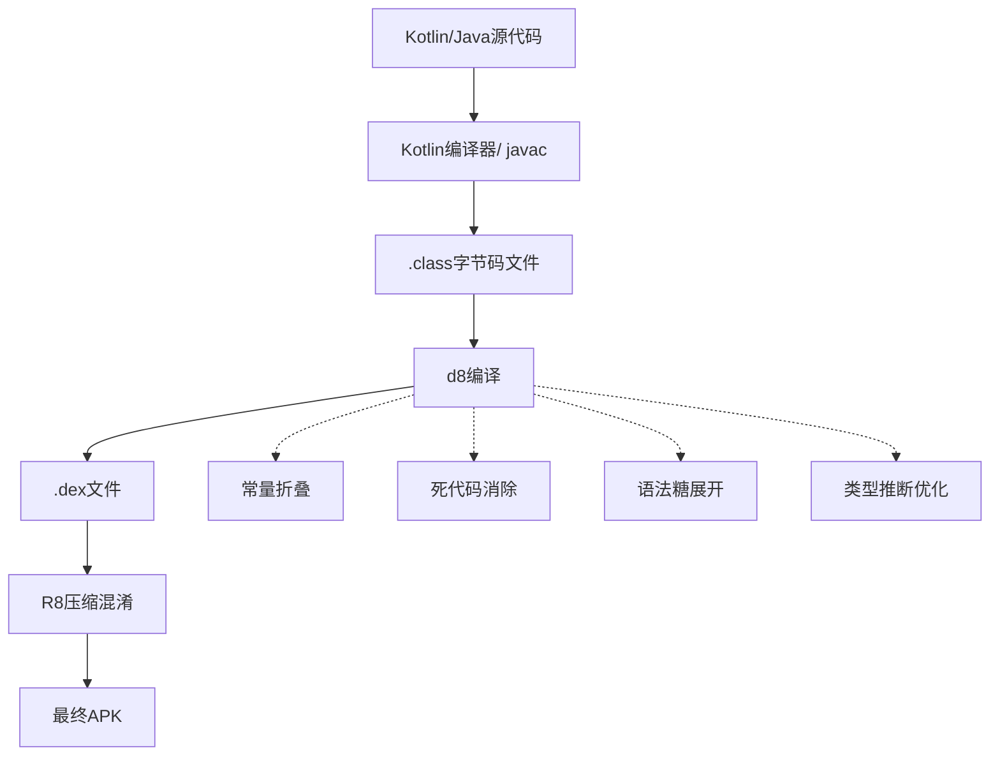
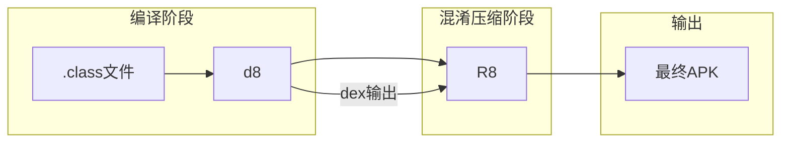
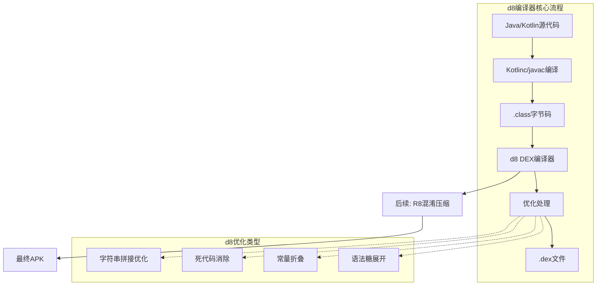

# d8

太阳慢慢往西边沉下去，天空从刺眼的白色渐渐变成了蜜桃色。

洛芙躺在草地上，双手枕在脑袋后面，看着天上的云朵被夕阳染成各种颜色——先是淡金色，然后是粉红色，最后变成了温柔的紫红色。

“好美啊……”洛芙喃喃自语。

黛琳在她旁边坐下，手里拿着一本打印出来的文档。伊莎正在整理晚餐的食材，希尔在对面的石头上敲笔记本电脑，时不时发出“嘿，这里有个好玩的东西”之类的感叹。

“黛琳，”洛芙翻了个身，侧躺着看向黛琳手里的文档，“你拿的什么？”

“d8，”黛琳把文档翻到第一页，“我们下午不是学了bundletool吗？d8是它的好搭档。”

“d8？”洛芙歪着头，“又是命令行工具？”

“可以说是，也可以说不是，”黛琳卖了个关子，“bundletool是处理App Bundle的，d8是编译Java字节码到DEX格式的编译器。”

“DEX？”洛芙立刻想起之前学过的内容，“就是那个Android虚拟机上运行的那个什么？”

“对，”黛琳点点头，“DEX是Dalvik Executable的缩写，是Android系统上Java代码的运行格式。在我们写完Java或Kotlin代码后，需要把它们编译成DEX格式，才能在Android设备上运行。”

伊莎抬起头，手里还拿着一把要做沙拉的生菜：“简单说，d8就是我们把源代码变成手机能读懂的语言的翻译器。”

“这个比喻好，”黛琳笑着说，“Java或Kotlin代码是人类写的语言，DEX是机器能执行的语言，d8就是中间的翻译官。”

洛芙爬起来，盘腿坐好：“那我们每天都在用这个d8吗？”

“没错，”希尔敲着笔记本键盘，头也不抬地说，“每次我们点击Run或Build，Gradle都会自动调用d8来编译代码。你以为是Android Studio在变魔术？其实都是d8在干活。”

“我来演示一下d8的具体工作，”黛琳把笔记本拉过来，“先看看d8命令的基本格式。”

```bash
# d8 命令基本格式
d8 [input files] [options]

# 查看d8版本和帮助
d8 --version
d8 --help
```

黛琳调出详细的帮助信息，指着屏幕解释：“d8的输入是.jar文件——也就是Java字节码，输出是.dex文件或包含DEX的APK。”

```bash
# 基本的d8编译命令
d8 input.jar --output output.dex

# 如果有多个jar文件
d8 lib1.jar lib2.jar lib3.jar --output output.dex

# 生成包含DEX的APK（常用）
d8 input.jar --output app.apk --lib android.jar
```

“等等，”洛芙举手提问，“之前我们学AAPT2的时候，好像也是处理.jar和.dex的？d8和AAPT2是什么关系？”

“问得好，”黛琳点点头，“它们在构建流程中扮演不同的角色。AAPT2处理资源文件——比如AndroidManifest.xml、布局文件、图片资源等。而d8处理的是编译后的Java字节码——.jar文件。”

希尔放下笔记本电脑，补充道：“简单说，AAPT2负责资源，d8负责代码。它们各干各的，最后再合并成APK。”

洛芙似懂非懂地点点头：“那d8具体做了哪些优化呢？”

“这就说到d8的核心能力了，”黛琳来了精神，“d8不仅仅是简单的翻译，它还会做很多优化——我们称之为desugaring和优化。”

“Desugaring？”洛芙眨眨眼，“是去糖？去什么糖？”

“哈哈哈，”希尔忍不住笑了，“这个‘糖’是语法糖——就是编程语言为了让程序员写得舒服而提供的方便写法。Java和Kotlin有很多语法糖，但Android虚拟机（Dalvik/ART）不一定原生支持，所以d8要把这些语法糖‘剥掉’。”

伊莎举了个例子：“比如说，Java 8的lambda表达式，Android 5.0之前的系统是不支持的。d8会把lambda转换成普通的匿名内部类，这样老版本的Android也能运行。”

黛琳打开一个代码示例：“我给你们看一个实际的例子。这是一段包含lambda的Kotlin代码。”

```kotlin
// 原始Kotlin代码（包含lambda）
val numbers = listOf(1, 2, 3, 4, 5)
val doubled = numbers.map { it * 2 }
```

黛琳解释道：“这段代码在现代Android系统上可以直接运行，但如果我们要兼容很老的Android版本，d8会把它转换成这样：”

```kotlin
// d8处理后的代码（lambda被展开）
val numbers = listOf(1, 2, 3, 4, 5)
val doubled = numbers.map(new Function1<Integer, Integer>() {
    @Override
    public Integer invoke(Integer it) {
        return it * 2;
    }
})
```

“哇……”洛芙惊叹道，“原来lambda背后是这么复杂的东西！那d8要生成这么多代码？”

“对，”黛琳点点头，“所以使用lambda会有一定的包体积增加，这就是为什么在很老的Android版本上，有人会建议尽量不用lambda。”

希尔撇撇嘴：“话虽如此，但现在Android 5.0已经是最低支持版本了，lambda的那点体积增加完全可以接受。而且Kotlin的lambda还有inline优化，实际上不会增加太多。”

洛芙好奇地问：“除了lambda，d8还做了什么优化？”

黛琳扳着手指数：“还有很多——比如常量折叠、消除死代码、合并重复代码、优化字符串拼接……”

“常量折叠？”洛芙听到新名词。

“比如说，”黛琳重新打开笔记本，“如果我们写了一个计算式。”

```kotlin
// 原始代码
val result = 1 + 2 + 3 + 4 + 5
```

黛琳解释道：“编译器在编译时就能算出结果是15，不需要在运行时再算。d8会直接把它变成：”

```kotlin
// d8优化后的代码
val result = 15
```

“这样运行时就不需要再算一遍了，”洛芙明白了，“省时间！”

“对，这就是常量折叠，”黛琳笑着说，“还有死代码消除——比如有些代码永远不会被执行到，d8会直接把它们删掉。”

希尔补充道：“还有更重要的——d8会做R8优化前的准备工作。d8生成dex文件后，R8会进一步压缩和混淆代码。它们两个是串联工作的。”

黛琳点点头，调出一张流程图：“我们来看一下完整的Android编译流程。”



“简单说，流程就是这样，”黛琳指着图解释，“源代码先被Kotlin编译器或javac编译成.class字节码，然后d8把这些字节码转换成DEX格式，最后R8再压缩混淆，变成最终我们发布的APK。”

洛芙问：“那我们能控制d8的行为吗？比如让它做更多的优化，或者不做某些优化？”

“可以的，”黛琳点点头，“d8有很多选项可以控制。”

```bash
# 启用所有优化（默认）
d8 input.jar --output output.dex --enable-all-optimizations

# 禁用dex文件压缩
d8 input.jar --output output.dex --no-dex-huffman-compression

# 指定输出格式为多DEX（当方法数超65536时）
d8 input.jar --output output.dex --multi-dex

# 保留调试信息（用于调试）
d8 input.jar --output output.dex --debuggable

# 指定Android API级别
d8 input.jar --output output.dex --lib android.jar --min-api 21
```

“multi-dex？”洛芙注意到这个选项，“是不是跟之前学的MultiDex有关？”

“对，”黛琳赞许地说，“在Android 5.0之前，每个DEX文件的方法数不能超过65536个。如果你的App方法数超过这个限制，就要启用multi-dex，生成多个DEX文件。”

伊莎补充道：“现在Android 5.0+已经是主流，大部分情况不需要担心这个问题。但如果你用了很多库，还是有可能超标的。”

洛芙好奇地问：“那怎么知道自己的App有没有超过限制？”

黛琳笑着说：“编译的时候如果超了，d8会报错——报错信息会告诉你需要启用multi-dex。”

希尔调出一个报错示例：

```
Execution failed for task ':app:transformDexWithDexForDebug'.
> com.android.builder.dexing.DexArchiveBuilderException: 
  Unable to merge dex archives.
  The number of method references in a .dex file cannot exceed 64K.
  Learn how to resolve this issue at https://developer.android.com/tools/building/multidex.html
```

“看，就是这个错误，”希尔说，“64K就是65536的方法数限制。碰到这种情况，要么优化代码减少方法数，要么启用multi-dex。”

洛芙若有所思：“感觉d8虽然藏在后台，但做的事情好多啊……”

“所以我们开发的时候基本感觉不到它的存在，”黛琳说，“但它确实在默默干活。了解d8能帮助我们更好地理解构建流程，也能解决一些奇怪的问题。”

天色渐渐暗下来，天空从紫红色变成了深蓝色，第一批星星已经迫不及待地探出头来。

伊莎的声音从旁边传来：“晚餐准备好了哦——今天做了金枪鱼沙拉和烤土司！”

“哇！有吃的！”希尔第一个冲过去。

洛芙跟在后面，忽然想到一个问题：“对了黛琳，我还有个问题——d8和R8到底是什么关系？我老听到有人说先d8后R8的。”

黛琳和希尔对视一眼，笑着说：“这个问题问得好。它们的关系确实很亲密。”

“简单说，d8负责把字节码变成DEX，R8负责压缩和混淆，”黛琳解释道，“在现代Android构建系统中，它们是串联的管道——d8的输出直接送给R8处理。”

希尔补充道：“而且R8其实是d8的一部分——或者说R8是在d8基础上扩展的。它们共用很多代码，但R8专门负责混淆和压缩。”

黛琳调出另一个图来说明：



“在Gradle构建脚本中，”黛琳继续说，“d8和R8是一起配置的。”

```groovy
android {
    buildTypes {
        release {
            minifyEnabled true  // 启用R8混淆
            shrinkResources true  // 移除未使用资源
            proguardFiles getDefaultProguardFile('proguard-android-optimize.txt'), 'proguard-rules.pro'
        }
    }
    
    dexOptions {
        javaMaxHeapSize "4g"
        preDexLibraries true
    }
}
```

“这些都是控制d8和R8行为的配置，”黛琳指着屏幕说，“比如javaMaxHeapSize可以增加d8使用的内存，防止大项目编译时内存不够。”

洛芙把这些信息都记下来：“感觉今天又学到了好多东西……虽然d8平时看不见，但它真的很重要。”

“对，”黛琳站起来，往伊莎那边走去，“它是Android构建系统的重要一环。理解了d8，你就理解了代码是怎么变成手机能运行的程序的。”

晚餐的香味飘过来，混合着夜晚青草和泥土的气息。

“走了走了，先吃饭！”希尔催促道。

洛芙最后抬头看了一眼天空——星星们已经完全出来了，银河像一条闪亮的丝带横贯天际。

---

> **技术总结**

d8是Android的DEX编译器，负责将Java/Kotlin字节码编译成Android虚拟机可执行的DEX格式。作为Android构建系统的核心组件，它不仅进行基本的格式转换，还执行多项优化：语法糖展开（如lambda转换为匿名类）、常量折叠、死代码消除等。在现代构建流程中，d8与R8串联工作——d8输出DEX后交给R8进行压缩混淆，最终生成可发布的APK文件。

#### 结构图



#### 复杂度与影响

d8的编译时间随项目规模线性增长，大型项目可能需要数分钟。DEX文件大小受多种因素影响：代码复杂度、启用混淆程度、资源优化配置等。使用multi-dex会增加方法数上限但带来APK体积增加和首次启动延迟的代价。

#### 反模式与陷阱

1. **未指定android.jar导致API引用缺失**  
   修复：使用`--lib`参数指定正确的Android SDK版本对应的android.jar

2. **多DEX未启用导致方法数超限崩溃**  
   修复：在build.gradle中启用multiDexEnabled = true

3. **内存不足导致d8编译失败**  
   修复：在gradle.properties中设置org.gradle.jvmargs=-Xmx4g

#### 设计哲学

d8的设计遵循"编译时优化"原则——将尽可能多的处理放在构建阶段完成，以减少运行时的性能开销。其核心设计思想包括：渐进式优化（从基础编译到高级压缩）、向后兼容（通过desugaring支持老Android版本）、模块化处理（支持增量编译和缓存）。

#### 🏕️ 动手练习

**任务目标**：掌握d8编译器的基本使用和配置，理解DEX编译的核心概念

**任务内容**：

1. **创建测试项目**  
   创建空Android项目，添加简单Kotlin代码

2. **手动调用d8编译**  
   找到Gradle缓存中的d8路径，手动编译.jar到.dex

3. **对比编译输出**  
   观察有无--debuggable参数的输出差异

4. **配置multi-dex**  
   在build.gradle中启用multi-dex，验证生成多个.dex

5. **观察R8联合工作**  
   对比debug和release构建的DEX文件大小

**验收标准**：
- [ ] 能找到d8可执行文件位置
- [ ] 成功将.jar手动编译为.dex
- [ ] 理解debug和release构建的区别
- [ ] 掌握multi-dex配置方法
- [ ] 能解释d8和R8的协作关系

**提示代码**：

```bash
# 查找d8位置（Linux/Mac）
find ~/.gradle -name "d8" -type file 2>/dev/null

# 基础d8命令
d8 input.jar --output output.dex --lib $ANDROID_HOME/platforms/android-34/android.jar
```

---

> **学习建议**

理解d8的关键在于理解"编译时vs运行时"的区分——d8所做的优化都是在构建阶段完成的，这减少了运行时的计算开销。实际开发中遇到的多DEX、方法数超限、构建慢等问题，往往都和d8的配置有关。建议阅读Android官方文档中的构建流程章节，加深对整个构建管道的理解。

---

## 🍹洛芙的小小日记本

傍晚的时候，黛琳给我们讲d8——原来我们写的代码要经过这么多处理才能变成手机能读懂的格式。感觉d8就像一个默默工作的翻译官，虽然我们平时看不见它，但它一直在后台忙碌着。希尔说，了解d8能帮助我们解决奇怪的编译问题——这大概就是所谓的"知道系统怎么干活"吧。⭐

---

## 今日关键词

- **d8**：Android DEX编译器，将Java/Kotlin字节码编译为Android虚拟机可执行的DEX格式
- **DEX**：Dalvik Executable，Android系统上可执行文件的格式
- **desugaring**：语法糖展开，将高级语言特性转换为Android虚拟机原生支持的代码
- **常量折叠**：编译时计算常量表达式的优化技术
- **死代码消除**：移除永远不会被执行到的代码的优化技术
- **multi-dex**：将App方法分散到多个DEX文件的机制，用于突破65536方法数限制
- **R8**：Android的代码压缩和混淆工具，在d8之后运行
- **字节码**：编译后的Java/Kotlin代码，.class文件的格式
- **Gradle**：Android项目的构建系统，自动调用d8进行编译
- **64K限制**：单个DEX文件最多65536个方法引用的限制
