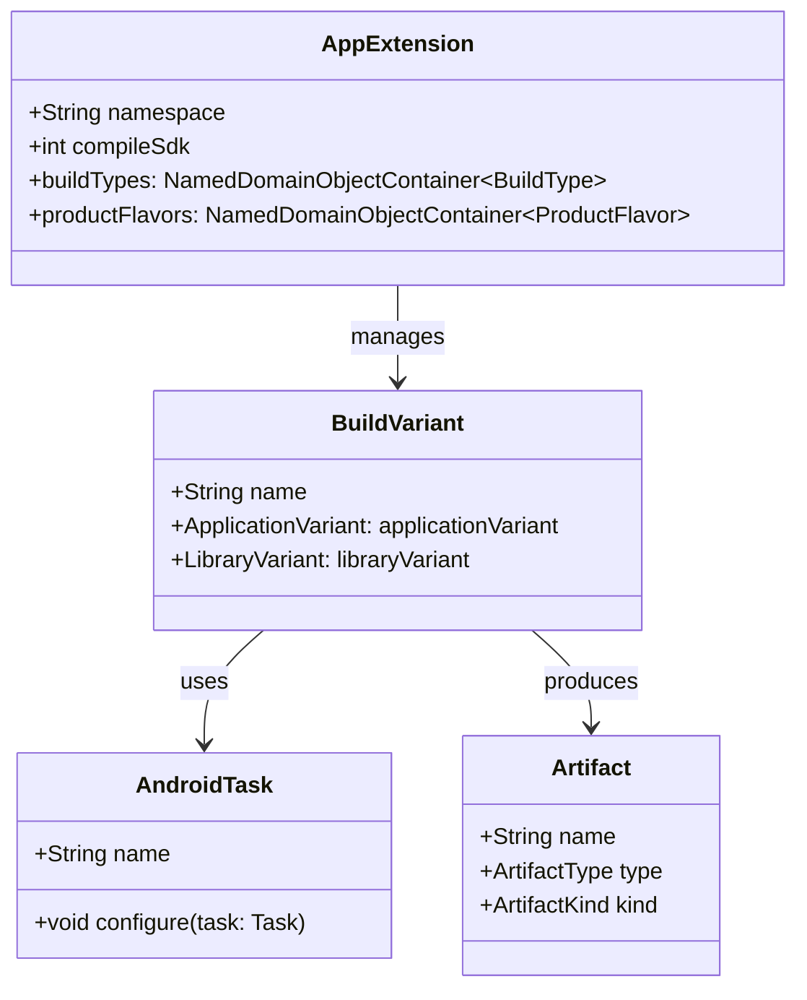
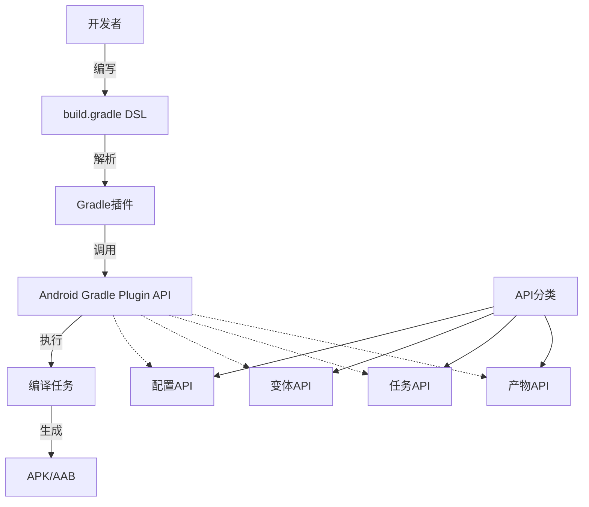

# 21.1.1 Android Gradle 插件 API 参考

午后的阳光透过帐篷的缝隙，在地面上投下斑驳的光影。洛芙盘腿坐在防潮垫上，手里捧着一杯已经凉透的柠檬茶，眼神有些涣散地盯着一旁的笔记本电脑。

“洛芙，发什么呆呢？”

希尔从外面钻进来，手里还拿着一根咬了一半的能量棒。她的头发有些乱糟糟的，应该是刚才去检查行李的时候被树枝挂的。

“我在看你之前给我的那个项目配置，”洛芙指了指电脑屏幕，“可是看不太懂……这个build.gradle里面的android { } block到底是什么啊？感觉好复杂的样子。”

黛琳正好掀开帐篷的门帘探进头来，听到这句话便顺势坐了进来。她从随身的包里拿出一块小巧的白板和几支马克笔，动作娴熟地架好。

“你说那个啊，是Android Gradle插件的DSL，”黛琳，一边在白板上画了一个简化的结构图，“正好今天天气热，我们就在帐篷里聊聊这个话题吧。”

伊莎也跟着凑了过来，她跪坐在洛芙旁边，好奇地看了一眼屏幕上的代码：“这个我也有印象！之前看文档的时候看到过叫做什么……API Reference的东西。”

“对，就是这个！”洛芙眼睛一亮，“官方文档说这是‘Android Gradle插件API参考’，但是内容好多啊，完全不知道从哪里开始看。”

黛琳微笑着点点头：“那我们就从最基础的概念开始吧。洛芙，你还记得我们之前讲过的SDK平台吗？”

“记得！”洛芙立刻来了精神，“就是那个决定了我们的应用可以运行在什么版本的Android系统上的东西嘛！Android 14对应API 34，Android 13对应API 33……”

“没错，”黛琳画了一个向上的箭头，“而Gradle插件呢，其实是在这个基础之上，帮你把代码变成可以安装到手机上的APK文件的‘魔法工坊’。它定义了一套规则，告诉你编译的时候该做什么、怎么做、什么时候做。”

“听起来像是一个超级大的流水线！”希尔兴奋地插嘴道，“我之前在工厂实习过，里面有一条汽车组装线，每个工位只做固定的事情。Gradle插件就像是那个控制流水线的系统！”

伊莎轻轻拍了拍手：“这个比喻真形象！希尔，你继续说？”

希尔也不客气，直接拿过白板笔在白板上画了一条横向的流水线：“你看啊，源代码就像原材料一样，从左边进去。然后Gradle插件会指挥着各种任务——比如编译Java代码、压缩图片、打包资源——一个接一个地执行，最后从右边出来的就是一个可以安装的APK文件了。”


（图1：Gradle构建流水线示意图，对应希尔画的流水线草图）

洛芙若有所思地点点头：“所以这个API，就是让我们可以自定义这个流水线的东西？”

“对了一半，”黛琳竖起一根手指，“API确实允许你自定义，但是它本身是一套接口和类的集合，就像是一个工具箱。你可以用这个工具箱来配置构建过程，但不需要从头写一个流水线系统。”

“比如呢？”洛芙追问。

“比如你可以指定使用哪个版本的编译工具、要不要开启数据绑定、怎么处理不同ABI的Native库……这些都可以通过Gradle插件提供的API来配置。”

黛琳在白板上写下几个关键词：BuildType、ProductFlavor、SigningConfig、BuildVariant。

“我们一个一个来说，”她看向洛芙，“你还记得上次说的debug和release版本吗？”

洛芙想了想：“记得！debug版本可以调试，release版本会混淆代码更难被破解！”

“完全正确！”希尔朝她竖起大拇指，“这两个就是最基础的BuildType——构建类型。Gradle插件允许你定义更多的构建类型，比如‘staging’用来测试环境、‘demo’用来演示功能等等。”

伊莎补充道：“而且ProductFlavor——产品风味——允许你为同一个应用创建不同的版本。比如你的应用叫‘露营助手’，你可以创建‘免费版’和‘付费版’，它们共享大部分代码，但是付费版有更多的功能。”

“这就像是我们去星巴克，”希尔眼睛一转又想出了新比喻，“美式、拿铁、摩卡都是咖啡（基础应用），但是配料不同（ProductFlavor）。而大小杯（大杯、中杯）就像是BuildType。”

洛芙忍不住笑了出来：“这样一讲就清楚多了！那……API参考文档上说的那些类，我们怎么使用呢？”

“这就要说到DSL了，”黛琳重新拿过白板笔，“你看到的android { } block，其实是一种叫做Domain Specific Language的简写写法。在Gradle的Groovy或Kotlin脚本中，这个block实际上是对androidExtension对象的属性赋值。”

```kotlin
// 这就是你在build.gradle中写的代码
android {
    namespace 'com.example.camping'
    compileSdk 34
    
    defaultConfig {
        applicationId "com.example.camping"
        minSdk 24
        targetSdk 34
    }
    
    buildTypes {
        release {
            minifyEnabled true
            proguardFiles getDefaultProguardFile('proguard-android-optimize.txt'), 'proguard-rules.pro'
        }
        debug {
            applicationIdSuffix ".debug"
            debuggable true
        }
    }
    
    flavorDimensions += "version"
    productFlavors {
        free {
            dimension "version"
            applicationIdSuffix ".free"
        }
        paid {
            dimension "version"
            applicationIdSuffix ".paid"
        }
    }
}

// 上面的代码在运行时会被解析成类似这样的对象结构
// android = project.extensions.getByType(AppExtension::class.java)
// android.namespace = "com.example.camping"
// android.compileSdk = 34
// 等等...
```

（图2：DSL代码与底层对象的对应关系，第12-36行对应配置文件）

“原来是这样！”洛芙恍然大悟，“那个大括号里面的每一行，其实都是在设置一个对象的属性！”

“没错，”黛琳点点头，“而且Gradle插件提供的API远不止这些。文档中还提到了Artifact API、Transform API等等，它们允许你在构建过程中干预生成的文件。”

希尔来劲了：“这个我知道！比如你想在编译完成后自动给APK加上时间戳，或者想在打包前对所有图片进行压缩，都可以用的上！”

“那具体怎么用呢？”洛芙好奇地问。

希尔把电脑拿过来，飞快地敲了一段代码：

```kotlin
import com.android.build.api.artifact.ArtifactType
import com.android.build.api.artifact.ArtifactKind

// 这是一个自定义任务的示例，用于在APK生成后自动复制到指定目录
abstract class CopyApkTask : DefaultTask() {
    @get:InputFile
    abstract val apkFile: RegularFileProperty
    
    @get:OutputDirectory
    abstract val outputDir: DirectoryProperty
    
    @TaskAction
    fun copy() {
        val input = apkFile.get().asFile
        val output = outputDir.get().file(input.name).asFile
        input.copyTo(output, overwrite = true)
        println("APK copied to: ${output.absolutePath}")
    }
}

// 在Android插件中使用这个任务
androidComponents {
    onVariants(selector().all()) { variant ->
        val outputDir = project.layout.buildDirectory.dir("outputs/apk/${variant.name}")
        
        project.tasks.register<CopyApkTask>("copy${variant.name.capitalize()}Apk") {
            apkFile.set(variant.artifacts.get(SingleArtifact.APK))
            outputDir.set(outputDir)
        }
    }
}
```

“哇！”洛芙惊叹道，“这看起来好复杂，但是功能也好强大！”

“这种就是比较进阶的用法了，”黛琳解释道，“对于初学者来说，更重要的是先掌握基础的配置。等你熟悉了build.gradle的各种设置之后，再来深入研究这些高级API会比较容易理解。”

伊莎在一旁温柔地说：“而且文档里有很多示例可以参考，不需要一下子全部学会。露营也是一样的嘛，先学会搭帐篷，再学生火，最后才是野炊料理——一步一步来。”

洛芙若有所思地点点头。她重新看向电脑屏幕上的文档：“原来这个API参考是给进阶用户看的啊……我还以为可以直接从头看到尾呢。”

“也不是不行，”希尔笑着说，“但是内容确实很多。你看这里，光是com.android.build.api这个包下面就有几十个类和接口。”

黛琳指着白板上她画的框架图：“其实我们可以把它分成几个主要部分来看：

1. **配置相关的API**：AppExtension、LibraryExtension、TestExtension这些，用来配置应用/库/测试模块的基本信息。

2. **构建变体相关的API**：VariantManager、BuildVariant这些，用来管理不同的构建变体组合。

3. **任务相关的API**：AndroidTask、TransformTask这些，用来定义和管理构建过程中的各种任务。

4. **产物相关的API**：Artifact、SingleArtifact、MultipleArtifact这些，用来描述构建输入输出。”



（图3：Gradle插件API的主要组成类及其关系）

洛芙认真地在笔记本上记录着：“那……如果我们想查看某个具体的类或者方法，应该怎么在文档里找呢？”

“这也是我想说的，”黛琳把白板翻到新的一页，“官方文档的左侧有一个索引，你可以按照包名或者类名来查找。比如你想了解ApplicationVariant这个类，可以直接搜索‘ApplicationVariant’或者在com.android.build.api.variant这个包下面找到它。”

“如果看到某个方法不知道是干什么的怎么办？”洛芙又问。

“看文档咯！”希尔耸耸肩，“每个方法都有说明的参数、返回值和作用。有的时候还会有使用示例。虽然是英文的，但是Google翻译一下大概能明白。”

伊莎轻轻碰了碰洛芙的肩膀：“而且露营编程旅团的学习方式就是这样——遇到不懂的就查、就问、就试。不要害怕看官方文档，它虽然看起来很枯燥，但其实是最好的学习资源。”

洛芙深呼吸一口气：“嗯！我明白了！先从基础的配置学起，然后再慢慢深入。总会学会的！”

“这就对了！”希尔打了个响指，“来，我们来实战一下。我这里有一个新的小项目，你来试着配置一下build.gradle，让它同时支持免费版和付费版两个版本！”

洛芙兴奋地接过电脑，入手开始敲代码。虽然还有不少地方不太明白，但是至少她知道该去哪里查找答案了。

---

日影西斜，帐篷里的光线开始变得柔和起来。洛芙伸了个懒腰，看着自己写的第一个像模像样的build.gradle配置，心里涌起一种小小的成就感。

“黛琳，”她抬起头，“你说以后如果我们想做一些更高级的定制，比如自动生成不同风格的图标，或者在编译时插入一些代码，该怎么做呢？”

黛琳笑着看向她：“那就要用到更高级的API了，比如Transform API或者Annotation Processing。不过那些是后面的内容了，今天先把这个基础打牢。”

伊莎递过来一块小饼干：“洛芙进步真的很快呢！记得我第一次看到这些配置的时候，完全不知道从何下手。”

“那是因为你有一个好老师呀！”洛芙撒娇般地说，“黛琳讲得比文档清楚多了！”

希尔收拾着白板笔：“那是因为黛琳是专业的！我讲的话就喜欢用各种奇怪的比喻……”

“你那不是比喻，是情景喜剧！”伊莎笑着反驳。

帐篷里响起一阵轻快的笑声。远处的蝉鸣还在继续，但是听起来已经没有中午那么刺耳了。风穿过树梢，带来一丝丝凉爽的气息。

洛芙重新看向电脑屏幕上的API文档。虽然还是满满当当的英文，虽然还有很多地方看不懂，但是她的心里已经没有之前那种畏惧感了。

就像伊莎说的那样一步一步来嘛，总有一天会看懂的。她这样想着，嘴角不自觉地扬起了一个小小的弧度。

---

> 本章核心机制定义：
> Android Gradle插件API（Android Gradle Plugin API）—— Google为Android项目构建系统提供的一套编程接口，允许开发者通过DSL和Java/Kotlin代码自定义构建流程、配置构建变体、管理编译任务和处理构建产物。它是连接开发者构建配置与实际编译操作的桥梁。

#### 结构图



#### 复杂度与影响

- **学习曲线**：中等偏高，需要理解Gradle基础和Android构建流程
- **性能影响**：合理的配置可以加速构建（如启用构建缓存、增量编译）
- **维护性影响**：良好的项目结构可以显著降低维护成本

#### 反模式与陷阱

1. **在build.gradle中使用闭包嵌套过深**  
   修复：将嵌套的配置提取到独立的方法或类中

2. **同时定义太多ProductFlavor导致构建时间指数增长**  
   修复：使用 Flavor Dimensions 限制组合数量，只在必要时创建新Flavor

3. **在配置阶段执行耗时操作阻塞构建**  
   修复：使用Provider延迟求值，或将耗时操作移到Task中执行

4. **混用Groovy和Kotlin DSL**  
   修复：选择一个语言并坚持使用，推荐Kotlin DSL

#### 设计哲学

- **声明式配置**：通过DSL声明期望的结果，而非具体的执行步骤
- **延迟求值**：利用Provider和Property延迟计算，优化配置阶段的性能
- **增量构建**：Gradle会自动追踪输入输出，只重新执行必要的任务
- **可扩展性**：通过自定义Task和Plugin来扩展构建能力

---

## 动手练习

### 练习1：配置基本应用信息
**目标**：为一个新Android项目配置基本的应用信息，包括包名、版本号、SDK版本

**步骤**：
1. 创建一个新的build.gradle文件
2. 在android块中配置namespace为"com.example.myapp"
3. 设置compileSdk为34，minSdk为24，targetSdk为34
4. 配置applicationId为"com.example.myapp"

**验收标准**：
- build.gradle文件能正常同步
- 应用的基本信息正确显示

**提示代码**：
```kotlin
android {
    namespace 'com.example.myapp'
    compileSdk 34
    
    defaultConfig {
        applicationId "com.example.myapp"
        minSdk 24
        targetSdk 34
    }
}
```

---

### 练习2：创建自定义BuildType
**目标**：创建一个名为"staging"的构建类型，用于测试环境

**步骤**：
1. 在buildTypes块中添加staging配置
2. 设置applicationIdSuffix为".staging"
3. 启用debuggable为true
4. 添加自定义的buildConfigField

**验收标准**：
- 能够通过staging变体构建应用
- 生成的applicationId带有.staging后缀

**提示代码**：
```kotlin
buildTypes {
    staging {
        initWith debug
        applicationIdSuffix ".staging"
        debuggable true
        buildConfigField "String", "BASE_URL", "\"https://staging-api.example.com\""
    }
}
```

---

### 练习3：创建ProductFlavor
**目标**：创建免费版和付费版两个产品风味

**步骤**：
1. 定义version维度
2. 创建free风味，添加applicationIdSuffix ".free"
3. 创建paid风味，添加applicationIdSuffix ".paid"
4. 为付费版添加付费功能标志

**验收标准**：
- 能够构建freeRelease、paidDebug等变体
- 不同风味的applicationId正确区分

**提示代码**：
```kotlin
flavorDimensions += "version"
productFlavors {
    free {
        dimension "version"
        applicationIdSuffix ".free"
        buildConfigField "boolean", "IS_PREMIUM", "false"
    }
    paid {
        dimension "version"
        applicationIdSuffix ".paid"
        buildConfigField "boolean", "IS_PREMIUM", "true"
    }
}
```

---

### 练习4：配置签名信息
**目标**：为release构建类型配置签名信息

**步骤**：
1. 创建signingConfigs
2. 配置release签名使用调试密钥库
3. 在release构建类型中应用签名配置
4. 启用minifyEnabled进行代码混淆

**验收标准**：
- release构建使用配置的签名
- ProGuard规则文件存在且生效

**提示代码**：
```kotlin
signingConfigs {
    release {
        storeFile file("keystore/release.keystore")
        storePassword "password"
        keyAlias "releasekey"
        keyPassword "password"
    }
}

buildTypes {
    release {
        signingConfig signingConfigs.release
        minifyEnabled true
        proguardFiles getDefaultProguardFile('proguard-android-optimize.txt'), 'proguard-rules.pro'
    }
}
```

---

### 练习5：使用BuildConfig在代码中读取配置
**目标**：在应用代码中读取build.gradle中定义的配置

**步骤**：
1. 在defaultConfig中添加buildConfigField
2. 在buildTypes中添加buildConfigField
3. 在Java/Kotlin代码中读取这些值

**验收标准**：
- BuildConfig类正确生成
- 代码能正确读取配置值

**提示代码**：
```kotlin
// build.gradle
defaultConfig {
    buildConfigField "String", "APP_NAME", "\"My App\""
    buildConfigField "int", "MAX_CACHE_SIZE", "50"
}

buildTypes {
    debug {
        buildConfigField "boolean", "ENABLE_LOG", "true"
    }
    release {
        buildConfigField "boolean", "ENABLE_LOG", "false"
    }
}
```
```kotlin
// Kotlin代码
Log.d("AppInfo", "App Name: ${BuildConfig.APP_NAME}")
Log.d("AppInfo", "Max Cache: ${BuildConfig.MAX_CACHE_SIZE}")
if (BuildConfig.ENABLE_LOG) {
    Log.d("Debug", "Logging is enabled")
}
```

---

### 练习6：配置多维度Flavor
**目标**：使用多个维度创建更复杂的变体组合

**步骤**：
1. 定义dimension为"version"和"environment"
2. 创建free/paid版本
3. 创建dev/prod环境
4. 观察生成的变体组合

**验收标准**：
- 生成freeDevDebug、paidProdRelease等变体
- 变体数量等于各维度选项的乘积

**提示代码**：
```kotlin
flavorDimensions += ["version", "environment"]

productFlavors {
    free {
        dimension "version"
    }
    paid {
        dimension "version"
    }
    dev {
        dimension "environment"
        buildConfigField "String", "API_URL", "\"https://dev-api.com\""
    }
    prod {
        dimension "environment"
        buildConfigField "String", "API_URL", "\"https://api.com\""
    }
}
```

---

### 练习7：配置NDK ABI过滤器
**目标**：配置Native库支持的CPU架构

**步骤**：
1. 在defaultConfig中配置ndk.abiFilters
2. 指定支持的ABI列表（armeabi-v7a, arm64-v8a, x86, x86_64）
3. 验证不同架构的APK生成

**验收标准**：
- 只包含指定架构的so文件
- APK大小随ABI数量变化

**提示代码**：
```kotlin
defaultConfig {
    ndk {
        abiFilters 'armeabi-v7a', 'arm64-v8a', 'x86', 'x86_64'
    }
}
```

---

### 练习8：使用sourceSets配置源代码
**目标**：为不同变体配置不同的源代码目录

**步骤**：
1. 创建不同变体的源代码目录
2. 在sourceSets中配置源集映射
3. 为特定变体添加特定的Java代码

**验收标准**：
- 不同变体使用不同的源代码
- 变体特定代码能正确编译

**提示代码**：
```kotlin
android {
    sourceSets {
        main {
            java.srcDirs = ['src/main/java']
        }
        free {
            java.srcDirs = ['src/free/java']
        }
        paid {
            java.srcDirs = ['src/paid/java']
        }
    }
}
```

---

## 面试热身

### Q1：什么是Android Gradle插件？它与Gradle是什么关系？

**答**：Android Gradle插件（AGP）是Google开发的Gradle插件，专门用于构建Android应用。它扩展了Gradle的功能，提供了Android特有的DSL（如android {}块）、构建任务（编译、打包、签名等）以及变体管理。Gradle是底层构建系统，AGP是其插件，两者协同工作：Gradle负责任务执行和依赖解析，AGP负责Android特定的构建逻辑。

---

### Q2：BuildType和ProductFlavor有什么区别？

**答**：BuildType（构建类型）定义构建方式，如debug启用调试、release启用混淆压缩；ProductFlavor（产品风味）定义产品版本，如free/paid版本的功能差异。两者可以组合形成BuildVariant（构建变体），如freeDebug、paidRelease等。简单来说，BuildType关注"怎么构建"，Flavor关注"构建什么版本"。

---

### Q3：什么是增量构建？为什么它很重要？

**答**：增量构建是指只重新编译自上次构建以来发生变化的文件的机制。Gradle通过追踪任务输入输出实现增量构建：只有输入文件变化的任务才会重新执行。这对于大型项目至关重要，可以将构建时间从几十分钟缩短到几十秒。开发者应该避免破坏增量构建的做法，如在配置阶段执行随机操作或使用时间戳。

---

### Q4：解释一下BuildVariant的生成规则

**答**：BuildVariant = ProductFlavor组合 × BuildType。例如有2个Flavor（free, paid）和2个BuildType（debug, release），则生成4个变体：freeDebug, freeRelease, paidDebug, paidRelease。如果使用多维度Flavor，组合数是各维度选项的乘积。变体数量过多会导致构建时间显著增加，需要通过dimension限制或合并来控制。

---

### Q5：如何选择Groovy DSL还是Kotlin DSL编写build.gradle？

**答**：建议选择Kotlin DSL（.kts文件），因为：1）Kotlin类型系统提供编译时检查和IDE自动补全；2）与Android开发语言统一；3）更好的空安全检查。Groovy DSL虽然仍被支持，但正逐渐被Kotlin DSL取代。新项目应优先使用Kotlin DSL，现有Groovy项目可逐步迁移。

---

> 学习建议：先从基础的build.gradle配置开始，熟悉BuildType和ProductFlavor的概念。遇到不懂的API就查阅官方文档，不要害怕看英文。动手实践一个完整的项目配置，比看十篇教程都有用。加油！🚀

## 洛芙的小小日记本

今天学会了看Android Gradle插件API文档！原来那些复杂的配置背后都是一套标准的API。虽然还有很多看不懂，但是至少知道该从哪里开始查了第二步慢慢来，总会进步的！🌟

## 今日关键词

- **Android Gradle Plugin**：Google开发的Gradle插件，为Android项目提供构建能力
- **DSL (Domain Specific Language)**：领域特定语言，Gradle使用的配置语法
- **BuildType**：构建类型，如debug、release，定义编译变体
- **ProductFlavor**：产品风味，允许创建不同版本的应用
- **BuildVariant**：构建变体，BuildType和ProductFlavor的组合结果
- **AppExtension**：应用模块的扩展配置对象
- **Artifact**：构建产物，如APK、AAR等
- **DSL代码块**：android { } 这种使用闭包语法的配置方式
- **增量构建**：只重新编译变化部分的构建优化策略
- **构建缓存**：Gradle的缓存机制，存储任务输出以加速后续构建
