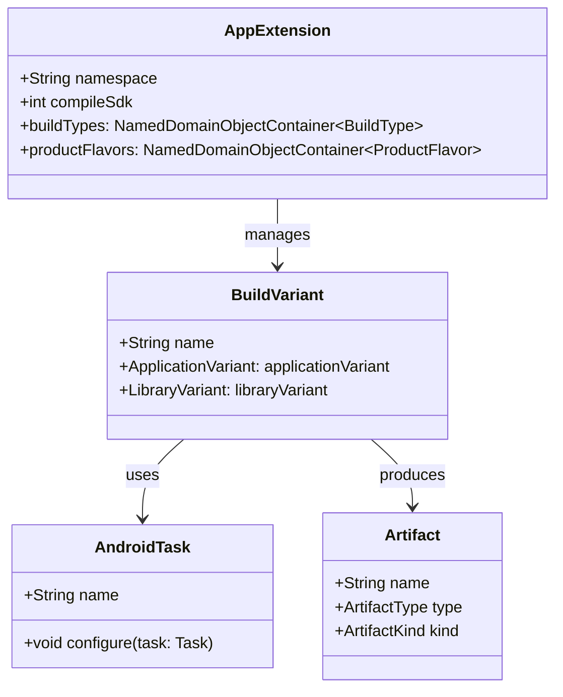

# 21.1.1 Android Gradle 插件 API 参考

午后的阳光透过帐篷的缝隙，在地面上投下斑驳的光影。洛芙盘腿坐在防潮垫上，手里捧着一杯已经凉透的柠檬茶，眼神有些涣散地盯着一旁的笔记本电脑。

“洛芙，发什么呆呢？”

希尔从外面钻进来，手里还拿着一根咬了一半的能量棒。她的头发有些乱糟糟的，应该是刚才去检查行李的时候被树枝挂的。

“我在看你之前给我的那个项目配置，”洛芙指了指电脑屏幕，“可是看不太懂……这个build.gradle里面的android { } block到底是什么啊？感觉好复杂的样子。”

黛琳正好掀开帐篷的门帘探进头来，听到这句话便顺势坐了进来。她从随身的包里拿出一块小巧的白板和几支马克笔，动作娴熟地架好。

“你说那个啊，是Android Gradle插件的DSL，”黛琳，一边在白板上画了一个简化的结构图，“正好今天天气热，我们就在帐篷里聊聊这个话题吧。”

伊莎也跟着凑了过来，她跪坐在洛芙旁边，好奇地看了一眼屏幕上的代码：“这个我也有印象！之前看文档的时候看到过叫做什么……API Reference的东西。”

“对，就是这个！”洛芙眼睛一亮，“官方文档说这是‘Android Gradle插件API参考’，但是内容好多啊，完全不知道从哪里开始看。”

黛琳微笑着点点头：“那我们就从最基础的概念开始吧。洛芙，你还记得我们之前讲过的SDK平台吗？”

“记得！”洛芙立刻来了精神，“就是那个决定了我们的应用可以运行在什么版本的Android系统上的东西嘛！Android 14对应API 34，Android 13对应API 33……”

“没错，”黛琳画了一个向上的箭头，“而Gradle插件呢，其实是在这个基础之上，帮你把代码变成可以安装到手机上的APK文件的‘魔法工坊’。它定义了一套规则，告诉你编译的时候该做什么、怎么做、什么时候做。”

“听起来像是一个超级大的流水线！”希尔兴奋地插嘴道，“我之前在工厂实习过，里面有一条汽车组装线，每个工位只做固定的事情。Gradle插件就像是那个控制流水线的系统！”

伊莎轻轻拍了拍手：“这个比喻真形象！希尔，你继续说？”

希尔也不客气，直接拿过白板笔在白板上画了一条横向的流水线：“你看啊，源代码就像原材料一样，从左边进去。然后Gradle插件会指挥着各种任务——比如编译Java代码、压缩图片、打包资源——一个接一个地执行，最后从右边出来的就是一个可以安装的APK文件了。”


（图1：Gradle构建流水线示意图，对应希尔画的流水线草图）

洛芙若有所思地点点头：“所以这个API，就是让我们可以自定义这个流水线的东西？”

“对了一半，”黛琳竖起一根手指，“API确实允许你自定义，但是它本身是一套接口和类的集合，就像是一个工具箱。你可以用这个工具箱来配置构建过程，但不需要从头写一个流水线系统。”

“比如呢？”洛芙追问。

“比如你可以指定使用哪个版本的编译工具、要不要开启数据绑定、怎么处理不同ABI的Native库……这些都可以通过Gradle插件提供的API来配置。”

黛琳在白板上写下几个关键词：BuildType、ProductFlavor、SigningConfig、BuildVariant。

“我们一个一个来说，”她看向洛芙，“你还记得上次说的debug和release版本吗？”

洛芙想了想：“记得！debug版本可以调试，release版本会混淆代码更难被破解！”

“完全正确！”希尔朝她竖起大拇指，“这两个就是最基础的BuildType——构建类型。Gradle插件允许你定义更多的构建类型，比如‘staging’用来测试环境、‘demo’用来演示功能等等。”

伊莎补充道：“而且ProductFlavor——产品风味——允许你为同一个应用创建不同的版本。比如你的应用叫‘露营助手’，你可以创建‘免费版’和‘付费版’，它们共享大部分代码，但是付费版有更多的功能。”

“这就像是我们去星巴克，”希尔眼睛一转又想出了新比喻，“美式、拿铁、摩卡都是咖啡（基础应用），但是配料不同（ProductFlavor）。而大小杯（大杯、中杯）就像是BuildType。”

洛芙忍不住笑了出来：“这样一讲就清楚多了！那……API参考文档上说的那些类，我们怎么使用呢？”

“这就要说到DSL了，”黛琳重新拿过白板笔，“你看到的android { } block，其实是一种叫做Domain Specific Language的简写写法。在Gradle的Groovy或Kotlin脚本中，这个block实际上是对androidExtension对象的属性赋值。”

```kotlin
// 这就是你在build.gradle中写的代码
android {
    namespace 'com.example.camping'
    compileSdk 34
    
    defaultConfig {
        applicationId "com.example.camping"
        minSdk 24
        targetSdk 34
    }
    
    buildTypes {
        release {
            minifyEnabled true
            proguardFiles getDefaultProguardFile('proguard-android-optimize.txt'), 'proguard-rules.pro'
        }
        debug {
            applicationIdSuffix ".debug"
            debuggable true
        }
    }
    
    flavorDimensions += "version"
    productFlavors {
        free {
            dimension "version"
            applicationIdSuffix ".free"
        }
        paid {
            dimension "version"
            applicationIdSuffix ".paid"
        }
    }
}

// 上面的代码在运行时会被解析成类似这样的对象结构
// android = project.extensions.getByType(AppExtension::class.java)
// android.namespace = "com.example.camping"
// android.compileSdk = 34
// 等等...
```

（图2：DSL代码与底层对象的对应关系，第12-36行对应配置文件）

“原来是这样！”洛芙恍然大悟，“那个大括号里面的每一行，其实都是在设置一个对象的属性！”

“没错，”黛琳点点头，“而且Gradle插件提供的API远不止这些。文档中还提到了Artifact API、Transform API等等，它们允许你在构建过程中干预生成的文件。”

希尔来劲了：“这个我知道！比如你想在编译完成后自动给APK加上时间戳，或者想在打包前对所有图片进行压缩，都可以用的上！”

“那具体怎么用呢？”洛芙好奇地问。

希尔把电脑拿过来，飞快地敲了一段代码：

```kotlin
import com.android.build.api.artifact.ArtifactType
import com.android.build.api.artifact.ArtifactKind

// 这是一个自定义任务的示例，用于在APK生成后自动复制到指定目录
abstract class CopyApkTask : DefaultTask() {
    @get:InputFile
    abstract val apkFile: RegularFileProperty
    
    @get:OutputDirectory
    abstract val outputDir: DirectoryProperty
    
    @TaskAction
    fun copy() {
        val input = apkFile.get().asFile
        val output = outputDir.get().file(input.name).asFile
        input.copyTo(output, overwrite = true)
        println("APK copied to: ${output.absolutePath}")
    }
}

// 在Android插件中使用这个任务
androidComponents {
    onVariants(selector().all()) { variant ->
        val outputDir = project.layout.buildDirectory.dir("outputs/apk/${variant.name}")
        
        project.tasks.register<CopyApkTask>("copy${variant.name.capitalize()}Apk") {
            apkFile.set(variant.artifacts.get(SingleArtifact.APK))
            outputDir.set(outputDir)
        }
    }
}
```

“哇！”洛芙惊叹道，“这看起来好复杂，但是功能也好强大！”

“这种就是比较进阶的用法了，”黛琳解释道，“对于初学者来说，更重要的是先掌握基础的配置。等你熟悉了build.gradle的各种设置之后，再来深入研究这些高级API会比较容易理解。”

伊莎在一旁温柔地说：“而且文档里有很多示例可以参考，不需要一下子全部学会。露营也是一样的嘛，先学会搭帐篷，再学生火，最后才是野炊料理——一步一步来。”

洛芙若有所思地点点头。她重新看向电脑屏幕上的文档：“原来这个API参考是给进阶用户看的啊……我还以为可以直接从头看到尾呢。”

“也不是不行，”希尔笑着说，“但是内容确实很多。你看这里，光是com.android.build.api这个包下面就有几十个类和接口。”

黛琳指着白板上她画的框架图：“其实我们可以把它分成几个主要部分来看：

1. **配置相关的API**：AppExtension、LibraryExtension、TestExtension这些，用来配置应用/库/测试模块的基本信息。

2. **构建变体相关的API**：VariantManager、BuildVariant这些，用来管理不同的构建变体组合。

3. **任务相关的API**：AndroidTask、TransformTask这些，用来定义和管理构建过程中的各种任务。

4. **产物相关的API**：Artifact、SingleArtifact、MultipleArtifact这些，用来描述构建输入输出。”



（图3：Gradle插件API的主要组成类及其关系）

洛芙认真地在笔记本上记录着：“那……如果我们想查看某个具体的类或者方法，应该怎么在文档里找呢？”

“这也是我想说的，”黛琳把白板翻到新的一页，“官方文档的左侧有一个索引，你可以按照包名或者类名来查找。比如你想了解ApplicationVariant这个类，可以直接搜索‘ApplicationVariant’或者在com.android.build.api.variant这个包下面找到它。”

“如果看到某个方法不知道是干什么的怎么办？”洛芙又问。

“看文档咯！”希尔耸耸肩，“每个方法都有说明的参数、返回值和作用。有的时候还会有使用示例。虽然是英文的，但是Google翻译一下大概能明白。”

伊莎轻轻碰了碰洛芙的肩膀：“而且露营编程旅团的学习方式就是这样——遇到不懂的就查、就问、就试。不要害怕看官方文档，它虽然看起来很枯燥，但其实是最好的学习资源。”

洛芙深呼吸一口气：“嗯！我明白了！先从基础的配置学起，然后再慢慢深入。总会学会的！”

“这就对了！”希尔打了个响指，“来，我们来实战一下。我这里有一个新的小项目，你来试着配置一下build.gradle，让它同时支持免费版和付费版两个版本！”

洛芙兴奋地接过电脑，入手开始敲代码。虽然还有不少地方不太明白，但是至少她知道该去哪里查找答案了。


日影西斜，帐篷里的光线开始变得柔和起来。洛芙伸了个懒腰，看着自己写的第一个像模像样的build.gradle配置，心里涌起一种小小的成就感。

“黛琳，”她抬起头，“你说以后如果我们想做一些更高级的定制，比如自动生成不同风格的图标，或者在编译时插入一些代码，该怎么做呢？”

黛琳笑着看向她：“那就要用到更高级的API了，比如Transform API或者Annotation Processing。不过那些是后面的内容了，今天先把这个基础打牢。”

伊莎递过来一块小饼干：“洛芙进步真的很快呢！记得我第一次看到这些配置的时候，完全不知道从何下手。”

“那是因为你有一个好老师呀！”洛芙撒娇般地说，“黛琳讲得比文档清楚多了！”

希尔收拾着白板笔：“那是因为黛琳是专业的！我讲的话就喜欢用各种奇怪的比喻……”

“你那不是比喻，是情景喜剧！”伊莎笑着反驳。

帐篷里响起一阵轻快的笑声。远处的蝉鸣还在继续，但是听起来已经没有中午那么刺耳了。风穿过树梢，带来一丝丝凉爽的气息。

洛芙重新看向电脑屏幕上的API文档。虽然还是满满当当的英文，虽然还有很多地方看不懂，但是她的心里已经没有之前那种畏惧感了。

就像伊莎说的那样一步一步来嘛，总有一天会看懂的。她这样想着，嘴角不自觉地扬起了一个小小的弧度。

---

> 本章核心机制定义：
> Android Gradle 插件 API 是 AGP 暴露给构建脚本与插件开发者的官方接口集合，核心覆盖 `com.android.build.api.dsl`（声明式配置）、`com.android.build.api.variant`（变体模型）、`com.android.build.api.artifact`（构建产物）与 `androidComponents`（变体回调入口）。它让开发者在不破坏构建流水线的前提下，安全地定制 Android 构建行为。

#### 结构图

```mermaid
graph TD
    A[build.gradle(.kts)] --> B[android DSL]
    A --> C[androidComponents]
    B --> D[com.android.build.api.dsl]
    C --> E[com.android.build.api.variant]
    E --> F[Variant]
    F --> G[artifacts]
    G --> H[com.android.build.api.artifact]
    H --> I[APK / AAB / merged manifest / classes]
```

#### 反模式

1. **把业务逻辑塞进 `android {}` 配置阶段**  
   修复：配置阶段只声明属性，重逻辑放进 Task 或 Worker。
2. **在 `onVariants` 里直接访问未声明依赖的文件路径**  
   修复：通过 `variant.artifacts` 的 Provider API 获取输入输出。
3. **无节制生成 Flavor 组合**  
   修复：用维度约束 + `beforeVariants` 按需禁用变体。
4. **继续依赖过时 Transform 思维**  
   修复：优先使用现代 Variant/Artifact API 做产物接线与替换。

#### 设计哲学

- **声明优先**：先描述目标状态，再由 AGP/Gradle 规划执行。
- **懒加载优先**：大量使用 Provider，避免配置期过早求值。
- **变体即中心**：面向 Variant 建模，而不是硬编码任务名。
- **产物可追踪**：通过 Artifact API 连接输入输出，保证可缓存、可增量。

---

## 动手练习

### 练习1：读包结构，建立 API 地图
**目标**：定位 `dsl / variant / artifact` 三大入口。  
**步骤**：
1. 打开 `official_url` 的 API reference。
2. 分别进入 `com.android.build.api.dsl`、`com.android.build.api.variant`、`com.android.build.api.artifact`。
3. 记录每个包最常见的 3 个类型。

**验收标准**：能口述“配置用 dsl、变体用 variant、产物用 artifact”。

### 练习2：在 DSL 中声明基础配置
**目标**：用 `android {}` 完成最小可运行配置。  
**提示代码**：
```kotlin
android {
    namespace = "com.example.camp"
    compileSdk = 34
    defaultConfig {
        minSdk = 24
        targetSdk = 34
        applicationId = "com.example.camp"
    }
}
```

### 练习3：使用 `androidComponents` 观察变体
**目标**：理解 Variant 回调时机。  
**提示代码**：
```kotlin
androidComponents {
    onVariants(selector().all()) { variant ->
        println("variant = ${variant.name}")
    }
}
```

### 练习4：按需裁剪变体
**目标**：避免无意义组合拖慢构建。  
**提示代码**：
```kotlin
androidComponents {
    beforeVariants(selector().all()) { builder ->
        if (builder.buildType == "release" && builder.productFlavors.isEmpty()) {
            // 示例：按团队规则禁用某类变体
            builder.enable = false
        }
    }
}
```

### 练习5：读取并连接构建产物
**目标**：通过 Artifact API 获取标准产物句柄。  
**提示代码**：
```kotlin
androidComponents {
    onVariants(selector().all()) { variant ->
        val apkProvider = variant.artifacts.get(com.android.build.api.artifact.SingleArtifact.APK)
        println("APK provider for ${variant.name}: $apkProvider")
    }
}
```

### 练习6：区分“配置期”与“执行期”
**目标**：避免把耗时逻辑放在配置期。  
**步骤**：
1. 在 `onVariants` 中只做注册与连线。
2. 把文件处理逻辑移入 `@TaskAction`。
3. 对比构建扫描中的配置时间变化。

## 面试热身

### Q1：`android {}` 与 `androidComponents {}` 的核心区别是什么？
**答**：`android {}` 面向声明式配置（命名空间、SDK、buildTypes/flavors）；`androidComponents {}` 面向变体生命周期回调，适合按变体注册任务、裁剪变体与连接产物。

### Q2：为什么 AGP 推荐用 Variant/Artifact API 而不是硬编码任务名？
**答**：任务名会因 AGP 版本和插件组合变化，硬编码脆弱；Variant/Artifact API 是稳定抽象，兼容性与可维护性更好。

### Q3：`beforeVariants` 与 `onVariants` 各适合做什么？
**答**：`beforeVariants` 用于“生成前决策”（如 enable/disable）；`onVariants` 用于“生成后配置”（注册任务、连接 artifacts）。

### Q4：如何减少多 Flavor 带来的构建膨胀？
**答**：减少维度、合并重复 Flavor、用 `beforeVariants` 禁用无效组合，并在 CI 只构建必要矩阵。

### Q5：Artifact API 的价值是什么？
**答**：它把构建产物变成受管理的 Provider，能安全接线输入输出，提升增量构建与缓存命中率。

## 参考实现要点

- 以 `android {}` 完成“静态声明”，以 `androidComponents {}` 完成“动态挂接”。
- 任务注册使用 `tasks.register`，避免 `tasks.create` 触发过早实例化。
- 读取产物时只通过 `variant.artifacts`，不要手拼 `build/outputs/...` 路径。
- 保持 API 对齐官方 reference：优先查包路径与类型签名，再写示例。
- 团队约定一份“可构建变体白名单”，用代码固化到 `beforeVariants`。

---

> 学习建议：先把官方 API reference 当“地图”用——先认包，再认类，再认方法。每天只攻克一个入口（dsl / variant / artifact 其一），并用一个最小示例验证。你在营地里已经能把 free/paid 变体跑起来了，下一步就是把它变成可维护、可扩展的工程习惯。

## 洛芙的小小日记本

傍晚的风终于吹进帐篷，我把白天记下的 API 名称又看了一遍：`dsl` 负责“写规则”，`androidComponents` 负责“在变体上动手”，`artifact` 负责“拿到产物”。原来不是文档太可怕，而是我以前没地图。今天有地图了，心里就不慌了。

## 今日关键词

- **com.android.build.api.dsl**：AGP 的声明式配置 API 包
- **com.android.build.api.variant**：构建变体模型与生命周期 API 包
- **com.android.build.api.artifact**：构建产物访问与替换 API 包
- **androidComponents**：AGP 变体回调入口
- **beforeVariants**：变体创建前的筛选/禁用钩子
- **onVariants**：变体创建后的配置钩子
- **SingleArtifact**：单一产物类型枚举（如 APK）
- **Provider**：Gradle 懒加载与依赖追踪核心抽象
- **BuildType / ProductFlavor**：变体维度的基础组成
- **Variant-aware configuration**：按变体建模与配置的方法论
