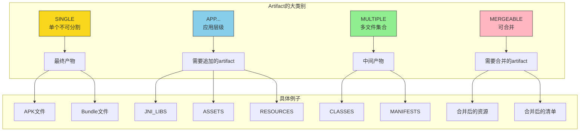
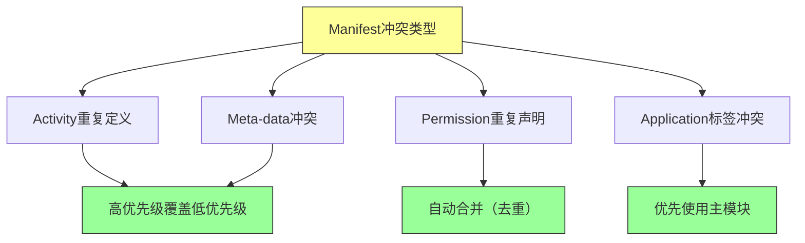

# 21.1.10 Artifact.Category

午后的阳光热辣辣地铺在帐篷顶上，洛芙用手扇着风，看着远处山坡上蒸腾的热浪。刚才希尔演示的那段追加 JniLibs 的代码还印在她脑海里，挥之不去。

“黛琳，”洛芙歪着头，“你刚才说 JniLibs 是可以追加的，那……其他东西呢？APK 也是可以追加的吗？”

黛琳正在整理她的笔记本，听到这个问题抬起头来：“问得好。其实不是所有的 Artifact 都能追加的，有的只能单独存在，有的可以合并，有的必须要经过处理才能用——它们有不同的‘性格’。”

“性格？”洛芙眼睛一亮，“你是说 Artifact 也有不同的类型吗？”

“对，”黛琳笑着点点头，“在 Android 构建系统里，每一个 Artifact 都有自己的‘类别’（Category），就像我们人有的性格内向，有的外向，有的多才多艺。Artifact 也一样——有的单独，有的可追加，有的需要合并。”

伊莎端着一杯凉水走过来，递给洛芙：“先喝口水，听起来这是个很有趣的话题呢。”

洛芙接过水喝了一口，好奇地问：“那……artifact 一共有哪些类别呢？”

黛琳翻开笔记本，在空白页上画了一个大括号：“总的来说，Artifact 分为四大类别——”

她一边写一边解释：

“**第一类是 SINGLE**，就是‘单个的、独立的’ artifact。想象一下，一个已经打包好的便当盒——它就是一个整体，不能往里再加东西了。比如我们最后生成的 APK 文件，就是 SINGLE 类型的 artifact。”

“**第二类是 APP...**，这个名字有点奇怪，”黛琳笑了笑，“其实它代表的是‘面向应用的 artifact’。这类 artifact 是专门给应用代码使用的，比如我们之前说过的 JniLibs、Assets、Resources，都属于这个类别。”

洛芙举手提问：“等等，APP... 这个名字是怎么来的？”

希尔从旁边探过头来，笑容灿烂：“这个问题问得好！其实这是 AGP 内部的命名惯例——APP... 代表所有以 APP 开头的类别，比如 APP_PACKAGE、APP_NATIVE_LIBS 之类的。希尔牌百科全书，随时为您服务！”

黛琳被希尔逗笑了，继续说道：“第三类是 **MULTIPLE**，就是‘多个的’ artifact。这类 artifact 代表的是可以包含多个文件的集合，比如一个文件夹里有很多个 .class 文件，或者很多个资源文件。”

“那……MULTIPLE 和 APP... 有什么区别呢？”洛芙有点混淆。

“问得好，”黛琳点点头，“MULTIPLE 更底层一些，它只是表示‘这里有很多文件’，但对这些文件本身没有特殊处理。而 APP... 类别则带有应用层的语义——系统知道这些文件最终要去哪里、怎么被使用。”

伊莎轻轻补充道：“就像露营时的行李——MULTIPLE 就像一堆杂乱的装备，你只知道它们都是装备；但 APP... 就像已经分好类的背包，系统知道这个是帐篷、那个是炊具、这个要放在车上。”

“原来如此！”洛芙恍然大悟，“那第四类呢？”

“第四类是 **MERGEABLE**，就是‘可合并的’，”黛琳说，“这类 artifact 可以在构建过程中和其他同类型的 artifact 合并。比如多个模块的 resources 合并成一个，多个模块的 manifests 合并成一个……这可是构建系统最强大的能力之一。”

洛芙把这些类别在脑海里过了一遍：“那我之前学的 Artifact.Appendable，属于哪个类别呢？”

黛琳笑着摇头：“Artifact.Appendable 不是类别，它是一个接口。不过——实现了 Appendable 接口的 artifact，通常属于 APP... 类别或者 MULTIPLE 类别，因为它们本身就代表‘一组可以添加东西的集合’。”

希尔敲了敲电脑，调出一段代码：“来，让我们看看官方文档里是怎么定义这些类别的——”

```kotlin
// Artifact.Category 的枚举定义（简化版）
enum class Category {
    SINGLE,        // 单个 artifact，不可分割
    APP_PACKAGE,   // 应用包相关
    MULTIPLE,       // 多个文件组成的集合
    MERGEABLE      // 可合并的 artifact
}
```

“原来是这样！”洛芙盯着代码看，“那这些类别分别用在什么地方呢？”

黛琳重新翻开一页白纸：“让我给你画一个完整的分类图——”

她在纸上画起来：



“这个图清楚多了！”洛芙拍着手，“可是……我还有一个问题。”

“什么问题？”黛琳歪着头看她。

“如果我不小心把一个 SINGLE 类别的 artifact 当作 APP... 来用，会怎么样？”

黛琳的表情变得认真起来：“这是个很重要的问题。实际上，如果你尝试向一个 SINGLE 类型的 artifact 追加内容，构建系统会直接报错——因为它根本不支持这种操作。”

她在电脑上敲出一段代码演示：

```kotlin
// ❌ 错误示例：尝试向 SINGLE 类型的 artifact 追加内容
android.applicationVariants.all { variant ->
    variant.artifacts.use { artifacts ->
        // APK 是 SINGLE 类型的，不能追加！
        artifacts.get(ArtifactType.APK)
            .additional("extra-file") {
                project.file("some/file.txt")
            }
    }
}
```

洛芙看到这个代码缩成了一团：“这会报错吗？”

“会，”希尔点点头，“而且是编译时错误——在你运行构建之前，Gradle 就会告诉你‘这个 artifact 不支持 additional() 方法’。这就是类别系统的保护机制。”

伊莎轻轻拨弄着头发，柔声说道：“就像不同的容器有不同的用法——玻璃瓶不能装热水，塑料瓶不能装热油。提前知道容器的‘性格’，就不会用错。”

洛芙若有所思地点点头：“那……MERGEABLE 类别的 artifact 是怎么工作的呢？比如多个模块的 resources 是怎么合并的？”

黛琳来了精神：“这就要讲到构建系统最精彩的部分了！来，希尔，给她演示一下 manifest 合并的过程。”

希尔 grinning（露出灿烂的笑容），在电脑上敲出一段代码：

```kotlin
// 演示 MERGEABLE 类型的 manifest 合并
android.applicationVariants.all { variant ->
    variant.artifacts.use { artifacts ->
        // 获取合并后的 manifest
        // 这是一个 MERGEABLE 类型的 artifact
        artifacts.get(ArtifactType.MERGED_MANIFEST).finalizedBy { manifest ->
            // 合并会在构建过程中自动发生
            // 这里可以查看合并后的结果
            manifest.outputDirectory.map { dir ->
                val manifestFile = dir.resolve("AndroidManifest.xml")
                println("合并后的 Manifest 位于: ${manifestFile.absolutePath}")
            }
        }
    }
}
```

洛芙凑近屏幕看：“MERGED_MANIFEST……这就是把所有模块的 AndroidManifest.xml 合并起来的结果吗？”

“对，”黛琳说，“每个模块都有自己的 AndroidManifest.xml——应用模块、库模块、feature 模块……构建系统会按照一定的规则把它们合并成一个最终的 manifest。这个过程不需要你写任何代码，系统自动完成。”

她在白板上画了一个合并的示意图：

```mermaid
graph LR
    subgraph 模块A的Manifest
        A1[<manifest><application<br/>android:label="AppA"/></manifest>]
    end
    
    subgraph 模块B的Manifest
        B1[<manifest><uses-permission<br/>android:name="android.permission.CAMERA"/></manifest>]
    end
    
    subgraph 模块C的Manifest
        C1[<manifest><application<br/>android:icon="@mipmap/ic_launcher"/></manifest>]
    end
    
    A1 -->|合并| M[最终Manifest]
    B1 -->|合并| M
    C1 -->|合并| M
    
    M -->|<manifest<br/>application: label="AppA"<br/>icon="@mipmap/ic_launcher"<br/>uses-permission: CAMERA/>| Final[打包进APK]
    
    style M fill:#bbf,stroke:#333
    style Final fill:#9f9,stroke:#333
```

“原来如此！”洛芙惊叹道，“那合并的时候会不会有冲突？比如两个模块都定义了同一个 activity？”

“会的，”黛琳的表情变得认真，“这就是合并规则发挥作用的地方了。AGP 有一套完整的冲突解决策略——”

她在白板上写下几种常见的合并规则：



黛琳指着图解释：“比如 activity 冲突——如果两个模块都声明了同一个 activity（相同的完全限定名），构建系统会让高优先级的模块覆盖低优先级的。库的优先级低于应用，主模块的优先级高于依赖模块。”

洛芙似懂非懂地点点头：“那……我能自己控制合并的优先级吗？”

“可以的，”希尔接过话题，“你可以在 build.gradle 里通过 `android.buildFeatures.manifestPackageNameOverride` 或者 `android.defaultConfig.manifestPlaceholders` 来控制合并行为。具体怎么用，我们以后讲 Manifest 的时候会详细说。”

伊莎轻轻打了个哈欠，柔声说道：“说了这么多类别……洛芙，你记住了吗？”

洛芙赶紧点头：“嗯！SINGLE 是单独的，APP... 是应用层的，MULTIPLE 是多文件的，MERGEABLE 是可以合并的！”

“总结得不错，”黛琳笑着说，“不过我再问你一个问题——你知道一个 artifact 的类别是在哪里定义的吗？”

洛芙摇头。

“是这样的，”黛琳耐心解释，“Artifact 的类别是在 AGP 内部定义的。当你使用 `ArtifactType.XXX` 获取一个 artifact 的时候，系统就已经知道它属于哪个类别了。你不能自己随意改变一个 artifact 的类别——它生来是什么类别，就是什么类别。”

“那……如果我想要一个可以追加的 artifact，但它原本是 SINGLE 类别，该怎么办？”洛芙又问。

“这是一个好问题，”黛琳说，“答案是不行——你不能把一个 SINGLE 类别的 artifact 变成可追加的。如果你需要可追加的功能，必须一开始就使用正确的 artifact 类型。比如你想要一个可以追加文件的输出，那就不能用 APK，而要用 JNI_LIBS 或者 ASSETS 这种本身就支持追加的类型。”

洛芙拍了拍脑袋：“原来如此！类型从一开始就决定了，不能中途改变。”

“对，”黛琳总结道，“这就像露营时的装备——帐篷就是用来睡觉的，炊具就是用来做饭的。你不能把帐篷改造成炊具，也不能把炊具改造成帐篷。选择正确的工具，才能做正确的事。”

洛芙深有感触地点点头。她现在对 Android 构建系统的理解又深入了一层。

“对了，”希尔突然想起什么，“我再给你们看一个有趣的例子——MULTIPLE 类别的 artifact 是怎么用的。”

她在电脑上敲出一段代码：

```kotlin
// 使用 MULTIPLE 类别的 artifact
android.applicationVariants.all { variant ->
    variant.artifacts.use { artifacts ->
        // 获取编译后的所有 class 文件
        // CLASSES 是一个 MULTIPLE 类型的 artifact
        artifacts.get(ArtifactType.CLASSES).finalizedBy { classes ->
            classes.outputDirectory.map { dir ->
                // 遍历所有生成的 class 文件
                dir.walkTopDown().filter { it.extension == "class" }
                    .forEach { classFile ->
                        println("生成的 class: ${classFile.name}")
                    }
            }
        }
    }
}
```

洛芙看着这段代码：“CLASSES 就是编译后的 .class 文件吗？”

“对，”希尔点点头，“每个模块都会生成自己的 .class 文件，这些文件组合在一起，就是 MULTIPLE 类别的 artifact。系统把它们放在一个目录里，你可以遍历、查看，但不要随意修改它们——因为它们是构建过程的中间产物。”

伊莎温柔地补充：“就像我们露营时收集的柴火——每一根都是独立的，但它们放在一起，就是一个整体。多根柴火可以合并成一大捆，单根柴火也可以单独使用。”

洛芙看看伊莎，又看看黛琳，忽然明白了什么：“所以——SINGLE 就像已经打包好的便当，不能拆开；MULTIPLE 就像散落的柴火，可以一根一根处理；MERGEABLE 就像不同人的背包，最后要合并成一个；APP... 就像已经分好类的露营装备，知道每样东西该放在哪里？”

“完全正确！”黛琳笑着说，“洛芙，你现在的理解越来越到位了。”

洛芙不好意思地挠挠头：“都是因为你们讲得好嘛……”

太阳渐渐偏西，帐篷里的光线变得柔和起来。洛芙伸了个懒腰，满足地叹了口气。

“今天的露营学习就到这里吧，”黛琳收拾着东西，“明天我们要讲一个新的主题——构建变体和配置。”

“构建变体？”洛芙好奇地问，“是不是就是 debug 版和 release 版那些？”

“没错，”希尔 grinning（露出灿烂的笑容），不过可不只是 debug 和 release 那么简单——还有各种产品风味（flavor）、构建类型（build type）的组合，会让你打开新世界的大门！

洛芙期待地看向远方，仿佛已经看到了明天的学习内容。蝉鸣声还在耳边回响，热气渐渐消退，夜色即将降临。

<!-- TECH_EXPERT_START -->

## 技术总结

### 核心机制定义

**Artifact.Category** —— Android 构建系统中用于分类人工制品的枚举类型，定义了 Artifact 的四种基本类别：SINGLE（单个不可分割）、APP...（应用层级）、MULTIPLE（多文件集合）、MERGEABLE（可合并）。每个 Artifact 在创建时就确定了其类别，不同类别决定了该 Artifact 的使用方式和行为特征。

### 结构图

```mermaid
graph TB
    subgraph Artifact.Category枚举
        A[SINGLE<br/>单个不可分割] 
        B[APP...<br/>应用层级]
        C[MULTIPLE<br/>多文件集合]
        D[MERGEABLE<br/>可合并]
    end
    
    subgraph 典型Artifact示例
        A --> A1[APK]
        A --> A2[BUNDLE]
        B --> B1[JNI_LIBS]
        B --> B2[ASSETS]
        B --> B3[RESOURCES]
        C --> C1[CLASSES]
        C --> C2[LOCAL_JAVA_RESOURCES]
        D --> D1[MERGED_MANIFEST]
        D --> D2[MERGED_RESOURCES]
    end
    
    subgraph 操作支持
        A1 -.->|不支持追加| X[只能获取最终产物]
        B1 -->|支持追加| Y[additional()/from()]
        C1 -.->|不支持追加| Z[只读多文件集合]
        D1 -->|自动合并| W[构建时合并]
    end
    
    style A fill:#f9d71c,stroke:#333
    style B fill:#87CEEB,stroke:#333
    style C fill:#90EE90,stroke:#333
    style D fill:#FFB6C1,stroke:#333
```

### 反模式与陷阱

**反模式一：将 SINGLE 类别 artifact 当作可追加使用**
```kotlin
// ❌ 错误示例：APK 是 SINGLE 类型，不支持追加
artifacts.get(ArtifactType.APK).additional("extra") {
    project.file("something.txt")
}

// ✅ 正确做法：使用 APP... 类别的 artifact 如 JNI_LIBS
artifacts.get(ArtifactType.JNI_LIBS).additional("extra") {
    project.file("libs/custom.so")
}
```

**反模式二：混淆 MULTIPLE 和 MERGEABLE**
```kotlin
// ❌ 错误示例：MULTIPLE 只是文件集合，不支持合并逻辑
artifacts.get(ArtifactType.CLASSES).additional("more") {
    project.file("extra.class")
}

// ✅ 正确做法：使用 MERGEABLE 类型的 artifact 进行合并
artifacts.get(ArtifactType.MERGED_MANIFEST)
// manifest 会在构建时自动合并
```

**反模式三：手动修改中间产物**
```kotlin
// ❌ 错误示例：尝试在构建过程中修改 CLASSES 目录
val classes = artifacts.get(ArtifactType.CLASSES)
classes.outputDirectory.map { dir ->
    dir.listFiles()?.forEach { file ->
        // 不应该修改这些文件！
        file.delete()
    }
}

// ✅ 正确做法：只读取，不修改中间产物
// MULTIPLE 类别的 artifact 主要用于检查和调试
```

### 设计哲学

**1. 类型即契约**
Artifact 的类别从创建时就确定，不可改变。这种设计确保了构建系统的可预测性——开发者知道每种 artifact 能做什么、不能做什么。

**2. 语义化分类**
APP... 类别带有应用层语义，系统知道这些 artifact 最终如何被使用；MULTIPLE 更底层，只表示"一堆文件"；MERGEABLE 则带有合并的语义。这种分类使得构建系统可以针对不同类别采取不同的处理策略。

**3. 安全保护机制**
类别系统提供了内置的保护——如果你尝试对不支持的操作，系统会在编译时就报错，而不是在运行时才暴露问题。这大大提高了构建的可预测性和调试效率。

---

## 动手练习

### ★ 查看不同类别 artifact 的类型信息
**目标**：理解如何查询 artifact 的类别  
**步骤**：
1. 在 build.gradle.kts 中获取一个 applicationVariants
2. 使用 `variant.artifacts.all` 遍历所有 artifact
3. 打印每个 artifact 的类型和类别信息
4. 观察输出，理解不同类别的 artifact

**验收标准**：能够在日志中看到 SINGLE、APP...、MULTIPLE、MERGEABLE 四种类别的 artifact

**提示**：使用 `println("${artifactType.name} -> ${artifactType.category}")` 输出类别

---

### ★★ 尝试操作不同类别的 artifact
**目标**：理解类别对操作的限制  
**步骤**：
1. 创建一个新的 Android 项目
2. 尝试对 APK（SINGLE）调用 additional() 方法
3. 观察编译错误信息
4. 改为对 JNI_LIBS（APP...）调用 additional()
5. 运行构建验证成功

**验收标准**：理解 SINGLE 类别不支持追加操作，而 APP... 类别支持

**提示**：错误信息会提示 "Cannot call additional() on SINGLE category artifact"

---

### ★★★ 理解 Manifest 合并规则
**目标**：掌握 MERGEABLE 类别的合并机制  
**步骤**：
1. 创建两个模块，都有自己的 AndroidManifest.xml
2. 在两个 manifest 中声明不同的组件（activity、service 等）
3. 运行构建，查看合并后的 manifest
4. 制造冲突（如两个模块声明同名 activity）
5. 观察冲突解决规则

**验收标准**：理解高优先级模块覆盖低优先级的规则

**提示**：应用模块的优先级高于库模块，主模块的优先级高于依赖模块

---

### ★★★★ 自定义合并策略
**目标**：学会控制合并行为  
**步骤**：
1. 在 build.gradle 中配置 manifestPlaceholders
2. 使用 tools:node 和 tools:replace 控制特定节点的合并行为
3. 构建并观察不同配置的结果

**验收标准**：能够精确控制 manifest 中特定节点的合并方式

**提示**：参考 AndroidManifest 合并文档中的 "Node Merging Rules"

---

### ★★ 分析 CLASSES artifact 的内容
**目标**：理解 MULTIPLE 类别的使用方式  
**步骤**：
1. 在 build.gradle.kts 中获取 CLASSES artifact
2. 遍历输出目录中的所有 .class 文件
3. 统计不同模块的 class 文件数量
4. 观察文件组织结构

**验收标准**：理解 MULTIPLE 只是文件集合，不支持追加或合并

**提示**：CLASSES 的输出目录通常在 build/intermediates/javac/ 目录下

---

### ★★★ 比较 SINGLE 和 MERGEABLE 的区别
**目标**：深入理解两类 artifact 的本质差异  
**步骤**：
1. 获取 APK（SINGLE）和 MERGED_MANIFEST（MERGEABLE）
2. 观察两者的使用方式差异
3. 尝试对两者调用相同的方法
4. 分析错误信息的差异

**验收标准**：清晰理解 SINGLE 是最终产物，MERGEABLE 是中间产物

**提示**：SINGLE 类型通常作为构建的最终输出，MERGEABLE 作为构建过程的中间结果

---

### ★★★★ 调试 artifact 合并问题
**目标**：学会诊断合并冲突  
**步骤**：
1. 故意制造 manifest 冲突
2. 使用 --info 查看详细的合并日志
3. 分析合并过程中的决策树
4. 使用 tools:node 属性修复冲突

**验收标准**：能够独立解决常见的 manifest 合并问题

**提示**：查看 build/outputs/logs/ 目录下的合并日志

---

## 面试热身

### Q1: Artifact.Category 有哪些类别？它们有什么区别？

**答**：Artifact.Category 分为四种基本类别。**SINGLE** 代表单个不可分割的 artifact，如最终的 APK 文件，只能获取，不能追加或修改。**APP...** 是应用层级的 artifact，支持追加操作，如 JNI_LIBS、ASSETS、RESOURCES 等，专门用于应用打包。**MULTIPLE** 是多文件集合，如编译后的 CLASSES 目录，只是文件的简单集合，不带有特殊处理逻辑。**MERGEABLE** 是可合并的 artifact，如 MERGED_MANIFEST 和 MERGED_RESOURCES，系统会在构建过程中自动合并多个来源的文件。

---

### Q2: 为什么不能向 SINGLE 类别的 artifact 追加内容？

**答**：SINGLE 类别的 artifact 代表的是最终构建产物，如 APK、Bundle。这些文件在构建完成后就是一个完整的整体，系统不支持也不应该在中途修改。追加操作会破坏构建的一致性和可重复性。如果需要向 APK 添加额外内容，应该在构建过程中使用 APP... 类别的 artifact（如 JNI_LIBS、ASSETS），让系统将这些文件正确地打包进最终产物。

---

### Q3: MERGEABLE 和 MULTIPLE 有什么本质区别？

**答**：MERGEABLE 带有明确的"可合并"语义，系统会自动将多个来源的同类型 artifact 按照规则合并成一个，如多个模块的 manifest 合并成一个、多个模块的 resources 合并成一个。MULTIPLE 只是表示"这里有多个文件"，系统不会进行任何合并处理，只是简单地将文件集合暴露给开发者。简单来说，MERGEABLE 是"系统帮你合并"，MULTIPLE 是"你自己看着办"。

---

### Q4: 如何查看一个 artifact 属于哪个类别？

**答**：可以通过 AGP 提供的 API 查询 artifact 的类别信息。在 `variant.artifacts.all` 的回调中，可以访问 `artifactType.category` 属性来获取类别枚举值。也可以查阅 AGP 官方文档中 ArtifactType 的定义，每个类型的文档都会标明其所属的 Category。

---

### Q5: 在实际项目中，如何选择使用哪种类别的 artifact？

**答**：选择依据是最终需求。如果需要生成最终的应用包，使用 SINGLE 类别的 APK 或 BUNDLE。如果需要在构建过程中添加额外的文件（如 native 库、资源文件），使用 APP... 类别的 artifact（JNILibs、Assets、Resources）。如果需要访问构建的中间产物进行检查或调试，使用 MULTIPLE 类别的 artifact（CLASSES、LOCALJAVA_RESOURCES）。如果需要参与构建合并流程，使用 MERGEABLE 类别的 artifact（MERGED_MANIFEST、MERGED_RESOURCES）。

---

## 参考实现要点

### 查看 artifact 类别

```kotlin
android.applicationVariants.all { variant ->
    variant.artifacts.use { artifacts ->
        artifacts.all { artifactType ->
            println("${artifactType.name}: ${artifactType.category}")
        }
    }
}
```

### 正确使用 APP... 类别追加文件

```kotlin
android.applicationVariants.all { variant ->
    variant.artifacts.use { artifacts ->
        // 向 JNI_LIBS 追加自定义 native 库
        artifacts.get(ArtifactType.JNI_LIBS)
            .additional("custom-lib") {
                project.file("libs/custom.so")
            }
        
        // 向 ASSETS 追加资源文件
        artifacts.get(ArtifactType.ASSETS)
            .additional("custom-assets") {
                project.file("assets/custom/config.json")
            }
    }
}
```

### 访问 MERGEABLE 类别的合并结果

```kotlin
variant.artifacts.get(ArtifactType.MERGED_MANIFEST).finalizedBy { manifest ->
    manifest.outputDirectory.map { dir ->
        val mergedFile = dir.resolve("AndroidManifest.xml")
        println("合并后的 Manifest: ${mergedFile.absolutePath}")
    }
}
```

### 访问 MULTIPLE 类别的文件集合

```kotlin
variant.artifacts.get(ArtifactType.CLASSES).finalizedBy { classes ->
    classes.outputDirectory.map { dir ->
        dir.walkTopDown()
            .filter { it.extension == "class" }
            .forEach { println("Class file: ${it.name}") }
    }
}
```

---

> Learning advice

理解 Artifact.Category 的关键是把握"类型即契约"的设计思想——每种类别从诞生之初就决定了它的使用方式。选择正确的 artifact 类型，就是选择正确的工作方式；违反类别约束的操作会在编译期报错，这是一种保护机制，而非限制。

---

## 洛芙的小小日记本

今天学会了Artifact.Category！原来构建产物也像人一样有不同的性格——有独立的SINGLE，有爱帮忙的APP...，有爱凑在一起的MULTIPLE，还有喜欢融合的MERGEABLE。黛琳说得对，选择正确的工具才能做正确的事呀～明天要学构建变体啦！

---

## 今日关键词

- **Artifact.Category**：Android 构建系统中用于分类人工制品的枚举类型
- **SINGLE**：单个不可分割的 artifact 类别，如 APK
- **APP...**：应用层级的 artifact 类别，支持追加操作，如 JNI_LIBS、ASSETS
- **MULTIPLE**：多文件集合的 artifact 类别，如 CLASSES
- **MERGEABLE**：可合并的 artifact 类别，如 MERGED_MANIFEST
- **ArtifactType**：具体的人工制品类型定义
- **additional()**：向 APP... 类别 artifact 添加文件的方法
- **合并冲突**：多个来源的 artifact 在合并时的规则冲突
- **manifestPlaceholders**：用于控制 manifest 合并行为的占位符
