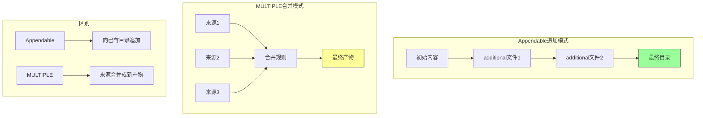
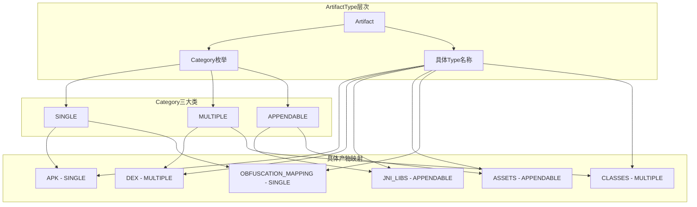

# 21.1.10 Artifact.Category

太阳透过帐篷的纱窗洒进来，在地毯上投下斑驳的光影。洛芙揉了揉眼睛，从睡袋里钻出来，发现黛琳和希尔已经坐在笔记本电脑前了。

“这么早就在忙什么呀？”洛芙打着哈欠问道。

希尔回过头来，眼睛里闪着光：“我们在整理昨天的学习笔记呢！昨天不是学了 Artifact.Appendable 吗？今天要讲它的‘分类体系’——Artifact.Category。”

洛芙一屁股坐在地毯上，好奇地问：“分类体系？Artifact 还有很多种类吗？”

“那当然！”黛琳拍了拍身边的空位，“你知道吗？Android 构建系统会产生几十种不同的Artifact——有的像瓶子一样密封，有的像收纳盒可以打开，还有的像乐高积木可以拼接。Artifact.Category 就是给这些‘奇形怪状’的构建产物贴标签、分类管理的东西。”

“贴标签？”洛芙更好奇了，“怎么贴？”

黛琳笑着在白板上画了一个简单的表格：

```mermaid
graph TD
    subgraph Artifact的"家庭成员"
        A[Artifact] --> B[SingleArtifact]
        A --> C[AppendableArtifact]
        A --> D[MultipleArtifact]
    end
    
    subgraph Category标签
        B --> E[SINGLE]
        C --> F[APPENDABLE]
        D --> G[MULTIPLE]
    end
    
    subgraph 具体产物
        E --> H[最终APK]
        E --> I[Mapping文件]
        F --> J[资源目录]
        F --> K[Assets]
        G --> L[Classes.jar]
        G --> M[DEX文件]
    end
    
    style A fill:#f9f,stroke:#333
    style E fill:#ff9,stroke:#333
    style F fill:#9f9,stroke:#333
    style G fill:#9ff,stroke:#333
```

“你看，”黛琳指着图解释道，“Artifact 是总称，就像‘人’一样。但人分男人、女人、小孩等；Artifact 也有不同的‘种类’，用 Category 来标记。”

洛芙似懂非懂地点点头：“那……具体的 Category 有哪些呢？”

希尔翻开笔记本：“来，让我们一个个看——”

## SINGLE：密封的瓶子

“首先是 **SINGLE**，”希尔写道，“代表那种‘做好了就不能改’的artifact。”

洛芙举手提问：“是不是就像昨天的 APK？”

“Exactly！”希尔打了个响指，“APK 就是最典型的 SINGLE artifact。你想啊，APK 打包好了之后，能再往里面加文件吗？”

“不能吧……”洛芙想了想，“打开 APK 再改里面的东西，手机会识别不了的。”

“对咯！”希尔笑着说，“SINGLE 类型的 artifact 就像一个密封的瓶子——一旦密封，就不能再打开往里加东西。它们是构建的最终产物。”

黛琳补充道：“除了 APK，还有什么也是 SINGLE 类型呢？”

洛芙歪着脑袋想：“嗯……mapping 文件？那个是给混淆用的吧？”

“对！”黛琳点点头，“mapping.txt（混淆映射文件）也是 SINGLE 类型。它记录了原始类名和方法名与混淆后名称的对应关系，打包后就固定了，不能再改。还有什么？”

希尔翻着文档：“还有 **dex 保真映射文件（dex metadata）**、**签名文件**、**Bundle Info** 等等——这些都是构建的最后一步生成的，做完了就不能改。”

洛芙好奇地问：“那……SINGLE 类型的 artifact 怎么使用呢？”

希尔敲出一段代码：

```kotlin
// 获取 SINGLE 类型的 artifact
android.applicationVariants.all { variant ->
    variant.artifacts.use { artifacts ->
        // 获取最终的 APK
        artifacts.get(ArtifactType.APK)
            .on { apk ->
                println("最终 APK 路径: ${apk.asFile.name}")
            }
        
        // 获取混淆映射文件
        artifacts.get(ArtifactType.OBFUSCATION_MAPPING)
            .on { mapping ->
                println("Mapping 文件: ${mapping.asFile.name}")
            }
    }
}
```

洛芙盯着代码看：“这个 `.on()` 是什么？”

“`.on()` 是用来处理 SINGLE artifact 的方法，”希尔解释道，“因为它们是最终产物，所以只能‘使用’它们，不能修改。`.on()` 就像打开瓶子看看里面有什么，但不是打开瓶子往里加东西。”

## MULTIPLE：可组合的积木

黛琳在白板上写下第二个词：“接下来是 **MULTIPLE**——可组合的 artifact。”

“和 SINGLE 有什么不同呢？”洛芙问道。

“问得好！”黛琳画了一个新的示意图：

```mermaid
graph LR
    subgraph 多个来源
        A[模块A的class] --> D
        B[模块B的class] --> D
        C[模块C的class] -> D
    end
    
    subgraph MULTIPLE处理
        D{合并} --> E[classes.jar]
    end
    
    subgraph SINGLE处理
        F[最终APK] --> G[密封!不可改]
    end
    
    style D fill:#9ff,stroke:#333
    style E fill:#ff9,stroke:#333
    style G fill:#f99,stroke:#333
```

“你看，SINGLE 是‘一个整体’，打包好了就不能动；但 MULTIPLE 是‘可以拆开重新组合’的，”黛琳解释道，“比如 Java 编译出来的 .class 文件——它们先各自编译，最后合并成一个 classes.jar。这个合并过程是构建系统自动完成的。”

洛莱眼睛一亮：“是不是就像把乐高积木拼成不同的形状？同一堆积木，可以拼成城堡，也可以拼成汽车？”

“太对了！”希尔兴奋地说，“MULTIPLE 类型的 artifact 就是乐高积木——来源可能有很多个，但最终会合并成统一的结果。”

黛琳接着说：“常见的 MULTIPLE artifact 有——”

“**Java/Kotlin Classes** —— 编译后的字节码文件，会合并成 classes.jar。”

“**DEX 文件** —— Android 的可执行文件，多个 .class 文件会编译成 .dex。”

“**Native Libraries** —— .so 文件也会按架构合并。”

洛芙举手提问：“那……MULTIPLE 和 Appendable 有什么区别？昨天学的 Appendable 不也可以加东西吗？”

“好问题！”黛琳画了一个对比图：



“_appendable 是往一个**已经存在的目录**里追加文件，就像往收纳盒里塞东西；而 MULTIPLE 是把**多个来源**合并成**一个新的产物**，就像把积木拼成新形状，”黛琳解释道，“而且，Appendable 主要是文件级别的追加，MULTIPLE 往往是编译和转换级别的合并。”

## APPENDABLE：带拉链的收纳盒

“对了，咱们昨天学的是不是就是 APPENDABLE？”洛芙突然想起来。

“对！”希尔点点头，“APPENDABLE 是第三种类型——可追加的 artifact。它就像带拉链的收纳盒，中途可以打开往里放东西，但最终会成为一个整体。”

黛琳补充道：“APPENDABLE 主要用于——资源目录（Resources）、Assets 目录、JniLibs 目录这些。它们最初可能是空的或者只有基础内容，但允许你在构建过程中追加额外的文件。”

洛芙好奇地问：“那这三种类型，我应该怎么选呢？”

希尔画了一个决策流程图：

```mermaid
flowchart TD
    A[你想做什么？] --> B{是最终产物吗？}
    B -->|是，打包后不改| C[SINGLE]
    B -->|否，要往里加文件| D{是新生成还是合并？}
    D -->|追加文件到目录| E[APPENDABLE]
    D -->|多个来源合并| F[MULTIPLE]
    
    C --> G[使用.on&#40;&#41;获取]
    E --> H[使用.additional&#40;&#41;追加]
    F --> I[自动合并]
    
    style C fill:#f99,stroke:#333
    style E fill:#9f9,stroke:#333
    style F fill:#ff9,stroke:#333
```



“这个图太有用了！”洛芙兴奋地说，“以后就知道该用哪种方式了！”

## 具体的 Category 类型

伊莎端着一盘切好的水果走进来：“聊了这么久，休息一下吧。我听到你们在说 artifact 的分类——我有个问题。”

“什么问题？”黛琳问道。

伊莎坐下来说：“我在文档里看到，除了刚才说的三种，还有很多具体的 Category 名称——比如 JAVA_CLASSES、KOTLIN_CLASSES、DEX、MANIFEST 等等。这些和 SINGLE、MULTIPLE 是什么关系？”

“好问题！”希尔说，“SINGLE、MULTIPLE、APPENDABLE 是**大类**，就像‘人类’的‘男人’、‘女人’；而具体的 Category 名称是**具体的 artifact 类型**，就像‘男人’下面有‘中国男人’、‘美国男人’。”

黛琳补充道：“具体来说——”

```kotlin
// Artifact.Category 的具体类型
enum class Category {
    // 大类
    SINGLE,           // 单一不可变
    MULTIPLE,         // 可合并
    APPENDABLE,       // 可追加
    
    // 具体类型（继承自大类）
    MANIFEST,         // AndroidManifest.xml
    JAVA_CLASSES,     // Java 编译产物
    KOTLIN_CLASSES,   // Kotlin 编译产物
    DEX,              // DEX 文件
    RESOURCES,        // Android 资源
    ASSETS,           // 原始资源
    JNI_LIBS,         // Native 库
    METADATA,         // 元数据
    // ... 还有更多
}
```

洛芙看着这些类型名称：“原来如此！所以一个具体的 artifact 会同时有——”

“**大类（Category）**——决定它的行为特性，”希尔接话，“和**具体类型**——决定它的具体内容。”

洛芙兴奋地说：“就像一个人，同时有‘性别’和‘国籍’两个属性！”

“对对对！”三人异口同声。

## 实践时间

“那……我们怎么在实际项目里查看 artifact 的 Category 呢？”洛芙跃跃欲试。

希尔敲出一段代码：

```kotlin
// 查看 artifact 的分类信息
android.applicationVariants.all { variant ->
    variant.artifacts.use { artifacts ->
        // 遍历所有已注册的 artifact 类型
        ArtifactType.entries.forEach { type ->
            val category = type.category  // 获取 Category
            println("${type.name}: ${category}")
        }
    }
}
```

运行后会输出类似：

```text
APK: SINGLE
OBFUSCATION_MAPPING: SINGLE
JAVA_CLASSES: MULTIPLE
KOTLIN_CLASSES: MULTIPLE
DEX: MULTIPLE
JNI_LIBS: APPENDABLE
ASSETS: APPENDABLE
ANDROID_RESOURCES: APPENDABLE
MANIFEST: SINGLE
...
```

“原来 APK 是 SINGLE 类型的！”洛芙恍然大悟，“难怪不能往里加东西！”

“对啦，”黛琳笑着说，“现在理解了吧？”

洛芙突然想到一个问题：“那……如果我想自定义一个 artifact，它的 Category 怎么定？”

希尔点点头：“好问题！自定义 artifact 时，你需要决定——”

“**是最终产物吗？** 如果是，选 SINGLE。”

“**需要合并多个来源吗？** 如果是，选 MULTIPLE。”

“**需要在构建过程中追加文件吗？** 如果是，选 APPENDABLE。”

她画了一个更详细的决策图：

```mermaid
flowchart TD
    A[自定义 Artifact] --> B{用途是什么？}
    
    B --> C[最终输出/发布用]
    C --> D[SINGLE]
    
    B --> E{如何生成？}
    E --> F[多个来源合并]
    F --> G[MULTIPLE]
    
    E --> H[从无到有逐步添加]
    H --> I[APPENDABLE]
    
    D --> J[使用.on&#40;&#41;使用]
    G --> K[自动合并]
    I --> L[使用.additional&#40;&#41;追加]
    
    style D fill:#f99,stroke:#333
    style G fill:#ff9,stroke:#333
    style I fill:#9f9,stroke:#333
```



“如果你要生成一个**最终的 APK**，那显然是 SINGLE；如果你要生成一个**合并后的 jar 包**，选 MULTIPLE；如果你要生成一个**可以往里塞资源的目录**，选 APPENDABLE，”希尔总结道。

## 章节总结

洛芙伸了个懒腰，满足地说：“今天学的Artifact.Category真是太有用了！终于理解构建系统是怎么管理这些‘奇形怪状’的产物了！”

黛琳点点头：“今天的重点有三个——”

“**第一**，Artifact.Category 把 artifact 分为三大类：SINGLE（密封瓶子）、MULTIPLE（可组合积木）、APPENDABLE（带拉链收纳盒）。”

“**第二**，SINGLE 用于最终产物，APPENDABLE 用于可追加目录，MULTIPLE 用于多来源合并。”

“**第三**，具体使用时要根据 artifact 的特性和用途来选择合适的 Category。”

伊莎温柔地说：“明天的露营学习要进入新主题了——构建变体和配置。到时候会用到今天学的知识哦！”

“构建变体？”洛芙好奇地问，“是不是 debug 版、release 版那些？”

“没错，”希尔 grinning（露出灿烂的笑容），“不过可不止那么简单——还有产品风味（flavor）、构建类型（build type）的组合，会让你的构建世界更加丰富多彩！”

洛芙期待地看向帐篷外渐渐西沉的太阳，心中充满了对明天学习的期待。

---

<!-- TECH_EXPERT_START -->

## 技术总结

### Artifact.Category 三大类型

| Category | 特性 | 典型产物 | 使用方法 |
|----------|------|----------|----------|
| **SINGLE** | 密封不可变 | APK、Mapping文件、签名文件 | `.on()` 获取使用 |
| **MULTIPLE** | 可合并 | classes.jar、DEX文件 | 自动合并 |
| **APPENDABLE** | 可追加 | Resources、Assets、JniLibs | `.additional()` 追加 |

### 结构关系图



### 反模式

**反模式一：向 SINGLE 类型 artifact 追加内容**
```kotlin
// ❌ 错误示例 - 尝试向 APK 追加内容
variant.artifacts.use { artifacts ->
    artifacts.get(ArtifactType.APK)
        .additional("debug-info") {  // 编译错误！
            project.file("debug.json")
        }
}
// APK 是 SINGLE 类型，不能追加！
```

**反模式二：混淆 MULTIPLE 和 APPENDABLE 的使用场景**
```kotlin
// ❌ 错误示例 - 对 MULTIPLE 使用追加方法
artifacts.get(ArtifactType.DEX)
    .additional("extra-dex") {
        project.file("extra.dex")
    }
// DEX 是 MULTIPLE 类型，不是 APPENDABLE！
// 应该让构建系统自动处理合并
```

**反模式三：不理解 Category 导致任务依赖错误**
```kotlin
// ❌ 错误示例 - 在配置阶段访问未生成的 artifact
val dexFile = artifacts.get(ArtifactType.DEX)
// 此时 MULTIPLE artifact 尚未合并完成
// 正确做法是在任务执行阶段访问
```

### 选择指南

```mermaid
flowchart TD
    A[需要哪种行为？] --> B{是最终交付物吗？}
    B -->|是| C[SINGLE]
    B -->|否| D{需要合并多来源？}
    D -->|是| E[MULTIPLE]
    D -->|否| F{需要追加文件？}
    F -->|是| G[APPENDABLE]
    F -->|否| H[可能不需要自定义artifact]
    
    C --> I[使用.on&#40;&#41;]
    E --> J[声明输入让AGP处理]
    G --> K[使用.additional&#40;&#41;]
    
    style C fill:#f99,stroke:#333
    style E fill:#ff9,stroke:#333
    style G fill:#9f9,stroke:#333
```



### 设计哲学

**1. 职责分离原则**
SINGLE、MULTIPLE、APPENDABLE 三种 Category 职责分明，各自处理不同场景，避免功能混乱。

**2. 声明式接口**
开发者只需声明 artifact 的类型和用途，构建系统自动处理底层的合并、转换、依赖等复杂逻辑。

**3. 类型安全**
Category 是枚举类型，编译时就能检查类型是否匹配，减少运行时错误。

---

## 动手练习

### ★ 列出项目中的所有 Artifact 类型
**目标**：了解项目中实际存在的 artifact  
**步骤**：
1. 在 build.gradle.kts 中添加日志代码
2. 遍历 ArtifactType.entries
3. 打印每个类型的名称和 Category
4. 运行 assembleDebug 观察输出

**验收标准**：看到完整的 artifact 类型列表

---

### ★ 观察 SINGLE 类型 artifact 的使用
**目标**：理解 SINGLE artifact 的特性  
**步骤**：
1. 获取 APK artifact
2. 使用 .on() 方法访问文件信息
3. 验证 APK 是最终不可变产物
4. 观察 artifact 的生成时机

**验收标准**：理解 SINGLE 类型只在构建完成后可用

---

### ★★★ 自定义 APPENDABLE Artifact
**目标**：学会创建自定义的可追加 artifact  
**步骤**：
1. 定义新的 ArtifactType
2. 设置 category = Category.APPENDABLE
3. 在构建脚本中使用 .additional() 追加文件
4. 验证文件被追加到目标目录

**验收标准**：成功创建并使用自定义 APPENDABLE 类型

---

### ★★ 区分 MULTIPLE 和 APPENDABLE
**目标**：理解两种类型的本质区别  
**步骤**：
1. 创建一个会产生 MULTIPLE artifact 的配置
2. 创建一个会产生 APPENDABLE artifact 的配置
3. 对比两者的行为差异
4. 总结适用场景

**验收标准**：能够准确区分并选择合适的类型

---

### ★★★★ 实现自定义 MULTIPLE Artifact
**目标**：深入理解多来源合并机制  
**步骤**：
1. 注册自定义的 MULTIPLE 类型
2. 配置多个来源
3. 观察构建时的合并过程
4. 分析合并顺序和规则

**验收标准**：理解 MULTIPLE artifact 的合并机制

---

## 面试热身

### Q1: Artifact.Category 和 ArtifactType 有什么区别？

**答**：**Category** 是大类（Category.SINGLE、Category.MULTIPLE、Category.APPENDABLE），定义 artifact 的行为特性；**ArtifactType** 是具体的类型名称（如 APK、DEX、JNI_LIBS），标识具体的 artifact。一个 ArtifactType 必须且仅属于一个 Category——就像"中国人"同时有"人"这个大类（Category）和"中国"这个具体类型（ArtifactType）。

---

### Q2: 什么时候应该使用 SINGLE 类型的 artifact？

**答**：当 artifact 是**最终交付物**、构建完成后**不应该再修改**时使用 SINGLE。典型场景包括：APK 文件、混淆映射文件、签名文件、Bundletool 的 App Bundle 输出等。使用 SINGLE 类型意味着你只需要"使用"它，而不需要关心它内部如何生成。

---

### Q3: MULTIPLE 和 APPENDABLE 的核心区别是什么？

**答**：**MULTIPLE** 是"多来源合并成新产物"——多个输入文件通过编译/打包过程生成一个全新的输出文件（如多个 .class 合并成 classes.jar）；**APPENDABLE** 是"向已有目录追加文件"——在已有的目录结构上添加新文件（如向 assets/ 目录追加字体文件）。前者是**转换/合并**，后者是**追加**。

---

### Q4: 可以自定义 Artifact.Category 吗？

**答**：Category 本身是 AGP 定义的枚举，不能自定义。但可以通过注册自定义的 ArtifactType 并指定其 Category 来创建新的 artifact。自定义时需要根据 artifact 的行为特性选择合适的 Category——如果最终不可改选 SINGLE，如果多来源合并选 MULTIPLE，如果需要追加文件选 APPENDABLE。

---

### Q5: 如何调试 artifact 相关的构建问题？

**答**：1）使用 `--info` 查看详细的 artifact 任务执行；2）查看 `$buildDir/intermediates/` 下的中间产物；3）分析任务依赖关系（`dependencies` 任务）；4）使用日志打印 artifact 的类型和 Category 进行诊断。对于合并问题，查看 `$buildDir/intermediates/merged_*` 目录；对于追加问题，查看最终的输出目录内容。

---

## 参考实现要点

### 查看 artifact Category

```kotlin
// 遍历并打印所有 artifact 类型及其 Category
android.applicationVariants.all { variant ->
    variant.artifacts.use { artifacts ->
        ArtifactType.entries.forEach { type ->
            println("${type.name}: ${type.category}")
        }
    }
}
```

### 使用 SINGLE artifact

```kotlin
// 获取最终的 APK
variant.artifacts.get(ArtifactType.APK).on { apk ->
    println("APK 路径: ${apk.asFile.absolutePath}")
    println("APK 大小: ${apk.asFile.length() / 1024} KB")
}
```

### 使用 APPENDABLE artifact

```kotlin
// 向 JniLibs 追加自定义库
variant.artifacts.use { artifacts ->
    artifacts.get(ArtifactType.JNI_LIBS)
        .additional("custom-lib") {
            project.file("libs/mylib.so")
        }
}
```

### 自定义 artifact 的 Category 选择

```kotlin
// 决策逻辑
fun shouldUseCategory(purpose: ArtifactPurpose): Category {
    return when (purpose) {
        is FinalOutput -> Category.SINGLE      // 最终产物
        is MergeInput -> Category.MULTIPLE     // 多来源合并
        is AdditionalDirectory -> Category.APPENDABLE  // 可追加目录
    }
}
```

---

> Learning advice

"理解 Artifact.Category 的关键是把它想象成生活中的容器——SINGLE 是密封的罐头，打开就不能再改；MULTIPLE 是乐高积木，可以拼成不同形状；APPENDABLE 是带拉链的收纳盒，可以随时打开往里塞东西。知道每种‘容器’的特性，才能正确地使用它们！"

---

## 洛芙的小小日记本

今天学到了Artifact的三种"性格"！SINGLE像密封罐头——不可改变；MULTIPLE像乐高积木——可以重新拼装；APPENDABLE像带拉链的收纳盒——可以追加新东西。老师说构建变体明天就要来了，好期待呀～

---

## 今日关键词

- **Artifact.Category**：构建产物的分类枚举
- **SINGLE**：单一不可变的最终产物类型
- **MULTIPLE**：多来源可合并的产物类型
- **APPENDABLE**：可追加文件的目录类型
- **ArtifactType**：具体的 artifact 类型名称
