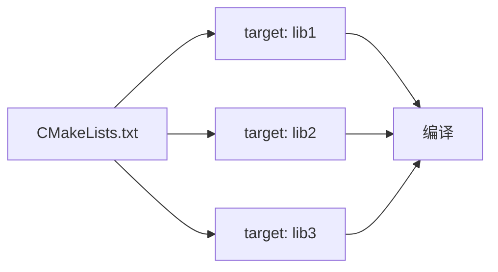
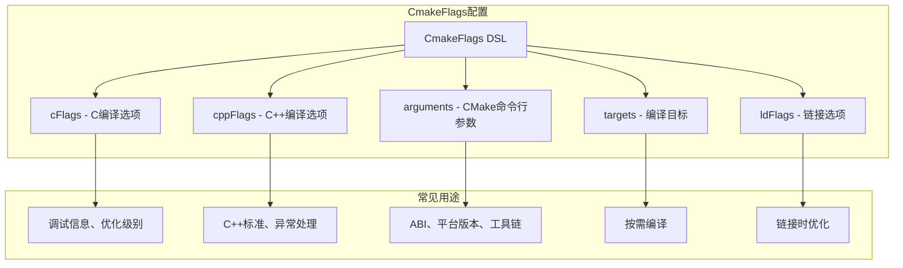

# 21.1.100 CmakeFlags

星空如瀑。

帐篷的纱窗掀开着，让夜晚的凉风能透进来。洛芙跪坐在睡袋上，手肘撑在膝盖上，托着腮帮子。帐篷顶是透明的夜视天窗，星星一颗一颗地冒出来，像是有人在看不见的地方逐渐点亮一盏盏小灯。

“今天的星星真漂亮啊。”伊莎靠在抱枕上，眯着眼睛看天。

“在想什么呢？”希尔已经从背包里掏出了笔记本，屏幕的光映在她脸上。

洛芙犹豫了一下：“我在想……我们今天学了CMake，那这个CMake怎么控制编译过程呢？比如我想让编译器优化一点，或者加一些调试信息之类的？”

黛琳正在整理数据线，听到这话手上动作停了停：“你问到点子上了。”

“怎么说？”洛芙眼睛亮了一下。

“CMake有各种**标志**可以配置，”黛琳把数据线卷好，“就像露营时有不同的装备配置——根据不同的场景选不同的装备。编译也是一样的，不同的编译选项会产出不同的结果。”

“比如呢？”洛芙好奇地问。

“比如你想加调试信息，”希尔接过话头，“或者想指定用哪个CPU架构优化，又或者想定义一些编译时的宏……”

“听起来好复杂。”洛芙缩了缩脖子。

“其实有固定的套路，”黛琳安慰她，“Android Gradle插件提供了一套DSL来配置这些，我们今天就来看看。”

---

### 什么是CmakeFlags

黛琳在白板上写下几个大字：CmakeFlags。

“这个是Android Gradle插件提供的，专门用来配置CMake的各种编译参数。”黛琳解释。

洛芙探头去看黛琳的手机屏幕：“那……都有哪些可以配置的呢？”

“有很多，”黛琳滑动页面，“比如常见的有：cFlags是C语言的编译选项，cppFlags是C++的，arguments是传给CMake的命令行参数，targets是指定要编译哪些目标……”

“慢点慢点……”洛芙有点晕，“能不能举个例子？”

希尔把笔记本转过来：“比如，我们要给C++代码加一些编译选项，可以这样写：”

```kotlin
android {
    externalNativeBuild {
        cmake {
            cFlags += listOf("-O3", "-fvisibility=hidden")
            cppFlags += listOf("-std=c++17", "-fno-exceptions")
        }
    }
}
```

“哇……”洛芙盯着屏幕，“这看起来好像gradle的语法啊？”

“对，”黛琳点点头，“这就是CMakeFlags DSL，用Gradle的语法来配置CMake的选项。”

伊莎插话道：“就像露营时带的装备清单，列得越详细，准备得越充分。”

洛芙似懂非懂地点点头：“那这些选项都分别是什么意思呢？”

---

### 常见编译标志详解

希尔打开了CMake的官方文档：“我们一个个来说。”

“首先是**cFlags**和**cppFlags**，”希尔解释，“这两个分别用于C和C++的编译选项。”

“那它们有什么区别？”洛芙问。

“简单说，cFlags管.c文件，cppFlags管.cpp和.cc文件，”黛琳补充，“但大多数情况下我们会用cppFlags，因为Android原生代码基本都用C++。”

洛芙点点头：“那刚才的-O3是什么意思？”

“优化级别，”希尔说，“O3是最高级别的优化。常见的优化级别有：O0是不优化，方便调试；O2是标准优化；O3是激进优化，会尽量提升性能，但可能增加二进制体积。”

“那……什么时候用哪个？”洛芙又问。

“debug版本用O0，release版本用O2或O3，”黛琳解释，“我们在build.gradle里可以针对不同的buildType配置不同的标志。”

洛芙想起什么：“对了，刚才还有一个-fvisibility=hidden，那个又是什么？”

“符号可见性，”希尔说，“加上这个选项后，所有符号默认都是隐藏的，只有显式标记导出的才会在库里可见。这可以减小二进制体积，也能避免符号冲突。”

黛琳补充：“就像露营时把东西收进收纳箱，只有需要用的才拿出来，不用的就藏着。”

“原来如此！”洛芙恍然道。

---

### arguments参数

“除了cFlags和cppFlags，还有个更强大的**arguments**，”黛琳切换到下一页，“这个可以直接传命令行参数给CMake。”

“会更灵活吗？”洛芙问。

“会，”黛琳点点头，“比如我们要指定目标ABI，或者设置一些CMake特有的变量，可以用arguments。”

希尔敲了一段代码：

```kotlin
android {
    externalNativeBuild {
        cmake {
            arguments += listOf(
                "-DANDROID_ABI=arm64-v8a",
                "-DANDROID_PLATFORM=android-24",
                "-DCMAKE_BUILD_TYPE=Release",
                "-DANDROID_TOOLCHAIN=clang"
            )
        }
    }
}
```

“这些又是什么？”洛芙问。

“ANDROID_ABI指定目标架构，”黛琳一个个解释，“ANDROID_PLATFORM指定最低Android版本，CMAKE_BUILD_TYPE是CMake的构建类型，ANDROID_TOOLCHAIN指定用哪个工具链。”

“clang又是什么？”洛芙捕捉到一个新词。

“clang是LLVM系列的C/C++编译器，”希尔说，“Android NDK默认使用clang，比gcc更新更高效。”

洛芙似懂非懂地点点头：“那……这些参数和cFlags有什么区别？”

“arguments更底层一些，”黛琳解释，“cFlags最终也会转换成命令行参数，但arguments可以直接控制CMake的行为，比如指定平台版本、工具链之类的。”

---

### targets指定编译目标

“还有个很有用的**targets**，”黛琳又说，“可以指定只编译某些目标。”

“什么意思？”洛芙问。

黛琳画了一张图来说明：



“你看，一个CMake项目里可能有多个target，”黛琳解释，“但有时候我们只想编译其中某个。”

“如果我只改了lib2，那只编译lib2会快很多。”希尔补充。

洛芙明白了：“就像我们露营时，如果只准备了烤肉，那就只点火就行了，不用把整个营地的灯都打开。”

“Exactly！”希尔打了个响指，“用targets可以节省构建时间。”

---

### 实战：配置调试标志

“现在我们来做个练习，”黛琳说，“我们来配置一套调试用的编译标志。”

洛芙来劲了：“好呀！”

希尔打开项目结构：“首先，debug版本我们需要：开调试信息，不优化，方便gdb调试。”

```kotlin
android {
    buildTypes {
        debug {
            externalNativeBuild {
                cmake {
                    cFlags += listOf("-g", "-O0", "-DDEBUG")
                    cppFlags += listOf("-g", "-O0", "-DDEBUG")
                    arguments += listOf(
                        "-DCMAKE_BUILD_TYPE=Debug",
                        "-DANDROID_TOOLCHAIN=clang"
                    )
                }
            }
        }
    }
}
```

“这些标志分别是啥？”洛芙问。

黛琳一个个解释：

- **-g**：生成调试信息（行号、变量名等）
- **-O0**：不优化，保持代码和源代码一一对应，方便调试
- **-DDEBUG**：定义一个宏，代码里可以用#ifdef DEBUG来判断是否是调试版本
- **CMAKE_BUILD_TYPE=Debug**：告诉CMake这是调试构建

“原来如此！”洛芙点头，“那release版本呢？”

---

### 实战：配置发布标志

“release版本我们要追求性能和体积优化，”黛琳切换到release配置，“同时要去掉调试信息。”

```kotlin
android {
    buildTypes {
        release {
            externalNativeBuild {
                cmake {
                    cppFlags += listOf(
                        "-O3",
                        "-fvisibility=hidden",
                        "-fdata-sections",
                        "-ffunction-sections"
                    )
                    arguments += listOf(
                        "-DCMAKE_BUILD_TYPE=Release",
                        "-DCMAKE_CXX_FLAGS=-flto"
                    )
                    // 链接时优化
                    ldFlags += listOf("-Wl,--gc-sections", "-flto")
                }
            }
        }
    }
}
```

洛芙盯着屏幕：“又是-O3……还有一堆奇怪的选项。”

希尔解释道：

- **-O3**：最高级别优化
- **-fvisibility=hidden**：隐藏符号，减小体积
- **-fdata-sections -ffunction-sections**：每个数据/函数放到单独section，方便链接时丢弃
- **-Wl,--gc-sections**：链接时丢弃未使用的section
- **-flto**：链接时优化，跨编译单元优化代码

“听起来好复杂……”洛芙吐了吐舌头。

“其实不用全记住，”黛琳安慰她，“记住几个常用的就行：调试用-O0 -g，发布用-O3 -flto。其他的用到再查。”

---

### 反模式：把所有标志堆在一起

“接下来我们看看常见的错误，”黛琳表情严肃起来，“有些同学喜欢把所有标志堆在一起。”

“什么意思？”洛芙问。

黛琳展示了一段代码：

```kotlin
// ❌ 反模式：把调试和发布标志混在一起
android {
    externalNativeBuild {
        cmake {
            cFlags += listOf("-g", "-O3", "-O0", "-DDEBUG", "-DNDEBUG")
            // 到底哪个生效？鬼知道！
        }
    }
}
```

“哇，这会怎么样？”洛芙问。

“后写的会覆盖前面的，”希尔说，“而且-O0和-O3同时存在，编译器会蒙圈，最后用哪个不一定。”

“那怎么改？”洛芙问。

黛琳展示了正确做法：

```kotlin
// ✅ 正确做法：按buildType分开配置
android {
    buildTypes {
        debug {
            externalNativeBuild {
                cmake {
                    cppFlags += listOf("-g", "-O0", "-DDEBUG")
                    arguments += listOf("-DCMAKE_BUILD_TYPE=Debug")
                }
            }
        }
        release {
            externalNativeBuild {
                cmake {
                    cppFlags += listOf("-O3", "-DNDEBUG")
                    arguments += listOf("-DCMAKE_BUILD_TYPE=Release")
                }
            }
        }
    }
}
```

洛芙点头：“原来如此，要分开管理。”

“而且标志最好用cppFlags而不是混用cFlags，”希尔补充，“因为Android原生代码基本是C++。”

---

### 另一个常见错误：arguments写法错误

“还有一种常见错误，”黛琳又说，“arguments的写法不对。”

“怎么写？”洛芙问。

黛琳展示了错误和正确写法对比：

```kotlin
// ❌ 错误写法：用了cFlags的语法
arguments += "-DANDROID_ABI=arm64-v8a"

// ✅ 正确写法：作为list的元素
arguments += listOf("-DANDROID_ABI=arm64-v8a")

// ❌ 错误写法：忘了加-D前缀
arguments += listOf("ANDROID_ABI=arm64-v8a")

// ✅ 正确写法：CMake变量必须加-D
arguments += listOf("-DANDROID_ABI=arm64-v8a")
```

“原来要加-D……”洛芙记了下来。

“这些CMake的变量都必须加-D才能传进去，”黛琳解释，“这是CMake的语法规定。”

---

### 动态配置：根据ABI选择标志

“有时候我们想根据不同的ABI配置不同的标志，”黛琳又说，“比如有的CPU架构需要特殊的优化。”

“有意思！”洛芙来了兴趣，“怎么做？”

希尔展示了代码：

```kotlin
android {
    defaultConfig {
        ndk {
            abiFilters += listOf("armeabi-v7a", "arm64-v8a", "x86", "x86_64")
        }
    }
}

// 然后在arguments里根据ABI动态配置
android.defaultConfig.externalNativeBuild {
    cmake {
        arguments += listOf(
            "-DANDROID_ABI=${abiFilter.get()}",
            "-DCMAKE_CXX_FLAGS=-march=${archFlag}"
        )
    }
}

// 这里的archFlag需要根据ABI动态生成
fun getArchFlag(abi: String): String = when (abi) {
    "armeabi-v7a" -> "armv7-a"
    "arm64-v8a" -> "armv8-a"
    "x86" -> "i686"
    "x86_64" -> "x86-64"
    else -> "armv8-a"
}
```

“好复杂……”洛芙感叹。

“其实大多数情况下不需要这么复杂，”黛琳安慰她，“NDK默认的优化已经够好了。我们今天学的这些主要是让你理解原理，真的需要时才去深入。”

---

### 完整配置示例

“最后，我们来看一个完整的配置示例，”黛琳展示了一个真实项目的配置：

```kotlin
android {
    defaultConfig {
        ndk {
            abiFilters += listOf("armeabi-v7a", "arm64-v8a", "x86", "x86_64")
        }
    }

    externalNativeBuild {
        cmake {
            path = file("src/main/cpp/CMakeLists.txt")
            version = "3.18.1"

            // 通用标志
            cppFlags += listOf(
                "-std=c++17",
                "-fvisibility=hidden",
                "-fno-exceptions"
            )

            // 默认参数
            arguments += listOf(
                "-DANDROID_PLATFORM=android-24",
                "-DANDROID_TOOLCHAIN=clang",
                "-DCMAKE_CXX_FLAGS=-stdlib=libc++"
            )
        }
    }

    buildTypes {
        debug {
            externalNativeBuild {
                cmake {
                    cppFlags += listOf("-g", "-O0", "-DDEBUG")
                    arguments += listOf("-DCMAKE_BUILD_TYPE=Debug")
                }
            }
        }
        release {
            externalNativeBuild {
                cmake {
                    cppFlags += listOf("-O3", "-fdata-sections", "-ffunction-sections")
                    arguments += listOf(
                        "-DCMAKE_BUILD_TYPE=Release",
                        "-DCMAKE_CXX_FLAGS=-flto"
                    )
                    ldFlags += listOf("-Wl,--gc-sections", "-flto")
                }
            }
        }
    }
}
```

洛芙从头到尾看了一遍：“原来一套配置里有这么多道道……”

“刚开始不需要全记住，”黛琳说，“会用到的查文档就行。重要的是理解原理，知道每个部分是干什么的。”

---

### 洛芙的思考

帐篷外的蛙鸣声一阵阵地传来，洛芙双手抱膝，望着帐篷顶的星空。

“所以CMakeFlags就是控制编译过程的各种开关？”洛芙总结道。

“对，”黛琳点点头，“cFlags管C代码，cppFlags管C++代码，arguments是传给CMake的参数，targets可以指定只编译某些目标。”

“那调试用-O0 -g，发布用-O3 -flto？”洛芙问。

“记住了！”希尔朝她竖了个大拇指。

洛芙笑了：“感觉又掌握了一个神器。”

伊莎轻声说：“就像露营装备，根据不同场景选不同的配置。”

洛芙看着帐篷外的星空，夜风轻拂，蛙鸣阵阵，心里充满了成就感。

---

> 专业技术总结

## CmakeFlags 定义

CmakeFlags 是 Android Gradle 插件提供的 DSL，用于配置 CMake 构建过程中的各种编译参数和选项，包括 C/C++ 编译选项、链接选项、CMake 变量等。

---

#### 结构图



---

#### 复杂度与影响

- **配置复杂度**：中等，需要理解 C/C++ 编译流程和 CMake 基础
- **构建时间影响**：合理使用 flags 可以显著优化构建速度和二进制体积
- **运行时性能影响**：-O3 相比 -O0 可提升 10-30% 性能，但增加二进制体积

---

#### 反模式与陷阱

1. **调试发布标志混用**：同时使用 -O0 和 -O3，后面的会覆盖前面的，行为不确定
   - 修复：按 buildTypes 分开配置，用 CMake 的 CMAKE_BUILD_TYPE 变量

2. **arguments 缺少 -D 前缀**：CMake 变量必须加 -D 前缀，否则会被忽略
   - 修复：确保每个变量都写成 `-DVARIABLE=value` 格式

3. **ldFlags 位置错误**：ldFlags 需要放在 externalNativeBuild 下的 cmake 配置中
   - 修复：确认放在正确的 DSL 层级

4. **cFlags 和 cppFlags 混用**：Android 原生代码基本是 C++，应优先使用 cppFlags
   - 修复：统一使用 cppFlags，或者只在明确需要时分开用

5. **ABI 过滤与 arguments 不匹配**：abiFilters 指定了ABI，但 arguments 里没有对应配置
   - 修复：确保 ANDROID_ABI 与 abiFilters 一致

---

#### 设计哲学

**配置与构建分离**：通过 DSL 将编译配置与底层构建工具解耦，实现：

1. **统一入口**：用 Gradle 语法统一管理 Android 构建配置
2. **多目标支持**：一套配置支持多个 ABI、多个 buildType
3. **条件编译**：通过宏定义实现 debug/release 差异化代码

**实践建议**：
- 调试版本用 -g -O0 -DDEBUG，发布版本用 -O3 -DNDEBUG -flto
- 使用 cppFlags 而非 cFlags（Android 原生代码是 C++）
- 通过 arguments 配置 CMake 变量（ANDROID_ABI, ANDROID_PLATFORM 等）
- 利用 targets 实现增量编译，只编译改动的目标

---

#### 🏕️ 动手练习

**目标**：掌握 CmakeFlags 的配置方法，能够为不同构建类型配置不同的编译选项。

**项目概览**：为一个包含原生代码的 Android App 配置 debug 和 release 两种构建类型的 CMake 编译标志。

**Task 1：创建原生代码文件**

1. 在 `src/main/cpp/` 目录下创建 `native-lib.cpp`：
   ```cpp
   #include <jni.h>
   #include <string>

   extern "C" JNIEXPORT jstring JNICALL
   Java_com_example_myapp_MainActivity_stringFromJNI(JNIEnv* env, jclass clazz) {
   #ifdef DEBUG
       // 调试版本返回这个
       return env->NewStringUTF("Hello from DEBUG build!");
   #else
       // 发布版本返回这个
       return env->NewStringUTF("Hello from RELEASE build!");
   #endif
   }
   ```

2. 创建 `CMakeLists.txt`：
   ```cmake
   cmake_minimum_required(VERSION 3.18.1)
   project("myapp")
   add_library(native-lib SHARED native-lib.cpp)
   find_library(log-lib log)
   target_link_libraries(native-lib ${log-lib})
   ```

**Task 2：配置 CmakeFlags**

在 `build.gradle` (app) 中添加 CMake 配置：

```kotlin
android {
    // ... 其他配置

    defaultConfig {
        ndk {
            abiFilters += listOf("arm64-v8a")
        }
    }

    externalNativeBuild {
        cmake {
            path = file("src/main/cpp/CMakeLists.txt")
            version = "3.18.1"

            // 通用 C++ 编译选项
            cppFlags += listOf(
                "-std=c++17",
                "-fvisibility=hidden"
            )

            // CMake 参数
            arguments += listOf(
                "-DANDROID_PLATFORM=android-24",
                "-DANDROID_TOOLCHAIN=clang"
            )
        }
    }

    buildTypes {
        debug {
            externalNativeBuild {
                cmake {
                    cppFlags += listOf("-g", "-O0", "-DDEBUG")
                    arguments += listOf("-DCMAKE_BUILD_TYPE=Debug")
                }
            }
        }
        release {
            externalNativeBuild {
                cmake {
                    cppFlags += listOf("-O3")
                    arguments += listOf(
                        "-DCMAKE_BUILD_TYPE=Release",
                        "-DCMAKE_CXX_FLAGS=-flto"
                    )
                    ldFlags += listOf("-flto")
                }
            }
        }
    }
}
```

**Task 3：验证配置**

1. 编译 debug 版本，在 Logcat 或 UI 上查看返回的字符串是否为 "Hello from DEBUG build!"
2. 编译 release 版本，验证返回 "Hello from RELEASE build!"
3. 尝试修改 -O0 为 -O3，观察构建输出的变化

**验收标准**：

- [ ] debug 构建输出显示 "DEBUG" 版本信息
- [ ] release 构建输出显示 "RELEASE" 版本信息
- [ ] CMake 配置语法正确，Gradle 同步无报错
- [ ] 能够正常安装和运行生成的 APK

**提示**：

- cppFlags 用 `+=` 追加，不会覆盖通用配置
- CMAKE_BUILD_TYPE 会自动传给 CMake，控制优化级别
- JNI 函数命名格式：`Java_${package}_${class}_${method}`

---

#### 参考实现要点

1. **优先使用 cppFlags**：Android 原生代码基本是 C++，统一用 cppFlags 可以避免混淆
2. **利用 buildTypes 分开配置**：debug 和 release 需要不同的优化级别和调试信息
3. **CMake 变量用 arguments 传递**：所有 CMake 变量（-D 开头）通过 arguments 传递
4. **ldFlags 需要放在 cmake 块内**：链接选项的位置很重要，要放在 externalNativeBuild.cmake 下
5. **ABI 过滤与 CMake 参数匹配**：abiFilters 要和 arguments 里的 ANDROID_ABI 对应

---

> 学习建议

本章学习了 CmakeFlags 的配置方法，重点是理解 cFlags/cppFlags/arguments/ldFlags 的区别和用途。记住调试用 -O0 -g，发布用 -O3 -flto，其他用到再查。实践中建议先从简单的配置开始，逐步增加复杂度。

---

## 洛芙的小小日记本

今天学会了给 CMake 加"开关"！就像露营时要根据天气选装备一样，编译时也要根据场景选配置。调试就开 -O0 -g，发布就开 -O3 -flto，很简单！还要注意 cFlags 和 cppFlags 的区别，以及 arguments 要加 -D 前缀。好累，但是好满足呀~ 🌙

---

## 今日关键词

- **CmakeFlags**：Android Gradle 插件提供的 DSL，用于配置 CMake 编译参数
- **cFlags**：C 语言编译选项，用于 .c 文件
- **cppFlags**：C++ 编译选项，用于 .cpp/.cc 文件
- **arguments**：传给 CMake 的命令行参数，用于配置 CMake 变量
- **ldFlags**：链接器选项，控制链接过程
- **targets**：指定要编译的目标
- **-O0 / -O2 / -O3**：编译优化级别，-O0 不优化，-O3 最高优化
- **-g**：生成调试信息
- **-D**：定义宏或传递 CMake 变量（如 -DDEBUG）
- **CMAKE_BUILD_TYPE**：CMake 变量，指定构建类型（Debug/Release）
- **-fvisibility=hidden**：隐藏符号，减少二进制体积
- **-flto**：链接时优化，提升性能
- **-Wl,--gc-sections**：链接时丢弃未使用代码
- **clang**：LLVM 系列的 C/C++ 编译器，Android NDK 默认使用
- **ABI**：Application Binary Interface，应用二进制接口
- **NDK**：Native Development Kit，安卓原生开发工具包
