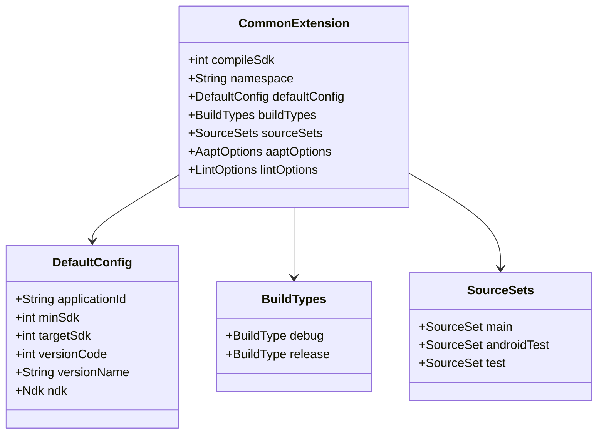

# 21.1.101 CommonExtension

星空如瀑。

帐篷的纱窗掀开着，让夜晚的凉风能透进来。洛芙跪坐在睡袋上，手肘撑在膝盖上，托着腮帮子。帐篷顶是透明的夜视天窗，星星一颗一颗地冒出来，像是有人在看不见的地方逐渐点亮一盏盏小灯。

“在想什么呢？”希尔已经从背包里掏出了笔记本，屏幕的光映在她脸上。

洛芙犹豫了一下：“我在想……我们今天学了CMake，那这个CMake怎么控制编译过程呢？比如我想让编译器优化一点，或者加一些调试信息之类的？”

黛琳正在整理数据线，听到这话手上动作停了停：“你问到点子上了。”

“怎么说？”洛芙眼睛亮了一下。

“CMake有各种标志可以配置，”黛琳把数据线卷好，“就像露营时有不同的装备配置——根据不同的场景选不同的装备。编译也是一样的，不同的编译选项会产出不同的结果。”

“比如呢？”洛芙好奇地问。

“比如你想加调试信息，”希尔接过话头，“或者想指定用哪个CPU架构优化，又或者想定义一些编译时的宏……”

“听起来好复杂。”洛芙缩了缩脖子。

“其实有固定的套路，”黛琳安慰她，“Android Gradle插件提供了一套DSL来配置这些，我们今天就来看看。”

---

### 什么是CommonExtension

黛琳在白板上写下几个大字：CommonExtension。

“这个是Android Gradle插件提供的核心配置接口，”黛琳解释，“所有的Android项目配置都从它开始。”

洛芙探头去看黛琳的手机屏幕：“那……它在哪里呢？”

“在build.gradle文件里，”希尔把笔记本转过来指向屏幕，“你写android {}这个块的时候，其实就是在配置CommonExtension。”

```groovy
android {
    // 这里配置的每一样东西，都属于CommonExtension
    namespace 'com.example.myapp'
    compileSdk 34
    
    defaultConfig {
        applicationId "com.example.myapp"
        minSdk 24
        targetSdk 34
    }
    
    buildTypes {
        release {
            minifyEnabled true
        }
    }
}
```

“哇……”洛芙盯着屏幕，“原来我们一直在用的android {}块，就是CommonExtension？”

“对，”黛琳点点头，“它是所有Android配置的大本营。不管是app模块还是library模块，都从这儿开始。”

伊莎插话道：“就像露营时的大本营，所有装备都从这里出发。”

洛芙似懂非懂地点点头：“那这些配置都分别是什么意思呢？”

---

### compileSdk：编译SDK版本

希尔打开了Android SDK的文档：“我们一个个来说。”

“首先是**compileSdk**，”希尔解释，“这个指定了你用哪个版本的Android SDK来编译。”

“那它和targetSdk有什么区别？”洛芙问。

“compileSdk是编译时用的，决定了你能用哪些API，”黛琳补充，“targetSdk是运行时用的，告诉系统你的app是为哪个版本设计的。”

洛芙歪着头：“也就是说，我可以编译时用新版本的API，但让旧版本的手机也能运行？”

“对，”希尔说，“这就是兼容性。但是编译时用的API不能超过compileSdk指定的版本。”

```kotlin
android {
    // 指定使用Android 34 (API Level 34) 进行编译
    compileSdk = 34
    
    // 运行时目标Android 34
    defaultConfig {
        targetSdk = 34
    }
}
```

洛芙点点头：“那如果我用了更高版本的API会怎样？”

“编译会报错，”黛琳说，“编译器会告诉你这个API是哪个版本才有的。”

---

### namespace：应用的命名空间

“这个是Android Gradle插件 8.0 之后必须配置的，”黛琳在白板上写下namespace。

“以前我们是在AndroidManifest.xml里写packageName，”希尔解释，“现在改成了在build.gradle里配置namespace。”

“那它们是一样的吗？”洛芙问。

“功能上差不多，”黛琳说，“但是namespace更准确，因为它直接关系到你的R资源类和BuildConfig类的包名。”

```kotlin
android {
    // 应用包名，用于生成R.java和BuildConfig类
    namespace 'com.example.myapp'
}
```

伊莎轻声说：“就像每个露营小队都有自己的名字，这个namespace就是给app起名字。”

洛芙笑了：“那这个名字一定要是唯一的吗？”

“对，”黛琳点头，“Google Play和应用市场上，包名必须是唯一的。”

---

### defaultConfig：默认配置块

“这个块包含了你应用的默认配置，”希尔指向屏幕上的defaultConfig。

“它相当于露营时的基础装备，”伊莎打着比方，“不管你是去山里还是湖边，这些基础装备都要带上。”

```kotlin
android {
    defaultConfig {
        // 应用ID，发布到应用市场时的唯一标识
        applicationId = "com.example.myapp"
        
        // 最小支持Android版本
        minSdk = 24
        
        // 目标SDK版本
        targetSdk = 34
        
        // 版本号，每次发布要递增
        versionCode = 1
        
        // 版本名称，用户能看到的版本号
        versionName = "1.0"
        
        // 测试ApplicationId，用于Instrumented测试
        testApplicationId = "com.example.myapp.test"
        
        // 测试版本号
        testVersionCode = 1
        
        // 测试版本名称
        testVersionName = "1.0"
    }
}
```

洛芙看得眼睛都花了：“这么多配置，都要记住吗？”

“不需要全部记住，”黛琳温柔地说，“常用的就这几个：applicationId、minSdk、targetSdk、versionCode、versionName。其余的用到的时候再查。”

---

### buildTypes：构建类型

“这个块定义了不同的构建类型，”希尔继续说，“通常我们有两类：debug和release。”

“debug是调试版本，release是发布版本？”洛芙问。

“对，”黛琳说，“debug版本方便调试，release版本经过优化，适合发布到应用市场。”

```kotlin
android {
    buildTypes {
        // debug构建类型
        debug {
            // 是否启用调试
            isDebuggable = true
            // 是否启用JniLibs压缩
            isJniLibsPackagingEnabled = true
            // 测试构建类型
            isTestCoverageEnabled = false
        }
        
        // release构建类型
        release {
            // 是否启用代码混淆
            isMinifyEnabled = true
            // 是否启用资源压缩
            isShrinkResources = true
            // Proguard规则文件
            proguardFiles(
                getDefaultProguardFile("proguard-android-optimize.txt"),
                "proguard-rules.pro"
            )
        }
    }
}
```

“这两个的区别好大啊。”洛芙感叹。

“对的，”希尔说，“debug版本要方便调试，所以会保留各种信息；release版本要尽可能缩小体积，提高安全性，所以会启用混淆和压缩。”

---

### sourceSets：源码集配置

“这个让你指定不同类型的源文件放在哪里，”黛琳解释sourceSets。

“比如你有一些代码只在测试时用到，或者只在特定构建类型时用到，就可以用sourceSets来管理。”

```kotlin
android {
    sourceSets {
        // 主源码集
        getByName("main") {
            // Java源码目录
            java.srcDirs("src/main/java")
            // Kotlin源码目录
            kotlin.srcDirs("src/main/kotlin")
            // 资源目录
            res.srcDirs("src/main/res")
            // AndroidManifest文件
            manifest.srcFile("src/main/AndroidManifest.xml")
            // JNI库目录
            jniLibs.srcDirs("src/main/jniLibs")
        }
        
        // 测试源码集
        getByName("androidTest") {
            java.srcDirs("src/androidTest/java")
        }
        
        // 单元测试源码集
        getByName("test") {
            java.srcDirs("src/test/java")
        }
    }
}
```

洛芙好奇地问：“那我可以自己定义新的源码集吗？”

“可以，”黛琳说，“比如你想给付费版和免费版分别放不同的代码，就可以创建新的sourceSet。”

---

### aaptOptions：资源压缩选项

“这个用来配置AAPT的资源压缩行为，”希尔解释。

“AAPT是Android Asset Packaging Tool，负责打包资源。”

```kotlin
android {
    aaptOptions {
        // 忽略指定模式的文件
        ignoreAssetsPattern = "!.svn:!.git:!.ds_store:!*.scc:!CVS:!thumbs.db:!picasa.ini:!*~"
        
        // 是否压缩指定扩展名的文件
        noCompress = "foo", "bar"
        
        // 混淆资源文件名
        obfuscate = true
        
        // 额外生成的别名
        additionalParameters = listOf("--rename-manifest-package", "com.new.package")
    }
}
```

“这些一般在发布时才会用到，”黛琳补充，“开发时用默认配置就够了。”

---

### lintOptions：代码检查配置

“这个用来配置Android Lint检查，”希尔指向lintOptions。

“Android Lint是一个静态代码分析工具，能帮你发现潜在的问题。”

```kotlin
android {
    lintOptions {
        // 是否在构建中断言检查错误
        isAbortOnError = false
        
        // 是否检查致命错误
        isCheckReleaseBuilds = true
        
        // 是否生成报告
        isHtmlReport = true
        
        // 报告文件路径
        htmlOutput = file("lint-report.html")
        
        // 是否检查依赖
        isCheckDependencies = true
        
        // 忽略指定错误
        warningsAsErrors = false
        
        // 忽略指定规则的警告
        disable += "HardcodedText"
        disable += " SpannableStringConsumer"
    }
}
```

洛芙吐了吐舌头：“这么多检查规则啊？”

“很多是可选的，”黛琳说，“团队一般会选几个重要的打开，其余的按需开启。”

---

### 完整配置示例

希尔把笔记本转过来，展示一个完整的配置：

```kotlin
android {
    // 编译SDK版本
    compileSdk = 34
    
    // 命名空间
    namespace = "com.example.myapp"
    
    // 默认配置
    defaultConfig {
        applicationId = "com.example.myapp"
        minSdk = 24
        targetSdk = 34
        versionCode = 1
        versionName = "1.0"
        
        testApplicationId = "com.example.myapp.test"
        testVersionCode = 1
        testVersionName = "1.0"
        
        // 支持的ABI（CPU架构）
        ndk {
            abiFilters += listOf("armeabi-v7a", "arm64-v8a", "x86", "x86_64")
        }
    }
    
    // 构建类型
    buildTypes {
        debug {
            isDebuggable = true
            isMinifyEnabled = false
        }
        release {
            isMinifyEnabled = true
            isShrinkResources = true
            proguardFiles(
                getDefaultProguardFile("proguard-android-optimize.txt"),
                "proguard-rules.pro"
            )
        }
    }
    
    // 源码集
    sourceSets {
        getByName("main") {
            java.srcDirs("src/main/java")
            res.srcDirs("src/main/res")
        }
    }
    
    // AAPT选项
    aaptOptions {
        ignoreAssetsPattern = "!.svn:!.git"
    }
    
    // Lint选项
    lintOptions {
        isAbortOnError = false
    }
}
```

“好复杂……”洛芙看完后缩了缩脖子。

“其实不用一次性写完，”黛琳安慰她，“先用最简单的配置，遇到需要的功能再加。”

伊莎轻声说：“就像露营，先把帐篷搭起来睡下，其他的装备可以慢慢添。”

洛芙笑了：“那我们现在的配置算是什么呢？”

“就是一个最基本的配置，”希尔说，“先能让项目跑起来，其他的以后再说。”

---

### 常见配置错误与修复

“来说几个常见的配置错误，”黛琳翻开一页新白板。

“第一个，**namespace和applicationId混用**。”

有些开发者会把packageName写在AndroidManifest里，又在build.gradle里写namespace，结果导致冲突。

```groovy
// 错误写法：AndroidManifest里也有package="com.example.myapp"
android {
    namespace 'com.example.myapp'  // 这会导致冲突
}
```

解决方法：只在一处写，建议在build.gradle里写namespace。

---

“第二个，**minSdk太高或太低**。”

太高会导致很多用户无法安装，太低会导致需要写很多兼容性代码。

```kotlin
// 推荐做法：根据用户分布选择合适的minSdk
android {
    defaultConfig {
        // 大多数应用推荐24或以上
        minSdk = 24
        
        // 某些特性需要更高版本
        // minSdk = 26  // 如果要用Java 8+的API
    }
}
```

---

“第三个，**versionCode没有递增**。”

每次发布新版本，versionCode必须比上次大，否则会无法覆盖安装。

```kotlin
// 错误做法：每次都写1
defaultConfig {
    versionCode = 1  // 第二次发布还是1，会安装失败
}

// 正确做法：每次发布递增
defaultConfig {
    versionCode = 2  // 第二次发布
    versionCode = 3  // 第三次发布
}
```

---

### 动手配置一个小项目

“我们来实际配置一个吧，”希尔兴奋地说。

“目标：创建一个最小的Android项目配置。”

```kotlin
// 步骤1：基础配置
android {
    compileSdk = 34
    namespace = "com.camp.myapp"
}

// 步骤2：默认配置
android {
    defaultConfig {
        applicationId = "com.camp.myapp"
        minSdk = 21
        targetSdk = 34
        versionCode = 1
        versionName = "1.0.0"
    }
}

// 步骤3：构建类型
android {
    buildTypes {
        debug {
            isDebuggable = true
            isMinifyEnabled = false
        }
        release {
            isDebuggable = false
            isMinifyEnabled = true
        }
    }
}
```

“这样就够了吗？”洛芙问。

“够了，”黛琳说，“这就是一个最小的可用配置。”

---

### 配置的继承与覆盖

“在大型项目里，你会发现有些配置是通用的，”黛琳解释。

“比如所有的app模块都用相同的minSdk。”

```groovy
// 在根build.gradle里定义公共配置
ext {
    minSdkVersion = 24
    targetSdkVersion = 34
    compileSdkVersion = 34
}

// 在app/build.gradle里使用
android {
    compileSdk = rootProject.ext.compileSdkVersion
    
    defaultConfig {
        minSdk = rootProject.ext.minSdkVersion
        targetSdk = rootProject.ext.targetSdkVersion
    }
}
```

洛芙点点头：“这样修改一次就好了。”

“对，”希尔说，“大型项目通常会这样集中管理版本号。”

---

夜深了。

洛芙靠在枕头上，看着帐篷顶的星空。远处的蛙鸣声渐渐稀疏下去，像是夏夜的音乐会进入了尾声。

“今天学的这些……”洛芙轻声说，“感觉一下子看到了Android项目的全貌。”

“从配置开始，”黛琳说，“然后才是写代码。”

伊莎打了个哈欠：“就像先搭帐篷，再往里面放东西。”

洛芙笑了：“那我们明天写什么代码呢？”

“不知道，”希尔已经把笔记本收起来了，“但不管写什么，今天的配置知识都会用上。”

“晚安。”洛芙翻了个身，把睡袋裹紧。

帐篷外的星空，依然明亮。

---

## 专业技术总结

**CommonExtension** 是 Android Gradle 插件提供的核心配置接口（ DSL Extension ），是所有 Android 项目 build.gradle 中 `android {}` 代码块的底层类型。它统一管理了编译 SDK 版本、应用命名空间、默认配置、构建类型、源码集等核心构建参数。

#### 结构图



上图展示了 CommonExtension 的主要子配置块及其层级关系。

```mermaid
flowchart TD
    A[开始: 配置 android {}] --> B{选择配置项}
    
    B --> C[compileSdk]
    B --> D[namespace]
    B --> E[defaultConfig]
    B --> F[buildTypes]
    B --> G[sourceSets]
    
    C --> C1[指定编译SDK版本]
    D --> D1[定义应用包名]
    E --> E1[配置应用ID/minSdk/targetSdk等]
    F --> F1[定义debug/release构建]
    G --> G1[指定源码文件位置]
    
    C1 --> H[编译项目]
    D1 --> H
    E1 --> H
    F1 --> H
    G1 --> H
```

上图展示了 CommonExtension 配置项的选择流程，从 android {} 入口开始，根据需要选择不同的配置块。

#### 复杂度与影响

- **compileSdk** 的选择直接影响可用的 API 范围，建议使用最新的稳定版本以获得最佳开发体验
- **minSdk** 决定了应用的潜在用户规模，每降低一个版本号约增加 1-2% 的设备覆盖率，但需要处理更多兼容性代码
- **namespace** 是 AGP 8.0+ 强制要求的配置，与旧版本的 package 属性功能重叠但更加精确

#### 反模式与陷阱

- **namespace 和 package 重复定义**：AndroidManifest.xml 中的 package 属性与 build.gradle 中的 namespace 同时存在会导致冲突。解决方案：只在一处定义，推荐在 build.gradle 中定义 namespace
- **versionCode 未递增**：每次发布必须递增 versionCode，否则无法覆盖安装旧版本
- **minSdk 过低**：设置过低的 minSdk 会导致需要编写大量兼容性代码，增加维护成本。建议根据用户设备分布数据选择合适的 minSdk 值
- **debug 和 release 配置混用**：在 debug 构建中使用 release 的某些配置（如 minifyEnabled）会导致调试困难

#### 设计哲学

- **声明式配置**：Gradle DSL 采用声明式语法，开发者描述"想要什么"而非"如何实现"
- **约定优于配置**：提供合理的默认值，开发者只需配置与默认行为不同的部分
- **层次化结构**：配置项按功能模块化组织（defaultConfig、buildTypes、sourceSets 等），便于理解和维护

#### 🏕️ 动手练习

**Task 1：创建最小可构建项目配置**

目标：验证 Android 项目基本配置是否正确，能够成功编译。

1. 在 Android Studio 中创建新项目（或使用现有项目）
2. 打开 app/build.gradle 文件
3. 确保包含以下最小配置：
   - compileSdk = 34
   - namespace = "com.example.yourapp"
   - minSdk = 21
   - targetSdk = 34

验收标准：
- [ ] sync 成功无错误
- [ ] build 成功生成 APK

**Task 2：配置多 ABI 支持**

目标：了解不同 CPU 架构的配置方式。

1. 在 defaultConfig 块中添加 ndk.abiFilters 配置
2. 只保留 "arm64-v8a" 和 "x86_64" 两个 ABI
3. 观察 APK 体积变化

验收标准：
- [ ] 配置后项目能正常编译
- [ ] 观察 APK 中 lib 目录的架构数量变化

提示代码：
```kotlin
ndk {
    abiFilters += listOf("arm64-v8a", "x86_64")
}
```

**Task 3：配置构建类型差异**

目标：理解 debug 和 release 构建类型的区别。

1. 在 buildTypes 中为 debug 添加 isDebuggable = true
2. 为 release 添加 isMinifyEnabled = true
3. 分别构建两种类型，观察输出差异

验收标准：
- [ ] debug 构建可直接安装到设备
- [ ] release 构建启用代码混淆

提示代码：
```kotlin
buildTypes {
    debug {
        isDebuggable = true
    }
    release {
        isMinifyEnabled = true
    }
}
```

#### 面试热身

- Q1: 请解释 compileSdk、targetSdk、minSdk 三者的区别与关系
- Q2: 为什么 namespace 是 AGP 8.0+ 强制要求的？
- Q3: versionCode 和 versionName 有什么区别？
- Q4: 如何在多模块项目中统一管理 SDK 版本号？
- Q5: buildTypes 和 productFlavors 有什么区别？

#### 参考实现要点

- 推荐在根 build.gradle 中集中管理 SDK 版本号，便于多模块项目统一升级
- minSdk 的选择应基于真实的用户设备分布数据，而非主观判断
- release 构建必须配置 ProGuard 或 R8 规则文件，以启用代码混淆和压缩
- namespace 必须与 Google Play 后台的应用包名一致，否则会导致发布失败

---

> 学习建议：CommonExtension是Android Gradle配置的核心，从这里可以扩展到defaultConfig、buildTypes、sourceSets等子配置块。建议先掌握最基础的几个配置项（compileSdk、namespace、minSdk、targetSdk），其他的遇到需要时再查文档。配置项不要一次性写完，而是根据项目需要逐步添加。

---

## 洛芙的小小日记本

今天黛琳教了我Android Gradle的配置！原来我们写的android {}块就是CommonExtension——一个专门用来配置Android项目的DSL扩展。我学会了compileSdk（编译用的SDK版本）、namespace（包名）、defaultConfig（默认配置）、buildTypes（debug和release两种构建类型）……好复杂！但是黛琳说先从最简单的开始，其他以后再慢慢加。晚安~⭐

---

## 今日关键词

- **CommonExtension**：Android Gradle插件提供的核心配置接口，是所有Android项目配置的入口
- **compileSdk**：编译时使用的Android SDK版本，决定了能用哪些API
- **targetSdk**：运行时目标版本，告诉系统app是为哪个版本设计的
- **minSdk**：最小支持版本，低于此版本的手机无法安装app
- **namespace**：应用的命名空间，用于生成R类和BuildConfig类的包名
- **applicationId**：应用在设备上的唯一标识，用于区分不同的应用
- **versionCode**：版本号，整数，每次发布必须递增
- **versionName**：版本名称，用户可见的版本字符串
- **defaultConfig**：默认配置块，包含应用的基本配置
- **buildTypes**：构建类型，定义debug和release等不同的构建变体
- **sourceSets**：源码集配置，指定不同类型源文件的位置
- **aaptOptions**：AAPT资源打包工具的配置选项
- **lintOptions**：Android Lint静态代码检查的配置选项
- **ABI**：Application Binary Interface，应用二进制接口，不同的CPU架构需要不同的ABI
