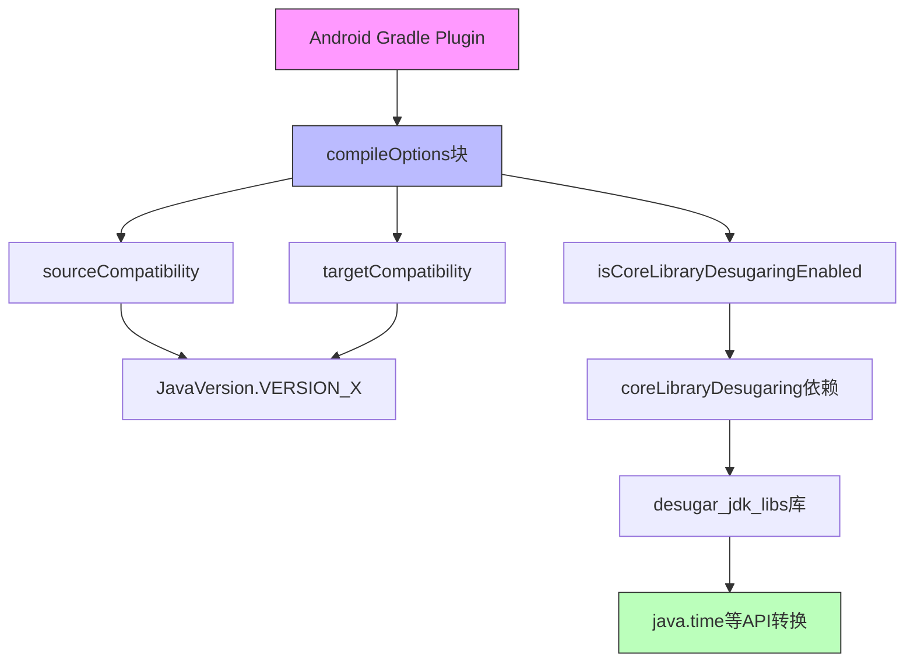

# 21.1.102 编译选项

星空在帐篷顶的透明纱窗上铺展开来，像谁把一把碎钻撒在了深蓝色的天鹅绒上。洛芙翻了个身，支起耳朵听帐篷外的动静——偶尔有鱼跃出水面，发出清脆的"噗通"声。

"黛琳，"洛芙压低声音，怕吵醒已经睡着的伊莎，"昨天说的CMake我好像懂了，那Java代码是怎么编译的？我看build.gradle里有个compileOptions，这又是干嘛的？"

黛琳把笔记本屏幕微微转过来，荧光照在她镜片上："问得好。其实Java和Kotlin的编译选项，和CMake完全是两套系统。CMake管的是C和C++这种'底层语言'，而compileOptions管的是我们写的Kotlin和Java这种'应用层语言'。"

"应用层语言？"洛芙眨眨眼，"那能配置些什么？"

"多着呢，"黛琳点开build.gradle文件，"比如你代码里想用`java.time.LocalDateTime`，但你的minSdk是21——你说会怎样？"

洛芙想了想："报错？找不到这个类？"

"对，"黛琳点头，"因为`java.time`是Java 8才有的API，而API 21的设备根本不支持。这时候就需要'核心库脱糖'——Core Library Desugaring。"

伊莎不知什么时候醒了，揉着眼睛加入讨论："脱糖？我还以为是做甜点那种......"

"此糖非彼糖，"希尔也凑过来，笑嘻嘻地说，"这是'语法糖'的糖——Java不断给开发者减负，加一些更方便的新特性，那些新特性对老版本来说就像'糖'一样'甜'，但老机器吃不了，就得'脱'掉。"

"原来如此！"洛芙恍然大悟，"那怎么配置？"

黛琳调出代码示例：

```kotlin
android {
    compileOptions {
        // 源代码使用的Java版本
        sourceCompatibility JavaVersion.VERSION_17
        // 生成的字节码兼容的Java版本
        targetCompatibility JavaVersion.VERSION_17
        // 启用核心库脱糖
        isCoreLibraryDesugaringEnabled true
    }
    // 添加脱糖库依赖
}

dependencies {
    coreLibraryDesugaring 'com.android.tools:desugar_jdk_libs:2.0.4'
}
```

洛芙盯着屏幕："sourceCompatibility和targetCompatibility，有区别吗？"

"好问题，"黛琳在白板上画了起来，"想象你在写一本给不同年龄段的人看的书——"

"我懂我懂！"伊莎接过话头，"sourceCompatibility就像决定你用什么难度的词汇来写，targetCompatibility就像决定读者的最低阅读能力！"

"不完全对，"黛琳笑着摇头，"sourceCompatibility决定编译器允许你用什么语法特性（比如你可以用lambda表达式），targetCompatibility决定生成的字节码能在哪个版本的JVM上运行。对Android来说，这两个通常设成一样，但原理上可以不同——比如用Java 17的语法写，但让生成的代码兼容Java 8运行。"

洛芙似懂非懂地点头："那......具体能用哪些特性？"

希尔切换到一个API对照表："看这里，Android有个'API级别'和'Java版本'的对应表。minSdk 21对应的是Java 7，minSdk 24对应Java 8。所以——"

"所以如果我想用Java 8的lambda表达式，"洛芙眼睛一亮，"就得把minSdk设为24以上？"

"或者开启核心库脱糖，"黛琳补充道，"这样即使minSdk是21，也能用`java.time`这些Java 8的API。脱糖库会在编译时把新API替换成兼容的实现。"

伊莎好奇地问："脱糖后的代码会很慢吗？"

"这就要看具体API了，"希尔打开一个性能测试示例，"比如`LocalDateTime.now()`，脱糖后其实就是一个普通的类实例化，不会有运行时开销。但有些API比如`CompletableFuture`，会有一定的适配层开销。"

洛芙突然想到一个问题："那如果我用的不是`java.time`，而是其他Java 8或更高版本的API呢？"

"好问题，"黛琳调出一张表格，"Java 8引入了不少新API——Stream、Optional、CompletableFuture、Function接口等等。脱糖库并不是全部支持，它主要支持`java.time`和部分`java.util`下的类。要用完整的Java 8+ API，还是得靠minSdk升级或者Kotlin协程这些方案。"

"我发现一个有趣的现象，"伊莎托着腮帮子说，"就好比露营时带的炊具——新版本的Android就像最新款的便携炉具，功能多，但不是所有人都有。有些老款的炉具也能做熟饭，只是没那么方便。脱糖就像是给老炉具加了转接头，让它能用上新款炉具的部分功能。"

洛芙被这个比喻逗笑了："伊莎姐姐的比喻总是这么形象！"

"对了，"黛琳想起什么，"还有一点要特别注意——开启coreLibraryDesugaring是需要额外加依赖的，而且会增大APK体积，大概200-300KB。"

"这么多？！"洛芙惊呼。

"所以要权衡，"希尔说，"如果你的app本来就不需要`java.time`，没必要为了'万一以后用'就开启脱糖。"

洛芙若有所思："感觉Android开发就是各种权衡啊......"

"没错，"黛琳合上笔记本，"这才是真正考验工程师功力的地方——不是会写代码就行，而是要知道什么时候用什么配置。"

夜风轻轻吹过，帐篷外传来一阵阵蟋蟀的低吟。星空依旧明亮，仿佛在无声地见证着四个女孩的成长。

---

> 学习建议：理解CompileOptions的关键在于明确sourceCompatibility和targetCompatibility的区别，以及coreLibraryDesugaring的工作原理。建议在实际项目中尝试配置不同的Java版本，观察编译结果和APK行为的变化。

## 洛芙的小小日记本

今天学到了compileOptions！原来Java版本和Android API级别是分开的两套体系。黛琳说开启coreLibraryDesugaring就能在低版本上用java.time，但我算了算增加的APK体积......果然工程就是取舍的游戏呀。🌙

---

## 今日关键词

- **CompileOptions**：Android Gradle中配置Java/Kotlin编译选项的DSL对象
- **sourceCompatibility**：指定源代码使用的Java版本，决定可用语法特性
- **targetCompatibility**：指定生成字节码兼容的Java版本，决定最低运行要求
- **coreLibraryDesugaring**：核心库脱糖，允许在低版本Android上使用Java 8+ API
- **JavaVersion**：Gradle中表示Java版本的枚举类，如VERSION_11、VERSION_17
- **desugar_jdk_libs**：Google提供的核心库脱糖实现库
- **minSdk**：应用支持的最低Android API级别
- **API级别**：Android平台的版本号，21对应Android 5.0，24对应Android 7.0
- **字节码**：编译器将源代码编译成的二进制代码，运行在JVM或Dalvik虚拟机上
- **语法糖**：编程语言中让代码更简洁优雅的语法特性

---

# 专业技术总结

*CompileOptions — Android Gradle中配置Java与Kotlin编译行为的DSL接口，决定源代码兼容性和字节码生成目标*

## 结构图



## 复杂度与影响

- **APK体积影响**：启用coreLibraryDesugaring会增加约200-300KB
- **编译时间影响**：脱糖会增加额外的字节码转换步骤
- **运行时性能**：大部分API无额外开销，部分异步API有轻微适配层开销

## 反模式与陷阱

1. **sourceCompatibility和targetCompatibility设置不一致**：可能导致编译时用不了新特性，或运行时找不到字节码
2. **忘记添加coreLibraryDesugaring依赖**：开启isCoreLibraryDesugaringEnabled但未添加依赖会导致编译失败
3. **对所有项目盲目开启脱糖**：不需要java.time等API时开启会无谓增大APK
4. **minSdk已高于所需Java版本却仍开启脱糖**：如minSdk=26时不需要脱糖，浪费APK体积

## 设计哲学

**版本兼容的分层策略**：
- minSdk决定运行环境基线
- compileOptions决定代码可以使用哪些语言特性
- coreLibraryDesugaring作为兼容性补丁，在运行时API缺失时提供软件实现

**实践建议**：
- 优先考虑minSdk升级而非脱糖
- 迁移到Kotlin协程替代CompletableFuture等异步API
- 使用Jetpack库（如java.time的ThreeTenABP）作为脱糖替代方案

## 🏕️ 动手练习

### 基础入门

**Task 1: 配置Java 17编译选项**
- 目标：在项目中配置sourceCompatibility和targetCompatibility为Java 17
- 步骤：在app/build.gradle的android块中添加compileOptions块，设置JavaVersion.VERSION_17
- 验收标准：[ ] build.gradle包含完整的compileOptions配置 [ ] sync后无错误
- 提示：
  ```kotlin
  android {
      compileOptions {
          sourceCompatibility JavaVersion.VERSION_17
          targetCompatibility JavaVersion.VERSION_17
      }
  }
  ```

**Task 2: 体验lambda表达式编译**
- 目标：编写使用lambda的代码，验证sourceCompatibility效果
- 步骤：创建Kotlin文件，使用`list.filter { it > 0 }`语法
- 验收标准：[ ] 代码成功编译 [ ] 生成的APK可在Android 7.0+运行

**Task 3: 启用核心库脱糖**
- 目标：在minSdk=21的项目中启用java.time支持
- 步骤：1. 开启isCoreLibraryDesugaringEnabled 2. 添加coreLibraryDesugaring依赖
- 验收标准：[ ] 配置完整 [ ] 代码中使用LocalDateTime可正常编译

**Task 4: 对比APK体积**
- 目标：比较开启/关闭脱糖时的APK大小差异
- 步骤：分别构建两种配置的debug APK，比较大小
- 验收标准：[ ] 记录两种APK体积 [ ] 分析差异原因

**Task 5: 理解版本对应关系**
- 目标：掌握Android API级别与Java版本的对应
- 步骤：查询官方文档，列出minSdk 21/24/26/34对应的Java版本
- 验收标准：[ ] 正确对应表 [ ] 理解为什么minSdk 24是"Java 8分水岭"

### 进阶推荐

**Task 6: 处理编译错误**
- 目标：解决因Java版本配置导致的编译错误
- 步骤：在高版本语法环境中尝试使用新API，观察错误信息
- 验收标准：[ ] 能识别错误原因 [ ] 给出正确的配置修复

**Task 7: Kotlin-only项目的特殊配置**
- 目标：了解Kotlin项目中的compilerOptions
- 步骤：研究kotlinOptions与compileOptions的区别
- 验收标准：[ ] 理解两种配置的不同作用 [ ] 能正确配置Kotlin编译器

## 参考实现要点

1. **Java版本选择建议**：新项目推荐使用Java 17，兼顾新特性和兼容性
2. **脱糖库的版本**：使用最新稳定版desugar_jdk_libs，2.0.4版本支持Java 17特性
3. **minSdk升级优先**：如果产品允许，优先升级minSdk而非启用脱糖
4. **Kotlin协程替代**：对于异步编程，优先使用Kotlin协程而非CompletableFuture
5. **多模块项目注意**：每个模块的compileOptions独立配置，需按需设置
