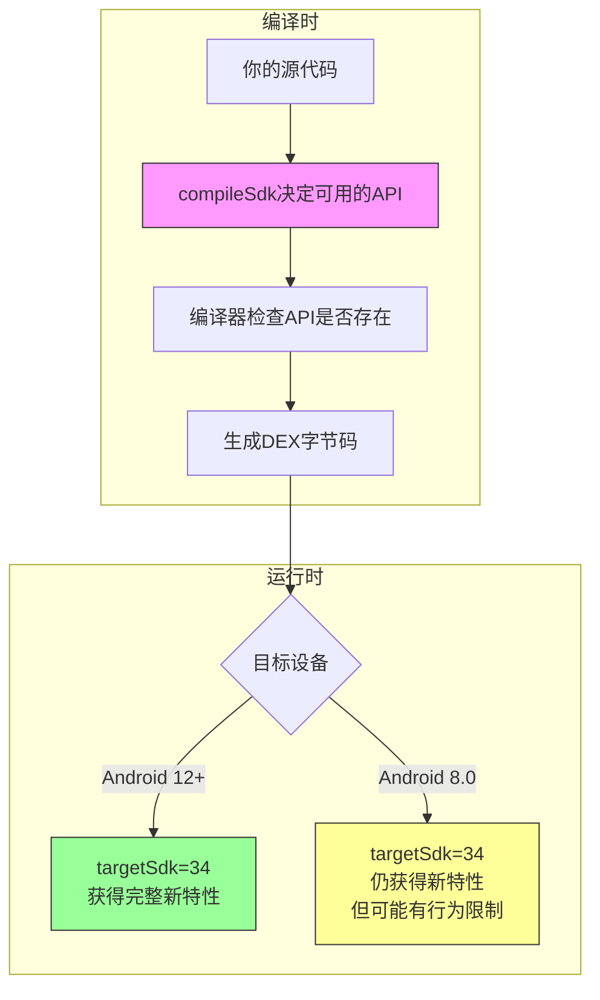
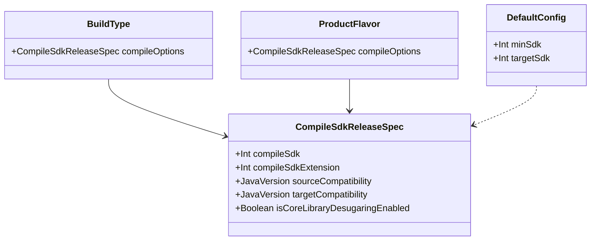

# 21.1.103 编译Sdk发布规范

星空在帐篷顶的透明纱窗上流淌。洛芙仰躺着，脑子里还在回放刚才黛琳讲的那一套Java编译选项——sourceCompatibility啦，targetCompatibility啦，核心库脱糖啦，像一堆闪亮的小石子在脑海里叮当碰撞。

“洛芙，你睡着了吗？”伊莎的声音从旁边传来，轻得像夜风。

“没有呢……”洛芙翻了个身，侧躺着看向黛琳的方向。黛琳正盘腿坐着，笔记本电脑放在折叠桌上，屏幕的光映在她镜片上，“黛琳，我刚才在想一个问题——我们说的这些编译选项，是在哪里配置的呀？总不能每次都敲命令行吧？”

黛琳抬起头，嘴角浮起一丝笑意：“问得好。其实这些都写在build.gradle文件里，有一个专门的对象来管理这些配置——叫CompileSdkReleaseSpec。”

“又是Spec？”洛芙眨眨眼，“上次那个CommonExtension也是Spec，这次也是Spec，Android里有这么多Spec吗？”

“这次不一样的，”黛琳把电脑转过来，指着屏幕上的一段代码说，“CompileSdkReleaseSpec是专门用来配置SDK编译和发布相关选项的。你看——”

```kotlin
android {
    compileSdk = 34
    
    defaultConfig {
        minSdk = 24
        targetSdk = 34
    }
    
    compileOptions {
        sourceCompatibility = JavaVersion.VERSION_17
        targetCompatibility = JavaVersion.VERSION_17
        isCoreLibraryDesugaringEnabled = true
    }
}
```

希尔不知道什么时候也凑了过来，野营椅发出“吱呀”一声响。“这个我熟！compileSdk就是你要编译的SDK版本，targetSdk是目标SDK版本。对吧黛琳？”

“对了一半，”黛琳点点头，又摇摇头，“compileSdk和targetSdk确实都是CompileSdkReleaseSpec的一部分，但它们的作用不太一样。洛芙，你还记得上一章我们说的sourceCompatibility和targetCompatibility吗？”

洛芙想了想：“记得！sourceCompatibility是告诉编译器用哪个版本的Java语法，targetCompatibility是告诉编译器生成的字节码要兼容哪个Java版本……”

“很好，”黛琳赞许地笑了笑，“那么你知道compileSdk、targetSdk和这两个Compatibility之间的关系吗？”

帐篷里安静了一会儿，只有远处的蛙鸣和草虫的低吟。洛芙皱起眉头，嘴唇微微撅起，像在努力理解一个复杂的绳结。

“让我换个说法，”黛琳站起身，从背包里掏出三块不同大小的石头，“假设这是三种不同的Android SDK版本——”

她把最大的石头放在最中间：“这是compileSdk，就像你的‘知识储备上限’。你能调用哪些API，取决于它。”

然后她把中等大小的石头放在旁边：“这是targetSdk，就像你的‘授课对象’。系统会用这个版本来决定你的应用在运行时获得什么样的行为。”

“最后这两个小石头……”她拿起最小的两颗，“sourceCompatibility和targetCompatibility，是你的‘表达能力’和‘理解能力’。你用什么样的语法写代码，你的代码又能被什么样的运行环境理解。”

伊莎轻轻鼓了鼓掌：“这个比喻好美……就像一个人用优雅的语言（sourceCompatibility）写作，但他的读者只能读懂小学水平的文字（targetCompatibility），于是就需要一个翻译（targetSdk的行为适配）。”

“对！”黛琳眼睛一亮，“伊莎这个说法特别贴切。洛芙，你现在理解了吗？”

洛芙点左右，眼睛闪闪发亮：“所以——compileSdk决定我能用什么API，targetSdk决定运行时系统怎么对待我的App，而那两个Compatibility决定我写代码用什么语法、生成的字节码兼容什么环境？”

“完全正确。”黛琳重新坐下，“而且CompileSdkReleaseSpec就是把这一切整合在一起的地方。我们来看它的完整结构——”

```kotlin
androidComponents {
    compileSdk = 34
    
    compileOptions {
        // 源代码兼容的Java版本
        sourceCompatibility = JavaVersion.VERSION_17
        // 字节码目标兼容的Java版本  
        targetCompatibility = JavaVersion.VERSION_17
        // 是否启用核心库脱糖
        isCoreLibraryDesugaringEnabled = true
    }
    
    // Kotlin编译选项
    kotlinOptions {
        jvmTarget = "17"
    }
}
```

“等等，”希尔突然插话，“我有个问题——如果我们把targetSdk设得很高，但compileSdk设得比较低，会怎么样？”

黛琳想了想：“好问题。这就像你请了一个大学生（高targetSdk）来教小学生（低compileSdk能用的API），你会发现——很多高大上的东西你根本用不了，因为compileSdk决定了API的上限。”

“那反过来呢？”洛芙问，“如果compileSdk很高，targetSdk很低？”

“那就是让一个小学生去教大学生，”黛琳笑着说，“理论上你可以用很多新API，但系统会按照旧版本的规则来对待你的App，可能会关闭一些新特性。”

希尔摸着下巴：“所以最佳实践是——compileSdk和targetSdk尽量保持一致？”

“对，这是Google官方推荐的做法。”黛琳点点头，“而且compileSdk应该始终保持最新，这样你才能用到最新的API和工具链。”

一直在旁边安静听着的伊莎突然开口了：“那……如果我想用一些很新的API，但又想兼容旧版本的Android怎么办呢？”

“这就涉及到我们上一章讲的核心库脱糖了，”黛琳看向伊莎，“记得吗？isCoreLibraryDesugaringEnabled = true的时候……”

“记得！”洛芙抢着说，“就是让旧版本的Android也能用新版本才有的Java API！”

“对，”黛琳露出欣慰的笑容，“比如java.time包里的日期时间API，只有Android 8.0以上才能原生使用。但如果你启用了核心库脱糖，低版本系统也能用——它会在编译时把代码转换成低版本也能运行的版本。”

“原来如此！”洛芙兴奋地拍了拍手，“那CompileSdkReleaseSpec就是把所有这些配置——SDK版本、Java版本、是否脱糖——全部管理起来的地方？”

“没错，它就是这样一个‘大管家’。”黛琳总结道，“现在我们来看看它的完整属性列表——”

黛琳在电脑上打开了一个文档页面。

| 属性 | 作用 | 示例值 |
|------|------|--------|
| compileSdk | 编译时使用的SDK版本 | 34 |
| compileSdkExtension | SDK扩展版本 | 1 |
| sourceCompatibility | 源代码Java版本 | VERSION_17 |
| targetCompatibility | 字节码目标Java版本 | VERSION_17 |
| isCoreLibraryDesugaringEnabled | 是否启用核心库脱糖 | true |

“你们看，”黛琳指着表格说，“compileSdkExtension是用来干什么的呢？有些API不在主SDK里，而在SDK的扩展包里——比如某些Google Play Services的API就需要Extension。”

洛芙忽然想到一个问题：“黛琳，我能不能问一下——这些配置是放在buildTypes里面的，还是放在productFlavors里面的？”

“都可以，”黛琳答道，“CompileSdkReleaseSpec实际上是一个可配置的对象，你可以把它放在defaultConfig里，也可以放在具体的buildTypes或productFlavors里。如果放在buildTypes的release里，就只会影响Release构建。”

“这么灵活！”希尔惊叹道，“那如果我想让Debug版本用最新的SDK做一些实验性的东西，而Release版本用稳定版呢？”

“那就可以分别在debug和release里配置不同的compileSdk。”黛琳点头，“不过我建议保持一致，除非有特殊需求。否则可能会出现本地调试通过的代码，发布后反而出问题的奇怪情况。”

洛芙若有所思地点点头：“那……在实际项目中，应该怎么选择这些值呢？”

“这个问题的答案取决于你的目标用户群体。”黛琳认真地说，“Google官方建议——compileSdk始终用最新的稳定版；targetSdk也尽量用最新的，这样能获得最好的系统行为和安全性；但minSdk要根据自己的用户群体来定，如果你的用户大部分还在用Android 7.0，那就把minSdk设为24。”

伊莎轻声补充：“就像露营时要根据大家的体力来规划行程——不能太激进，也不能太保守。”

“对！”黛琳笑了，“而且一旦确定了，就尽量不要频繁变动。每次变动都可能影响用户的体验。”

这时，一直没怎么说话的希尔突然打开了笔记本：“我想到一个实际例子！让我来演示一下错误配置和正确配置的区别——”

她噼里啦地敲了一段代码：

```kotlin
// ❌ 反面教材：错误配置示例
android {
    compileSdk = 30  // 太旧了，用不了新API
    targetSdk = 34   // 但又想让系统用新版本行为对待
    minSdk = 21
    
    compileOptions {
        sourceCompatibility = JavaVersion.VERSION_11
        targetCompatibility = JavaVersion.VERSION_11
        // 忘记启用核心库脱糖，导致无法使用java.time
    }
}
```

“这会导致什么问题呢？”希尔卖了个关子。

洛芙想了想：“compileSdk = 30的话……是不是就不能用Android 11以后的新API了？”

“对，”希尔打了个响指，“而且如果你代码里不小心用了只有Android 12以上才有的API，编译就会报错。同时，targetSdk设为34但compileSdk只有30，有时候会导致一些奇怪的兼容性问题。”

“那正确的配置应该是什么样的？”伊莎问。

希尔又敲了一段：

```kotlin
// ✅ 正面教材：正确配置示例
android {
    compileSdk = 34  // 使用最新稳定版
    
    defaultConfig {
        minSdk = 24   // 根据用户群体决定
        targetSdk = 34 // 与compileSdk保持一致
    }
    
    compileOptions {
        sourceCompatibility = JavaVersion.VERSION_17
        targetCompatibility = JavaVersion.VERSION_17
        isCoreLibraryDesugaringEnabled = true  // 启用核心库脱糖
    }
    
    kotlinOptions {
        jvmTarget = "17"  // Kotlin也要对应配置
    }
}
```

“这样配置的好处是什么？”黛琳问大家。

“第一，compileSdk用最新，能用所有新API；第二，targetSdk和compileSdk一致，避免行为不一致；第三，启用核心库脱糖，可以用新的Java API但兼容旧版本；第四，Kotlin的jvmTarget和Java的targetCompatibility保持一致，不会出幺蛾子。”洛芙一口气说完。

黛琳满意地笑了：“完全正确。看来你真的理解了。”

这时，外面的星空似乎更亮了。洛芙钻出帐篷看了一眼，回来时说：“星星好多啊……对了黛琳，那compileSdkExtension到底什么时候需要用到？”

“问得好，”黛琳重新组织语言，“比如你想用AndroidX的某些库，它们可能需要特定版本的SDK Extension。或者一些厂商特定的API……不过这种情况比较少见的。对于大多数项目来说，不用管compileSdkExtension，用默认值1就够了。”

“我还有个问题，”希尔举手，“compileSdk和targetSdk到底有什么区别？感觉好像差不多啊？”

“这个问题问得好多人都会混淆，”黛琳说，“我画个图解释一下——”



“你们看，”黛琳指着图解释，“compileSdk是编译时的‘法律’——它决定了你能用什么API，编译器会严格检查。而targetSdk是运行时的‘护照’——它告诉系统你想以什么样的身份运行，系统会据此决定给你什么样的待遇。”

“原来如此！”洛芙恍然大悟，“所以compileSdk是给编译器看的，targetSdk是给系统看的！”

“对，就是这个理。”黛琳笑着说，“而且还有一点很重要——如果你在代码里用了某API，但该API是在compileSdk版本才引入的，编译器会报错；但如果该API的minSdk要求比你的minSdk高，你在使用时就需要做版本判断，否则会在低版本手机上崩溃。”

洛芙赶紧记笔记：“所以正确的做法是——先用compileSdk保证代码能编译，然后对使用了高版本API的地方做运行时版本判断？”

“没错！”黛琳打了个响指，“这就是Android开发中非常重要的‘兼容性检查’——Build.VERSION.SDK_INT就是你的好帮手。”

希尔补充道：“我通常会写一个扩展函数来简化这个判断——”

```kotlin
// 希尔常用的版本判断扩展函数
inline fun Int.atLeast(apiLevel: Int, block: () -> Unit) {
    if (this >= apiLevel) {
        block()
    }
}

// 使用示例
fun doSomethingRequiringApi33() {
    Build.VERSION.SDK_INT.atLeast(33) {
        // 只有Android 11及以上才执行的代码
        val notificationManager = getSystemService(NotificationManager::class.java)
        notificationManager.setNotificationBadgeCount(5)
    }
}
```

“这样写确实清晰多了！”洛芙赞叹道。

伊莎微笑着说：“有时候觉得，编程就像露营一样——要做好准备，应对各种情况。提前想好兼容性问题，就像提前查好天气、准备好帐篷一样。”

“对！”黛琳表示赞同，“Android开发更是如此——设备碎片化严重，提前做好兼容准备，能省掉很多后面的麻烦。”

夜渐渐深了。洛芙打了个哈欠，但眼睛里依然闪着光：“黛琳，今天学的这些……感觉比我之前学的任何东西都更有整体感。之前我以为gradle配置就是随便写写的，现在才发现里面有这么多门道。”

“每个看似简单的配置背后，都有它的道理。”黛琳温柔地说，“CompileSdkReleaseSpec就是这样——看起来只是几个数字和选项，但它们决定了你的App能做什么、在什么环境下能跑、用户用起来是什么体验。”

“那明天……”洛芙话没说完又被哈欠打断了。

“明天我们来讲讲构建变体——debug和release的区别，还有如何针对不同渠道做不同配置。”黛琳笑着说，“不过现在，该睡觉了。”

帐篷里的灯被轻轻熄灭。星空依然明亮，像无数双眼睛注视着大地上这几个小小的帐篷。蛙鸣渐渐远去，夜风带着湖畔特有的水汽，轻轻吹拂着帐篷的纱窗。

洛芙闭上眼睛，脑子里还在回放今晚学到的知识——compileSdk是编译时的天花板，targetSdk是运行时的护照，sourceCompatibility和targetCompatibility是语法和字节码的版本，核心库脱糖是让旧手机也能用新API的魔法……

这些概念像星星一样，在她的知识夜空中一颗颗亮起。

---

## 专业技术总结

> CompileSdkReleaseSpec -- Android Gradle DSL中用于配置SDK编译和发布相关选项的规范对象，包含了compileSdk、targetSdk、sourceCompatibility、targetCompatibility以及核心库脱糖等关键配置项。

#### 结构图



#### 反模式与陷阱

- **compileSdk和targetSdk不一致**：编译和运行行为不匹配，可能导致难以排查的奇怪问题
- **compileSdk过旧**：无法使用新版API，限制了开发能力
- **忘记启用核心库脱糖**：在低版本Android上使用java.time等新API会崩溃
- **sourceCompatibility和targetCompatibility不匹配**：可能导致字节码兼容性问题
- **minSdk设得太高**：排除大量潜在用户；设得太低则需要更多兼容性代码

#### 设计哲学

Android的SDK版本配置体系体现了以下设计思想：

1. **编译与运行分离** -- compileSdk和targetSdk的分离使得开发者可以在编译时使用最新API，同时控制运行时的系统行为
2. **渐进式兼容** -- minSdk允许应用逐步覆盖更多设备，coreLibraryDesugaring让新API也能在旧设备上运行
3. **显式优于隐式** -- 每个版本配置都需要开发者明确指定，避免默认行为带来的意外

#### 动手练习

**项目目标**：创建一个具有完整SDK版本配置的Android项目

**Task 1：创建项目并配置基础SDK版本**
- 目标：理解compileSdk、minSdk、targetSdk的基本配置
- 操作：在build.gradle中设置compileSdk=34, minSdk=24, targetSdk=34
- 验收标准：`[ ]` 项目能成功编译 `[ ]` build.gradle中能看到这三个配置项

**Task 2：配置Java编译选项**
- 目标：掌握sourceCompatibility和targetCompatibility的设置
- 操作：在compileOptions块中设置sourceCompatibility和targetCompatibility为VERSION_17
- 验收标准：`[ ]` 配置正确 `[ ]` 尝试修改为VERSION_11观察变化

**Task 3：启用核心库脱糖**
- 目标：理解核心库脱糖的原理和配置方法
- 操作：添加coreLibraryDesugaring依赖，启用isCoreLibraryDesugaringEnabled=true
- 验收标准：`[ ]` 配置启用成功 `[ ]` 在低版本API中使用java.time包而不报错

**Task 4：添加Kotlin JVM目标配置**
- 目标：理解kotlinOptions和compileOptions的对应关系
- 操作：设置kotlinOptions的jvmTarget = "17"
- 验收标准：`[ ]` 配置正确 `[ ]` 与Java的targetCompatibility保持一致

**Task 5：创建版本兼容工具类**
- 目标：实践SDK版本判断的实际应用
- 操作：创建一个扩展函数，根据SDK版本执行不同代码
- 验收标准：`[ ]` 工具类可编译 `[ ]` 在Activity中成功调用

**Task 6：对比错误配置与正确配置**
- 目标：加深对SDK配置的理解
- 操作：故意设置错误的compileSdk和targetSdk组合，观察编译错误
- 验收标准：`[ ]` 能描述错误配置导致的问题 `[ ]` 给出正确配置的说明

#### 面试热身

1. 请解释compileSdk、targetSdk和minSdk的区别和作用
2. 如果compileSdk大于targetSdk，会发生什么？
3. 核心库脱糖是什么？什么场景下需要启用它？
4. sourceCompatibility和targetCompatibility分别控制什么？
5. 如何在运行时判断Android版本并执行不同代码？

#### 参考实现要点

1. compileSdk始终使用最新稳定版，以获得最新API和工具链支持
2. targetSdk应与compileSdk保持一致，避免行为不一致
3. minSdk根据目标用户群体决定，平衡覆盖率和开发成本
4. 启用coreLibraryDesugaring后，记得添加对应的依赖库
5. Kotlin的jvmTarget应与Java的targetCompatibility保持一致
6. 使用Build.VERSION.SDK_INT进行运行时版本判断

> 露营时选择合适的装备很重要——选错了装备会让旅程变得艰难，但选对了装备，就能轻松享受星空和美景。SDK版本配置也是一样的道理，选对了配置，你的App就能在各种设备上流畅运行。

---

## 洛芙的小小日记本

今晚黛琳讲得太好了！原来compileSdk、targetSdk、minSdk各有各的用处，就像露营时的背包、帐篷和睡袋——缺一不可。我以前总觉得这些配置随便写写就行，现在才知道每个数字背后都有讲究。明天要学构建变体了，期待！

---

## 今日关键词

- **CompileSdkReleaseSpec**：Android Gradle DSL中管理SDK编译和发布配置的对象，包含compileSdk、编译选项等
- **compileSdk**：编译时使用的SDK版本号，决定可用API的上限
- **targetSdk**：目标SDK版本号，告诉系统如何对待App的行为
- **minSdk**：最低支持SDK版本号，决定App能覆盖的设备范围
- **sourceCompatibility**：源代码Java版本兼容性，控制能使用的语法
- **targetCompatibility**：字节码目标Java版本，控制生成的字节码兼容的JVM版本
- **核心库脱糖（Core Library Desugaring）**：让低版本Android也能使用高版本Java API的技术
- **SDK Extension**：SDK的扩展包，提供额外的API
- **JavaVersion**：Gradle中表示Java版本的枚举类
- **kotlinOptions**：Kotlin编译选项配置块
- **jvmTarget**：Kotlin编译器的JVM目标版本
- **Build.VERSION.SDK_INT**：运行时获取Android系统版本的整数
