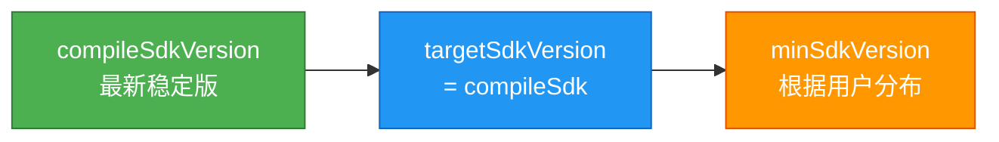
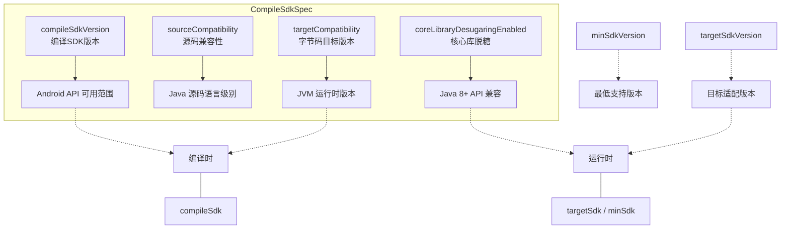

# 21.1.104 编译SDK规范

星空像撒在了帐篷顶上的银砂，帐篷里暖黄色的露营灯把四个女孩子的影子投在帆布上，随着灯火的轻摇微微晃动。洛芙把笔记本放在膝盖上，屏幕上还停留在上一章黛琳给她展示的CompileOptions配置界面。

“刚才那个sourceCompatibility和targetCompatibility，我好像有点明白了，”洛芙托着下巴，手指无意识地在触控板上划拉着，“但是黛琳，我看到build.gradle里还有compileSdkVersion什么的，这个和Compatibility设置是什么关系呀？”

黛琳把额前的一缕头发别到耳后，露出一个“就知道你会问”的微笑。她从背包里翻出一个蓝色的文件夹——上面印着Android的绿色机器人logo。

“你这个问题问得好。其实CompileOptions只是CompileSdkSpec的一部分，”黛琳把文件夹打开，里面是一张折叠的架构图，“来，我们今天就来看看这个CompileSdkSpec到底是个什么东西。”

伊莎凑过去看了一眼图，上面画着层层叠叠的方块，最顶层写着"CompileSdkSpec"，下面分支出compileSdkVersion、sourceCompatibility、targetCompatibility、coreLibraryDesugaringEnabled等等。

“好像一棵倒长的树，”伊莎眨眨眼，“根是SDK版本，枝干是各种兼容性和脱糖选项。”

“比喻得不错，”黛琳点点头，“简单来说，CompileSdkSpec就是Android Gradle Plugin里用来定义'我们用什么版本的Android API来编译这个项目'的规则集合。它比单纯的compileSdkVersion要全面得多。”

希尔已经把电脑转了过来，屏幕上是一个标准的android {}配置块。

“好，我们来看实际代码，”希尔敲了敲键盘，屏幕上出现了几行Gradle配置，“这是最基础的CompileSdkSpec配置，看起来是这样的：”

```groovy
android {
    compileSdkVersion 34
}
```

“等等，这就完了？”洛芙凑近屏幕，“这么简单？”

“简单是简单，但这行代码背后做的事情可不少，”黛琳指着屏幕说，“当你写compileSdkVersion 34的时候，Gradle会去找Android SDK的platforms/android-34目录，把那个版本的android.jar加入编译路径。没有这个jar，你的项目连android.app.Activity都编译不了。”

“就像是我们去露营，得先确定去哪个营地，”伊莎补充道，“compileSdkVersion就是告诉编译器'我们要在这个营地里安营扎寨'，编译器才知道哪里有水、哪里有柴火可以用。”

洛芙若有所思地点点头：“那如果我不写这个会怎么样？”

“不写？”希尔笑了笑，“那Gradle就会报错的，告诉你'compileSdkVersion is required'。这就像是你说要去露营，但不说去哪个营地一样——车根本不知道往哪儿开。”

帐篷外传来一阵蛙鸣，此起彼伏的，像是在给她们的技术讨论伴奏。洛芙忍不住笑了笑，这种感觉挺奇妙的——明明是在聊编译器的配置，却让她想起了小时候第一次跟爸爸去露营时的情形。

“那刚才说的sourceCompatibility和targetCompatibility呢？”洛芙把话题拉回来，“这两个也是在CompileSdkSpec里的吗？”

“在的，它们是CompileSdkSpec的两个重要组成部分，”黛琳在图上指给洛芙看，“我们之前说过，sourceCompatibility告诉编译器'我的源代码是用什么版本的Java写的'，targetCompatibility告诉编译器'编译出来的字节码要在什么版本的JVM上运行'。”

她在图上画了两个圈：“就好比你要寄一封信，sourceCompatibility是说'这封信是用中文写的'，targetCompatibility是说'这封信的收件人只会读中文'。两者要匹配，通信才能顺利进行。”

“原来如此！”洛芙眼睛一亮，“那CompileSdkVersion和这两个Compatibility，它们三个是什么关系？”

“这是个好问题，”黛琳赞许地点点头，“compileSdkVersion决定你可以使用哪些Android API——比如你想要用Android 13的新API如 predictive back gesture，你就必须compileSdkVersion 33或以上。而sourceCompatibility和targetCompatibility决定你的Java语言级别——比如你想用lambda表达式，就必须sourceCompatibilityVersion_1_8或以上。”

她顿了顿，总结道：“compileSdkVersion是Android层面的限制，sourceCompatibility和targetCompatibility是Java语言层面的限制。两者互不干扰，但都需要正确配置。”

希尔又在键盘上敲了几下，屏幕上出现了更完整的配置示例：

```groovy
android {
    compileSdkVersion 34
    
    compileOptions {
        sourceCompatibility JavaVersion.VERSION_17
        targetCompatibility JavaVersion.VERSION_17
        // 启用核心库脱糖
        coreLibraryDesugaringEnabled true
    }
    
    kotlinOptions {
        jvmTarget = '17'
    }
}
```

“等等，kotlinOptions又是什么？”洛芙指着屏幕问。

“Kotlin有自己的JVM目标版本配置，”黛琳解释道，“因为Kotlin和Java是两种语言，虽然都用JVM作为运行时，但它们的语言级别定义方式不同。kotlinOptions里的jvmTarget对应的就是Java的targetCompatibility。”

“那如果我用Kotlin开发，是不是既要配置compileOptions也要配置kotlinOptions？”洛芙问道。

“没错，”希尔点点头，“而且最好保持一致。如果你的Java配置用VERSION_17，Kotlin的jvmTarget也设为'17'，这样两边才不会互相打架。”

洛芙把这些要点记在笔记本上，笔尖在纸上发出沙沙的声音。帐篷外的蛙鸣不知什么时候停了，只有风吹过草丛的沙沙声和远处偶尔传来的水鸟叫声。

“我还有一个问题，”洛芙抬起头，表情有点困惑，“compileSdkVersion和minSdkVersion、targetSdkVersion有什么区别？我总是搞不清楚这三个SDK版本的意思。”

黛琳打了个响指：“问得好！这个问题困扰很多人。我们来画个图——”

她拿起白板笔，在帐篷里的小白板上画了一条时间线：

```
时间线 ──────────────────────────────────────────────────────►

minSdkVersion    targetSdkVersion    compileSdkVersion
   │                  │                    │
   ▼                  ▼                    ▼
  最低支持         目标版本            编译版本
（手机必须）     （优化适配）        （能用哪些API）
```

“minSdkVersion是你app支持的最低Android版本，”黛琳解释道，“如果你的minSdkVersion是21，那Android 5.0以下的用户就安装不了你的app。这个值决定了Google Play会不会给某些用户展示你的app。”

“targetSdkVersion呢？”洛芙问。

“targetSdkVersion是一个'声明'，告诉系统'我的app是针对这个Android版本设计和优化的'，”黛琳继续说，“比如你设targetSdkVersion 34，系统就会用Android 14的兼容模式来运行你的app，给你提供最新的系统行为和最佳体验。”

“那compileSdkVersion呢？”

“compileSdkVersion是我们今天的主角——它决定了编译时能用哪些API，”黛琳在白板上点了点最右边的方块，“它和运行时没关系，只影响开发时。比如你想用Android 14的新API，你必须compileSdk 34，但你的app可以同时targetSdk 34、minSdk 21，这样既能用新API，又能覆盖更多用户。”

洛芙长舒一口气：“原来是这样！我以前总是把这三个搞混。”

“很多人都会这样，”伊莎温柔地笑着说，“露营也是一样的——你想用最新的露营装备（compileSdk），但你也要考虑同行的人的体力（minSdk），还要想这次露营的主要目的是看星星还是钓鱼（targetSdk）。”

希尔这时候插话道：“对了，还有个重要的要提醒你们——compileSdkVersion最好始终保持最新。”

“为什么？”洛芙问。

“有两个原因，”希尔掰着手指说，“第一，新的compileSdk会包含最新的API，比如Android 14的predictive back gesture、foreground service类型等，你不用最新版本就用不了这些新特性。第二，新的compileSdk通常会包含更完善的 lint 检查，能帮你发现更多潜在问题。”

她顿了顿：“不过也要注意，如果你的依赖库还没适配最新的compileSdk，可能会出现编译警告或错误。这时候要么等依赖库更新，要么临时降低compileSdk版本。”

洛芙把这些要点都记了下来。她现在对CompileSdkSpec有了更清晰的理解——这不是一个孤立的配置，而是和minSdkVersion、targetSdkVersion、compileOptions、kotlinOptions等一系列配置相互配合的完整体系。

“对了，还有个重要的没讲——coreLibraryDesugaring，”黛琳指着屏幕上的配置说，“之前我们提过一句，今天来详细说说。”

屏幕上显示着：

```groovy
android {
    compileOptions {
        coreLibraryDesugaringEnabled true
    }
}

dependencies {
    coreLibraryDesugaring 'com.android.tools:desugar_jdk_libs:2.0.4'
}
```

“这个是做什么的？”洛芙问。

“核心库脱糖，”黛琳解释道，“Java 8开始引入了很多新API，比如java.time包（LocalDate、Instant等）、java.util.stream、java.util.function等。但是这些API在老版本的Android上是不存在的——Android 26之前没有java.time，Android 7之前没有stream API。”

“那怎么办？”洛芙问。

“办法有两个，”黛琳伸出一根手指，“第一，只用老API，避开所有Java 8+的新特性。第二，用核心库脱糖——它是一套向后移植的库，能让老Android版本也用上Java 8+的新API。”

“原来如此！”洛芙明白了，“那这个desugar_jdk_libs就是来实现这个向后移植的？”

“对，”黛琳点点头，“coreLibraryDesugaringEnabled true之后，Gradle会自动把相关的API实现打包进你的APK里。这样即使在Android 7手机上，也能用LocalDateTime.now()这样的Java 8+ API了。”

希尔补充道：“不过脱糖不是万能的——有些API依赖系统底层实现，脱糖库也做不到100%兼容。所以在使用脱糖库之前，最好先查一下官方文档的兼容性列表。”

洛芙把这些要点都记录下来。她发现CompileSdkSpec看似只是一个简单的配置项，但背后涉及到的知识点还真不少——从基础的SDK版本概念，到Java兼容性设置，再到核心库脱糖，每一层都需要理解清楚。

“那我们今天的重点就是这些吗？”洛芙问。

“还有一个我觉得很重要的要告诉你，”黛琳的表情变得认真起来，“compileSdkVersion、minSdkVersion、targetSdkVersion这三个值不是随便设的，它们有推荐的最佳实践。”

“什么最佳实践？”

黛琳扳着手指说：“第一，compileSdk始终用最新的稳定版，这样能用最新API，lint检查也最完善。第二，minSdk通常取决于你的用户分布——如果你的用户大多用新手机，可以设高一点节省开发成本；如果要覆盖更多用户，就得设低一点。第三，targetSdk一般和compileSdk保持一致，或者略低于compileSdk。”

黛琳拿起白板笔，在小白板上画了一个简单的层级图：



“这个图你回去可以贴墙上，”黛琳笑着说，“简单明了——从右到左：先定compileSdk，再定targetSdk，最后根据你的用户画像定minSdk。”

“为什么要targetSdk略低于compileSdk？”洛芙不解。

“有时候是为了兼容性，”黛琳解释道，“某些新API在运行时会有行为差异，targetSdk设低一点可以让系统用兼容模式运行。但这种情况越来越少见了，现在一般建议targetSdk和compileSdk保持一致。”

夜空中的星星越来越密集，偶尔有流星划过。帐篷里的女孩子们沉浸在技术讨论中，时间悄然流逝。

“黛琳，今天讲的这些我需要消化一下，”洛芙伸了个懒腰，“CompileSdkSpec感觉像是一个总开关，控制着整个项目的编译环境和能力边界。”

“没错，”黛琳微笑地说，“你理解得很到位。compileSdkVersion决定了你能用多高的API，sourceCompatibility和targetCompatibility决定了代码的语言级别，coreLibraryDesugaring则让老设备也能用新API。把这几个配置理解清楚，Android构建的很多问题就都能想通了。”

伊莎打了个哈欠：“不早了，明天还要早起看日出呢。”

“对对对，”希尔合上电脑，“今晚先到这里，洛芙你回去再整理一下笔记，明天路上我再给你讲讲构建变体。”

洛芙点点头，把笔记本小心地收进背包。她掀开帐篷的一角往外看——星空依旧灿烂，远处的湖面泛着微光，像是铺了一层碎银。

“今天的露营灯也帮了大忙呢，”伊莎笑着说，“照亮了我们的技术之路。”

“你这个比喻真不错，”洛芙笑了，“晚安啦，姑娘们。”

---

> 本章深入讲解了CompileSdkSpec的核心概念与配置实践。CompileSdkSpec是Android Gradle Plugin中定义项目编译SDK版本的DSL对象，它整合了compileSdkVersion、sourceCompatibility、targetCompatibility以及核心库脱糖等关键配置。正确理解和使用这些配置，是构建高质量Android应用的基础。

---

#### 结构图



#### 复杂度与影响

| 配置项 | 性能影响 | 兼容性影响 | 维护成本 |
|--------|----------|------------|----------|
| compileSdkVersion | 无直接性能影响 | 决定可用API范围 | 建议始终保持最新 |
| sourceCompatibility | 无 | 决定源码语法限制 | 与target保持一致 |
| targetCompatibility | 字节码效率 | 决定运行时JVM要求 | 与source保持一致 |
| coreLibraryDesugaring | APK体积增加约1-2MB | 扩展老设备API支持 | 需注意兼容列表 |

#### 反模式与陷阱

1. **compileSdkVersion低于targetSdkVersion**  
   常见误用：认为targetSdk必须高于compileSdk  
   修复：正确顺序是 compileSdk >= targetSdk >= minSdk

2. **sourceCompatibility与targetCompatibility不一致**  
   常见误用：source设为Java 17，target设为Java 11  
   修复：两者应保持一致，避免字节码兼容性问题

3. **minSdkVersion设置过低**  
   常见误用：设为API 1以覆盖所有设备  
   修复：根据实际用户分布设置，过低的minSdk会增加兼容负担

4. **忘记添加coreLibraryDesugaring依赖**  
   常见误用：启用coreLibraryDesugaringEnabled但未添加依赖  
   修复：必须同时配置enabled和对应依赖库

5. **kotlinOptions与compileOptions的JVM版本不匹配**  
   常见误用：Java设17，Kotlin设11  
   修复：保持两者的JVM目标版本一致

#### 设计哲学

**版本分层设计思想**：Android构建系统通过compileSdkVersion、targetSdkVersion、minSdkVersion三个维度来实现"编译时-运行时-最低支持"的分离，这种设计允许开发者：

1. 使用最新API进行开发（compileSdk）
2. 声明目标运行行为（targetSdk）
3. 限定最低支持范围（minSdk）

**最佳实践建议**：
- compileSdk始终保持最新稳定版
- targetSdk通常与compileSdk保持一致
- minSdk根据用户设备分布合理设置
- Java 8+特性推荐使用，启用coreLibraryDesugaring
- Kotlin和Java的JVM目标版本保持统一

#### 🏕️ 动手练习

**目标**：在Android项目中正确配置CompileSdkSpec，理解各配置项的作用。

**Task 1：检查当前项目的CompileSdkSpec配置**

- **目标**：查看并理解现有项目的编译SDK配置
- **你需要做的事**：
  1. 打开Android Studio或查看项目的build.gradle文件
  2. 找到android {}块
  3. 记录compileSdkVersion、targetSdkVersion、minSdkVersion的值
  4. 检查是否有compileOptions和kotlinOptions配置
- **验收标准**：
  - [ ] 找到并记录三个SDK版本号
  - [ ] 识别sourceCompatibility/targetCompatibility配置
  - [ ] 识别kotlinOptions的jvmTarget配置
- **提示**：
  ```groovy
  android {
      compileSdkVersion 34
      defaultConfig {
          minSdkVersion 24
          targetSdkVersion 34
      }
  }
  ```

**Task 2：更新compileSdkVersion到最新稳定版**

- **目标**：学会将项目升级到最新的编译SDK版本
- **你需要做的事**：
  1. 查看Android Studio的SDK Manager或Android开发者网站获取最新稳定版
  2. 修改build.gradle中的compileSdkVersion
  3. 同步项目（Sync Project）
  4. 检查是否有编译警告或错误
- **验收标准**：
  - [ ] compileSdkVersion更新成功
  - [ ] 项目同步无错误
  - [ ] 如有警告，记录警告内容并尝试解决
- **提示**：使用Android Studio的SDK Manager安装最新platform

**Task 3：配置Java 8+特性支持（coreLibraryDesugaring）**

- **目标**：让项目在老版本Android上也能使用Java 8+ API
- **你需要做的事**：
  1. 在build.gradle中启用coreLibraryDesugaringEnabled
  2. 添加desugar_jdk_libs依赖
  3. 使用java.time包写一个日期工具类
  4. 在低于API 26的设备上运行测试
- **验收标准**：
  - [ ] 启用并配置coreLibraryDesugaring
  - [ ] 成功使用LocalDateTime等Java 8+ API
  - [ ] 在API 21+设备上正常运行
- **提示**：
  ```groovy
  compileOptions {
      coreLibraryDesugaringEnabled true
      sourceCompatibility JavaVersion.VERSION_17
      targetCompatibility JavaVersion.VERSION_17
  }
  dependencies {
      coreLibraryDesugaring 'com.android.tools:desugar_jdk_libs:2.0.4'
  }
  ```

**Task 4：统一Kotlin与Java的JVM版本**

- **目标**：确保Kotlin和Java使用相同的JVM编译目标
- **你需要做的事**：
  1. 检查compileOptions的targetCompatibility
  2. 检查kotlinOptions的jvmTarget
  3. 将两者统一为相同版本
  4. 验证项目能正常编译
- **验收标准**：
  - [ ] kotlinOptions.jvmTarget与targetCompatibility版本一致
  - [ ] 项目编译成功
  - [ ] 无版本不一致警告
- **提示**：
  ```groovy
  compileOptions {
      targetCompatibility JavaVersion.VERSION_17
  }
  kotlinOptions {
      jvmTarget = '17'
  }
  ```

**Task 5：理解SDK版本对APK的影响**

- **目标**：观察不同SDK配置对最终APK的影响
- **你需要做的事**：
  1. 设置不同的minSdkVersion（21、24、26、28）
  2. 分别构建APK
  3. 观察APK大小的变化
  4. 分析原因
- **验收标准**：
  - [ ] 完成4个不同minSdk的构建
  - [ ] 记录每个APK的大小
  - [ ] 分析差异原因
- **提示**：可以使用Build Analyzer查看APK内容组成

#### 面试热身

1. **Q1: 请解释compileSdkVersion、minSdkVersion、targetSdkVersion三者的区别和作用。**
   
   参考答案要点：
   - compileSdkVersion决定编译时能使用的API范围
   - minSdkVersion决定app支持的最低Android版本
   - targetSdkVersion声明app针对哪个Android版本优化
   - 三者满足：compileSdk >= targetSdk >= minSdk

2. **Q2: 为什么要始终保持compileSdkVersion为最新稳定版？**
   
   参考答案要点：
   - 能使用最新的Android API
   - 获得最新的lint检查和问题发现
   - 享受编译器的性能优化

3. **Q3: 什么是核心库脱糖（coreLibraryDesugaring）？什么场景下需要使用？**
   
   参考答案要点：
   - 让老版本Android也能使用Java 8+ API
   - 通过desugar_jdk_libs库实现向后移植
   - 需要在老设备上使用java.time、stream等API时使用

4. **Q4: sourceCompatibility和targetCompatibility有什么区别？**
   
   参考答案要点：
   - sourceCompatibility：编译器接受的源码语法版本
   - targetCompatibility：生成的字节码对应的JVM版本
   - 建议两者保持一致

5. **Q5: 如果你的依赖库编译报错提示compileSdk版本过低，你应该怎么处理？**
   
   参考答案要点：
   - 首选方案：升级compileSdkVersion到要求版本
   - 备选方案：寻找依赖库的旧版本（可能损失新功能）
   - 考虑是否真的需要该依赖的最新功能

#### 参考实现要点

1. **compileSdkVersion推荐实践**：始终使用最新稳定版，通常与最新的Android版本保持同步。

2. **SDK版本配置顺序**：先确定minSdk（根据用户分布），再设targetSdk（通常等于compileSdk），最后设compileSdk（最新）。

3. **Java兼容性配置**：sourceCompatibility和targetCompatibility应保持一致，推荐使用JavaVersion.VERSION_17。

4. **Kotlin JVM目标**：kotlinOptions.jvmTarget应与Java的targetCompatibility保持一致，避免运行时问题。

5. **核心库脱糖注意事项**：仅在确实需要Java 8+ API且要支持老版本Android时才启用，并注意desugar库的APK体积增量。

---

> 技术文档是开发的地图，而实践经验是走向目的地的路。愿你在这条露营之路上，既能看到星空的美丽，也能找到前进的方向。晚安，好梦。

---

## 洛芙的小小日记本

今天黛琳给我讲CompileSdkSpec，原来它比我想的要复杂得多！compileSdkVersion、minSdkVersion、targetSdkVersion就像露营的三个坐标——我要去哪里（target）、最低能去哪里（min）、以及我带什么装备去（compile）。伊莎说露营装备的比喻真形象，黛琳还表扬我进步了呢。明天还要早起看日出，晚安~

---

## 今日关键词

- **CompileSdkSpec**：Android Gradle Plugin中定义编译SDK版本的DSL对象，包含compileSdkVersion等配置
- **compileSdkVersion**：编译时使用的Android SDK版本，决定可用API范围
- **minSdkVersion**：应用支持的最低Android版本，决定用户覆盖范围
- **targetSdkVersion**：应用目标运行的Android版本，用于运行时行为适配
- **sourceCompatibility**：Java源码兼容的语言版本
- **targetCompatibility**：字节码编译目标的JVM版本
- **coreLibraryDesugaring**：核心库脱糖技术，让老Android版本支持Java 8+ API
- **desugar_jdk_libs**：Android官方提供的核心库脱糖实现库
- **kotlinOptions**：Kotlin编译选项配置块，包含jvmTarget设置
- **jvmTarget**：Kotlin编译字节码的目标JVM版本
- **Android Gradle Plugin**：Android官方构建系统插件
- **lint**：Android代码静态分析工具
