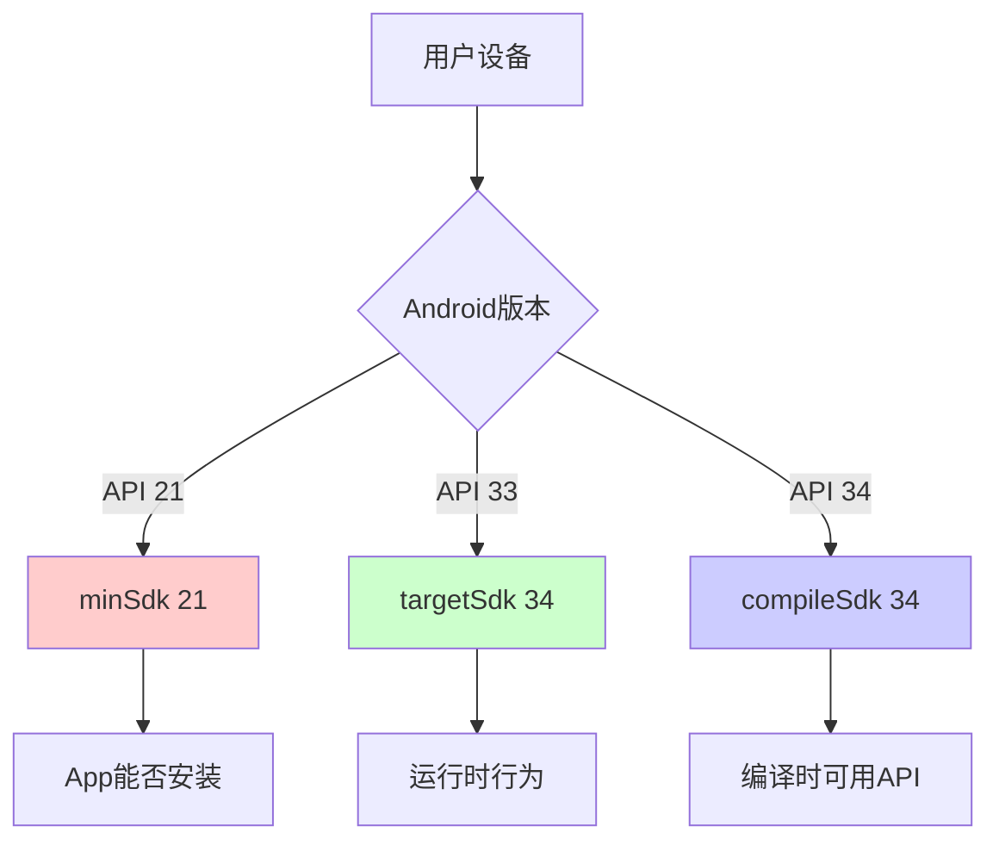

# 21.1.105 CompileSdkVersion

星空已经完全铺满了天幕，像一块缀满钻石的天鹅绒。帐篷内，露营灯发出温暖的光芒，在四个女孩的脸上投下柔和的阴影。蛙鸣一阵阵地从远处的湖畔传来，伴随着偶尔响起的蟋蟀声。

黛琳轻轻合上笔记本电脑，转向洛芙。她的眼睛在灯光下闪着光，像是在准备分享什么重要的秘密。

“洛芙，还记得我们刚才说的CompileOptions吗？”

洛芙点点头，手里还捏着一块没吃完的饼干：“记得，编译选项嘛，说的是怎么编译我们的代码。”

“没错，”黛琳笑了笑，“那你知道‘用哪个版本的Android SDK来编译’这件事，应该怎么配置吗？”

洛芙歪着头想了想：“是不是在build.gradle里写个什么版本号？”

“对，但具体是哪个版本呢？”黛琳把电脑转过来，指着屏幕上的一段Gradle配置，“看这里——”

```groovy
android {
    compileSdk 34
    // ...
}
```

“这个34，就是CompileSdkVersion。”黛琳的声音很轻，像是怕惊扰了夜晚的宁静，“它告诉Gradle：‘嘿，编译我这段代码的时候，请用Android 34平台的API。’”

---

## 露营灯下的三个版本

伊莎从背包里翻出三根不同大小的荧光棒，在手中摆弄着。她把它们一字排开：最短的、中等长度的、最长的。

“如果把Android SDK版本比作这些荧光棒……”伊莎把它们举到灯前，光芒透过塑料散发出柔和的光晕，“最短的这个，是minSdkVersion。它代表你的App能运行的最低版本。”

“中等这个呢？”洛芙问。

“中等的是targetSdkVersion，”黛琳接话，“它代表你针对哪个版本进行优化。当你设置targetSdk 34时，意味着你的App在Android 14设备上会运行得最舒服，系统会启用最新的行为特性。”

“那最长的这个就是compileSdk？”洛芙恍然大悟。

“对，”希尔不知道什么时候凑了过来，手里还拿着一瓶矿泉水，“compileSdk是最长的那根——它决定了你能用到哪些API。理论上，compileSdk应该总是用最新的稳定版。”

“为什么？”洛芙问。

希尔拧开瓶盖喝了一口水：“因为新的SDK会带来新的API、新的功能，还有——最重要的——新的bug修复和性能优化。你总不想用着三年前的工具修最新的bug吧？”

---

## 帐篷里的实验

黛琳把电脑放在膝盖上，形成了一个简易的“小桌板”。她新建了一个空的Android项目，指着build.gradle文件。

“我们来实际操作一下，”她说，“先看看默认配置。”

```groovy
android {
    namespace "com.example.myapp"
    compileSdk 34

    defaultConfig {
        applicationId "com.example.myapp"
        minSdk 24
        targetSdk 34
        versionCode 1
        versionName "1.0"

        testInstrumentationRunner "androidx.test.runner.AndroidJUnitRunner"
    }

    buildTypes {
        release {
            minifyEnabled false
            proguardFiles getDefaultProguardFile('proguard-android-optimize.txt'), 'proguard-rules.pro'
        }
    }
}
```

“看到了吗？compileSdk、minSdk、targetSdk各司其职。”黛琳移动着光标，“compileSdk 34意味着编译时使用Android 14的API。这意味着你可以调用很多新API——比如……”

“比如？”洛芙好奇地问。

黛琳快速敲了几个键，屏幕上出现了一段代码：

```kotlin
// 只有compileSdk >= 33才能使用的API
val activity = androidx.core.app.ActivityCompat.requireActivityByName(this, "MainActivity")

// compileSdk 34新增的API示例
val pendingIntent = androidx.appcompat.app.ActivityCompat.createPendingTransaction(
    this,
    requestCode,
    intent,
    PendingIntent.FLAG_MUTABLE_UNSTABLE
)
```

“这些是Android 14（API 34）新增的API，”黛琳解释道，“如果你把compileSdk改成33，这些代码就编译不过了。”

“为什么？”洛芙问。

“因为编译器不认识这些新API啊，”希尔插嘴道，“就像你让一个只学过小学数学的人去解微积分题，他做不到嘛。compileSdk就是那个决定‘你学到哪个年级’的东西。”

---

## 月光下的泳池比喻

伊莎把三根荧光棒放下来，在帐篷里晃来晃去。光影在帐壁上投下摇曳的图案。

“我有个比喻，”伊莎轻声说，“想象你在建一个泳池。”

“泳池？”洛芙来了兴趣。

“对。minSdkVersion是泳池的入口阶梯——只有达到这个身高（版本）的人才能进来玩。targetSdkVersion是泳池的设计水位——水位太高或太低都会影响游泳体验。”

“那compileSdk呢？”洛芙问。

“compileSdk是建筑工人手里的图纸，”伊莎笑着说，“图纸越新，能建的泳池就越漂亮、越复杂。你可以用最新版的图纸来设计泳池，但最终建好的泳池还是要符合入口阶梯和水位的设计。”

洛芙若有所思地点点头：“所以，compileSdk可以很新，但minSdk和targetSdk要根据自己的需求来定？”

“Exactly！”希尔打了个响指，“这就是关键。很多人犯的错误是：把compileSdk设得很高，但minSdk设得太低，导致用了一些高版本API，结果在低版本设备上崩了。”

---

## 星空下的反模式

黛琳打开另一个文件，里面有一段“有问题”的代码。

“来看看这个反模式，”她说，“这是很多新手会踩的坑。”

```kotlin
// ❌ 反模式：在minSdk 21的设备上使用API 26才有的特性
class MainActivity : AppCompatActivity() {
    
    override fun onCreate(savedInstanceState: Bundle?) {
        super.onCreate(savedInstanceState)
        
        // 这段代码在Android 8.0 (API 26)以上才能用
        val channel = NotificationChannel(
            "channel_id",
            "Channel Name",
            NotificationManager.IMPORTANCE_DEFAULT
        ).apply {
            description = "Channel description"
            enableLights(true)
            lightColor = Color.RED
        }
        
        val notificationManager = getSystemService(NotificationManager::class.java)
        notificationManager.createNotificationChannel(channel)
    }
}
```

“在minSdk 21的设备上，这段代码会直接崩溃，”黛琳说，“因为NotificationChannel是API 26才有的。”

“那怎么办？”洛芙问。

“很简单，加个检查，或者提高minSdk，”希尔抢着说，“但最优雅的做法是这样——”

```kotlin
// ✅ 正确做法：运行时检查版本
class MainActivity : AppCompatActivity() {
    
    override fun onCreate(savedInstanceState: Bundle?) {
        super.onCreate(savedInstanceState)
        
        // 只在Android 8.0以上创建NotificationChannel
        if (Build.VERSION.SDK_INT >= Build.VERSION_CODES.O) {
            val channel = NotificationChannel(
                "channel_id",
                "Channel Name",
                NotificationManager.IMPORTANCE_DEFAULT
            ).apply {
                description = "Channel description"
                enableLights(true)
                lightColor = Color.RED
            }
            
            val notificationManager = getSystemService(NotificationManager::class.java)
            notificationManager.createNotificationChannel(channel)
        }
    }
}
```

洛芙盯着代码看了半天：“所以compileSdk是编译时的限制，运行时还要看具体的版本？”

“对，”黛琳点点头，“compileSdk只是决定了‘你能写什么代码’，但‘代码能不能跑’还要看运行时的Android版本。”

---

## 深夜的代码实验

希尔把电脑接上电源，开始现场写演示代码。键盘的敲击声在夜里格外清晰。

“我们来验证一下compileSdk的作用，”她说，“先设一个低版本的compileSdk。”

```groovy
android {
    compileSdk 30  // 假设我们只用Android 11的API
    
    defaultConfig {
        minSdk 21
        targetSdk 34
    }
}
```

“现在，如果我们尝试用API 33的代码，会怎么样？”希尔敲出一段代码：

```kotlin
// 这段代码需要API 33
val bitmap = android.graphics.Bitmap.createBitmap(
    width,
    height,
    android.graphics.Bitmap.Config.ARGB_8888
)

// 尝试使用API 33新增的ColorSpace
val colorSpace = android.graphics.ColorSpace.get(android.graphics.ColorSpace.Named.EXTENDED_SRGB)
```

“编译会报错，”黛琳说，“Gradle会告诉你：‘嘿，你要用的是API 33的东西，但你的compileSdk只有30，不够！’”

“如果我们把compileSdk改成33呢？”希尔把数字一改。

```groovy
android {
    compileSdk 33  // 改成33
}
```

“现在能编译过了，”希尔说，“但运行的时候，如果设备是Android 12（API 31），ARGB_8888可能不会有extended srgb的效果——因为那需要硬件支持。”

“这就叫compileSdk和运行时的区别，”黛琳总结道，“compileSdk只是编译许可，不是运行保证。”

---

## 帐篷外的蛙鸣

一阵风吹过，帐篷轻轻晃动了一下。远处的蛙鸣似乎更响亮了，像是在为她们的讨论伴奏。

洛芙抬起头，透过帐篷的纱窗看着外面的星空。

“所以总结下来，”她慢慢地说，“compileSdk就是——告诉编译器我能用哪些API。对吧？”

“对，”黛琳温柔地笑了，“而且最好始终用最新的stable版本，这样能用上最新的API和修复。”

“那targetSdk呢？”洛芙问，“它和compileSdk有什么区别？”

“targetSdk更像是和系统的一个‘约定’，”伊莎插话道，“你告诉系统：‘我已经适配好了，请给我开启最新的行为。’比如，Android 14对后台 Activity 启动有很多限制，如果你targetSdk 34，系统就会按新规则来；如果你targetSdk 33，可能还能用老规则。”

“而minSdk，”希尔补充，“就是最低门槛——低于这个版本的设备干脆别装了。”

洛芙似懂非懂地点点头：“感觉三个版本各有各的用处……”

“对，这就是Android版本管理的精髓，”黛琳说，“合理配置这三个版本，既能用上新技术，又能覆盖更多用户，还能保证兼容性。”

---

## 月光下的配置图

希尔在地上铺开一张纸，用荧光笔开始画图。

“我来画个图，帮助理解三个版本的关系，”她说。



“看到了吗？”希尔指着图解释，“minSdk决定你能不能安装，targetSdk决定你怎么运行，compileSdk决定你能用什么代码。”

洛芙盯着图看了很久：“感觉像三层保护……”

“对，就是这样，”黛琳说，“Android用这三层来平衡创新和兼容。”

---

## 深夜的另一个实验

“再来实际操作一下，看看compileSdk的实际影响，”希尔把电脑转过来，指着dependencies部分。

“我们来看看依赖库版本和compileSdk的关系，”她说。

```groovy
android {
    compileSdk 34
}

dependencies {
    // 这些库的版本通常和compileSdk对应
    implementation 'androidx.core:core-ktx:1.12.0'  // 对应API 34
    implementation 'androidx.appcompat:appcompat:1.6.1'
    implementation 'androidx.activity:activity-ktx:1.8.0'
    
    // 如果compileSdk是33，这些库可能要用旧版本
    // implementation 'androidx.core:core-ktx:1.10.1'  // 对应API 33
}
```

“为什么库版本也要和compileSdk对应？”洛芙问。

“因为库的版本通常和Android SDK版本绑定，”黛琳解释说，“比如core-ktx 1.12.0是为了Android 14优化的，如果你用compileSdk 33，可能发挥不出它的全部性能。”

“而且，”希尔补充，“新库往往会用到新API。如果compileSdk太低，库的新功能你也用不了。”

---

## 露营灯渐暗

夜深了，露营灯的电池似乎快要耗尽，光线变得越来越暗。

“看来该睡了，”伊莎打了个哈欠，“明天还要早起看日出呢。”

洛芙恋恋不舍地合上笔记本：“今天学到的比想象的还多……”

“总结一下，”黛琳轻声说，“compileSdkVersion就是——”

“我知道！”洛芙抢着说，“它决定了编译时能用哪些Android API，应该始终用最新的stable版本！”

“对，”黛琳笑了，“而且别忘了，它和minSdk、targetSdk配合使用，才能做到既新又稳。”

帐篷外，蛙鸣声渐渐稀疏下去。星空依旧璀璨，像是撒在天幕上的无数颗宝石。

“晚安，洛芙。”伊莎轻声说。

“晚安……”洛芙闭上眼睛，脑海里还回响着刚才的代码和对话。

明天，又会学到什么呢？

---

> 学习建议

1. **优先使用最新stable版compileSdk**：Google每次发布新Android版本后，记得同步更新compileSdk，以获取最新的API和性能优化。

2. **理解三版本配合**：minSdk决定兼容性下限，targetSdk决定运行时行为，compileSdk决定编译时能力。三者需要根据项目需求合理配置。

3. **警惕API可用性**：即使compileSdk很高，运行时仍需检查Build.VERSION.SDK_INT，避免在低版本设备上调用不存在的API。

4. **库版本与compileSdk同步**：依赖库的版本应与compileSdk对应或更高，以获得最佳兼容性和性能。

5. **不要混淆compileSdk和targetSdk**：compileSdk只影响编译，不影响运行时行为；targetSdk才会影响系统的兼容性处理方式。

---

## 洛芙的小小日记本

今晚在帐篷里学到了Android SDK的三个版本！minSdk是最低门槛，targetSdk是运行优化，compileSdk是编译能力。黛琳说compileSdk要始终用最新的，就像工具要买最新款一样道理。星光下的代码课，好安静好治愈呀~

---

## 今日关键词

- **CompileSdkVersion**：Android Gradle Plugin中配置编译SDK版本的DSL对象，用于指定编译时使用的Android平台API版本。
- **compileSdk**：在build.gradle中设置的SDK版本号，决定了编译时能使用的API范围。
- **minSdkVersion**：应用支持的最低Android版本，低于此版本的设备无法安装应用。
- **targetSdkVersion**：应用针对优化的Android版本，影响运行时系统行为和兼容性处理方式。
- **API Level**：Android API的版本号数字，如API 34对应Android 14。
- **Build.VERSION.SDK_INT**：运行时获取设备Android版本的代码常量。
- **NotificationChannel**：API 26新增的通知渠道，需要运行时版本检查。
- **Android Gradle Plugin**：Google提供的Gradle插件，用于构建Android项目。
- **dependencies**：Gradle中管理项目依赖的配置块。
- **core-ktx**：AndroidX核心库的Kotlin扩展，提供更便捷的API调用方式。
