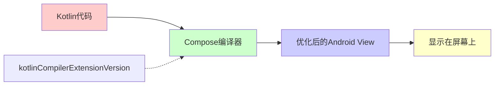

# 21.1.106 ComposeOptions

星空已经完全铺满了天幕，像一块缀满钻石的天鹅绒。帐篷内，露营灯发出温暖的光芒，在四个女孩的脸上投下柔和的阴影。蛙鸣一阵阵地从远处的湖畔传来，伴随着偶尔响起的蟋蟀声。

黛琳轻轻合上笔记本电脑，转向洛芙。她的眼睛在灯光下闪着光，像是在准备分享什么重要的秘密。

“洛芙，话说回来——你知道怎么配置Jetpack Compose吗？”

“Compose？”洛芙Apenas眨了眨眼睛，“就是那个……新的UI工具包？之前希尔给我看过，说是可以用Kotlin写界面那个？”

“对，就是它，”希尔不知道什么时候冒了出来，手里还拿着一袋坚果，“Compose可好用了，用Kotlin写UI，就像写普通代码一样。”

“但是，”黛琳把电脑转过来，指着屏幕上的一段Gradle配置，“要让Compose正常工作，需要配置一个叫ComposeOptions的东西。”

洛芙凑过去看，屏幕上是一段她不太熟悉的代码：

```groovy
android {
    composeOptions {
        kotlinCompilerExtensionVersion = "1.5.8"
    }
}
```

“这个是做什么的？”洛芙问。

---

## 露营灯下的编译器

黛琳把电脑放在膝盖上，形成了一个简易的“小桌板”。她新建了一个空的Android项目，指着build.gradle文件。

“首先，”黛琳的声音很轻，像是怕惊扰了夜晚的宁静，“你要理解Compose是怎么工作的。”

“Compose不是直接就能用吗？”洛芙问。

“理论上是的，”黛琳笑了笑，“但实际上，Compose是一个编译器——它把Kotlin代码转换成高效的Android view代码。而这个转换器，是需要配置的。”

伊莎从背包里翻出一个小型手电筒，打开来，让光线在帐篷里晃来晃去。光影在帐壁上投下摇曳的图案。

“想象一下，”伊莎轻声说，“你的Kotlin代码是一份食谱，Compose编译器是那个把它们变成可口菜肴的厨师。”

“厨师？”洛芙来了兴趣。

“对，”黛琳接口道，“而kotlinCompilerExtensionVersion，就是告诉厨师要用哪个版本的菜谱。新版本的菜谱——也就是编译器扩展——会做出更好吃、更高效的菜。”

---

## 帐篷里的版本匹配

希尔把坚果袋子打开，分给每个人。她自己抓了一把，然后指着电脑说：“看，这里有个很重要的点——Kotlin版本和Compose编译器版本必须匹配。”

电脑上显示着依赖配置：

```groovy
plugins {
    id 'com.android.application'
    id 'org.jetbrains.kotlin.android' version '1.9.22'
}

android {
    composeOptions {
        // Kotlin 1.9.22 对应 Compose 编译器 1.5.8
        kotlinCompilerExtensionVersion = '1.5.8'
    }
}

dependencies {
    // Compose BOM 会自动管理各模块版本
    implementation platform('androidx.compose:compose-bom:2024.02.00')
    implementation 'androidx.compose.ui:ui'
    implementation 'androidx.compose.ui:ui-graphics'
    implementation 'androidx.compose.ui:ui-tooling-preview'
    implementation 'androidx.compose.material3:material3'
}
```

“Kotlin 1.9.22和Compose 1.5.8是配套的，”希尔解释道，“就像钥匙和锁一样，版本要对得上。”

“如果版本对不上呢？”洛芙问。

“编译会报错，”黛琳说，“Gradle会告诉你：‘嘿，你的Kotlin版本和Compose编译器版本不匹配！’”

“就像这样，”希尔敲出一段模拟的错误信息：

```
e: This version (1.5.1) of the Compose Compiler is not compatible with Kotlin 1.9.22. 
Please use Compose Compiler version 1.5.8 or compatible with Kotlin 1.9.22.
```

“哇，好直接的通知，”洛芙吐了吐舌头。

---

## 月光下的对照表

伊莎从笔记本里翻出一张折迭的表格，摊开在帐篷地板上。上面密密麻麻地列着Kotlin版本和对应的Compose编译器版本。

“黛琳给我的，”伊莎说，“说是官方的版本对照表。”

希尔用手机的手电筒照着表格，指给洛芙看：

| Kotlin版本 | Compose编译器版本 |
|------------|-------------------|
| 1.9.22     | 1.5.8             |
| 1.9.21     | 1.5.7             |
| 1.9.20     | 1.5.6             |
| 1.9.10     | 1.5.3             |
| 1.9.0      | 1.5.2             |
| 1.8.22     | 1.5.1             |
| 1.8.21     | 1.5.0             |
| 1.8.0      | 1.4.3             |

“其实不用记，”希尔说，“你只需要知道：每次升级Kotlin版本的时候，记得查一下对应的Compose编译器版本就行。Google有一个官方页面会列出对应关系。”

洛芙把这些信息在脑海里过了一遍：“所以，配置Compose的第一步就是——找到正确的版本号，然后写进去？”

“对，”黛琳点点头，“这就是kotlinCompilerExtensionVersion的作用。”

---

## 星空下的另一个选项

夜风吹过帐篷，带来一阵凉爽。远处的蛙鸣似乎小了一些，但偶尔还能听到几声清脆的叫声。

“还有个配置项，”黛琳滑动电脑页面，“叫useLiveLiterals。”

“实时字面量？”洛芙翻译着这个奇怪的名字。

“对，”希尔说，“这个选项可以让你在Compose的预览中看到实时的数据——比如一些字符串、图片，都会即时更新。”

“就像实时预览？”洛芙问。

“差不多，”黛琳解释说，“打开这个功能后，你在代码里写的文字、图片路径，都会在Android Studio的预览窗口里即时显示。调试UI的时候特别方便。”

电脑上显示着配置示例：

```groovy
android {
    composeOptions {
        kotlinCompilerExtensionVersion = '1.5.8'
        
        // 启用实时字面量预览（默认true，可省略）
        useLiveLiterals = true
    }
}
```

“为什么需要关掉它？”洛芙注意到希尔刚才说了“可以关掉”。

“有时候，”希尔说，“预览功能会影响编译速度，或者在某些特殊的项目配置下会出现问题。那时候就可以把它设成false，用传统的预览方式。”

---

## 帐篷里的版本实验

希尔把电脑放在一边，开始现场写演示代码。键盘的敲击声在夜里格外清晰。

“我们来实际操作一下Compose的配置，”她说。

首先是一个基础配置：

```groovy
// 基础Compose配置
android {
    composeOptions {
        kotlinCompilerExtensionVersion = '1.5.8'
    }
}
```

然后希尔添加依赖：

```groovy
dependencies {
    // Compose BOM - 统一管理版本
    implementation platform('androidx.compose:compose-bom:2024.02.00')
    
    // 核心Compose库
    implementation 'androidx.compose.ui:ui'
    implementation 'androidx.compose.ui:ui-graphics'
    implementation 'androidx.compose.ui:ui-tooling-preview'
    
    // Material 3
    implementation 'androidx.compose.material3:material3'
    
    // 调试用
    debugImplementation 'androidx.compose.ui:ui-tooling'
    debugImplementation 'androidx.compose.ui:ui-test-manifest'
}
```

“这些dependency是做什么的？”洛芙问。

“Compose BOM是一个便利工具，”黛琳解释说，“它自动帮你匹配所有Compose库的正确版本，你不需要自己一个一个去记每个库该用什么版本。”

“UI是核心库，ui-graphics是图形处理，ui-tooling-preview是预览功能，”希尔补充，“material3就是那个漂亮的Material Design 3组件库。”

---

## 深夜的Compose代码示例

黛琳新建了一个Compose的Activity类，展示给洛芙看：

```kotlin
package com.example.myapp

import android.os.Bundle
import androidx.activity.ComponentActivity
import androidx.activity.compose.setContent
import androidx.compose.foundation.layout.fillMaxSize
import androidx.compose.material3.MaterialTheme
import androidx.compose.material3.Surface
import androidx.compose.material3.Text
import androidx.compose.ui.Modifier
import androidx.compose.ui.graphics.Color

class MainActivity : ComponentActivity() {
    override fun onCreate(savedInstanceState: Bundle?) {
        super.onCreate(savedInstanceState)
        
        setContent {
            MaterialTheme {
                Surface(
                    modifier = Modifier.fillMaxSize(),
                    color = Color.Cyan
                ) {
                    Text(
                        text = "Hello Compose!",
                        style = MaterialTheme.typography.headlineLarge,
                        color = Color.White
                    )
                }
            }
        }
    }
}
```

“这就是Compose的方式，”黛琳说，”用Kotlin DSL来写UI，看起来就像在搭积木一样。”

洛芙盯着代码看了半天：“感觉比传统的XML布局简洁多了……”

“对，这就是Compose的魅力，”希尔说，“不用在XML和Kotlin之间来回切换，所有代码都在一个地方。”

---

## 露营灯下的白板

伊莎拿来一张白纸，用荧光笔在上面画起图来。

“我来画个图，帮你理解整个流程，”她说。

纸上渐渐出现了一个流程图：



“Kotlin代码经过Compose编译器的处理，变成高效的Android View代码，最后显示在屏幕上，”伊莎解释道，“而编译器版本决定了转换的效率和质量。”

洛芙若有所思地点点头：“感觉像一个翻译器——把Kotlin翻译成Android能看懂的语言。”

“比喻得很贴切，”黛琳笑了。

---

## 月光下的另一个实验

希尔滑动电脑页面，找到了Compose的详细配置页面。

“其实还有一种配置方式，”她说，“在较新版本的AGP里，还可以这样配置——”

```groovy
android {
    compose {
        // 新版本AGP的配置方式
        compilerExtensionVersion = '1.5.8'
    }
}
```

“这和composeOptions有什么区别？”洛芙问。

“本质上是一样的，”黛琳解释说，“composeOptions是老的写法，compose是新的简写。AGP 8.0以后支持这种更简洁的语法。”

“但旧的写法仍然能用，”希尔补充，“两边都能跑。”

---

## 星空下的反模式

黛琳打开另一个文件，里面有一段“有问题”的代码。

“来看看这个反模式，”她说，“这是很多新手会踩的坑。”

```groovy
// ❌ 反模式：Kotlin版本和Compose编译器版本不匹配
plugins {
    id 'com.android.application'
    id 'org.jetbrains.kotlin.android' version '1.9.22'
}

android {
    composeOptions {
        // 错误：1.4.3 是给 Kotlin 1.8.0 用的，不匹配
        kotlinCompilerExtensionVersion = '1.4.3'
    }
}
```

“这样会怎样？”洛芙问。

“编译会失败，”黛琳说，“而且错误信息通常很长，说什么'incompatible'之类的。”

“那怎么修？”洛芙问。

“很简单——找对的版本，”希尔抢着说，“去查官方对照表，然后写正确的版本号。”

```groovy
// ✅ 正确写法
plugins {
    id 'com.android.application'
    id 'org.jetbrains.kotlin.android' version '1.9.22'
}

android {
    composeOptions {
        // 正确：1.9.22 对应 1.5.8
        kotlinCompilerExtensionVersion = '1.5.8'
    }
}
```

---

## 深夜的另一个配置

“还有个重要的点，”黛琳说，“Compose库本身的版本也要管理好。”

电脑上显示着几种不同的依赖写法：

```groovy
// 方式1: 使用 Compose BOM（推荐）
dependencies {
    implementation platform('androidx.compose:compose-bom:2024.02.00')
    implementation 'androidx.compose.ui:ui'
    implementation 'androidx.compose.material3:material3'
}

// 方式2: 手动指定版本（不推荐，容易冲突）
dependencies {
    implementation 'androidx.compose.ui:ui:1.6.1'
    implementation 'androidx.compose.material3:material3:1.2.0'
}

// 方式3: 只指定BOM，在preview里用版本标签
dependencies {
    // 只用BOM
    implementation platform('androidx.compose:compose-bom:2024.02.00')
    
    // 不写版本号，让BOM自动管理
    implementation 'androidx.compose.ui:ui'
    implementation 'androidx.compose.material3:material3'
}
```

“方式1是最推荐的，”黛琳说，“BOM会帮你确保所有Compose库的版本是兼容的。”

“为什么方式2不推荐？”洛芙问。

“因为手动指定版本容易出现版本冲突，”希尔解释说，“比如你指定了material3是1.2.0，但ui是1.6.0，两者可能不兼容。但BOM会帮你处理好这些。”

---

## 帐篷外的青蛙

一阵风吹过，帐篷轻轻晃动了一下。远处的蛙鸣似乎更响亮了，像是在为她们的讨论伴奏。

洛芙抬起头，透过帐篷的纱窗看着外面的星空。

“所以总结下来，”她慢慢地说，“ComposeOptions就是——配置Compose编译器的选项。对吧？”

“对，”黛琳温柔地笑了，“最重要的是kotlinCompilerExtensionVersion，它决定了Kotlin代码和Compose的兼容性。”

“那useLiveLiterals呢？”洛芙问。

“它是可选的，”伊莎插话道，“默认开启，用来在预览时实时显示文字和图片。关掉它可以加快编译速度。”

洛芙似懂非懂地点点头：“感觉配置Compose比配置传统Android项目简单多了……”

“对，这就是Compose的目标，”黛琳说，“用更少的配置，做更多的事情。”

---

## 月光下的新项目

希尔在地上铺开一张纸，用荧光笔开始画图。

“我来画个完整的配置示例，”她说。

纸上渐渐出现了一个完整的项目结构图：

```mermaid
flowchart TB
    subgraph BuildConfig[build.gradle配置]
        A[Kotlin插件版本] --> B[Compose编译器版本]
    end
    
    subgraph Dependencies[依赖管理]
        C[Compose BOM] --> D[核心库ui]
        C --> E[Material3]
        C --> F[Preview]
    end
    
    subgraph SourceCode[源代码]
        G[Composable函数] --> H[@Composable注解]
        H --> I[setContent]
    end
    
    B -.->|版本匹配| A
    
    style A fill:#ffcccc
    style C fill:#ccffcc
    style G fill:#ccccff
```

“看到了吗？从配置到代码，整个流程是这样的，”希尔指着图解释，“Kotlin版本和编译器版本要匹配，依赖用BOM管理，代码用Composable函数写。”

洛芙盯着图看了很久：“感觉像一条链子，一环扣一环……”

“对，就是这样，”黛琳说，“配置好了，后面的开发就会很顺畅。”

---

## 露营灯渐暗

夜深了，露营灯的电池似乎快要耗尽，光线变得越来越暗。

“看来该睡了，”伊莎打了个哈欠，“明天还要早起看日出呢。”

洛芙恋恋不舍地合上笔记本：“今天学到的比想象的还多……”

“总结一下，”黛琳轻声说，“ComposeOptions就是——”

“我知道！”洛芙抢着说，“它配置了Compose编译器，最重要的kotlinCompilerExtensionVersion要把Kotlin版本和Compose编译器版本对应上！”

“对，”黛琳笑了，“而且最好用Compose BOM来管理库版本，这样最省心。”

帐篷外，蛙鸣声渐渐稀疏下去。星空依旧璀璨，像是撒在天幕上的无数颗宝石。

“晚安，洛芙。”伊莎轻声说。

“晚安……”洛芙闭上眼睛，脑海里还回响着刚才的代码和对话。

明天，又会学到什么呢？

---

> 学习建议

1. **版本匹配是核心**：Kotlin版本必须与Compose编译器版本匹配，使用官方对照表查找正确版本。

2. **优先使用Compose BOM**：依赖管理推荐使用Compose BOM，可以自动协调所有Compose库的版本，避免冲突。

3. **useLiveLiterals默认开启**：预览功能可以实时显示UI效果，开发时建议保持开启；如遇问题可关闭。

4. **新版本AGP语法**：AGP 8.0+支持`compose { compilerExtensionVersion = "x.x.x" }`的简化写法，与`composeOptions`等价。

5. **关注官方更新**：Google每次更新Kotlin版本时，记得同步更新Compose编译器版本，以获得最新的优化和bug修复。

---

## 洛芙的小小日记本

今晚在帐篷里学到了ComposeOptions！原来Compose是一个编译器，要把Kotlin代码变成Android能看懂的界面。最重要的是kotlinCompilerExtensionVersion版本要对上Kotlin版本，不然会报错。黛琳说用Compose BOM管理依赖最省心，感觉比传统Android开发简单呢～星光下的代码课，好安静好治愈呀~

---

## 今日关键词

- **ComposeOptions**：Android Gradle Plugin中配置Jetpack Compose编译器的DSL对象。
- **kotlinCompilerExtensionVersion**：指定Compose编译器扩展的版本，必须与Kotlin版本匹配。
- **useLiveLiterals**：Compose预览功能开关，启用后可在预览中实时显示字面量数据。
- **Jetpack Compose**：Google推出的现代Android UI工具包，使用Kotlin DSL编写界面。
- **Composable**：用@Composable注解标记的函数，可以生成UI组件。
- **Compose BOM**：Compose Bill of Materials，用于统一管理Compose库版本的依赖规范。
- **Material3**：Material Design 3的Compose实现，提供现代化的UI组件。
- **AGP**：Android Gradle Plugin，Google提供的Gradle插件，用于构建Android项目。
- **setContent**：Compose中设置Composable内容的入口函数。
- **Kotlin**：一种现代的JVM编程语言，Jetpack Compose使用Kotlin作为开发语言。