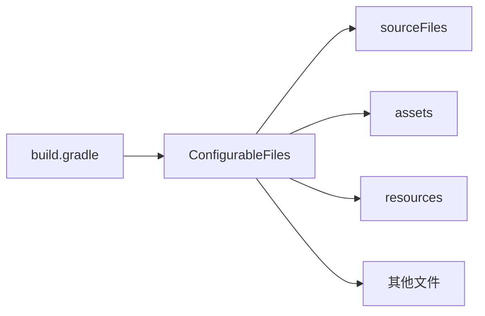
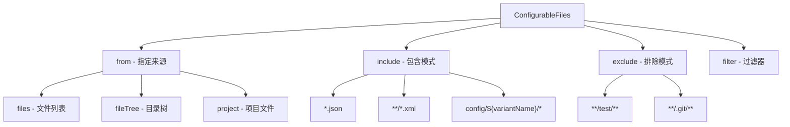
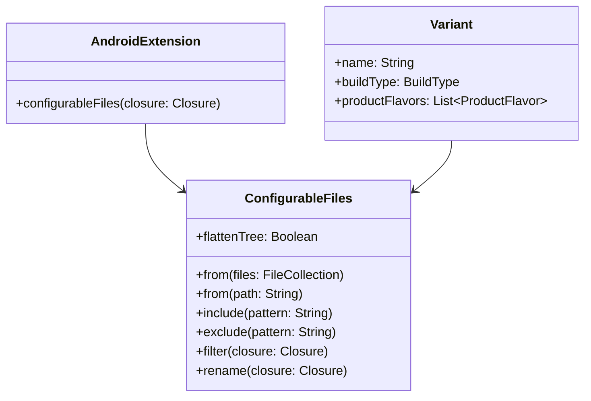

# 21.1.107 ConfigurableFiles

星空在帐篷顶的透明纱窗上投下细碎的光斑，洛芙仰躺着，手里的笔记本已经合上又打开，打开又合上。

“黛琳刚才说的ComposeOptions，我已经设置好了。”她翻了个身，侧躺着看向黛琳，“可是有时候我需要在构建时替换一些文件——比如不同的环境用不同的配置文件，这个该怎么处理呀？”

伊莎正在整理她的编织绳，听到这个问题轻轻笑了笑：“洛芙终于问到点子上了呢。”

希尔从背包里翻出一个U盘：“问得好。其实Android Gradle有一个很强大的机制，叫做ConfigurableFiles——专门用来处理这种需要在构建时灵活配置的文件。”

黛琳点了点头，把白板拿过来：“说白了，ConfigurableFiles就是Gradle给你的一把瑞士军刀，让你能在构建过程中动态地添加、配置和管理各种文件资源。今天我们就来好好聊聊这个。”

---

## 什么是ConfigurableFiles

“想象一下，”伊莎轻声说，“你露营的时候，会带一份基础装备清单。但每次出行前，你会根据目的地是山林还是湖边，增减一些东西。ConfigurableFiles就像是那份可以灵活调整的装备清单——在构建时动态配置。”

黛琳在白板上画了一个简单的示意图：



“ConfigurableFiles本质上是一个DSL接口，允许你在Gradle构建脚本中声明一组文件，并对其进行配置。”黛琳解释道，“它属于Android Gradle Plugin的DSL API，位于com.android.build.api.dsl包下。”

希尔打开电脑，调出一个示例配置：“我们来看一个真实的例子。假设我们有一个应用，需要根据不同的构建环境使用不同的API配置。”

```kotlin
// build.gradle.kts (Module: app)

android {
    // 声明一个ConfigurableFiles集合
    val apiConfig by configuring<ConfigurableFiles> {
        // 指定配置文件的路径模式
        from(files("src/main/config/api"))
        // 包含特定模式的文件
        include("**/*.json")
        // 排除特定文件
        exclude("**/secret.json")
    }
    
    // 或者使用更简洁的方式
    androidResources {
        // 在资源处理阶段添加配置文件
        generateConfigFiles = true
    }
}
```

“等等，”洛芙举手，“这个ConfigurableFiles和普通的文件拷贝有什么区别？”

“好问题。”黛琳微笑着说，“普通的文件拷贝是静态的——你在构建前把文件放到指定位置，构建时原样复制。但ConfigurableFiles是动态的——你可以在构建时决定哪些文件要包含、排除，甚至可以对其进行后处理。”

---

## 配置文件的来源与路径模式

“露营装备的清单需要从哪里获取呢？”伊莎托着腮帮子，“当然是从你的装备仓库里。ConfigurableFiles也是一样的道理——它需要知道从哪里获取文件。”

黛琳在白板上继续画图，讲解文件来源的配置方式：



“来，我们看实际代码。”希尔敲打着键盘，“假设我们的项目结构是这样的——”

```text
app/
├── src/
│   ├── main/
│   │   ├── config/
│   │   │   ├── dev/
│   │   │   │   └── api.json
│   │   │   ├── staging/
│   │   │   │   └── api.json
│   │   │   └── prod/
│   │   │       └── api.json
│   │   └── java/
│   └── test/
```

“现在我们配置ConfigurableFiles，根据不同的构建变体使用不同的配置——”

```kotlin
// build.gradle.kts (Module: app)

android {
    defaultConfig {
        // ...其他配置
    }
    
    // 为每个构建变体配置不同的文件
    applicationVariants.all { variant ->
        val variantName = variant.name
        
        // 使用ConfigurableFiles根据变体选择配置
        val configFiles = configurableFiles {
            // 从对应变体的config目录获取文件
            from(file("src/main/config/${variantName}"))
            
            // 也包含通用的基础配置
            from(file("src/main/config/base")) {
                // 基础配置优先级较低，变体特定配置会覆盖
            }
            
            // 只包含JSON配置文件
            include("*.json")
            
            // 排除敏感文件
            exclude("**/secret.*")
            
            // 可以添加自定义过滤器
            filter {
                // 对每个文件进行处理
                it.name.endsWith(".json")
            }
        }
    }
}
```

洛芙眼睛亮了起来：“原来可以根据buildVariant动态选择配置文件！那如果我想在代码里读取这些配置，该怎么做？”

“问得好。”黛琳笑着说，“通常这些配置文件会被打包到APK中，你可以通过Assets或者Resources来读取。让我给你展示——”

```kotlin
// 读取配置文件的示例 (Kotlin)

class ConfigManager(private val context: Context) {
    
    // 从Assets读取JSON配置
    fun loadApiConfig(): ApiConfig? {
        return try {
            context.assets.open("config/api.json").use { inputStream ->
                val json = inputStream.bufferedReader().readText()
                Gson().fromJson(json, ApiConfig::class.java)
            }
        } catch (e: Exception) {
            Log.e("ConfigManager", "Failed to load API config", e)
            null
        }
    }
    
    // 或者从Resources读取
    fun loadRawConfig(@RawRes resId: Int): String {
        return context.resources.openRawResource(resId).use { inputStream ->
            inputStream.bufferedReader().readText()
        }
    }
}
```

---

## 高级用法：条件配置与变体过滤

夜晚的蛙鸣声更响亮了，洛芙听得入神。希尔往她这边靠了靠：“洛芙，我再给你看个好玩的——有时候你可能需要根据更复杂的条件来配置不同的文件。”

```kotlin
// build.gradle.kts

android {
    applicationVariants.all { variant ->
        // 根据变体特性进行条件配置
        when {
            // 免费版只包含基础功能配置
            variant.buildType.name == "free" -> {
                configurableFiles {
                    from(file("src/main/config/free"))
                    include("*.json")
                }
            }
            
            // 付费版包含完整配置
            variant.buildType.name == "paid" -> {
                configurableFiles {
                    from(file("src/main/config/paid"))
                    include("*.json")
                    // 额外包含付费专属配置
                    from(file("src/main/config/premium"))
                }
            }
            
            // 针对特定 ABI 进行配置优化
            variant.productFlavors.any { it.name == "arm64" } -> {
                configurableFiles {
                    from(file("src/main/config/arm64-optimized"))
                }
            }
        }
    }
}
```

伊莎插话道：“这就好像根据不同的天气选择不同的露营装备——晴天带防晒，雨天带伞，冬天带暖宝宝。”

“对！”希尔打了个响指，“而且你还可以组合多个条件——”

```kotlin
// 更复杂的条件配置示例

android {
    applicationVariants.all { variant ->
        val isRelease = variant.buildType.name == "release"
        val isArm64Variant = variant.productFlavors.any { 
            it.name.contains("arm64") 
        }
        
        configurableFiles {
            // 基础配置 - 所有变体都需要
            from(file("src/main/config/base"))
            
            // 根据构建类型添加特定配置
            when {
                isRelease && isArm64Variant -> {
                    // 面向ARM64设备的发布版本 - 性能优化配置
                    from(file("src/main/config/arm64-perf"))
                    include("perf-*.json")
                }
                isRelease -> {
                    // 普通发布版本
                    from(file("src/main/config/release"))
                }
                else -> {
                    // Debug版本 - 包含调试端点
                    from(file("src/main/config/debug"))
                }
            }
        }
    }
}
```

---

## 文件合并与冲突处理

洛芙突然想到一个问题：“如果同一个文件在多个from()中被包含了怎么办？”

“这是一个很好的问题。”黛琳的表情变得认真起来，“Gradle处理文件合并有它自己的规则。让我给你解释——”

```mermaid
graph TD
    A[文件1: from(file1)] --> D{文件名相同?}
    B[文件2: from(file2)] --> D
    C[文件3: from(file3)] --> D
    
    D -->|是| E[同名文件冲突]
    D -->|否| F[正常合并]
    
    E --> G[根据优先级解决]
    G --> H["优先级: 后添加的覆盖先添加的"]
    G --> I["or: 通过filter去重"]
    
    F --> J[构建输出]
```

“在Gradle中，当多个来源包含同名文件时，后添加的会覆盖先添加的。”黛琳解释道，“但这也可能导致意外的覆盖，所以最好的做法是——”

```kotlin
// 正确处理文件冲突的方式

configurableFiles {
    // 明确指定优先级 - 越后面优先级越高
    from(file("src/main/config/base"))  // 优先级低
    from(file("src/main/config/common")) 
    from(file("src/main/config/${variantName}"))  // 优先级高，会覆盖前面的
    
    // 使用exclude避免重复
    exclude("**/common.json")
    
    // 使用rename重命名冲突文件
    rename { fileName ->
        // 给不同来源的文件添加前缀以区分
        when {
            fileName.contains("dev") -> "dev_$fileName"
            fileName.contains("prod") -> "prod_$fileName"
            else -> fileName
        }
    }
    
    // 或者使用flattenTree将所有文件放到同一层级
    flattenTree = false  // 保持原始目录结构
}
```

---

## 反模式与最佳实践

希尔突然严肃起来：“洛芙，我必须提醒你一些常见的错误做法——”

### ❌ 反模式一：硬编码文件路径

```kotlin
// 错误示例 - 硬编码路径
android {
    sourceSets {
        getByName("main") {
            // 硬编码的路径非常脆弱
            res.srcDirs = ["src/main/res", "src/other/res"]
        }
    }
}
```

“这种写法的问题是——如果你移动了文件夹，或者在多模块项目中，所有硬编码都需要修改。”

### ✅ 正确做法：使用相对路径和变量

```kotlin
// 正确示例 - 使用相对路径
android {
    sourceSets {
        getByName("main") {
            // 使用相对于当前模块的路径
            res.srcDirs = listOf("src/main/res")
            
            // 或者使用项目根路径
            res.srcDirs = listOf(project.rootProject.file("shared/res"))
        }
    }
}
```

### ❌ 反模式二：忽略变体差异

```kotlin
// 错误示例 - 所有变体使用相同配置
configurableFiles {
    from(file("src/main/config"))  // 不区分变体
    include("*.json")
}
```

“这样做的话，所有的变体都会包含相同的配置，无法实现环境差异化。”

### ✅ 正确做法：根据变体动态配置

```kotlin
// 正确示例 - 动态配置
configurableFiles {
    // 根据当前变体名称动态选择配置目录
    val variantConfigDir = "src/main/config/${variant.name}"
    from(file(variantConfigDir))
    
    // 或者使用条件判断
    if (variant.buildType.name == "release") {
        from(file("src/main/config/release"))
    }
    
    include("*.json")
}
```

---

## 实际应用场景

伊莎抬起头，看着帐篷外闪烁的星星：“说了这么多理论，让我们来说说实际的应用场景吧——”

**场景一：多环境API配置**

```kotlin
// 根据环境切换不同的API配置
applicationVariants.all { variant ->
    configurableFiles {
        val env = when {
            variant.name.contains("prod") -> "production"
            variant.name.contains("staging") -> "staging"
            else -> "development"
        }
        from(file("src/main/config/api/$env"))
        include("api-*.json")
    }
}
```

**场景二：动态资源替换**

```kotlin
// 根据渠道替换启动画面
applicationVariants.all { variant ->
    configurableFiles {
        from(file("src/main/res/drawable-${variant.name}"))
        include("splash.*")
    }
}
```

**场景三：多语言资源配置**

```kotlin
// 为不同地区配置不同的字符串资源
android {
    defaultConfig {
        // 配置默认资源
        resConfigs("en", "zh")
    }
    
    configurableFiles {
        // 添加地区特定的配置文件
        sourceSets.getByName("main") {
            res.srcDirs("src/main/res")
        }
    }
}
```

---

星空已经完全铺满了夜空，洛芙打了个哈欠。

“原来ConfigurableFiles可以做这么多事情！”她总结道，“不只是简单地复制文件，还可以根据构建变体动态选择、过滤、甚至处理冲突。”

黛琳收起白板：“没错。掌握好ConfigurableFiles，你就能实现非常灵活的构建配置——无论是多环境部署、渠道分发，还是动态资源管理，都不在话下。”

希尔最后补充道：“记住，配置文件的选择一定要清晰、明确，避免隐藏的覆盖行为。建议在团队中统一配置文件的管理规范。”

---

## 专业技术总结

> **ConfigurableFiles** 是 Android Gradle Plugin 提供的 DSL 接口，用于在构建过程中动态配置和管理文件资源集合。它允许开发者根据构建变体（Variant）、构建类型（Build Type）和产品风味（Product Flavor）灵活地添加、过滤和处理文件。

#### 结构图



#### 复杂度与影响

- **时间复杂度**：O(n)，其中 n 为配置的文件数量
- **空间复杂度**：取决于同时存在的文件变体数量
- **构建速度影响**：文件越多，拷贝时间越长，建议使用 `include`/`exclude` 精确过滤
- **调试难度**：文件覆盖可能导致意外行为，建议使用 `rename` 避免同名冲突

#### 反模式与陷阱

1. **所有变体使用相同配置**：无法实现环境差异化，应根据 `variant.name` 动态选择
2. **未处理同名文件冲突**：后添加的文件会静默覆盖前面的，应使用 `rename` 或 `exclude` 明确处理
3. **包含过多文件**：使用 `include` 限制文件范围，避免将不需要的文件打包进 APK
4. **硬编码路径**：使用相对路径或 `project.file()` 获取动态路径，提高可维护性
5. **忽略资源合并规则**：Gradle 按特定顺序合并资源，了解优先级避免意外覆盖

#### 设计哲学

**配置驱动构建（Configuration-Driven Build）**：

- 声明式配置：描述"要什么"，而非"怎么做"
- 变体感知：天然支持多维度构建变体
- 资源分层：支持基础配置与变体特定配置的叠加
- 最小复制原则：只包含必要的文件，减少 APK 体积

#### 🏕️ 动手练习

**目标**：掌握 ConfigurableFiles 的基本用法，能够根据构建变体动态配置不同的文件资源。

**项目背景**：开发一个天气应用，需要为不同地区（华北、华东、华南）和不同构建类型（debug、release）提供不同的天气数据接口配置。

---

**Task 1：创建配置文件结构**

- **目标**：建立多环境配置文件的基础目录结构
- **你需要做的事**：
  1. 在 `app/src/main/` 下创建 `config/` 目录
  2. 在 `config/` 下创建三个地区子目录：`north/`、`east/`、`south/`
  3. 在每个地区目录下创建 `api.json` 文件，内容如下（替换对应地区的 API 地址）：
     ```json
     {
       "region": "地区名",
       "apiBaseUrl": "https://api.weather.example.com/地区缩写",
       "apiKey": "demo_key",
       "timeout": 5000
     }
     ```
- **验收标准**：
  - [ ] 目录结构清晰：`config/north/`、`config/east/`、`config/south/` 都存在
  - [ ] 每个目录下都有 `api.json` 文件
  - [ ] JSON 文件格式正确，可被解析
- **提示**：
  ```kotlin
  // 目录结构应为：
  // app/src/main/config/
  //   ├── north/api.json
  //   ├── east/api.json
  //   └── south/api.json
  ```

---

**Task 2：配置基本 ConfigurableFiles**

- **目标**：使用 ConfigurableFiles 将配置文件添加到构建输出
- **你需要做的事**：
  1. 打开 `app/build.gradle.kts`
  2. 在 `android {}` 块中添加 ConfigurableFiles 配置
  3. 配置 `from()` 指定配置文件来源
- **验收标准**：
  - [ ] 构建不报错
  - [ ] APK 中包含配置文件（可在 build/outputs 中验证）
- **提示**：
  ```kotlin
  android {
      defaultConfig {
          // ...其他配置
      }
      
      // 在这里添加
      configurableFiles {
          from(file("src/main/config"))
          include("**/*.json")
      }
  }
  ```

---

**Task 3：根据构建变体动态选择配置**

- **目标**：实现 debug/release 使用不同的配置文件
- **你需要做的事**：
  1. 修改 ConfigurableFiles 配置，添加 `applicationVariants.all {}` 块
  2. 根据 `variant.buildType.name` 判断是 debug 还是 release
  3. 为 debug 版本添加测试用配置文件，为 release 添加正式配置
- **验收标准**：
  - [ ] debug 构建使用测试 API 地址
  - [ ] release 构建使用正式 API 地址
  - [ ] 构建日志中能看出选择了哪个配置文件
- **提示**：
  ```kotlin
  applicationVariants.all { variant ->
      configurableFiles {
          from(file("src/main/config"))
          include("**/*.json")
          
          // 根据构建类型过滤
          when (variant.buildType.name) {
              "debug" -> {
                  // debug 专用配置逻辑
              }
              "release" -> {
                  // release 专用配置逻辑
              }
          }
      }
  }
  ```

---

**Task 4：处理文件冲突与重命名**

- **目标**：学会处理多来源配置文件的同名冲突问题
- **你需要做的事**：
  1. 创建一个基础配置文件 `base/api.json`
  2. 在各地区目录下也创建 `api.json`
  3. 使用 `rename` 为不同时区的配置文件添加前缀
- **验收标准**：
  - [ ] 基础配置和地区配置都能被包含
  - [ ] 文件名不冲突，都能被访问到
- **提示**：
  ```kotlin
  configurableFiles {
      from(file("src/main/config/base"))
      from(file("src/main/config/north"))
      from(file("src/main/config/east"))
      from(file("src/main/config/south"))
      
      rename { fileName ->
          // 根据文件所在目录添加前缀
          fileName
      }
  }
  ```

---

**Task 5：在代码中读取配置**

- **目标**：在应用代码中读取并使用 ConfigurableFiles 配置的文件
- **你需要做的事**：
  1. 在 `app/src/main/assets/` 下创建 `config/` 目录（需要先配置 assets 路径）
  2. 创建一个工具类 `ConfigLoader` 读取 JSON 配置
  3. 在 Application 或 MainActivity 中加载配置
- **验收标准**：
  - [ ] 能够读取 JSON 文件内容
  - [ ] 能够解析为数据类
  - [ ] 能够根据不同构建读取不同的配置
- **提示**：
  ```kotlin
  // 1. build.gradle.kts 中配置 assets 路径
  android {
      sourceSets.getByName("main") {
          assets.srcDirs("src/main/assets", "src/main/config")
      }
  }
  
  // 2. 数据类
  data class ApiConfig(
      val region: String,
      val apiBaseUrl: String,
      val apiKey: String,
      val timeout: Int
  )
  
  // 3. 加载器
  class ConfigLoader(private val context: Context) {
      fun loadApiConfig(fileName: String): ApiConfig? {
          return try {
              context.assets.open("config/$fileName").use { inputStream ->
                  Gson().fromJson(
                      inputStream.bufferedReader().readText(),
                      ApiConfig::class.java
                  )
              }
          } catch (e: Exception) {
              null
          }
      }
  }
  ```

---

**Task 6：构建验证**

- **目标**：最终验证所有配置是否正确工作
- **你需要做的事**：
  1. 分别执行 `./gradlew assembleDebug` 和 `./gradlew assembleRelease`
  2. 验证两个 APK 中的配置是否不同
  3. 解压 APK 确认配置文件内容
- **验收标准**：
  - [ ] 两种构建都成功
  - [ ] debug APK 包含 debug 配置
  - [ ] release APK 包含 release 配置
- **提示**：使用 `unzip -l` 查看 APK 内容
  ```bash
  # 查看 APK 内容
  unzip -l app/build/outputs/apk/debug/app-debug.apk | grep config
  ```

---

#### 面试热身

1. **Q1: 请解释 ConfigurableFiles 和普通的文件拷贝（如 copy 任务）有什么区别？**
   - 参考答案：ConfigurableFiles 是声明式的、构建时动态的、变体感知的，而 copy 任务是过程式的、需要手动执行、不会自动根据变体变化。

2. **Q2: 当多个来源包含同名文件时，Gradle 如何处理？**
   - 参考答案：默认情况下，后添加的会覆盖先添加的。可以通过 rename、exclude 或调整 from() 的顺序来控制。

3. **Q3: 如何根据 productFlavor 选择不同的配置文件？**
   - 参考答案：在 applicationVariants.all {} 块中，通过 variant.productFlavors 获取当前变体的风味列表，然后根据风味名称动态选择配置文件。

4. **Q4: ConfigurableFiles 的性能影响是什么？如何优化？**
   - 参考答案：文件越多，拷贝时间越长。优化方法包括：使用 include/exclude 精确过滤不必要的文件，避免将大文件或不需要的文件打包进 APK。

5. **Q5: 什么场景下不适合使用 ConfigurableFiles？**
   - 参考答案：当配置文件是静态的、所有变体都相同时，直接放在对应目录即可；当需要复杂的预处理逻辑时，可能需要自定义 Gradle 任务。

---

#### 参考实现要点

1. **优先使用 DSL 配置**：尽量使用 ConfigurableFiles DSL 而非手动编写 copy 任务，DSL 提供了更好的变体感知和集成。
2. **目录结构清晰**：建议按`config/变体名/`结构组织配置文件，便于理解和维护。
3. **明确处理冲突**：使用 rename 为不同来源的同名文件添加前缀，避免静默覆盖导致的调试困难。
4. **测试不可少**：为每种变体组合编写测试，确保配置正确加载且值符合预期。
5. **善用 exclude**：对于不需要的文件一定要 exclude，避免将敏感信息或测试数据打包到生产 APK。

> 学习建议：ConfigurableFiles 是实现多环境、多渠道、多版本管理的核心工具。建议先从简单的单 variant 配置开始，逐步掌握动态配置和冲突处理的技巧。

---

## 洛芙的小小日记本

今晚学到了ConfigurableFiles！原来可以根据debug还是release自动选择不同的配置文件，这样就不用每次手动改API地址了。好方便呀～黛琳说的对，Gradle的这把"瑞士军刀"真的很好用！明天试试在实际项目里用用看。🌙

---

## 今日关键词

- **ConfigurableFiles**：Android Gradle Plugin 提供的 DSL 接口，用于在构建时动态配置和管理文件资源
- **buildVariant（构建变体）**：Build Type 和 Product Flavor 的组合，决定了最终 APK 的配置
- **Build Type**：构建类型，如 debug、release，控制构建行为
- **Product Flavor**：产品风味，用于创建不同版本的应用，如免费版/付费版
- **sourceSets**：Gradle 中定义源代码目录集合的概念
- **from()**：ConfigurableFiles 方法，指定文件来源
- **include()**：ConfigurableFiles 方法，指定要包含的文件模式
- **exclude()**：ConfigurableFiles 方法，指定要排除的文件模式
- **rename()**：ConfigurableFiles 方法，用于重命名冲突的文件
- **filter()**：ConfigurableFiles 方法，用于对文件进行过滤处理
- **assets**：Android 应用中用于存储原始资源（如图标、配置）的目录
- **resConfigs()**：用于配置资源筛选的 DSL 方法
- **variant.name**：当前构建变体的名称，如 "debug"、"release"
- **Gradle DSL**：Gradle 领域特定语言，用于编写构建脚本
