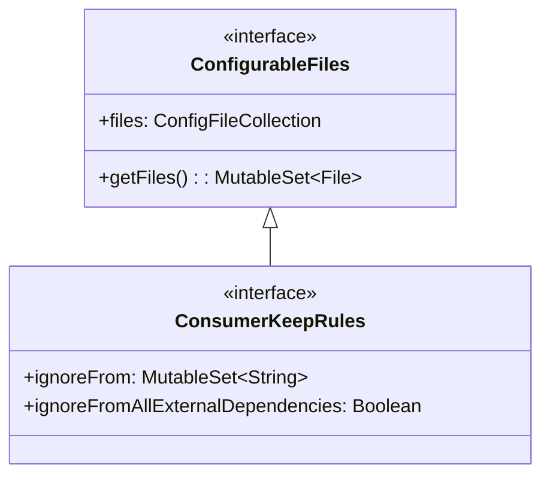

# 21.1.108 消费者保留规则

星光在帐篷顶部的透明窗格里闪烁，像是被谁不小心撒了一把碎钻。洛芙躺在睡袋里，一只手臂枕在脑袋下面，盯着那些光点发呆。

“还不睡？”黛琳的声音从旁边传来，带着一丝笑意。她盘腿坐在那儿，笔记本电脑放在膝盖上，屏幕的光映在她镜片上。

“刚才那个ConfigurableFiles我还没完全消化呢。”洛芙小声说，“感觉信息量好大......”

伊莎正在整理她的背包，听到这话抬起头来：“没关系呀，黛琳会慢慢讲的。对了，你之前说还有那个什么......ConsumerKeepRules？是今天要学的吗？”

黛琳点了点头，把笔记本转过来给大家看：“没错，今天我们要聊的就是这个——ConsumerKeepRules。看名字就知道，它和'保留规则'有关，实际上是ConfigurableFiles的子接口，专门用来处理库模块中的ProGuard或R8保留规则。”

“ProGuard我知道！”希尔从帐篷另一角探过头来，“就是那个用来混淆代码的工具对吧？把类名、方法名变成a、b、c那种。”

“对，就是它。”黛琳调出一张图，“但在讲ConsumerKeepRules之前，我们得先理解一个场景——当一个库（AAR）包含了ProGuard规则时，使用这个库的app会受到什么影响。”

帐篷外传来一阵阵蛙鸣，此起彼伏，像是在开一场深夜音乐会。洛芙翻了个身，支起下巴看着黛琳的屏幕。

---

### 库中的保留规则

黛琳在白板上画了一个简单的示意图：


“想象一下，”黛琳说，“你开发了一个SDK，里面有一些类是供外部调用的。为了防止这些类被R8错误地删除，你会在库里写好keep规则。当其他开发者引用你的SDK时，这些规则会自动合并到他们的app里。”

“那不是很好吗？”洛芙问。

“问题在于，”黛琳推了推眼镜，“有时候库里的规则会和app本身的规则冲突，或者库的规则根本不适合app的场景。这时候，ConsumerKeepRules就派上用场了。”

---

### 忽略库的保留规则

希尔拿来一台平板电脑上，在上面敲了几下，递给洛芙：“看，这是ConsumerKeepRules的两个核心属性。”

洛芙接过来，发现是Android官方文档的截屏：

> **ignoreFrom**: MutableSet<String> - Ignore keep rules from listed external dependencies.
> **ignoreFromAllExternalDependencies**: Boolean - Ignore keep rules from all the external dependencies.

“简单说，”黛琳解释道，“你可以选择性地忽略某些库的保留规则，或者干脆全部忽略。”

伊莎歪着头，像是在思考什么诗意的比喻：“就像......就像你在整理行李箱的时候，有些旧衣服的折叠方式是你妈妈帮你决定的，但你现在有了自己的审美，就可以把那些叠法'忽略'掉，自己重新叠？”

“差不多是这个意思！”黛琳笑了，“不过我们用代码来说明会更清晰。”

她在笔记本上写下了配置示例：

```kotlin
// build.gradle (app模块)
android {
    // ...
}

// 方式一：忽略所有外部依赖的keep规则
android.buildFeatures.buildConfig = true

android.consumerProguardFiles {
    // 忽略所有库的keep规则
    ignoreFromAllExternalDependencies = true
}

// 方式二：只忽略指定库的keep规则
android.consumerProguardFiles {
    ignoreFrom += "com.example:mylibrary:1.0.0"
    ignoreFrom += "com.example:otherlib:2.0.0"
}
```

洛芙盯着代码看了一会儿：“这个`consumerProguardFiles`......是不是就是ConsumerKeepRules？”

“对，它是DSL中的属性名。”黛琳点头，“在Gradle API里，ConsumerKeepRules是一个接口，它的具体实现会通过`consumerProguardFiles`这个属性暴露出来。”

---

### 实际应用场景

希尔打开一个真实项目的build.gradle文件：“我给你们看一个实际例子。之前我做的一个app，引用了一个图像处理库，那个库里面写了一条keep规则，把某个类及其子类全部保留。但我的app里用了R8的优化，想把一些确实没用的代码删掉，就因为这条规则，那部分代码始终删不掉。”

“后来怎么解决的？”洛芙问。

“后来我就在consumerProguardFiles里把那个库的规则忽略掉了。”希尔调出配置，“看，就像这样。”

```kotlin
android {
    buildTypes {
        release {
            // 启用R8进行代码混淆和优化
            minifyEnabled = true
            shrinkResources = true
            proguardFiles getDefaultProguardFile('proguard-android-optimize.txt'), 'proguard-rules.pro'
        }
    }
}

// 忽略特定库的keep规则
android.consumerProguardFiles {
    // 忽略image-processor库的规则，因为它会影响我们的R8优化
    ignoreFrom += "com.example:image-processor:1.2.0"
}
```

洛芙若有所思：“所以当库的keep规则和app的优化需求冲突时，就可以用这种方式来解决......”

“没错，”黛琳说，“而且这个属性是Gradle自动处理的，不需要你手动去删库里的规则文件。”

---

### 进阶用法：条件性忽略

伊莎突然想到了什么：“如果我想在debug版本忽略规则，release版本保留规则，可以吗？”

黛琳眼中闪过一丝赞许：“很好的问题！当然可以，Gradle的 DSL 允许你根据buildType来做条件判断。”

```kotlin
android {
    consumerProguardFiles {
        // 根据当前buildType决定是否忽略
        // release版本需要更精细的控制，所以忽略库的规则
        // debug版本可以保留库的规则，方便调试
        if (getByName("release")) {
            ignoreFromAllExternalDependencies = true
        }
    }
}
```

洛芙哇了一声：“这样就可以针对不同版本做不同处理了！”

“对的，”黛琳说，“这就是ConsumerKeepRules的灵活之处。它让你在引用第三方库时，仍然保持对最终打包规则的控制权。”

---

### 理解继承关系

洛芙突然想起一个问题：“对了，你之前说ConsumerKeepRules是ConfigurableFiles的子接口，那它们是什么关系？”

黛琳在白板上画了一个简单的继承图：



“ConfigurableFiles是一个通用的接口，用来处理'可配置的文件'。”黛琳解释道，“它定义了如何获取、添加这些文件的方法。ConsumerKeepRules则在它的基础上，增加了专门针对'keep规则'的两个特殊属性——一个用来指定忽略哪些库的规则，一个用来一键忽略所有库的规则。”

“原来如此！”洛芙恍然大悟，“所以ConsumerKeepRules继承了ConfigurableFiles的能力，同时又扩展了自己的特有功能。”

---

### 完整配置示例

希尔把笔记本转过来，调出一个完整的项目配置：“我再给你们看一个更完整的例子，涵盖了我们今天学的所有知识点。”

```kotlin
android {
    namespace "com.example.myapp"
    compileSdk 34

    defaultConfig {
        applicationId "com.example.myapp"
        minSdk 24
        targetSdk 34
        versionCode 1
        versionName "1.0"
    }

    buildTypes {
        release {
            minifyEnabled true
            shrinkResources true
            // 启用R8优化
            proguardFiles getDefaultProguardFile('proguard-android-optimize.txt'), 'proguard-rules.pro'
        }
        debug {
            minifyEnabled false
        }
    }

    // 配置ConsumerKeepRules
    consumerProguardFiles {
        // 在release构建时，忽略所有库的keep规则
        // 这样R8可以更彻底地进行优化
        if (project.hasProperty("releaseBuild")) {
            ignoreFromAllExternalDependencies = true
        } else {
            // 在debug构建时，只忽略特定库的规则
            ignoreFrom += "com.example:problematic-lib:1.0.0"
        }
    }
}

dependencies {
    // 这些库的keep规则可能会被忽略
    implementation "com.example:problematic-lib:1.0.0"
    implementation "com.example:image-processor:1.2.0"
    implementation "com.example:network-utils:2.5.0"
}
```

洛芙认真看完，点了点头：“我现在理解了整个流程。首先，库会自带ProGuard规则；然后，主app可以通过ConsumerKeepRules来控制是否使用这些规则；最后，R8会根据最终的规则文件来进行代码优化和混淆。”

“总结得很好！”黛琳笑着说。

---

夜深了，帐篷外的蛙鸣渐渐稀疏下去，取而代之的是远处湖面上偶尔传来的水鸟叫声。星光依然明亮，但洛芙的眼皮开始有些发沉。

“所以，”洛芙打了个小小的哈欠，“ConsumerKeepRules就是用来告诉Gradle'这个库的keep规则我不想要，你合并的时候别把它加进来'......对吧？”

“对，”黛琳轻声说，“就是这样一个简单的开关。但有时候，简单的东西恰恰是最有用的。”

伊莎把最后一件东西收进背包：“今天学的两个——ConfigurableFiles和ConsumerKeepRules——感觉像是一套工具，一个管一般配置文件，一个专门管keep规则。”

“没错，”黛琳合上笔记本，“它们都是为了让库的使用者能够更好地控制最终的构建配置。”

洛芙翻了个身，找了个舒服的姿势蜷缩在睡袋里。帐篷里的露营灯已经被黛琳轻轻熄灭了，只有星光透过窗格洒进来，在每个人的脸上投下细碎的光斑。

“晚安。”她闭上眼睛，声音软软的。

“晚安。”三个声音轻轻回应。

夜色渐浓，湖边的夏夜恢复宁静，只有微风轻轻拂过帐篷，带走最后一丝暑热。

---

## 专业技术总结

> **ConsumerKeepRules** — Android Gradle DSL中用于控制是否接受库模块中ProGuard/R8保留规则的接口，继承自ConfigurableFiles，提供两种忽略策略：按库名忽略和全部忽略。

#### 结构图

```mermaid
classDiagram
    class AndroidGradlePlugin {
        +consumerProguardFiles: ConsumerKeepRules
    }
    class ConfigurableFiles {
        <<interface>>
        +files: ConfigFileCollection
    }
    class ConsumerKeepRules {
        <<interface>>
        +ignoreFrom: MutableSet~String~
        +ignoreFromAllExternalDependencies: Boolean
    }
    class LibraryModule {
        +proguard-rules.pro
    }
    class AppModule {
        +consumerProguardFiles配置
    }
    
    ConfigurableFiles <|-- ConsumerKeepRules
    AndroidGradlePlugin --> ConsumerKeepRules
    LibraryModule -->|包含| AppModule
    AppModule -->|应用| ConsumerKeepRules
```

#### 复杂度与影响

- ConsumerKeepRules本身配置简单，但在大型项目中影响显著：正确使用可让R8优化更彻底，减少APK体积；错误使用可能导致关键类被误删，应用崩溃。
- 建议在release构建中使用，debug构建保留库规则以便调试。

#### 反模式与陷阱

1. **在debug构建时启用ignoreFromAllExternalDependencies** — 会导致无法调试被混淆的代码，堆栈信息不可读。
2. **忽略规则后未测试** — 直接导致运行时NoSuchFieldError或ClassNotFoundException，应在发布前用`./gradlew assembleRelease`验证。
3. **同时使用keep和ignoreFrom** — 两者作用于不同场景，但若对同一库同时配置可能产生混淆，建议明确策略。

#### 名词小传

- **ProGuard**：Java字节码混淆工具，R8是其继任者，专为Android优化。
- **ConsumerProguardFiles**：DSL中暴露ConsumerKeepRules的属性名，用于配置忽略规则。

#### 设计哲学

ConsumerKeepRules体现了Android Gradle Plugin的**消费者主权**思想：库作者提供的默认配置不应强制要求使用者接受，而应允许使用者在必要时override。这一设计让大型生态系统的兼容性得以保障。

---

## 动手练习

### 目标
掌握ConsumerKeepRules的使用方法，能够在项目中配置忽略库的ProGuard规则。

### 步骤

**Task 1：创建一个包含ProGuard规则的库模块**

1. 在Android项目中新建library模块`mylibrary`
2. 在`mylibrary/proguard-rules.pro`中添加：
   ```proguard
   -keep class com.example.mylibrary.** { *; }
   -keepclassmembers class com.example.mylibrary.Util { public static void doSomething(); }
   ```

**Task 2：在app模块中引用该库并配置consumerProguardFiles**

1. 在app的`build.gradle`中添加依赖：
   ```kotlin
   implementation project(':mylibrary')
   ```
2. 配置consumerProguardFiles，添加：
   ```kotlin
   android.consumerProguardFiles {
       ignoreFrom += ":mylibrary"
   }
   ```

**Task 3：验证混淆效果**

1. 执行`./gradlew assembleRelease`
2. 使用`./gradlew build analyzeReleaseApk`或反编译工具检查APK
3. 确认`com.example.mylibrary.**`类是否被保留或被混淆

**Task 4：切换到忽略所有规则**

1. 修改配置为`ignoreFromAllExternalDependencies = true`
2. 重新构建并分析APK
3. 对比Task 3的结果差异

**验收标准**

- [ ] 库模块包含proguard-rules.pro文件
- [ ] app模块正确配置了consumerProguardFiles
- [ ] 分别使用两种配置构建release APK
- [ ] 分析并对比两次构建的APK内容差异
- [ ] 能够解释为什么R8的行为会不同

---

## 学习建议

> ConsumerKeepRules是处理库依赖时的“调优开关”。在实际项目中，建议先保留库的默认规则进行测试，确认无问题后再考虑是否需要忽略。发布前务必在真机上进行完整测试，避免R8误删关键代码。

---

## 洛芙的小小日记本

今天学的是ConsumerKeepRules～就是可以忽略库里面的ProGuard规则的那个开关！黛琳说就像妈妈的叠衣服方式可以不接受一样，我们可以自己决定要不要保留库的规则。release版本可以用debug版本不要用不然调试会很痛苦！✿

---

## 今日关键词

- **ConsumerKeepRules**：Android Gradle DSL接口，用于控制是否忽略库模块中的ProGuard/R8保留规则，继承自ConfigurableFiles。
- **consumerProguardFiles**：DSL中暴露ConsumerKeepRules的属性名。
- **ignoreFrom**：ConsumerKeepRules的属性，类型为MutableSet<String>，用于指定忽略哪些外部依赖的keep规则。
- **ignoreFromAllExternalDependencies**：ConsumerKeepRules的属性，类型为Boolean，设为true时忽略所有外部依赖的keep规则。
- **ProGuard**：Java字节码混淆工具，负责压缩、优化和混淆Java/Kotlin字节码。
- **R8**：Google推出的代码混淆和压缩工具，是ProGuard的继任者，专为Android设计。
- **ConfigurableFiles**：Gradle DSL中处理可配置文件的父接口，ConsumerKeepRules继承自它。
- **AAR**：Android Archive，Android库的打包格式，可包含代码、资源和ProGuard规则文件。
- **minifyEnabled**：Gradle中启用代码混淆的开关，设为true时R8/ProGuard会处理代码。
- **shrinkResources**：Gradle中启用资源压缩的开关，移除未使用的资源文件。
