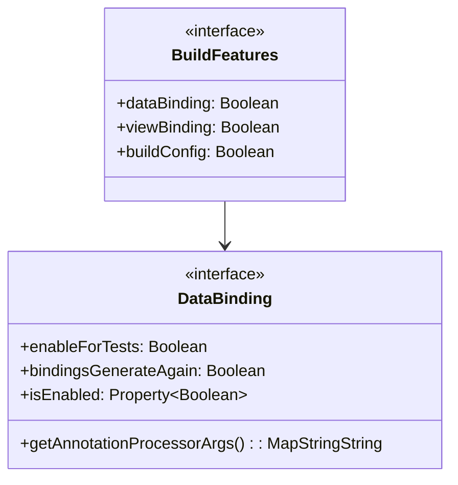
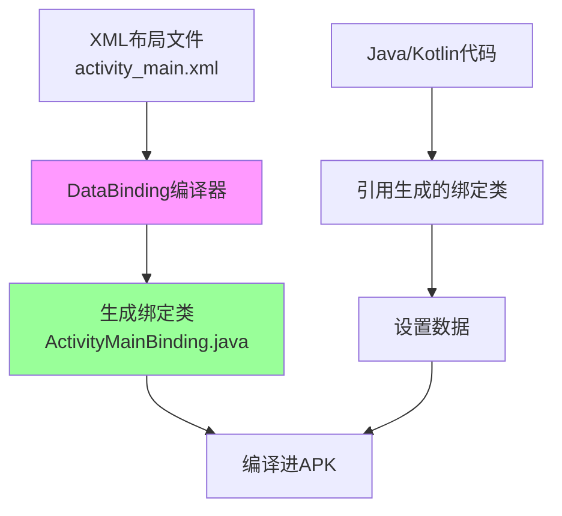
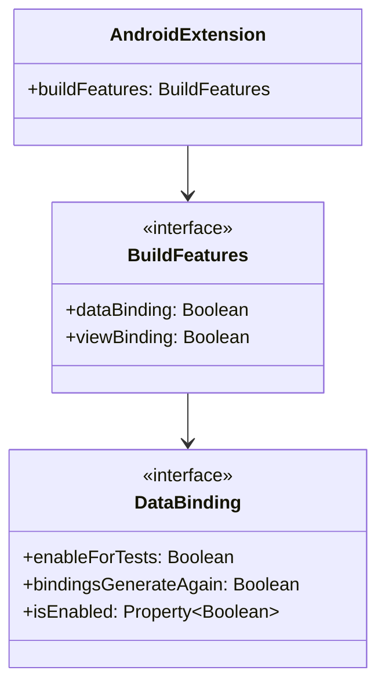

# 21.1.109 数据绑定

星光像细碎的钻石，撒在帐篷的透明窗格上。洛芙蜷缩在睡袋里，手里的热可可已经凉透了，但她还是舍不得放手——杯壁上的温度透过手心，一点点渗进心里。

“黛琳，”她轻声开口，“ConsumerKeepRules我好像懂了，就是可以忽略库的ProGuard规则嘛。可是刚才你说的那个DataBinding......到底是什么呀？”

黛琳正在收拾她的白板，听到这话抬起头来：“怎么，还睡不着呢？”

“好奇嘛。”洛芙吐了吐舌头，“而且今天学了好多个Files相关的接口，ConfigurableFiles啦，ConsumerKeepRules啦，现在又冒出个DataBinding......感觉脑子快要装不下了。”

伊莎在旁边嗤嗤地笑：“那就不急着想呀。慢慢来，就像露营一样——着急的话就看不到星星了。”

希尔从帐篷角落翻出一本小册子：“洛芙问得好。DataBinding和今天学的那些确实不太一样——它是专门管UI的。这么说吧，你之前写Activity的时候，是不是要写很多`findViewById()`？”

洛芙点头：“对呀，每次要找控件，烦死了。”

“那如果有一种方法，能让XML layouts直接认识你代码里的变量，你就不需要findViewById了。”希尔把册子递过去，“这就是DataBinding——数据绑定。”

---

## DataBinding是什么

黛琳把白板重新架好，开始画图：“在说DataBinding之前，我们先来看看没有它的时候，你们通常怎么写UI。”

她在白板上写下两段代码对比：

```kotlin
// 没有DataBinding的时候
class MainActivity : AppCompatActivity() {
    override fun onCreate(savedInstanceState: Bundle?) {
        super.onCreate(savedInstanceState)
        setContentView(R.layout.activity_main)
        
        // 手动查找视图
        val textView: TextView = findViewById(R.id.text_view)
        val button: Button = findViewById(R.id.button)
        
        // 手动设置数据
        textView.text = "Hello World"
        button.setOnClickListener {
            // 处理点击
        }
    }
}
```

“然后呢，”黛琳继续写，“如果有DataBinding，会变成什么样？”

```kotlin
// 使用DataBinding的时候
class MainActivity : AppCompatActivity() {
    private lateinit var binding: ActivityMainBinding
    
    override fun onCreate(savedInstanceState: Bundle?) {
        super.onCreate(savedInstanceState)
        binding = ActivityMainBinding.inflate(layoutInflater)
        setContentView(binding.root)
        
        // 数据直接绑定到视图
        binding.textView.text = "Hello World"
        binding.button.setOnClickListener {
            // 处理点击
        }
    }
}
```

洛芙歪着头看：“这看起来也就是少了`findViewById`而已嘛......有什么区别吗？”

“有区别的，”黛琳推了推眼镜，“这只是最基础的用法。DataBinding真正强大的地方，是双向绑定和表达式语言。”

伊莎递过来一杯温水：“我有个比喻——你想象一下呀，普通的方式呢，就像你和对象之间隔着一扇玻璃窗，你要看它就得贴着窗户看，找它就得伸手去指。但DataBinding呢，就像你们之间没有玻璃了，直接就能看到对方，交流起来特别顺畅。”

---

## XML中的绑定表达式

希尔打开电脑，调出一个布局文件示例：“洛芙，看这个。在使用了DataBinding的XML里，你可以直接在布局文件里写表达式。”

```xml
<?xml version="1.0" encoding="utf-8"?>
<layout xmlns:android="http://schemas.android.com/apk/res/android">
    
    <data>
        <variable
            name="user"
            type="com.example.app.User" />
    </data>
    
    <LinearLayout
        android:layout_width="match_parent"
        android:layout_height="match_parent"
        android:orientation="vertical">
        
        <!-- 直接在XML中使用user对象的属性 -->
        <TextView
            android:layout_width="wrap_content"
            android:layout_height="wrap_content"
            android:text="@{user.name}" />
        
        <TextView
            android:layout_width="wrap_content"
            android:layout_height="wrap_content"
            android:text="@{String.valueOf(user.age)}" />
        
        <!-- 表达式也是可以的 -->
        <TextView
            android:layout_width="wrap_content"
            android:layout_height="wrap_content"
            android:text="@{user.isAdult ? \"已成年\" : \"未成年\"}" />
        
    </LinearLayout>
</layout>
```

洛芙眼睛亮了起来：“所以这些`@{user.name}`是直接在XML里写代码？！”

“对，这就是DataBinding的表达式语言。”黛琳说，“你可以在XML里写简单的Java表达式，比如算术运算、字符串拼接、三元运算符、方法调用等等。”

“但是太复杂的逻辑还是要在代码里写，”希尔补充道，“XML里只能放简单的表达式。设计原则是——UI的展示逻辑可以在XML里，但业务逻辑必须在代码里。”

---

## 在Gradle中启用DataBinding

洛芙翻了个身，趴在睡袋上：“那怎么在项目里开启DataBinding呢？”

“这个就要用到我们今天的主角了——DataBinding DSL。”黛琳调出build.gradle文件，“Android Gradle Plugin提供了DataBinding配置接口，让你在构建时控制DataBinding的各种特性。”

她在白板上写出配置示例：

```kotlin
android {
    ...
    buildFeatures {
        // 启用DataBinding
        dataBinding = true
        
        // 启用ViewBinding（这是另一个相关功能）
        viewBinding = true
    }
    
    // 配置DataBinding的各种选项
    dataBinding {
        // 是否启用增量编译
        enableForTests = true
        
        // 是否自动绑定δ（delta）来加速构建
        bindingsGenerateAgain = false
    }
}
```

“这只是gradle api的一个配置接口，”黛琳解释道，“真正使用DataBinding还需要在app的build.gradle里打开开关。”

---

## DataBinding DSL的各个属性

希尔加载了一幅图，详细解释DataBinding DSL的每个配置项：



“看起来好复杂的样子......”洛芙嘟囔道。

“其实很简单，”伊莎柔声说，“你只需要记住一个最重要的——`dataBinding = true`。就像你要用露营炉，就要先把它点燃。其他那些，都是调节火候大小的。”

黛琳笑着继续：“既然洛芙提到了，我们就一个个来说。”

**dataBinding.enableForTests**——这个属性控制是否在测试构建中也启用DataBinding。默认是true，所以通常不需要改。

**dataBinding.bindingsGenerateAgain**——这个有点意思。黛琳解释，有时候你修改了XML布局，但DataBinding的绑定类没有自动重新生成。设置为true可以强制重新生成。

**annotationProcessorArgs()**——这个是给DataBinding的注解处理器传参数的。比如你可以配置是否启用早期检查、是否生成调试信息等。

---

## DataBinding vs ViewBinding

洛芙突然举起手来：“我刚才看到了`viewBinding`，它和`dataBinding`有什么区别？”

希尔打了个响指：“问得好！很多人都会混淆这两个。”

她在白板上画了一个对比表：

| 特性 | DataBinding | ViewBinding |
|------|-------------|-------------|
| 功能 | 数据绑定 + UI绑定 | 仅UI绑定 |
| XML表达式 | 支持 | 不支持 |
| 代码侵入性 | 较大（需要修改XML） | 较小（自动生成） |
| 编译速度 | 较慢 | 较快 |
| 双向绑定 | 支持 | 不支持 |

“简单说，”希尔总结道，“ViewBinding是轻量版的DataBinding。如果你只需要少写findViewById，用ViewBinding就够了。如果你需要数据驱动UI、表达式、Observable等特性，才用DataBinding。”

洛芙若有所思：“就像......露营灯和手电筒的区别？手电筒（ViewBinding）只管照明，露营灯（DataBinding）除了照明还能调节亮度、甚至改变颜色？”

“对！这个比喻很贴切。”伊莎笑着说。

---

## 实战：配置一个带DataBinding的项目

黛琳把笔记本转过来：“我给你们演示一个完整的配置流程。”

**第一步：在build.gradle中启用**

```kotlin
android {
    ...
    buildFeatures {
        dataBinding = true
    }
}
```

**第二步：在XML中使用layout标签包裹**

```xml
<?xml version="1.0" encoding="utf-8"?>
<layout xmlns:android="http://schemas.android.com/apk/res/android">
    
    <data>
        <variable
            name="user"
            type="com.example.app.User" />
    </data>
    
    <!-- 原来的根布局 -->
    <androidx.constraintlayout.widget.ConstraintLayout
        android:layout_width="match_parent"
        android:layout_height="match_parent">
        
        <TextView
            android:id="@+id/name_text"
            android:text="@{user.name}"
            ... />
            
    </androidx.constraintlayout.widget.ConstraintLayout>
</layout>
```

**第三步：在Activity中使用**

```kotlin
class UserActivity : AppCompatActivity() {
    
    private lateinit var binding: ActivityUserBinding
    
    override fun onCreate(savedInstanceState: Bundle?) {
        super.onCreate(savedInstanceState)
        
        // inflate绑定类
        binding = ActivityUserBinding.inflate(layoutInflater)
        setContentView(binding.root)
        
        // 创建用户数据
        val user = User("洛芙", 20)
        
        // 绑定数据到视图
        binding.user = user
    }
}
```

洛芙看完后眼睛亮晶晶的：“这样就不需要findViewById了！而且直接用`binding.user = user`就能更新UI？”

“对，但是要实现自动更新，还需要Observable。”黛琳说，“这个我们以后会讲到。今天你先掌握基础就够了。”

---

## 常见的反模式与最佳实践

希尔突然严肃起来：“洛芙，我得跟你说一下常见的坑。”

她在白板上写了几种常见错误：

**反模式1：在XML里写复杂逻辑**

```xml
<!-- 不好的例子：XML里写了太多逻辑 -->
<TextView
    android:text="@{                      // 太复杂了！
        user.name.length() > 10 
        ? user.name.substring(0, 10) + \"...\"
        : user.name
    }" />
```

**重构后：把逻辑放到代码里**

```xml
<!-- 好的例子：XML只做简单的数据展示 -->
<TextView
    android:text="@{user.displayName}" />
```

```kotlin
// 在User类里提供计算好的属性
class User(val name: String) {
    val displayName: String
        get() = if (name.length > 10) name.substring(0, 10) + "..." else name
}
```

**反模式2：忘记给变量赋值导致NPE**

```kotlin
// 不好的例子：没有给user赋值
binding.user = null  // 可能导致空指针

// XML里写的是 @{user.name}，如果user为null就会崩溃
```

**重构后：使用默认值或者lateinit**

```kotlin
// 方式一：使用lateinit确保不为null
lateinit var user: User  // 万一没初始化，编译时就会报错

// 方式二：给XML提供默认值
android:text="@{user.name ?? \"未设置\"}"
```

**反模式3：DataBinding和ViewBinding同时启用导致混淆**

有些新手会同时启用两个，不知道该用哪个。

**最佳实践：按需选择**
- 新项目、UI简单 → ViewBinding
- 需要双向绑定、表达式 → DataBinding
- 两种都开启不会出错，但会增加构建时间

---

## DataBinding的构建过程

黛琳又画了一幅图，解释DataBinding是如何工作的：



“DataBinding在编译时会扫描所有带`<layout>`标签的XML，”黛琳解释道，“然后根据这些XML生成对应的绑定类。这些类会自动包含所有带ID的视图引用，你直接用`binding.textView`就能访问，不需要findViewById。”

洛芙好奇地问：“那生成的代码在哪里？我能看的吗？”

“可以的，”希尔说，“在app/build/generated/data_binding_base_class_source_out目录下能看到生成的文件。不过我不建议经常去看，知道原理就行了。”

---

## 进阶话题：双向绑定

伊莎见洛芙学得认真，轻声说：“洛芙呀，DataBinding还有个很厉害的功能叫双向绑定——就是UI变了数据会自动更新，数据变了UI也会自动更新。”

“就像......露营时的篝火？”洛芙问。

“咦，为什么这么说？”

“因为添柴火（数据），火就会变大（UI变化）；火太大了（UI），就要减少柴火（数据）呀！”洛芙兴奋地说。

伊莎笑得眼睛弯成月牙：“对呀对ire! 双向绑定就是这样的。”

黛琳补充道：“双向绑定的语法是在XML里用`@={user.name}`（注意是`@=`而不是`@`），通常用在EditText等用户输入控件上。”

```xml
<!-- 双向绑定示例 -->
<EditText
    android:text="@={user.name}"
    android:layout_width="match_parent"
    android:layout_height="wrap_content" />
```

“现在先不深入，”黛琳说，“你先把今天的知识消化了。双向绑定我们以后会专门讲。”

---

夜渐渐深了，帐篷外的蛙鸣还在继续，但声音已经变得稀疏。星光依然明亮，从窗格里洒下来，在每个人脸上投下细碎的光斑。

洛芙打了个小小的哈欠：“所以DataBinding就是......让XML layouts认识代码里的变量，这样就不用findViewById了，对吧？”

“对了一半，”黛琳轻声说，“它不只是省掉findViewById。最核心的价值是让UI代码变得更声明式——你告诉系统'我要显示这个数据'，系统帮你处理剩下的。”

“听起来有点像......施魔法？”洛芙昏昏欲睡地说。

“算是吧，”伊莎笑着说，“不过这个魔法需要先念对咒语——就是正确的配置和使用方法。”

洛芙闭上眼睛，嘴角带着笑：“明天一定要试试看......”

她的声音越来越轻，慢慢地缩进睡袋里。帐篷里的露营灯被黛琳轻轻吹灭，只有星光还在眨着眼睛。

“晚安。”三个声音轻声说。

---

## 专业技术总结

> **DataBinding** — Android Gradle DSL中用于配置数据绑定的接口，属于BuildFeatures的一部分。通过在Gradle中启用dataBinding属性，开发者可以在XML布局文件中直接使用绑定表达式，实现UI与数据的声明式关联，省去findViewById的繁琐。

#### 结构图



#### 复杂度与影响

- DataBinding配置简单，但在运行时带来显著的开发效率提升——减少样板代码、UI更新更流畅。同时会略微增加APK体积和编译时间。
- ViewBinding更轻量，适合只需要消除findViewById的场景。

#### 反模式与陷阱

1. **在XML中写复杂业务逻辑** — 导致代码难以维护，应将复杂逻辑移到数据类的计算属性或代码中。
2. **DataBinding和ViewBinding混用且不知区别** — 增加不必要的复杂度，应按需选择。
3. **变量未初始化导致运行时NPE** — XML引用@{user.name}时user为null会崩溃，建议使用lateinit或提供默认值。

#### 名词小传

- **DataBinding**：Android官方提供的声明式UI框架，让XML layouts可以直接绑定数据。
- **ViewBinding**：DataBinding的轻量替代品，只生成绑定类，不支持表达式。
- **Binding Expression**：DataBinding在XML中使用的`@{...}`语法，可在XML里写简单Java表达式。
- **双向绑定**：用`@={...}`语法，UI变化会同步回数据端。

#### 设计哲学

DataBinding体现了**声明式UI**的理念——开发者描述"呈现什么"而非"如何呈现"。这与现代UI框架（如Jetpack Compose、React）的发展方向一致。Android通过DataBinding让传统XML布局也能部分实现声明式编程，提升开发效率。

---

## 动手练习

### 目标
掌握在Android项目中配置和使用DataBinding的基本方法，能够使用绑定表达式在XML中展示数据。

### 步骤

**Task 1：创建项目并启用DataBinding**

1. 在Android Studio中创建新项目
2. 打开app/build.gradle，在android块中添加：

```kotlin
android {
    ...
    buildFeatures {
        dataBinding = true
    }
}
```

3. Sync项目，确认构建成功

**Task 2：创建带数据绑定的布局文件**

1. 修改activity_main.xml，外层包裹`<layout>`标签
2. 添加`<data>`节点，声明一个user变量
3. 在TextView中使用`@{user.name}`表达式

```xml
<?xml version="1.0" encoding="utf-8"?>
<layout xmlns:android="http://schemas.android.com/apk/res/android">
    
    <data>
        <variable
            name="user"
            type="com.example.databinddemo.User" />
    </data>
    
    <LinearLayout
        android:layout_width="match_parent"
        android:layout_height="match_parent"
        android:orientation="vertical"
        android:padding="16dp">
        
        <TextView
            android:layout_width="wrap_content"
            android:layout_height="wrap_content"
            android:text="@{user.name}" />
            
    </LinearLayout>
</layout>
```

3. 创建User类：

```kotlin
data class User(val name: String, val age: Int)
```

**Task 3：在Activity中使用DataBinding**

1. 修改MainActivity：

```kotlin
class MainActivity : AppCompatActivity() {
    
    private lateinit var binding: ActivityMainBinding
    
    override fun onCreate(savedInstanceState: Bundle?) {
        super.onCreate(savedInstanceState)
        
        binding = ActivityMainBinding.inflate(layoutInflater)
        setContentView(binding.root)
        
        binding.user = User("洛芙", 20)
    }
}
```

**Task 4：尝试表达式**

1. 在XML中添加更多表达式：

```xml
<TextView
    android:text="@{String.valueOf(user.age)}" />

<TextView
    android:text="@{user.age >= 18 ? \"已成年\" : \"未成年\"}" />
```

**Task 5：添加按钮点击事件**

1. 在User类中添加方法：

```kotlin
data class User(val name: String, val age: Int) {
    fun onClick() {
        Log.d("User", "Clicked: $name")
    }
}
```

2. 在XML中绑定点击事件：

```xml
<Button
    android:text="点击"
    android:onClick="@{user::onClick}" />
```

**验收标准**

- [ ] build.gradle中正确启用dataBinding
- [ ] XML布局使用`<layout>`标签包裹
- [ ] 在Activity中正确使用binding类
- [ ] 数据正确显示在UI上
- [ ] 能够使用表达式进行简单计算
- [ ] 能够绑定点击事件

---

## 学习建议

> DataBinding是Android从命令式UI向声明式UI过渡的重要一步。建议先用ViewBinding熟悉绑定类的使用，再根据需要升级到DataBinding。注意保持XML表达式简单，复杂逻辑放在代码里处理。

---

## 洛芙的小小日记本

今天学的是DataBinding！就是那个可以让XML layouts认识代码里变量的魔法～黛琳说学会了它就不用findViewById了，好开心！虽然还有双向绑定啦、表达式啦没学，但今天的基础已经够我玩一会儿啦。期待明天实操！✿

---

## 今日关键词

- **DataBinding**：Android Gradle DSL接口，用于在项目中启用数据绑定功能，属于BuildFeatures的一部分。
- **buildFeatures.dataBinding**：在build.gradle中启用DataBinding的开关，设为true后可以使用XML绑定表达式。
- **ViewBinding**：DataBinding的轻量替代品，只生成绑定类，不支持XML表达式。
- **Binding Expression**：DataBinding在XML中使用的`@{...}`语法，可在XML里进行简单数据展示和计算。
- **双向绑定**：用`@={...}`语法，UI变化会同步回数据端，常用于表单输入。
- **ActivityMainBinding**：DataBinding生成的绑定类，类名根据布局文件名自动生成。
- **lateinit**：Kotlin中的延迟初始化关键字，确保变量在使用前被赋值，避免空指针。
- **layout标签**：DataBinding布局文件的根标签，必须包裹整个布局，内含`<data>`节点声明变量。
- **data节点**：DataBinding XML中用于声明变量的节点，可定义多个variable。