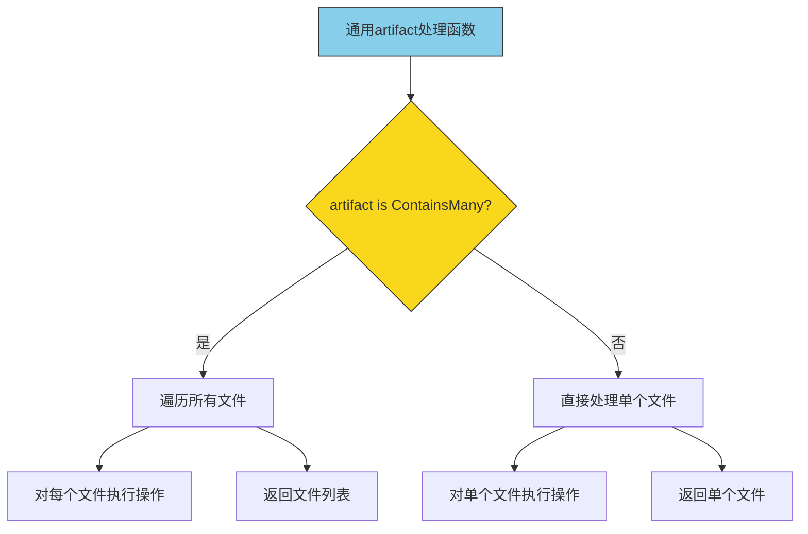
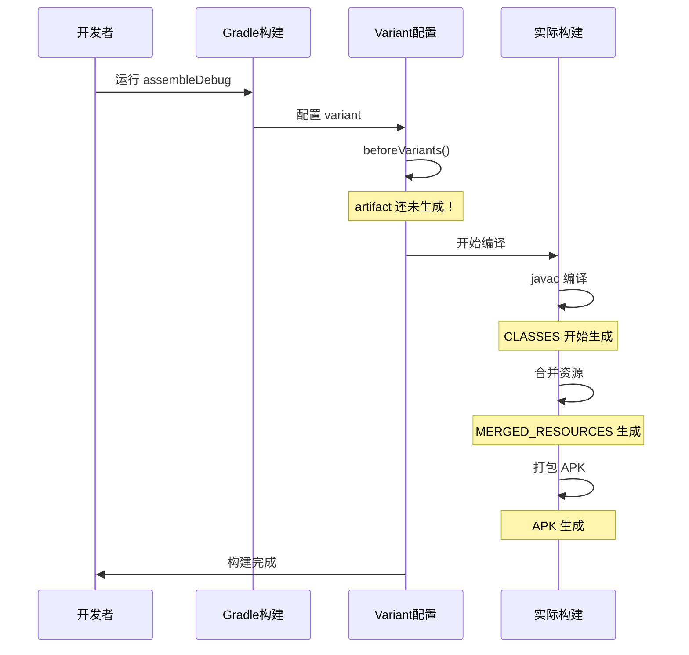

# 21.1.11 Artifact.ContainsMany

太阳已经爬到头顶了。

洛芙把帐篷的门帘掀开一条缝，热浪立刻涌进来，带着泥土和青草混合的气息。她赶紧又把帘子放下，回头看黛琳正在白板上画着什么。

"黛琳，在画什么呢？"洛芙凑过去，发现白板上画着一个大大的问号。

"昨天我们讲了 Artifact 的四种分类，"黛琳转过身来，手里拿着白板笔，"今天要讲一个和 MULTIPLE 类别特别相关的接口——ContainsMany。"

"ContainsMany？"洛芙眨眨眼，"听起来像是'包含很多'的意思？"

"没错，"黛琳笑着点点头，"ContainsMany 就是一个用来检查'这个 artifact 里是不是包含了很多文件'的接口。它主要针对的就是 MULTIPLE 类别的 artifact。"

伊莎从背包里翻出一把折叠扇，递给洛芙："先扇扇风，看你满头大汗的。"

"谢谢伊莎！"洛芙接过扇子，使劲扇了几下，"那……为什么需要检查 artifact 里有多少文件呢？"

希尔刚好从外面走进来，手里拿着两罐冰可乐："这个问题问得好！来，先喝一口降降温。"

洛芙接过可乐，罐子外壁凝结的水珠滴到她手指上，凉丝丝的。

"你知道吗，"希尔打开自己的那罐，"有些 artifact 是 SINGLE 的，比如 APK——它就是一个文件，你不需要检查它里面有多少东西。但有些 artifact 是 MULTIPLE 的，比如 CLASSES——它可能包含几十个甚至几百个 .class 文件。"

"所以就需要一个方法来知道里面到底有多少文件？"洛芙若有所思。

"对，"黛琳在白板上画了一个简单的图，"ContainsMany 接口就是做这个的——它告诉你当前的这个 artifact 是不是'包含很多文件'的。如果是，你就可以进一步操作这些文件；如果不是，你就知道它只是一个单独的文件。"

她在白板上写道：

```mermaid
graph TD
    A[Artifact] --> B{是否实现 ContainsMany?}
    B -->|是 MULTIPLE类别| C[可以检查文件数量]
    B -->|是 SINGLE类别| D[只有一个文件]
    B -->|是 APP...类别| E[可能支持追加]
    B -->|是 MERGEABLE类别| F[会自动合并]
    
    C --> C1[调用 getAdditionalObjects() 获取文件列表]
    C --> C2[调用 getElements() 获取文件元素]
    D --> D1[直接获取单个文件]
    
    style C fill:#90EE90,stroke:#333
    style D fill:#f9d71c,stroke:#333
```

洛芙盯着图看了又看："这个图好清楚！那……具体怎么用呢？"

希尔把电脑搬到膝盖上："来，我给你演示一个真实的例子。"

她敲了一段代码：

```kotlin
// 示例：检查 CLASSES artifact 是否包含多个文件
android.applicationVariants.all { variant ->
    variant.artifacts.use { artifacts ->
        // 获取 CLASSES artifact（MULTIPLE 类别）
        val classes = artifacts.get(ArtifactType.CLASSES)
        
        // 检查是否实现了 ContainsMany 接口
        if (classes is ContainsMany) {
            println("CLASSES 包含多个文件！")
            // 获取文件元素列表
            val elements = classes.getElements()
            println("共有 ${elements.size} 个 class 文件")
            
            // 遍历每个文件
            elements.forEach { element ->
                println("  - ${element.name}")
            }
        }
    }
}
```

"等等，"洛芙举手提问，"这个 `classes` 变量的类型是什么？它是 `ContainsMany` 吗？"

黛琳点点头："问得好！在 Android Gradle Plugin 中，MULTIPLE 类别的 artifact 都会实现 `ContainsMany` 接口。这意味着你可以用 `as ContainsMany` 或者 `is ContainsMany` 来检查它。"

"那……SINGLE 类别的 artifact 呢？它们有 ContainsMany 吗？"洛芙又问。

"没有，"希尔接过话题，"SINGLE 类别的 artifact 只代表一个单独的文件，它不实现 ContainsMany 接口。这是有道理的——一个 APK 文件，你不需要去检查它里面有多少文件，因为它本身就是一个整体。"

伊莎轻轻补充道："这就像清点行李一样——如果是单独的一个行李箱，你只需要确认它在那里；但如果是好几件行李，你就需要一件一件数清楚。"

"原来如此！"洛芙恍然大悟，"那 ContainsMany 主要是用来处理 MULTIPLE 类别的 artifact 的，对吧？"

"对，"黛琳说，"不过还有一种情况——APP... 类别的 artifact 也可能实现 ContainsMany，因为它们也可能包含多个文件。比如 JniLibs，如果你在项目中添加了多个 native 库，它们就会以多个文件的形式存在。"

洛芙好奇地问："那……MERGEABLE 类别的 artifact 呢？它们有 ContainsMany 吗？"

"好问题，"黛琳笑了笑，"MERGEABLE 类别的 artifact 本身不实现 ContainsMany，因为它们的重点是'合并'而不是'包含多个文件'。但是——合并后的结果可能会是一个新的 artifact，这个结果可能实现 ContainsMany。"

希尔又敲出一段代码："来，让我们看一个更完整的例子，展示如何区分不同类别的 artifact——"

```kotlin
// 演示如何检查不同类别的 artifact
android.applicationVariants.all { variant ->
    variant.artifacts.use { artifacts ->
        // 检查 SINGLE 类别的 artifact
        val apk = artifacts.get(ArtifactType.APK)
        println("APK 是 ContainsMany 吗？${apk is ContainsMany}")
        // 输出：APK 是 ContainsMany 吗？false
        
        // 检查 MULTIPLE 类别的 artifact
        val classes = artifacts.get(ArtifactType.CLASSES)
        println("CLASSES 是 ContainsMany 吗？${classes is ContainsMany}")
        // 输出：CLASSES 是 ContainsMany 吗？true
        
        // 检查 MERGEABLE 类别的 artifact
        val mergedManifest = artifacts.get(ArtifactType.MERGED_MANIFEST)
        println("MERGED_MANIFEST 是 ContainsMany 吗？${mergedManifest is ContainsMany}")
        // 输出：MERGED_MANIFEST 是 ContainsMany 吗？false
    }
}
```

洛芙看着这段代码："哦！所以用 `is ContainsMany` 就可以知道这个 artifact 是不是'包含多个文件'的。"

"对，"黛琳说，"这是最直接的方法。不过——"她话锋一转，"在实际项目中，你可能不需要频繁使用 `is ContainsMany` 检查，因为大多数情况下你已经知道你在操作哪种 artifact 了。"

"那……什么时候会用到呢？"洛芙歪着头问。

黛琳重新翻到白板的新的一页："当你在写一个通用的 artifact 处理逻辑时——比如你要写一个函数，这个函数可以处理任何类型的 artifact，但你需要根据它是否包含多个文件来采取不同的操作。"

她在白板上画了一个示例：



洛芙看着图："这个图……好像一个通用的处理流程啊！"

"对，"黛琳笑着说，"这就是 ContainsMany 的实际用途——让你的代码可以同时处理单个文件和多个文件，而不需要为每种情况写不同的逻辑。"

希尔补充道："而且，ContainsMany 接口还提供了两个重要的方法——"

她在电脑上敲出这两个方法的定义：

```kotlin
// ContainsMany 接口的定义（简化版）
interface ContainsMany<T : ArtifactType> {
    // 获取所有的文件元素
    fun getElements(): Collection<FileSystemLocation>
    
    // 获取额外的对象（如果有的话）
    fun getAdditionalObjects(): Collection<Any>
}
```

"这两个方法有什么用呢？"洛芙问。

黛琳解释道："`getElements()` 是最常用的——它返回这个 artifact 包含的所有文件的列表。你可以用它来遍历、检查、甚至修改这些文件。"

"而 `getAdditionalObjects()` 呢？"洛芙又问。

"这个方法稍微复杂一点，"黛琳说，"它返回的是一些额外的对象，可能包括中间生成的文件、临时文件等等。大多数情况下，你会用到的是 `getElements()`，而不是这个。"

伊莎轻轻插话："就像清点行李的时候，你主要关注的是'有哪些行李'，而不是'行李里面还有什么小东西'。"

"伊莎的比喻好贴切！"洛芙笑着说。

希尔又敲出一段代码，展示 `getElements()` 的实际用法：

```kotlin
// 演示 getElements() 的用法
android.applicationVariants.all { variant ->
    variant.artifacts.use { artifacts ->
        val classes = artifacts.get(ArtifactType.CLASSES)
        
        // 确保是 ContainsMany 类型
        if (classes is ContainsMany) {
            val elements = classes.getElements()
            
            println("===== CLASSES 文件列表 =====")
            println("总计：${elements.size} 个文件")
            println("")
            
            // 按模块分组统计
            val moduleCounts = mutableMapOf<String, Int>()
            elements.forEach { element ->
                val path = element.asFile().absolutePath
                // 简单提取模块名
                val moduleName = path.substringAfter("intermediates/javac/")
                    .substringBefore("/")
                moduleCounts[moduleName] = (moduleCounts[moduleName] ?: 0) + 1
            }
            
            moduleCounts.forEach { (module, count) ->
                println("模块 $module: $count 个 class 文件")
            }
        }
    }
}
```

洛芙盯着这段代码看："这个例子好实用！它不只是列出文件，还按模块统计了数量。"

"对，"黛琳说，"这在实际开发中很有用——比如你要分析编译产物的大小、或者检查某个模块是否正确生成了 class 文件。"

"那……有没有什么需要注意的坑呢？"洛芙问。

黛琳的表情变得认真起来："有！非常重要的一点——你在访问 artifact 的时候，它们可能还没有生成。"

"哈？"洛芙愣了一下。

"是这样的，"黛琳解释道，"artifact 是在构建过程中逐步生成的。如果你尝试在构建早期（比如在 `beforeVariants` 回调中）访问 CLASSES，它们可能还不存在。"

她在白板上画了一个时间线：



洛芙看着这个图："所以……如果我在不同时机访问 artifact，得到的结果会不一样？"

"对，"黛琳说，"这就是为什么 AGP 提供了不同的回调时机——`whenEvaluated`、`finalizedBy`、`use` 等等。你需要根据你的需求选择正确的时机。"

希尔补充道："来，让我给你展示一个常见的错误和正确的做法——"

```kotlin
// ❌ 错误示例：在 beforeVariants 中访问 artifact
android.beforeVariants { variant ->
    // 此时 artifact 还没有生成！
    val classes = variant.artifacts.get(ArtifactType.CLASSES)
    // 这可能会抛出异常，或者返回空结果
    if (classes is ContainsMany) {
        val elements = classes.getElements() // 可能为空或不完整
    }
}

// ✅ 正确做法：在 finalizeDsl 或更晚的时机访问
android.applicationVariants.all { variant ->
    variant.artifacts.use { artifacts ->
        // 在这里访问 artifact 是安全的
        val classes = artifacts.get(ArtifactType.CLASSES)
        if (classes is ContainsMany) {
            val elements = classes.getElements()
            println("CLASSES 包含 ${elements.size} 个文件")
        }
    }
}
```

洛芙看着这段对比："原来时机这么重要！那……怎么知道什么时候访问是安全的呢？"

黛琳说："一个简单的方法是——使用 `variant.artifacts.use` 或者在 `all` 回调中访问。这些回调是在 artifact 准备好之后才执行的。"

伊莎轻轻补充："就像露营时要等到火生好了才能烤棉花糖——你不能在火还没生好的时候就急着去烤。"

"伊莎的比喻好可爱！"洛芙笑着说。

黛琳继续说道："还有一个要注意的点——`getElements()` 返回的是 `Collection<FileSystemLocation>`，而不是 `Collection<File>`。"

"有什么区别吗？"洛芙问。

"FileSystemLocation 是 Gradle 7.0 引入的新类型，"黛琳解释说，"它比 File 更加抽象，代表的是文件系统中某个位置。可以是真实文件，也可以是虚拟文件或者目录。"

她在电脑上敲出转换方法：

```kotlin
// FileSystemLocation 转换为 File
val classes = artifacts.get(ArtifactType.CLASSES)
if (classes is ContainsMany) {
    classes.getElements().forEach { location ->
        // 转换为 File
        val file = location.asFile()
        
        // 或者获取路径字符串
        val path = location.asPath()
        
        println("文件: ${file.name}, 路径: $path")
    }
}
```

洛芙似懂非懂地点点头："原来是这样……那也就是说，FileSystemLocation 就像是一个更通用的'文件位置'概念，可以指向任何东西。"

"对，"黛琳说，"这样设计是为了让 Gradle 可以支持更多的文件系统类型，比如虚拟文件系统、内存文件系统等等。"

太阳慢慢偏西，帐篷里的光线变得柔和了一些。洛芙伸了个懒腰，感觉今天的知识又充实了一层。

"黛琳，"洛芙忽然想起一个问题，"你说 ContainsMany 主要是给 MULTIPLE 用的，那……有没有什么情况下 SINGLE 类别的 artifact 也会用到它？"

黛琳思考了一下："这个问题很深入。实际上，在某些情况下，即使是 SINGLE 类别的 artifact，内部也可能包含多个文件——比如一个 ZIP 文件，里面可能有很多内容。"

"那这种情况下，也需要 ContainsMany 吗？"洛芙问。

"不需要，"黛琳解释说，"因为从 API 的角度来看，SINGLE 类别的 artifact 仍然被当作'单个文件'来处理。即使这个文件内部包含很多内容，对 Gradle 来说，它只是一个文件。"

"如果想要检查 APK 里面有多少文件呢？"洛芙又问。

"那就不是 ContainsMany 的职责了，"希尔接过话题，"你需要用其他工具来检查——比如用 `unzip -l` 命令查看 APK（它本质是一个 ZIP 文件）的内容，或者用 Android Studio 的 APK Analyzer。"

"原来如此！"洛芙明白了。

黛琳总结道："总的来说，ContainsMany 接口的作用就是——让你可以统一地处理'单个文件'和'多个文件'这两种情况。当你不知道你要处理的 artifact 到底是一个文件还是多个文件时，用 `is ContainsMany` 检查一下就可以了。"

洛芙若有所思地点点头："这好像一个通用的检查器——不管是哪种 artifact，都可以问一句'你里面有很多文件吗？'"

"对！"黛琳笑着说，"洛芙，你的理解越来越到位了。"

伊莎轻声说："天色不早了，今天的露营学习就先到这里吧。"

洛芙看向窗外，发现夕阳已经染红了远处的山坡。她满足地叹了口气，今天又学到了新东西呢。

<!-- TECH_EXPERT_START -->

## 技术总结

### 核心机制定义

**Artifact.ContainsMany** —— Android Gradle Plugin 中用于检查 artifact 是否包含多个文件的接口。它继承自 `ArtifactType`，主要与 MULTIPLE 类别的 artifact 配合使用，提供 `getElements()` 方法获取文件列表，以及 `getAdditionalObjects()` 获取额外对象。SINGLE 类别的 artifact 不实现此接口，因为它们代表单个不可分割的文件。

### 结构图

```mermaid
graph TD
    subgraph ContainsMany接口
        A[ContainsMany<T>]
    end
    
    subgraph 核心方法
        A --> B[getElements(): Collection&lt;FileSystemLocation&gt;]
        A --> C[getAdditionalObjects(): Collection&lt;Any&gt;]
    end
    
    subgraph 实现类别
        B --> D[MULTIPLE类别]
        B --> E[部分APP...类别]
        D --> F[CLASSES]
        D --> G[LOCAL_JAVA_RESOURCES]
        E --> H[JNI_LIBS]
    end
    
    subgraph 非实现类别
        I[SINGLE类别]
        I --> I1[APK]
        I --> I2[BUNDLE]
        J[MERGEABLE类别]
        J --> J1[MERGED_MANIFEST]
        J --> J2[MERGED_RESOURCES]
    end
    
    style A fill:#87CEEB,stroke:#333
    style D fill:#90EE90,stroke:#333
    style I fill:#f9d71c,stroke:#333
    style J fill:#FFB6C1,stroke:#333
```

### 反模式与陷阱

**反模式一：在构建早期访问尚未生成的 artifact**
```kotlin
// ❌ 错误示例：在 beforeVariants 中访问 CLASSES
android.beforeVariants { variant ->
    val classes = variant.artifacts.get(ArtifactType.CLASSES)
    // 此时 artifact 尚未生成，getElements() 可能返回空
}

// ✅ 正确做法：在 applicationVariants.all 回调中访问
android.applicationVariants.all { variant ->
    variant.artifacts.use { artifacts ->
        val classes = artifacts.get(ArtifactType.CLASSES)
        if (classes is ContainsMany) {
            val elements = classes.getElements()
            // 此时 artifact 已经生成，可以安全访问
        }
    }
}
```

**反模式二：混淆 FileSystemLocation 和 File**
```kotlin
// ❌ 错误示例：直接当作 File 使用
classes.getElements().forEach { element ->
    // 错误：element 是 FileSystemLocation，不是 File
    val length = element.length() // 编译错误！
}

// ✅ 正确做法：先转换为 File
classes.getElements().forEach { location ->
    val file = location.asFile()
    val length = file.length() // 正确
}
```

**反模式三：假设所有 artifact 都实现 ContainsMany**
```kotlin
// ❌ 错误示例：不做检查直接调用
val apk = artifacts.get(ArtifactType.APK)
val elements = apk.getElements() // 编译错误！APK 不实现 ContainsMany

// ✅ 正确做法：先检查类型
val apk = artifacts.get(ArtifactType.APK)
if (apk is ContainsMany) {
    val elements = apk.getElements()
} else {
    println("APK 是单个文件，不需要检查文件列表")
}
```

### 设计哲学

**1. 统一的接口设计**
ContainsMany 接口提供了一种统一的方式来处理"单个文件"和"多个文件"两种情况。这种设计让开发者可以用相同的代码逻辑处理不同的 artifact 类型，而不需要为每种情况写专门的代码。

**2. 延迟求值**
artifact 的内容是在构建过程中逐步生成的。ContainsMany 接口允许开发者在需要时才获取文件列表，而不是在配置阶段就预先加载所有信息。这提高了构建的配置效率。

**3. 类型安全**
通过 `is ContainsMany` 检查，开发者可以在编译时就知道当前操作的 artifact 是否包含多个文件。这种类型安全的检查比运行时判断更加可靠。

**4. FileSystemLocation 抽象**
使用 FileSystemLocation 而不是 File，体现了 Gradle 对不同文件系统类型的支持。这种抽象使得 Gradle 可以轻松支持虚拟文件系统、内存文件系统等新型存储方案。

---

## 动手练习

### ★ 检查 artifact 是否实现 ContainsMany
**目标**：理解如何检查 artifact 的类型  
**步骤**：
1. 在 build.gradle.kts 中获取一个 applicationVariant
2. 分别获取 APK、CLASSES、MERGED_MANIFEST 三种 artifact
3. 使用 `is ContainsMany` 检查每种类型
4. 打印检查结果

**验收标准**：能够区分 SINGLE、MULTIPLE、MERGEABLE 三种类别的 artifact

**提示**：
```kotlin
val apk = artifacts.get(ArtifactType.APK)
println("APK is ContainsMany: ${apk is ContainsMany}")
```

---

### ★★ 遍历 MULTIPLE artifact 的所有文件
**目标**：掌握 getElements() 方法的用法  
**步骤**：
1. 获取 CLASSES artifact
2. 确保它是 ContainsMany 类型
3. 调用 getElements() 获取文件列表
4. 遍历并打印每个文件的名称

**验收标准**：能够列出所有 class 文件的名称

**提示**：
```kotlin
val classes = artifacts.get(ArtifactType.CLASSES)
if (classes is ContainsMany) {
    classes.getElements().forEach { location ->
        println(location.asFile().name)
    }
}
```

---

### ★★★ 统计不同模块的 class 文件数量
**目标**：理解 MULTIPLE artifact 的实际用途  
**步骤**：
1. 获取 CLASSES artifact
2. 使用 getElements() 获取所有文件
3. 按模块名分组统计文件数量
4. 输出统计结果

**验收标准**：能够按模块统计 class 文件数量

**提示**：从文件路径中提取模块名，通常在 "intermediates/javac/" 后面

---

### ★★ 对比 SINGLE 和 MULTIPLE 的访问方式
**目标**：理解两种类别的差异  
**步骤**：
1. 获取 APK（SINGLE）和 CLASSES（MULTIPLE）
2. 尝试对两者使用相同的方式访问
3. 观察结果的差异
4. 总结两种类别的不同特点

**验收标准**：能够清晰说明 SINGLE 和 MULTIPLE 的访问差异

**提示**：SINGLE 直接获取单个文件，MULTIPLE 通过 getElements() 获取文件集合

---

### ★★★★ 编写通用的 artifact 处理函数
**目标**：掌握 ContainsMany 的实际应用场景  
**步骤**：
1. 编写一个函数，接收任意 artifact
2. 使用 `is ContainsMany` 检查类型
3. 根据检查结果采取不同处理方式
4. 测试函数对不同 artifact 类型的处理

**验收标准**：函数能够正确处理 SINGLE 和 MULTIPLE 两种 artifact

**提示**：
```kotlin
fun processArtifact(artifact: Any) {
    when (artifact) {
        is ContainsMany -> {
            // 处理多个文件
            val elements = artifact.getElements()
            println("处理 ${elements.size} 个文件")
        }
        else -> {
            // 处理单个文件
            println("处理单个文件")
        }
    }
}
```

---

### ★★★ 理解 FileSystemLocation 和 File 的区别
**目标**：掌握新的文件抽象类型  
**步骤**：
1. 获取一个 MULTIPLE 类别的 artifact
2. 调用 getElements() 获取 FileSystemLocation 列表
3. 分别使用 asFile() 和 asPath() 转换为不同类型
4. 比较两种转换方式的结果

**验收标准**：能够区分 FileSystemLocation、File、String 三种类型

**提示**：
```kotlin
val location = classes.getElements().first()
val file = location.asFile()        // 转换为 File
val path = location.asPath()        // 转换为 String 路径
```

---

### ★★★★ 分析 artifact 生成时机
**目标**：理解构建过程中 artifact 的可用时间  
**步骤**：
1. 在不同的回调时机（beforeVariants、all、finalizedBy）访问同一个 artifact
2. 记录每次访问的结果
3. 分析哪些时机可以安全访问

**验收标准**：能够说明为什么某些时机可以访问而某些时机不行

**提示**：在 beforeVariants 中 artifact 尚未生成，在 all 回调中可以安全访问

---

## 面试热身

### Q1: Artifact.ContainsMany 接口的作用是什么？

**答**：Artifact.ContainsMany 是 Android Gradle Plugin 提供的接口，用于检查 artifact 是否包含多个文件。它主要与 MULTIPLE 类别的 artifact 配合使用，提供了 `getElements()` 方法获取所有文件列表，以及 `getAdditionalObjects()` 获取额外对象。SINGLE 类别的 artifact 不实现此接口，因为它们代表单个不可分割的文件。通过 `is ContainsMany` 检查，开发者可以统一处理单个文件和多个文件两种情况。

---

### Q2: 如何区分 SINGLE、MULTIPLE、MERGEABLE 三种类别的 artifact？

**答**：可以通过两种方式区分。第一种是使用 `is ContainsMany` 检查——只有 MULTIPLE 类别（以及部分 APP... 类别）的 artifact 会实现 ContainsMany 接口，SINGLE 和 MERGEABLE 类别不会实现。第二种是查阅官方文档，AGP 的每个 ArtifactType 文档都会标明其所属的 Category。例如 APK 是 SINGLE 类别，CLASSES 是 MULTIPLE 类别，MERGED_MANIFEST 是 MERGEABLE 类别。

---

### Q3: getElements() 和 getAdditionalObjects() 有什么区别？

**答**：`getElements()` 返回的是 artifact 包含的所有文件的列表，返回类型是 `Collection<FileSystemLocation>`，这是最常用的方法。`getAdditionalObjects()` 返回的是一些额外的对象，可能包括中间生成的文件、临时文件、或者其他元数据。在大多数实际使用场景中，开发者只需要使用 `getElements()` 就足够了。

---

### Q4: 什么时候不适合使用 ContainsMany？

**答**：当你要操作的 artifact 明确是 SINGLE 类别时，不需要使用 ContainsMany。例如，APK 是 SINGLE 类别的 artifact，它本身就是一个完整的文件，不需要检查它里面有多少文件。另外，在构建早期（如 beforeVariants 回调中）访问 artifact 时，ContainsMany 的检查可能不准确，因为此时 artifact 可能还没有生成。

---

### Q5: FileSystemLocation 和 File 有什么区别？

**答**：FileSystemLocation 是 Gradle 7.0 引入的新类型，代表文件系统中某个位置。它比 File 更加抽象，可以指向真实文件、虚拟文件或目录。使用时需要调用 `asFile()` 方法转换为 File，或者调用 `asPath()` 方法转换为路径字符串。这种抽象设计让 Gradle 可以支持更多的文件系统类型，包括虚拟文件系统和内存文件系统。

---

## 参考实现要点

### 检查 artifact 类型

```kotlin
android.applicationVariants.all { variant ->
    variant.artifacts.use { artifacts ->
        // SINGLE 类别
        val apk = artifacts.get(ArtifactType.APK)
        println("APK is ContainsMany: ${apk is ContainsMany}") // false
        
        // MULTIPLE 类别
        val classes = artifacts.get(ArtifactType.CLASSES)
        println("CLASSES is ContainsMany: ${classes is ContainsMany}") // true
        
        // MERGEABLE 类别
        val manifest = artifacts.get(ArtifactType.MERGED_MANIFEST)
        println("MERGED_MANIFEST is ContainsMany: ${manifest is ContainsMany}") // false
    }
}
```

### 遍历文件列表

```kotlin
variant.artifacts.get(ArtifactType.CLASSES).let { classes ->
    if (classes is ContainsMany) {
        classes.getElements().forEach { location ->
            val file = location.asFile()
            println("Class file: ${file.name}, size: ${file.length()} bytes")
        }
    }
}
```

### 统计模块文件数量

```kotlin
val moduleFileCount = mutableMapOf<String, Int>()
classes.getElements().forEach { location ->
    val path = location.asFile().absolutePath
    val module = path.substringAfter("intermediates/javac/")
        .substringBefore("/")
    moduleFileCount[module] = (moduleFileCount[module] ?: 0) + 1
}
moduleFileCount.forEach { (module, count) ->
    println("$module: $count files")
}
```

### 通用 artifact 处理

```kotlin
fun handleArtifact(artifact: Any) {
    when (artifact) {
        is ContainsMany -> {
            val count = artifact.getElements().size
            println("Handling $count files")
        }
        else -> {
            println("Handling single artifact")
        }
    }
}
```

---

> Learning advice

理解 Artifact.ContainsMany 的关键是把握"统一接口"的设计思想——它让代码可以同时处理单个文件和多个文件，而不需要为每种情况写专门的逻辑。选择正确的时机访问 artifact（避免在构建早期），正确区分 FileSystemLocation 和 File，是在实际项目中正确使用此接口的关键。

---

## 洛芙的小小日记本

今天学会了Artifact.ContainsMany！原来检查artifact里有多少文件这么有用——就像清点行李一样，单个的确认在就好，很多件的要数清楚。黛琳说的对，选择正确的时机访问很重要——火还没生好的时候不能烤棉花糖呀～明天继续加油！

---

## 今日关键词

- **Artifact.ContainsMany**：检查 artifact 是否包含多个文件的接口
- **ContainsMany**：ContainsMany 接口的简称
- **getElements()**：获取 artifact 包含的所有文件列表的方法
- **getAdditionalObjects()**：获取 artifact 额外对象的方法
- **FileSystemLocation**：Gradle 7.0 引入的文件位置抽象类型
- **MULTIPLE**：包含多个文件的 artifact 类别
- **SINGLE**：单个不可分割的 artifact 类别
- **MERGEABLE**：可合并的 artifact 类别
- **ArtifactType**：具体的人工制品类型定义
- **beforeVariants**：构建早期的回调时机
- **applicationVariants.all**：安全的 artifact 访问时机
