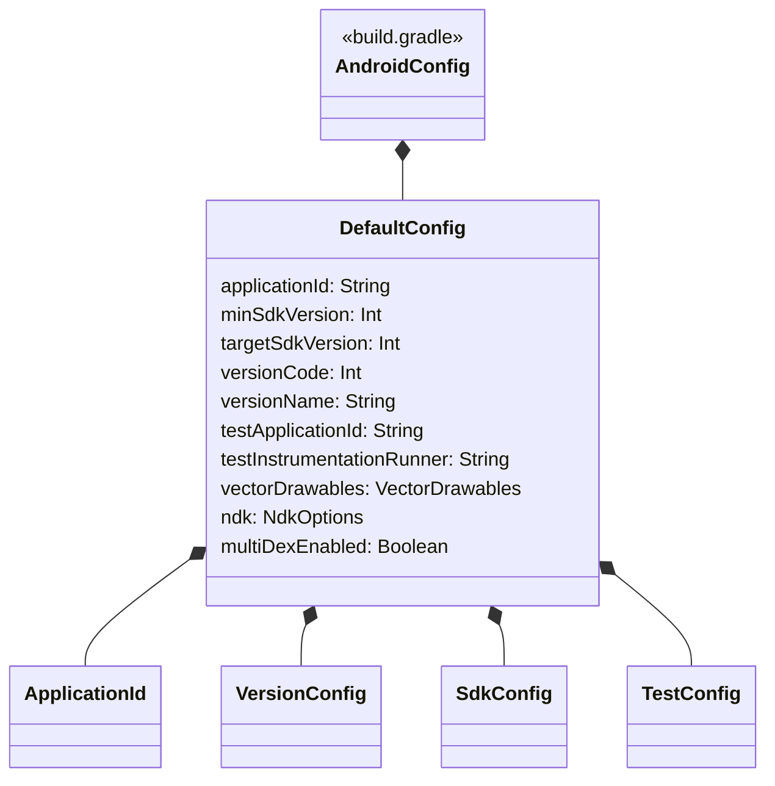

# 21.1.110 默认配置

夏夜的星空像撒在天幕上的碎钻，帐篷外的蛙鸣一阵接着一阵。露营灯在帐篷内投下暖黄色的光晕，洛芙盘腿坐在睡袋上，手边摊着黛琳的笔记本电脑。

“DataBinding的入门我们已经讲完了，”黛琳把白板笔收进笔袋，“但如果要真正开始写一个项目，还有另一个绕不开的东西——DefaultConfig。”

“又是配置？”洛芙眨了眨眼，“上次DataBinding也是在build.gradle里配置的嘛。”

“不一样，”希尔正在整理数据线，头也不抬地说，“DataBinding是功能开关，DefaultConfig是地基。没有地基，房子盖不起来的。”

洛芙似懂非懂地点点头。伊莎把温水瓶递过来，她双手接过，温度从掌心蔓延开来。

“先看看你们的项目，”黛琳把笔记本转过来，指着屏幕上打开的build.gradle文件，“知道这些数字都什么意思吗？”

洛芙看向屏幕：

```kotlin
android {
    defaultConfig {
        applicationId "com.example.campingapp"
        minSdkVersion 24
        targetSdkVersion 34
        versionCode 1
        versionName "1.0"
        
        testInstrumentationRunner "androidx.test.runner.AndroidJUnitRunner"
    }
}
```

“applicationId我知道，是应用包名，”洛芙指着屏幕，“minSdkVersion……最低的SDK版本？那是什么？”

黛琳笑了笑，从背包里翻出一张皱巴巴的图纸——是之前画过的Android版本金字塔图。她把图纸铺在地上，指着最底层说：“想象一下，Android系统就像一座金字塔。”

“金字塔？”伊莎歪着头看过来。

“每一层代表一个Android版本，”黛琳用笔尖点着图纸，“最下面是API 24（Android 7.0），往上是API 34（Android 14）。minSdkVersion就是你告诉系统：我这个应用最低只能运行在第24层之上。”

“那targetSdkVersion呢？”洛芙问。

“targetSdkVersion是你的目标层，”黛琳说，“你告诉Google Play和应用商店，我的应用是针对第34层优化的。这样系统会给你最好的兼容性体验。”

洛芙想了想，打了个比方：“就像露营的时候，minSdkVersion是告诉我能住的最简单的帐篷——如果没有防潮垫我就睡不着。而targetSdkVersion是告诉我，我最想住的是那种有太阳能充电的环保帐篷？”

“哈，”希尔笑了一声，“差不多是这个意思。不过有个坑你得注意——minSdkVersion选得太高，会丢失一部分用户；选得太低，有些新功能就用不了。”

“比如呢？”洛芙问。

“比如你想用Jetpack Compose，”希尔打开另一个标签页，“Compose需要minSdkVersion 21以上。但如果你想用NotificationChannel这种功能，minSdkVersion需要26以上。”

伊莎插话道：“那如果我想用很酷的新功能，但低版本系统的用户也想用怎么办？”

“这就涉及到兼容性的问题了，”黛琳说，“一般来说，targetSdkVersion保持最新是最好的选择，但minSdkVersion要根据自己的用户群体来定。如果是面向大众的应用，minSdkVersion 21是个比较稳妥的选择——能覆盖大部分设备。”

洛芙在本子上记了几笔，又问：“那versionCode和versionName呢？”

“versionCode是给机器看的数字，”黛琳指着屏幕解释，“每次发布新版本，这个数字必须比上一次大。Google Play用这个来判断哪个版本更新。”

“那versionName是给人看的？”

“对，”黛琳点点头，“就是你在应用商店里看到的'1.0'、'2.1.3'这种版本号。这个可以随便写，主要是为了让用户知道版本变化。”

希尔补充道：“我建议versionName用语义化版本号——比如'1.0.0'是首发，'1.1.0'是加了新功能，'1.0.1'是修复了bug。这样用户一看就知道更新了什么。”

洛芙若有所思地说：“原来一个版本号也有这么多讲究……”

帐外忽然传来一阵蟋蟀的叫声，此起彼伏的。伊莎轻声说：“夜里真热闹呢。”

“我们继续吧，”黛琳又把笔记本拉回来，“DefaultConfig里还有些其他有用的配置。”

她移动光标，指向一段新的配置：

```kotlin
defaultConfig {
    applicationId "com.example.campingapp"
    minSdkVersion 24
    targetSdkVersion 34
    versionCode 1
    versionName "1.0"
    
    // 测试相关配置
    testApplicationId "com.example.campingapp.test"
    testInstrumentationRunner "androidx.test.runner.AndroidJUnitRunner"
    
    // 向量图支持
    vectorDrawables.useSupportLibrary = true
    
    // NDK配置
    ndk {
        abiFilters 'armeabi-v7a', 'arm64-v8a', 'x86', 'x86_64'
    }
}
```

“testApplicationId和testInstrumentationRunner是测试用的，”黛琳解释道，“你写的单元测试和集成测试会用这个包名来运行。”

“vectorDrawables又是啥？”洛芙问。

伊莎接过问题：“就是矢量图呀——可以缩放不失真的那种图标。你记得我们之前画露营地图标吗？矢量图就像用数学公式画的，无论拉多大都不会模糊。”

“useSupportLibrary = true是什么意思？”洛芙又问。

“这个是兼容性处理，”黛琳说，“有些老版本的Android系统不支持矢量图，设为true的话，系统会自动用兼容库来处理，不会崩溃。”

洛芙想起之前学的minSdkVersion，恍然大悟：“所以又是兼容性！”

“对，”黛琳微笑，“Android开发最重要的就是兼容性。你永远不知道用户用的是什么手机、什么系统版本。”

希尔突然说：“我给你们看个反面教材。”

她在电脑上敲了一段代码：

```kotlin
// 反面教材：没有合理配置的DefaultConfig
android {
    defaultConfig {
        applicationId "com.example.myapp"
        minSdkVersion 14  // 太低，很多新功能用不了
        targetSdkVersion 14  // 太低，系统不会给最佳兼容性
        versionCode 1
        versionName "1.0"
        // 缺少testInstrumentationRunner
    }
}
```

“看看有什么问题？”希尔问。

洛芙仔细看了几遍：“minSdkVersion和targetSdkVersion都是14……是不是太低了？”

“何止是低，”希尔摇头，“两个都设为14是最糟糕的做法。这意味着你既不想支持新功能，又不想用最新的兼容性优化。Google现在要求targetSdkVersion必须至少是26还是33來著……总之这个配置如果上线，Google Play会警告你的。”

“会被下架吗？”伊莎问。

“不会立刻下架，但会有警告，而且新设备可能运行会有问题，”希尔说，“而且minSdkVersion 14太古老了，很多现代的库都不支持，还要额外做兼容处理。”

黛琳补充道：“还有一个常见错误是忘记升级versionCode。每次发布新版本，versionCode必须比上一次大，否则安装会失败。”

“那如果版本号写错了呢？”洛芙问。

“如果你不小心把versionCode改小了，”希尔说，“用户更新应用时会收到'应用未安装'的错误提示。那时候只能让用户先卸载旧版本再安装新版本——用户体验极差。”

洛芙在本子上重重写了几笔：“要小心versionCode！！”

伊莎笑着说：“洛芙记笔记的样子好认真呢。”

“对了，还有个东西很重要，”黛琳突然说，“resourceConfigurations。”

她在键盘上敲了几下，屏幕上出现新的配置：

```kotlin
defaultConfig {
    applicationId "com.example.campingapp"
    minSdkVersion 24
    targetSdkVersion 34
    versionCode 1
    versionName "1.0"
    
    // 只保留需要的语言资源，减小APK体积
    resourceConfigurations += listOf("en", "zh-rCN", "zh-rTW", "ja", "ko")
}
```

“这是什么？”洛芙问。

“资源过滤，”黛琳说，“你打包应用的时候，不需要把所有语言的字符串都打包进去。比如你只做了中文和英文，那就只保留这两种语言的资源，APK会小很多。”

“APK越小越好吗？”伊莎问。

“当然是好事，”希尔说，“用户下载快，流量也省。而且Google Play有APK大小限制，超过150MB就要用AAB格式。”

“AAB？”洛芙又听到新名词。

“App Bundle，”黛琳说，“一种新的打包格式，Google Play会根据用户的设备自动生成最优的APK。我们以后会讲到。”

夜深了，帐外的蛙鸣渐渐稀疏下去，只剩下风吹过草丛的沙沙声。洛芙打了个哈欠，眼皮开始打架。

“最后一个知识点，”黛琳说，“看看这个——”

```kotlin
android {
    defaultConfig {
        multiDexEnabled true
    }
}
```

“multiDex？”洛芙强迫自己打起精神。

“当你的应用方法数超过65536个的时候，就需要启用multiDex，”黛琳解释，“简单来说，就是把一个巨大的文件拆成多个小文件，这样Android系统才能加载。”

“65536……好多啊，”伊莎感叹，“什么样的应用会有这么多方法？”

“引用了很多库的应用，”希尔说，“尤其是用了Google Play Services的应用，十几个库加起来轻松超过这个数。”

洛芙已经完全听不懂了，只能在本子上记下：“方法数太多 → multiDexEnabled = true”

黛琳似乎是看出了她的困惑，温柔地说：“这个你现在不用太担心，真遇到了再查文档也行。现在最重要的是把minSdkVersion、targetSdkVersion、versionCode、versionName这几个搞明白。”

帐外的星空愈发璀璨，偶尔有流星划过。伊莎轻声说：“流星呢。”

“我们今天的课就到这里吧，”黛琳合上笔记本，“明天再讲构建变体的东西。”

洛芙躺回睡袋里，脑海里还在回响着那些数字：24、34、1、1.0……原来一个简单的配置背后有这么多讲究。

“黛琳，”她轻声说，“明天……真的会有流星雨吗？”

“據說今晚是最後一晚了，”伊莎已经钻进了睡袋，声音懒洋洋的，“不过天气预报说多云，可能看不到呢。”

“睡吧，”黛琳吹灭了露营灯，“明天还要赶路。”

帐篷里暗下来，只有帐篷顶上的星空投影灯还在闪闪发光，像真的星星一样。洛芙闭上眼睛，耳边是伊莎均匀的呼吸声，还有远处若有若无的蛙鸣。

明天又会是新的一天呢。

---

> DefaultConfig 是 Android Gradle 构建系统中的核心配置块，用于定义应用的默认构建参数。它涵盖了应用标识（applicationId）、版本控制（versionCode/versionName）、SDK版本（minSdkVersion/targetSdkVersion）、测试配置、资源过滤等关键设置。合理配置 DefaultConfig 是确保应用兼容性、性能和用户体验的基础。

#### 结构图



#### 复杂度与影响

| 配置项 | 影响范围 | 推荐值 |
|--------|----------|--------|
| minSdkVersion | 用户覆盖范围 | 21（覆盖95%+设备） |
| targetSdkVersion | 系统兼容性 | 最新稳定版 |
| versionCode | 更新判断 | 每次递增 |
| versionName | 用户感知 | 语义化版本号 |
| resourceConfigurations | APK体积 | 仅保留需要的语言 |

#### 反模式与陷阱

1. **minSdkVersion和targetSdkVersion设为相同低版本** → 修复：targetSdkVersion保持最新，minSdkVersion根据用户群体选择
2. **忘记递增versionCode** → 修复：使用自动化版本管理（如Git commit数或CI时间戳）
3. **未配置resourceConfigurations** → 修复：只保留应用支持的语言资源
4. **minSdkVersion设置过低** → 修复：评估功能需求后适当提高，通常21是合理底线
5. **未启用multiDex导致方法数超限崩溃** → 修复：添加multiDexEnabled = true并引入multidex库

#### 设计哲学

Android构建配置的设计遵循以下原则：

- **渐进式兼容**：通过minSdkVersion和targetSdkVersion的分离，允许应用在新旧设备上都能运行
- **声明式配置**：开发者声明意图，系统负责实现细节
- **资源优化**：通过resourceConfigurations减少不必要的资源打包
- **版本语义化**：versionName遵循语义化版本规范，帮助用户理解更新内容

#### 🏕️ 动手练习

**项目目标**：为一个露营主题App配置DefaultConfig，并创建简单的版本信息展示页面

**Task 1：配置基础DefaultConfig**

- **目标**：在项目中正确配置DefaultConfig的基础参数
- **步骤**：
  1. 打开app/build.gradle文件
  2. 在android块中添加defaultConfig配置
  3. 设置applicationId为"com.camping.story"
  4. 设置minSdkVersion为24
  5. 设置targetSdkVersion为34
  6. 设置versionCode为1，versionName为"1.0.0"
- **验收标准**：[ ] build.gradle中包含完整defaultConfig块 [ ] 所有参数填写正确 [ ] Sync成功后无报错
- **提示代码**：
```kotlin
android {
    defaultConfig {
        applicationId "com.camping.story"
        minSdkVersion 24
        targetSdkVersion 34
        versionCode 1
        versionName "1.0.0"
    }
}
```

**Task 2：添加测试配置**

- **目标**：配置测试相关的ApplicationId和Instrumentation Runner
- **步骤**：
  1. 在defaultConfig中添加testApplicationId
  2. 设置testInstrumentationRunner为"androidx.test.runner.AndroidJUnitRunner"
  3. 同步项目
- **验收标准**：[ ] testApplicationId格式正确 [ ] testInstrumentationRunner设置完成
- **提示代码**：
```kotlin
defaultConfig {
    testApplicationId "com.camping.story.test"
    testInstrumentationRunner "androidx.test.runner.AndroidJUnitRunner"
}
```

**Task 3：添加资源过滤配置**

- **目标**：通过resourceConfigurations减少APK体积
- **步骤**：
  1. 在defaultConfig中添加resourceConfigurations
  2. 只保留en（英语）和zh-rCN（简体中文）
  3. 观察APK大小变化
- **验收标准**：[ ] resourceConfigurations列表包含目标语言 [ ] Sync成功
- **提示代码**：
```kotlin
defaultConfig {
    resourceConfigurations += listOf("en", "zh-rCN")
}
```

**Task 4：创建版本信息Activity**

- **目标**：在应用中显示当前版本信息
- **步骤**：
  1. 创建新的Activity：VersionInfoActivity
  2. 在布局文件中添加TextView显示versionName
  3. 在代码中通过BuildConfig获取VERSION_NAME
  4. 设置点击版本号显示versionCode
- **验收标准**：[ ] Activity正常启动 [ ] 版本号正确显示 [ ] 点击事件响应
- **提示代码**：
```kotlin
// 在Activity中获取版本信息
val versionName = BuildConfig.VERSION_NAME
val versionCode = BuildConfig.VERSION_CODE

versionTextView.text = "版本：$versionName ($versionCode)"
```

**Task 5：配置多架构NDK支持**

- **目标**：为应用添加NDK ABI过滤配置
- **步骤**：
  1. 在defaultConfig中添加ndk块
  2. 设置abiFilters包含arm64-v8a和x86_64
  3. 同步项目
- **验收标准**：[ ] ndk配置语法正确 [ ] abiFilters包含目标架构
- **提示代码**：
```kotlin
defaultConfig {
    ndk {
        abiFilters 'arm64-v8a', 'x86_64'
    }
}
```

**面试热身**

- Q1：请解释minSdkVersion和targetSdkVersion的区别，以及为什么它们通常设置不同的值？
- Q2：如果你的应用需要使用摄像头功能，但minSdkVersion设为14，会有什么问题？如何解决？
- Q3：请说明versionCode和versionName的作用，以及为什么versionCode必须每次递增？
- Q4：什么是ABI过滤？在配置ndk.abiFilters时应该考虑哪些因素？
- Q5：如果你的应用在某些设备上出现INSTALL_FAILED_DEXOPT错误，应该如何排查和解决？

#### 参考实现要点

1. **minSdkVersion建议设为21**：覆盖绝大多数设备，同时能使用大多数现代API
2. **targetSdkVersion保持最新**：确保获得最佳系统兼容性和安全更新
3. **使用语义化versionName**：格式如"主版本.次版本.补丁版本"
4. **versionCode自动化管理**：可以通过Gradle插件或CI/CD自动递增
5. **谨慎添加NDK ABI过滤**：只保留需要的架构可以显著减小APK体积

> 学习建议：DefaultConfig是Android开发中最基础但也最重要的配置之一。建议在实际项目中多尝试不同的配置组合，观察对APK体积和兼容性的影响。记住：合理的版本控制策略能让应用更新更加顺畅。

## 洛芙的小小日记本

今天学了好多数字！24、34、versionCode……原来一个简单的版本号背后有这么多故事。黛琳说targetSdkVersion要保持最新，就像露营要选最好的营地一样——不是必须，但会舒服很多。明天还要学构建变体是什么呢……好期待呀！🌟

## 今日关键词

- **DefaultConfig**：Android Gradle构建配置块，定义应用的默认构建参数
- **applicationId**：应用唯一标识符，类似包名
- **minSdkVersion**：应用支持的最低Android版本
- **targetSdkVersion**：应用优化目标版本
- **versionCode**：版本号（整数），用于更新判断
- **versionName**：版本名称（字符串），用于用户展示
- **testApplicationId**：测试应用的标识符
- **testInstrumentationRunner**：测试运行器类名
- **vectorDrawables**：矢量图形支持配置
- **resourceConfigurations**：资源过滤配置
- **abiFilters**：NDK ABI架构过滤
- **multiDex**：方法数超限解决方案
- **语义化版本号**：遵循主版本.次版本.补丁格式的版本命名方式
