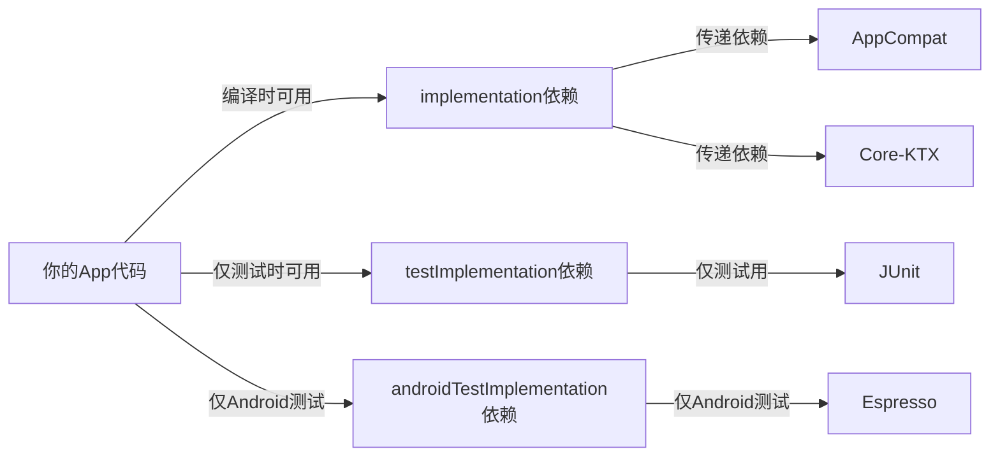
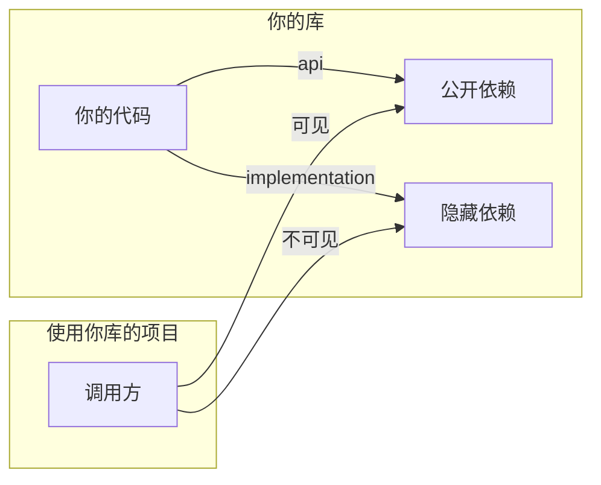
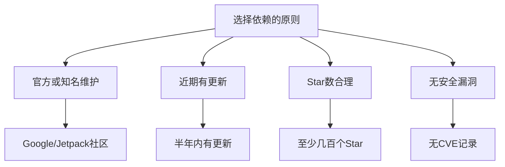
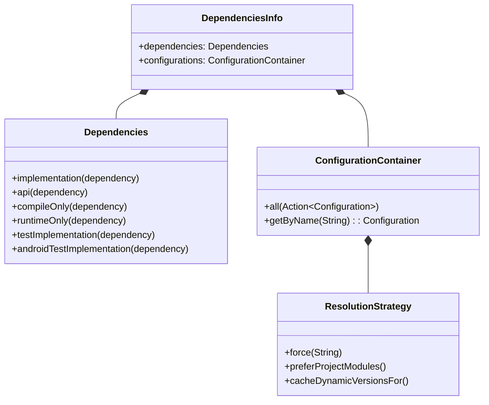

# 21.1.111 依赖信息

帐篷外的蛙鸣渐渐稀疏下去，夜风吹过草丛，带来一阵阵湿润的青草香。洛芙躺在睡袋里，脑海中还在回响着那些数字：24、34、1、1.0……原来一个简单的配置背后有这么多讲究。

“洛芙，”黛琳的声音从旁边传来，“还没睡？”

“有点睡不着，”洛芙翻了个身面向黛琳，“刚才学的那些还没消化完呢。”

“那正好，”黛琳把笔记本又打开来，“再教你一个重要的东西——DependenciesInfo。”

“又是配置？”洛芙嘟囔了一句，但还是撑着坐了起来。

希尔已经从背包里掏出了另一个小型显示器，连在笔记本上：“这个可得好好学。上次 DefaultConfig 是地基，这次的 DependenciesInfo 则是你盖房子需要的材料。”

“材料？”洛芙眨了眨眼，“是指我们用的那些库吗？”

“对，”伊莎把温水瓶递给洛芙，“就像我们露营需要带帐篷、睡袋、炊具一样，写 Android 应用也需要带各种'工具'——但这些工具不是实物，而是代码库。”

黛琳把屏幕转向大家，指着上面的 build.gradle 文件：“看，这就是一个典型的依赖配置。”

```kotlin
dependencies {
    // 核心Android库
    implementation 'androidx.core:core-ktx:1.12.0'
    implementation 'androidx.appcompat:appcompat:1.6.1'
    
    // Material Design
    implementation 'com.google.android.material:material:1.11.0'
    
    // 生命周期组件
    implementation 'androidx.lifecycle:lifecycle-viewmodel-ktx:2.7.0'
    implementation 'androidx.lifecycle:lifecycle-livedata-ktx:2.7.0'
    
    // 测试库
    testImplementation 'junit:junit:4.13.2'
    androidTestImplementation 'androidx.test.ext:junit:1.1.5'
    androidTestImplementation 'androidx.test.espresso:espresso-core:3.5.1'
}
```

洛芙看着这一行行的依赖，有些头晕：“这么多……怎么记得住？”

“不需要死记硬背，”希尔敲了敲键盘，“知道大概分类就行。你看，这些都是有规律的。”

她移动光标，把依赖分成几类：

```kotlin
dependencies {
    // 第1类：AndroidX 核心库（androidx开头）
    implementation 'androidx.core:core-ktx:1.12.0'
    implementation 'androidx.appcompat:appcompat:1.6.1'
    
    // 第2类：Google官方库（com.google.android开头）
    implementation 'com.google.android.material:material:1.11.0'
    
    // 第3类：Jetpack组件（androidx.lifecycle等）
    implementation 'androidx.lifecycle:lifecycle-viewmodel-ktx:2.7.0'
    
    // 第4类：测试库（junit、espresso）
    testImplementation 'junit:junit:4.13.2'
}
```

“原来是这样分类的，”洛芙点头道，“那这些 'implementation'、'testImplementation' 又是啥？”

黛琳笑了笑，从笔袋里抽出一支白板笔，在纸板上画了一个简单的示意图：



“这个图很关键，”黛琳指着图解释，“'implementation' 是最常用的——你的代码能用，而且这些库的依赖也能用。'testImplementation' 只在单元测试时能用，不会打包进正式应用。'androidTestImplementation' 是Android设备上的集成测试用的。”

洛芙似懂非懂地问：“那……如果我用错了会怎样？”

“如果是 'implementation' 写成了 'compile'，”希尔说，“Gradle会报警告，因为 'compile' 在新版本已经弃用了。”

“弃用了？”伊莎歪着头，“为什么会弃用？”

“因为 'implementation' 更智能，”黛琳解释道，“它不会把你的依赖暴露给使用你库的人。简单来说——如果你写的是一个库，别的项目引用了你的库，他们不该看到你的 implementation 依赖；但如果你用了 'api'，他们就能看到。”

“api？”洛芙又听到新名词。

黛琳又在白板上画了一下：



“api 和 implementation 的区别就在这里，”黛琳说，“api 会把依赖暴露给下游，implementation 则隐藏起来。一般来说，用 implementation 就够了，能减少很多不必要的依赖传递。”

洛芙举手提问：“那……这些依赖的版本号怎么定？总是写最新就行了吗？”

“问题就在这里，”希尔的表情变得认真起来，“很多人喜欢写 '+' 或者不写版本，让Gradle自动选择最新——这是非常危险的做法。”

她在电脑上敲了一段代码：

```kotlin
// ❌ 错误示例：使用动态版本号
dependencies {
    implementation 'androidx.core:core-ktx:+'  // 永远用最新，可能导致兼容性问题
    implementation 'com.google.android.material:material:1.+"  // 次版本号自动更新
}
```

“为什么危险？”伊莎问。

“因为你不知道什么时候会突然坏，”希尔说，“比如库更新了一个API，你的代码就编译不过了。或者某个库移除了一个方法，你的应用直接崩溃。”

“那怎么解决？”洛芙问。

“用固定版本号，”黛琳说，“或者更好的是——用版本目录。”

她在键盘上敲了几下，屏幕上出现了一个新文件：

```kotlin
// gradle/libs.versions.toml（版本目录）
[versions]
agp = "8.2.0"
kotlin = "1.9.22"
coreKtx = "1.12.0"
appcompat = "1.6.1"
material = "1.11.0"
junit = "4.13.2"

[libraries]
androidx-core-ktx = { group = "androidx.core", name = "core-ktx", version.ref = "coreKtx" }
androidx-appcompat = { group = "androidx.appcompat", name = "appcompat", version.ref = "appcompat" }
material = { group = "com.google.android.material", name = "material", version.ref = "material" }
junit = { group = "junit", name = "junit", version.ref = "junit" }

[plugins]
android-application = { id = "com.android.application", version.ref = "agp" }
kotlin-android = { id = "org.jetbrains.kotlin.android", version.ref = "kotlin" }

[bundles]
androidx = ["androidx-core-ktx", "androidx-appcompat"]
```

“这就是版本目录，”黛琳解释说，“把所有版本号集中在一个地方管理。这样如果要升级版本，只需要改一个地方。”

洛芙看着这个文件：“好像……比之前清晰多了？”

“对，”希尔说，“而且团队里多人开发的时候，不容易出现版本冲突。”

伊莎忽然问：“如果我想看项目里用了哪些依赖，有什么办法吗？”

“有，”黛琳打开Android Studio的依赖分析器，“在这里可以看到依赖树——能看到哪些是直接依赖，哪些是传递依赖，还能看到冲突。”

她在屏幕上展示了依赖树的样子：

```
debugRuntimeClasspath Runtime Dependency Tree
+--- androidx.core:core-ktx:1.12.0
|    +--- androidx.annotation:annotation:1.6.0
|    +--- androidx.concurrent:concurrent-futures:1.1.0
|    \--- com.google.guava:guava:31.1-android
|         +--- com.google.guava:guava-android:31.1-android
|         \--- org.checkerframework:checker-qual:3.22.0
+--- androidx.appcompat:appcompat:1.6.1
|    +--- androidx.annotation:annotation:1.3.1
|    +--- androidx.core:core:1.12.0
|    +--- androidx.loader:loader:1.0
|    +--- androidx.activity:activity:1.8.0
...
```

“好复杂……”洛芙看着这一串串的依赖关系，“原来一个简单的库背后跟着这么多东西。”

“这就叫做'传递依赖'，”黛琳说，“你引入一个库，它可能又引入其他库。一层一层加起来，可能几百个都有可能。”

希尔补充道：“这就是为什么之前说不要用 '+' 版本号——一旦某个传递依赖升级了，可能导致整个依赖树发生变化。”

洛芙忽然想到一个问题：“那……依赖越多，APK会不会越大？”

“对，会变大，”黛琳点头，“所以要定期清理不需要的依赖。Android Studio有个功能可以分析——看哪些依赖其实没有被用到。”

她打开Dependencies Analyzer：

```kotlin
// Gradle任务：app:dependencies
// 分析未使用的依赖

> Task :app:lintDebug
> Task :app:dependencies > Task :app:androidDependencies

debug
+--- androidx.core:core-ktx:1.12.0
+--- androidx.appcompat:appcompat:1.6.1
+--- com.google.android.material:material:1.11.0
...

// 标记为 unused 的依赖会被建议移除
Unused dependency: 'androidx.legacy:legacy-support-v4:1.0.0'
```

“如果看到 'Unused' 标记，”希尔说，“就可以考虑移除了，能让APK小不少。”

伊莎轻声说：“原来写代码也要断舍离呢。”

“还有一点很重要，”黛琳突然严肃起来，“不要引入来源不明的库。”

她在白板上写了几个原则：



“为什么？”洛芙问，“不就是一个工具吗？”

“安全问题，”黛琳说，“有些库作者可能不再维护了，但你的应用还在用。一旦发现安全漏洞，你想修都没法修。”

“所以要用Google官方推荐的库？”伊莎问。

“对，”黛琳说，“比如 AndroidX 系列，这些都是Google维护的，安全性有保障。”

夜渐渐深了，帐外的星空愈发璀璨。洛芙打了个哈欠，但眼睛还是盯着屏幕。

“最后一个知识点，”黛琳说，“看看这个——”

```kotlin
// 在build.gradle中配置依赖规则
configurations.all {
    resolutionStrategy {
        // 强制使用特定版本
        force 'androidx.core:core-ktx:1.12.0'
        // 拒绝某些传递依赖
        exclude group: 'org.jetbrains.kotlin', module: 'kotlin-stdlib-jdk7'
    }
    // 检查依赖冲突
    eachDependency { details ->
        if (details.requested.group == "androidx.core") {
            details.useVersion "1.12.0"
        }
    }
}
```

“这是什么？”洛芙问。

“依赖冲突解决策略，”黛琳解释说，“有时候不同的库会依赖同一个库的不同版本，Gradle默认会用最新的，但你可能需要强制用某个特定版本——这时候就用 resolutionStrategy。”

“如果强制用旧版本，”希尔补充道，“可能会有兼容性问题，要小心测试。”

洛芙已经完全晕了，只能在本子上记下：“依赖冲突 → resolutionStrategy”

黛琳似乎是看出了她的疲惫，温柔地说：“这个你今天先了解一下就行，不用强记。回去多看看文档，多实践几次就懂了。”

帐外的流星又划过一颗。伊莎轻声说：“今晚的流星好多呢。”

“我们今天的课就到这里吧，”黛琳合上笔记本，“明天再讲其他的东西。”

洛芙躺回睡袋里，脑海里还在回响着那些依赖：implementation、api、testImplementation……原来写代码也需要这么多材料呢。

“黛琳，”她轻声说，“明天……会教什么？”

“明天啊，”黛琳的声音有些懒洋洋的，“可能是关于构建变体之类的……”

“构建变体？”洛芙的好奇心又被勾起来了。

“就是针对不同场景——免费版、付费版、Debug版、Release版——怎么分别配置，”希尔插话道，“这个很重要的。”

“那……明天可得好好听，”洛芙翻了個身，面向帐篷门口的方向。

帐篷外的星空璀璨夺目，偶尔有流星划过。伊莎轻声哼起了露营的歌，旋律轻柔得像夜风一样。洛芙闭上眼睛，耳边是伊莎的歌声，还有远处若有若无的蛙鸣。

明天又会是新的一天呢。

---

> DependenciesInfo 是 Android Gradle 构建系统中的 DSL 对象，用于配置和管理项目的依赖信息。它定义了依赖的作用域（implementation、api、testImplementation、androidTestImplementation）、版本管理策略（版本目录、固定版本）、冲突解决机制（resolutionStrategy）等。合理管理依赖是确保应用稳定性、兼容性和 APK 体积优化的关键。

#### 结构图



#### 复杂度与影响

| 配置类型 | 影响范围 | 推荐做法 |
|----------|----------|----------|
| implementation | 编译+运行时，隐藏传递依赖 | 默认使用 |
| api | 编译+运行时，暴露传递依赖 | 仅在必须暴露时使用 |
| compileOnly | 仅编译时 | 注解处理器等 |
| runtimeOnly | 仅运行时 | 仅运行时需要的库 |
| testImplementation | 仅单元测试 | JUnit等 |
| androidTestImplementation | 仅Android测试 | Espresso等 |

#### 反模式与陷阱

1. **使用动态版本号（+）** → 修复：使用固定版本号或版本目录管理
2. **所有依赖都用 api** → 修复：默认使用 implementation，减少传递依赖暴露
3. **引入来源不明的库** → 修复：优先使用官方库（AndroidX、Jetpack），检查安全性
4. **忘记清理未使用的依赖** → 修复：定期使用 Dependencies Analyzer 清理
5. **依赖版本冲突时随意强制** → 修复：先分析冲突原因，评估兼容性后再决定

#### 设计哲学

Android 依赖管理的核心原则：

- **最小化原则**：只引入必要的依赖，用 implementation 隐藏不必要的传递依赖
- **版本可控性**：通过版本目录集中管理，避免动态版本带来的不确定性
- **安全性优先**：优先使用官方维护的库，定期检查安全漏洞
- **传递依赖透明**：通过依赖树分析了解完整的依赖关系

#### 🏕️ 动手练习

**项目目标**：为一个露营主题App配置合理的依赖，并创建依赖管理工具类

**Task 1：配置项目依赖**

- **目标**：在项目中正确配置基础依赖
- **步骤**：
  1. 打开 app/build.gradle 文件
  2. 添加 AndroidX 核心库依赖
  3. 添加 Material Design 依赖
  4. 添加 Lifecycle 组件依赖
  5. 配置测试依赖
- **验收标准**：[ ] 所有依赖语法正确 [ ] Sync 成功无报错 [ ] 依赖能正常导入使用
- **提示代码**：
```kotlin
dependencies {
    implementation 'androidx.core:core-ktx:1.12.0'
    implementation 'androidx.appcompat:appcompat:1.6.1'
    implementation 'com.google.android.material:material:1.11.0'
    implementation 'androidx.lifecycle:lifecycle-viewmodel-ktx:2.7.0'
    
    testImplementation 'junit:junit:4.13.2'
    androidTestImplementation 'androidx.test.ext:junit:1.1.5'
    androidTestImplementation 'androidx.test.espresso:espresso-core:3.5.1'
}
```

**Task 2：创建版本目录**

- **目标**：使用版本目录管理依赖版本
- **步骤**：
  1. 在 gradle 目录下创建 libs.versions.toml
  2. 定义常用库的版本号
  3. 在 build.gradle 中使用版本目录
  4. 验证同步成功
- **验收标准**：[ ] toml 文件格式正确 [ ] 依赖能正常解析 [ ] 版本号统一管理
- **提示代码**：
```toml
# gradle/libs.versions.toml
[versions]
coreKtx = "1.12.0"

[libraries]
core-ktx = { group = "androidx.core", name = "core-ktx", version.ref = "coreKtx" }

[plugins]
android-application = { id = "com.android.application", version.ref = "agp" }
```

**Task 3：分析依赖树**

- **目标**：了解项目的完整依赖结构
- **步骤**：
  1. 在终端执行 ./gradlew app:dependencies
  2. 分析 debugRuntimeClasspath 依赖树
  3. 找出传递依赖最多的库
  4. 标记未使用的依赖
- **验收标准**：[ ] 能成功运行依赖分析命令 [ ] 识别出主要传递依赖 [ ] 列出可清理的依赖
- **提示命令**：
```bash
./gradlew app:dependencies --configuration debugRuntimeClasspath
```

**Task 4：配置依赖冲突解决**

- **目标**：处理版本冲突问题
- **步骤**：
  1. 在 build.gradle 中添加 configurations.all 块
  2. 使用 resolutionStrategy 强制特定版本
  3. 测试编译是否通过
  4. 验证功能正常
- **验收标准**：[ ] resolutionStrategy 配置正确 [ ] 版本冲突得到解决 [ ] 功能测试通过
- **提示代码**：
```kotlin
configurations.all {
    resolutionStrategy {
        force 'androidx.core:core-ktx:1.12.0'
    }
}
```

**Task 5：创建依赖管理工具类**

- **目标**：在应用中展示依赖信息
- **步骤**：
  1. 创建 DependenciesManager 工具类
  2. 添加获取应用依赖版本的方法
  3. 创建版本信息展示界面
  4. 测试信息展示
- **验收标准**：[ ] 工具类正常编译 [ ] 能获取到依赖信息 [ ] 界面正确显示
- **提示代码**：
```kotlin
object DependenciesManager {
    fun getVersionInfo(): Map<String, String> {
        return mapOf(
            "core-ktx" to BuildConfig.VERSION_NAME,
            // 其他依赖版本
        )
    }
}
```

**面试热身**

- Q1：请解释 implementation 和 api 的区别，以及什么时候应该使用它们？
- Q2：如果项目中出现依赖版本冲突，你应该如何排查和解决？
- Q3：什么是版本目录（Version Catalog）？它有什么优缺点？
- Q4：请说明 testImplementation 和 androidTestImplementation 的区别？
- Q5：如何优化应用的依赖以减小 APK 体积？有哪些具体措施？

#### 参考实现要点

1. **默认使用 implementation**：除非必须暴露给下游，否则都用 implementation
2. **使用版本目录**：集中管理版本号，便于升级和维护
3. **定期清理依赖**：使用 Android Studio 的依赖分析器移除未使用的库
4. **优先使用官方库**：AndroidX、Jetpack 系列更安全、更可靠
5. **谨慎处理冲突**：使用 resolutionStrategy 前先分析冲突原因

> 学习建议：依赖管理是 Android 开发中非常重要的技能。建议在实际项目中多尝试不同的配置方式，观察对编译时间和 APK 体积的影响。记住：好的依赖管理能让你的项目更稳定、更易维护。

## 洛芙的小小日记本

今晚学了好多的依赖！implementation、api、testImplementation……原来代码也需要"食材"呢。黛琳说要选好的、干净的食材，不然会吃坏肚子——就像不能随便引入来路不明的库一样。明天要学构建变体了，希望也能这么有趣！晚安，星空！🌙

## 今日关键词

- **DependenciesInfo**：Android Gradle DSL 对象，用于配置项目依赖信息
- **implementation**：依赖作用域，编译时可用，隐藏传递依赖
- **api**：依赖作用域，编译时可用，暴露传递依赖给下游
- **compileOnly**：仅编译时可用，不打包进应用
- **runtimeOnly**：仅运行时可用，不参与编译
- **testImplementation**：仅单元测试时可用
- **androidTestImplementation**：仅Android设备测试时可用
- **版本目录**：gradle/libs.versions.toml，集中管理依赖版本
- **传递依赖**：依赖的依赖，一层一层传递
- **依赖树**：展示所有依赖关系的树状结构
- **resolutionStrategy**：Gradle 依赖冲突解决策略
- **AndroidX**：Google 官方维护的 Android 扩展库
- **Jetpack**：Google 官方 Android 开发组件库
