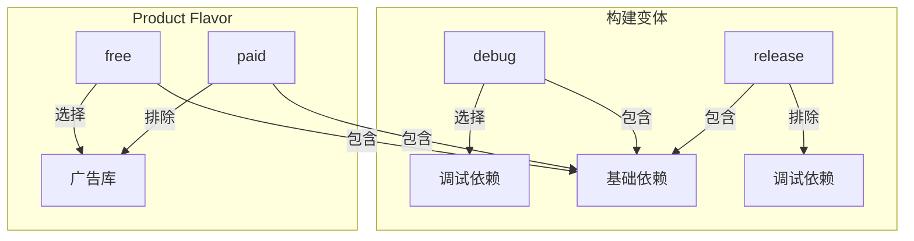
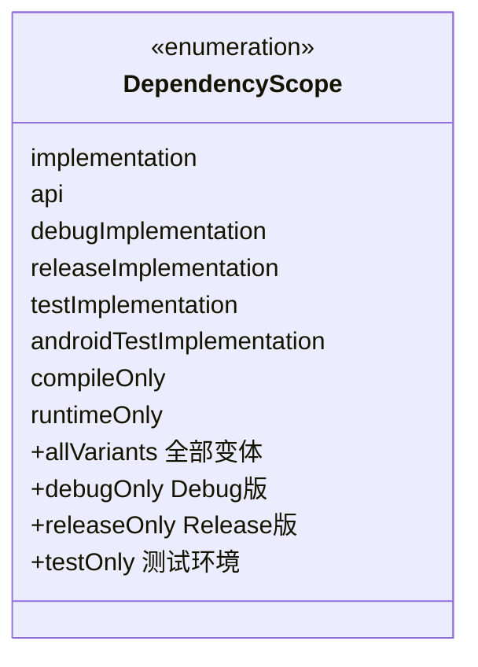
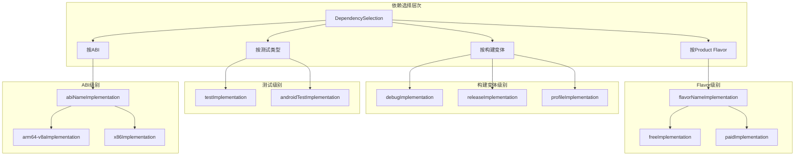

# 21.1.112 依赖选择

夜已深了。

帐篷外偶尔传来几声虫鸣，远处的湖面在星光下泛着丝绸般的光泽。洛芙躺在睡袋里，黛琳手中的小夜灯已经切换到了更柔和的模式，光线变得昏黄而温暖。

“洛芙，还醒着吗？”黛琳压低声音问。

“醒着呢，”洛芙翻了身面向黛琳，“刚才学的那些还在脑子里转呢。”

“那正好，”黛琳把枕头垫高了一些，“今天学的DependenciesInfo是基础，明天我们可能还要学其他配置。但今天最后一个知识点——关于依赖的选择性引入，很重要。”

“选择性？”洛芙揉了揉眼睛，“依赖不就是写在那里就行了吗？”

“那是基础用法，”希尔不知道什么时候也醒了，从睡袋里支起脑袋，“但实际项目中，不同的情况需要不同的依赖——比如Debug版需要一些调试工具，Release版不需要；免费版需要广告库，付费版不需要……这时候就要用到选择性的依赖配置了。”

伊莎被吵醒了，迷迷糊糊地说：“听起来像露营时的装备选择——出发前要根据天气、目的 地带不同的东西。”

“对！这个比喻太好了，”黛琳笑着说，“我们的App也一样——要根据不同的场景帶不同的'工具'。”

洛芙来了精神：“那要怎么实现？”

黛琳坐起身来，打开笔记本：“这就涉及到DependencySelection——依赖选择。简单来说，就是让不同的构建变体使用不同的依赖。”

她先在白板上画了一个简单的图：



“这个图很重要，”黛琳指着解释道，“我们先说构建变体——Debug和Release。Debug版需要LeakCanary这种内存检测工具，但Release版不需要，反而会增加APK体积。”

“LeakCanary是什么？”洛芙问。

“检测内存泄漏的工具，”希尔说，“通俗点说，就是帮你找出App里哪些地方占着内存不释放。就像露营时要检查帐篷有没有破洞一样。”

“那Release版怎么排除它？”洛芙又问。

黛琳敲了几下键盘，屏幕上出现了一段代码：

```kotlin
// app/build.gradle.kts
android {
    buildTypes {
        release {
            isMinifyEnabled = true
            isShrinkResources = true
            
            // Release版排除调试依赖
        }
        debug {
            isDebuggable = true
        }
    }
}

dependencies {
    // 调试依赖，仅在Debug版生效
    'androidx leakcanary:leakcanary-android:2.12'
    
    // 基础依赖，所有变体都生效
    implementation 'androidx.core:core-ktx:1.12.0'
    implementation 'androidx.appcompat:appcompat:1.6.1'
}
```

洛芙盯着代码：“这个……没看到排除的代码啊？”

“奥秘就在这里，”希尔笑着说，“你注意看写法——'debugImplementation' 这个关键词。”

“！”洛芙仔细看了一遍，“啊，真的写了'debugImplementation'！”

“对，这就是依赖选择的第一种方式——按构建变体选择，”黛琳说，“debugImplementation只在Debug版生效，releaseImplementation只在Release版生效。”

伊莎好奇地问：“那有没有同时在两种都生效的？”

“有，”黛琳点点头，“就是之前学的implementation，还有api、compileOnly这些——它们在所有变体都生效。”

洛芙似懂非懂：“那……如果我不写那个'debug'前缀呢？”

“不写前缀的默认都生效，”希尔解释道，“但如果要区分，就要用这个前缀来指定作用域。”

黛琳又在白板上画了一个更详细的图：



“这个图展示了不同作用域的适用范围，”黛琳说，“debugImplementation是debug专用的，releaseImplementation是release专用的——这就是DependencySelection的核心概念。”

洛芙举手提问：“那Product Flavor呢？就像免费版和付费版那样的……也能这样选择？”

“问得好，”黛琳的表情变得认真起来，“这就是更高级的用法了。”

她切换了一下屏幕上的代码：

```kotlin
// app/build.gradle.kts
android {
    flavorDimensions += "version"
    productFlavors {
        create("free") {
            dimension = "version"
            applicationIdSuffix = ".free"
            buildConfigField("boolean", "IS_PREMIUM", "false")
            
            // 免费版：依赖广告库
            implementation 'com.google.android.gms:play-services-ads:22.5.0'
        }
        create("paid") {
            dimension = "version"
            applicationIdSuffix = ".paid"
            buildConfigField("boolean", "IS_PREMIUM", "true"
            
            // 付费版：不需要广告库，可能需要额外的付费功能库
            implementation project(':premium-features')
        }
    }
}

dependencies {
    // 通用依赖：两种版本都包含
    implementation 'androidx.core:core-ktx:1.12.0'
    implementation 'androidx.appcompat:appcompat:1.6.1'
    
    // 免费版专属依赖
    "freeImplementation"('com.google.android.gms:play-services-ads:22.5.0')
    
    // 付费版专属依赖
    "paidImplementation"(project(':premium-features'))
}
```

洛芙眼睛亮了：“原来还可以这样！那不同版本真的可以带不同的'工具'呢。”

“对，”黛琳说，“这就是Product Flavor的强大之处——你可以让同一个App有两个版本，它们共用大部分代码，但在依赖上有所区别。”

伊莎问了一个问题：“如果我想让免费版有一个库，付费版没有，但代码里还想用同一个名字调用……怎么办？”

“这就涉及到代码层面的考虑了，”希尔说，“可以在代码里通过BuildConfig判断，就像这样——”

```kotlin
// 露营工具管理器
object CampingGearManager {
    
    fun showAdBanner(context: Context): View? {
        // 通过BuildConfig判断是否是免费版
        return if (BuildConfig.IS_PREMIUM) {
            // 付费版不显示广告
            null
        } else {
            // 免费版显示广告
            AdBannerView(context)
        }
    }
    
    fun initializePremiumFeatures() {
        if (BuildConfig.IS_PREMIUM) {
            // 初始化付费版专属功能
            PremiumFeatureManager.init()
        }
    }
}
```

洛芙看着代码：“原来不仅要配依赖，还要在代码里做判断。”

“这就是完整的流程，”黛琳说，“依赖配置+代码逻辑，双管齐下。”

希尔补充道：“还有一个很常用的场景——测试依赖。单元测试用的库和Android测试用的库不一样，也要分开。”

她在键盘上敲了一段代码：

```kotlin
dependencies {
    // 单元测试（本地JVM上运行）
    testImplementation 'junit:junit:4.13.2'
    testImplementation 'org.mockito:mockito-core:5.8.0'
    testImplementation 'org.jetbrains.kotlin:kotlin-test:1.9.22'
    
    // Android设备/模拟器上的测试
    androidTestImplementation 'androidx.test.ext:junit:1.1.5'
    androidTestImplementation 'androidx.test.espresso:espresso-core:3.5.1'
    androidTestImplementation 'androidx.test:runner:1.5.2'
    androidTestImplementation 'androidx.test:rules:1.5.0'
}
```

“这两个是有本质区别的，”希尔强调，“testImplementation在本地JVM上跑，androidTestImplementation要在真机或模拟器上跑。它们用的库也不同。”

洛芙好奇地问：“那如果我在testImplementation里用了Android特有的库会怎样？”

“编译会报错，”希尔说，“因为测试环境不匹配。就像你不应该在野营背包里放不存在的工具一样。”

黛琳接过话题：“还有一个很实用的功能——按abiSplit选择依赖。”

她继续展示代码：

```kotlin
// 按CPU架构选择依赖
android {
    splits {
        abi {
            isEnable = true
            reset()
            include("armeabi-v7a", "arm64-v8a", "x86", "x86_64")
            isUniversalApk = true
        }
    }
}

// 针对特定架构的依赖（不常用，但支持）
dependencies {
    // 针对arm64架构的原生库
    'arm64-v8aImplementation' 'com.example:native-lib-arm64:1.0.0'
    
    // 针对x86架构的原生库（模拟器用）
    'x86Implementation' 'com.example:native-lib-x86:1.0.0'
}
```

“这个是针对不同手机CPU的，”黛琳解释说，“一般App用不到，但如果你的App有 native 库，那可能需要按这个来区分。”

洛芙已经完全晕了：“怎么感觉比学数学还复杂……”

“其实不复杂，”伊莎轻声说，“你只要记住一个原则——什么场景需要什么依赖，就在对应的作用域里配置。 debug用debugImplementation，测试用testImplementation，免费版用freeImplementation……以此类推。”

“而且，”希尔补充道，“大部分情况下你只需要用implementation这个默认的就行。只有在特殊场景才需要这些选择性的配置。”

黛琳点点头：“对，这就像露营——大部分情况下带基本的装备就够了，只有特殊情况下才需要带额外的工具。”

夜更深了。帐外的星空愈发明亮出只在深夜才会出现的银河带。

“最后一个知识点，”黛琳说，“看看这个——条件依赖。”

她在屏幕上打出一段代码：

```kotlin
// 根据条件选择依赖
dependencies {
    // API等级21以上才引入的库
    // 这里用Groovy的语法实现条件判断
    if (project.hasProperty("sdk21")) {
        implementation 'androidx.leanback:leanback:1.0.0'
    }
    
    // 按功能模块开关
    if (project.hasProperty("enableAnalytics")) {
        implementation 'com.google.firebase:firebase-analytics-ktx:21.5.0'
    }
}
```

“这个是更高级的玩法了，”黛琳说，“通过判断项目属性来决定是否引入某个库。一般用在非常特殊的场景。”

洛芙问：“那有没有更简单的办法？比如我想在调试时打开某个功能，发布时关闭？”

“有，用buildConfigField配合代码判断，”希尔说，“就像刚才展示的那样。”

她打了个大哈欠：“今天先学到这里吧，脑袋要冒烟了。”

伊莎轻声笑了：“那我们休息吧，明天再继续。”

黛琳合上笔记本：“记住今晚学的——DependencySelection的核心就是按需分配、按场景选择。合适的依赖给合适的场景，这就是优化APK体积和性能的秘诀之一。”

洛芙点点头，虽然还有不少地方没完全消化，但她记住了最重要的一句话：要让合适的依赖出现在合适的构建变体里。

帐外的银河清晰可见，带着整个夏季夜空独有的浪漫。洛芙闭上眼睛，耳边是伊莎轻柔的呼吸声，还有远处偶尔传来的蛙鸣。

明天又会是新的一天呢。

---

> DependencySelection 是 Android Gradle 构建系统中用于控制依赖作用域的 DSL 对象。它允许开发者根据构建变体（Build Variant）、Product Flavor、ABI 等条件，有选择性地引入或排除特定的依赖。合理使用 DependencySelection 可以有效优化 APK 体积（避免在 Release 版中包含调试工具），同时为不同版本的 App 提供差异化的功能配置（免费版/付费版）。

#### 结构图



#### 复杂度与影响

| 依赖作用域 | 生效范围 | 典型用途 |
|------------|----------|----------|
| implementation | 所有变体 | 通用业务库 |
| debugImplementation | Debug版 | LeakCanary、Logger |
| releaseImplementation | Release版 | 特殊发布配置 |
| testImplementation | 单元测试 | JUnit、Mockito |
| androidTestImplementation | Android测试 | Espresso |
| freeImplementation | 免费版 | 广告库 |
| paidImplementation | 付费版 | 高级功能 |
| arm64-v8aImplementation | ARM64设备 | 原生库 |
| compileOnly | 编译时 | 注解处理器 |
| runtimeOnly | 运行时 | 仅运行时依赖 |

#### 反模式与陷阱

1. **在Release版中包含调试依赖** → 修复：使用 debugImplementation 而非 implementation
2. **免费版和付费版重复引入功能库** → 修复：通过 Flavor 区分，使用 freeImplementation/paidImplementation
3. **testImplementation 和 androidTestImplementation 混用** → 修复：明确区分本地测试和设备测试的依赖
4. **滥用条件判断引入依赖** → 修复：优先使用 Gradle 原生的 Flavor 和 Build Type 配置
5. **忘记清理未使用的 Flavor 依赖** → 修复：定期检查依赖树，确保只有必要的依赖被引入

#### 设计哲学

依赖选择的核心原则：

- **按需分配**：只引入当前场景需要的依赖，不过度打包
- **作用域明确**：不同用途的依赖放在对应的作用域，避免混淆
- **变体隔离**：Debug 和 Release 完全隔离，确保 Release 包体积最小化
- **测试分离**：单元测试和 Android 测试使用不同的依赖，保持测试环境纯净
- **Flavor 差异化**：利用 Flavor 实现免费版/付费版等多版本管理

#### 🏕️ 动手练习

**项目目标**：为一个露营主题 App 配置不同变体的依赖，并实现基础的 Flavor 切换功能

**Task 1：配置调试依赖**

- **目标**：让 Debug 版包含调试工具，Release 版不包含
- **步骤**：
  1. 在 app/build.gradle 中添加 LeakCanary 依赖（debugImplementation）
  2. 添加日志库（debugImplementation）
  3. 配置 Build Types，确认 release 版不包含这些库
  4. 构建两个版本，对比 APK 大小
- **验收标准**：[ ] Debug APK 包含调试库 [ ] Release APK 不包含调试库 [ ] Release APK 体积明显小于 Debug 版
- **提示代码**：
```kotlin
dependencies {
    debugImplementation 'com.squareup.leakcanary:leakcanary-android:2.12'
    debugImplementation 'com.jakewharton.timber:timber:5.0.1'
    // Release 版不添加任何调试依赖
}
```

**Task 2：创建免费版和付费版 Flavor**

- **目标**：创建两个 Flavor，配置差异化依赖
- **步骤**：
  1. 在 build.gradle 中定义 "free" 和 "paid" 两个 Flavor
  2. 在 free Flavor 中添加广告库依赖
  3. 在 paid Flavor 中添加高级功能模块依赖
  4. 在代码中使用 BuildConfig.IS_PREMIUM 判断版本
  5. 构建两个版本并测试
- **验收标准**：[ ] 成功创建两个 Flavor [ ] free 版包含广告库 [ ] paid 版包含高级功能模块 [ ] 代码正确判断版本
- **提示代码**：
```kotlin
productFlavors {
    free {
        buildConfigField("boolean", "IS_PREMIUM", "false")
    }
    paid {
        buildConfigField("boolean", "IS_PREMIUM", "true")
    }
}
```

**Task 3：配置测试依赖**

- **目标**：正确配置单元测试和 Android 测试的依赖
- **步骤**：
  1. 添加 JUnit 依赖（testImplementation）
  2. 添加 Mockito 依赖（testImplementation）
  3. 添加 Espresso 依赖（androidTestImplementation）
  4. 编写简单的单元测试
  5. 编写简单的 UI 测试
- **验收标准**：[ ] 单元测试可以运行 [ ] Android 测试可以运行 [ ] 测试依赖不会打包进 App
- **提示代码**：
```kotlin
dependencies {
    testImplementation 'junit:junit:4.13.2'
    testImplementation 'org.mockito:mockito-core:5.8.0'
    androidTestImplementation 'androidx.test.espresso:espresso-core:3.5.1'
}
```

**Task 4：分析依赖树**

- **目标**：验证不同变体的依赖差异
- **步骤**：
  1. 执行 ./gradlew app:dependencies > debugDeps.txt
  2. 执行 ./gradlew app:dependencies > releaseDeps.txt
  3. 对比两个文件的差异
  4. 找出仅在 Debug 版存在的依赖
- **验收标准**：[ ] 成功生成依赖树文件 [ ] 能识别出差异依赖 [ ] 能解释差异原因
- **提示命令**：
```bash
./gradlew app:dependencies --configuration debugRuntimeClasspath > debug.txt
./gradlew app:dependencies --configuration releaseRuntimeClasspath > release.txt
```

**Task 5：实现 Flavor 相关的 UI 逻辑**

- **目标**：根据不同版本显示不同内容
- **步骤**：
  1. 创建 BannerView，根据 BuildConfig.IS_PREMIUM 显示/隐藏广告
  2. 创建 PremiumButton，仅在付费版显示
  3. 在 MainActivity 中调用这些组件
  4. 构建并测试两个版本
- **验收标准**：[ ] 免费版显示广告 [ ] 付费版隐藏广告 [ ] 付费版显示高级功能按钮 [ ] 功能正常
- **提示代码**：
```kotlin
class MainActivity : AppCompatActivity() {
    override fun onCreate(savedInstanceState: Bundle?) {
        super.onCreate(savedInstanceState)
        
        // 根据版本决定是否显示广告
        if (!BuildConfig.IS_PREMIUM) {
            showAdBanner()
        }
        
        // 根据版本决定是否显示高级功能
        if (BuildConfig.IS_PREMIUM) {
            showPremiumButton()
        }
    }
}
```

**面试热身**

- Q1：请解释 debugImplementation 和 implementation 的区别，以及它们各自的适用场景？
- Q2：如果你想优化 APK 体积，你会采用哪些依赖管理策略？
- Q3：请说明 Product Flavor 和 Build Type 的区别，以及如何为它们配置不同的依赖？
- Q4：testImplementation 和 androidTestImplementation 有什么区别？它们分别用于什么场景？
- Q5：如果你发现 Release APK 比 Debug APK 大很多，可能的原因是什么？应该如何排查？

#### 参考实现要点

1. **默认使用 implementation**：除非有特殊需求，否则使用默认作用域
2. **调试工具用 debugImplementation**：LeakCanary、Logger 等仅在 Debug 版使用
3. **利用 Flavor 区分版本**：免费版/付费版通过 Flavor 实现，配置差异化依赖
4. **测试依赖分开配置**：单元测试用 testImplementation，Android 测试用 androidTestImplementation
5. **定期检查依赖树**：通过 gradlew dependencies 命令检查各变体的依赖情况，确保无多余依赖

> 学习建议：依赖选择是优化 APK 体积和实现多版本管理的关键技能。建议在实际项目中多尝试配置不同的变体，观察依赖树的变化。记住：合适的时间、合适的地点、引入合适的选择——这才是真正的工程艺术。

## 洛芙的小小日记本

今晚真的好晕！什么debugImplementation、freeImplementation、paidImplementation……感觉像在玩变脸游戏。但希尔说的对——大部分时候只需要记住基础的implementation就行，那些花里胡哨的是在需要的时候才用的。明天要学什么呢？希望不要比今天更复杂啦～晚安，银河！✨

## 今日关键词

- **DependencySelection**：Android Gradle DSL 中控制依赖作用域的机制
- **buildTypes**：Gradle 构建类型配置（debug、release）
- **productFlavors**：Product Flavor，产品风味，用于创建不同版本的应用
- **debugImplementation**：仅在 Debug 版生效的依赖
- **releaseImplementation**：仅在 Release 版生效的依赖
- **testImplementation**：仅在单元测试时生效的依赖
- **androidTestImplementation**：仅在 Android 设备测试时生效的依赖
- ** FlavorNameImplementation**：针对特定 Flavor 的依赖，如 freeImplementation
- **abiSplit**：按 CPU 架构分割 APK
- **BuildConfig**：构建时生成的配置类，包含版本、开关等信息
- **apkSplits**：APK 分割配置