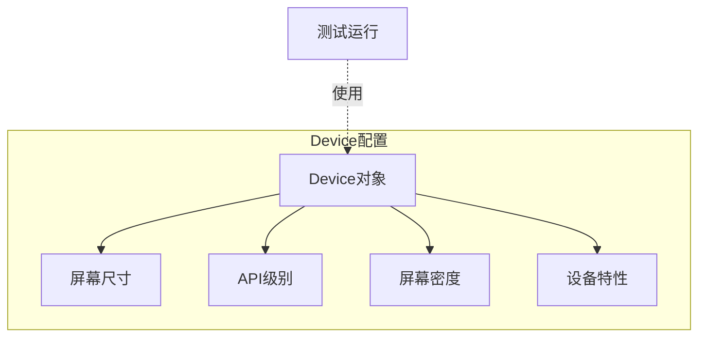
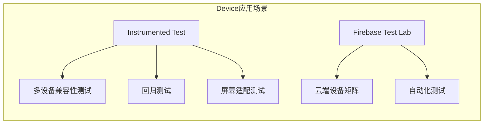
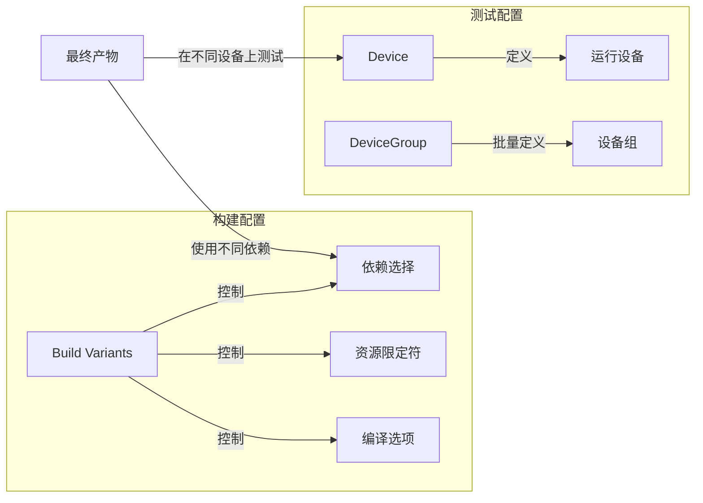
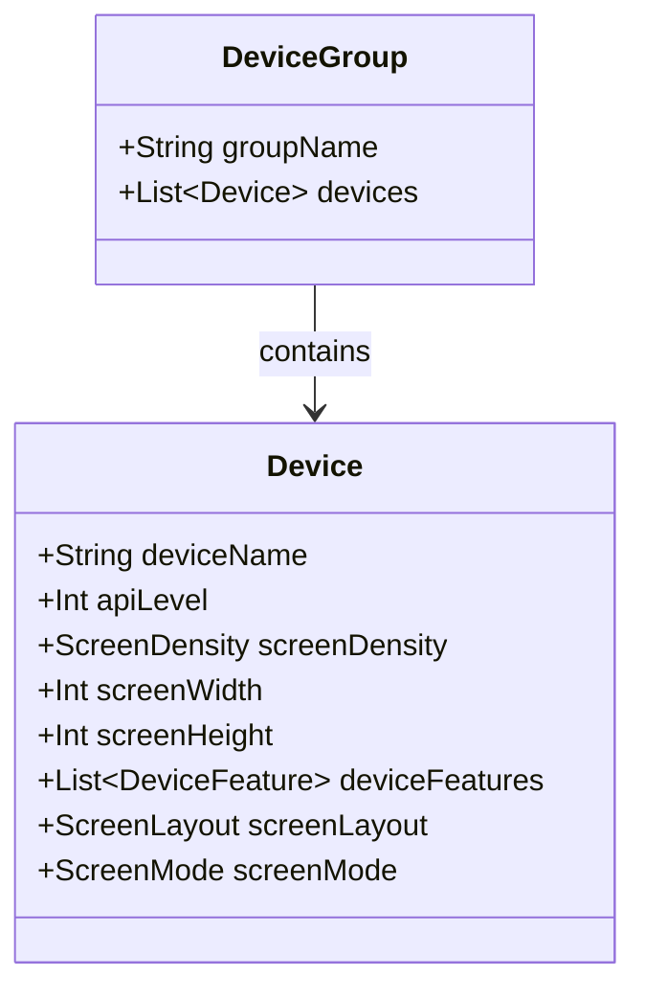

# 21.1.113 设备

清晨的第一缕阳光透过帐篷的缝隙，轻轻落在洛芙的眼皮上。

她眨了眨眼睛，看到帐篷顶部已经被晨光染成了淡淡的蜜金色。外面传来清脆的鸟鸣声，还有风吹过湖面带来的轻柔波纹声。洛芙钻出睡袋，看到其他三人也已经醒了，正在收拾东西。

“睡得好吗？”伊莎笑着问，她的头发还有点乱糟糟的，却显得很可爱。

“很好，”洛芙点点头，“就是梦里还在想那些依赖配置的事情。”

“日有所想，夜有所梦，很正常，”黛琳正在把笔记本收进背包，“不过今天的知识点会更有意思——我们要讲Device，设备配置。”

“设备？”洛芙愣了一下，“是我们用的手机吗？”

“对，也不对，”希尔 grins（露出灿烂的笑容），把折叠椅打开，“在Gradle里，Device是用于配置测试设备的——你可以定义不同的虚拟设备规格，让自动化测试在不同的设备配置下运行。”

伊莎伸了个懒腰：“就像露营时要根据不同的天气准备不同的装备——如果知道会下雨就带雨衣，如果天气冷就带厚衣服。Device就是告诉测试'要穿什么衣服'。”

“这个比喻好！”黛琳赞同地点点头，“走，我们到外面边吃早餐边讲，这里光线好了，我给你画个图。”

四人走出帐篷，清晨的湖面笼罩着一层薄薄的雾气，远处的山轮廓清晰，空气清新得让人忍不住深呼吸。希尔从背包里拿出一个小桌子和几个简易凳子，伊莎则准备好了早餐——压缩饼干和热可可。

“对测试来说，设备配置太重要了，”黛琳打开笔记本，“你想象一下——你的App要支持从API 21到API 34的版本，还要支持手机和平板，如果有折叠屏就更复杂了。如果你手动一台一台设备去测试，会疯掉的。”

“所以Device就是让测试自动在这些设备上跑？”洛芙问。

“准确来说，Device是Gradle DSL里用来描述'测试设备长什么样'的对象，”黛琳画了一个简单的示意图，“你可以定义屏幕尺寸、系统版本、屏幕密度等等参数，然后让测试跑在这些虚拟设备上。”



洛芙好奇地问：“那具体怎么用呢？”

黛琳打开电脑，调出一个代码示例：“我给你看一个典型的Device配置。这在我们的build.gradle或build.gradle.kts里使用。”

```kotlin
// 在 android.testedDevices 块中定义设备
android.testedDevices {
    phone {
        // 设备名称
        deviceName = "Test Phone"
        // API级别
        apiLevel = 34
        // 屏幕密度
        screenDensity = ScreenDensity.HIGH
        // 屏幕尺寸
        screenWidth = 1080
        screenHeight = 1920
    }
    
    tablet {
        deviceName = "Test Tablet"
        apiLevel = 33
        screenDensity = ScreenDensity.XHIGH
        screenWidth = 2560
        screenHeight = 1600
    }
}
```

“就这么简单？”洛芙有点意外。

“基础配置确实简单，”希尔说，“但这只是冰山一角。更复杂的场景下，你可以定义多个设备组成一个设备组，让测试同时在所有设备上运行。”

伊莎插话道：“就像一支探险队——大家分工合作，遇到困难时一起上。测试也是一样的道理，一套测试用例可以在多个设备配置上同时跑。”

黛琳点点头：“对，而且Device还可以配合DeviceGroup使用。DeviceGroup是一组设备的集合，你可以给整个组设置统一的配置。”

“比如这样，”希尔在电脑上敲了几个键，展示了另一个示例：

```kotlin
android.testDeviceGroups {
    // 定义一个设备组，包含多个设备配置
    regression {
        // 设备组内的设备列表
        devices = listOf(
            device {
                deviceName = "Low-end Phone"
                apiLevel = 24
                screenDensity = ScreenDensity.MDPI
                screenWidth = 720
                screenHeight = 1280
            },
            device {
                deviceName = "Mid-range Phone" 
                apiLevel = 29
                screenDensity = ScreenDensity.HDPI
                screenWidth = 1080
                screenHeight = 1920
            },
            device {
                deviceName = "Flagship Phone"
                apiLevel = 34
                screenDensity = ScreenDensity.XXXHIGH
                screenWidth = 1440
                screenHeight = 3200
            }
        )
    }
}
```

洛芙看着代码，若有所思：“所以DeviceGroup就像是一个'测试装备清单'，列出了所有要测试的设备？”

“完全正确，”黛琳笑着说，“而且Device和DeviceGroup可以配合使用——你可以定义单独的Device用于特定测试，也可以用DeviceGroup批量运行一套测试。”

，这时洛芙突然想到一个问题：“对了，如果我们想测试折叠屏设备呢？那种屏幕可以折叠的。”

希尔眼睛一亮：“问得好！折叠屏是现在的热门，Device API也考虑到了这个。”

她在电脑上搜索了一下，找到了相关的配置示例：“折叠屏设备可以通过 ScreenLayout 和 ScreenMode 来模拟。”

```kotlin
android.testedDevices {
    foldable {
        deviceName = "Foldable Device"
        apiLevel = 33
        
        // 折叠状态配置
        screenLayout = ScreenLayout.COMPACT
        screenMode = ScreenMode.FOLDED
        
        // 展开后的配置
        // 可以通过多次定义来模拟不同状态
        
        // 或者使用 screenFoldPosture 来设置折叠姿态
        screenFoldPosture = ScreenFoldPosture.HALF_OPENED
    }
}

enum class ScreenFoldPosture {
    FLAT,           // 完全展开
    HALF_OPENED,    // 半开（如笔记本模式）
    FOLDED          // 完全折叠
}
```

“太酷了！”洛芙兴奋地说，“这样就能模拟折叠屏的各种形态了。”

伊莎轻轻笑了笑：“就像露营时的多功能帐篷——可以完全打开，也可以半开成不同的形状。Device配置也是这个道理。”

黛琳接着说：“现在我来给你讲讲Device的具体应用场景。在实际项目中，Device配置主要用在这些地方：”



“首先是instrumented测试，也就是在真机或模拟器上运行的测试，”黛琳解释道，“当你运行androidTest下的测试时，可以通过Device配置指定要在哪些设备配置上运行。”

“其次是屏幕适配测试——你可以定义不同的屏幕尺寸和密度，确保UI在各种设备上都正常显示。”

“还有回归测试——每次代码变更后，在多个设备配置上运行测试，确保没有引入新问题。”

洛芙好奇地问：“那这些测试怎么跑呢？不是要一台一台设备去运行吗？”

“这就是Device的强大之处，”希尔说，“配合CI/CD系统，你可以让测试自动在所有配置的设备上运行。”

```kotlin
// 在 Gradle 任务中运行多设备测试
android.testInstrumentationRunner {
    // 使用设备组运行测试
    deviceGroup = "regression"
    
    // 或者指定单个设备
    deviceName = "Test Phone"
}

// 也可以在命令行指定
// ./gradlew connectedDebugAndroidTest -PtestDeviceGroup=regression
```

黛琳补充道：“另外，Google的Firebase Test Lab也支持Device配置，你可以把测试放到云端去跑，省得自己维护一堆设备。”

“听起来像租房子一样，”伊莎打了个比方，“不用自己买所有家具，直接租一个带家具的公寓，拎包入住。”

“对了，”洛芙突然想到一个问题，“Device配置和之前的DependencySelection有什么关系？我记得上一章讲的是根据构建变体选择依赖。”

黛琳赞许地点点头：“你记得很牢！其实Device和DependencySelection是互补的。”

她画了一个图来解释：



“Build Variants决定了你的App使用什么代码和依赖，而Device决定了你的测试在什么设备上跑，”黛琳解释，“两者配合，才能实现完整的测试策略。”

洛芙若有所思：“就像做一道菜——DependencySelection决定了用什么食材，Device决定了在什么锅具上烹饪。”

伊莎眼睛亮了起来：“这个比喻好！不同的锅适合做不同的菜，不同的设备也适合测试不同的场景。”

希尔接着说：“而且Device还有一个很实用的功能——你可以给设备添加'特性'，比如是否有摄像头、是否有GPS等。”

```kotlin
android.testedDevices {
    phoneWithCamera {
        deviceName = "Phone with Camera"
        apiLevel = 30
        
        // 定义设备特性
        deviceFeatures = listOf(
            DeviceFeature.CAMERA,
            DeviceFeature.GPS,
            DeviceFeature.TOUCHSCREEN
        )
    }
    
    phoneWithoutCamera {
        deviceName = "Phone without Camera" 
        apiLevel = 26
        
        // 用于测试没有相机的设备
        deviceFeatures = listOf(
            DeviceFeature.TOUCHSCREEN
        )
    }
}
```

洛芙好奇地问：“这样的测试有什么意义呢？”

“有大意义！”希尔说，“比如你开发一个相机App，总不能只在有相机的设备上测试吧？你也要确保在没有相机的设备上，App能正确处理这种场景——比如显示'不支持'的提示，而不是直接崩溃。”

黛琳补充道：“而且有些系统API在不同设备上行为可能不一样，通过Device配置测试多个版本，可以尽早发现兼容性问题。”

这时，太阳已经完全升起来了，阳光洒在湖面上，波光粼粼。四人收拾好东西，准备继续今天的旅程。

洛芙突然想到一个问题：“那如果我想测试真实的Android设备，不是模拟的，该怎么做？”

“很好的问题，”黛琳说，“Device主要是针对虚拟设备（AVD）的配置。对于真实设备，你可以通过adb connect连接到物理设备，或者使用Firebase Test Lab云端测试服务。”

“在本地开发时，你可以通过DeviceName或者设备ID来指定运行测试的物理设备，但在CI/CD环境中，更推荐使用DeviceGroup配合云服务。”

洛芙总结今天的收获：“所以Device就是用来定义'测试用的手机长什么样'的东西——屏幕多大、什么版本、有没有摄像头……”

“对，”黛琳笑着说，“而且Device不是单独的，它是Android Gradle DSL整个体系的一部分。前面学的BuildType、ProductFlavor、Dependencies，还有今天的Device，共同构成了完整的构建和测试配置。”

伊莎轻声说：“就像一支完整的乐队——每个乐器都有自己的角色，但合在一起才能奏出美妙的音乐。”

希尔把笔记本收好：“走吧，今天我们往山顶走走，那边的风景更美。”

四人收拾好露营装备，迎着朝阳出发了。

---

> Device（设备）是Android Gradle DSL中用于定义测试设备和虚拟设备配置的API。它允许开发者指定设备的屏幕尺寸、API级别、屏幕密度、设备特性等属性，用于自动化测试和屏幕适配验证。Device可单独使用，也可通过DeviceGroup组成设备组进行批量测试。配合Firebase Test Lab等云测试服务，可实现多设备矩阵测试。

#### 结构图



#### 复杂度与影响

- Device配置本身复杂度较低，属于声明式配置
- 设备组数量和每个组的设备数量会直接影响测试执行时间
- 建议根据项目实际支持的设备范围选择合适的测试设备数量，避免测试矩阵过大

#### 反模式与陷阱

1. **测试设备过多导致CI超时**  
   - 陷阱：定义了几十种设备配置，每次提交都跑全部测试，导致CI运行超过1小时  
   - 修复：分层测试策略——提交时只跑核心设备，nightly build跑完整设备组

2. **忽视低版本API设备测试**  
   - 陷阱：只测试最新API版本，忽视低版本用户群体的兼容性问题  
   - 修复：在DeviceGroup中包含项目最小SDK版本对应的设备配置

3. **Device与实际设备不匹配**  
   - 陷阱：模拟器配置与真实设备行为不一致，导致测试通过但用户投诉  
   - 修复：定期使用真实设备进行抽样测试，验证模拟器配置的有效性

#### 设计哲学

**设备矩阵思维**：现代Android开发需要考虑碎片化问题，Device API正是为了系统化地管理这个复杂性。

实践建议：
1. 根据用户分布数据选择测试设备的API级别权重
2. 屏幕适配测试应覆盖主流屏幕密度（MDPI到XXXHIGH）
3. 对于关键功能（木爷、支付等），应使用DeviceGroup进行强制覆盖
4. 折叠屏设备配置应考虑FLAT和FOLDED两种状态
5. CI流程中应分离"快速检查"和"完整设备矩阵"两个阶段

#### 🏕️ 动手练习

**Task 1：创建一个基础Device配置**

目标：学会在项目中定义第一个测试设备配置

你需要做的事：
1. 在app模块的build.gradle.kts中添加testedDevices配置
2. 定义一个API 34、1080x1920屏幕、高密度的手机设备

验收标准：
- [ ] build.gradle.kts中包含`android.testedDevices`块
- [ ] 配置包含deviceName、apiLevel、screenDensity、screenWidth、screenHeight
- [ ] 同步项目后在Android Studio中能找到该设备配置

提示代码：
```kotlin
android.testedDevices {
    phone {
        deviceName = "My Test Phone"
        apiLevel = 34
        screenDensity = ScreenDensity.HIGH
        screenWidth = 1080
        screenHeight = 1920
    }
}
```

**Task 2：创建DeviceGroup进行多设备测试**

目标：学会定义设备组进行批量测试

你需要做的事：
1. 在app模块的build.gradle.kts中添加testDeviceGroups配置
2. 定义一个包含3个不同API级别设备的测试组

验收标准：
- [ ] 包含至少3个设备配置（低、中、高API级别）
- [ ] 设备组可通过`deviceGroup`属性在测试中使用
- [ ] 提交构建不报错

提示代码：
```kotlin
android.testDeviceGroups {
    regression {
        devices = listOf(
            device {
                deviceName = "API 24 Device"
                apiLevel = 24
                screenDensity = ScreenDensity.MDPI
                screenWidth = 720
                screenHeight = 1280
            },
            device {
                deviceName = "API 29 Device"
                apiLevel = 29
                screenDensity = ScreenDensity.HDPI
                screenWidth = 1080
                screenHeight = 1920
            },
            device {
                deviceName = "API 34 Device"
                apiLevel = 34
                screenDensity = ScreenDensity.XXXHIGH
                screenWidth = 1440
                screenHeight = 3200
            }
        )
    }
}
```

**Task 3：配置Device执行屏幕适配测试**

目标：学习使用Device配置进行屏幕尺寸适配验证

你需要做的事：
1. 创建一个包含手机和平板两种形态的设备组
2. 编写一个简单的 administrativos test验证屏幕尺寸获取正确

验收标准：
- [ ] 设备组包含至少1个手机配置和1个平板配置
- [ ] 测试代码能正确读取当前设备的屏幕尺寸
- [ ] 两个设备配置运行结果都显示屏幕尺寸符合预期

提示代码：
```kotlin
// 手机配置
phone {
    deviceName = "Phone"
    screenWidth = 1080
    screenHeight = 1920
}

// 平板配置
tablet {
    deviceName = "Tablet"
    screenWidth = 2560
    screenHeight = 1600
}
```

```kotlin
// 测试代码示例
@RunWith(AndroidJUnit4::class)
class ScreenSizeTest {
    @Test
    fun testScreenDimensions() {
        val display = (InstrumentationRegistry.getInstrumentation()
            .targetContext.resources.displayMetrics)
        
        // 验证屏幕尺寸
        assertTrue(display.widthPixels > 0)
        assertTrue(display.heightPixels > 0)
    }
}
```

---

**面试热身**

1. 请解释Device和DeviceGroup的区别，以及它们各自的适用场景。
2. 如何根据项目实际选择需要测试的设备配置？考虑哪些因素？
3. 解释为什么要进行多设备测试？是否所有项目都需要？
4. Device配置与模拟器（AVD）是什么关系？
5. 如何在CI/CD流程中高效地运行多设备测试？

---

#### 参考实现要点

1. **分层测试策略**：提交时使用少量核心设备，release前使用完整设备组
2. **根据用户分布配置权重**：API 24-28用户占比高的项目应包含相应设备
3. **屏幕密度选择**：至少包含MDPI、HDPI、XHIGH、XXHIGH四种密度
4. **Device + Firebase Test Lab**：云端测试可以解决本地设备不足的问题
5. **设备特性标记**：使用deviceFeatures标记测试所需的硬件能力

---

> 学习完Device这一章，你会发现它和之前的DependencySelection、BuildType、ProductFlavor等配置形成了一个完整的体系——从代码构建到测试运行，从依赖选择到设备选择，每一环都有相应的DSL来管理。这就是现代Android开发的工程化思维。

## 🍹洛芙的小小日记本

今天学Device配置啦！原来测试也要挑"设备"～就像选露营地点一样，不同的装备适合不同的情况。黛琳说Device和DependencySelection配合使用，就像做菜时既要好食材，又要好锅具。我们的App也是，既要用合适的依赖，又要在合适的设备上测试，才能保证质量呀！明天继续出发～

---

#### 今日关键词

- **Device**：Android Gradle DSL中用于定义测试设备的配置对象，包含设备名称、API级别、屏幕尺寸、屏幕密度等属性
- **DeviceGroup**：设备的集合，允许批量管理和执行测试，包含多个Device配置
- **ScreenDensity**：屏幕密度配置，表示屏幕像素密度（如MDPI、HDPI、XHIGH等）
- **apiLevel**：Android API级别，指定设备运行的Android系统版本
- **screenWidth/screenHeight**：屏幕的宽高像素值
- **instrumented test**：在真机或模拟器上运行的Android测试，需要Device配置支持
- **Firebase Test Lab**：Google提供的云端测试服务，支持在多设备上运行测试
- **DeviceFeature**：设备特性标记，用于描述设备具备的硬件能力（摄像头、GPS等）
- **AVD (Android Virtual Device)**：Android虚拟设备，Device配置可用于创建和管理AVD
- **ScreenFoldPosture**：折叠屏设备的状态（FLAT展开、HALF_OPENED半开、FOLDED折叠）