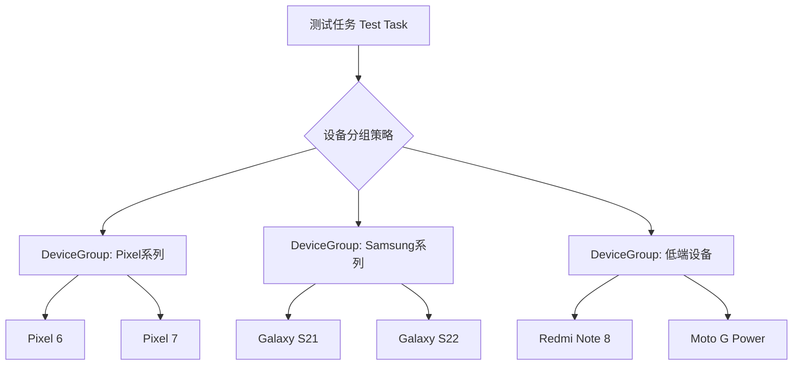
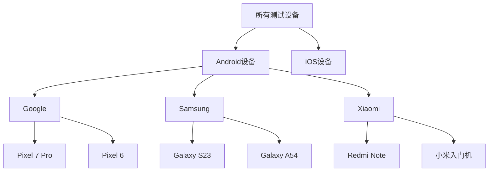

# 21.1.114 设备组

清晨的光总是来得比闹钟早。

洛芙是被帐篷外的水鸟叫声吵醒的。她揉了揉眼睛，帐篷的布料上透进来一层薄薄的晨光，湿漉漉的空气里夹杂着湖水特有的清新。昨夜的星空不知道什么时候悄悄藏进了云层，取而代之的是一片温柔的淡蓝色天幕。

“起来了？昨晚睡得好吗？”

黛琳的声音从帐篷门口传来。她已经起来了，正坐在营地边的石头上，膝盖上放着一台笔记本电脑。屏幕的光映在她脸上，显得格外专注。

洛芙钻出睡袋，伸了个懒腰。伊莎还在睡，自动售卖机买的薄荷糖包装纸在脑袋旁边闪着光。希尔不知道什么时候已经不在帐篷里了，水边传来她用树枝戳弄东西的声音。

“黛琳姐，一大早在看什么？”洛芙凑过去，屏幕上满满的都是代码和配置文件。

“在看测试的事。”黛琳把电脑转过来给她看，“昨天我们讲了依赖选择，今天来聊聊设备——不是手机硬件，是我们在跑instrumented test（仪表化测试）的时候，怎么管理一堆物理设备。”

“设备？我们不是有用模拟器吗？”洛芙眨了眨眼。

“模拟器是很好，但有些测试必须在真机上跑。”黛琳指了指远处湖边正在活动的希尔，“比如需要真实传感器、相机、GPS的测试，或者性能测试——真机和模拟器的表现完全不一样。”

---

“所以...一堆手机怎么管？”洛芙把自己的早餐（昨天剩下的烤肉串）拿过来，咬了一口，含糊不清地问。

希尔不知道什么时候凑了过来，手里拿着一把烧烤酱汁沾满的肉串。“这个问题问得好！你知道吗，之前我们团队有十台测试手机，每次跑测试都要手动分配——谁跑这一套，谁跑那一套，烦死了。”

“那你们怎么解决的？”洛芙好奇地问。

“后来用了DeviceGroup。”黛琳在电脑上敲了几个键，屏幕上出现了一个配置文件。她指着代码解释道，“DeviceGroup是Android Gradle API里提供的一个DSL（领域特定语言），让你可以把多台物理设备编成一组，然后给这组设备分配测试任务。”

“就像...露营的时候分组？”洛芙试着理解。

“差不多。”黛琳笑了，“比如我们有十个人去露营，可以分成‘负责做饭的一组’、‘负责搭帐篷的一组’、‘负责找柴火的一组’。DeviceGroup就是这个意思——把测试设备分成不同的组，每个组跑不同的测试套件。”

---

黛琳把笔记本放在草地上，抽出白板笔，在石头上画了起来。

“先给你看整体的结构。”她画了一个简单的示意图。



“看到没有？”黛琳指着图说，“你可以定义多个DeviceGroup，每个DeviceGroup里包含一组物理设备。然后当你运行测试时，Gradle会自动把测试任务分发给这些设备。”

“这样就不用手动分配了！”洛芙眼睛一亮，“那...怎么定义一个DeviceGroup？”

“来，我们写一个看看。”黛琳又把电脑转回来，打开一个build.gradle文件。

“在android { }块里，有一个deviceBlocks，用于配置设备相关的东西。”她一边说一边敲代码。

```kotlin
android {
    // 定义一个名为 "phone" 的设备组
    deviceGroup("phone") {
        // 添加 Pixel 6 设备
        device {
            model = "Pixel 6"
            manufacturer = "Google"
            version = 33  // Android 13
        }
        
        // 添加 Samsung Galaxy S21
        device {
            model = "Galaxy S21"
            manufacturer = "Samsung"
            version = 33
        }
        
        // 添加入门级设备
        device {
            model = "Moto G Power"
            manufacturer = "Motorola"
            version = 31  // Android 12
        }
    }
    
    // 还可以定义另一个设备组
    deviceGroup("tablet") {
        device {
            model = "Pixel C"
            manufacturer = "Google"
            version = 33
        }
        device {
            model = "Galaxy Tab S8"
            manufacturer = "Samsung"
            version = 33
        }
    }
}
```

洛芙盯着代码看了好几秒。“这个...看起来不是很复杂？”

“定义确实不难。”黛琳点点头，“真正的难点在于：什么时候用什么设备组，以及怎么和测试框架配合。”

---

伊莎不知道什么时候醒了，从帐篷里探出头来，头发乱糟糟的。“聊什么呢？一大早的。”

“在聊DeviceGroup。”希尔朝她招了招手，“伊莎，来给我们讲个比喻！”

伊莎揉了揉眼睛，慢慢走过来，看着白板上的图，微微一笑。

“如果把测试想想成一场音乐会...”她轻声说，“那么DeviceGroup就像...音乐会的不同区域。第一排的座位是VIP，音响效果最好，适合跑需要精确结果的测试；中间的区域是普通票，适合常规测试；后排...是便宜的票，适合跑一些不太重要的测试。”

“设备就是观众？”洛芙问。

“对。不同的观众坐在不同的区域——Google Pixel坐在第一排，三星坐在中间，偶尔还有一台老旧的红米手机坐在后排，看看它能不能跑得动。”

希尔“扑哧”一声笑了出来：“伊莎这个比喻可以！那我继续说——如果你有一场演出（测试任务），你不想让所有观众（设备）都挤在同一个区域（跑同一个测试），而是让他们分流到不同的区域（设备组）去。”

“这就是DeviceGroup的核心作用。”黛琳补充道，“分流。它不只帮你分组，还能和DeviceSelector（设备选择器）配合，实现更智能的分发。”

---

“DeviceSelector又是什么？”洛芙问道。

“如果说DeviceGroup是‘把设备分组’，那DeviceSelector就是‘选择哪个组来跑这个测试’。”黛琳在电脑上搜索了一下，调出另一个配置文件，“看，这是DeviceSelector的用法。”

她开始写代码：

```kotlin
android {
    // 先定义设备组
    deviceGroup("highEnd") {
        device {
            model = "Pixel 7 Pro"
            manufacturer = "Google"
            version = 34
        }
        device {
            model = "Galaxy S23 Ultra"
            manufacturer = "Samsung"
            version = 34
        }
    }
    
    deviceGroup("lowEnd") {
        device {
            model = "Redmi Note 11"
            manufacturer = "Xiaomi"
            version = 31
        }
        device {
            model = "Moto G Stylus"
            manufacturer = "Motorola"
            version = 31
        }
    }
    
    // 然后定义设备选择器
    deviceSelector {
        // 选择器名称
        name = "performance"
        
        // 策略：所有设备都跑这个测试
        fallback {
            strategy = "all"
        }
    }
    
    // 另一个选择器
    deviceSelector {
        name = "compatibility"
        
        // 只选择特定设备组
        group("highEnd")
        
        // 或者指定最小SDK版本
        minSdkVersion = 30
    }
}
```

洛芙歪着头看代码：“那个strategy = 'all'是什么意思？”

“就是所有设备都跑。”黛琳解释道，“但如果你写`strategy = 'unique'`，那只会选择每个型号的第一台设备，避免重复。”

“比如你有五台Pixel 6，只跑一台？”希尔问。

“对。这样可以节省测试时间。”

---

洛芙忽然想到一个问题：“那...如果我想让高端设备跑性能测试，低端设备跑兼容性测试，怎么弄？”

“这就到了体现DeviceGroup和DeviceSelector配合的威力了。”黛琳把屏幕往下拉，调出更多的配置示例。

```kotlin
android {
    // 定义设备组
    deviceGroup("performanceDevices") {
        device {
            model = "Pixel 7 Pro"
            manufacturer = "Google"
            version = 34
        }
        device {
            model = "Galaxy S23+"
            manufacturer = "Samsung"
            version = 34
        }
    }
    
    deviceGroup("compatibilityDevices") {
        device {
            model = "Redmi Note 8"
            manufacturer = "Xiaomi"
            version = 30
        }
        device {
            model = "Moto G Power"
            manufacturer = "Motorola"
            version = 29
        }
    }
    
    // 定义测试任务，关联到设备组
    testInstrumentationRunnerArgument("deviceGroup", "performanceDevices")
}

// 或者在 build.gradle.kts 中
androidComponents {
    onVariants(selector().all()) {
        // 为特定变体指定设备组
        testInstrumentationRunnerArguments["deviceGroup"] = "performanceDevices"
    }
}
```

“原来是这样...”洛芙若有所思，“所以测试任务会通过deviceGroup参数知道要用哪个设备组。”

“对，这是最基础的用法。”黛琳点头，“但DeviceGroup还有更多高级特性，比如...”她顿了顿，“热量管理。”

“热量？”洛芙抬起眉头。

“在真机上跑大量测试，手机会发热。发热可能导致测试结果不稳定——传感器读数漂移、CPU降频、电池加热...这些都是测试中常见的干扰因素。”

黛琳调出另一个配置示例：

```kotlin
android {
    deviceGroup("thermalAware") {
        // 设备数量
        device {
            model = "Pixel 6"
            manufacturer = "Google"
            version = 33
            // 热度相关的配置
            temperature {
                // 允许的最高温度（摄氏度）
                threshold = 40
                // 超过阈值时的策略
                action = "skip"  // 可以是 "skip", "wait", "fail"
            }
        }
        
        // 或者禁用某些设备的热量监控
        device {
            model = "Old Phone"
            manufacturer = "Generic"
            version = 26
            temperature {
                disabled = true
            }
        }
    }
}
```

“如果设备温度超过40度，就跳过这个测试？”洛芙问。

“或者等待降温，或者直接失败——取决于你配置什么action。”

---

希尔一直在旁边捣鼓她的手机，这时候突然抬起头来。

“说到温度，我有个反例！”她兴致勃勃地说，“之前我们组有个人配置DeviceGroup，把十台手机全放进一个组里，然后跑一个特别长的压力测试。结果五台手机同时过热，测试全失败了。”

“这就是典型的反面教材。”黛琳说，“DeviceGroup不是越大越好，要根据测试特性和设备能力来分组。”

她转向洛芙，认真地说：“记住这一条原则——让合适的设备跑合适的测试。性能测试用旗舰机，兼容性测试用入门机，热量敏感的测试控制并发数量。”

“那...错误配置长什么样？”洛芙问。

黛琳现场写了一个反面示例：

```kotlin
// ❌ 反面示例：把所有设备塞进一个组
android {
    deviceGroup("everything") {
        device { model = "Pixel 7"; version = 33 }
        device { model = "Galaxy S21"; version = 33 }
        device { model = "Redmi Note 8"; version = 30 }
        device { model = "Old Tablet"; version = 26 }
        device { model = "Another Old Phone"; version = 26 }
        device { model = "Yet Another Phone"; version = 31 }
        device { model = "Random Device"; version = 29 }
        device { model = "More Devices"; version = 32 }
        device { model = "Even More"; version = 33 }
        device { model = "Last One"; version = 34 }
    }
}
```

“你看，这样把所有设备混在一起，会有什么问题？”黛琳问。

洛芙想了想：“测试策略很难定制？有的设备跑不了某些测试？”

“对了。”黛琳放大显示的效果，继续说，“而且当你想让高端机跑性能测试时，可能会不小心把低端机也卷进去，导致测试失败或者结果不准确。”

“那怎么改进？”洛芙问。

黛琳在反面示例的基础上改写：

```kotlin
// ✅ 正面示例：按特性分组
android {
    // 旗舰机组 - 跑性能测试和最新特性测试
    deviceGroup("flagship") {
        device { model = "Pixel 7 Pro"; manufacturer = "Google"; version = 34 }
        device { model = "Galaxy S23 Ultra"; manufacturer = "Samsung"; version = 34 }
    }
    
    // 中端机组 - 跑常规功能测试
    deviceGroup("midRange") {
        device { model = "Pixel 6a"; manufacturer = "Google"; version = 33 }
        device { model = "Galaxy A54"; manufacturer = "Samsung"; version = 33 }
    }
    
    // 入门机组 - 跑最低配兼容测试
    deviceGroup("entryLevel") {
        device { model = "Redmi Note 8"; manufacturer = "Xiaomi"; version = 30 }
        device { model = "Moto G Power"; manufacturer = "Motorola"; version = 29 }
    }
}
```

“分好了组，怎么用呢？”洛芙问。

黛琳继续写：

```kotlin
// 在测试任务中引用设备组
android {
    // 方式1：命令行指定
    // ./gradlew testDebugUnitTest -PdeviceGroup=flagship
    
    // 方式2：在构建变体中配置
    onVariant("debug") {
        // 高端机组跑性能测试
        testInstrumentationRunnerArgument("deviceGroup", "flagship")
    }
    
    onVariant("release") {
        // 所有设备跑完整测试套件
        testInstrumentationRunnerArguments["deviceGroup"] = "all"
    }
}
```

“原来如此！”洛芙长舒一口气，感觉对这个概念清晰多了。

---

这时，伊莎从背包里掏出一把小坚果，开始剥起来。清晨的阳光穿过树叶，在草地上洒下斑驳的光影。

“DeviceGroup还有一个很大的好处，”伊莎轻声说，“就是可以扩展。”

“扩展？”洛芙看向她。

“你想啊，如果以后公司买了新手机，你只需要把它加到对应的组里就可以了。不需要改测试代码，不需要重新写分发逻辑。这就像...露营的时候，如果多来了一个人，直接把他分到某个小组就行，帐篷怎么搭、火怎么生，都不用变。”

黛琳补充道：“而且DeviceGroup是可以嵌套的。大的组下面可以有小组——比如‘安卓设备’下面有‘三星组’和‘谷歌组’，‘三星组’下面又有‘旗舰组’和‘中端组’。很灵活。”

她又画了一个嵌套的示意图：



“这种层级结构在实际项目中非常有用。”黛琳说，“公司越大，设备越多，分组就越细。”

---

洛芙低头看看手表：“哎呀，聊了这么久，太阳都升高了！”

确实，晨雾已经完全散去，湖面上波光粼粼，远处的山轮廓清晰。希尔不知道什么时候已经去湖边捡树枝了，远处传来她的歌声。

“那我最后问一个问题，”洛芙说，“DeviceGroup和之前学的build variant（构建变体）有什么关系？”

黛琳露出赞许的微笑：“好问题。简单说——build variant决定你构建什么（debug还是release，paid还是free），DeviceGroup决定你在什么设备上测试。它们是正交的，可以任意组合。”

“那就是...”洛芙快速思考，“我可以有debug版本在Pixel 6上跑测试，release版本在Galaxy S21上跑测试？”

“对。DeviceGroup和构建变体的维度是分开的，你可以任意组合。”

---

洛芙伸了个懒腰，感受着清晨的阳光照在肩膀上。远处的山雀叫了几声，声音清脆。

“所以今天学到的东西...”她总结道，“DeviceGroup是用来把物理测试设备分组管理的，DeviceSelector是用来选择哪个组跑哪个测试的。要根据设备能力来分组，不要把所有设备塞到一个组里。”

“很好。”黛琳合上笔记本电脑，笑着说，“去吃早餐吧，今天中午我们换个地方露营。”

“去哪？”洛芙问。

“上山。”伊莎已经收拾好东西了，“山上有更好的观星地点。”

---

> 学习建议

DeviceGroup是Android Gradle构建系统中管理物理测试设备的核心API。通过合理分组，可以实现测试任务的智能分发，提高测试效率并确保覆盖不同能力层级的设备。建议在实际项目中按设备能力（旗舰/中端/入门）和测试类型（性能/功能/兼容）两个维度进行分组，同时注意设备的热量管理配置。

---

## 洛芙的小小日记本

今天学DeviceGroup！原来测试手机也要像露营分组一样——旗舰机跑性能测试，入门机跑兼容性测试。黛琳说“让合适的设备跑合适的测试”，我觉得不只是代码，什么事都是这样道理。下午上山露营，期待晚上的星空🌙

---

## 今日关键词

- **DeviceGroup**：Android Gradle DSL中用于将物理测试设备分组配置的API，可以通过model、manufacturer、version等属性定义设备
- **DeviceSelector**：设备选择器，用于选择哪个设备组来执行特定的测试任务，支持策略配置如all、unique等
- **Instrumented Test**：仪表化测试，需要在真实设备或模拟器上运行的Android测试，可访问设备硬件和系统API
- **Temperature Threshold**：设备热量阈值配置，当设备温度超过设定值时自动采取相应动作（skip/wait/fail）
- **build variant**：构建变体，debug/release、付费/免费等维度组合生成的构建产物
- **Gradle DSL**：领域特定语言，Gradle中用于配置构建脚本的声明式语法
- **testInstrumentationRunnerArgument**：测试运行器参数，用于向测试框架传递配置信息
- **minSdkVersion**：最小SDK版本，指定应用支持的最低Android系统版本
- **Fallback Strategy**：后备策略，当主选择策略无法匹配设备时的备用方案