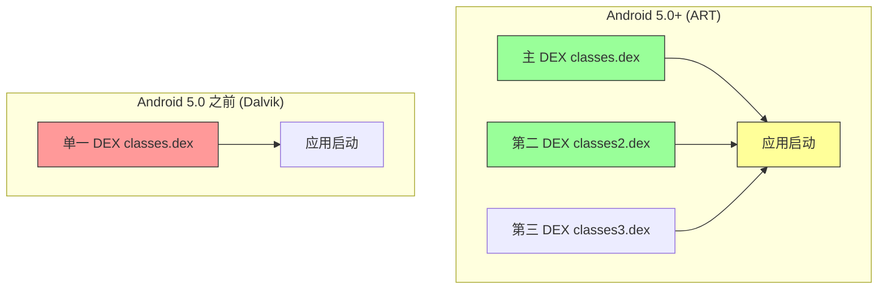
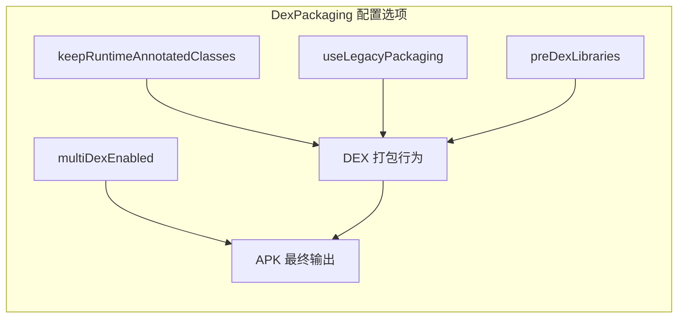

# 21.1.115 德克斯包装

清晨的光总是比闹钟勤快。

洛芙是被帐篷外鸟儿的啁啾声叫醒的。她睁开眼，帐篷的帆布上映着一层暖黄色的光晕，侧耳倾听，有水流轻轻拍打岸边的声响，还有伊莎哼歌的声音——她在用便携炉具煮什么东西，空气中飘着淡淡的玉米片香味。

“醒啦？”希尔从帐篷缝隙里探进头来，手里拿着一台平板电脑，“黛琳姐说今天早上要给你讲点重要的东西——关于APK是怎么生成的。”

“APK怎么生成？”洛芙揉了揉眼睛，昨夜的星空记忆还模模糊糊地留在脑海里，“我们昨天不是讲了DeviceGroup吗？”

“DeviceGroup是跑测试用的，今天这个是打包用的。”希尔笑了笑，“你知道你的代码最后是怎么变成手机上能跑的应用的吗？”

洛芙摇了摇头，钻出睡袋。帐篷外的空气凉丝丝的，带着湖水特有的清新。晨雾还没有完全散去，对岸的山轮廓模糊，像一幅淡墨山水画。黛琳坐在湖边的一块大石头上，膝盖上放着一台笔记本电脑，屏幕上是满满当当的代码。

“黛琳姐，洛芙醒了！”希尔朝那边喊了一声。

黛琳抬起头，朝这边招了招手：“洛芙，过来坐。这边风景好。”

洛芙走过去，在黛琳旁边找了个位置坐下。伊莎端着一碗热腾腾的玉米片凑过来，递给洛芙：“先吃点东西，今天要学的东西挺有意思的。”

“什么啊？”洛芙接过碗，玉米片软乎乎的，带着牛奶的香甜。

“ DEX包装。”黛琳把电脑转过来，指着屏幕上的build.gradle文件说，“昨天我们讲了怎么管理测试设备，今天来讲讲你的代码最后是怎么变成APK的——具体来说，就是DEX文件是怎么打包的。”

---

“DEX？”洛芙咬了一口玉米片，含糊不清地问，“是那个.exe之类的吗？”

“差不多，但不太一样。”黛琳笑了笑，“Android不叫.exe，叫DEX，全称是Dalvik Executable。你写的Kotlin或Java代码，会先被编译成.class文件，然后通过一个叫dex-compiler的工具转换成.dex文件，最后打包进APK里。”

“就像...先把食材切好，再做成菜？”洛芙试着理解。

“比这个还复杂一点。”黛琳在石头上敲了敲，“你知道为什么需要DEX吗？因为Android用的是Dalvik虚拟机（后来进化成了ART），和普通的Java虚拟机不一样。普通的JVM用的是字节码，而Android需要自己的格式——这就是DEX。”

希尔凑过来补充道：“而且DEX格式是专门为移动设备设计的——它更紧凑，占用内存更少，启动更快。你可以把DEX理解为给手机量身定做的'便当盒'，而普通的.class文件是给电脑准备的'大餐盒'。”

“便当盒...”洛芙想了想，“那这个'德克斯包装'就是...怎么把这个便当盒打包好？”

“对，就是这个意思。”黛琳笑了，“DexPackaging就是控制这个打包过程的一组配置选项。”

---

黛琳把电脑放在草地上，抽出白板笔，在一块平整的石头上画了起来。

“先给你看整体流程。”她画了一个简单的示意图。


“看到没有？”黛琳指着图说，“源代码先被编译成class文件，然后通过dx工具转换成DEX格式，最后打包进APK。D8/R8编译器负责这个转换过程，而DexPackaging就是控制这个转换和打包的选项。”

“听起来好复杂...”洛芙看着图说。

“其实配置起来没那么复杂。”黛琳把电脑转回来，“来，我们看一个典型的DexPackaging配置。”

```kotlin
android {
    compileSdk = 34
    
    defaultConfig {
        // 启用多DEX支持
        multiDexEnabled = true
    }
    
    packaging {
        // 是否保留带有Runtime注解的类
        // 这会影响某些依赖注入框架的工作
        keepRuntimeAnnotatedClasses = true
        
        // 是否使用旧版打包方式（Android 5.0之前）
        // true = 兼容模式，所有DEX打包成一个classes.dex
        // false = 原生模式，每个DEX单独打包
        useLegacyPackaging = false
        
        // 是否预-dex库文件
        // 预-dex可以加快增量构建速度
        // 但会增加磁盘占用
        preDexLibraries = true
        
        // DEX文件分块策略
        // mainDexListFile 指定主DEX包含哪些类
        mainDexListFile = file("app/maindexlist.txt")
    }
}
```

洛芙盯着代码看了好几秒。“这个...看起来选项好多啊。能给我解释一下吗？”

---

伊莎端着一杯热可可走过来，在旁边坐下，笑着说：“我来给你讲个故事帮你理解吧。”

“什么故事？”洛芙好奇地问。

“如果把你的应用想象成一家餐厅...”伊莎轻声说，“那么DEX文件就是做好的菜品。你是餐厅老板，需要决定怎么上菜——”

“ 上菜？”洛芙眨了眨眼。

“对。有两种上菜方式。”伊莎比划着，“第一种，把所有菜都放在一个大托盘里，一起端上桌——这就是useLegacyPackaging = true，简单，但所有菜都混在一起，找起来麻烦。”

“第二种呢？”

“第二种是把菜分门别类——主菜放一盘，汤放一盘，甜点放一盘，各自独立。这就是useLegacyPackaging = false（原生模式），每一道菜（每个DEX文件）都是单独的。上菜快，找起来也方便。”

“原来如此！”洛芙眼睛一亮，“那keepRuntimeAnnotatedClasses是做什么的？”

“那是给厨师的特殊说明。”希尔插嘴道，“有些厨师需要知道哪些菜有特殊备注——比如'不要香菜'、'要少盐'之类的。这些备注就是Runtime注解。如果这个选项设为true，这些注解会被保留；如果设为false，这些注解就会被省略掉，省地方但厨师可能看不到备注。”

“如果厨师看不到备注...”洛芙若有所思，“那会怎样？”

“如果你的应用用到了依赖注入框架，比如Dagger或者Hilt，它们需要Runtime注解来知道哪些类需要注入。”黛琳解释道，“如果把keepRuntimeAnnotatedClasses设为false，这些框架可能就会失灵。”

“这么严重！”洛芙吓了一跳。

“所以这个选项要小心。”黛琳点点头，“一般来说，保持默认的true是比较安全的。”

---

“那preDexLibraries呢？”洛芙又问，“预-dex是什么意思？”

“预-dex啊...”希尔想了想，“就像是你去露营之前，先把食材在家里切好、洗好、打包好。到了营地，你只需要把它们加热一下就可以吃了，不用再从头开始处理。”

“如果不预-dex呢？”

“如果不预-dex，就像你带着原材料去露营，到了地方再切、再洗、再烹饪。”希尔耸耸肩，“前者需要更多准备工作（磁盘空间），后者需要更多现场时间（构建时间）。preDexLibraries = true 就是用空间换时间。”

洛芙似懂非懂地点了点头：“所以...如果磁盘空间不够，就把它设为false？”

“对，但通常预-dex的库文件可以复用，下一次构建会更快。”黛琳补充道，“如果是团队共享的CI服务器，预-dex特别有价值。”

---

黛琳又在石头上画了一幅图，这次是关于多DEX的。



“看到这个区别了吗？”黛琳指着图说，“在Android 5.0（API 21）之前，只支持单一的DEX文件，所有的类都必须塞进classes.dex里。如果你的应用超过了65536个方法限制，就会爆炸——这就是著名的'64K方法限制'。”

“65536？”洛芙惊呼，“这么多方法还不够？”

“对于大型应用来说，很容易就超过这个限制。”希尔说，“一个成熟的APP，动辄几十个第三方库，加起来方法数轻松超过六万。”

“那怎么办？”

“后来Google推出了MultiDex支持。”黛琳解释道，“从Android 5.0开始，系统原生支持多个DEX文件。如果你的应用方法数超过限制，就可以把代码拆分到多个DEX文件里——classes.dex、classes2.dex、classes3.dex...”

“这就是multiDexEnabled = true的作用？”洛芙问。

“对。启用这个选项后，Gradle会自动帮你把代码拆分成多个DEX文件。”黛琳点点头，“不过要注意，首次安装应用的时候，需要分别加载所有DEX文件，可能会导致安装时间变长。”

“而且有些老设备上，可能会有问题。”希尔补充道，“某些厂商的定制系统对MultiDex支持不完善，会导致应用无法安装或者启动崩溃。”

---

“那...我们应该怎么配置才比较好？”洛芙问道。

“这个问题问得好。”黛琳打开电脑上的另一个配置文件，“给你看一个比较稳妥的配置。”

```kotlin
android {
    compileSdk = 34
    namespace = "com.example.myapp"
    
    defaultConfig {
        applicationId = "com.example.myapp"
        minSdk = 21  // 最低支持 Android 5.0
        targetSdk = 34
        multiDexEnabled = true  // 启用多DEX
        
        // 启用MultiDex的自动配置
        // 这会自动决定哪些类放在主DEX里
        multiDexKeepFile = file("multidex-config.txt")
    }
    
    buildTypes {
        release {
            // Release 构建启用代码混淆和压缩
            isMinifyEnabled = true
            isShrinkResources = true
            proguardFiles(
                getDefaultProguardFile("proguard-android-optimize.txt"),
                "proguard-rules.pro"
            )
        }
    }
    
    packaging {
        // 保留Runtime注解，确保依赖注入框架正常工作
        keepRuntimeAnnotatedClasses = true
        
        // 使用原生打包方式
        useLegacyPackaging = false
        
        // 库文件预-dex，加快构建速度
        preDexLibraries = true
        
        // 排除不必要的资源文件，减小APK体积
        resources {
            excludes += "/META-INF/{AL2.0,LGPL2.1}"
            excludes += "META-INF/DEPENDENCIES"
            excludes += "META-INF/LICENSE"
            excludes += "META-INF/LICENSE.txt"
            excludes += "META-INF/license.txt"
            excludes += "META-INF/NOTICE"
            excludes += "META-INF/NOTICE.txt"
            excludes += "META-INF/notice.txt"
            excludes += "META-INF/ASL2.0"
            excludes += "META-INF/*.kotlin_module"
        }
    }
}
```

洛芙看到最后那个resources部分：“这些exclude是做什么的？”

“排除不需要的文件。”黛琳解释道，“打包进APK的时候，有些文件是不需要的——比如Java库的许可证文件（LICENSE）、依赖声明（DEPENDENCIES）、Kotlin模块文件等。排除它们可以让APK更小。”

“原来如此！”洛芙点头，“那如果我不想要这些选项，用默认的可以吗？”

“可以，默认配置对于大多数应用来说已经够用了。”黛琳说，“但如果你想优化APK体积或者解决某些特定问题，就需要调整这些选项。”

---

伊莎一直在旁边听着，这时候轻声说：“我想到一个比喻——”

“什么比喻？”洛芙问。

“DEX文件就像露营时的行李打包。”伊莎微笑着说，“如果你的行李很少，一个背包就够了——这就是legacy packaging。如果行李很多，你就需要分门别类地打包——这个放衣物包，这个放食物包，这个放工具包——这就是multiDex。”

“那keepRuntimeAnnotatedClasses呢？”洛芙问。

“那是行李清单。”伊莎说，“如果你不保留清单，你就不知道每个包里装了什么——某些依赖注入框架（比如Dagger）需要这个清单才能正常工作。”

“preDexLibraries呢？”

“那是预先打包好的真空包装食品。”伊莎想了想，“在家里就处理好，带到营地直接加热就行——省时间，但需要更多的打包空间。”

洛芙“扑哧”一声笑了出来：“伊莎姐的比喻总是这么形象！”

---

希尔突然拍了拍手：“对了，洛芙，我给你看个好玩的东西！”

她打开电脑，运行了一个简单的构建命令，然后指着输出的日志说：“看，这是构建时DEX打包的日志。”

```
> Task :app:dexDebug
Dexing debug-dex\classes.dex with plugin GameThreadSampler on 3 daemons.
Dexing debug-dex\classes2.dex with plugin GameThreadSampler on 3 daemons.
Dexing debug-dex\classes3.dex with plugin GameThreadSampler on 3 daemons.
Dexing debug-dex\classes4.dex with plugin GameThreadSampler on 3 daemons.

BUILD SUCCESSFUL in 45s
```

“哇，真的有多个DEX文件！”洛芙凑过去看，“classes2.dex、classes3.dex...看来我们的应用确实方法很多啊。”

“所以需要MultiDex。”希尔说，“如果不启用这个选项，构建就会失败，报错说'Too many method references'。”

“好险！”洛芙拍了拍胸口，“还好有MultiDex！”

---

清晨的阳光渐渐强烈起来，晨雾已经完全散去，湖面波光粼粼，远处的山峰轮廓清晰。伊莎收拾起便携炉具，希尔去湖边洗手，黛琳合上笔记本电脑，拍了拍身边的草地。

“今天的内容差不多就是这些。”黛琳看着洛芙说，“DexPackaging看起来选项很多，但核心就是那么几个：是否启用多DEX、是否保留Runtime注解、是否使用旧版打包方式、是否预-dex库文件。”

“知道了！”洛芙认真点头，“我回去要把这些记下来。”

“先别急着记。”希尔走回来，手里拿着一根树枝，“我问你几个问题，考考你记住了多少。”

“好啊！”洛芙自信地说。

“第一，如果你的应用用到了Dagger或Hilt，应该把keepRuntimeAnnotatedClasses设为什么？”

洛芙想了想：“设 为true！因为这些依赖注入框架需要Runtime注解来工作！”

“正确！”希尔打了个响指，“第二，如果你的minSdk设的是21（Android 5.0），useLegacyPackaging应该设为什么？”

“设 为false！”洛芙回答，“因为Android 5.0原生支持多个DEX，不需要legacy mode！”

“也对！”希尔笑着点头，“第三，预-dex库文件是用什么换什么？”

洛芙犹豫了一下：“用磁盘空间换...构建时间？”

“对！预-dex需要更多磁盘空间，但可以加快后续的增量构建。”希尔把树枝扔进湖里，“好了，你基本都掌握了！”

---

洛芙伸了个懒腰，清晨的露营地里鸟语花香，一切都那么美好。她看着远处的湖面，心里想着刚才学到的知识。

“黛琳姐，”她突然想到一个问题，“如果我想看APK里到底有哪些DEX文件，该怎么办？”

“这个简单。”黛琳重新打开电脑，“用ZIP工具打开APK文件，你会看到里面有classes.dex、classes2.dex等文件。或者用Android Studio的APK Analyzer工具，可以直观地看到APK的组成。”

“那我想看每个DEX文件里有哪些类呢？”

“那就需要用dx工具或者一些第三方工具来反编译DEX文件了。”黛琳说，“不过一般来说，你不需要直接看DEX文件的内容——除非遇到一些奇怪的问题。”

“如果遇到奇怪的问题呢？”洛芙追问。

“那时候你就需要用工具来分析DEX了。”希尔插嘴道，“比如用dexdump工具可以查看DEX文件的内容，用baksmali可以反编译DEX成smali代码——不过这是高级技巧了，以后有机会再说。”

洛芙似懂非懂地点了点头。

---

早餐时间结束了，四个人开始收拾东西。洛芙把帐篷里的睡袋卷起来，放进背包里。希尔在湖边把平板电脑收好，伊莎在检查有没有落下东西。

黛琳最后环顾了一下营地，确认没有留下垃圾。她看着洛芙，笑着说：“今天学的DexPackaging，是APK打包过程中很重要的一环。虽然平时可能不需要怎么配置，但了解这些选项的含义，对于解决构建问题和优化APK体积都很有帮助。”

“谢谢黛琳姐！”洛芙背上背包，“我今天学到了很多！”

“那就好。”黛琳点点头，“接下来我们要去下一个地方了——今天的露营之旅还很长呢！”

一行人离开了湖边的小营地，沿着山路向前走去。夏日的阳光透过树叶洒下来，在地上投下斑驳的光影。新的一天，新的知识，新的冒险。

---

> **DexPackaging（德克斯包装）** 是 Android Gradle 构建系统中控制 DEX（Dalvik Executable）文件打包过程的核心配置接口。DEX 文件是 Android 特有的字节码格式，Kotlin/Java 源代码经过编译后会转换为 DEX 格式并打包进 APK 中。DexPackaging 允许开发者配置多 DEX 支持、Runtime 注解保留、旧版打包兼容性、库文件预 dex 等关键选项，以优化构建性能和 APK 体积。

#### 结构图



#### 复杂度与影响

| 配置选项 | 作用 | 性能影响 |
|---------|------|---------|
| keepRuntimeAnnotatedClasses | 保留Runtime注解 | 影响APK体积（约1-5KB） |
| useLegacyPackaging | 使用单DEX打包 | 启用后APK更小但启动更慢 |
| preDexLibraries | 预-dex库文件 | 增加磁盘占用，加快增量构建 |
| multiDexEnabled | 启用多DEX支持 | 解决64K方法限制，但增加APK复杂度 |

#### 反模式与陷阱

1. **minSdk < 21 且未启用 MultiDex** → 应用可能无法安装（64K方法限制），解决：启用 multiDexEnabled = true
2. **keepRuntimeAnnotatedClasses = false 导致依赖注入失效** → Dagger/Hilt框架无法工作，解决：设为 true 或手动配置保留规则
3. **useLegacyPackaging = true 在新设备上运行** → 浪费DEX加载时间，解决：设为 false 或使用 minSdk 条件判断
4. **未排除不必要的META-INF文件** → APK体积无谓增大，解决：添加 excludes 规则

#### 设计哲学

DEX 打包策略体现了 Android 构建系统的核心权衡：**空间与时间的平衡**。预-dex 库文件是用磁盘空间换取增量构建速度；多DEX支持是用首次安装时间换取方法数自由；保留Runtime注解是用微小APK体积换取框架兼容性。理解这些权衡，才能做出正确的配置决策。

#### 🏕️ 动手练习

**目标**：创建一个支持 MultiDex 的 Android 项目，并验证 DexPackaging 配置的效果。

**Task 1：创建项目并启用 MultiDex**
- 目标：理解 multiDexEnabled 的作用
- 步骤：
  1. 在 Android Studio 中创建新项目（选择 Empty Views Activity）
  2. 在 app/build.gradle.kts 的 defaultConfig 中添加 `multiDexEnabled = true`
  3. 添加 MultiDex 依赖：`implementation("androidx.multidex:multidex:2.0.1")`
  4. 如果 minSdk < 21，在 Application 类中继承 MultiDexApplication
- 验收标准：
  - [ ] 项目成功构建
  - [ ] 生成的 APK 中包含多个 classes[N].dex 文件（使用 APK Analyzer 查看）
- 提示：
  ```kotlin
  // app/build.gradle.kts
  android {
      defaultConfig {
          multiDexEnabled = true
      }
  }
  dependencies {
      implementation("androidx.multidex:multidex:2.0.1")
  }
  ```

**Task 2：配置 keepRuntimeAnnotatedClasses**
- 目标：理解 Runtime 注解保留的作用
- 步骤：
  1. 在 app/build.gradle.kts 的 packaging 中添加 `keepRuntimeAnnotatedClasses = true`
  2. 构建项目并检查构建日志
  3. 尝试设置为 false，再次构建并比较差异
- 验收标准：
  - [ ] 能够切换两种配置并成功构建
  - [ ] 观察到 keepRuntimeAnnotatedClasses 对 APK 体积的微小影响
- 提示：
  ```kotlin
  packaging {
      keepRuntimeAnnotatedClasses = true  // 保留注解
      // keepRuntimeAnnotatedClasses = false  // 不保留注解
  }
  ```

**Task 3：配置 preDexLibraries**
- 目标：理解预-dex 对构建速度的影响
- 步骤：
  1. 设置 `preDexLibraries = true`，执行一次 clean build，记录时间
  2. 不改变任何代码，再次执行 build，记录时间
  3. 设置 `preDexLibraries = false`，执行 clean build，记录时间
  4. 再次不改变代码，执行 build，记录时间
- 验收标准：
  - [ ] 完成四次构建并记录时间
  - [ ] 分析预-dex 对增量构建的影响
- 提示：
  ```kotlin
  packaging {
      preDexLibraries = true  // 预-dex库文件
  }
  ```

**Task 4：排除不必要的文件**
- 目标：减小 APK 体积
- 步骤：
  1. 在 packaging.resources 中添加排除规则
  2. 使用 APK Analyzer 查看排除前后的 APK 大小
  3. 对比 META-INF 目录的变化
- 验收标准：
  - [ ] 添加排除规则后 APK 体积减小
  - [ ] 确认 META-INF 中的不必要文件被排除
- 提示：
  ```kotlin
  packaging {
      resources {
          excludes += "/META-INF/{AL2.0,LGPL2.1}"
          excludes += "META-INF/DEPENDENCIES"
      }
  }
  ```

**Task 5：使用 APK Analyzer 分析 DEX**
- 目标：学会使用 Android Studio 工具
- 步骤：
  1. 在 Android Studio 中打开 APK Analyzer（Build → Analyze APK）
  2. 选择生成的 APK 文件
  3. 查看 DEX 文件的数量和大小
- 验收标准：
  - [ ] 能够打开 APK Analyzer
  - [ ] 识别 APK 中的所有 DEX 文件
  - [ ] 记录每个 DEX 文件的大小
- 提示：在 Android Studio 菜单中选择 Build → Analyze APK

#### 面试热身

- Q1: 请解释什么是 DEX 文件，以及它与 Java class 文件的区别？
- Q2: 什么情况下需要启用 MultiDex？启用后有什么注意事项？
- Q3: keepRuntimeAnnotatedClasses 选项的作用是什么？何时需要修改它？
- Q4: preDexLibraries 的工作原理是什么？它有什么优缺点？
- Q5: 如何排查因 DEX 打包导致的应用启动问题？

#### 参考实现要点

1. **minSdk ≥ 21 时 MultiDex 基本无影响**——ART 原生支持多 DEX，首次启动无额外延迟
2. **minSdk < 21 时需要 MultiDex 支持库**——继承 MultiDexApplication 或在 attachBaseContext 中调用 MultiDex.install(this)
3. **Release 构建建议关闭 useLegacyPackaging**——新设备上原生模式更快，旧设备会自动回退
4. **保持 keepRuntimeAnnotatedClasses = true**——除非确认没有使用依赖注入框架，否则不要关闭
5. **CI 服务器上建议启用 preDexLibraries**——团队共享时预-dex 的复用收益最大

---

> DEX 打包配置看起来选项繁多，但核心逻辑很清晰：先确保应用能够成功构建（启用 MultiDex），再根据实际情况优化打包策略。理解每一个选项的含义，才能在遇到构建问题时快速定位解决。

## 洛芙的小小日记本

今天的露营好充实！早上醒来就学了DexPackaging——原来我的代码变成手机上的APP，要经过这么多步骤。DX工具把class文件变成DEX，然后打包进APK。最有趣的是多DEX支持，就像把行李分门别类打包一样，终于理解为什么会有"64K方法限制"了。伊莎的露营比喻永远这么贴切！

---

## 今日关键词

- **DEX（Dalvik Executable）**：Android 专用的字节码格式，Kotlin/Java 代码编译后转换为 DEX 格式
- **MultiDex**：多 DEX 支持，允许应用包含多个 DEX 文件，解决 64K 方法数限制
- **D8/R8**：Android Gradle Plugin 中的 DEX 编译器，负责将 class 文件转换为 DEX
- **keepRuntimeAnnotatedClasses**：保留 Runtime 注解的配置选项，影响依赖注入框架工作
- **useLegacyPackaging**：是否使用旧版单 DEX 打包方式
- **preDexLibraries**：是否预-dex 库文件，用磁盘空间换增量构建速度
- **64K 方法限制**：Dalvik 虚拟机的单一 DEX 文件方法数上限（65536），超过需要 MultiDex
- **APK Analyzer**：Android Studio 工具，用于分析 APK 组成和大小
- **Runtime 注解**：运行时保留的注解，依赖注入框架（Dagger/Hilt）需要使用
- **ART（Android Runtime）**：Android 5.0+ 使用的运行时环境，原生支持多 DEX
