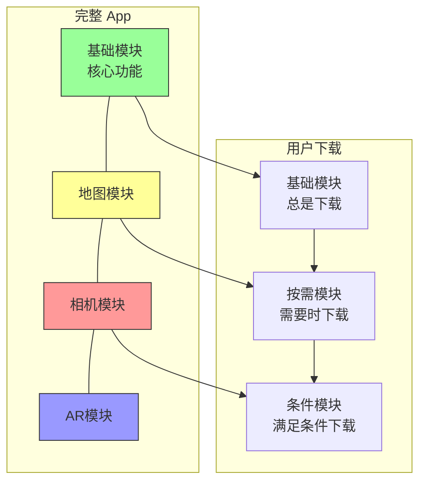
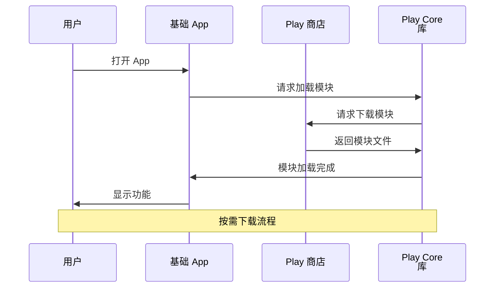

# 21.1.116 动态交付

太阳已经爬过树梢，露珠在草叶上闪闪发亮。

洛芙帮忙把防潮垫搬到一棵大树下——黛琳说这边凉快，适合继续上午的课程。伊莎从背包里拿出一个精致的食盒，打开来是切成小块的西瓜，红瓤绿皮，在阳光下显得格外诱人。

“先吃西瓜！”伊莎把食盒递给大家，“早上学的 DexPackaging 消化完了吗？”

洛芙接过西瓜咬了一口，清甜的汁水在嘴里化开：“消化完了！DEX 打包就像把行李分门别类放进不同的箱子，MultiDex 就是箱子太多时要分批搬。”

“领悟得很快嘛！”希尔笑着鼓掌，“那你知道打包好的 App 还能不能再拆分吗？”

“拆分？”洛芙愣了一下，“都已经打包成 APK 了，还能怎么拆？”

黛琳在水边洗了洗手，走过来在树下坐下：“当然可以拆——而且这正是我们今天要学的内容，叫 Dynamic Delivery，动态交付。”

“动态...交付？”洛芙把这个词重复了一遍，“是把东西寄出去的意思吗？”

“差不多是这个意思，”黛琳笑了笑，“想象一下，你开发了一个很大的 App，里面有地图功能、相机功能、AR 功能...但不是每个用户都需要所有功能。有些用户可能只需要地图，有些用户可能只用到相机。如果让所有用户都下载完整包，是不是太浪费了？”

洛芙眼睛一亮：“所以...可以让用户只下载自己需要的那部分？”

“对，这就是动态交付的意义。”黛琳点点头，“用户只下载他真正需要的功能，其他功能等用到的时候再下载。”

---

伊莎靠在树干上，悠悠地说：“这就像...露营的时候，你不会把所有东西都塞进一个背包吧？有些东西是必需的（基础模块），有些东西是可选的（动态模块）——比如帐篷是必须的，但钓鱼竿就可以看情况带。”

“太形象了！”希尔兴奋地打了个响指，“基础 App 就像帐篷，是安营扎寨的根本；动态模块就像钓鱼竿、烧烤架这些可选装备，需要的时候再从背包里拿出来。”

洛芙兴奋起来：“那要怎么配置这种'可选装备'？”

黛琳打开笔记本电脑：“我们先来看一个整体的架构图，然后一步步配置。”



“看到这个结构了吗？”黛琳指着图说，“你的 App 可以分成多个模块：基础模块是每个用户都必须下载的，而地图、相机、AR 这些是可选的动态模块。”

“那这些模块怎么下载呢？”洛芙问。

“有三种方式，”黛琳说，“第一种是安装时下载（install-time），用户安装 App 时就一起下载；第二种是按需下载（on-demand），用户用到时才下载；第三种是条件下载（conditional），满足特定条件时才下载。”

---

希尔打开一个配置文件：“我给你看一个实际的例子。这是我们假设的露营助手 App，它有三个动态模块。”

```kotlin
// app/build.gradle.kts (主模块)

plugins {
    id("com.android.application")
    id("org.jetbrains.kotlin.android")
}

android {
    namespace = "com.example.camping"
    compileSdk = 34
    
    defaultConfig {
        applicationId = "com.example.camping"
        minSdk = 24
        targetSdk = 34
    }
    
    // 启用动态交付
    dynamicDelivery {
        // 这是默认的交付类型配置
        isDefaultToSplitInstallRequests = true
    }
}

// 声明动态模块依赖
dependencies {
    // 核心模块（总是包含）
    implementation(project(":features:map"))
    implementation(project(":features:camera"))
    implementation(project(":features:ar"))
}
```

洛芙盯着代码：“这个 dynamicDelivery 块是做什么的？”

“它是 DynamicDelivery DSL 的入口，”黛琳解释道，“isDefaultToSplitInstallRequests = true 表示默认使用动态安装请求。也就是说，当用户需要某个模块时，系统会发起一个动态安装请求，而不是让整个 App 重新下载。”

“听起来好复杂...”洛芙挠了挠头。

“来，我们看看动态模块本身怎么配置。”希尔切换到另一个文件。

```kotlin
// features/map/build.gradle.kts (动态模块)

plugins {
    id("com.android.dynamic-feature")
    id("org.jetbrains.kotlin.android")
}

android {
    namespace = "com.example.camping.map"
    compileSdk = 34
    
    defaultConfig {
        minSdk = 24
    }
}

// 动态模块的交付配置
dynamicDelivery {
    // 交付类型：按需下载
    deliveryType = DeliveryType.ON_DEMAND
    
    // 启动时是否包含此模块
    // 如果设为 true，App 启动时就会下载这个模块
    // on-demand 模式下通常设为 false
    isEnabledAtStartup = false
}
```

“DeliveryType.ON_DEMAND 表示这个模块是'按需下载'的，”黛琳补充道，“用户第一次打开地图功能时，系统才会去下载这个模块。”

---

伊莎插嘴道：“让我来打个比方吧！”

她从草地上捡起几颗小石子，排成一排：“假设这些石子是你的 App 里的不同功能。这颗最大的石头是基础功能（地图），这颗中等的是相机功能，这颗最小的是 AR 功能。”

“如果用户只是来查地图的，”伊莎拿起中等大小的石头，“他只需要背这颗最大的石头（基础模块 + 地图模块）。”

“如果用户想拍照呢？”希尔配合地问。

“那他需要基础 + 相机模块，”伊莎又拿起另一颗石头，“如果他两个都想用...”

“那就基础 + 地图 + 相机！”洛芙抢着说，“按需下载，就是需要什么功能就下载什么石头！”

“对！”伊莎笑了，“而且这些石头是独立的，可以单独下载、单独更新。就像你更新相机模块时，不需要重新下载整个 App。”

---

黛琳又在白板上画了一幅更详细的图：



“这个图展示了按需下载的完整流程，”黛琳说，“用户打开 App 后，如果需要某个动态模块，App 会通过 Play Core 库向 Play 商店请求下载。下载完成后，模块就加载到 App 里可以用了。”

“那如果用户离线呢？”洛芙问。

“好问题！”希尔说，“离线情况下，按需下载会失败。所以通常会提供一个 fallback——比如在下载失败时，显示'此功能需要网络连接'。”

---

“现在我们来看另一种交付类型：条件交付。”黛琳切换到另一个配置文件。

```kotlin
// features/camera/build.gradle.kts (条件交付模块)

dynamicDelivery {
    // 交付类型：条件交付
    deliveryType = DeliveryType.CONDITIONAL
    
    // 条件配置
    conditionalDelivery {
        // 设备条件：需要至少 4GB RAM
        condition {
            minRamMb = 4096
        }
        
        // 设备条件：需要摄像头
        condition {
            deviceFeature = "android.hardware.camera"
        }
        
        // 国家条件：仅在某些国家交付
        // (需要配合 Play Console 配置)
    }
}
```

“条件交付就像...给不同的客人发不同的邀请函。”伊莎想了个比喻。

“什么意思？”洛芙歪着头。

“如果你的露营营地只接待有帐篷的客人，”伊莎解释道，“那么'有帐篷'就是一个条件。只有满足这个条件的客人（设备），才会收到邀请（下载这个模块）。”

“原来如此！”洛芙明白了，“比如这个相机模块，如果设备内存不够（小于 4GB），或者没有摄像头，就不下载？”

“对，”黛琳点点头，“这样可以避免用户下载了用不到的功能，浪费存储空间。”

---

“那安装时下载呢？”洛芙又问。

“安装时下载就是字面意思——安装 App 时就一起下载。”黛琳说，“通常用于用户'几乎总会用到'的功能，比如一些核心的 UI 组件。”

```kotlin
// features/onboarding/build.gradle.kts (安装时模块)

dynamicDelivery {
    // 交付类型：安装时下载
    deliveryType = DeliveryType.INSTALL_TIME
    
    // 是否压缩
    // 设为 true 时，模块会在安装时解压
    // 可以节省安装后的存储空间，但首次安装会稍慢
    compressInstallTimeout = true
}
```

希尔补充道：“安装时模块和基础模块的区别是——安装时模块可以独立更新，而基础模块更新时需要整个 App 重新安装。”

“听起来好像基础模块是'焊死'的？”洛芙问。

“差不多是这个意思，”希尔笑了，“不过基础模块也可以拆分——通过 App Bundle 的 splits 配置，可以把资源按语言、分辨率、ABI 拆分，这些是在安装时自动处理的。”

---

洛芙忽然想到一个问题：“那...如果我想用动态模块，但不用 Google Play 呢？”

黛琳的表情变得认真起来：“这是动态交付的一个限制——标准意义上的动态交付（通过 Play Core 库）需要 Google Play 的支持。因为 Play 商店负责托管和分发这些模块。”

“那国内的应用商店呢？”洛芙追问。

“一些国内商店也开始支持 App Bundle 了，”希尔说，“但动态模块的支持可能还不完整。如果是企业内部应用，可以使用内部的部署方案——比如把模块放在服务器上，自己实现下载逻辑。”

“如果不用动态模块，”黛琳补充道，“还有另一个选择：直接使用多个 APK（Multi-APK），通过 splits 配置按 ABI、分辨率、语言拆分。这些是 Google Play 自动处理的，不需要额外的代码。”

---

伊莎切开另一块西瓜，递给洛芙：“休息一下吧，吃完西瓜我们来看点实际的代码。”

洛芙接过西瓜，满足地咬了一口。阳光透过树叶的缝隙洒下来，在草地上投下摇曳的光斑。远处的湖面上，有几只水鸟轻轻掠过，荡起一圈圈涟漪。

“.dynamicDelivery 配置看起来好复杂，”洛芙含着西瓜，含糊地说，“但核心思想就是...按需加载？”

“对，”黛琳笑着说，“你想成一个'乐高积木'就好理解了。基础模块是底座，动态模块是各种积木块——你需要什么功能，就搭上什么积木。”

---

希尔把电脑转过来：“来，我们看一个完整的项目结构，这是实际开发中最常用的方式。”

```kotlin
// settings.gradle.kts

pluginManagement {
    repositories {
        google()
        mavenCentral()
        gradlePluginPortal()
    }
}

dependencyResolutionManagement {
    repositoriesMode.set(RepositoriesMode.FAIL_ON_PROJECT_REPOS)
    repositories {
        google()
        mavenCentral()
    }
}

// 启用动态模块支持
include(":app")
include(":features:map")
include(":features:camera")
include(":features:ar")
include(":features:onboarding")
```

“看到没有？”希尔指着屏幕说，“动态模块是独立的 Gradle 子项目，和主 App 是平级的。它们有自己独立的 build.gradle.kts，可以单独配置、单独构建。”

“这和普通的 library 模块有什么区别？”洛芙问。

“区别大了！”希尔说，“library 模块是打包进主 APK 的，永远和主 App 在一起；dynamic 模块是独立下载的，可以按需加载、单独更新。”

黛琳补充道：“而且 dynamic 模块有自己的 Application 类（如果需要的话），可以在模块加载时做一些初始化工作。”

---

洛芙似懂非懂地点了点头：“那...总结一下？”

“简单来说，”伊莎轻声总结，“动态交付就是让你的 App 像乐高一样可以组装——核心功能是底座，可选功能是积木。用户需要什么，就组装什么。”

“如果用 Google Play，”黛琳补充，“还可以实现按需下载、单独更新——用户不用每次更新都下载整个 App。”

“如果不用 Google Play，”希尔补充，“可以考虑 Multi-APK 方案，虽然功能没那么多，但也能实现基本的资源拆分。”

洛芙把这些要点一一记在心里。远处传来一阵鸟鸣，打破了午前的宁静。

---

洛芙伸了个懒腰，靠在树干上。知了的叫声变得更密集了，看来是到了正午。

“所以...”她总结道，“dynamicDelivery 是用来配置动态模块的交付方式。可以选择安装时下载、按需下载、条件下载，对吧？”

“对！”黛琳笑着点头，“而且 DynamicDelivery DSL 不仅仅配置交付类型，还可以配置模块的依赖关系、启动时加载等选项。”

希尔打开一个配置示例：“还有一点很重要的——dynamic 模块可以声明对其他模块的依赖。”

```kotlin
// features/ar/build.gradle.kts

dynamicDelivery {
    deliveryType = DeliveryType.ON_DEMAND
    
    // 声明对 map 模块的依赖
    // 当用户下载 AR 模块时，会自动一起下载 map 模块
    dependency {
        moduleName = "map"
    }
}
```

“这样啊，”洛芙说，“AR 功能需要用到地图，所以声明依赖后，用户下载 AR 模块时就会自动下载地图模块？”

“对，”黛琳说，“这样用户不需要手动触发两次下载。”

洛芙长舒一口气：“今天学的好多啊...从 App Bundle 到 dynamic 模块，还有三种交付类型...”

“别急，”伊莎笑着说，“慢慢来。先把概念搞清楚，后面写代码就简单了。”

---

黛琳把笔记本电脑合上，站起来活动了一下肩膀：“今天的内容就到这里。回去之后，你可以试着创建一个简单的 dynamic 模块，体验一下整个流程。”

“那...怎么验证模块真的被动态加载了？”洛芙问。

“可以用 Play Core 库的 API，”希尔说，“比如 SplitInstallManager，可以监听模块的下载状态。下载成功后会收到 SUCCESS 回调，失败会有 FAILURE 回调。”

“听起来好像下载文件一样？”洛芙类比道。

“差不多，”希尔笑了，“底层就是 HTTP 下载，只是 Play 帮你管理了版本、缓存这些。”

洛芙把这些知识在脑海里过了一遍。阳光越来越强烈，她甚至能感觉到后颈微微出汗了。

“走吧，”伊莎收起食盒，“我们去湖边找个阴凉的地方吃午饭。”

---

洛芙跟着大家收拾东西。忽然，她想到一个问题：“对了，既然 dynamic 模块可以按需下载...那如果用户删除了某个模块呢？下次再用还需要重新下载？”

“对，”黛琳说，“系统会缓存模块文件，但如果用户手动在设置里清理了应用数据，下次再用到时需要重新下载。”

“那如果用户一直不用某个模块...它会占用空间吗？”洛芙又问。

“会的，”希尔说，“按需下载的模块会保存在设备上，占用存储空间。用户可以在设置里查看和管理已下载的模块。”

洛芙把这些细节都记下来。虽然只是一个小问题，但实际使用中用户肯定会遇到。

---

湖边的树荫下凉快多了。四个人找了几块平整的石头坐下，伊莎从背包里拿出准备好的午餐——三明治和果汁。

“上午的课怎么样？”伊莎把三明治递给洛芙。

“收获很大！”洛芙接过三明治，“从 App Bundle 到 dynamic 模块，从打包到交付...感觉把整个构建流程都串起来了。”

黛琳笑着说：“这正是我们设计课程的顺序——先了解打包（ DexPackaging），再了解交付（DynamicDelivery），这样就知道一个 App 从代码到用户手上，都经历了哪些环节。”

“那下一章是什么？”洛芙好奇地问。

“先休息一下，”伊莎说，“吃饱了再说。”

洛芙咬了一口三明治，清凉的风从湖面吹来，带来阵阵潮湿的气息。远处的山峦在阳光下呈现出不同的层次，天空蓝得像一块宝石。

---

> 动态交付让 App 可以像乐高一样组装——核心功能是底座，可选功能是积木块。通过合理拆分动态模块，可以让用户只下载需要的功能，节省流量和存储空间。Google Play 完整支持动态交付，国内商店和自行分发场景可以考虑 Multi-APK 方案。

---

## 洛芙的小小日记本

今天学了DynamicDelivery——原来APP可以像乐高一样组装！基础模块是底座，动态模块是积木，按需下载或者满足条件时下载。伊莎的比喻好贴切：就像露营带装备，必需的带上，可选的看情况带。三种交付类型（安装时、按需、条件）对应不同场景，学完感觉对App构建流程清晰多了！

---

## 今日关键词

- **DynamicDelivery**：Gradle DSL，用于配置 Android App Bundle 中动态功能模块的交付方式
- **动态模块（Dynamic Feature Module）**：可以独立于主 APK 下载和安装的模块，实现功能按需加载
- **DeliveryType.ON_DEMAND**：按需交付，用户需要时才下载模块
- **DeliveryType.INSTALL_TIME**：安装时交付，App 安装时一起下载模块
- **DeliveryType.CONDITIONAL**：条件交付，满足特定条件（如设备配置、国家）时才下载
- **Play Core 库**：Google Play 提供的库，用于管理动态模块的下载、安装和更新
- **App Bundle（.aab）**：Google 推荐的 App 打包格式，Play 商店根据设备信息生成定制化 APK
- **Multi-APK**：通过 splits 配置生成的多个 APK，按 ABI、分辨率、语言拆分
- **splitInstallRequest**：动态模块的安装请求，由 Play Core 库发起
- **模块依赖**：dynamic 模块可以声明对其他模块的依赖，下载时会自动一起下载
